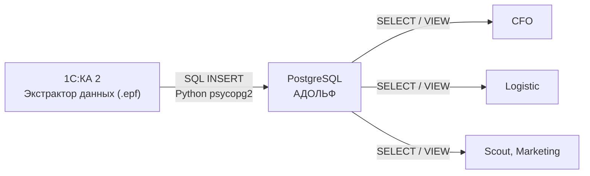

**Модуль:** 1Cexport \
**Версия:** 1.0 \
**Дата:** Февраль 2026

---

## Назначение

Модуль 1Cexport обеспечивает автоматическую выгрузку данных из 1С:Комплексная автоматизация 2 (далее — 1С:КА 2) в PostgreSQL. Является единственным каналом передачи данных из 1С в систему ADOLF.

Передача выполняется инструментом **«Экстрактор данных 1С»** ([Infostart #1970328](https://infostart.ru/marketplace/1970328/)) — внешней обработкой (.epf), которая выполняет произвольные запросы через конструктор 1С и записывает результат напрямую в PostgreSQL через Python psycopg2.

<Note>
Для внешних подрядчиков (программист 1С) система именуется **BRAIN**. Все таблицы в PostgreSQL используют префикс `1C_`.
</Note>

---

## Архитектура

### Компоненты

| Компонент | Роль |
|-----------|------|
| Экстрактор данных 1С (.epf) | Выполняет запросы по расписанию, пишет в PostgreSQL |
| Python 3.8+ &plus; psycopg2 | Драйвер подключения (на сервере 1С) |
| PostgreSQL (ADOLF) | Целевая БД, таблицы `1C_*` |
| Конструктор запросов 1С | Среда создания запросов к метаданным 1С:КА 2 |

---

## Границы модуля

**Входит:** настройка Экстрактора, реестр запросов, структуры таблиц `1C_*`, расписание выгрузок, мониторинг свежести данных.

**Не входит:** обработка данных после загрузки (CFO, Logistic), авторизация и роли ([Core](/core/adolf_core_1_4_open_webui_pwa_auth)), схема PostgreSQL ([Core](/core/adolf_core_2_5_postgresql)).

---

## Потребители данных

| Модуль | Таблицы `1C_*` | Назначение |
|--------|----------------|------------|
| CFO | Q-01..Q-05, Q-10..Q-18 | P&L, себестоимость, ОДДС, ДЗ/КЗ |
| Logistic | Q-06..Q-09, Q-10, Q-18 | Остатки, заказы, поступления |
| Scout | Q-10, Q-13 | Номенклатура, цены |
| Marketing | Q-10, Q-13 | Номенклатура, типы цен |

---

## Особенности базы данных 1С:КА 2

| Параметр | Статус | Влияние |
|----------|--------|---------|
| Номенклатурные группы | Не ведутся | Группировка по «Вид номенклатуры» (= бренд) |
| Группы аналитического учёта | Не ведутся | ABC-классификация средствами ADOLF |
| Штрихкоды при оптовой продаже | Не указываются | Маппинг по артикулу, не по штрихкоду |
| Разбивка выручки по каналам | Отсутствует в сч. 90.01.1 | Разделение опт/МП через фильтрацию по контрагенту |
| Организации | ООО Охана Маркет &plus; ООО ТК Рея | Запросы без фильтра организации (консолидация) |

---

## Связанные документы

| Документ | Связь |
|----------|-------|
| [Core: PostgreSQL](/core/adolf_core_2_5_postgresql) | Общая схема БД, бэкапы, мониторинг |
| [CFO: Data Ingestion](/cfo/adolf_cfo_2_data_ingestion) | Потребитель данных `1C_*` для CFO |
| [Logistic: 1С Integration](/logistic/adolf_logistic_5_1c_integration) | Потребитель данных `1C_*` для Logistic |
| [Каскадные изменения](/cascade_changes_1c_postgresql) | План обновления CFO/Logistic |

---

**Версия:** 1.0 \
**Статус:** Черновик
