# ADOLF v4.2 — ОБЩЕЕ ОПИСАНИЕ СИСТЕМЫ

**Проект:** Корпоративная AI-система автоматизации E-commerce  
**Заказчик:** ОХАНА МАРКЕТ  
**Версия документа:** 4.2  
**Дата:** Январь 2026

---

## 1. Введение

### 1.1 Назначение системы

ADOLF (Automated Digital Operations & Logistics Framework) — корпоративная AI-система для автоматизации операционной деятельности на маркетплейсах. Система объединяет управление знаниями, репутацией, ценообразованием, контентом, рекламой, аналитикой и правовым мониторингом в едином интерфейсе.

### 1.2 Бизнес-контекст

| Параметр | Значение |
|----------|----------|
| Компания | ОХАНА МАРКЕТ (fashion retail) |
| Юридическое лицо | Одно юрлицо, два внутренних бренда |
| Бренд 1 | Охана Маркет — взрослая одежда |
| Бренд 2 | Охана Кидс — детская одежда |
| Маркетплейсы | Wildberries, Ozon, Yandex.Market |
| Целевая аудитория | ~100 сотрудников |
| Менеджеров | 20+ (гибкое распределение по брендам) |

### 1.3 Проблемы и решения

| Проблема | Текущее состояние | Решение ADOLF |
|----------|-------------------|---------------|
| Информация разрознена | Файлы на Google Drive, в чатах, у сотрудников | **Knowledge** — единая база с RAG-поиском |
| Ответы на отзывы | 2-3 часа в день на ручную обработку | **Reputation** — AI генерирует черновики |
| Мониторинг конкурентов | Ручной просмотр, нерегулярно | **Watcher** — автоматический сбор ночью |
| Карточки товаров | Не оптимизированы для SEO | **Content Factory** — генерация описаний |
| Рекламные ставки | Ручная корректировка | **Marketing** — автоматический биддинг |
| Оценка новых ниш | Интуитивно, без данных | **Scout** — расчёт unit-экономики |
| Финансовая отчётность | Подготовка вручную в Excel | **CFO** — автоматический P&L |
| Правовой мониторинг | Нерегулярно, пропускаются изменения | **Lex** — мониторинг правовых баз |

### 1.4 Ключевые принципы

| Принцип | Описание |
|---------|----------|
| **AI-first** | Рутинные операции автоматизированы, человек принимает финальные решения |
| **Единый интерфейс** | Все модули доступны через чат Open WebUI |
| **Разграничение доступа** | Данные фильтруются по роли и бренду |
| **MVP-подход** | Приоритет функциональности над сложностью |
| **Human-in-the-loop** | Критические действия требуют подтверждения |
| **Graceful Degradation** | Сбой одного модуля не влияет на другие |

### 1.5 Состав системы

Система состоит из ядра (Core) и 8 функциональных модулей:

| Компонент | Тип | Назначение | Версия ТЗ |
|-----------|-----|------------|-----------|
| **Core** | Ядро | Инфраструктура, авторизация, ETL, уведомления | 4.1 |
| **Knowledge** | Модуль | Корпоративная база знаний с RAG | 1.1 |
| **Reputation** | Модуль | Управление отзывами и вопросами | 2.1 |
| **Watcher** | Модуль | Мониторинг цен конкурентов | 2.0 |
| **Content Factory** | Модуль | Генерация SEO-контента | 1.0 |
| **Marketing** | Модуль | Автоматизация рекламных ставок | 1.0 |
| **Scout** | Модуль | Предиктивная аналитика ниш | 1.0 |
| **CFO** | Модуль | Финансовый учёт и P&L | 1.0 |
| **Lex** | Модуль | Правовой мониторинг | 1.0 |

---

## 2. Архитектура верхнего уровня

### 2.1 Слои системы

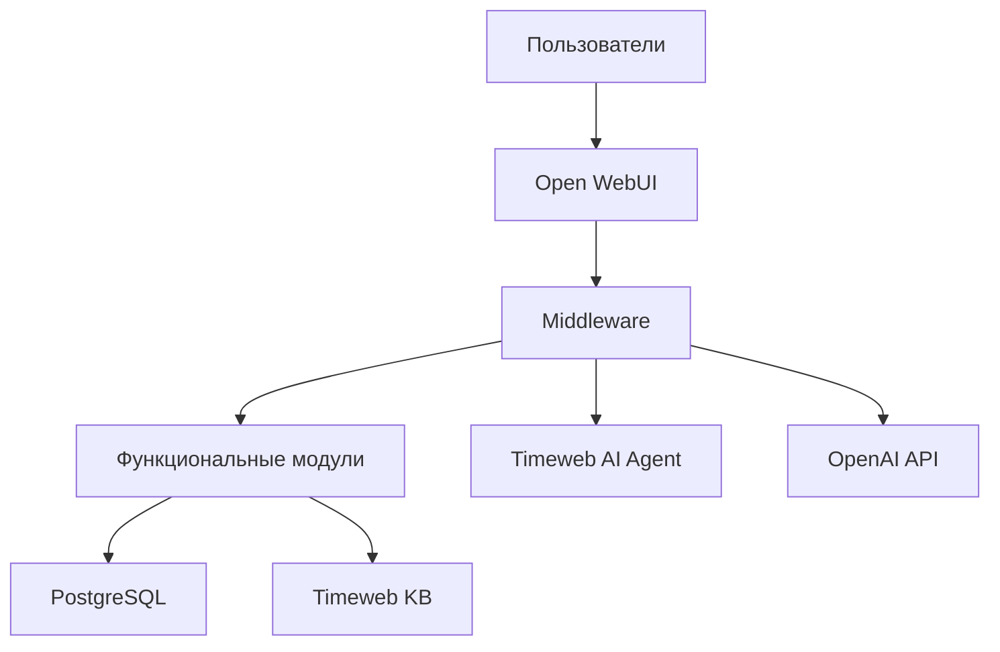

### 2.2 Компоненты Core

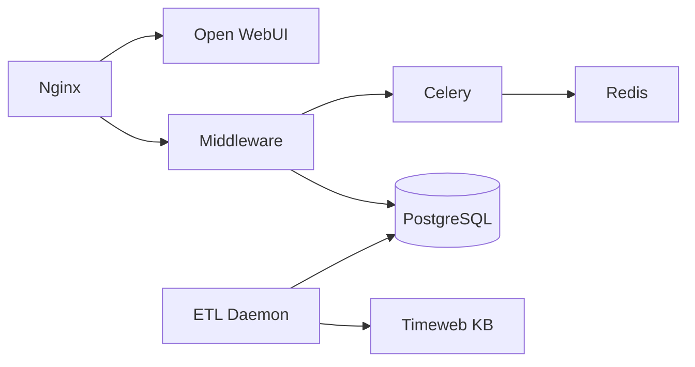

### 2.3 Внешние сервисы

| Категория | Сервис | Назначение |
|-----------|--------|------------|
| **Timeweb Cloud** | AI Agent | RAG, генерация ответов (OpenAI-совместимый API) |
| **Timeweb Cloud** | Knowledge Base | Векторный поиск (Managed OpenSearch) |
| **OpenAI** | GPT-5 mini | OCR, классификация, парсинг данных |
| **OpenAI** | Claude Opus 4.5 | Креативный контент, глубокая аналитика |
| **Маркетплейсы** | Wildberries API | Отзывы, реклама, финансы, контент |
| **Маркетплейсы** | Ozon API | Отзывы, реклама, финансы, контент |
| **Маркетплейсы** | Yandex.Market API | Отзывы, реклама, финансы, контент |

### 2.4 Watcher Agents

Распределённая архитектура с агентами на офисных компьютерах:

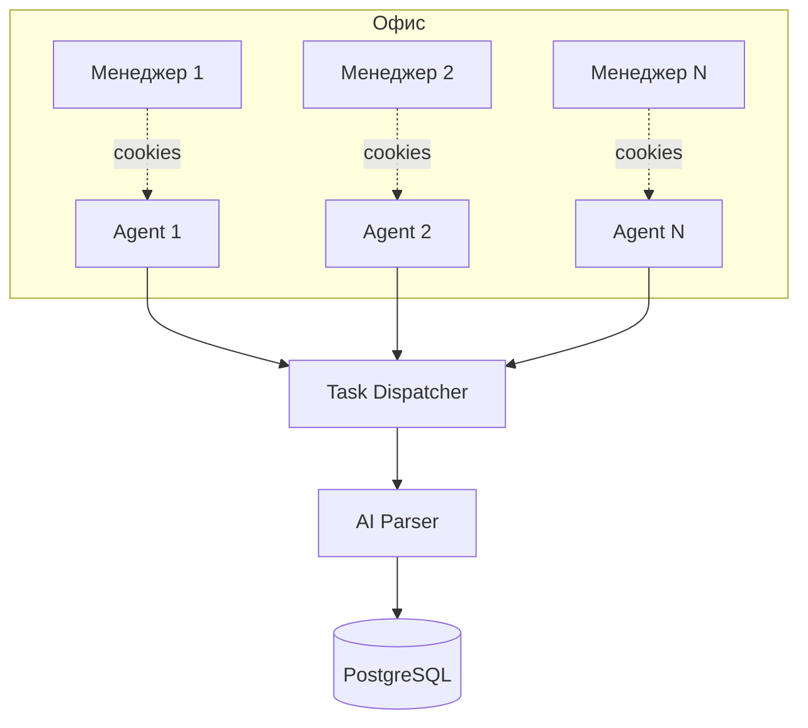

**Ключевая особенность:** Watcher Agent копирует cookies из браузера менеджера в конце рабочего дня и становится «ночным менеджером» — работает от имени сотрудника, получая доступ к СПП, персональным ценам и закрытой информации.

### 2.5 Поток запроса пользователя

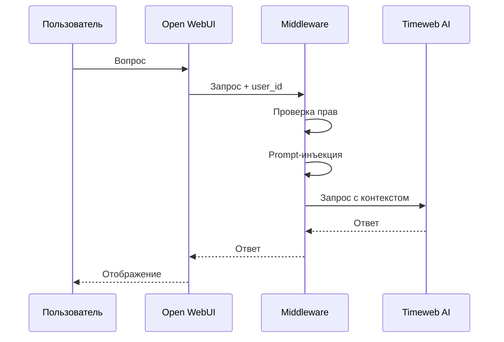

### 2.6 Поток обработки документа (ETL)

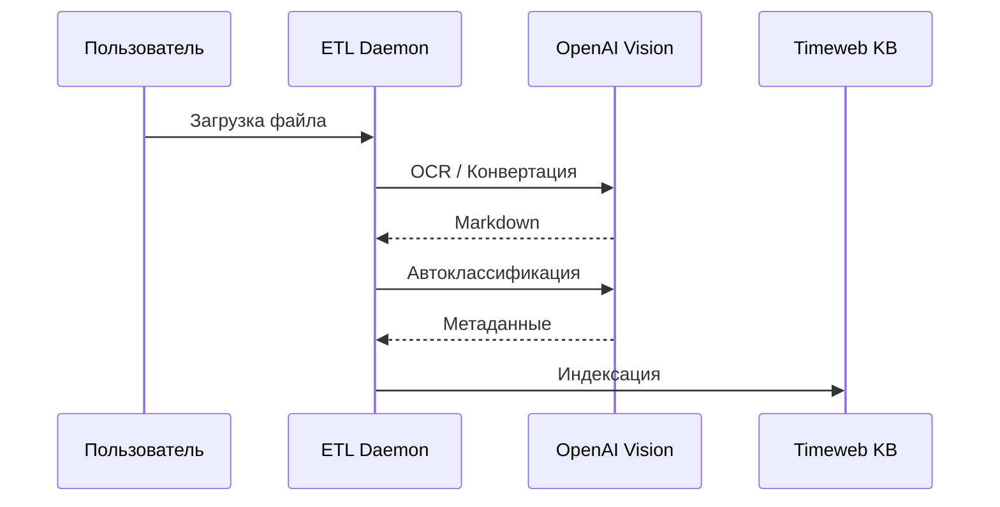

---

## 3. Ролевая модель

### 3.1 Иерархия ролей

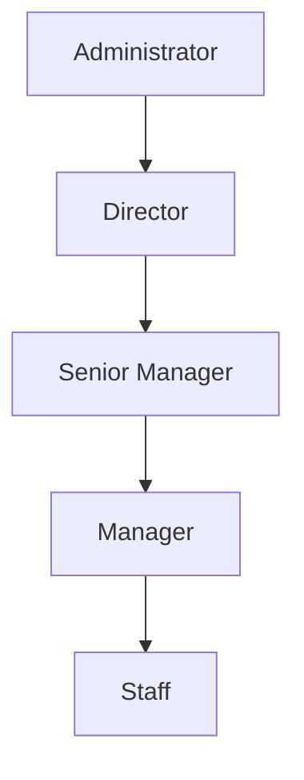

| Роль | Количество | Описание |
|------|------------|----------|
| **Staff** | ~60 | Рядовые сотрудники склада, логистики |
| **Manager** | ~20 | Менеджеры по работе с маркетплейсами |
| **Senior Manager** | ~5 | Старшие менеджеры с доступом ко всем брендам |
| **Director** | 2-3 | Руководители направлений |
| **Administrator** | 1-2 | Системные администраторы |

### 3.2 Матрица доступа к модулям

| Модуль | Staff | Manager | Senior | Director | Admin |
|--------|:-----:|:-------:|:------:|:--------:|:-----:|
| Knowledge (Public) | ✅ | ✅ | ✅ | ✅ | ✅ |
| Knowledge (Manager) | ❌ | Бренд | Все | Все | Все |
| Knowledge (Director) | ❌ | ❌ | ❌ | ✅ | ✅ |
| Reputation | ❌ | Бренд | Все | Все | Все |
| Watcher | ❌ | ✅ | ✅ | ✅ | ✅ |
| Content Factory | ❌ | ❌ | ✅ | ✅ | ✅ |
| Marketing | ❌ | Бренд | Все | Все | Все |
| Scout | ❌ | ❌ | ✅ | ✅ | ✅ |
| CFO (базовый) | ❌ | ❌ | ✅ | ✅ | ✅ |
| CFO (полный) | ❌ | ❌ | ❌ | ✅ | ✅ |
| Lex | ❌ | ✅ | ✅ | ✅ | ✅ |
| Настройки системы | ❌ | ❌ | ❌ | ❌ | ✅ |

### 3.3 Разграничение по брендам

| Пользователь | brand_id | Видимые данные |
|--------------|----------|----------------|
| Manager А | `ohana_market` | Только Охана Маркет |
| Manager Б | `ohana_kids` | Только Охана Кидс |
| Senior Manager | `all` | Оба бренда |
| Director | `all` | Оба бренда + консолидация |
| Administrator | `all` | Все данные системы |

### 3.4 Механизм фильтрации

Фильтрация реализована через **prompt-инъекцию** на уровне Middleware:

```
System: Ты корпоративный ассистент компании ОХАНА МАРКЕТ.

ПРАВИЛА ФИЛЬТРАЦИИ:
- Пользователь: {username}
- Роль: {role}
- Бренд: {brand_id}
- Максимальный уровень доступа: {access_level}

При поиске используй только документы с:
- access_level <= {access_level}
- brand_id IN ({brand_id}, 'shared')
```

---

## 4. Core (Ядро системы)

### 4.1 Назначение

Core — инфраструктурный фундамент системы ADOLF. Все функциональные модули зависят от Core и не могут работать без него. Core обеспечивает:

- Единую точку входа для пользователей
- Авторизацию и разграничение прав доступа
- Маршрутизацию запросов к модулям и AI-сервисам
- Обработку и индексацию документов
- Фоновые задачи и уведомления
- Аудит всех действий

### 4.2 Компоненты Core

| Компонент | Технология | Порт | Назначение |
|-----------|------------|:----:|------------|
| **Nginx** | Nginx 1.24 | 80, 443 | SSL, reverse proxy, rate limiting |
| **Open WebUI** | Docker | 8080 | Чат-интерфейс, Pipelines, Tools, PWA |
| **Middleware** | FastAPI | 8000 | Авторизация, роутинг, prompt-инъекция |
| **ETL Daemon** | Python | — | Обработка документов, OCR |
| **Celery Workers** | Celery | — | Фоновые задачи |
| **Redis** | Redis 7 | 6379 | Брокер сообщений, кэш |
| **PostgreSQL** | PostgreSQL 16 | 5432 | Метаданные, пользователи, аудит |

### 4.3 Open WebUI

Единый интерфейс взаимодействия с системой. Выбран вместо самописного React для сокращения Time-to-Market с 2-3 месяцев до 1-2 недель.

**Pipelines (агенты модулей):**

| Pipeline | Описание | Доступ |
|----------|----------|--------|
| `@Adolf_Knowledge` | Поиск в базе знаний | Все роли |
| `@Adolf_Reputation` | Работа с отзывами | Manager+ |
| `@Adolf_Watcher` | Мониторинг цен | Manager+ |
| `@Adolf_Content` | Генерация контента | Senior+ |
| `@Adolf_Marketing` | Управление рекламой | Manager+ |
| `@Adolf_Scout` | Аналитика ниш | Senior+ |
| `@Adolf_CFO` | Финансовые отчёты | Senior+/Director |
| `@Adolf_Lex` | Правовые вопросы | Manager+ |

**Возможности Open WebUI:**

| Возможность | Описание |
|-------------|----------|
| Чат с AI | Основной способ взаимодействия |
| Pipelines | Агенты для каждого модуля |
| Tools | Function Calling для автовыбора действий |
| PWA | Установка на мобильные устройства |
| WebSocket | Real-time уведомления |
| Markdown/LaTeX | Форматирование, формулы |

### 4.4 Middleware

Центральный компонент бизнес-логики. Все запросы к AI и модулям проходят через Middleware.

| Функция | Описание |
|---------|----------|
| Авторизация | Проверка `user_id`, `role`, `brand_id` из сессии |
| Роутинг | Function Calling для автоматического выбора модуля |
| Prompt-инъекция | Добавление контекста к запросам в AI |
| Фильтрация | Ограничение видимости данных по роли и бренду |
| Логирование | Запись всех действий в `audit_log` |
| Webhooks | Приём событий от модулей, отправка уведомлений |

**API Endpoints:**

| Endpoint | Метод | Назначение |
|----------|-------|------------|
| `/api/v1/auth/session` | GET | Информация о сессии |
| `/api/v1/chat/completions` | POST | Проксирование к AI |
| `/api/v1/knowledge/*` | * | API модуля Knowledge |
| `/api/v1/reputation/*` | * | API модуля Reputation |
| `/api/v1/prices/*` | * | API модуля Watcher |
| `/api/v1/tasks/*` | * | API для Watcher Agents |
| `/api/v1/webhooks/alerts` | POST | Приём алертов |

### 4.5 ETL Daemon

Фоновый процесс обработки входящих документов.

**Pipeline обработки:**

1. **Watchdog** — мониторинг папки `/inbox`
2. **Определение типа** — PDF, DOCX, XLSX, изображение
3. **Конвертация** — OCR через GPT-5 mini Vision → Markdown
4. **Автоклассификация** — `category`, `access_level`, `brand_id`
5. **YAML-заголовок** — добавление метаданных
6. **Индексация** — загрузка в Timeweb KB

**Поддерживаемые форматы:**

| Формат | Метод обработки |
|--------|-----------------|
| PDF (текстовый) | PyMuPDF → Markdown |
| PDF (скан) | GPT-5 mini Vision (OCR) |
| DOCX | python-docx → Markdown |
| XLSX | openpyxl → Markdown таблицы |
| Изображения | GPT-5 mini Vision (OCR) |
| Markdown | Без конвертации |

### 4.6 Система уведомлений

| Источник | Событие | Уровень | Получатели |
|----------|---------|---------|------------|
| Reputation | Новый отзыв | info | Manager (по бренду) |
| Reputation | Негативный отзыв (1-2 ★) | warning | Manager + Senior |
| Watcher | Демпинг-алерт | warning | Manager |
| Marketing | Превышен бюджет | warning | Manager |
| Marketing | Кампания приостановлена | warning | Manager + Senior |
| ETL | Документ в карантине | warning | Administrator |
| System | Ошибка сервиса | critical | Administrator |

---

## 5. Функциональные модули

### 5.1 Knowledge (Корпоративная база знаний)

**Версия ТЗ:** 1.1 (8 разделов)  
**Назначение:** RAG-система для ответов на вопросы сотрудников по внутренним документам.

#### Ключевые функции

| Функция | Описание |
|---------|----------|
| Семантический поиск | Поиск по регламентам, инструкциям, FAQ |
| Информация о товарах | Размерные сетки, состав тканей, характеристики |
| Фильтрация по доступу | Автоматическое ограничение видимости |
| Указание источника | Каждый ответ со ссылкой на документ |

#### Уровни доступа к документам

| Уровень | Код | Кто видит |
|---------|-----|-----------|
| Публичный | `staff` | Все сотрудники |
| Рабочий | `manager` | Manager+ (с фильтрацией по бренду) |
| Аналитика | `senior` | Senior+ |
| Финансы | `director` | Director+ |

#### Типичные запросы

| Роль | Примеры |
|------|---------|
| Staff | «Как оформить возврат?», «Какой состав у артикула X?» |
| Manager | «Регламент работы с браком», «Размерная сетка бренда» |
| Director | «Финансовые отчёты за Q1», «Условия договора с поставщиком» |

#### Зависимости от Core

| Компонент | Использование |
|-----------|---------------|
| Middleware | Авторизация, prompt-инъекция для фильтрации |
| ETL | Конвертация и индексация документов |
| PostgreSQL | Метаданные документов |
| Timeweb KB | Векторный поиск |

---

### 5.2 Reputation (Управление репутацией)

**Версия ТЗ:** 2.1 (7 разделов)  
**Назначение:** Автоматизация работы с отзывами и вопросами покупателей.

#### Ключевые функции

| Функция | Описание |
|---------|----------|
| Polling | Сбор отзывов каждые 15 минут через API |
| AI-анализ | Классификация тональности, выявление тем |
| Vision-анализ | Анализ фотографий на наличие дефектов |
| Генерация ответов | Персонализированные ответы с учётом товара |
| Модерация | Интерфейс для утверждения/редактирования |
| Публикация | Отправка через API маркетплейсов |

#### Workflow

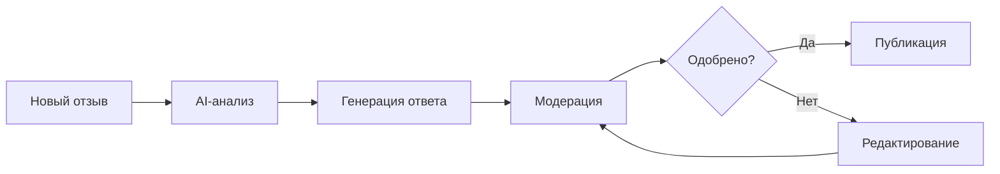

#### Адаптация под бренд

| Бренд | Тон ответов | Пример |
|-------|-------------|--------|
| Охана Маркет | Деловой, экспертный | «Благодарим за обратную связь. Данная модель...» |
| Охана Кидс | Мягкий, дружелюбный | «Спасибо, что поделились! Рады, что малышу понравилось...» |

#### Зависимости

| Компонент | Использование |
|-----------|---------------|
| Middleware | Авторизация, роутинг, фильтрация |
| Knowledge | Данные о товарах для генерации ответов |
| Notifications | Алерты о новых отзывах |
| Celery | Фоновые задачи polling |

---

### 5.3 Watcher (Мониторинг цен)

**Версия ТЗ:** 2.0 (7 разделов)  
**Назначение:** Автоматический сбор данных о ценах и остатках конкурентов.

#### Ключевая особенность

**Watcher Agent копирует cookies из браузера менеджера в конце рабочего дня.** Это позволяет агенту авторизоваться на маркетплейсе как менеджер и видеть:

- Специальные цены (СПП) на Wildberries
- Персональные предложения
- Закрытую информацию о ставках

Фактически, агент становится **«ночным менеджером»** — работает от имени сотрудника, пока тот отдыхает.

#### Ключевые функции

| Функция | Описание |
|---------|----------|
| Распределённый парсинг | Офисные ПК с USB-модемами (3-15 агентов) |
| Browser Cloning | Копирование профиля и cookies Chrome |
| AI-извлечение | GPT-5 mini парсит данные из текста страницы |
| История цен | Хранение 5 лет без агрегации |
| Демпинг-алерты | Уведомления при снижении цены конкурентом |
| Защита от блокировок | Ротация IP, эмуляция поведения, Panic Mode |

#### Объём мониторинга

| Параметр | Значение |
|----------|----------|
| Собственных SKU | ~3 000 (на 3 маркетплейсах) |
| Конкурентов | ~30 продавцов |
| SKU конкурентов | ~30 000 |
| **Всего URL/ночь** | **~33 000** |

#### Режимы работы

| Время | Режим | Описание |
|-------|-------|----------|
| 08:00–20:00 | Дневной | Менеджеры работают, агенты неактивны |
| 20:00–21:00 | Вечерний | Копирование cookies, переключение на модемы |
| 21:00–07:00 | Ночной | Агенты парсят ~33 000 URL |
| 07:00–08:00 | Утренний | Возврат на офисную сеть, очистка |

#### Защита от блокировок

| Механизм | Описание |
|----------|----------|
| USB-модемы | Каждый агент — отдельный мобильный IP |
| Split Tunneling | Трафик агента через модем, системный — через офис |
| Browser Cloning | Реальный профиль Chrome с cookies менеджера |
| IP Semaphore | Один IP — один поток к домену |
| Эмуляция | Скролл, паузы, движения мыши (кривые Безье) |
| Panic Mode | CAPTCHA → остановка + алерт + перезагрузка модема |

#### Потребители данных

| Модуль | Использование данных Watcher |
|--------|------------------------------|
| Marketing | Реальные ставки конкурентов для Bid Correction |
| Scout | Данные о ценах/конкурентах для анализа ниш |
| Lex | Использует инфраструктуру агентов |

---

### 5.4 Content Factory (SEO и контент)

**Версия ТЗ:** 1.0 (7 разделов)  
**Назначение:** Генерация SEO-оптимизированных описаний карточек товаров.

#### Ключевые функции

| Функция | Описание |
|---------|----------|
| Генерация Title | SEO-оптимизированные названия |
| Генерация Description | Продающие описания с ключевыми словами |
| Генерация Attributes | Заполнение характеристик |
| SEO-теги | Ключевые слова для поисковой оптимизации |
| Visual Prompting | ТЗ для дизайнера |
| Модерация | Проверка перед публикацией |
| Автопубликация | Отправка через API маркетплейсов |

#### Pipeline генерации

| Этап | Модель AI | Описание |
|------|-----------|----------|
| Semantics | GPT-5 mini | Анализ конкурентов, TF-IDF, частотный словарь |
| Creative Writing | Claude Opus 4.5 | Генерация Title, Description, Attributes |
| Visual Prompting | GPT-5 mini | ТЗ для дизайнера на основе негативных отзывов |

#### Workflow

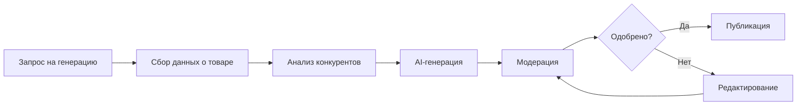

#### Бизнес-метрики

| Метрика | Цель |
|---------|------|
| Рост органического трафика | +20% |
| Время создания карточки | С 2 часов до 15 минут |
| Контент без существенных правок | 90% |

---

### 5.5 Marketing (Биддер)

**Версия ТЗ:** 1.0 (7 разделов)  
**Назначение:** Автоматическое управление рекламными кампаниями.

#### Поддерживаемые типы рекламы

| Платформа | Типы рекламы |
|-----------|--------------|
| **Wildberries** | Аукцион (поиск), Автоматическая кампания, Каталог |
| **Ozon** | Трафареты, Продвижение в поиске, Брендовая полка |
| **Яндекс.Маркет** | Буст продаж, Рекомендации товаров |

#### Ключевые функции

| Функция | Описание |
|---------|----------|
| Управление кампаниями | Создание, редактирование, пауза, архивирование |
| Стратегии биддинга | 4 стратегии автоматической корректировки |
| Safety Logic | Пауза неэффективных ключей/кампаний |
| Budget Control | Контроль дневных и общих бюджетов |
| Bid Correction | Корректировка на основе данных Watcher |
| Мониторинг | CTR, CPC, CPO, ДРР в реальном времени |
| AI-инсайты | Рекомендации по оптимизации (Claude Opus 4.5) |

#### Стратегии биддинга

| Стратегия | Описание | Применение |
|-----------|----------|------------|
| Удержание позиции | Поддержание заданной позиции | Ключевые товары |
| Минимальная цена | Минимальная ставка для показа | Экономия бюджета |
| Агрессивный рост | Максимизация показов | Новые товары, акции |
| ROI-оптимизация | Ставка на основе целевого ДРР | Рентабельность |

#### Safety Logic

| Условие | Действие |
|---------|----------|
| CTR < Target AND Views > 1000 | Пауза ключа |
| Spent ≥ Daily Limit | Пауза кампании |
| ДРР > Max ДРР | Пауза ключа |
| Рекомендуемая ставка > Max Bid | Не повышать + алерт |

#### Алгоритм работы (каждые 15 минут)

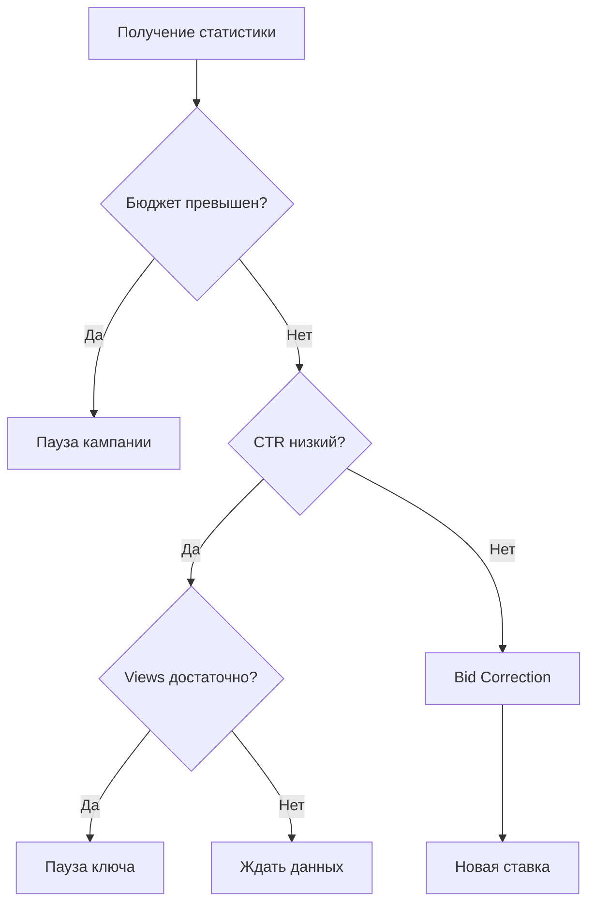

#### Зависимости

| Компонент | Использование |
|-----------|---------------|
| Middleware | Роутинг, API маркетплейсов |
| Watcher | **Обязательно** — данные о ставках конкурентов |
| Notifications | Алерты о событиях |

---

### 5.6 Scout (Предиктивная аналитика)

**Версия ТЗ:** 1.0 (7 разделов)  
**Назначение:** Оценка целесообразности выхода в новую товарную нишу.

#### Ключевые функции

| Функция | Описание |
|---------|----------|
| Trend Mining | Анализ динамики спроса (Wordstat, MP Analytics) |
| Competitor Analysis | ТОП-50 товаров категории, Monopoly Rate |
| Unit-Calc | Расчёт unit-экономики с учётом всех расходов |
| AI Verdict | Рекомендация «светофор» с обоснованием |
| History | Сохранение всех анализов |
| Export | Выгрузка в PDF/Excel |

#### Система «Светофор»

**Метрики для оценки:**

| Метрика | Описание | Источник |
|---------|----------|----------|
| Trend Slope | Коэффициент роста/падения спроса | Wordstat, MP Analytics |
| Monopoly Rate | Доля рынка ТОП-3 продавцов | Watcher |
| Expected Margin | Расчётная чистая маржа | Unit-Calc |

**Пороговые значения:**

| Метрика | 🟢 GREEN | 🟡 YELLOW | 🔴 RED |
|---------|----------|-----------|--------|
| Trend Slope | > 0.15 | 0–0.15 | < 0 |
| Monopoly Rate | < 50% | 50–70% | > 70% |
| Expected Margin | > 25% | 15–25% | < 15% |

**Итоговый вердикт:**

| Вердикт | Условие |
|---------|---------|
| 🟢 **GO** | Все зелёные или 2 зелёные + 1 жёлтая |
| 🟡 **CONSIDER** | Смешанные показатели |
| 🔴 **RISKY** | Хотя бы одна красная или все жёлтые |

#### Входные данные

| Параметр | Формат | Пример |
|----------|--------|--------|
| Категория | URL или текст | «летние платья, Wildberries» |
| Закупочная цена | Число или диапазон | 500 ₽ или «от 400 до 600» |

#### Зависимости

| Компонент | Использование |
|-----------|---------------|
| Middleware | Роутинг, фильтрация |
| Watcher | **Обязательно** — данные о конкурентах |

---

### 5.7 CFO (Финансовый директор)

**Версия ТЗ:** 1.0 (7 разделов)  
**Назначение:** Управленческий учёт, P&L, ABC-анализ.

#### Ключевые функции

| Функция | Описание |
|---------|----------|
| Data Ingestion | Ежедневный импорт из API маркетплейсов и Excel |
| Cost Mapping | Сопоставление выручки с себестоимостью из 1С |
| P&L Reports | Отчёты по SKU, категориям, брендам, маркетплейсам |
| ABC-анализ | Классификация SKU по вкладу в прибыль |
| AI Insights | Текстовые выводы и рекомендации |
| Custom Reports | Кастомные отчёты по запросу директора |
| Alerts | Уведомления об убыточных SKU и аномалиях |

#### ABC-анализ

| Класс | Доля в прибыли | Описание |
|:-----:|:--------------:|----------|
| **A** | 80% | Ключевые SKU, генерирующие основную прибыль |
| **B** | 15% | Средние SKU со стабильным вкладом |
| **C** | 5% | Аутсайдеры с минимальным вкладом |
| **D** | — | Убыточные SKU (отрицательная маржа) |

#### Источники данных

| Источник | Периодичность | Данные |
|----------|---------------|--------|
| Wildberries API | Ежедневно | Продажи, комиссии, логистика |
| Ozon API | Ежедневно | Транзакции |
| Яндекс.Маркет API | Ежедневно | Транзакции |
| 1С (XLS/CSV) | Еженедельно | Barcode → COGS |

#### Учитываемые расходы (v1.0)

- Себестоимость товара (COGS)
- Комиссия маркетплейса
- Логистика до покупателя
- Обратная логистика (возвраты)
- Хранение на складе МП
- Реклама на маркетплейсах

#### Доступ к функциям

| Функция | Senior | Director | Admin |
|---------|:------:|:--------:|:-----:|
| P&L по категориям | ✅ | ✅ | ✅ |
| P&L по брендам | ✅ | ✅ | ✅ |
| ABC-анализ | ✅ | ✅ | ✅ |
| P&L по SKU | ❌ | ✅ | ✅ |
| Консолидированный P&L | ❌ | ✅ | ✅ |
| Себестоимость по SKU | ❌ | ✅ | ✅ |
| Кастомные отчёты | ❌ | ✅ | ✅ |

#### Зависимости

| Компонент | Использование |
|-----------|---------------|
| Middleware | Фильтрация по роли |
| ETL | Импорт файлов из 1С |
| PostgreSQL | Таблица `financial_transactions` |
| Knowledge | Хранение бухгалтерской первички |

---

### 5.8 Lex (Правовой мониторинг)

**Версия ТЗ:** 1.0 (7 разделов)  
**Назначение:** Автоматический сбор правовых документов для e-commerce.

#### Ключевая особенность

**Lex работает на инфраструктуре Watcher**, но с другими целями:

| Параметр | Watcher | Lex |
|----------|---------|-----|
| Цели парсинга | WB, Ozon, YM | КонсультантПлюс, Гарант |
| Тип данных | Цены, остатки, рейтинги | Правовые документы |
| Output | JSON → PostgreSQL | Markdown → Knowledge Base |
| Cookies | Требуются (менеджера МП) | Не требуются |
| Расписание | Ежедневно 21:00–07:00 | Выходные + вечера |

#### Ключевые функции

| Функция | Описание |
|---------|----------|
| Парсинг источников | КонсультантПлюс, Гарант (в окна бесплатного доступа) |
| AI-фильтрация | Оценка релевантности для fashion e-commerce |
| AI-классификация | Категория, уровень релевантности |
| AI-резюме | Краткое описание и влияние на бизнес |
| Индексация | Загрузка в Knowledge Base |
| Алерты | Уведомления о новых документах |

#### Категории документов

| Категория | Код | Примеры |
|-----------|-----|---------|
| Торговля | `trade` | Маркетплейсы, дистанционная торговля |
| Маркировка | `marking` | Честный ЗНАК, лёгкая промышленность |
| Права потребителей | `consumer_rights` | Возврат, гарантия, претензии |
| Реклама | `advertising` | Интернет-реклама, таргетинг |
| Налоги | `tax` | НДС, УСН, налог на прибыль |
| Труд | `labor` | Удалённая работа, ГПХ |
| Персональные данные | `personal_data` | Обработка ПДн |

#### Уровни релевантности

| Уровень | Код | Описание |
|---------|-----|----------|
| Высокая | `high` | Напрямую влияет (маркетплейсы, маркировка одежды) |
| Средняя | `medium` | Косвенно влияет (общие нормы торговли, налоги) |
| Низкая | `low` | Потенциально релевантно (смежные отрасли) |

#### Зависимости

| Компонент | Использование |
|-----------|---------------|
| Watcher | **Обязательно** — инфраструктура агентов |
| Knowledge | Хранение документов |
| ETL | Индексация |
| Notifications | Алерты |

---

## 6. Технологический стек

### 6.1 Backend

| Компонент | Технология | Версия |
|-----------|------------|--------|
| API | FastAPI | 0.109+ |
| Фоновые задачи | Celery | 5.3+ |
| Брокер | Redis | 7.x |
| База данных | PostgreSQL | 16 |
| Векторный поиск | OpenSearch | Managed |
| Web-сервер | Nginx | 1.24 |
| Контейнеризация | Docker | 24.x |

### 6.2 Frontend

| Компонент | Технология |
|-----------|------------|
| Интерфейс | Open WebUI |
| Real-time | WebSocket |
| Мобильные | PWA |

### 6.3 AI-модели

| Задача | Модель | Провайдер |
|--------|--------|-----------|
| Рутинные операции | GPT-5 mini | OpenAI |
| OCR, классификация | GPT-5 mini Vision | OpenAI |
| Креатив, аналитика | Claude Opus 4.5 | Anthropic |
| RAG | Timeweb AI Agent | Timeweb |
| Embeddings | text-embedding-3-small | OpenAI |

### 6.4 Инфраструктура

| Компонент | Провайдер |
|-----------|-----------|
| VPS | Timeweb Cloud (4 vCPU, 8 GB) |
| PostgreSQL | Timeweb Managed |
| AI Agent + KB | Timeweb Cloud |
| SSL | Let's Encrypt |
| Watcher Agents | Офисные ПК (3-15 шт.) + USB-модемы |

### 6.5 Основные библиотеки Python

| Библиотека | Назначение |
|------------|------------|
| FastAPI | REST API framework |
| SQLAlchemy | ORM для PostgreSQL |
| Celery | Фоновые задачи |
| aiohttp | Асинхронные HTTP-запросы |
| Playwright | Браузерная автоматизация (Watcher) |
| PyMuPDF | Обработка PDF |
| python-docx | Обработка DOCX |
| openpyxl | Обработка XLSX |
| Pydantic | Валидация данных |

---

## 7. План реализации

### 7.1 Этапы внедрения

| Этап | Название | Период | Длительность | Модули |
|:----:|----------|--------|:------------:|--------|
| 0 | Core | Янв–Фев | 8 недель | Инфраструктура, Open WebUI, Middleware, ETL |
| 1 | Операции | Мар–Апр | 9 недель | Knowledge, Reputation, Watcher |
| 2 | Продажи | Май–Июн | 9 недель | Content Factory, Marketing, Scout |
| 3 | Риски | Июл–Авг | 9 недель | CFO, Lex, Интеграционное тестирование |

### 7.2 Диаграмма Ганта

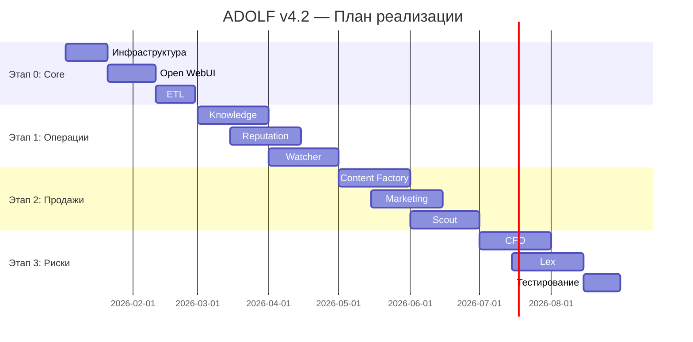

### 7.3 Ключевые даты (Milestones)

| Дата | Milestone | Критерий готовности |
|------|-----------|---------------------|
| **28.02.2026** | Core Ready | Open WebUI работает, ETL обрабатывает документы |
| **30.04.2026** | Ops Ready | Knowledge, Reputation, Watcher в production |
| **30.06.2026** | Sales Ready | Content Factory, Marketing, Scout в production |
| **31.08.2026** | Full Release | Все 8 модулей, обучение персонала завершено |

### 7.4 Зависимости модулей

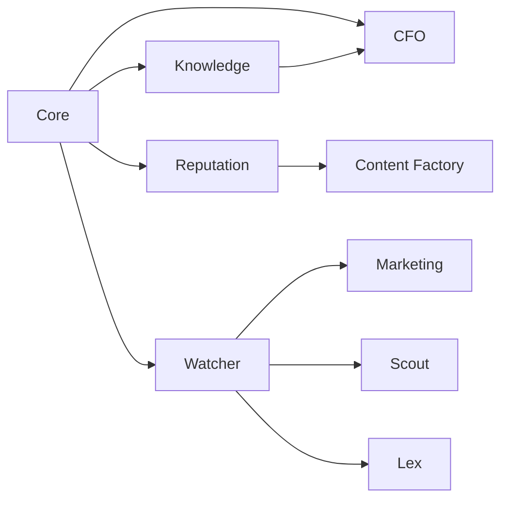

---

## 8. Глоссарий

| Термин | Определение |
|--------|-------------|
| **ADOLF** | Automated Digital Operations & Logistics Framework — название системы |
| **Core** | Ядро системы: инфраструктура, авторизация, ETL, уведомления |
| **Middleware** | FastAPI-сервис между Open WebUI и AI/модулями |
| **ETL** | Extract-Transform-Load — процесс обработки документов |
| **KB** | Knowledge Base — база знаний (Timeweb OpenSearch) |
| **RAG** | Retrieval-Augmented Generation — поиск + генерация ответа |
| **Pipeline** | Агент в Open WebUI с набором инструментов |
| **Function Calling** | Автоматический выбор инструмента LLM на основе запроса |
| **Prompt-инъекция** | Добавление контекста (роль, бренд) в запрос к AI |
| **Watcher Agent** | Клиентское приложение на офисном ПК для парсинга |
| **Browser Cloning** | Копирование профиля и cookies браузера менеджера |
| **Split Tunneling** | Разделение трафика: агент через модем, система через офис |
| **Panic Mode** | Аварийная остановка агента при CAPTCHA/блокировке |
| **Демпинг-алерт** | Уведомление о снижении цены конкурентом ниже порога |
| **СПП** | Скидка постоянного покупателя (Wildberries) |
| **Unit-экономика** | Расчёт прибыльности единицы товара |
| **ABC-анализ** | Классификация SKU по вкладу в прибыль (A-80%, B-15%, C-5%) |
| **Monopoly Rate** | Доля рынка, занятая ТОП-3 продавцами в категории |
| **ДРР** | Доля рекламных расходов |
| **Safety Logic** | Автоматические правила защиты от неэффективных расходов |
| **TF-IDF** | Term Frequency-Inverse Document Frequency — метод оценки важности слов |

---

## Приложение А: Бюджет инфраструктуры

### Ежемесячные расходы

| Статья | Сумма |
|--------|------:|
| VPS (4 vCPU, 8 GB) | ~3 000 ₽ |
| PostgreSQL (Managed) | ~1 500 ₽ |
| Timeweb AI + KB | ~2 500 ₽ |
| GPT-5 mini | ~3 000 ₽ |
| Claude Opus 4.5 | ~4 000 ₽ |
| Прочее | ~1 000 ₽ |
| **Итого** | **~15 000 ₽** |

### Единоразовые расходы

| Статья | Сумма |
|--------|------:|
| USB-модемы Huawei E3372h (5 шт.) | ~5 000 ₽ |
| SIM-карты (5 шт.) | ~1 500 ₽ |
| **Итого** | **~6 500 ₽** |

---

## Приложение Б: Структура документации модулей

Каждый модуль имеет унифицированную структуру из 7-8 разделов:

| Раздел | Содержание |
|--------|------------|
| 0. Introduction | Обзор, роли, быстрый старт |
| 1. Architecture | Компоненты, зависимости, интеграции |
| 2. Data Sources / Adapters | Источники данных, API маркетплейсов |
| 3. AI Pipeline | Алгоритмы обработки, промпты |
| 4. Open WebUI | Pipeline, Tools, интерфейс |
| 5. Database | Схема базы данных |
| 6. Scenarios | Пользовательские сценарии |
| 7. Celery | Фоновые задачи |

### Текущее состояние документации

| Модуль | Разделов | Объём | Статус |
|--------|:--------:|------:|--------|
| Core | 6+ | ~200 КБ | ✅ Готово |
| Knowledge | 8 | ~70 КБ | ✅ Готово |
| Reputation | 7 | ~140 КБ | ✅ Готово |
| Watcher | 7 | ~300 КБ | ✅ Готово |
| Content Factory | 7 | ~260 КБ | ✅ Готово |
| Marketing | 7 | ~330 КБ | ✅ Готово |
| Scout | 7 | ~380 КБ | ✅ Готово |
| CFO | 7 | ~260 КБ | ✅ Готово |
| Lex | 7 | ~280 КБ | ✅ Готово |

---

## Приложение В: Функционал v2.0 (планы)

| Модуль | Планируемый функционал |
|--------|------------------------|
| **Core** | Голосовой интерфейс (STT/TTS), Push-уведомления (PWA), Grafana-дашборд |
| **Knowledge** | Версионирование документов, автоматическая переиндексация |
| **Reputation** | Vision Analyzer — анализ фото на брак, Cross-Sell Engine |
| **Watcher** | Split Tunneling, 3-5 потоков на агент, продвинутая эмуляция |
| **Content Factory** | Rich-контент (HTML), Vision-анализ фото, интеграция с Reputation |
| **Marketing** | Автовозобновление ключей, A/B тестирование, интеграция с CFO |
| **Scout** | Интеграция с CFO, автомониторинг ниш, учёт сезонности |
| **CFO** | Прямая интеграция 1С, расширенные расходы, бюджетирование |
| **Lex** | Дополнительные источники (6 шт.), дайджесты, интеграции с модулями |

---

## Приложение Г: Контакты и ответственные

| Область | Ответственный |
|---------|---------------|
| Техническая архитектура | Backend Team Lead |
| Инфраструктура | DevOps |
| Бизнес-процессы | Project Manager |
| Финансы | Director |
| Юридические вопросы | Director + внешний юрист |

---

**Документ подготовлен:** Январь 2026  
**Версия документа:** 4.2  
**Статус:** Актуальная версия  
**Заменяет:** ADOLF_OVERVIEW_v4_1.md, ADOLF_OVERVIEW_v4_0.md
