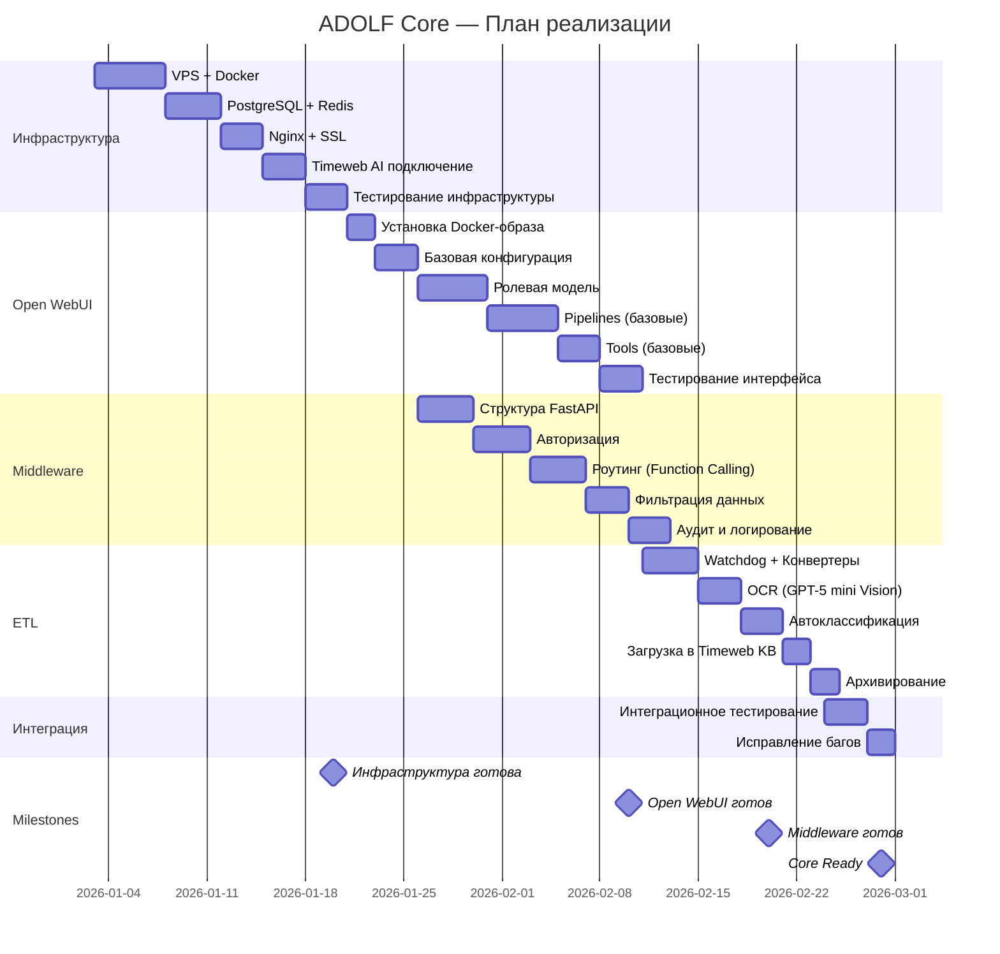
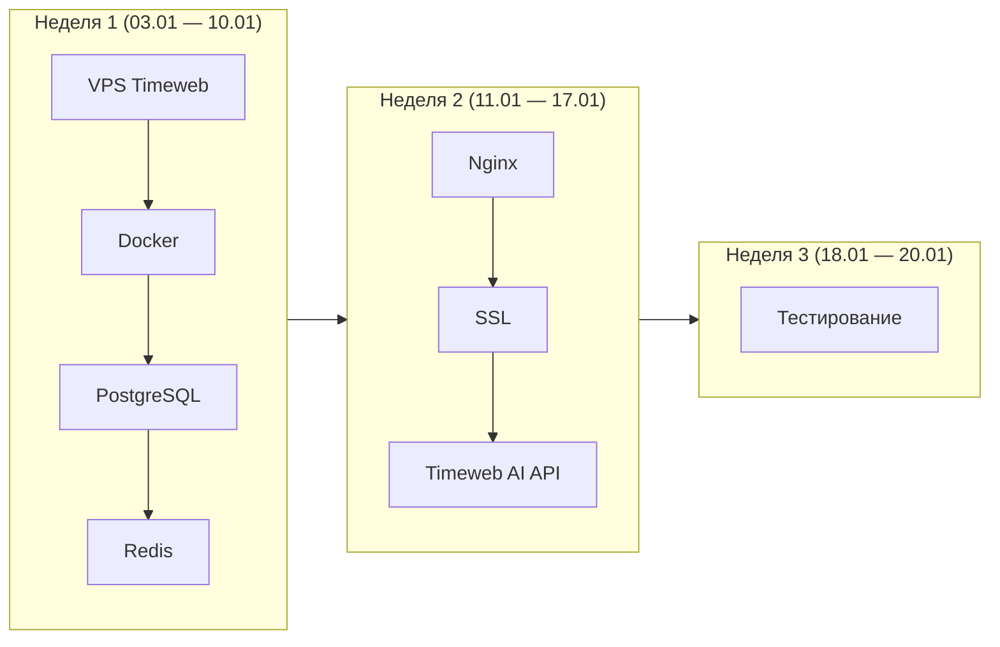
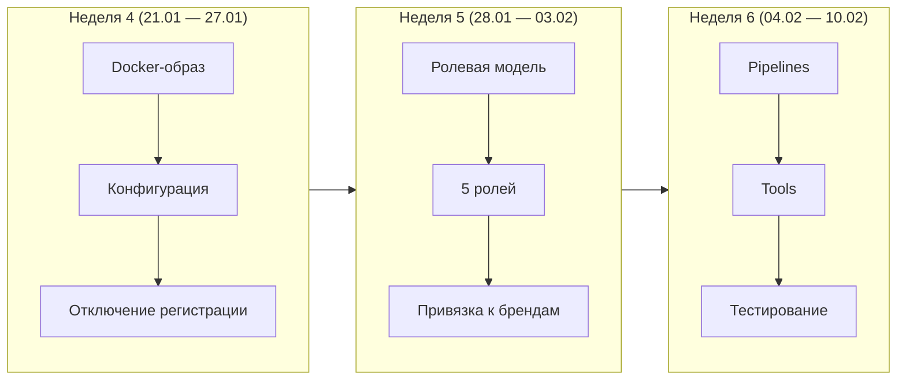
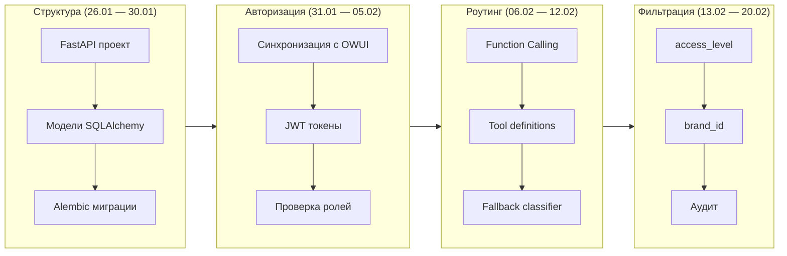
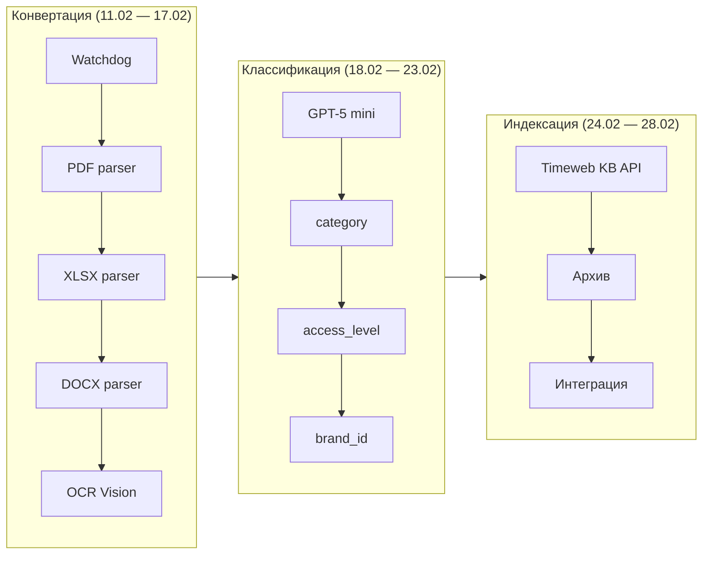
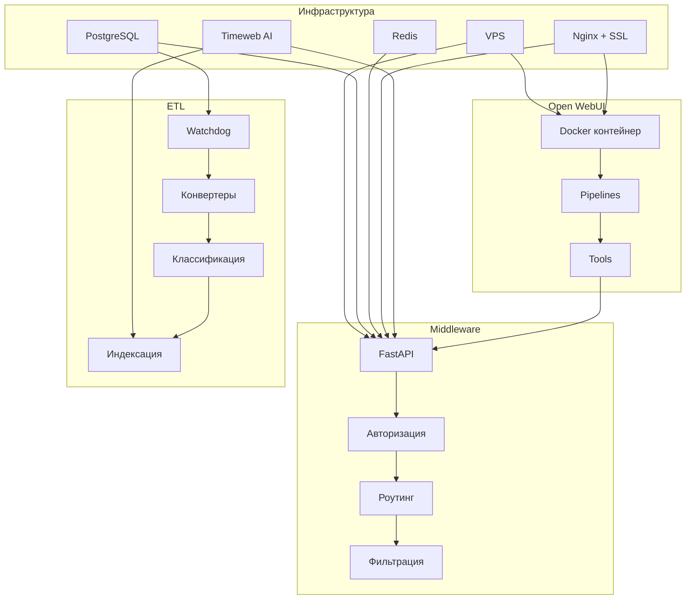

# ADOLF CORE v4.0 — ПЛАН РЕАЛИЗАЦИИ

**Модуль:** Core (Ядро системы)  
**Период:** 03.01.2026 — 28.02.2026  
**Длительность:** 8 недель

---

## 1. Обзор

### 1.1 Цель этапа

Развёртывание базовой инфраструктуры системы Adolf. Без завершения Core подключение функциональных модулей невозможно.

### 1.2 Ключевые вехи

| Дата | Веха | Критерий готовности |
|------|------|---------------------|
| **20.01.2026** | Инфраструктура | VPS, PostgreSQL, Nginx, SSL работают |
| **10.02.2026** | Open WebUI | Чат-интерфейс доступен, авторизация настроена |
| **20.02.2026** | Middleware | API работает, роутинг и фильтрация готовы |
| **28.02.2026** | ETL | Документы обрабатываются и индексируются |
| **28.02.2026** | **Core Ready** | Все компоненты интегрированы |

---

## 2. Диаграмма Ганта

---

## 3. Детализация по вехам

### 3.1 Веха 1: Инфраструктура

**Период:** 03.01 — 20.01.2026 (18 дней)

| Дата | Задача | Результат |
|------|--------|-----------|
| 03.01 | Заказ VPS (4 vCPU, 8 GB RAM) | Сервер доступен по SSH |
| 03.01 | Настройка DNS adolf.su | Домен резолвится |
| 04.01 | Установка Docker, Docker Compose | `docker --version` работает |
| 05.01 | Настройка UFW (порты 22, 80, 443) | Firewall активен |
| 06.01 | Заказ Managed PostgreSQL | Строка подключения получена |
| 07.01 | Установка Redis | `redis-cli PING` → PONG |
| 08.01 | Создание базы данных, пользователей | Миграции применены |
| 10.01 | Установка Nginx | Сервер отвечает на :80 |
| 11.01 | Настройка SSL (Let's Encrypt) | https://adolf.su доступен |
| 12.01 | Настройка Reverse Proxy | WebSocket работает |
| 15.01 | Получение API-ключей Timeweb AI | Тестовый запрос успешен |
| 18.01 — 20.01 | Интеграционное тестирование | Все компоненты связаны |

**Критерий готовности:**
- [ ] VPS работает, SSH доступен
- [ ] https://adolf.su отвечает
- [ ] PostgreSQL подключается
- [ ] Redis отвечает
- [ ] Timeweb AI API работает

---

### 3.2 Веха 2: Open WebUI

**Период:** 21.01 — 10.02.2026 (21 день)

| Дата | Задача | Результат |
|------|--------|-----------|
| 21.01 | Запуск Open WebUI (Docker) | Контейнер running |
| 22.01 | Базовая конфигурация | Переменные окружения заданы |
| 23.01 | Отключение регистрации | ENABLE_SIGNUP=false |
| 24.01 | Создание администратора | Первый пользователь создан |
| 25.01 | Настройка OPENAI_API_BASE_URL → Middleware | Чат работает |
| 28.01 | Создание ролей (Staff, Manager, Senior, Director, Admin) | Роли в системе |
| 30.01 | Привязка пользователей к брендам | brand_id в профилях |
| 01.02 | Матрица доступа к меню | Меню фильтруется по роли |
| 04.02 | Pipeline @Adolf (основной) | Чат отвечает |
| 06.02 | Pipeline @Adolf_KB (загрузка) | Файлы загружаются |
| 07.02 | Tool knowledge_search | Поиск в KB работает |
| 08.02 | Tool system_status | Статус системы отображается |
| 09.02 — 10.02 | Тестирование интерфейса | Все роли проверены |

**Критерий готовности:**
- [ ] Open WebUI доступен по https://adolf.su
- [ ] Авторизация работает
- [ ] 5 ролей настроены
- [ ] Меню фильтруется по ролям
- [ ] Базовые Pipelines и Tools работают

---

### 3.3 Веха 3: Middleware

**Период:** 26.01 — 20.02.2026 (параллельно с Open WebUI)

| Дата | Задача | Результат |
|------|--------|-----------|
| 26.01 | Создание FastAPI проекта | Структура каталогов |
| 27.01 | Модели SQLAlchemy | ORM готов |
| 28.01 | Alembic миграции | Таблицы созданы |
| 29.01 | Pydantic схемы | Валидация данных |
| 30.01 | Health endpoints | /health отвечает |
| 31.01 | Синхронизация пользователей OWUI → PostgreSQL | owui_id связан |
| 02.02 | JWT валидация | Токены проверяются |
| 04.02 | Проверка ролей в запросах | X-User-Role передаётся |
| 06.02 | OpenAI-compatible /v1/chat/completions | Endpoint работает |
| 08.02 | Function Calling (tools) | LLM вызывает инструменты |
| 10.02 | Fallback classifier | Неопределённые запросы обрабатываются |
| 13.02 | Фильтрация по access_level | Документы фильтруются |
| 15.02 | Фильтрация по brand_id | Бренды разделены |
| 17.02 | Таблица audit_log | Действия логируются |
| 19.02 — 20.02 | Тестирование Middleware | API стабилен |

**Критерий готовности:**
- [ ] /v1/chat/completions работает
- [ ] Function Calling вызывает Tools
- [ ] Фильтрация по роли и бренду работает
- [ ] Аудит записывается

---

### 3.4 Веха 4: ETL

**Период:** 11.02 — 28.02.2026 (17 дней)

| Дата | Задача | Результат |
|------|--------|-----------|
| 11.02 | Watchdog daemon | Отслеживание /inbox |
| 12.02 | PDF parser (pdfplumber) | Текст извлекается |
| 13.02 | XLSX parser (pandas) | Таблицы читаются |
| 14.02 | DOCX parser (python-docx) | Документы читаются |
| 15.02 | OCR (GPT-5 mini Vision) | Сканы распознаются |
| 16.02 | Определение типа файла | Маршрутизация работает |
| 17.02 | Карантин ошибок | Битые файлы изолируются |
| 18.02 | Промпт автоклассификации | JSON возвращается |
| 19.02 | Трёхступенчатый процесс | Повторная классификация работает |
| 20.02 | Модерация (Senior Manager) | Workflow готов |
| 21.02 | YAML-заголовки | Метаданные добавляются |
| 22.02 | Timeweb KB API интеграция | Документы загружаются |
| 23.02 | Структура архива | Файлы архивируются |
| 24.02 — 26.02 | Интеграционное тестирование | Полный цикл работает |
| 27.02 — 28.02 | Исправление багов | Core стабилен |

**Критерий готовности:**
- [ ] Файлы обрабатываются автоматически
- [ ] Классификация работает
- [ ] Документы появляются в KB
- [ ] Архив структурирован

---

## 4. Зависимости компонентов

---

## 5. Риски этапа Core

| Риск | Вероятность | Влияние | Митигация |
|------|-------------|---------|-----------|
| Задержка заказа VPS | Низкая | Высокое | Заказать в первый день |
| Проблемы с SSL | Средняя | Среднее | Резервный Cloudflare |
| Лимиты Timeweb AI | Низкая | Высокое | Fallback на OpenAI |
| Несовместимость Open WebUI | Средняя | Среднее | Тестирование на dev |
| Ошибки OCR | Средняя | Низкое | Карантин + ручная обработка |

---

## 6. Чек-лист готовности Core

### Инфраструктура (20.01)
- [ ] VPS работает
- [ ] Docker установлен
- [ ] PostgreSQL подключается
- [ ] Redis работает
- [ ] Nginx + SSL настроены
- [ ] Timeweb AI API работает

### Open WebUI (10.02)
- [ ] Интерфейс доступен
- [ ] Авторизация работает
- [ ] Роли настроены (5 ролей)
- [ ] Pipelines работают
- [ ] Tools вызываются

### Middleware (20.02)
- [ ] /v1/chat/completions работает
- [ ] Function Calling работает
- [ ] Фильтрация по access_level
- [ ] Фильтрация по brand_id
- [ ] Аудит записывается

### ETL (28.02)
- [ ] Watchdog отслеживает /inbox
- [ ] PDF/XLSX/DOCX конвертируются
- [ ] OCR распознаёт сканы
- [ ] Классификация работает
- [ ] Документы в Timeweb KB
- [ ] Архив структурирован

### Core Ready (28.02)
- [ ] Все компоненты интегрированы
- [ ] Интеграционные тесты пройдены
- [ ] Документация готова

---

## Приложение: Календарь

| Неделя | Период | Фокус | Веха |
|--------|--------|-------|------|
| 1 | 03.01 — 10.01 | VPS, Docker, PostgreSQL, Redis | — |
| 2 | 11.01 — 17.01 | Nginx, SSL, Timeweb AI | — |
| 3 | 18.01 — 20.01 | Тестирование инфраструктуры | **Инфраструктура** |
| 4 | 21.01 — 27.01 | Open WebUI установка | — |
| 5 | 28.01 — 03.02 | Ролевая модель, Middleware структура | — |
| 6 | 04.02 — 10.02 | Pipelines, Tools, авторизация | **Open WebUI** |
| 7 | 11.02 — 17.02 | ETL конвертеры, Middleware роутинг | — |
| 8 | 18.02 — 20.02 | Классификация, фильтрация | **Middleware** |
| 8 | 21.02 — 28.02 | Индексация, интеграция | **ETL, Core Ready** |

---

**Документ подготовлен:** Январь 2026  
**Версия:** 4.0
