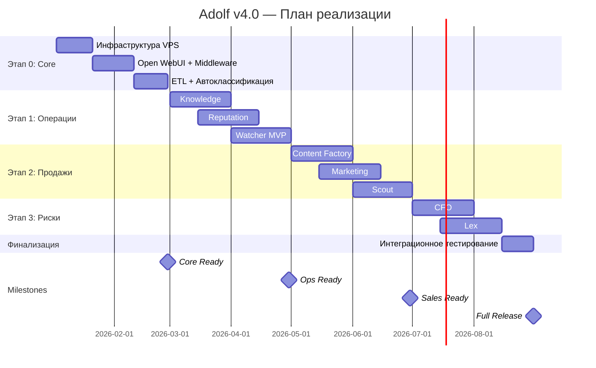
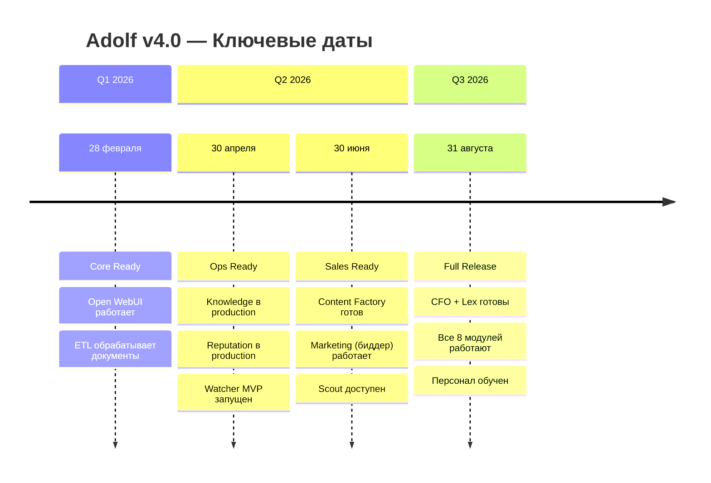

# ADOLF v4.0 — ПЛАН РЕАЛИЗАЦИИ (ROADMAP)

**Проект:** Корпоративная AI-система автоматизации E-commerce  
**Заказчик:** ОХАНА МАРКЕТ  
**Период:** 03.01.2026 — 31.08.2026  
**Версия:** 4.0

---

## 1. Обзор

### 1.1 Общая продолжительность

| Параметр | Значение |
|----------|----------|
| Старт проекта | 03 января 2026 |
| Завершение | 31 августа 2026 |
| Длительность | 8 месяцев |
| Количество этапов | 4 |
| Количество модулей | 8 + Core |

### 1.2 Структура этапов

| Этап | Название | Период | Модули |
|------|----------|--------|--------|
| 0 | Core (Фундамент) | Январь — Февраль | Инфраструктура, Open WebUI, ETL |
| 1 | Операции | Март — Апрель | Knowledge, Reputation, Watcher |
| 2 | Продажи | Май — Июнь | Content Factory, Marketing, Scout |
| 3 | Риски | Июль — Август | CFO, Lex, Тестирование |

---

## 2. Диаграмма Ганта



---

## 3. Детализация по этапам

### 3.1 Этап 0: Core (Фундамент)

**Период:** 03.01.2026 — 28.02.2026  
**Продолжительность:** 8 недель  
**Milestone:** Core Ready

#### Инфраструктура VPS

| Период | 03.01 — 20.01.2026 |
|--------|---------------------|
| Длительность | 18 дней |

**Задачи:**

| № | Задача | Срок |
|---|--------|------|
| 1 | Заказ VPS (Timeweb Cloud, 4 vCPU, 8 GB RAM) | 03.01 |
| 2 | Настройка DNS adolf.su | 03.01 |
| 3 | Установка Docker, Docker Compose | 04.01 |
| 4 | Настройка Nginx, SSL (Let's Encrypt) | 05.01 |
| 5 | Заказ Managed PostgreSQL | 06.01 |
| 6 | Настройка Redis | 07.01 |
| 7 | Настройка VPN/Firewall | 08.01 |
| 8 | Подключение Timeweb AI API | 10.01 |
| 9 | Тестирование базовой инфраструктуры | 15.01 — 20.01 |

**Результат:** Рабочая инфраструктура, доступ по https://adolf.su

---

#### Open WebUI + Middleware

| Период | 21.01 — 10.02.2026 |
|--------|---------------------|
| Длительность | 21 день |

**Задачи:**

| № | Задача | Срок |
|---|--------|------|
| 1 | Установка Open WebUI (Docker) | 21.01 |
| 2 | Базовая конфигурация | 22.01 |
| 3 | Создание структуры Middleware (FastAPI) | 23.01 — 25.01 |
| 4 | Авторизация и ролевая модель | 26.01 — 30.01 |
| 5 | Интеграция Open WebUI ↔ Middleware | 31.01 — 03.02 |
| 6 | Создание базовых Pipelines | 04.02 — 06.02 |
| 7 | Создание базовых Tools | 07.02 — 08.02 |
| 8 | Тестирование чат-интерфейса | 09.02 — 10.02 |

**Результат:** Работающий чат-интерфейс с авторизацией

---

#### ETL + Автоклассификация

| Период | 11.02 — 28.02.2026 |
|--------|---------------------|
| Длительность | 17 дней |

**Задачи:**

| № | Задача | Срок |
|---|--------|------|
| 1 | Разработка ETL Daemon | 11.02 — 14.02 |
| 2 | Интеграция OCR (GPT-5 mini Vision) | 15.02 — 17.02 |
| 3 | Конвертеры форматов (PDF, XLSX, DOCX) | 18.02 — 20.02 |
| 4 | Автоклассификация документов | 21.02 — 23.02 |
| 5 | Загрузка в Timeweb KB | 24.02 — 25.02 |
| 6 | Интеграционное тестирование Core | 26.02 — 28.02 |

**Результат:** Полностью работающее ядро системы

---

### 3.2 Этап 1: Операции

**Период:** 01.03.2026 — 30.04.2026  
**Продолжительность:** 9 недель  
**Milestone:** Ops Ready

#### Knowledge (База знаний)

| Период | 01.03 — 31.03.2026 |
|--------|---------------------|
| Длительность | 31 день |

**Задачи:**

| № | Задача | Срок |
|---|--------|------|
| 1 | Настройка RAG-пайплайна | 01.03 — 05.03 |
| 2 | Оцифровка регламентов компании | 06.03 — 15.03 |
| 3 | Загрузка документов в KB | 16.03 — 20.03 |
| 4 | Создание Pipeline @Adolf_KB | 21.03 — 25.03 |
| 5 | Создание Tools для поиска | 26.03 — 28.03 |
| 6 | Тестирование с пользователями | 29.03 — 31.03 |

**Результат:** AI-консультант отвечает на вопросы по внутренним документам

---

#### Reputation (Управление репутацией)

| Период | 15.03 — 15.04.2026 |
|--------|---------------------|
| Длительность | 31 день |

**Задачи:**

| № | Задача | Срок |
|---|--------|------|
| 1 | Интеграция Wildberries API (отзывы) | 15.03 — 20.03 |
| 2 | Интеграция Ozon API (отзывы) | 21.03 — 25.03 |
| 3 | Polling-сервис (сбор отзывов) | 26.03 — 30.03 |
| 4 | AI-генерация ответов | 01.04 — 05.04 |
| 5 | Vision-анализ фото в отзывах | 06.04 — 08.04 |
| 6 | Pipeline @Adolf_Reviews | 09.04 — 11.04 |
| 7 | Tools для работы с отзывами | 12.04 — 13.04 |
| 8 | Тестирование | 14.04 — 15.04 |

**Результат:** Автоматическая обработка отзывов, сокращение времени ответа до 5 минут

---

#### Watcher MVP (Мониторинг цен)

| Период | 01.04 — 30.04.2026 |
|--------|---------------------|
| Длительность | 30 дней |

**Задачи:**

| № | Задача | Срок |
|---|--------|------|
| 1 | Серверная часть (API, очередь задач) | 01.04 — 07.04 |
| 2 | Агент (Playwright, Browser Cloning) | 08.04 — 15.04 |
| 3 | Модуль Interface Binder (USB-модемы) | 16.04 — 20.04 |
| 4 | AI-парсинг (GPT-5 mini) | 21.04 — 24.04 |
| 5 | Демпинг-алерты | 25.04 — 27.04 |
| 6 | Тестирование на 1-2 ПК | 28.04 — 30.04 |

**Результат:** Ежедневный сбор цен конкурентов в защищённом режиме

---

### 3.3 Этап 2: Продажи

**Период:** 01.05.2026 — 30.06.2026  
**Продолжительность:** 9 недель  
**Milestone:** Sales Ready

#### Content Factory (Генерация контента)

| Период | 01.05 — 31.05.2026 |
|--------|---------------------|
| Длительность | 31 день |

**Задачи:**

| № | Задача | Срок |
|---|--------|------|
| 1 | Скрапинг ТОП-20 конкурентов | 01.05 — 07.05 |
| 2 | TF-IDF анализ, семантическое ядро | 08.05 — 12.05 |
| 3 | AI-генерация описаний (Claude Opus) | 13.05 — 20.05 |
| 4 | Генерация ТЗ для дизайнера | 21.05 — 25.05 |
| 5 | Pipeline и Tools | 26.05 — 29.05 |
| 6 | Тестирование | 30.05 — 31.05 |

**Результат:** Автоматизация создания SEO-оптимизированных карточек

---

#### Marketing (Биддер)

| Период | 15.05 — 15.06.2026 |
|--------|---------------------|
| Длительность | 31 день |

**Задачи:**

| № | Задача | Срок |
|---|--------|------|
| 1 | Интеграция WB/Ozon Promotion API | 15.05 — 22.05 |
| 2 | Сбор статистики РК | 23.05 — 27.05 |
| 3 | Safety Logic (лимиты, CTR) | 28.05 — 03.06 |
| 4 | Bid Correction (автоставки) | 04.06 — 10.06 |
| 5 | Pipeline и Tools | 11.06 — 13.06 |
| 6 | Тестирование | 14.06 — 15.06 |

**Результат:** Автоматическое управление ставками, оптимизация ДРР

---

#### Scout (Предиктивная аналитика)

| Период | 01.06 — 30.06.2026 |
|--------|---------------------|
| Длительность | 30 дней |

**Задачи:**

| № | Задача | Срок |
|---|--------|------|
| 1 | Trend Mining (частотность запросов) | 01.06 — 07.06 |
| 2 | Competitor Analysis (ТОП-50) | 08.06 — 14.06 |
| 3 | Unit-калькулятор | 15.06 — 20.06 |
| 4 | AI Verdict (GPT-5 mini) | 21.06 — 25.06 |
| 5 | Pipeline и Tools | 26.06 — 28.06 |
| 6 | Тестирование | 29.06 — 30.06 |

**Результат:** Инструмент оценки ниш для новых товаров

---

### 3.4 Этап 3: Риски

**Период:** 01.07.2026 — 31.08.2026  
**Продолжительность:** 9 недель  
**Milestone:** Full Release

#### CFO (Финансовый директор)

| Период | 01.07 — 31.07.2026 |
|--------|---------------------|
| Длительность | 31 день |

**Задачи:**

| № | Задача | Срок |
|---|--------|------|
| 1 | Парсинг финансовых отчётов WB/Ozon | 01.07 — 10.07 |
| 2 | Mapping (Barcode → Cost Price) | 11.07 — 15.07 |
| 3 | P&L расчёт | 16.07 — 20.07 |
| 4 | ABC-анализ | 21.07 — 24.07 |
| 5 | AI Insights (Claude Opus) | 25.07 — 28.07 |
| 6 | Тестирование | 29.07 — 31.07 |

**Результат:** Управленческий учёт в реальном времени

---

#### Lex (Правовой мониторинг)

| Период | 15.07 — 15.08.2026 |
|--------|---------------------|
| Длительность | 31 день |

**Задачи:**

| № | Задача | Срок |
|---|--------|------|
| 1 | Агент на базе Watcher (Консультант/Гарант) | 15.07 — 25.07 |
| 2 | Парсинг правовых документов | 26.07 — 02.08 |
| 3 | Загрузка в KB | 03.08 — 07.08 |
| 4 | Pipeline и Tools | 08.08 — 12.08 |
| 5 | Тестирование | 13.08 — 15.08 |

**Результат:** Актуальная база юридических норм торговли

---

#### Интеграционное тестирование

| Период | 15.08 — 31.08.2026 |
|--------|---------------------|
| Длительность | 16 дней |

**Задачи:**

| № | Задача | Срок |
|---|--------|------|
| 1 | Интеграционное тестирование всех модулей | 15.08 — 20.08 |
| 2 | Нагрузочное тестирование | 21.08 — 23.08 |
| 3 | Исправление багов | 24.08 — 27.08 |
| 4 | Обучение персонала | 28.08 — 29.08 |
| 5 | Передача документации | 30.08 |
| 6 | Запуск в production | 31.08 |

**Результат:** Система передана в промышленную эксплуатацию

---

## 4. Контрольные точки (Milestones)



### Таблица Milestones

| Дата | Milestone | Критерий готовности | Ответственный |
|------|-----------|---------------------|---------------|
| **28.02.2026** | Core Ready | Open WebUI работает, ETL обрабатывает документы | DevOps |
| **30.04.2026** | Ops Ready | Knowledge + Reputation + Watcher в production | Backend Team |
| **30.06.2026** | Sales Ready | Content + Marketing + Scout в production | Backend Team |
| **31.08.2026** | Full Release | Все 8 модулей, обучение персонала завершено | Project Manager |

---

## 5. Сводная таблица модулей

| Модуль | Старт | Завершение | Длительность | Этап | Зависимости |
|--------|-------|------------|--------------|------|-------------|
| **Инфраструктура** | 03.01 | 20.01 | 18 дней | 0 | — |
| **Open WebUI + Middleware** | 21.01 | 10.02 | 21 день | 0 | Инфраструктура |
| **ETL** | 11.02 | 28.02 | 17 дней | 0 | Middleware |
| **Knowledge** | 01.03 | 31.03 | 31 день | 1 | Core |
| **Reputation** | 15.03 | 15.04 | 31 день | 1 | Core |
| **Watcher MVP** | 01.04 | 30.04 | 30 дней | 1 | Core |
| **Content Factory** | 01.05 | 31.05 | 31 день | 2 | Reputation (частично) |
| **Marketing** | 15.05 | 15.06 | 31 день | 2 | Watcher |
| **Scout** | 01.06 | 30.06 | 30 дней | 2 | Watcher |
| **CFO** | 01.07 | 31.07 | 31 день | 3 | Core |
| **Lex** | 15.07 | 15.08 | 31 день | 3 | Watcher |
| **Тестирование** | 15.08 | 31.08 | 16 дней | 3 | Все модули |

---

## 6. Риски и буферы

### 6.1 Критический путь

```
Инфраструктура → Open WebUI → ETL → [Core Ready]
                                   ↓
                              Knowledge
                              Reputation
                              Watcher → [Ops Ready]
                                       ↓
                                  Marketing
                                  Scout → [Sales Ready]
                                         ↓
                                     CFO
                                     Lex → [Full Release]
```

### 6.2 Буферы времени

| Между этапами | Буфер | Назначение |
|---------------|-------|------------|
| Core → Ops | 1 день | Исправление критичных багов |
| Ops → Sales | 1 день | Стабилизация |
| Sales → Risks | 1 день | Интеграционные правки |

### 6.3 Возможные риски

| Риск | Вероятность | Влияние | Митигация |
|------|-------------|---------|-----------|
| Изменение API маркетплейсов | Средняя | Высокое | Мониторинг changelog, абстракция API |
| Блокировки Watcher | Высокая | Среднее | Резерв модемов, Panic Mode |
| Изменение лимитов Timeweb AI | Низкая | Высокое | Fallback на OpenAI напрямую |
| Нехватка ресурсов VPS | Низкая | Среднее | Вертикальное масштабирование |

---

## 7. Ресурсы

### 7.1 Команда

| Роль | Кол-во | Этапы |
|------|--------|-------|
| Backend Developer | 2 | Все |
| DevOps | 1 | Этап 0, поддержка |
| QA | 1 | Этап 3 |
| Project Manager | 1 | Все |

### 7.2 Бюджет инфраструктуры (ежемесячно)

| Статья | Сумма |
|--------|-------|
| VPS (4 vCPU, 8 GB) | ~3 000 ₽ |
| PostgreSQL (Managed) | ~1 500 ₽ |
| Timeweb AI + KB | ~2 500 ₽ |
| GPT-5 mini | ~3 000 ₽ |
| Claude Opus 4.5 | ~4 000 ₽ |
| Прочее | ~1 000 ₽ |
| **Итого** | **~15 000 ₽/мес** |

---

## Приложение: Календарь ключевых дат

| Дата | Событие |
|------|---------|
| 03.01.2026 | Старт проекта |
| 20.01.2026 | Инфраструктура готова |
| 10.02.2026 | Open WebUI + Middleware готовы |
| **28.02.2026** | **🏁 Core Ready** |
| 31.03.2026 | Knowledge готов |
| 15.04.2026 | Reputation готов |
| **30.04.2026** | **🏁 Ops Ready** |
| 31.05.2026 | Content Factory готов |
| 15.06.2026 | Marketing готов |
| **30.06.2026** | **🏁 Sales Ready** |
| 31.07.2026 | CFO готов |
| 15.08.2026 | Lex готов |
| **31.08.2026** | **🏁 Full Release** |

---

**Документ подготовлен:** Январь 2026  
**Версия:** 4.0  
**Статус:** Утверждено
