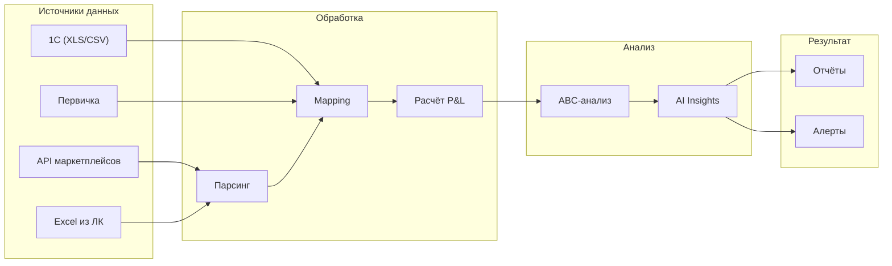

# ADOLF CFO — Раздел 0: Введение

**Проект:** Финансовый учёт и управленческая аналитика  
**Модуль:** CFO  
**Версия:** 1.0  
**Дата:** Январь 2026

---

## Назначение документа

Данный документ является введением в модуль ADOLF CFO и содержит:
- Общее описание модуля
- Бизнес-цели и метрики
- Структуру документации
- Краткий обзор функциональности

---

## Что такое ADOLF CFO

ADOLF CFO — функциональный модуль системы ADOLF, обеспечивающий автоматизированный управленческий учёт, формирование P&L-отчётов и финансовую аналитику для e-commerce бизнеса на маркетплейсах.

### Поддерживаемые платформы

| Платформа | Импорт данных (API) | Импорт данных (Excel) | Порядок интеграции |
|-----------|:-------------------:|:---------------------:|:------------------:|
| Wildberries | ✅ | ✅ | 1 |
| Ozon | ✅ | ✅ | 2 |
| Яндекс.Маркет | ✅ | ✅ | 3 |

### Основные возможности v1.0

| Функция | Описание |
|---------|----------|
| Data Ingestion | Ежедневный импорт данных из API маркетплейсов и Excel-отчётов |
| Cost Mapping | Сопоставление выручки с себестоимостью из 1С |
| P&L Reports | Формирование отчётов по SKU, категориям, брендам, маркетплейсам |
| ABC-анализ | Классификация SKU по вкладу в прибыль (A, B, C, D) |
| AI Insights | Текстовые выводы и рекомендации (Claude Opus 4.5) |
| Custom Reports | Формирование кастомных отчётов по запросу директора |
| Alerts | Уведомления об убыточных SKU и аномалиях |

---

## Бизнес-цели

| Цель | Описание | Метрика успеха |
|------|----------|----------------|
| Оперативность | Актуальные финансовые данные каждый день | Данные обновляются ежедневно к 09:00 |
| Прозрачность | Полная картина маржинальности по всем срезам | 100% SKU с рассчитанной маржой |
| Выявление проблем | Автоматическое обнаружение убыточных позиций | Класс D выявляется автоматически |
| Аналитика | AI-инсайты для принятия решений | Снижение времени на анализ на 70% |
| Гибкость | Кастомные отчёты по запросу | Формирование отчёта < 1 минуты |

---

## Структура документации

| Раздел | Содержание |
|--------|------------|
| **0. Введение** | Общий обзор (этот документ) |
| **1. Архитектура** | Компоненты, зависимости, интеграции |
| **2. Data Ingestion** | Источники данных, парсеры, маппинг |
| **3. AI Pipeline** | Расчёты P&L, ABC-анализ, AI-инсайты |
| **4. Open WebUI** | Pipeline, Tools, кнопки, интерфейс |
| **5. Database** | Схема базы данных |
| **6. Сценарии** | Пользовательские сценарии |
| **7. Celery** | Фоновые задачи |

---

## Роли и доступ

| Роль | Описание | Доступ к CFO |
|------|----------|--------------|
| Staff | Рядовые сотрудники | ❌ Нет доступа |
| Manager | Менеджер по маркетплейсам | ❌ Нет доступа |
| Senior | Старший менеджер | ✅ Ограниченный |
| Director | Директор | ✅ Полный |
| Administrator | Администратор | ✅ Полный + настройки |

### Матрица доступа к функциям

| Функция | Senior | Director | Admin |
|---------|:------:|:--------:|:-----:|
| P&L по категориям | ✅ | ✅ | ✅ |
| P&L по брендам | ✅ | ✅ | ✅ |
| P&L по маркетплейсам | ✅ | ✅ | ✅ |
| ABC-анализ | ✅ | ✅ | ✅ |
| P&L по SKU | ❌ | ✅ | ✅ |
| Консолидированный P&L | ❌ | ✅ | ✅ |
| Себестоимость по SKU | ❌ | ✅ | ✅ |
| Кастомные отчёты | ❌ | ✅ | ✅ |
| Настройки порогов | ❌ | ❌ | ✅ |

---

## Источники данных

### Маркетплейсы (ежедневно)

| Источник | Тип | Данные |
|----------|-----|--------|
| Wildberries API | `/api/v1/supplier/reportDetailByPeriod` | Продажи, комиссии, логистика |
| Wildberries Excel | Финансовый отчёт из ЛК | Детализация удержаний |
| Ozon API | `/v3/finance/transaction/list` | Транзакции |
| Ozon Excel | Отчёт о реализации из ЛК | Детализация |
| Яндекс.Маркет API | Finance Reports API | Транзакции |
| Яндекс.Маркет Excel | Отчёт из ЛК | Детализация |

### 1С и бухгалтерия (еженедельно)

| Источник | Формат | Данные |
|----------|--------|--------|
| Выгрузка себестоимости | XLS/CSV | Barcode → COGS |
| Бухгалтерская первичка | PDF/XLS | Накладные, счета-фактуры, акты |

---

## Учитываемые расходы

### MVP (v1.0)

| Статья расходов | Источник данных |
|-----------------|-----------------|
| Себестоимость товара (COGS) | 1С |
| Комиссия маркетплейса | API/Excel МП |
| Логистика до покупателя | API/Excel МП |
| Обратная логистика (возвраты) | API/Excel МП |
| Хранение на складе МП | API/Excel МП |
| Реклама на маркетплейсах | API/Excel МП |

### v2.0 (планы)

| Статья расходов | Описание |
|-----------------|----------|
| Эквайринг | Комиссия за приём платежей |
| Штрафы и удержания | Штрафы МП |
| Упаковка | Стоимость упаковки |
| Доставка до склада МП | Логистика FBO |
| ФОТ (распределённый) | Зарплата на единицу |
| Прочие операционные | Аренда, связь и т.д. |

---

## ABC-анализ

### Классификация SKU

| Класс | Доля в прибыли | Описание |
|:-----:|:--------------:|----------|
| **A** | 80% | Ключевые SKU, генерирующие основную прибыль |
| **B** | 15% | Средние SKU со стабильным вкладом |
| **C** | 5% | Аутсайдеры с минимальным вкладом |
| **D** | — | Убыточные SKU (отрицательная маржа) |

---

## Алерты и уведомления

| Событие | Уровень | Получатели |
|---------|---------|------------|
| Убыточный SKU обнаружен | warning | Senior, Director |
| Маржа ниже порога | warning | Senior, Director |
| Данные обновлены | info | Admin |
| Ошибка импорта | critical | Admin |
| Аномалия в данных | warning | Admin |

---

## Технологический стек

| Компонент | Технология |
|-----------|------------|
| Backend | FastAPI (Python 3.11) |
| Database | PostgreSQL 15 |
| Queue | Redis + Celery |
| AI (аналитика) | Claude Opus 4.5 |
| AI (парсинг) | GPT-5 mini |
| Interface | Open WebUI |
| Container | Docker |

---

## Зависимости от ADOLF Core

| Компонент Core | Использование |
|----------------|---------------|
| Middleware | Авторизация, роутинг, фильтрация по роли |
| ETL | Обработка Excel/CSV из 1С и ЛК маркетплейсов |
| PostgreSQL | Хранение финансовых данных |
| Celery | Ежедневный импорт данных |
| Redis | Очередь задач, кэширование |
| Notifications | Алерты об убыточных SKU и аномалиях |

---

## Зависимости от других модулей

| Модуль | Использование | Обязательность |
|--------|---------------|----------------|
| Knowledge | Хранение бухгалтерской первички | Обязательно |
| Watcher | — | Не используется |
| Reputation | — | Не используется |

---

## Функционал v2.0 (планы)

| Функция | Описание |
|---------|----------|
| Интеграция 1С | Прямое подключение к 1С через API |
| Расширенные расходы | Учёт ФОТ, упаковки, доставки до МП |
| Прогнозирование | Прогноз маржинальности на основе трендов |
| Бюджетирование | План-факт анализ |
| Dashboards | Визуальные дашборды с графиками |
| Экспорт в BI | Интеграция с Power BI / Tableau |

---

## Быстрый старт

### Для Director

1. Откройте Open WebUI
2. Выберите Pipeline `@Adolf_CFO`
3. Напишите: «Покажи P&L за текущую неделю»
4. Используйте кнопки для детализации
5. Запросите AI-инсайты: «Дай рекомендации по убыточным позициям»

### Для Senior

1. Откройте Open WebUI
2. Выберите Pipeline `@Adolf_CFO`
3. Напишите: «ABC-анализ по категориям»
4. Просмотрите распределение SKU по классам

### Для Administrator

1. Настройте API-ключи маркетплейсов в environment variables
2. Настройте расписание Celery Beat для ежедневного импорта
3. Проверьте поступление файлов из 1С в папку ETL
4. Настройте пороги алертов в таблице `settings`

---

## Workflow модуля

---

## Контакты

| Вопрос | Ответственный |
|--------|---------------|
| Техническая поддержка | Administrator |
| Настройки порогов | Administrator |
| Бизнес-процессы | Director |
| Финансовые данные | Director |

---

**Документ подготовлен:** Январь 2026  
**Версия:** 1.0  
**Статус:** Черновик
