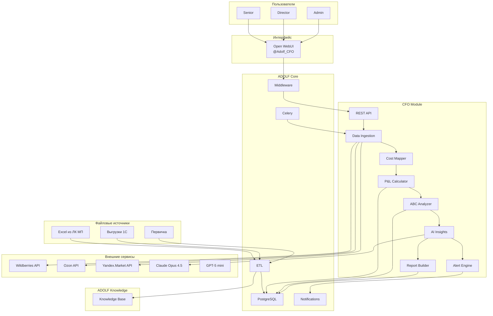
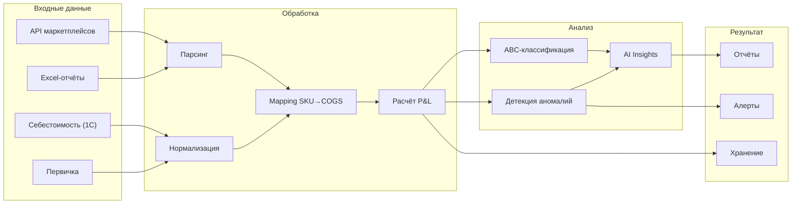
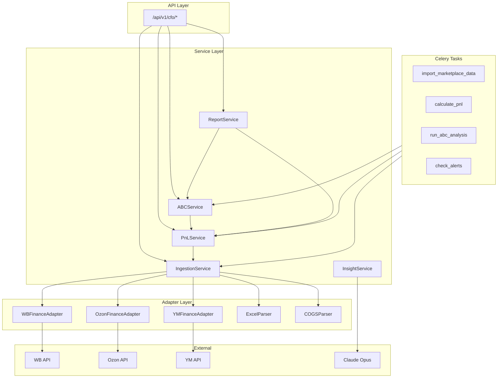
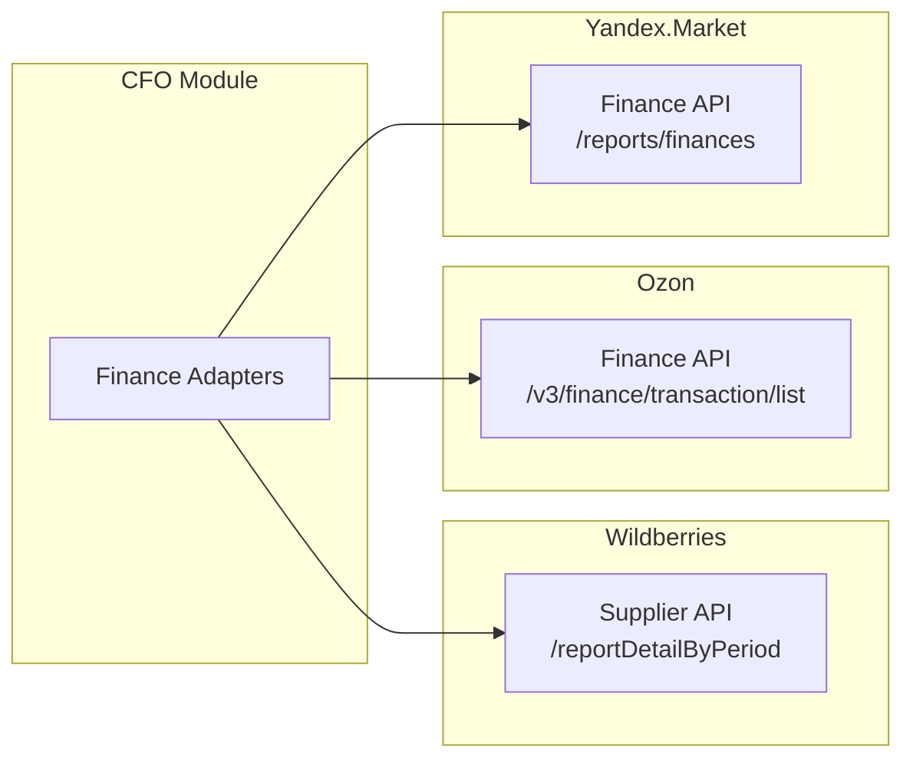
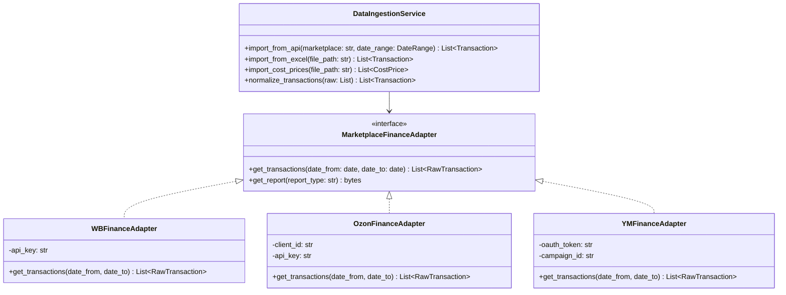
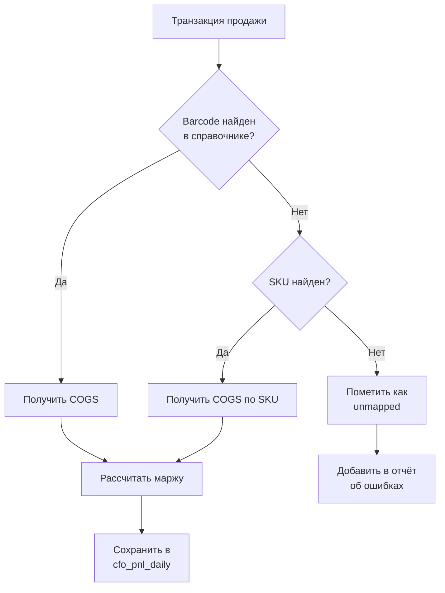
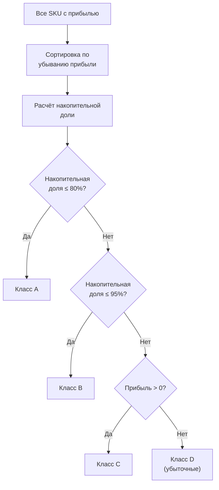

# ADOLF CFO — Раздел 1: Архитектура

**Проект:** Финансовый учёт и управленческая аналитика  
**Модуль:** CFO  
**Версия:** 1.0  
**Дата:** Январь 2026

---

## 1.1 Назначение модуля

CFO — модуль автоматизированного управленческого учёта, формирования P&L-отчётов и финансовой аналитики для e-commerce бизнеса на маркетплейсах.

### Основные функции

| Функция | Описание |
|---------|----------|
| Data Ingestion | Ежедневный сбор данных из API маркетплейсов и файлов |
| Cost Mapping | Сопоставление продаж с себестоимостью по Barcode/SKU |
| P&L Calculation | Расчёт маржинальности по всем срезам |
| ABC Analysis | Классификация SKU по вкладу в прибыль |
| AI Insights | Формирование выводов и рекомендаций |
| Custom Reports | Генерация отчётов по запросу пользователя |
| Alerting | Уведомления об убыточных SKU и аномалиях |

### Целевые пользователи

| Роль | Доступ | Функции |
|------|--------|---------|
| Senior | Ограниченный | P&L по категориям/брендам/МП, ABC-анализ |
| Director | Полный | Все отчёты + P&L по SKU + кастомные отчёты |
| Administrator | Полный + настройки | Всё + настройка порогов и расписания |

---

## 1.2 Границы модуля

### Входит в модуль CFO

| Компонент | Описание |
|-----------|----------|
| Marketplace Adapters | Получение финансовых данных через API WB, Ozon, YM |
| File Parsers | Парсинг Excel-отчётов из ЛК маркетплейсов |
| Cost Mapper | Сопоставление продаж с себестоимостью из 1С |
| P&L Calculator | Расчёт маржинальности по всем срезам |
| ABC Analyzer | Классификация SKU (A, B, C, D) |
| AI Insights Generator | Формирование выводов (Claude Opus 4.5) |
| Report Builder | Генерация отчётов по запросу |
| Alert Engine | Обнаружение аномалий и убыточных SKU |
| REST API | Endpoints для управления модулем |
| Open WebUI Pipeline | Интерфейс `@Adolf_CFO` |
| Celery Tasks | Фоновые задачи импорта и расчёта |

### Не входит в модуль CFO

| Компонент | Где реализовано | Тип взаимодействия |
|-----------|-----------------|-------------------|
| Авторизация пользователей | ADOLF Core (Middleware) | Используется готовая |
| Обработка файлов 1С | ADOLF Core (ETL) | Файлы из `/data/inbox` |
| Хранение первички | ADOLF Knowledge | Индексация через ETL |
| Хранение пользователей | ADOLF Core (PostgreSQL) | Чтение таблицы `users` |
| Система уведомлений | ADOLF Core (Notifications) | Event Bus |
| Генерация текста (LLM) | OpenAI API | API-вызовы |

### Функционал v2.0 (не входит в MVP)

| Компонент | Описание |
|-----------|----------|
| 1C Integration | Прямое подключение к 1С через API |
| Extended Costs | Учёт ФОТ, упаковки, доставки до МП |
| Forecasting | Прогнозирование маржинальности |
| Budgeting | План-факт анализ |
| Dashboards | Визуальные графики и диаграммы |
| BI Export | Интеграция с Power BI / Tableau |

---

## 1.3 Архитектура модуля

### 1.3.1 Общая схема



### 1.3.2 Схема потока данных



### 1.3.3 Компонентная диаграмма



---

## 1.4 Зависимости от ADOLF Core

### 1.4.1 Middleware (FastAPI)

**Используемые возможности:**

| Возможность | Применение в CFO |
|-------------|------------------|
| Авторизация | Проверка `role IN (senior, director, admin)` |
| Идентификация | Получение `user_id`, `brand_id` из сессии |
| Роутинг | Регистрация endpoints `/api/v1/cfo/*` |
| Фильтрация | Ограничение данных по роли |
| Аудит | Логирование действий в `audit_log` |

**Разграничение доступа:**

```python
# Проверка доступа к CFO
ALLOWED_ROLES = ["senior", "director", "admin"]

# Функции с ограниченным доступом (только Director+)
DIRECTOR_ONLY_FUNCTIONS = [
    "pnl_by_sku",
    "consolidated_pnl", 
    "sku_cost_price",
    "custom_reports"
]

def check_cfo_access(user: User, function: str) -> bool:
    if user.role not in ALLOWED_ROLES:
        return False
    
    if function in DIRECTOR_ONLY_FUNCTIONS:
        return user.role in ["director", "admin"]
    
    return True
```

### 1.4.2 ETL

**Обрабатываемые файлы:**

| Тип файла | Источник | Обработка |
|-----------|----------|-----------|
| Excel отчёты МП | `/data/inbox/cfo/marketplace/` | Парсинг → `cfo_transactions` |
| Себестоимость 1С | `/data/inbox/cfo/costs/` | Парсинг → `cfo_cost_prices` |
| Первичка | `/data/inbox/cfo/primary/` | OCR → Knowledge Base |

**Структура папок:**

```
/data/inbox/cfo/
├── marketplace/          # Excel-отчёты из ЛК маркетплейсов
│   ├── wb/
│   ├── ozon/
│   └── ym/
├── costs/                # Выгрузки себестоимости из 1С
└── primary/              # Бухгалтерская первичка
```

### 1.4.3 PostgreSQL

**Используемые таблицы:**

| Таблица | Назначение |
|---------|------------|
| `users` | Роль пользователя, проверка доступа |
| `cfo_transactions` | Финансовые транзакции с маркетплейсов |
| `cfo_cost_prices` | Справочник себестоимости (Barcode → COGS) |
| `cfo_pnl_daily` | Ежедневный P&L по SKU |
| `cfo_pnl_aggregated` | Агрегированный P&L по периодам |
| `cfo_abc_results` | Результаты ABC-анализа |
| `cfo_alerts` | История алертов |
| `cfo_reports` | Сохранённые отчёты |
| `cfo_settings` | Настройки модуля (пороги, расписание) |
| `audit_log` | Логи всех действий |

### 1.4.4 Celery

**Фоновые задачи:**

| Задача | Описание | Расписание |
|--------|----------|------------|
| `cfo.import_wb_finance` | Импорт данных Wildberries | Ежедневно 06:00 |
| `cfo.import_ozon_finance` | Импорт данных Ozon | Ежедневно 06:10 |
| `cfo.import_ym_finance` | Импорт данных Яндекс.Маркет | Ежедневно 06:20 |
| `cfo.process_excel_reports` | Обработка Excel из ETL | Ежедневно 06:30 |
| `cfo.process_cost_prices` | Обработка себестоимости | Еженедельно (Пн 07:00) |
| `cfo.calculate_daily_pnl` | Расчёт дневного P&L | Ежедневно 07:00 |
| `cfo.run_abc_analysis` | ABC-анализ | Еженедельно (Пн 08:00) |
| `cfo.check_alerts` | Проверка алертов | Ежедневно 08:00 |
| `cfo.cleanup_old_data` | Очистка старых данных | Ежемесячно |

### 1.4.5 Notifications

**События для уведомлений:**

| Событие | Уровень | Получатели | Описание |
|---------|---------|------------|----------|
| `cfo.sku_negative_margin` | warning | Senior, Director | SKU с отрицательной маржой (класс D) |
| `cfo.margin_below_threshold` | warning | Senior, Director | Маржа ниже порога |
| `cfo.data_imported` | info | Admin | Ежедневный импорт завершён |
| `cfo.import_error` | critical | Admin | Ошибка импорта данных |
| `cfo.anomaly_detected` | warning | Admin | Аномалия в данных |

---

## 1.5 Зависимости от других модулей

### 1.5.1 ADOLF Knowledge

**Назначение:** Хранение и поиск бухгалтерской первички.

**Используемые данные:**

| Тип документа | Пример | Применение |
|---------------|--------|------------|
| Накладные | ТОРГ-12 | Подтверждение закупочной цены |
| Счета-фактуры | От поставщиков | Детализация расходов |
| Акты | Акты выполненных работ | Учёт услуг |

**API-вызов:**

```python
async def search_primary_docs(
    query: str,
    doc_type: str,
    date_from: date,
    date_to: date
) -> List[Document]:
    """Поиск первичных документов в Knowledge Base."""
    response = await knowledge_api.search(
        query=query,
        filters={
            "category": "finance",
            "doc_type": doc_type,
            "date_range": [date_from, date_to]
        }
    )
    return response.results
```

### 1.5.2 Другие модули

| Модуль | Взаимодействие |
|--------|----------------|
| Watcher | Не используется в MVP |
| Reputation | Не используется |
| Content Factory | Не используется |
| Marketing | В v2.0: данные о расходах на рекламу |
| Scout | В v2.0: данные для unit-экономики |

---

## 1.6 Внешние интеграции

### 1.6.1 API маркетплейсов (финансовые данные)



**Сводка API:**

| Маркетплейс | Endpoint | Данные | Rate Limit |
|-------------|----------|--------|------------|
| Wildberries | `GET /api/v1/supplier/reportDetailByPeriod` | Продажи, комиссии, логистика | 1 req/min |
| Ozon | `POST /v3/finance/transaction/list` | Транзакции, удержания | 60 req/min |
| Яндекс.Маркет | `GET /reports/finances` | Финансовый отчёт | 10 req/min |

### 1.6.2 AI-сервисы

| Сервис | Модель | Назначение |
|--------|--------|------------|
| OpenAI | Claude Opus 4.5 | AI-инсайты, кастомные отчёты |
| Timeweb AI | GPT-5 mini | Парсинг Excel, OCR первички |

---

## 1.7 Компоненты модуля

### 1.7.1 Data Ingestion

**Назначение:** Сбор финансовых данных из всех источников.



### 1.7.2 Cost Mapper

**Назначение:** Сопоставление продаж с себестоимостью.

**Алгоритм маппинга:**



**Приоритет маппинга:**

| Приоритет | Ключ | Описание |
|:---------:|------|----------|
| 1 | Barcode | Точное соответствие штрихкода |
| 2 | SKU (артикул) | Артикул продавца |
| 3 | nm_id + size | Номенклатура МП + размер |

### 1.7.3 P&L Calculator

**Назначение:** Расчёт маржинальности по всем срезам.

**Формула расчёта:**

```
Revenue = Sale Price (после скидок)

Expenses:
  - COGS (себестоимость)
  - Commission (комиссия МП)
  - Logistics (логистика до покупателя)
  - Return Logistics (обратная логистика)
  - Storage (хранение)
  - Advertising (реклама)

Gross Profit = Revenue - COGS
Net Profit = Revenue - All Expenses
Margin % = Net Profit / Revenue * 100
```

**Срезы агрегации:**

| Срез | Ключ группировки | Пример |
|------|------------------|--------|
| По SKU | `sku` | OM-12345 |
| По категории | `category` | Платья |
| По бренду | `brand_id` | ohana_market |
| По маркетплейсу | `marketplace` | wb |
| По периоду | `date` | 2026-01-15 |

### 1.7.4 ABC Analyzer

**Назначение:** Классификация SKU по вкладу в прибыль.

**Алгоритм:**



**Пороги классификации:**

| Класс | Накопительная доля прибыли | Характеристика |
|:-----:|:--------------------------:|----------------|
| A | 0% — 80% | Ключевые SKU |
| B | 80% — 95% | Средние SKU |
| C | 95% — 100% | Аутсайдеры (прибыльные) |
| D | Отрицательная прибыль | Убыточные |

### 1.7.5 AI Insights Generator

**Назначение:** Формирование текстовых выводов и рекомендаций.

**Входные данные для AI:**

| Данные | Описание |
|--------|----------|
| P&L summary | Сводка по выручке, расходам, прибыли |
| ABC distribution | Распределение SKU по классам |
| Top/Bottom performers | Лучшие и худшие SKU |
| Anomalies | Выявленные аномалии |
| Trends | Динамика показателей |

**Промпт для Claude Opus 4.5:**

```
Ты финансовый аналитик e-commerce компании.

Проанализируй финансовые данные и сформируй выводы:

Данные:
{pnl_summary}
{abc_distribution}
{top_performers}
{bottom_performers}
{anomalies}

Требования к ответу:
1. Краткое резюме (2-3 предложения)
2. Ключевые проблемы (если есть)
3. Конкретные рекомендации по убыточным SKU
4. Возможности для роста маржи

Формат: структурированный текст на русском языке.
Тон: деловой, конкретный, с цифрами.
```

### 1.7.6 Report Builder

**Назначение:** Генерация отчётов по запросу пользователя.

**Типы отчётов:**

| Тип | Описание | Доступ |
|-----|----------|--------|
| `pnl_by_sku` | P&L по каждому SKU | Director+ |
| `pnl_by_category` | P&L по категориям | Senior+ |
| `pnl_by_brand` | P&L по брендам | Senior+ |
| `pnl_by_marketplace` | P&L по маркетплейсам | Senior+ |
| `pnl_consolidated` | Консолидированный P&L | Director+ |
| `abc_report` | ABC-анализ | Senior+ |
| `loss_makers` | Убыточные SKU (класс D) | Senior+ |
| `custom` | Кастомный отчёт | Director+ |

### 1.7.7 Alert Engine

**Назначение:** Обнаружение проблем и отправка уведомлений.

**Правила алертов:**

| Правило | Условие | Уровень |
|---------|---------|---------|
| Убыточный SKU | `margin < 0` | warning |
| Низкая маржа | `margin < threshold` | warning |
| Аномалия выручки | `revenue_change > 20%` | warning |
| Аномалия расходов | `expense_change > 20%` | warning |
| Ошибка маппинга | `unmapped_count > 10` | warning |

---

## 1.8 Настройки модуля

### 1.8.1 Environment Variables

| Переменная | Описание | Пример |
|------------|----------|--------|
| `WB_API_KEY` | API-ключ Wildberries | `xxx...` |
| `OZON_CLIENT_ID` | Client ID Ozon | `123456` |
| `OZON_API_KEY` | API-ключ Ozon | `xxx...` |
| `YM_OAUTH_TOKEN` | OAuth-токен Яндекс.Маркет | `xxx...` |
| `YM_CAMPAIGN_ID` | ID кампании Яндекс.Маркет | `789012` |
| `CLAUDE_API_KEY` | API-ключ Claude | `sk-...` |
| `CFO_MARGIN_THRESHOLD` | Порог маржи для алерта (%) | `10` |
| `CFO_ANOMALY_THRESHOLD` | Порог аномалии (%) | `20` |

### 1.8.2 Настройки в БД (cfo_settings)

| Ключ | Тип | Описание | Значение по умолчанию |
|------|-----|----------|----------------------|
| `margin_threshold` | float | Порог маржи для алерта | 10.0 |
| `anomaly_threshold` | float | Порог отклонения для аномалии | 20.0 |
| `abc_thresholds` | json | Пороги ABC-классов | `{"a": 80, "b": 95}` |
| `import_schedule` | json | Расписание импорта | `{"time": "06:00"}` |
| `retention_days` | int | Срок хранения детальных данных | 365 |

---

## 1.9 Технические ограничения

| Параметр | Ограничение |
|----------|-------------|
| Период запроса API (WB) | Максимум 30 дней |
| Период запроса API (Ozon) | Максимум 3 месяца |
| Размер Excel-файла | До 50 МБ |
| Время расчёта P&L | < 5 минут (полный пересчёт) |
| Время генерации AI-инсайтов | < 30 секунд |
| Хранение детальных транзакций | 12 месяцев |
| Хранение агрегатов | Бессрочно |

---

## 1.10 Безопасность

### Защита финансовых данных

| Мера | Реализация |
|------|------------|
| Доступ по ролям | Middleware проверяет `role IN (senior, director, admin)` |
| Фильтрация по бренду | Senior видит только свой бренд |
| Аудит | Все действия логируются в `audit_log` |
| Шифрование | API-ключи в environment variables |
| Retention | Автоочистка детальных данных старше 12 месяцев |

---

**Документ подготовлен:** Январь 2026  
**Версия:** 1.0  
**Статус:** Черновик
