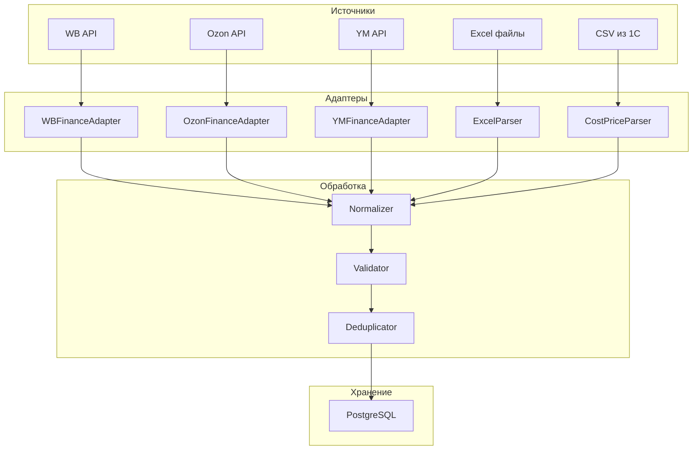

**Проект:** Финансовый учёт и управленческая аналитика  
**Модуль:** CFO  
**Версия:** 1.1  
**Дата:** Январь 2026

---

## 2.1 Назначение

Раздел описывает процессы сбора, парсинга и нормализации финансовых данных из всех источников.

### Источники данных

| Источник | Тип | Периодичность | Данные |
|----------|-----|---------------|--------|
| Wildberries API | API | Ежедневно | Продажи, комиссии, логистика |
| Wildberries Excel | Файл | Еженедельно | Финансовый отчёт из ЛК |
| Ozon API | API | Ежедневно | Транзакции |
| Ozon Excel | Файл | Еженедельно | Отчёт о реализации |
| Яндекс.Маркет API | API | Ежедневно | Финансовый отчёт |
| Яндекс.Маркет Excel | Файл | Еженедельно | Детализация из ЛК |
| 1С:КА 2 (себестоимость) | Файл | Еженедельно | SKU → COGS |
| Бухгалтерская первичка | Файл | По мере поступления | Накладные, акты |

<Note>
**Изменение v1.1:** Идентификация товаров из 1С производится только по Артикулу (SKU). Штрихкоды в выгрузках 1С не используются, т.к. не указываются при оптовых продажах. Номенклатурные группы не ведутся в базе 1С заказчика.
</Note>

---

## 2.2 Архитектура Data Ingestion

### 2.2.1 Общая схема



### 2.2.2 Структура папок для файлов

```
/data/inbox/cfo/
├── marketplace/
│   ├── wb/                    # Excel-отчёты Wildberries
│   │   └── WB_Finance_2026-01-15.xlsx
│   ├── ozon/                  # Excel-отчёты Ozon
│   │   └── Ozon_Realization_2026-01-15.xlsx
│   └── ym/                    # Excel-отчёты Яндекс.Маркет
│       └── YM_Finance_2026-01-15.xlsx
├── costs/                     # Себестоимость из 1С:КА 2
│   └── cost_prices_2026-01-13.csv
└── primary/                   # Бухгалтерская первичка
    ├── invoices/              # Накладные
    ├── acts/                  # Акты
    └── contracts/             # Договоры
```

---

## 2.3 Wildberries Finance Adapter

### 2.3.1 API Endpoint

| Параметр | Значение |
|----------|----------|
| Base URL | `https://statistics-api.wildberries.ru` |
| Endpoint | `/api/v1/supplier/reportDetailByPeriod` |
| Method | GET |
| Auth | Header `Authorization: {API_KEY}` |

### 2.3.2 Параметры запроса

| Параметр | Тип | Обязательный | Описание |
|----------|-----|--------------|----------|
| `dateFrom` | string | Да | Начало периода (RFC3339) |
| `dateTo` | string | Да | Конец периода (RFC3339) |
| `limit` | int | Нет | Лимит записей (макс. 100000) |
| `rrdid` | int | Нет | ID для пагинации |

### 2.3.3 Структура ответа

```json
{
  "realizationreport_id": 123456789,
  "date_from": "2026-01-01T00:00:00Z",
  "date_to": "2026-01-07T23:59:59Z",
  "create_dt": "2026-01-08T10:00:00Z",
  "suppliercontract_code": null,
  "rrd_id": 987654321,
  "gi_id": 111222333,
  "subject_name": "Платья",
  "nm_id": 12345678,
  "brand_name": "Охана Маркет",
  "sa_name": "OM-12345",
  "ts_name": "44",
  "barcode": "2000000000001",
  "doc_type_name": "Продажа",
  "quantity": 1,
  "retail_price": 3500.00,
  "retail_amount": 3500.00,
  "sale_percent": 15,
  "commission_percent": 15.5,
  "office_name": "Коледино",
  "supplier_oper_name": "Продажа",
  "order_dt": "2026-01-05T14:30:00Z",
  "sale_dt": "2026-01-06T10:00:00Z",
  "rr_dt": "2026-01-07T00:00:00Z",
  "shk_id": 999888777,
  "retail_price_withdisc_rub": 2975.00,
  "delivery_amount": 50,
  "return_amount": 0,
  "delivery_rub": 85.00,
  "gi_box_type_name": "Короб",
  "product_discount_for_report": 525.00,
  "supplier_promo": 0,
  "rid": 0,
  "ppvz_spp_prc": 10.5,
  "ppvz_kvw_prc_base": 15.5,
  "ppvz_kvw_prc": 15.5,
  "ppvz_sales_commission": 461.13,
  "ppvz_for_pay": 2428.87,
  "ppvz_reward": 0,
  "acquiring_fee": 0,
  "acquiring_bank": "",
  "ppvz_vw": 297.50,
  "ppvz_vw_nds": 59.50,
  "ppvz_office_id": 123,
  "ppvz_office_name": "Коледино",
  "ppvz_supplier_id": 456,
  "ppvz_supplier_name": "ООО Охана",
  "ppvz_inn": "1234567890",
  "declaration_number": "",
  "bonus_type_name": "",
  "sticker_id": "WB-123456789",
  "site_country": "RU",
  "penalty": 0,
  "additional_payment": 0,
  "rebill_logistic_cost": 0,
  "rebill_logistic_org": "",
  "kiz": "",
  "storage_fee": 5.50,
  "deduction": 0,
  "acceptance": 0,
  "srid": "abc123def456"
}
```

### 2.3.4 Маппинг полей WB → CFO

| Поле WB API | Поле CFO | Описание |
|-------------|----------|----------|
| `sa_name` | `sku` | Артикул продавца (основной идентификатор) |
| `nm_id` | `nm_id` | Номенклатура WB |
| `barcode` | `barcode` | Штрихкод (опционально, из API МП) |
| `subject_name` | `category` | Категория |
| `brand_name` | `brand_name` | Бренд |
| `ts_name` | `size` | Размер |
| `retail_price_withdisc_rub` | `revenue` | Выручка (с учётом скидок) |
| `ppvz_sales_commission` | `commission` | Комиссия МП |
| `delivery_rub` | `logistics` | Логистика |
| `return_amount` | `return_logistics` | Обратная логистика |
| `storage_fee` | `storage` | Хранение |
| `ppvz_for_pay` | `payout` | К выплате |
| `sale_dt` | `sale_date` | Дата продажи |
| `doc_type_name` | `operation_type` | Тип операции |
| `srid` | `external_id` | Уникальный ID операции |

### 2.3.5 Реализация адаптера

```python
from dataclasses import dataclass
from datetime import date, datetime
from typing import List, Optional
import aiohttp

@dataclass
class WBTransaction:
    """Транзакция Wildberries."""
    external_id: str
    sku: str
    nm_id: int
    barcode: Optional[str]  # Опционально — приходит из API МП
    category: str
    brand_name: str
    size: str
    revenue: float
    commission: float
    logistics: float
    return_logistics: float
    storage: float
    payout: float
    sale_date: datetime
    operation_type: str
    quantity: int


class WBFinanceAdapter:
    """Адаптер для финансового API Wildberries."""
    
    BASE_URL = "https://statistics-api.wildberries.ru"
    
    def __init__(self, api_key: str):
        self.api_key = api_key
        self.headers = {"Authorization": api_key}
    
    async def get_transactions(
        self,
        date_from: date,
        date_to: date
    ) -> List[WBTransaction]:
        """Получение транзакций за период."""
        
        transactions = []
        rrdid = 0
        
        while True:
            batch = await self._fetch_batch(date_from, date_to, rrdid)
            
            if not batch:
                break
            
            transactions.extend(batch)
            rrdid = max(t.get("rrd_id", 0) for t in batch)
            
            if len(batch) < 100000:
                break
        
        return [self._map_transaction(t) for t in transactions]
    
    async def _fetch_batch(
        self,
        date_from: date,
        date_to: date,
        rrdid: int
    ) -> List[dict]:
        """Получение пакета данных с пагинацией."""
        
        url = f"{self.BASE_URL}/api/v1/supplier/reportDetailByPeriod"
        params = {
            "dateFrom": date_from.isoformat(),
            "dateTo": date_to.isoformat(),
            "limit": 100000
        }
        
        if rrdid > 0:
            params["rrdid"] = rrdid
        
        async with aiohttp.ClientSession() as session:
            async with session.get(
                url, params=params, headers=self.headers
            ) as response:
                response.raise_for_status()
                return await response.json()
    
    def _map_transaction(self, raw: dict) -> WBTransaction:
        """Маппинг сырых данных в транзакцию."""
        
        return WBTransaction(
            external_id=raw.get("srid", ""),
            sku=raw.get("sa_name", ""),
            nm_id=raw.get("nm_id", 0),
            barcode=raw.get("barcode") or None,  # None если пустой
            category=raw.get("subject_name", ""),
            brand_name=raw.get("brand_name", ""),
            size=raw.get("ts_name", ""),
            revenue=float(raw.get("retail_price_withdisc_rub", 0)),
            commission=float(raw.get("ppvz_sales_commission", 0)),
            logistics=float(raw.get("delivery_rub", 0)),
            return_logistics=float(raw.get("return_amount", 0)),
            storage=float(raw.get("storage_fee", 0)),
            payout=float(raw.get("ppvz_for_pay", 0)),
            sale_date=datetime.fromisoformat(
                raw.get("sale_dt", "").replace("Z", "+00:00")
            ),
            operation_type=raw.get("doc_type_name", ""),
            quantity=int(raw.get("quantity", 0))
        )
```

---

## 2.4 Ozon Finance Adapter

### 2.4.1 API Endpoint

| Параметр | Значение |
|----------|----------|
| Base URL | `https://api-seller.ozon.ru` |
| Endpoint | `/v3/finance/transaction/list` |
| Method | POST |
| Auth | Headers `Client-Id` + `Api-Key` |

### 2.4.2 Параметры запроса

```json
{
  "filter": {
    "date": {
      "from": "2026-01-01T00:00:00Z",
      "to": "2026-01-07T23:59:59Z"
    },
    "operation_type": [],
    "posting_number": "",
    "transaction_type": "all"
  },
  "page": 1,
  "page_size": 1000
}
```

### 2.4.3 Структура ответа

```json
{
  "result": {
    "operations": [
      {
        "operation_id": 123456789,
        "operation_type": "OperationAgentDeliveredToCustomer",
        "operation_date": "2026-01-06T10:00:00Z",
        "operation_type_name": "Доставка покупателю",
        "delivery_charge": 50.0,
        "return_delivery_charge": 0,
        "accruals_for_sale": 2500.0,
        "sale_commission": 375.0,
        "amount": 2075.0,
        "type": "compensation",
        "posting": {
          "delivery_schema": "FBO",
          "order_date": "2026-01-05T14:30:00Z",
          "posting_number": "12345678-0001-1"
        },
        "items": [
          {
            "name": "Платье летнее синее",
            "sku": 123456789,
            "offer_id": "OM-12345"
          }
        ],
        "services": [
          {
            "name": "MarketplaceServiceItemFulfillment",
            "price": -50.0
          }
        ]
      }
    ],
    "page_count": 5,
    "row_count": 4500
  }
}
```

### 2.4.4 Маппинг полей Ozon → CFO

| Поле Ozon API | Поле CFO | Описание |
|---------------|----------|----------|
| `items[0].offer_id` | `sku` | Артикул продавца (основной идентификатор) |
| `items[0].sku` | `nm_id` | SKU Ozon |
| `items[0].name` | `product_name` | Название товара |
| `accruals_for_sale` | `revenue` | Выручка |
| `sale_commission` | `commission` | Комиссия |
| `delivery_charge` | `logistics` | Логистика |
| `return_delivery_charge` | `return_logistics` | Обратная логистика |
| `amount` | `payout` | К выплате |
| `operation_date` | `sale_date` | Дата операции |
| `operation_type_name` | `operation_type` | Тип операции |
| `operation_id` | `external_id` | Уникальный ID |

### 2.4.5 Реализация адаптера

```python
@dataclass
class OzonTransaction:
    """Транзакция Ozon."""
    external_id: str
    sku: str
    ozon_sku: int
    product_name: str
    revenue: float
    commission: float
    logistics: float
    return_logistics: float
    storage: float
    payout: float
    sale_date: datetime
    operation_type: str
    quantity: int


class OzonFinanceAdapter:
    """Адаптер для финансового API Ozon."""
    
    BASE_URL = "https://api-seller.ozon.ru"
    
    def __init__(self, client_id: str, api_key: str):
        self.client_id = client_id
        self.api_key = api_key
        self.headers = {
            "Client-Id": client_id,
            "Api-Key": api_key,
            "Content-Type": "application/json"
        }
    
    async def get_transactions(
        self,
        date_from: date,
        date_to: date
    ) -> List[OzonTransaction]:
        """Получение транзакций за период."""
        
        transactions = []
        page = 1
        
        while True:
            batch, page_count = await self._fetch_page(
                date_from, date_to, page
            )
            
            transactions.extend(batch)
            
            if page >= page_count:
                break
            
            page += 1
        
        return [self._map_transaction(t) for t in transactions]
    
    async def _fetch_page(
        self,
        date_from: date,
        date_to: date,
        page: int
    ) -> tuple:
        """Получение страницы данных."""
        
        url = f"{self.BASE_URL}/v3/finance/transaction/list"
        payload = {
            "filter": {
                "date": {
                    "from": f"{date_from}T00:00:00Z",
                    "to": f"{date_to}T23:59:59Z"
                },
                "transaction_type": "all"
            },
            "page": page,
            "page_size": 1000
        }
        
        async with aiohttp.ClientSession() as session:
            async with session.post(
                url, json=payload, headers=self.headers
            ) as response:
                response.raise_for_status()
                data = await response.json()
                
                operations = data.get("result", {}).get("operations", [])
                page_count = data.get("result", {}).get("page_count", 1)
                
                return operations, page_count
    
    def _map_transaction(self, raw: dict) -> OzonTransaction:
        """Маппинг сырых данных в транзакцию."""
        
        items = raw.get("items", [{}])
        first_item = items[0] if items else {}
        
        # Расчёт хранения из services
        storage = 0.0
        for service in raw.get("services", []):
            if "Storage" in service.get("name", ""):
                storage += abs(float(service.get("price", 0)))
        
        return OzonTransaction(
            external_id=str(raw.get("operation_id", "")),
            sku=first_item.get("offer_id", ""),
            ozon_sku=first_item.get("sku", 0),
            product_name=first_item.get("name", ""),
            revenue=float(raw.get("accruals_for_sale", 0)),
            commission=float(raw.get("sale_commission", 0)),
            logistics=float(raw.get("delivery_charge", 0)),
            return_logistics=float(raw.get("return_delivery_charge", 0)),
            storage=storage,
            payout=float(raw.get("amount", 0)),
            sale_date=datetime.fromisoformat(
                raw.get("operation_date", "").replace("Z", "+00:00")
            ),
            operation_type=raw.get("operation_type_name", ""),
            quantity=1
        )
```

---

## 2.5 Яндекс.Маркет Finance Adapter

### 2.5.1 API Endpoint

| Параметр | Значение |
|----------|----------|
| Base URL | `https://api.partner.market.yandex.ru` |
| Endpoint | `/v2/campaigns/{campaignId}/stats/orders` |
| Method | GET |
| Auth | Header `Authorization: OAuth {TOKEN}` |

### 2.5.2 Маппинг полей YM → CFO

| Поле YM API | Поле CFO | Описание |
|-------------|----------|----------|
| `shopSku` | `sku` | Артикул продавца |
| `marketSku` | `nm_id` | SKU Яндекса |
| `offerName` | `product_name` | Название |
| `prices.value` | `revenue` | Выручка |
| `commissions.amount` | `commission` | Комиссия |
| `delivery.price` | `logistics` | Логистика |

---

## 2.6 Excel Parser

### 2.6.1 Wildberries Excel

**Структура файла:**

| Колонка | Описание |
|---------|----------|
| Артикул поставщика | SKU |
| Баркод | Штрихкод (из файла МП, не 1С) |
| Бренд | Название бренда |
| Предмет | Категория |
| Размер | Размер товара |
| К перечислению продавцу | Сумма выплаты |
| Вознаграждение ВБ | Комиссия |
| Логистика | Стоимость доставки |
| Хранение | Стоимость хранения |
| Дата продажи | Дата операции |

### 2.6.2 Маппинг колонок Excel

```python
class WBExcelParser:
    """Парсер Excel-отчётов Wildberries."""
    
    COLUMN_MAPPING = {
        "Артикул поставщика": "sku",
        "Артикул": "sku",
        "Баркод": "barcode",  # Приходит из файла МП
        "Бренд": "brand_name",
        "Предмет": "category",
        "Размер": "size",
        "К перечислению продавцу": "payout",
        "К перечислению": "payout",
        "Вознаграждение ВБ": "commission",
        "Вознаграждение Вайлдберриз": "commission",
        "Логистика": "logistics",
        "Услуги логистики": "logistics",
        "Хранение": "storage",
        "Услуги хранения": "storage",
        "Дата продажи": "sale_date",
        "Дата заказа покупателем": "sale_date",
        "Тип документа": "operation_type",
        "Обоснование": "operation_type",
        "Кол-во": "quantity",
        "Количество": "quantity"
    }
```

---

## 2.7 Cost Price Parser (1С:КА 2)

<Warning>
**Важно:** Файлы себестоимости из 1С:Комплексная автоматизация 2 содержат только Артикул (SKU) в качестве идентификатора товара. Штрихкоды не выгружаются, т.к. не указываются при оптовых продажах. Связывание с транзакциями маркетплейсов производится по полю `sku`.
</Warning>

### 2.7.1 Формат файла себестоимости

**CSV из 1С:КА 2:**

```csv
sku;product_name;cost_price;currency;valid_from;brand_id
OM-12345;Платье летнее синее;1200.00;RUB;2026-01-13;Охана Маркет
OM-12346;Блузка офисная;800.00;RUB;2026-01-13;Охана Маркет
OK-54321;Футболка детская;450.00;RUB;2026-01-13;Охана Кидс
```

**Колонки файла:**

| Колонка 1С | Имя поля | Тип | Обязательно | Описание |
|------------|----------|-----|:-----------:|----------|
| Артикул | `sku` | string | Да | Основной идентификатор товара |
| Номенклатура | `product_name` | string | Да | Наименование товара |
| Себестоимость | `cost_price` | decimal | Да | Себестоимость единицы |
| Валюта | `currency` | string | Нет | Валюта (по умолчанию RUB) |
| Дата расчёта | `valid_from` | date | Да | Дата актуальности себестоимости |
| Вид номенклатуры | `brand_id` | string | Нет | Бренд (Охана Маркет / Охана Кидс) |

<Note>
Поля «Штрихкод» и «Номенклатурная группа» исключены из выгрузки по согласованию с обслуживающей организацией 1С (см. документ «Регламент выгрузок из 1С:КА 2 для системы BRAIN», раздел 9 «Учтённые замечания»).
</Note>

### 2.7.2 Реализация парсера

```python
from dataclasses import dataclass
from datetime import date
from pathlib import Path
from typing import List, Optional
import pandas as pd
import logging

logger = logging.getLogger(__name__)


@dataclass
class CostPriceRecord:
    """Запись себестоимости из 1С:КА 2."""
    sku: str                      # Артикул — основной идентификатор
    product_name: str             # Наименование товара
    cost_price: float             # Себестоимость
    currency: str                 # Валюта
    valid_from: date              # Дата актуальности
    brand_id: Optional[str]       # Вид номенклатуры (бренд)


class CostPriceParser:
    """Парсер файлов себестоимости из 1С:КА 2.
    
    Идентификация товаров производится только по Артикулу (SKU).
    Штрихкоды и номенклатурные группы не используются.
    """
    
    # Маппинг колонок CSV (английские названия)
    CSV_COLUMN_MAPPING = {
        "sku": "sku",
        "SKU": "sku",
        "product_name": "product_name",
        "ProductName": "product_name",
        "cost_price": "cost_price",
        "CostPrice": "cost_price",
        "currency": "currency",
        "Currency": "currency",
        "valid_from": "valid_from",
        "ValidFrom": "valid_from",
        "brand_id": "brand_id",
        "BrandId": "brand_id"
    }
    
    # Маппинг колонок Excel (русские названия из 1С)
    XLS_COLUMN_MAPPING = {
        "Артикул": "sku",
        "Номенклатура": "product_name",
        "Наименование": "product_name",
        "Себестоимость": "cost_price",
        "Валюта": "currency",
        "Дата расчёта": "valid_from",
        "Дата": "valid_from",
        "Вид номенклатуры": "brand_id"
    }
    
    def parse(self, file_path: Path) -> List[CostPriceRecord]:
        """Парсинг файла себестоимости.
        
        Args:
            file_path: Путь к файлу CSV или Excel
            
        Returns:
            Список записей себестоимости
            
        Raises:
            ValueError: Неподдерживаемый формат файла
        """
        
        suffix = file_path.suffix.lower()
        
        if suffix == ".csv":
            return self._parse_csv(file_path)
        elif suffix in [".xls", ".xlsx"]:
            return self._parse_excel(file_path)
        else:
            raise ValueError(f"Unsupported file format: {suffix}")
    
    def _parse_csv(self, file_path: Path) -> List[CostPriceRecord]:
        """Парсинг CSV файла."""
        
        df = pd.read_csv(
            file_path, 
            sep=";", 
            encoding="utf-8",
            dtype={"sku": str}  # SKU всегда строка
        )
        df = df.rename(columns=self.CSV_COLUMN_MAPPING)
        
        return self._convert_to_records(df)
    
    def _parse_excel(self, file_path: Path) -> List[CostPriceRecord]:
        """Парсинг Excel файла."""
        
        df = pd.read_excel(
            file_path,
            dtype={"Артикул": str}  # SKU всегда строка
        )
        df = df.rename(columns=self.XLS_COLUMN_MAPPING)
        
        return self._convert_to_records(df)
    
    def _convert_to_records(self, df: pd.DataFrame) -> List[CostPriceRecord]:
        """Конвертация DataFrame в список записей.
        
        Args:
            df: DataFrame с данными себестоимости
            
        Returns:
            Список валидных записей CostPriceRecord
        """
        
        records = []
        errors = 0
        
        for idx, row in df.iterrows():
            try:
                # SKU обязателен
                sku = str(row.get("sku", "")).strip()
                if not sku:
                    logger.warning(f"Row {idx}: Empty SKU, skipping")
                    errors += 1
                    continue
                
                # Себестоимость обязательна и > 0
                cost_price = float(row.get("cost_price", 0))
                if cost_price <= 0:
                    logger.warning(f"Row {idx}: Invalid cost_price={cost_price}, skipping")
                    errors += 1
                    continue
                
                record = CostPriceRecord(
                    sku=sku,
                    product_name=str(row.get("product_name", "")).strip(),
                    cost_price=cost_price,
                    currency=str(row.get("currency", "RUB")).strip() or "RUB",
                    valid_from=pd.to_datetime(row.get("valid_from")).date(),
                    brand_id=str(row.get("brand_id", "")).strip() or None
                )
                records.append(record)
                
            except Exception as e:
                logger.warning(f"Row {idx}: Failed to parse - {e}")
                errors += 1
        
        logger.info(f"Parsed {len(records)} cost records, {errors} errors")
        return records
    
    def get_cost_map(self, records: List[CostPriceRecord]) -> dict:
        """Создание словаря SKU → себестоимость.
        
        При наличии нескольких записей для одного SKU берётся
        запись с наиболее поздней датой valid_from.
        
        Args:
            records: Список записей себестоимости
            
        Returns:
            Словарь {sku: cost_price}
        """
        
        # Сортируем по дате (новые последние)
        sorted_records = sorted(records, key=lambda r: r.valid_from)
        
        cost_map = {}
        for record in sorted_records:
            cost_map[record.sku] = record.cost_price
        
        return cost_map
```

### 2.7.3 Интеграция с Normalizer

```python
class CostPriceService:
    """Сервис работы с себестоимостью."""
    
    def __init__(self, parser: CostPriceParser, db_session):
        self.parser = parser
        self.db = db_session
        self._cost_cache: dict = {}
    
    async def load_cost_prices(self, file_path: Path) -> int:
        """Загрузка себестоимости из файла в БД.
        
        Returns:
            Количество загруженных записей
        """
        
        records = self.parser.parse(file_path)
        
        if not records:
            return 0
        
        # Upsert в таблицу себестоимости
        query = """
            INSERT INTO cfo_cost_prices (sku, product_name, cost_price, 
                                         currency, valid_from, brand_id, updated_at)
            VALUES ($1, $2, $3, $4, $5, $6, NOW())
            ON CONFLICT (sku) DO UPDATE SET
                product_name = EXCLUDED.product_name,
                cost_price = EXCLUDED.cost_price,
                currency = EXCLUDED.currency,
                valid_from = EXCLUDED.valid_from,
                brand_id = EXCLUDED.brand_id,
                updated_at = NOW()
        """
        
        for record in records:
            await self.db.execute(
                query,
                record.sku,
                record.product_name,
                record.cost_price,
                record.currency,
                record.valid_from,
                record.brand_id
            )
        
        # Обновляем кэш
        self._cost_cache = self.parser.get_cost_map(records)
        
        logger.info(f"Loaded {len(records)} cost prices")
        return len(records)
    
    async def get_cost_price(self, sku: str) -> Optional[float]:
        """Получение себестоимости по SKU.
        
        Args:
            sku: Артикул товара
            
        Returns:
            Себестоимость или None если не найдена
        """
        
        # Сначала проверяем кэш
        if sku in self._cost_cache:
            return self._cost_cache[sku]
        
        # Запрос в БД
        query = """
            SELECT cost_price FROM cfo_cost_prices 
            WHERE sku = $1
            ORDER BY valid_from DESC
            LIMIT 1
        """
        
        row = await self.db.fetchrow(query, sku)
        
        if row:
            cost = float(row["cost_price"])
            self._cost_cache[sku] = cost
            return cost
        
        return None
    
    async def enrich_transactions(
        self, 
        transactions: List[NormalizedTransaction]
    ) -> List[NormalizedTransaction]:
        """Обогащение транзакций себестоимостью.
        
        Связывание по полю SKU.
        
        Args:
            transactions: Список транзакций
            
        Returns:
            Транзакции с заполненным cost_price
        """
        
        for tx in transactions:
            if tx.sku:
                tx.cost_price = await self.get_cost_price(tx.sku)
        
        return transactions
```

---

## 2.8 Normalizer

### 2.8.1 Унифицированная структура транзакции

```python
@dataclass
class NormalizedTransaction:
    """Нормализованная транзакция для всех маркетплейсов."""
    
    # Идентификация
    external_id: str              # Уникальный ID из источника
    marketplace: str              # wb, ozon, ym
    source: str                   # api, excel
    
    # Товар
    sku: str                      # Артикул продавца (основной идентификатор)
    barcode: Optional[str]        # Штрихкод (только из API/Excel МП, не из 1С)
    nm_id: Optional[int]          # ID номенклатуры МП
    product_name: Optional[str]   # Название товара
    category: Optional[str]       # Категория
    brand_name: Optional[str]     # Бренд
    size: Optional[str]           # Размер
    
    # Финансы
    revenue: float                # Выручка (цена продажи)
    cost_price: Optional[float]   # Себестоимость (из 1С, по SKU)
    commission: float             # Комиссия МП
    logistics: float              # Логистика до покупателя
    return_logistics: float       # Обратная логистика
    storage: float                # Хранение
    advertising: float            # Реклама (если есть)
    payout: float                 # К выплате
    
    # Расчётные поля
    gross_profit: Optional[float] # Валовая прибыль (revenue - cost_price)
    net_profit: Optional[float]   # Чистая прибыль (payout - cost_price)
    
    # Мета
    sale_date: date               # Дата продажи
    operation_type: str           # Тип операции
    quantity: int                 # Количество
    
    # Служебные
    created_at: datetime          # Дата создания записи
    source_file: Optional[str]    # Имя исходного файла
    
    def calculate_profits(self):
        """Расчёт прибыли при наличии себестоимости."""
        if self.cost_price is not None:
            self.gross_profit = self.revenue - (self.cost_price * self.quantity)
            self.net_profit = self.payout - (self.cost_price * self.quantity)


class TransactionNormalizer:
    """Нормализация транзакций из разных источников."""
    
    def __init__(self, cost_service: CostPriceService):
        self.cost_service = cost_service
    
    async def normalize_wb(self, tx: WBTransaction) -> NormalizedTransaction:
        """Нормализация транзакции WB."""
        
        # Получаем себестоимость по SKU
        cost_price = await self.cost_service.get_cost_price(tx.sku)
        
        normalized = NormalizedTransaction(
            external_id=tx.external_id,
            marketplace="wb",
            source="api",
            sku=tx.sku,
            barcode=tx.barcode,  # Из API WB, не из 1С
            nm_id=tx.nm_id,
            product_name=None,
            category=tx.category,
            brand_name=tx.brand_name,
            size=tx.size,
            revenue=tx.revenue,
            cost_price=cost_price,
            commission=tx.commission,
            logistics=tx.logistics,
            return_logistics=tx.return_logistics,
            storage=tx.storage,
            advertising=0.0,
            payout=tx.payout,
            gross_profit=None,
            net_profit=None,
            sale_date=tx.sale_date.date(),
            operation_type=tx.operation_type,
            quantity=tx.quantity,
            created_at=datetime.now(),
            source_file=None
        )
        
        normalized.calculate_profits()
        return normalized
    
    async def normalize_ozon(self, tx: OzonTransaction) -> NormalizedTransaction:
        """Нормализация транзакции Ozon."""
        
        cost_price = await self.cost_service.get_cost_price(tx.sku)
        
        normalized = NormalizedTransaction(
            external_id=tx.external_id,
            marketplace="ozon",
            source="api",
            sku=tx.sku,
            barcode=None,  # Ozon не возвращает barcode в финансовом API
            nm_id=tx.ozon_sku,
            product_name=tx.product_name,
            category=None,
            brand_name=None,
            size=None,
            revenue=tx.revenue,
            cost_price=cost_price,
            commission=tx.commission,
            logistics=tx.logistics,
            return_logistics=tx.return_logistics,
            storage=tx.storage,
            advertising=0.0,
            payout=tx.payout,
            gross_profit=None,
            net_profit=None,
            sale_date=tx.sale_date.date(),
            operation_type=tx.operation_type,
            quantity=tx.quantity,
            created_at=datetime.now(),
            source_file=None
        )
        
        normalized.calculate_profits()
        return normalized
```

---

## 2.9 Validator

### 2.9.1 Правила валидации

| Правило | Описание | Действие |
|---------|----------|----------|
| Required fields | `sku`, `marketplace`, `sale_date` обязательны | Reject |
| Revenue >= 0 | Выручка не может быть отрицательной | Reject |
| Valid marketplace | `marketplace IN (wb, ozon, ym)` | Reject |
| Valid date | Дата не в будущем | Reject |
| Duplicate check | Проверка по `external_id + marketplace` | Skip |
| Cost price warning | Себестоимость не найдена | Warning (не reject) |

### 2.9.2 Реализация

```python
from dataclasses import dataclass
from typing import List, Tuple

@dataclass
class ValidationResult:
    """Результат валидации."""
    is_valid: bool
    errors: List[str]
    warnings: List[str]


class TransactionValidator:
    """Валидация транзакций."""
    
    VALID_MARKETPLACES = {"wb", "ozon", "ym"}
    
    def validate(self, tx: NormalizedTransaction) -> ValidationResult:
        """Валидация транзакции."""
        
        errors = []
        warnings = []
        
        # Required fields
        if not tx.sku:
            errors.append("SKU is required")
        
        if not tx.marketplace:
            errors.append("Marketplace is required")
        
        if not tx.sale_date:
            errors.append("Sale date is required")
        
        # Valid marketplace
        if tx.marketplace not in self.VALID_MARKETPLACES:
            errors.append(f"Invalid marketplace: {tx.marketplace}")
        
        # Revenue check
        if tx.revenue < 0:
            errors.append(f"Revenue cannot be negative: {tx.revenue}")
        
        # Date check
        if tx.sale_date and tx.sale_date > date.today():
            errors.append(f"Sale date cannot be in future: {tx.sale_date}")
        
        # Cost price warning (не ошибка)
        if tx.cost_price is None:
            warnings.append(f"Cost price not found for SKU: {tx.sku}")
        
        return ValidationResult(
            is_valid=len(errors) == 0,
            errors=errors,
            warnings=warnings
        )
    
    def validate_batch(
        self,
        transactions: List[NormalizedTransaction]
    ) -> Tuple[List[NormalizedTransaction], List[Tuple[NormalizedTransaction, List[str]]]]:
        """Валидация пакета транзакций."""
        
        valid = []
        invalid = []
        warnings_count = 0
        
        for tx in transactions:
            result = self.validate(tx)
            
            if result.is_valid:
                valid.append(tx)
                if result.warnings:
                    warnings_count += 1
                    for w in result.warnings:
                        logger.warning(f"Transaction {tx.external_id}: {w}")
            else:
                invalid.append((tx, result.errors))
        
        logger.info(f"Validated: {len(valid)} valid, {len(invalid)} invalid, {warnings_count} with warnings")
        return valid, invalid
```

---

## 2.10 Deduplicator

### 2.10.1 Стратегия дедупликации

| Источник | Ключ дедупликации | Описание |
|----------|-------------------|----------|
| API | `external_id + marketplace` | Уникальный ID операции |
| Excel | `sku + sale_date + revenue + marketplace` | Комбинация полей |

### 2.10.2 Реализация

```python
class TransactionDeduplicator:
    """Дедупликация транзакций."""
    
    def __init__(self, db_session):
        self.db = db_session
    
    async def deduplicate(
        self,
        transactions: List[NormalizedTransaction]
    ) -> List[NormalizedTransaction]:
        """Удаление дубликатов."""
        
        # Получение существующих external_id
        existing_ids = await self._get_existing_ids(
            [t.external_id for t in transactions if t.external_id]
        )
        
        # Фильтрация новых транзакций
        new_transactions = [
            t for t in transactions
            if t.external_id not in existing_ids
        ]
        
        # Дополнительная дедупликация для Excel (без external_id)
        excel_transactions = [t for t in new_transactions if t.source == "excel"]
        api_transactions = [t for t in new_transactions if t.source == "api"]
        
        unique_excel = self._deduplicate_excel(excel_transactions)
        
        return api_transactions + unique_excel
    
    async def _get_existing_ids(self, external_ids: List[str]) -> set:
        """Получение существующих ID из БД."""
        
        if not external_ids:
            return set()
        
        query = """
            SELECT external_id 
            FROM cfo_transactions 
            WHERE external_id = ANY($1)
        """
        
        rows = await self.db.fetch(query, external_ids)
        return {row["external_id"] for row in rows}
    
    def _deduplicate_excel(
        self,
        transactions: List[NormalizedTransaction]
    ) -> List[NormalizedTransaction]:
        """Дедупликация Excel-транзакций по комбинации полей."""
        
        seen = set()
        unique = []
        
        for tx in transactions:
            # Ключ по SKU (не barcode!)
            key = (tx.sku, tx.sale_date, tx.revenue, tx.marketplace)
            
            if key not in seen:
                seen.add(key)
                unique.append(tx)
        
        return unique
```

---

## 2.11 Ingestion Service

### 2.11.1 Оркестрация импорта

```python
class DataIngestionService:
    """Сервис импорта финансовых данных."""
    
    def __init__(
        self,
        wb_adapter: WBFinanceAdapter,
        ozon_adapter: OzonFinanceAdapter,
        ym_adapter: YMFinanceAdapter,
        excel_parser: ExcelParser,
        cost_service: CostPriceService,
        normalizer: TransactionNormalizer,
        validator: TransactionValidator,
        deduplicator: TransactionDeduplicator,
        db_session
    ):
        self.wb = wb_adapter
        self.ozon = ozon_adapter
        self.ym = ym_adapter
        self.excel_parser = excel_parser
        self.cost_service = cost_service
        self.normalizer = normalizer
        self.validator = validator
        self.deduplicator = deduplicator
        self.db = db_session
    
    async def import_all(self, date_from: date, date_to: date) -> ImportResult:
        """Полный импорт из всех источников."""
        
        result = ImportResult()
        
        # Сначала загружаем себестоимость из 1С
        result.merge(await self.import_cost_prices())
        
        # API импорт
        result.merge(await self.import_wb_api(date_from, date_to))
        result.merge(await self.import_ozon_api(date_from, date_to))
        result.merge(await self.import_ym_api(date_from, date_to))
        
        # Excel импорт
        result.merge(await self.import_excel_files())
        
        return result
    
    async def import_cost_prices(self) -> ImportResult:
        """Импорт себестоимости из 1С:КА 2."""
        
        cost_dir = Path("/data/inbox/cfo/costs")
        
        try:
            # Ищем последний файл
            files = sorted(cost_dir.glob("cost_prices_*.csv"), reverse=True)
            
            if not files:
                logger.warning("No cost price files found")
                return ImportResult(source="1c_costs", total=0)
            
            latest_file = files[0]
            count = await self.cost_service.load_cost_prices(latest_file)
            
            # Архивируем обработанный файл
            archive_dir = cost_dir / "processed"
            archive_dir.mkdir(exist_ok=True)
            latest_file.rename(archive_dir / latest_file.name)
            
            return ImportResult(
                source="1c_costs",
                total=count,
                saved=count
            )
        
        except Exception as e:
            logger.error(f"Cost prices import failed: {e}")
            return ImportResult(source="1c_costs", error=str(e))
    
    async def import_wb_api(
        self,
        date_from: date,
        date_to: date
    ) -> ImportResult:
        """Импорт из WB API."""
        
        try:
            raw = await self.wb.get_transactions(date_from, date_to)
            normalized = [await self.normalizer.normalize_wb(t) for t in raw]
            valid, invalid = self.validator.validate_batch(normalized)
            unique = await self.deduplicator.deduplicate(valid)
            
            await self._save_transactions(unique)
            
            return ImportResult(
                source="wb_api",
                total=len(raw),
                valid=len(valid),
                invalid=len(invalid),
                duplicates=len(valid) - len(unique),
                saved=len(unique)
            )
        
        except Exception as e:
            logger.error(f"WB API import failed: {e}")
            return ImportResult(source="wb_api", error=str(e))
    
    async def _save_transactions(
        self,
        transactions: List[NormalizedTransaction]
    ):
        """Сохранение транзакций в БД."""
        
        if not transactions:
            return
        
        query = """
            INSERT INTO cfo_transactions (
                external_id, marketplace, source, sku, barcode, nm_id,
                product_name, category, brand_name, size,
                revenue, cost_price, commission, logistics, return_logistics,
                storage, advertising, payout, gross_profit, net_profit,
                sale_date, operation_type, quantity, source_file, created_at
            ) VALUES ($1, $2, $3, $4, $5, $6, $7, $8, $9, $10,
                      $11, $12, $13, $14, $15, $16, $17, $18, $19, $20,
                      $21, $22, $23, $24, $25)
        """
        
        for tx in transactions:
            await self.db.execute(
                query,
                tx.external_id,
                tx.marketplace,
                tx.source,
                tx.sku,
                tx.barcode,  # Может быть None
                tx.nm_id,
                tx.product_name,
                tx.category,
                tx.brand_name,
                tx.size,
                tx.revenue,
                tx.cost_price,  # Может быть None
                tx.commission,
                tx.logistics,
                tx.return_logistics,
                tx.storage,
                tx.advertising,
                tx.payout,
                tx.gross_profit,  # Может быть None
                tx.net_profit,    # Может быть None
                tx.sale_date,
                tx.operation_type,
                tx.quantity,
                tx.source_file,
                tx.created_at
            )


@dataclass
class ImportResult:
    """Результат импорта."""
    source: str = ""
    total: int = 0
    valid: int = 0
    invalid: int = 0
    duplicates: int = 0
    saved: int = 0
    error: Optional[str] = None
    
    def merge(self, other: "ImportResult"):
        """Объединение результатов."""
        self.total += other.total
        self.valid += other.valid
        self.invalid += other.invalid
        self.duplicates += other.duplicates
        self.saved += other.saved
```

---

## 2.12 Изменения в версии 1.1

### Сводка изменений

| Компонент | Было | Стало |
|-----------|------|-------|
| Идентификатор товара из 1С | Штрихкод (barcode) | Артикул (sku) |
| Поле barcode в CostPriceRecord | Обязательное | Удалено |
| Номенклатурная группа | Присутствовала | Удалена (не ведётся в 1С) |
| Связывание с транзакциями | По barcode | По sku |
| Конфигурация 1С | Не указана | 1С:Комплексная автоматизация 2 |

### Причины изменений

1. **Штрихкоды не указываются при оптовых продажах** — типовой отчёт 1С:КА 2 «Себестоимость товаров» не выводит колонку «Штрихкод»
2. **Номенклатурные группы не ведутся** — в базе заказчика не настроены группы аналитического учёта
3. **Артикул (SKU) — универсальный идентификатор** — используется во всех маркетплейсах и в 1С

### Миграция данных

При обновлении с версии 1.0 необходимо:

1. Обновить формат файлов выгрузки из 1С (без колонки `barcode`)
2. Перестроить индексы в таблице `cfo_cost_prices` по полю `sku`
3. Очистить кэш себестоимости

---

**Документ подготовлен:** Январь 2026  
**Версия:** 1.1  
**Статус:** Согласовано
