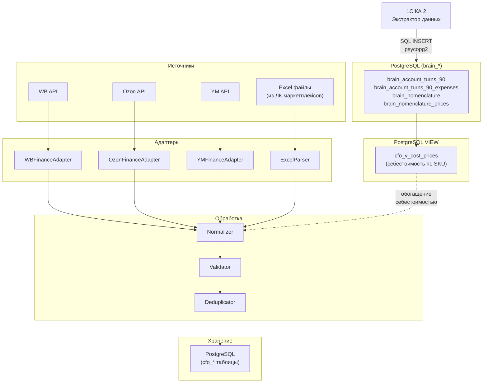

**Проект:** Финансовый учёт и управленческая аналитика  
**Модуль:** CFO  
**Версия:** 2.0  
**Дата:** Февраль 2026

---

## 2.1 Назначение

Раздел описывает процессы сбора, парсинга и нормализации финансовых данных из всех источников.

### Источники данных

| Источник | Тип | Периодичность | Данные |
|----------|-----|---------------|--------|
| Wildberries API | API | Ежедневно | Продажи, комиссии, логистика |
| Wildberries Excel | Файл | Еженедельно | Финансовый отчёт из ЛК |
| Ozon API | API | Ежедневно | Транзакции |
| Ozon Excel | Файл | Еженедельно | Отчёт о реализации |
| Яндекс.Маркет API | API | Ежедневно | Финансовый отчёт |
| Яндекс.Маркет Excel | Файл | Еженедельно | Детализация из ЛК |
| 1С:КА 2 → PostgreSQL | brain\_\* таблицы | Еженедельно (авто) | Выручка, себестоимость, расходы |
| Бухгалтерская первичка | Файл | По мере поступления | Накладные, акты |

<Note>
**Изменение v2.0:** Файловый обмен с 1С (CSV/XLSX → сетевая папка → парсер) полностью заменён прямой записью из 1С:КА 2 в PostgreSQL через Экстрактор данных 1С. Данные поступают в таблицы с префиксом `brain_*` и доступны CFO через PostgreSQL VIEW. Подробности — [Приложение А1: Реестр запросов 1С → PostgreSQL](/cfo/adolf_cfo_a1_1c_reports).
</Note>

<Note>
**Изменение v1.1:** Идентификация товаров из 1С производится только по Артикулу (SKU). Штрихкоды в выгрузках 1С не используются, т.к. не указываются при оптовых продажах. Номенклатурные группы не ведутся в базе 1С заказчика.
</Note>

---

## 2.2 Архитектура Data Ingestion

### 2.2.1 Общая схема



### 2.2.2 Структура папок для файлов

```
/data/inbox/cfo/
├── marketplace/
│   ├── wb/                    # Excel-отчёты Wildberries
│   │   └── WB_Finance_2026-01-15.xlsx
│   ├── ozon/                  # Excel-отчёты Ozon
│   │   └── Ozon_Realization_2026-01-15.xlsx
│   └── ym/                    # Excel-отчёты Яндекс.Маркет
│       └── YM_Finance_2026-01-15.xlsx
└── primary/                   # Бухгалтерская первичка
    ├── invoices/              # Накладные
    ├── acts/                  # Акты
    └── contracts/             # Договоры
```

<Warning>
Директория `/data/inbox/cfo/costs/` удалена в v2.0. Себестоимость больше не поступает через файловый обмен — данные записываются Экстрактором напрямую в таблицу `brain_account_turns_90`.
</Warning>

---

## 2.3 Wildberries Finance Adapter

### 2.3.1 API Endpoint

| Параметр | Значение |
|----------|----------|
| Base URL | `https://statistics-api.wildberries.ru` |
| Endpoint | `/api/v1/supplier/reportDetailByPeriod` |
| Method | GET |
| Auth | Header `Authorization: {API_KEY}` |

### 2.3.2 Параметры запроса

| Параметр | Тип | Обязательный | Описание |
|----------|-----|--------------|----------|
| `dateFrom` | string | Да | Начало периода (RFC3339) |
| `dateTo` | string | Да | Конец периода (RFC3339) |
| `limit` | int | Нет | Лимит записей (макс. 100000) |
| `rrdid` | int | Нет | ID для пагинации |

### 2.3.3 Структура ответа

```json
{
  "realizationreport_id": 123456789,
  "date_from": "2026-01-01T00:00:00Z",
  "date_to": "2026-01-07T23:59:59Z",
  "create_dt": "2026-01-08T10:00:00Z",
  "suppliercontract_code": null,
  "rrd_id": 987654321,
  "gi_id": 111222333,
  "subject_name": "Платья",
  "nm_id": 12345678,
  "brand_name": "Охана Маркет",
  "sa_name": "OM-12345",
  "ts_name": "44",
  "barcode": "2000000000001",
  "doc_type_name": "Продажа",
  "quantity": 1,
  "retail_price": 3500.00,
  "retail_amount": 3500.00,
  "sale_percent": 15,
  "commission_percent": 15.5,
  "office_name": "Коледино",
  "supplier_oper_name": "Продажа",
  "order_dt": "2026-01-05T14:30:00Z",
  "sale_dt": "2026-01-06T10:00:00Z",
  "rr_dt": "2026-01-07T00:00:00Z",
  "shk_id": 999888777,
  "retail_price_withdisc_rub": 2975.00,
  "delivery_amount": 50,
  "return_amount": 0,
  "delivery_rub": 85.00,
  "gi_box_type_name": "Короб",
  "product_discount_for_report": 525.00,
  "supplier_promo": 0,
  "rid": 0,
  "ppvz_spp_prc": 10.5,
  "ppvz_kvw_prc_base": 15.5,
  "ppvz_kvw_prc": 15.5,
  "ppvz_sales_commission": 461.13,
  "ppvz_for_pay": 2428.87,
  "ppvz_reward": 0,
  "acquiring_fee": 0,
  "acquiring_bank": "",
  "ppvz_vw": 297.50,
  "ppvz_vw_nds": 59.50,
  "ppvz_office_id": 123,
  "ppvz_office_name": "Коледино",
  "ppvz_supplier_id": 456,
  "ppvz_supplier_name": "ООО Охана",
  "ppvz_inn": "1234567890",
  "declaration_number": "",
  "bonus_type_name": "",
  "sticker_id": "WB-123456789",
  "site_country": "RU",
  "penalty": 0,
  "additional_payment": 0,
  "rebill_logistic_cost": 0,
  "rebill_logistic_org": "",
  "kiz": "",
  "storage_fee": 5.50,
  "deduction": 0,
  "acceptance": 0,
  "srid": "abc123def456"
}
```

### 2.3.4 Маппинг полей WB → CFO

| Поле WB API | Поле CFO | Описание |
|-------------|----------|----------|
| `sa_name` | `sku` | Артикул продавца (основной идентификатор) |
| `nm_id` | `nm_id` | Номенклатура WB |
| `barcode` | `barcode` | Штрихкод (опционально, из API МП) |
| `subject_name` | `category` | Категория |
| `brand_name` | `brand_name` | Бренд |
| `ts_name` | `size` | Размер |
| `retail_price_withdisc_rub` | `revenue` | Выручка (с учётом скидок) |
| `ppvz_sales_commission` | `commission` | Комиссия МП |
| `delivery_rub` | `logistics` | Логистика |
| `return_amount` | `return_logistics` | Обратная логистика |
| `storage_fee` | `storage` | Хранение |
| `ppvz_for_pay` | `payout` | К выплате |
| `sale_dt` | `sale_date` | Дата продажи |
| `doc_type_name` | `operation_type` | Тип операции |
| `srid` | `external_id` | Уникальный ID операции |

### 2.3.5 Реализация адаптера

Код реализации WBFinanceAdapter — см. [CFO Раздел 7: Celery, задача cfo\_import\_wb](/cfo/adolf_cfo_7_celery). Ниже — интерфейс и маппинг.

```python
@dataclass
class WBTransaction:
    """Транзакция Wildberries."""
    external_id: str
    sku: str
    nm_id: int
    barcode: Optional[str]  # Опционально — приходит из API МП
    category: str
    brand_name: str
    size: str
    revenue: float
    commission: float
    logistics: float
    return_logistics: float
    storage: float
    payout: float
    sale_date: datetime
    operation_type: str
    quantity: int


class WBFinanceAdapter:
    """Адаптер для финансового API Wildberries."""
    
    BASE_URL = "https://statistics-api.wildberries.ru"
    
    def __init__(self, api_key: str):
        self.api_key = api_key
        self.headers = {"Authorization": api_key}
    
    async def get_transactions(
        self,
        date_from: date,
        date_to: date
    ) -> List[WBTransaction]:
        """Получение транзакций за период с пагинацией."""
        ...
    
    def _map_transaction(self, raw: dict) -> WBTransaction:
        """Маппинг сырых данных в транзакцию."""
        
        return WBTransaction(
            external_id=raw.get("srid", ""),
            sku=raw.get("sa_name", ""),
            nm_id=raw.get("nm_id", 0),
            barcode=raw.get("barcode") or None,
            category=raw.get("subject_name", ""),
            brand_name=raw.get("brand_name", ""),
            size=raw.get("ts_name", ""),
            revenue=float(raw.get("retail_price_withdisc_rub", 0)),
            commission=float(raw.get("ppvz_sales_commission", 0)),
            logistics=float(raw.get("delivery_rub", 0)),
            return_logistics=float(raw.get("return_amount", 0)),
            storage=float(raw.get("storage_fee", 0)),
            payout=float(raw.get("ppvz_for_pay", 0)),
            sale_date=datetime.fromisoformat(
                raw.get("sale_dt", "").replace("Z", "+00:00")
            ),
            operation_type=raw.get("doc_type_name", ""),
            quantity=int(raw.get("quantity", 0))
        )
```

---

## 2.4 Ozon Finance Adapter

### 2.4.1 API Endpoint

| Параметр | Значение |
|----------|----------|
| Base URL | `https://api-seller.ozon.ru` |
| Endpoint | `/v3/finance/transaction/list` |
| Method | POST |
| Auth | Headers `Client-Id` + `Api-Key` |

### 2.4.2 Параметры запроса

```json
{
  "filter": {
    "date": {
      "from": "2026-01-01T00:00:00Z",
      "to": "2026-01-07T23:59:59Z"
    },
    "operation_type": [],
    "posting_number": "",
    "transaction_type": "all"
  },
  "page": 1,
  "page_size": 1000
}
```

### 2.4.3 Структура ответа

```json
{
  "result": {
    "operations": [
      {
        "operation_id": 123456789,
        "operation_type": "OperationAgentDeliveredToCustomer",
        "operation_date": "2026-01-06T10:00:00Z",
        "operation_type_name": "Доставка покупателю",
        "delivery_charge": 50.0,
        "return_delivery_charge": 0,
        "accruals_for_sale": 2500.0,
        "sale_commission": 375.0,
        "amount": 2075.0,
        "type": "compensation",
        "posting": {
          "delivery_schema": "FBO",
          "order_date": "2026-01-05T14:30:00Z",
          "posting_number": "12345678-0001-1"
        },
        "items": [
          {
            "name": "Платье летнее синее",
            "sku": 123456789,
            "offer_id": "OM-12345"
          }
        ],
        "services": [
          {
            "name": "MarketplaceServiceItemFulfillment",
            "price": -50.0
          }
        ]
      }
    ],
    "page_count": 5,
    "row_count": 4500
  }
}
```

### 2.4.4 Маппинг полей Ozon → CFO

| Поле Ozon API | Поле CFO | Описание |
|---------------|----------|----------|
| `items[0].offer_id` | `sku` | Артикул продавца (основной идентификатор) |
| `items[0].sku` | `nm_id` | SKU Ozon |
| `items[0].name` | `product_name` | Название товара |
| `accruals_for_sale` | `revenue` | Выручка |
| `sale_commission` | `commission` | Комиссия |
| `delivery_charge` | `logistics` | Логистика |
| `return_delivery_charge` | `return_logistics` | Обратная логистика |
| `amount` | `payout` | К выплате |
| `operation_date` | `sale_date` | Дата операции |
| `operation_type_name` | `operation_type` | Тип операции |
| `operation_id` | `external_id` | Уникальный ID |

### 2.4.5 Реализация адаптера

Код реализации OzonFinanceAdapter — см. [CFO Раздел 7: Celery, задача cfo\_import\_ozon](/cfo/adolf_cfo_7_celery). Ниже — интерфейс и маппинг.

```python
@dataclass
class OzonTransaction:
    """Транзакция Ozon."""
    external_id: str
    sku: str
    ozon_sku: int
    product_name: str
    revenue: float
    commission: float
    logistics: float
    return_logistics: float
    storage: float
    payout: float
    sale_date: datetime
    operation_type: str
    quantity: int


class OzonFinanceAdapter:
    """Адаптер для финансового API Ozon."""
    
    BASE_URL = "https://api-seller.ozon.ru"
    
    def __init__(self, client_id: str, api_key: str):
        self.client_id = client_id
        self.api_key = api_key
        self.headers = {
            "Client-Id": client_id,
            "Api-Key": api_key,
            "Content-Type": "application/json"
        }
    
    async def get_transactions(
        self,
        date_from: date,
        date_to: date
    ) -> List[OzonTransaction]:
        """Получение транзакций за период с пагинацией."""
        ...
    
    def _map_transaction(self, raw: dict) -> OzonTransaction:
        """Маппинг сырых данных в транзакцию."""
        
        items = raw.get("items", [{}])
        first_item = items[0] if items else {}
        
        storage = sum(
            abs(float(s.get("price", 0)))
            for s in raw.get("services", [])
            if "Storage" in s.get("name", "")
        )
        
        return OzonTransaction(
            external_id=str(raw.get("operation_id", "")),
            sku=first_item.get("offer_id", ""),
            ozon_sku=first_item.get("sku", 0),
            product_name=first_item.get("name", ""),
            revenue=float(raw.get("accruals_for_sale", 0)),
            commission=float(raw.get("sale_commission", 0)),
            logistics=float(raw.get("delivery_charge", 0)),
            return_logistics=float(raw.get("return_delivery_charge", 0)),
            storage=storage,
            payout=float(raw.get("amount", 0)),
            sale_date=datetime.fromisoformat(
                raw.get("operation_date", "").replace("Z", "+00:00")
            ),
            operation_type=raw.get("operation_type_name", ""),
            quantity=1
        )
```

---

## 2.5 Яндекс.Маркет Finance Adapter

### 2.5.1 API Endpoint

| Параметр | Значение |
|----------|----------|
| Base URL | `https://api.partner.market.yandex.ru` |
| Endpoint | `/v2/campaigns/{campaignId}/stats/orders` |
| Method | GET |
| Auth | Header `Authorization: OAuth {TOKEN}` |

### 2.5.2 Маппинг полей YM → CFO

| Поле YM API | Поле CFO | Описание |
|-------------|----------|----------|
| `shopSku` | `sku` | Артикул продавца |
| `marketSku` | `nm_id` | SKU Яндекса |
| `offerName` | `product_name` | Название |
| `prices.value` | `revenue` | Выручка |
| `commissions.amount` | `commission` | Комиссия |
| `delivery.price` | `logistics` | Логистика |

---

## 2.6 Excel Parser

### 2.6.1 Wildberries Excel

**Структура файла:**

| Колонка | Описание |
|---------|----------|
| Артикул поставщика | SKU |
| Баркод | Штрихкод (из файла МП, не 1С) |
| Бренд | Название бренда |
| Предмет | Категория |
| Размер | Размер товара |
| К перечислению продавцу | Сумма выплаты |
| Вознаграждение ВБ | Комиссия |
| Логистика | Стоимость доставки |
| Хранение | Стоимость хранения |
| Дата продажи | Дата операции |

### 2.6.2 Маппинг колонок Excel

```python
class WBExcelParser:
    """Парсер Excel-отчётов Wildberries."""
    
    COLUMN_MAPPING = {
        "Артикул поставщика": "sku",
        "Артикул": "sku",
        "Баркод": "barcode",  # Приходит из файла МП
        "Бренд": "brand_name",
        "Предмет": "category",
        "Размер": "size",
        "К перечислению продавцу": "payout",
        "К перечислению": "payout",
        "Вознаграждение ВБ": "commission",
        "Вознаграждение Вайлдберриз": "commission",
        "Логистика": "logistics",
        "Услуги логистики": "logistics",
        "Хранение": "storage",
        "Услуги хранения": "storage",
        "Дата продажи": "sale_date",
        "Дата заказа покупателем": "sale_date",
        "Тип документа": "operation_type",
        "Обоснование": "operation_type",
        "Кол-во": "quantity",
        "Количество": "quantity"
    }
```

---

## 2.7 Данные 1С через brain\_\* VIEW

<Info>
**v2.0:** Данные из 1С:КА 2 поступают в PostgreSQL автоматически через Экстрактор данных 1С (Infostart #1970328). CFO читает их через PostgreSQL VIEW, без промежуточных файлов и парсеров. Полное описание таблиц и запросов — [Приложение А1](/cfo/adolf_cfo_a1_1c_reports).
</Info>

### 2.7.1 Источники данных 1С для CFO

| Таблица brain\_\* | Запрос | Данные | Использование в CFO |
|-------------------|--------|--------|---------------------|
| `brain_account_turns_90` | Q-01 | Выручка и себестоимость по номенклатуре | P&L, Cost Mapping, ABC-анализ |
| `brain_account_turns_90_expenses` | Q-02 | Коммерческие и управленческие расходы | P&L (статьи расходов) |
| `brain_nomenclature` | Q-10 | Справочник номенклатуры | Маппинг SKU → название, бренд |
| `brain_nomenclature_prices` | Q-11 | Цены номенклатуры | Справочные цены |

### 2.7.2 VIEW: cfo\_v\_cost\_prices

VIEW для получения себестоимости по SKU из данных бухучёта (счёт 90.02.1).

```sql
CREATE OR REPLACE VIEW cfo_v_cost_prices AS
SELECT
    t.article                           AS sku,
    t.nomenclature                      AS product_name,
    t.organization                      AS organization,
    -- Себестоимость = оборот по Дт 90.02.1 / количество
    CASE 
        WHEN SUM(t.quantity_dt) > 0 
        THEN ROUND(SUM(t.amount_dt) / SUM(t.quantity_dt), 2)
        ELSE NULL
    END                                 AS cost_price,
    SUM(t.amount_dt)                    AS total_cost,
    SUM(t.quantity_dt)                  AS total_quantity,
    t.period                            AS period,
    MAX(t.loaded_at)                    AS data_freshness
FROM brain_account_turns_90 t
WHERE t.account_dt = '90.02.1'
  AND t.article IS NOT NULL
  AND t.article != ''
GROUP BY t.article, t.nomenclature, t.organization, t.period;

COMMENT ON VIEW cfo_v_cost_prices IS 
    'Себестоимость по SKU из brain_account_turns_90 (Q-01, счёт 90.02.1)';
```

### 2.7.3 VIEW: cfo\_v\_revenue\_1c

VIEW для получения выручки по данным бухучёта (счёт 90.01.1) — используется для сверки с данными маркетплейсов.

```sql
CREATE OR REPLACE VIEW cfo_v_revenue_1c AS
SELECT
    t.article                           AS sku,
    t.nomenclature                      AS product_name,
    t.counterparty                      AS counterparty,
    t.organization                      AS organization,
    SUM(t.amount_ct)                    AS revenue,
    SUM(t.quantity_dt)                  AS quantity,
    t.period                            AS period,
    MAX(t.loaded_at)                    AS data_freshness
FROM brain_account_turns_90 t
WHERE t.account_ct = '90.01.1'
  AND t.article IS NOT NULL
  AND t.article != ''
GROUP BY t.article, t.nomenclature, t.counterparty, t.organization, t.period;

COMMENT ON VIEW cfo_v_revenue_1c IS 
    'Выручка по SKU из brain_account_turns_90 (Q-01, счёт 90.01.1)';
```

### 2.7.4 Сервис работы с себестоимостью

```python
class CostPriceService:
    """Сервис работы с себестоимостью.
    
    v2.0: Читает из PostgreSQL VIEW cfo_v_cost_prices
    (источник — brain_account_turns_90, заполняется Экстрактором 1С).
    """
    
    def __init__(self, db_session):
        self.db = db_session
        self._cost_cache: dict = {}
    
    async def get_cost_price(self, sku: str) -> Optional[float]:
        """Получение себестоимости по SKU.
        
        Читает из VIEW cfo_v_cost_prices (brain_account_turns_90).
        
        Args:
            sku: Артикул товара
            
        Returns:
            Себестоимость или None если не найдена
        """
        
        if sku in self._cost_cache:
            return self._cost_cache[sku]
        
        query = """
            SELECT cost_price 
            FROM cfo_v_cost_prices
            WHERE sku = $1
            ORDER BY period DESC
            LIMIT 1
        """
        
        row = await self.db.fetchrow(query, sku)
        
        if row and row["cost_price"]:
            cost = float(row["cost_price"])
            self._cost_cache[sku] = cost
            return cost
        
        return None
    
    async def get_cost_map(self) -> dict:
        """Получение полного словаря SKU → себестоимость.
        
        Берёт последний актуальный период для каждого SKU.
        
        Returns:
            Словарь {sku: cost_price}
        """
        
        query = """
            SELECT DISTINCT ON (sku) sku, cost_price
            FROM cfo_v_cost_prices
            WHERE cost_price IS NOT NULL
            ORDER BY sku, period DESC
        """
        
        rows = await self.db.fetch(query)
        self._cost_cache = {
            row["sku"]: float(row["cost_price"])
            for row in rows
        }
        
        return self._cost_cache
    
    async def check_data_freshness(self) -> dict:
        """Проверка свежести данных brain_account_turns_90.
        
        Returns:
            Словарь с информацией о свежести данных
        """
        
        query = """
            SELECT 
                MAX(data_freshness) AS last_loaded,
                MAX(period) AS last_period,
                COUNT(DISTINCT sku) AS sku_count
            FROM cfo_v_cost_prices
        """
        
        row = await self.db.fetchrow(query)
        
        return {
            "last_loaded": row["last_loaded"],
            "last_period": row["last_period"],
            "sku_count": row["sku_count"],
            "is_stale": (
                row["last_loaded"] is not None 
                and (datetime.now() - row["last_loaded"]).days > 10
            )
        }
    
    async def enrich_transactions(
        self, 
        transactions: List["NormalizedTransaction"]
    ) -> List["NormalizedTransaction"]:
        """Обогащение транзакций себестоимостью.
        
        Связывание по полю SKU.
        
        Args:
            transactions: Список транзакций
            
        Returns:
            Транзакции с заполненным cost_price
        """
        
        # Предзагрузка кэша для batch-обработки
        if not self._cost_cache:
            await self.get_cost_map()
        
        for tx in transactions:
            if tx.sku:
                tx.cost_price = self._cost_cache.get(tx.sku)
        
        return transactions
```

---

## 2.8 Normalizer

### 2.8.1 Унифицированная структура транзакции

```python
@dataclass
class NormalizedTransaction:
    """Нормализованная транзакция для всех маркетплейсов."""
    
    # Идентификация
    external_id: str              # Уникальный ID из источника
    marketplace: str              # wb, ozon, ym
    source: str                   # api, excel
    
    # Товар
    sku: str                      # Артикул продавца (основной идентификатор)
    barcode: Optional[str]        # Штрихкод (только из API/Excel МП, не из 1С)
    nm_id: Optional[int]          # ID номенклатуры МП
    product_name: Optional[str]   # Название товара
    category: Optional[str]       # Категория
    brand_name: Optional[str]     # Бренд
    size: Optional[str]           # Размер
    
    # Финансы
    revenue: float                # Выручка (цена продажи)
    cost_price: Optional[float]   # Себестоимость (из brain_*, по SKU)
    commission: float             # Комиссия МП
    logistics: float              # Логистика до покупателя
    return_logistics: float       # Обратная логистика
    storage: float                # Хранение
    advertising: float            # Реклама (если есть)
    payout: float                 # К выплате
    
    # Расчётные поля
    gross_profit: Optional[float] # Валовая прибыль (revenue - cost_price)
    net_profit: Optional[float]   # Чистая прибыль (payout - cost_price)
    
    # Мета
    sale_date: date               # Дата продажи
    operation_type: str           # Тип операции
    quantity: int                 # Количество
    
    # Служебные
    created_at: datetime          # Дата создания записи
    source_file: Optional[str]    # Имя исходного файла
    
    def calculate_profits(self):
        """Расчёт прибыли при наличии себестоимости."""
        if self.cost_price is not None:
            self.gross_profit = self.revenue - (self.cost_price * self.quantity)
            self.net_profit = self.payout - (self.cost_price * self.quantity)
```

### 2.8.2 TransactionNormalizer

```python
class TransactionNormalizer:
    """Нормализация транзакций из разных источников."""
    
    def __init__(self, cost_service: CostPriceService):
        self.cost_service = cost_service
    
    async def normalize_wb(self, tx: WBTransaction) -> NormalizedTransaction:
        """Нормализация транзакции WB."""
        
        cost_price = await self.cost_service.get_cost_price(tx.sku)
        
        normalized = NormalizedTransaction(
            external_id=tx.external_id,
            marketplace="wb",
            source="api",
            sku=tx.sku,
            barcode=tx.barcode,
            nm_id=tx.nm_id,
            product_name=None,
            category=tx.category,
            brand_name=tx.brand_name,
            size=tx.size,
            revenue=tx.revenue,
            cost_price=cost_price,
            commission=tx.commission,
            logistics=tx.logistics,
            return_logistics=tx.return_logistics,
            storage=tx.storage,
            advertising=0.0,
            payout=tx.payout,
            gross_profit=None,
            net_profit=None,
            sale_date=tx.sale_date.date(),
            operation_type=tx.operation_type,
            quantity=tx.quantity,
            created_at=datetime.now(),
            source_file=None
        )
        
        normalized.calculate_profits()
        return normalized
    
    async def normalize_ozon(self, tx: OzonTransaction) -> NormalizedTransaction:
        """Нормализация транзакции Ozon."""
        
        cost_price = await self.cost_service.get_cost_price(tx.sku)
        
        normalized = NormalizedTransaction(
            external_id=tx.external_id,
            marketplace="ozon",
            source="api",
            sku=tx.sku,
            barcode=None,
            nm_id=tx.ozon_sku,
            product_name=tx.product_name,
            category=None,
            brand_name=None,
            size=None,
            revenue=tx.revenue,
            cost_price=cost_price,
            commission=tx.commission,
            logistics=tx.logistics,
            return_logistics=tx.return_logistics,
            storage=tx.storage,
            advertising=0.0,
            payout=tx.payout,
            gross_profit=None,
            net_profit=None,
            sale_date=tx.sale_date.date(),
            operation_type=tx.operation_type,
            quantity=tx.quantity,
            created_at=datetime.now(),
            source_file=None
        )
        
        normalized.calculate_profits()
        return normalized
```

---

## 2.9 Validator

### 2.9.1 Правила валидации

| Правило | Описание | Действие |
|---------|----------|----------|
| Required fields | `sku`, `marketplace`, `sale_date` обязательны | Reject |
| Revenue &gt;= 0 | Выручка не может быть отрицательной | Reject |
| Valid marketplace | `marketplace IN (wb, ozon, ym)` | Reject |
| Valid date | Дата не в будущем | Reject |
| Duplicate check | Проверка по `external_id + marketplace` | Skip |
| Cost price warning | Себестоимость не найдена в brain\_\* | Warning (не reject) |

### 2.9.2 Реализация

```python
@dataclass
class ValidationResult:
    """Результат валидации."""
    is_valid: bool
    errors: List[str]
    warnings: List[str]


class TransactionValidator:
    """Валидация транзакций."""
    
    VALID_MARKETPLACES = {"wb", "ozon", "ym"}
    
    def validate(self, tx: NormalizedTransaction) -> ValidationResult:
        """Валидация транзакции."""
        
        errors = []
        warnings = []
        
        if not tx.sku:
            errors.append("SKU is required")
        if not tx.marketplace:
            errors.append("Marketplace is required")
        if not tx.sale_date:
            errors.append("Sale date is required")
        if tx.marketplace not in self.VALID_MARKETPLACES:
            errors.append(f"Invalid marketplace: {tx.marketplace}")
        if tx.revenue < 0:
            errors.append(f"Revenue cannot be negative: {tx.revenue}")
        if tx.sale_date and tx.sale_date > date.today():
            errors.append(f"Sale date cannot be in future: {tx.sale_date}")
        if tx.cost_price is None:
            warnings.append(f"Cost price not found in brain_* for SKU: {tx.sku}")
        
        return ValidationResult(
            is_valid=len(errors) == 0,
            errors=errors,
            warnings=warnings
        )
    
    def validate_batch(
        self,
        transactions: List[NormalizedTransaction]
    ) -> Tuple[List[NormalizedTransaction], List[Tuple[NormalizedTransaction, List[str]]]]:
        """Валидация пакета транзакций."""
        
        valid = []
        invalid = []
        warnings_count = 0
        
        for tx in transactions:
            result = self.validate(tx)
            
            if result.is_valid:
                valid.append(tx)
                if result.warnings:
                    warnings_count += 1
                    for w in result.warnings:
                        logger.warning(f"Transaction {tx.external_id}: {w}")
            else:
                invalid.append((tx, result.errors))
        
        logger.info(
            f"Validated: {len(valid)} valid, {len(invalid)} invalid, "
            f"{warnings_count} with warnings"
        )
        return valid, invalid
```

---

## 2.10 Deduplicator

### 2.10.1 Стратегия дедупликации

| Источник | Ключ дедупликации | Описание |
|----------|-------------------|----------|
| API | `external_id + marketplace` | Уникальный ID операции |
| Excel | `sku + sale_date + revenue + marketplace` | Комбинация полей |

### 2.10.2 Реализация

```python
class TransactionDeduplicator:
    """Дедупликация транзакций."""
    
    def __init__(self, db_session):
        self.db = db_session
    
    async def deduplicate(
        self,
        transactions: List[NormalizedTransaction]
    ) -> List[NormalizedTransaction]:
        """Удаление дубликатов."""
        
        existing_ids = await self._get_existing_ids(
            [t.external_id for t in transactions if t.external_id]
        )
        
        new_transactions = [
            t for t in transactions
            if t.external_id not in existing_ids
        ]
        
        excel_transactions = [t for t in new_transactions if t.source == "excel"]
        api_transactions = [t for t in new_transactions if t.source == "api"]
        
        unique_excel = self._deduplicate_excel(excel_transactions)
        
        return api_transactions + unique_excel
    
    async def _get_existing_ids(self, external_ids: List[str]) -> set:
        """Получение существующих ID из БД."""
        
        if not external_ids:
            return set()
        
        query = """
            SELECT external_id 
            FROM cfo_transactions 
            WHERE external_id = ANY($1)
        """
        
        rows = await self.db.fetch(query, external_ids)
        return {row["external_id"] for row in rows}
    
    def _deduplicate_excel(
        self,
        transactions: List[NormalizedTransaction]
    ) -> List[NormalizedTransaction]:
        """Дедупликация Excel-транзакций по комбинации полей."""
        
        seen = set()
        unique = []
        
        for tx in transactions:
            key = (tx.sku, tx.sale_date, tx.revenue, tx.marketplace)
            if key not in seen:
                seen.add(key)
                unique.append(tx)
        
        return unique
```

---

## 2.11 Ingestion Service

### 2.11.1 Оркестрация импорта

```python
class DataIngestionService:
    """Сервис импорта финансовых данных.
    
    v2.0: Себестоимость из 1С читается из brain_* через VIEW.
    Файловый импорт себестоимости удалён.
    """
    
    def __init__(
        self,
        wb_adapter: WBFinanceAdapter,
        ozon_adapter: OzonFinanceAdapter,
        ym_adapter: YMFinanceAdapter,
        excel_parser: "ExcelParser",
        cost_service: CostPriceService,
        normalizer: TransactionNormalizer,
        validator: TransactionValidator,
        deduplicator: TransactionDeduplicator,
        db_session
    ):
        self.wb = wb_adapter
        self.ozon = ozon_adapter
        self.ym = ym_adapter
        self.excel_parser = excel_parser
        self.cost_service = cost_service
        self.normalizer = normalizer
        self.validator = validator
        self.deduplicator = deduplicator
        self.db = db_session
    
    async def import_all(self, date_from: date, date_to: date) -> "ImportResult":
        """Полный импорт из всех источников.
        
        Себестоимость из 1С уже доступна через VIEW 
        (brain_account_turns_90 → cfo_v_cost_prices).
        """
        
        result = ImportResult()
        
        # Предзагрузка кэша себестоимости из brain_*
        await self.cost_service.get_cost_map()
        
        # Проверка свежести данных brain_*
        freshness = await self.cost_service.check_data_freshness()
        if freshness["is_stale"]:
            logger.warning(
                f"brain_account_turns_90 data is stale! "
                f"Last loaded: {freshness['last_loaded']}"
            )
        
        # API импорт
        result.merge(await self.import_wb_api(date_from, date_to))
        result.merge(await self.import_ozon_api(date_from, date_to))
        result.merge(await self.import_ym_api(date_from, date_to))
        
        # Excel импорт (файлы из ЛК маркетплейсов)
        result.merge(await self.import_excel_files())
        
        return result
    
    async def import_wb_api(
        self,
        date_from: date,
        date_to: date
    ) -> "ImportResult":
        """Импорт из WB API."""
        
        try:
            raw = await self.wb.get_transactions(date_from, date_to)
            normalized = [await self.normalizer.normalize_wb(t) for t in raw]
            valid, invalid = self.validator.validate_batch(normalized)
            unique = await self.deduplicator.deduplicate(valid)
            
            await self._save_transactions(unique)
            
            return ImportResult(
                source="wb_api",
                total=len(raw),
                valid=len(valid),
                invalid=len(invalid),
                duplicates=len(valid) - len(unique),
                saved=len(unique)
            )
        
        except Exception as e:
            logger.error(f"WB API import failed: {e}")
            return ImportResult(source="wb_api", error=str(e))
    
    async def _save_transactions(
        self,
        transactions: List[NormalizedTransaction]
    ):
        """Сохранение транзакций в БД."""
        
        if not transactions:
            return
        
        query = """
            INSERT INTO cfo_transactions (
                external_id, marketplace, source, sku, barcode, nm_id,
                product_name, category, brand_name, size,
                revenue, cost_price, commission, logistics, return_logistics,
                storage, advertising, payout, gross_profit, net_profit,
                sale_date, operation_type, quantity, source_file, created_at
            ) VALUES ($1, $2, $3, $4, $5, $6, $7, $8, $9, $10,
                      $11, $12, $13, $14, $15, $16, $17, $18, $19, $20,
                      $21, $22, $23, $24, $25)
        """
        
        for tx in transactions:
            await self.db.execute(
                query,
                tx.external_id, tx.marketplace, tx.source,
                tx.sku, tx.barcode, tx.nm_id,
                tx.product_name, tx.category, tx.brand_name, tx.size,
                tx.revenue, tx.cost_price, tx.commission,
                tx.logistics, tx.return_logistics,
                tx.storage, tx.advertising, tx.payout,
                tx.gross_profit, tx.net_profit,
                tx.sale_date, tx.operation_type, tx.quantity,
                tx.source_file, tx.created_at
            )


@dataclass
class ImportResult:
    """Результат импорта."""
    source: str = ""
    total: int = 0
    valid: int = 0
    invalid: int = 0
    duplicates: int = 0
    saved: int = 0
    error: Optional[str] = None
    
    def merge(self, other: "ImportResult"):
        """Объединение результатов."""
        self.total += other.total
        self.valid += other.valid
        self.invalid += other.invalid
        self.duplicates += other.duplicates
        self.saved += other.saved
```

---

## 2.12 История изменений

### v2.0 (Февраль 2026)

| Компонент | Было (v1.1) | Стало (v2.0) |
|-----------|-------------|--------------|
| Источник себестоимости | CSV/XLSX файлы из 1С → `/data/inbox/cfo/costs/` | PostgreSQL `brain_account_turns_90` (через Экстрактор данных 1С) |
| CostPriceParser | Парсер CSV/XLS файлов | **Удалён** — заменён на VIEW `cfo_v_cost_prices` |
| CSVParser | Парсер CSV из 1С | **Удалён** |
| Директория `/data/inbox/cfo/costs/` | Каталог для файлов себестоимости | **Удалён** |
| CostPriceService | Читал из файлов → `cfo_cost_prices` | Читает из VIEW `cfo_v_cost_prices` (поверх `brain_*`) |
| IngestionService.import\_cost\_prices() | Файловый импорт с архивированием | **Удалён** — данные уже в PostgreSQL |
| Проверка свежести | Отсутствовала | `check_data_freshness()` — алерт при устаревших данных brain\_\* |
| Мониторинг brain\_\* | Отсутствовал | Celery-задача (см. [Раздел 7](/cfo/adolf_cfo_7_celery)) |

### v1.1 (Январь 2026)

| Компонент | Было (v1.0) | Стало (v1.1) |
|-----------|-------------|--------------|
| Идентификатор товара из 1С | Штрихкод (barcode) | Артикул (sku) |
| Поле barcode в CostPriceRecord | Обязательное | Удалено |
| Номенклатурная группа | Присутствовала | Удалена (не ведётся в 1С) |
| Связывание с транзакциями | По barcode | По sku |
| Конфигурация 1С | Не указана | 1С:Комплексная автоматизация 2 |

---

**Документ подготовлен:** Февраль 2026  
**Версия:** 2.0  
**Статус:** Черновик
