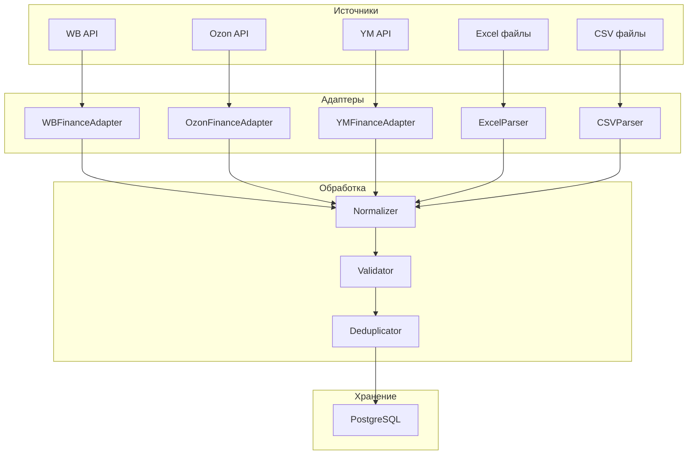

# ADOLF CFO — Раздел 2: Data Ingestion

**Проект:** Финансовый учёт и управленческая аналитика  
**Модуль:** CFO  
**Версия:** 1.0  
**Дата:** Январь 2026

---

## 2.1 Назначение

Раздел описывает процессы сбора, парсинга и нормализации финансовых данных из всех источников.

### Источники данных

| Источник | Тип | Периодичность | Данные |
|----------|-----|---------------|--------|
| Wildberries API | API | Ежедневно | Продажи, комиссии, логистика |
| Wildberries Excel | Файл | Еженедельно | Финансовый отчёт из ЛК |
| Ozon API | API | Ежедневно | Транзакции |
| Ozon Excel | Файл | Еженедельно | Отчёт о реализации |
| Яндекс.Маркет API | API | Ежедневно | Финансовый отчёт |
| Яндекс.Маркет Excel | Файл | Еженедельно | Детализация из ЛК |
| 1С (себестоимость) | Файл | Еженедельно | Barcode → COGS |
| Бухгалтерская первичка | Файл | По мере поступления | Накладные, акты |

---

## 2.2 Архитектура Data Ingestion

### 2.2.1 Общая схема



### 2.2.2 Структура папок для файлов

```
/data/inbox/cfo/
├── marketplace/
│   ├── wb/                    # Excel-отчёты Wildberries
│   │   └── WB_Finance_2026-01-15.xlsx
│   ├── ozon/                  # Excel-отчёты Ozon
│   │   └── Ozon_Realization_2026-01-15.xlsx
│   └── ym/                    # Excel-отчёты Яндекс.Маркет
│       └── YM_Finance_2026-01-15.xlsx
├── costs/                     # Себестоимость из 1С
│   └── COGS_2026-01-13.csv
└── primary/                   # Бухгалтерская первичка
    ├── invoices/              # Накладные
    ├── acts/                  # Акты
    └── contracts/             # Договоры
```

---

## 2.3 Wildberries Finance Adapter

### 2.3.1 API Endpoint

| Параметр | Значение |
|----------|----------|
| Base URL | `https://statistics-api.wildberries.ru` |
| Endpoint | `/api/v1/supplier/reportDetailByPeriod` |
| Method | GET |
| Auth | Header `Authorization: {API_KEY}` |

### 2.3.2 Параметры запроса

| Параметр | Тип | Обязательный | Описание |
|----------|-----|--------------|----------|
| `dateFrom` | string | Да | Начало периода (RFC3339) |
| `dateTo` | string | Да | Конец периода (RFC3339) |
| `limit` | int | Нет | Лимит записей (макс. 100000) |
| `rrdid` | int | Нет | ID для пагинации |

### 2.3.3 Структура ответа

```json
{
  "realizationreport_id": 123456789,
  "date_from": "2026-01-01T00:00:00Z",
  "date_to": "2026-01-07T23:59:59Z",
  "create_dt": "2026-01-08T10:00:00Z",
  "suppliercontract_code": null,
  "rrd_id": 987654321,
  "gi_id": 111222333,
  "subject_name": "Платья",
  "nm_id": 12345678,
  "brand_name": "Охана Маркет",
  "sa_name": "OM-12345",
  "ts_name": "44",
  "barcode": "2000000000001",
  "doc_type_name": "Продажа",
  "quantity": 1,
  "retail_price": 3500.00,
  "retail_amount": 3500.00,
  "sale_percent": 15,
  "commission_percent": 15.5,
  "office_name": "Коледино",
  "supplier_oper_name": "Продажа",
  "order_dt": "2026-01-05T14:30:00Z",
  "sale_dt": "2026-01-06T10:00:00Z",
  "rr_dt": "2026-01-07T00:00:00Z",
  "shk_id": 999888777,
  "retail_price_withdisc_rub": 2975.00,
  "delivery_amount": 50,
  "return_amount": 0,
  "delivery_rub": 85.00,
  "gi_box_type_name": "Короб",
  "product_discount_for_report": 525.00,
  "supplier_promo": 0,
  "rid": 0,
  "ppvz_spp_prc": 10.5,
  "ppvz_kvw_prc_base": 15.5,
  "ppvz_kvw_prc": 15.5,
  "ppvz_sales_commission": 461.13,
  "ppvz_for_pay": 2428.87,
  "ppvz_reward": 0,
  "acquiring_fee": 0,
  "acquiring_bank": "",
  "ppvz_vw": 297.50,
  "ppvz_vw_nds": 59.50,
  "ppvz_office_id": 123,
  "ppvz_office_name": "Коледино",
  "ppvz_supplier_id": 456,
  "ppvz_supplier_name": "ООО Охана",
  "ppvz_inn": "1234567890",
  "declaration_number": "",
  "bonus_type_name": "",
  "sticker_id": "WB-123456789",
  "site_country": "RU",
  "penalty": 0,
  "additional_payment": 0,
  "rebill_logistic_cost": 0,
  "rebill_logistic_org": "",
  "kiz": "",
  "storage_fee": 5.50,
  "deduction": 0,
  "acceptance": 0,
  "srid": "abc123def456"
}
```

### 2.3.4 Маппинг полей WB → CFO

| Поле WB API | Поле CFO | Описание |
|-------------|----------|----------|
| `sa_name` | `sku` | Артикул продавца |
| `nm_id` | `nm_id` | Номенклатура WB |
| `barcode` | `barcode` | Штрихкод |
| `subject_name` | `category` | Категория |
| `brand_name` | `brand_name` | Бренд |
| `ts_name` | `size` | Размер |
| `retail_price_withdisc_rub` | `revenue` | Выручка (с учётом скидок) |
| `ppvz_sales_commission` | `commission` | Комиссия МП |
| `delivery_rub` | `logistics` | Логистика |
| `return_amount` | `return_logistics` | Обратная логистика |
| `storage_fee` | `storage` | Хранение |
| `ppvz_for_pay` | `payout` | К выплате |
| `sale_dt` | `sale_date` | Дата продажи |
| `doc_type_name` | `operation_type` | Тип операции |
| `srid` | `external_id` | Уникальный ID операции |

### 2.3.5 Реализация адаптера

```python
from dataclasses import dataclass
from datetime import date, datetime
from typing import List, Optional
import aiohttp

@dataclass
class WBTransaction:
    """Транзакция Wildberries."""
    external_id: str
    sku: str
    nm_id: int
    barcode: str
    category: str
    brand_name: str
    size: str
    revenue: float
    commission: float
    logistics: float
    return_logistics: float
    storage: float
    payout: float
    sale_date: datetime
    operation_type: str
    quantity: int


class WBFinanceAdapter:
    """Адаптер для финансового API Wildberries."""
    
    BASE_URL = "https://statistics-api.wildberries.ru"
    
    def __init__(self, api_key: str):
        self.api_key = api_key
        self.headers = {"Authorization": api_key}
    
    async def get_transactions(
        self,
        date_from: date,
        date_to: date
    ) -> List[WBTransaction]:
        """Получение транзакций за период."""
        
        transactions = []
        rrdid = 0
        
        while True:
            batch = await self._fetch_batch(date_from, date_to, rrdid)
            
            if not batch:
                break
            
            transactions.extend(batch)
            rrdid = max(t.get("rrd_id", 0) for t in batch)
            
            if len(batch) < 100000:
                break
        
        return [self._map_transaction(t) for t in transactions]
    
    async def _fetch_batch(
        self,
        date_from: date,
        date_to: date,
        rrdid: int
    ) -> List[dict]:
        """Получение пакета данных с пагинацией."""
        
        url = f"{self.BASE_URL}/api/v1/supplier/reportDetailByPeriod"
        params = {
            "dateFrom": date_from.isoformat(),
            "dateTo": date_to.isoformat(),
            "limit": 100000
        }
        
        if rrdid > 0:
            params["rrdid"] = rrdid
        
        async with aiohttp.ClientSession() as session:
            async with session.get(
                url,
                params=params,
                headers=self.headers
            ) as resp:
                if resp.status == 429:
                    raise RateLimitError("WB API rate limit exceeded")
                
                if resp.status != 200:
                    raise APIError(f"WB API error: {resp.status}")
                
                return await resp.json()
    
    def _map_transaction(self, raw: dict) -> WBTransaction:
        """Маппинг сырых данных в структуру транзакции."""
        
        return WBTransaction(
            external_id=raw.get("srid", ""),
            sku=raw.get("sa_name", ""),
            nm_id=raw.get("nm_id", 0),
            barcode=raw.get("barcode", ""),
            category=raw.get("subject_name", ""),
            brand_name=raw.get("brand_name", ""),
            size=raw.get("ts_name", ""),
            revenue=float(raw.get("retail_price_withdisc_rub", 0)),
            commission=float(raw.get("ppvz_sales_commission", 0)),
            logistics=float(raw.get("delivery_rub", 0)),
            return_logistics=float(raw.get("return_amount", 0)),
            storage=float(raw.get("storage_fee", 0)),
            payout=float(raw.get("ppvz_for_pay", 0)),
            sale_date=datetime.fromisoformat(
                raw.get("sale_dt", "").replace("Z", "+00:00")
            ),
            operation_type=raw.get("doc_type_name", ""),
            quantity=int(raw.get("quantity", 1))
        )
```

---

## 2.4 Ozon Finance Adapter

### 2.4.1 API Endpoint

| Параметр | Значение |
|----------|----------|
| Base URL | `https://api-seller.ozon.ru` |
| Endpoint | `/v3/finance/transaction/list` |
| Method | POST |
| Auth | Headers `Client-Id`, `Api-Key` |

### 2.4.2 Тело запроса

```json
{
  "filter": {
    "date": {
      "from": "2026-01-01T00:00:00.000Z",
      "to": "2026-01-07T23:59:59.999Z"
    },
    "operation_type": [],
    "posting_number": "",
    "transaction_type": "all"
  },
  "page": 1,
  "page_size": 1000
}
```

### 2.4.3 Структура ответа

```json
{
  "result": {
    "operations": [
      {
        "operation_id": 123456789,
        "operation_type": "OperationAgentDeliveredToCustomer",
        "operation_date": "2026-01-06T10:00:00.000Z",
        "operation_type_name": "Доставка покупателю",
        "delivery_charge": 50.00,
        "return_delivery_charge": 0,
        "accruals_for_sale": 2500.00,
        "sale_commission": 375.00,
        "amount": 2075.00,
        "type": "compensation",
        "posting": {
          "delivery_schema": "FBO",
          "order_date": "2026-01-05T14:30:00.000Z",
          "posting_number": "12345678-0001-1",
          "warehouse_id": 123456
        },
        "items": [
          {
            "name": "Платье летнее",
            "sku": 987654321,
            "offer_id": "OM-12345"
          }
        ],
        "services": [
          {
            "name": "Комиссия за продажу",
            "price": 375.00
          },
          {
            "name": "Логистика",
            "price": 50.00
          }
        ]
      }
    ],
    "page_count": 5,
    "row_count": 4500
  }
}
```

### 2.4.4 Маппинг полей Ozon → CFO

| Поле Ozon API | Поле CFO | Описание |
|---------------|----------|----------|
| `items[0].offer_id` | `sku` | Артикул продавца |
| `items[0].sku` | `nm_id` | SKU Ozon |
| `items[0].name` | `product_name` | Название товара |
| `accruals_for_sale` | `revenue` | Выручка |
| `sale_commission` | `commission` | Комиссия МП |
| `delivery_charge` | `logistics` | Логистика |
| `return_delivery_charge` | `return_logistics` | Обратная логистика |
| `amount` | `payout` | К выплате |
| `operation_date` | `sale_date` | Дата операции |
| `operation_type_name` | `operation_type` | Тип операции |
| `operation_id` | `external_id` | Уникальный ID |

### 2.4.5 Реализация адаптера

```python
@dataclass
class OzonTransaction:
    """Транзакция Ozon."""
    external_id: str
    sku: str
    nm_id: int
    product_name: str
    revenue: float
    commission: float
    logistics: float
    return_logistics: float
    storage: float
    payout: float
    sale_date: datetime
    operation_type: str
    posting_number: str


class OzonFinanceAdapter:
    """Адаптер для финансового API Ozon."""
    
    BASE_URL = "https://api-seller.ozon.ru"
    
    def __init__(self, client_id: str, api_key: str):
        self.client_id = client_id
        self.api_key = api_key
        self.headers = {
            "Client-Id": client_id,
            "Api-Key": api_key,
            "Content-Type": "application/json"
        }
    
    async def get_transactions(
        self,
        date_from: date,
        date_to: date
    ) -> List[OzonTransaction]:
        """Получение транзакций за период."""
        
        transactions = []
        page = 1
        
        while True:
            batch, page_count = await self._fetch_page(
                date_from, date_to, page
            )
            
            transactions.extend(batch)
            
            if page >= page_count:
                break
            
            page += 1
        
        return [self._map_transaction(t) for t in transactions]
    
    async def _fetch_page(
        self,
        date_from: date,
        date_to: date,
        page: int
    ) -> tuple[List[dict], int]:
        """Получение страницы данных."""
        
        url = f"{self.BASE_URL}/v3/finance/transaction/list"
        body = {
            "filter": {
                "date": {
                    "from": f"{date_from}T00:00:00.000Z",
                    "to": f"{date_to}T23:59:59.999Z"
                },
                "transaction_type": "all"
            },
            "page": page,
            "page_size": 1000
        }
        
        async with aiohttp.ClientSession() as session:
            async with session.post(
                url,
                json=body,
                headers=self.headers
            ) as resp:
                if resp.status == 429:
                    raise RateLimitError("Ozon API rate limit exceeded")
                
                if resp.status != 200:
                    raise APIError(f"Ozon API error: {resp.status}")
                
                data = await resp.json()
                result = data.get("result", {})
                
                return (
                    result.get("operations", []),
                    result.get("page_count", 1)
                )
    
    def _map_transaction(self, raw: dict) -> OzonTransaction:
        """Маппинг сырых данных в структуру транзакции."""
        
        items = raw.get("items", [{}])
        first_item = items[0] if items else {}
        
        # Извлечение storage из services
        storage = 0.0
        for service in raw.get("services", []):
            if "хранение" in service.get("name", "").lower():
                storage += service.get("price", 0)
        
        return OzonTransaction(
            external_id=str(raw.get("operation_id", "")),
            sku=first_item.get("offer_id", ""),
            nm_id=first_item.get("sku", 0),
            product_name=first_item.get("name", ""),
            revenue=float(raw.get("accruals_for_sale", 0)),
            commission=float(raw.get("sale_commission", 0)),
            logistics=float(raw.get("delivery_charge", 0)),
            return_logistics=float(raw.get("return_delivery_charge", 0)),
            storage=storage,
            payout=float(raw.get("amount", 0)),
            sale_date=datetime.fromisoformat(
                raw.get("operation_date", "").replace("Z", "+00:00")
            ),
            operation_type=raw.get("operation_type_name", ""),
            posting_number=raw.get("posting", {}).get("posting_number", "")
        )
```

---

## 2.5 Яндекс.Маркет Finance Adapter

### 2.5.1 API Endpoint

| Параметр | Значение |
|----------|----------|
| Base URL | `https://api.partner.market.yandex.ru` |
| Endpoint | `/campaigns/{campaignId}/stats/orders` |
| Method | POST |
| Auth | Header `Authorization: OAuth {token}` |

### 2.5.2 Структура ответа

```json
{
  "result": {
    "orders": [
      {
        "id": 123456789,
        "creationDate": "2026-01-05",
        "statusUpdateDate": "2026-01-06T10:00:00+03:00",
        "status": "DELIVERED",
        "partnerOrderId": "OM-ORDER-001",
        "items": [
          {
            "offerName": "Платье летнее",
            "marketSku": 987654321,
            "shopSku": "OM-12345",
            "count": 1,
            "prices": {
              "buyerPrice": 3500.00,
              "buyerPriceBeforeDiscount": 4000.00
            },
            "warehouse": {
              "id": 123,
              "name": "Склад Москва"
            }
          }
        ],
        "commissions": [
          {
            "type": "FEE",
            "actual": 525.00
          },
          {
            "type": "DELIVERY_TO_CUSTOMER",
            "actual": 150.00
          }
        ],
        "payments": [
          {
            "type": "PAYMENT",
            "total": 2825.00
          }
        ]
      }
    ],
    "paging": {
      "nextPageToken": "abc123"
    }
  }
}
```

### 2.5.3 Маппинг полей YM → CFO

| Поле YM API | Поле CFO | Описание |
|-------------|----------|----------|
| `items[0].shopSku` | `sku` | Артикул продавца |
| `items[0].marketSku` | `nm_id` | SKU Яндекс.Маркет |
| `items[0].offerName` | `product_name` | Название товара |
| `items[0].prices.buyerPrice` | `revenue` | Выручка |
| `commissions[FEE].actual` | `commission` | Комиссия МП |
| `commissions[DELIVERY_TO_CUSTOMER].actual` | `logistics` | Логистика |
| `payments[PAYMENT].total` | `payout` | К выплате |
| `statusUpdateDate` | `sale_date` | Дата операции |
| `status` | `operation_type` | Статус заказа |
| `id` | `external_id` | ID заказа |

### 2.5.4 Реализация адаптера

```python
@dataclass
class YMTransaction:
    """Транзакция Яндекс.Маркет."""
    external_id: str
    sku: str
    nm_id: int
    product_name: str
    revenue: float
    commission: float
    logistics: float
    return_logistics: float
    storage: float
    payout: float
    sale_date: datetime
    operation_type: str


class YMFinanceAdapter:
    """Адаптер для финансового API Яндекс.Маркет."""
    
    BASE_URL = "https://api.partner.market.yandex.ru"
    
    def __init__(self, oauth_token: str, campaign_id: str):
        self.oauth_token = oauth_token
        self.campaign_id = campaign_id
        self.headers = {
            "Authorization": f"OAuth {oauth_token}",
            "Content-Type": "application/json"
        }
    
    async def get_transactions(
        self,
        date_from: date,
        date_to: date
    ) -> List[YMTransaction]:
        """Получение транзакций за период."""
        
        transactions = []
        page_token = None
        
        while True:
            batch, next_token = await self._fetch_page(
                date_from, date_to, page_token
            )
            
            transactions.extend(batch)
            
            if not next_token:
                break
            
            page_token = next_token
        
        return [self._map_transaction(t) for t in transactions]
    
    async def _fetch_page(
        self,
        date_from: date,
        date_to: date,
        page_token: Optional[str]
    ) -> tuple[List[dict], Optional[str]]:
        """Получение страницы данных."""
        
        url = f"{self.BASE_URL}/campaigns/{self.campaign_id}/stats/orders"
        body = {
            "dateFrom": date_from.isoformat(),
            "dateTo": date_to.isoformat(),
            "statuses": ["DELIVERED", "RETURNED"]
        }
        
        if page_token:
            body["pageToken"] = page_token
        
        async with aiohttp.ClientSession() as session:
            async with session.post(
                url,
                json=body,
                headers=self.headers
            ) as resp:
                if resp.status == 429:
                    raise RateLimitError("YM API rate limit exceeded")
                
                if resp.status != 200:
                    raise APIError(f"YM API error: {resp.status}")
                
                data = await resp.json()
                result = data.get("result", {})
                paging = result.get("paging", {})
                
                return (
                    result.get("orders", []),
                    paging.get("nextPageToken")
                )
    
    def _map_transaction(self, raw: dict) -> YMTransaction:
        """Маппинг сырых данных в структуру транзакции."""
        
        items = raw.get("items", [{}])
        first_item = items[0] if items else {}
        
        # Извлечение комиссий
        commissions = {c["type"]: c["actual"] for c in raw.get("commissions", [])}
        commission = commissions.get("FEE", 0)
        logistics = commissions.get("DELIVERY_TO_CUSTOMER", 0)
        return_logistics = commissions.get("RETURN_DELIVERY", 0)
        storage = commissions.get("STORAGE", 0)
        
        # Извлечение выплаты
        payments = {p["type"]: p["total"] for p in raw.get("payments", [])}
        payout = payments.get("PAYMENT", 0)
        
        return YMTransaction(
            external_id=str(raw.get("id", "")),
            sku=first_item.get("shopSku", ""),
            nm_id=first_item.get("marketSku", 0),
            product_name=first_item.get("offerName", ""),
            revenue=float(first_item.get("prices", {}).get("buyerPrice", 0)),
            commission=float(commission),
            logistics=float(logistics),
            return_logistics=float(return_logistics),
            storage=float(storage),
            payout=float(payout),
            sale_date=datetime.fromisoformat(
                raw.get("statusUpdateDate", "").replace("Z", "+00:00")
            ),
            operation_type=raw.get("status", "")
        )
```

---

## 2.6 Excel Parser

### 2.6.1 Поддерживаемые форматы

| Маркетплейс | Тип отчёта | Формат | Описание |
|-------------|------------|--------|----------|
| Wildberries | Финансовый отчёт | XLSX | Еженедельный отчёт из ЛК |
| Ozon | Отчёт о реализации | XLSX | Детализация по периоду |
| Яндекс.Маркет | Финансовый отчёт | XLSX | Отчёт из ЛК |

### 2.6.2 Wildberries Excel Parser

**Структура файла WB:**

| Колонка | Описание |
|---------|----------|
| A | Номер отчёта |
| B | Дата начала |
| C | Дата окончания |
| D | Артикул поставщика |
| E | Баркод |
| F | Предмет |
| G | Бренд |
| H | Размер |
| I | Цена розничная |
| J | Скидка |
| K | Выручка |
| L | Комиссия WB |
| M | Логистика |
| N | Хранение |
| O | К выплате |

```python
import pandas as pd
from typing import List
from pathlib import Path

class WBExcelParser:
    """Парсер Excel-отчётов Wildberries."""
    
    COLUMN_MAPPING = {
        "Артикул поставщика": "sku",
        "Баркод": "barcode",
        "Предмет": "category",
        "Бренд": "brand_name",
        "Размер": "size",
        "Выручка": "revenue",
        "Комиссия WB": "commission",
        "Логистика": "logistics",
        "Хранение": "storage",
        "К выплате": "payout"
    }
    
    def parse(self, file_path: Path) -> List[dict]:
        """Парсинг Excel-файла WB."""
        
        df = pd.read_excel(
            file_path,
            sheet_name=0,
            skiprows=1  # Пропуск заголовка отчёта
        )
        
        # Переименование колонок
        df = df.rename(columns=self.COLUMN_MAPPING)
        
        # Фильтрация только нужных колонок
        columns = list(self.COLUMN_MAPPING.values())
        df = df[[c for c in columns if c in df.columns]]
        
        # Конвертация в список словарей
        records = df.to_dict(orient="records")
        
        # Добавление метаданных
        for record in records:
            record["marketplace"] = "wb"
            record["source"] = "excel"
            record["source_file"] = file_path.name
        
        return records
```

### 2.6.3 Ozon Excel Parser

```python
class OzonExcelParser:
    """Парсер Excel-отчётов Ozon."""
    
    COLUMN_MAPPING = {
        "Артикул": "sku",
        "Ozon SKU": "nm_id",
        "Наименование": "product_name",
        "Сумма продажи": "revenue",
        "Комиссия": "commission",
        "Логистика": "logistics",
        "Возвратная логистика": "return_logistics",
        "Хранение": "storage",
        "К выплате": "payout",
        "Дата": "sale_date"
    }
    
    def parse(self, file_path: Path) -> List[dict]:
        """Парсинг Excel-файла Ozon."""
        
        df = pd.read_excel(file_path, sheet_name=0)
        df = df.rename(columns=self.COLUMN_MAPPING)
        
        columns = list(self.COLUMN_MAPPING.values())
        df = df[[c for c in columns if c in df.columns]]
        
        records = df.to_dict(orient="records")
        
        for record in records:
            record["marketplace"] = "ozon"
            record["source"] = "excel"
            record["source_file"] = file_path.name
        
        return records
```

---

## 2.7 Cost Price Parser (1С)

### 2.7.1 Формат файла себестоимости

**CSV из 1С:**

```csv
Barcode;SKU;ProductName;CostPrice;Currency;UpdateDate
2000000000001;OM-12345;Платье летнее;1200.00;RUB;2026-01-13
2000000000002;OM-12346;Блузка офисная;800.00;RUB;2026-01-13
2000000000003;OK-54321;Футболка детская;450.00;RUB;2026-01-13
```

**XLS из 1С:**

| Штрихкод | Артикул | Наименование | Себестоимость | Валюта | Дата |
|----------|---------|--------------|---------------|--------|------|
| 2000000000001 | OM-12345 | Платье летнее | 1200.00 | RUB | 13.01.2026 |

### 2.7.2 Реализация парсера

```python
@dataclass
class CostPriceRecord:
    """Запись себестоимости."""
    barcode: str
    sku: str
    product_name: str
    cost_price: float
    currency: str
    update_date: date


class CostPriceParser:
    """Парсер файлов себестоимости из 1С."""
    
    CSV_COLUMN_MAPPING = {
        "Barcode": "barcode",
        "SKU": "sku",
        "ProductName": "product_name",
        "CostPrice": "cost_price",
        "Currency": "currency",
        "UpdateDate": "update_date"
    }
    
    XLS_COLUMN_MAPPING = {
        "Штрихкод": "barcode",
        "Артикул": "sku",
        "Наименование": "product_name",
        "Себестоимость": "cost_price",
        "Валюта": "currency",
        "Дата": "update_date"
    }
    
    def parse(self, file_path: Path) -> List[CostPriceRecord]:
        """Парсинг файла себестоимости."""
        
        suffix = file_path.suffix.lower()
        
        if suffix == ".csv":
            return self._parse_csv(file_path)
        elif suffix in [".xls", ".xlsx"]:
            return self._parse_excel(file_path)
        else:
            raise ValueError(f"Unsupported file format: {suffix}")
    
    def _parse_csv(self, file_path: Path) -> List[CostPriceRecord]:
        """Парсинг CSV."""
        
        df = pd.read_csv(file_path, sep=";", encoding="utf-8")
        df = df.rename(columns=self.CSV_COLUMN_MAPPING)
        
        return self._convert_to_records(df)
    
    def _parse_excel(self, file_path: Path) -> List[CostPriceRecord]:
        """Парсинг Excel."""
        
        df = pd.read_excel(file_path)
        df = df.rename(columns=self.XLS_COLUMN_MAPPING)
        
        return self._convert_to_records(df)
    
    def _convert_to_records(self, df: pd.DataFrame) -> List[CostPriceRecord]:
        """Конвертация DataFrame в список записей."""
        
        records = []
        
        for _, row in df.iterrows():
            try:
                record = CostPriceRecord(
                    barcode=str(row.get("barcode", "")).strip(),
                    sku=str(row.get("sku", "")).strip(),
                    product_name=str(row.get("product_name", "")).strip(),
                    cost_price=float(row.get("cost_price", 0)),
                    currency=str(row.get("currency", "RUB")).strip(),
                    update_date=pd.to_datetime(row.get("update_date")).date()
                )
                records.append(record)
            except Exception as e:
                logger.warning(f"Failed to parse row: {row}, error: {e}")
        
        return records
```

---

## 2.8 Normalizer

### 2.8.1 Унифицированная структура транзакции

```python
@dataclass
class NormalizedTransaction:
    """Нормализованная транзакция для всех маркетплейсов."""
    
    # Идентификация
    external_id: str              # Уникальный ID из источника
    marketplace: str              # wb, ozon, ym
    source: str                   # api, excel
    
    # Товар
    sku: str                      # Артикул продавца
    barcode: Optional[str]        # Штрихкод (для маппинга с COGS)
    nm_id: Optional[int]          # ID номенклатуры МП
    product_name: Optional[str]   # Название товара
    category: Optional[str]       # Категория
    brand_name: Optional[str]     # Бренд
    size: Optional[str]           # Размер
    
    # Финансы
    revenue: float                # Выручка (цена продажи)
    commission: float             # Комиссия МП
    logistics: float              # Логистика до покупателя
    return_logistics: float       # Обратная логистика
    storage: float                # Хранение
    advertising: float            # Реклама (если есть)
    payout: float                 # К выплате
    
    # Мета
    sale_date: date               # Дата продажи
    operation_type: str           # Тип операции
    quantity: int                 # Количество
    
    # Служебные
    created_at: datetime          # Дата создания записи
    source_file: Optional[str]    # Имя исходного файла


class TransactionNormalizer:
    """Нормализация транзакций из разных источников."""
    
    def normalize_wb(self, tx: WBTransaction) -> NormalizedTransaction:
        """Нормализация транзакции WB."""
        
        return NormalizedTransaction(
            external_id=tx.external_id,
            marketplace="wb",
            source="api",
            sku=tx.sku,
            barcode=tx.barcode,
            nm_id=tx.nm_id,
            product_name=None,
            category=tx.category,
            brand_name=tx.brand_name,
            size=tx.size,
            revenue=tx.revenue,
            commission=tx.commission,
            logistics=tx.logistics,
            return_logistics=tx.return_logistics,
            storage=tx.storage,
            advertising=0.0,
            payout=tx.payout,
            sale_date=tx.sale_date.date(),
            operation_type=tx.operation_type,
            quantity=tx.quantity,
            created_at=datetime.utcnow(),
            source_file=None
        )
    
    def normalize_ozon(self, tx: OzonTransaction) -> NormalizedTransaction:
        """Нормализация транзакции Ozon."""
        
        return NormalizedTransaction(
            external_id=tx.external_id,
            marketplace="ozon",
            source="api",
            sku=tx.sku,
            barcode=None,
            nm_id=tx.nm_id,
            product_name=tx.product_name,
            category=None,
            brand_name=None,
            size=None,
            revenue=tx.revenue,
            commission=tx.commission,
            logistics=tx.logistics,
            return_logistics=tx.return_logistics,
            storage=tx.storage,
            advertising=0.0,
            payout=tx.payout,
            sale_date=tx.sale_date.date(),
            operation_type=tx.operation_type,
            quantity=1,
            created_at=datetime.utcnow(),
            source_file=None
        )
    
    def normalize_ym(self, tx: YMTransaction) -> NormalizedTransaction:
        """Нормализация транзакции Яндекс.Маркет."""
        
        return NormalizedTransaction(
            external_id=tx.external_id,
            marketplace="ym",
            source="api",
            sku=tx.sku,
            barcode=None,
            nm_id=tx.nm_id,
            product_name=tx.product_name,
            category=None,
            brand_name=None,
            size=None,
            revenue=tx.revenue,
            commission=tx.commission,
            logistics=tx.logistics,
            return_logistics=tx.return_logistics,
            storage=tx.storage,
            advertising=0.0,
            payout=tx.payout,
            sale_date=tx.sale_date.date(),
            operation_type=tx.operation_type,
            quantity=1,
            created_at=datetime.utcnow(),
            source_file=None
        )
```

---

## 2.9 Validator

### 2.9.1 Правила валидации

| Правило | Описание | Действие при нарушении |
|---------|----------|------------------------|
| Required fields | `sku`, `marketplace`, `sale_date` обязательны | Reject |
| Revenue >= 0 | Выручка не может быть отрицательной | Reject |
| Valid marketplace | `marketplace IN (wb, ozon, ym)` | Reject |
| Valid date | Дата не в будущем | Reject |
| Duplicate check | Проверка по `external_id + marketplace` | Skip |

### 2.9.2 Реализация

```python
from dataclasses import dataclass
from typing import List, Tuple

@dataclass
class ValidationResult:
    """Результат валидации."""
    is_valid: bool
    errors: List[str]


class TransactionValidator:
    """Валидация транзакций."""
    
    VALID_MARKETPLACES = {"wb", "ozon", "ym"}
    
    def validate(self, tx: NormalizedTransaction) -> ValidationResult:
        """Валидация транзакции."""
        
        errors = []
        
        # Required fields
        if not tx.sku:
            errors.append("SKU is required")
        
        if not tx.marketplace:
            errors.append("Marketplace is required")
        
        if not tx.sale_date:
            errors.append("Sale date is required")
        
        # Valid marketplace
        if tx.marketplace not in self.VALID_MARKETPLACES:
            errors.append(f"Invalid marketplace: {tx.marketplace}")
        
        # Revenue check
        if tx.revenue < 0:
            errors.append(f"Revenue cannot be negative: {tx.revenue}")
        
        # Date check
        if tx.sale_date and tx.sale_date > date.today():
            errors.append(f"Sale date cannot be in future: {tx.sale_date}")
        
        return ValidationResult(
            is_valid=len(errors) == 0,
            errors=errors
        )
    
    def validate_batch(
        self,
        transactions: List[NormalizedTransaction]
    ) -> Tuple[List[NormalizedTransaction], List[Tuple[NormalizedTransaction, List[str]]]]:
        """Валидация пакета транзакций."""
        
        valid = []
        invalid = []
        
        for tx in transactions:
            result = self.validate(tx)
            
            if result.is_valid:
                valid.append(tx)
            else:
                invalid.append((tx, result.errors))
        
        return valid, invalid
```

---

## 2.10 Deduplicator

### 2.10.1 Стратегия дедупликации

| Источник | Ключ дедупликации | Описание |
|----------|-------------------|----------|
| API | `external_id + marketplace` | Уникальный ID операции |
| Excel | `sku + sale_date + revenue + marketplace` | Комбинация полей |

### 2.10.2 Реализация

```python
class TransactionDeduplicator:
    """Дедупликация транзакций."""
    
    def __init__(self, db_session):
        self.db = db_session
    
    async def deduplicate(
        self,
        transactions: List[NormalizedTransaction]
    ) -> List[NormalizedTransaction]:
        """Удаление дубликатов."""
        
        # Получение существующих external_id
        existing_ids = await self._get_existing_ids(
            [t.external_id for t in transactions if t.external_id]
        )
        
        # Фильтрация новых транзакций
        new_transactions = [
            t for t in transactions
            if t.external_id not in existing_ids
        ]
        
        # Дополнительная дедупликация для Excel (без external_id)
        excel_transactions = [t for t in new_transactions if t.source == "excel"]
        api_transactions = [t for t in new_transactions if t.source == "api"]
        
        unique_excel = self._deduplicate_excel(excel_transactions)
        
        return api_transactions + unique_excel
    
    async def _get_existing_ids(self, external_ids: List[str]) -> set:
        """Получение существующих ID из БД."""
        
        if not external_ids:
            return set()
        
        query = """
            SELECT external_id 
            FROM cfo_transactions 
            WHERE external_id = ANY($1)
        """
        
        rows = await self.db.fetch(query, external_ids)
        return {row["external_id"] for row in rows}
    
    def _deduplicate_excel(
        self,
        transactions: List[NormalizedTransaction]
    ) -> List[NormalizedTransaction]:
        """Дедупликация Excel-транзакций по комбинации полей."""
        
        seen = set()
        unique = []
        
        for tx in transactions:
            key = (tx.sku, tx.sale_date, tx.revenue, tx.marketplace)
            
            if key not in seen:
                seen.add(key)
                unique.append(tx)
        
        return unique
```

---

## 2.11 Ingestion Service

### 2.11.1 Оркестрация импорта

```python
class DataIngestionService:
    """Сервис импорта финансовых данных."""
    
    def __init__(
        self,
        wb_adapter: WBFinanceAdapter,
        ozon_adapter: OzonFinanceAdapter,
        ym_adapter: YMFinanceAdapter,
        excel_parser: ExcelParser,
        cost_parser: CostPriceParser,
        normalizer: TransactionNormalizer,
        validator: TransactionValidator,
        deduplicator: TransactionDeduplicator,
        db_session
    ):
        self.wb = wb_adapter
        self.ozon = ozon_adapter
        self.ym = ym_adapter
        self.excel_parser = excel_parser
        self.cost_parser = cost_parser
        self.normalizer = normalizer
        self.validator = validator
        self.deduplicator = deduplicator
        self.db = db_session
    
    async def import_all(self, date_from: date, date_to: date) -> ImportResult:
        """Полный импорт из всех источников."""
        
        result = ImportResult()
        
        # API импорт
        result.merge(await self.import_wb_api(date_from, date_to))
        result.merge(await self.import_ozon_api(date_from, date_to))
        result.merge(await self.import_ym_api(date_from, date_to))
        
        # Excel импорт
        result.merge(await self.import_excel_files())
        
        # Себестоимость
        result.merge(await self.import_cost_prices())
        
        return result
    
    async def import_wb_api(
        self,
        date_from: date,
        date_to: date
    ) -> ImportResult:
        """Импорт из WB API."""
        
        try:
            raw = await self.wb.get_transactions(date_from, date_to)
            normalized = [self.normalizer.normalize_wb(t) for t in raw]
            valid, invalid = self.validator.validate_batch(normalized)
            unique = await self.deduplicator.deduplicate(valid)
            
            await self._save_transactions(unique)
            
            return ImportResult(
                source="wb_api",
                total=len(raw),
                valid=len(valid),
                invalid=len(invalid),
                duplicates=len(valid) - len(unique),
                saved=len(unique)
            )
        
        except Exception as e:
            logger.error(f"WB API import failed: {e}")
            return ImportResult(source="wb_api", error=str(e))
    
    async def _save_transactions(
        self,
        transactions: List[NormalizedTransaction]
    ):
        """Сохранение транзакций в БД."""
        
        if not transactions:
            return
        
        query = """
            INSERT INTO cfo_transactions (
                external_id, marketplace, source, sku, barcode, nm_id,
                product_name, category, brand_name, size,
                revenue, commission, logistics, return_logistics,
                storage, advertising, payout, sale_date,
                operation_type, quantity, source_file, created_at
            ) VALUES ($1, $2, $3, $4, $5, $6, $7, $8, $9, $10,
                      $11, $12, $13, $14, $15, $16, $17, $18,
                      $19, $20, $21, $22)
        """
        
        for tx in transactions:
            await self.db.execute(query, *tx.to_tuple())


@dataclass
class ImportResult:
    """Результат импорта."""
    source: str = ""
    total: int = 0
    valid: int = 0
    invalid: int = 0
    duplicates: int = 0
    saved: int = 0
    error: Optional[str] = None
    
    def merge(self, other: "ImportResult"):
        """Объединение результатов."""
        self.total += other.total
        self.valid += other.valid
        self.invalid += other.invalid
        self.duplicates += other.duplicates
        self.saved += other.saved
```

---

**Документ подготовлен:** Январь 2026  
**Версия:** 1.0  
**Статус:** Черновик
