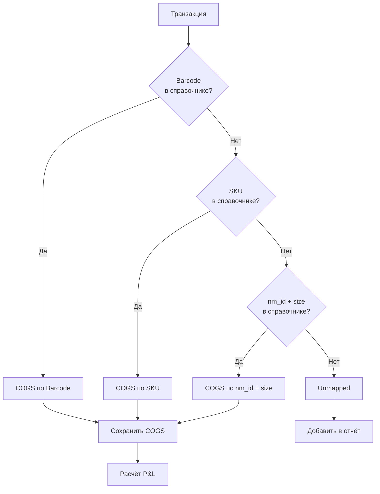
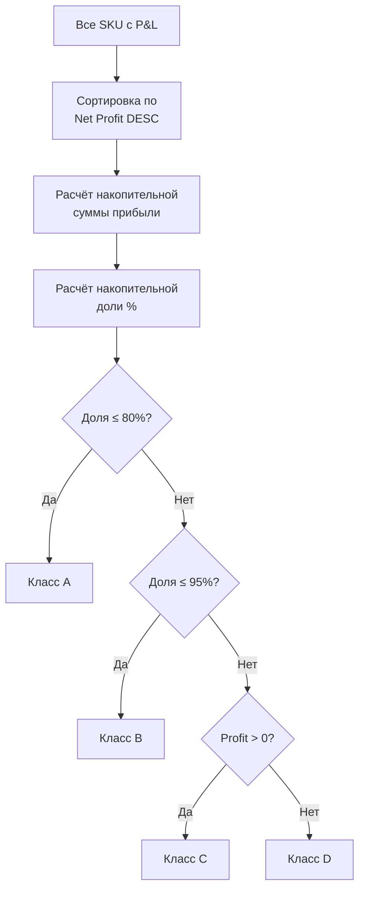
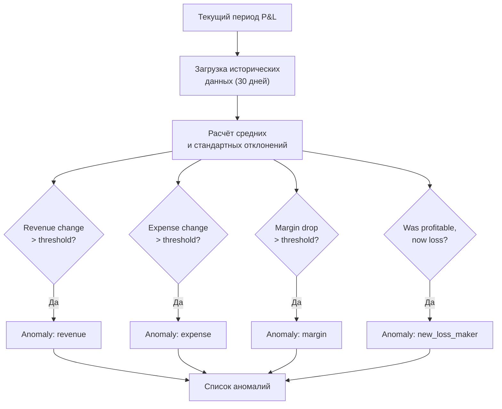
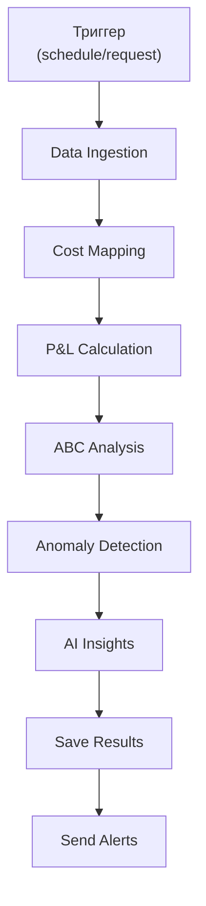

**Проект:** Финансовый учёт и управленческая аналитика  
**Модуль:** CFO  
**Версия:** 1.0  
**Дата:** Январь 2026

---

## 3.1 Назначение

Раздел описывает алгоритмы расчёта P&L, ABC-анализа, детекции аномалий и генерации AI-инсайтов.

### Компоненты AI Pipeline

| Компонент | Описание | AI-модель |
|-----------|----------|-----------|
| Cost Mapper | Сопоставление SKU с себестоимостью | — |
| P&L Calculator | Расчёт маржинальности | — |
| ABC Analyzer | Классификация SKU | — |
| Anomaly Detector | Выявление аномалий | — |
| Insight Generator | Текстовые выводы | Claude Opus 4.5 |
| Custom Report Generator | Кастомные отчёты | Claude Opus 4.5 |

---

## 3.2 Cost Mapper

### 3.2.1 Алгоритм маппинга



### 3.2.2 Приоритет маппинга

| Приоритет | Ключ | Точность | Описание |
|:---------:|------|:--------:|----------|
| 1 | `barcode` | Высокая | Точное соответствие штрихкода |
| 2 | `sku` | Высокая | Артикул продавца |
| 3 | `nm_id + size` | Средняя | Номенклатура МП + размер |
| 4 | `nm_id` | Низкая | Только номенклатура (усреднённая COGS) |

### 3.2.3 Реализация

```python
from typing import Optional, Dict
from dataclasses import dataclass

@dataclass
class CostMapping:
    """Результат маппинга себестоимости."""
    cost_price: float
    mapping_key: str
    confidence: str
    source_date: date


class CostMapper:
    """Сопоставление транзакций с себестоимостью."""
    
    def __init__(self, db_session):
        self.db = db_session
        self._cache: Dict[str, CostMapping] = {}
    
    async def load_cost_prices(self):
        """Загрузка справочника себестоимости в кэш."""
        
        query = """
            SELECT barcode, sku, cost_price, update_date
            FROM cfo_cost_prices
            WHERE is_active = TRUE
        """
        
        rows = await self.db.fetch(query)
        
        for row in rows:
            if row["barcode"]:
                self._cache[f"barcode:{row['barcode']}"] = CostMapping(
                    cost_price=row["cost_price"],
                    mapping_key="barcode",
                    confidence="high",
                    source_date=row["update_date"]
                )
            
            if row["sku"]:
                self._cache[f"sku:{row['sku']}"] = CostMapping(
                    cost_price=row["cost_price"],
                    mapping_key="sku",
                    confidence="high",
                    source_date=row["update_date"]
                )
    
    def map_cost(self, transaction) -> Optional[CostMapping]:
        """Получение себестоимости для транзакции."""
        
        if transaction.barcode:
            key = f"barcode:{transaction.barcode}"
            if key in self._cache:
                return self._cache[key]
        
        if transaction.sku:
            key = f"sku:{transaction.sku}"
            if key in self._cache:
                return self._cache[key]
        
        if transaction.nm_id and transaction.size:
            key = f"nm_id_size:{transaction.nm_id}:{transaction.size}"
            if key in self._cache:
                return self._cache[key]
        
        return None
```

---

## 3.3 P&L Calculator

### 3.3.1 Формула расчёта

```
Revenue (Выручка)           = sale_price × quantity

COGS (Себестоимость)        = cost_price × quantity

Gross Profit                = Revenue - COGS
Gross Margin %              = Gross Profit / Revenue × 100

Operating Expenses:
  - Commission              = комиссия МП
  - Logistics               = логистика до покупателя
  - Return Logistics        = обратная логистика
  - Storage                 = хранение на складе МП
  - Advertising             = реклама на МП

Total Expenses              = COGS + Commission + Logistics + 
                              Return Logistics + Storage + Advertising

Net Profit                  = Revenue - Total Expenses
Net Margin %                = Net Profit / Revenue × 100
```

### 3.3.2 Структура результата

```python
@dataclass
class PnLResult:
    """Результат расчёта P&L."""
    
    # Идентификация
    sku: str
    marketplace: str
    period_start: date
    period_end: date
    
    # Количественные показатели
    quantity_sold: int
    quantity_returned: int
    net_quantity: int
    
    # Выручка
    gross_revenue: float
    discounts: float
    returns_amount: float
    net_revenue: float
    
    # Себестоимость
    cogs: float
    cogs_mapped: bool
    
    # Расходы
    commission: float
    logistics: float
    return_logistics: float
    storage: float
    advertising: float
    total_expenses: float
    
    # Прибыль
    gross_profit: float
    gross_margin_pct: float
    net_profit: float
    net_margin_pct: float
    
    # Мета
    calculated_at: datetime
```

### 3.3.3 Реализация калькулятора

```python
class PnLCalculator:
    """Расчёт P&L по транзакциям."""
    
    def __init__(self, cost_mapper: CostMapper):
        self.cost_mapper = cost_mapper
    
    def calculate_sku_pnl(
        self,
        transactions: List[NormalizedTransaction],
        sku: str,
        period_start: date,
        period_end: date
    ) -> PnLResult:
        """Расчёт P&L для одного SKU."""
        
        sku_transactions = [
            t for t in transactions
            if t.sku == sku and period_start <= t.sale_date <= period_end
        ]
        
        if not sku_transactions:
            return None
        
        # Агрегация
        quantity_sold = sum(
            t.quantity for t in sku_transactions
            if t.operation_type in ["Продажа", "DELIVERED"]
        )
        quantity_returned = sum(
            t.quantity for t in sku_transactions
            if t.operation_type in ["Возврат", "RETURNED"]
        )
        
        gross_revenue = sum(t.revenue for t in sku_transactions if t.revenue > 0)
        returns_amount = abs(sum(t.revenue for t in sku_transactions if t.revenue < 0))
        net_revenue = gross_revenue - returns_amount
        
        commission = sum(t.commission for t in sku_transactions)
        logistics = sum(t.logistics for t in sku_transactions)
        return_logistics = sum(t.return_logistics for t in sku_transactions)
        storage = sum(t.storage for t in sku_transactions)
        advertising = sum(t.advertising for t in sku_transactions)
        
        # Себестоимость
        cost_mapping = self.cost_mapper.map_cost(sku_transactions[0])
        if cost_mapping:
            cogs = cost_mapping.cost_price * (quantity_sold - quantity_returned)
            cogs_mapped = True
        else:
            cogs = 0
            cogs_mapped = False
        
        # Расчёт прибыли
        total_expenses = cogs + commission + logistics + return_logistics + storage + advertising
        gross_profit = net_revenue - cogs
        net_profit = net_revenue - total_expenses
        
        gross_margin_pct = (gross_profit / net_revenue * 100) if net_revenue > 0 else 0
        net_margin_pct = (net_profit / net_revenue * 100) if net_revenue > 0 else 0
        
        return PnLResult(
            sku=sku,
            marketplace=sku_transactions[0].marketplace,
            period_start=period_start,
            period_end=period_end,
            quantity_sold=quantity_sold,
            quantity_returned=quantity_returned,
            net_quantity=quantity_sold - quantity_returned,
            gross_revenue=gross_revenue,
            discounts=0,
            returns_amount=returns_amount,
            net_revenue=net_revenue,
            cogs=cogs,
            cogs_mapped=cogs_mapped,
            commission=commission,
            logistics=logistics,
            return_logistics=return_logistics,
            storage=storage,
            advertising=advertising,
            total_expenses=total_expenses,
            gross_profit=gross_profit,
            gross_margin_pct=round(gross_margin_pct, 2),
            net_profit=net_profit,
            net_margin_pct=round(net_margin_pct, 2),
            calculated_at=datetime.utcnow()
        )
    
    def calculate_aggregated_pnl(
        self,
        pnl_results: List[PnLResult],
        group_by: str
    ) -> Dict[str, PnLResult]:
        """Агрегация P&L по группам."""
        
        groups = {}
        
        for pnl in pnl_results:
            if group_by == "category":
                key = pnl.category or "Unknown"
            elif group_by == "brand":
                key = pnl.brand_id or "Unknown"
            elif group_by == "marketplace":
                key = pnl.marketplace
            else:
                key = "total"
            
            if key not in groups:
                groups[key] = []
            groups[key].append(pnl)
        
        aggregated = {}
        for key, items in groups.items():
            aggregated[key] = self._aggregate_pnl_list(items, key)
        
        return aggregated
    
    def _aggregate_pnl_list(self, items: List[PnLResult], group_name: str) -> PnLResult:
        """Агрегация списка P&L в один результат."""
        
        net_revenue = sum(p.net_revenue for p in items)
        cogs = sum(p.cogs for p in items)
        total_expenses = sum(p.total_expenses for p in items)
        net_profit = sum(p.net_profit for p in items)
        
        return PnLResult(
            sku=group_name,
            marketplace="all",
            period_start=min(p.period_start for p in items),
            period_end=max(p.period_end for p in items),
            quantity_sold=sum(p.quantity_sold for p in items),
            quantity_returned=sum(p.quantity_returned for p in items),
            net_quantity=sum(p.net_quantity for p in items),
            gross_revenue=sum(p.gross_revenue for p in items),
            discounts=sum(p.discounts for p in items),
            returns_amount=sum(p.returns_amount for p in items),
            net_revenue=net_revenue,
            cogs=cogs,
            cogs_mapped=all(p.cogs_mapped for p in items),
            commission=sum(p.commission for p in items),
            logistics=sum(p.logistics for p in items),
            return_logistics=sum(p.return_logistics for p in items),
            storage=sum(p.storage for p in items),
            advertising=sum(p.advertising for p in items),
            total_expenses=total_expenses,
            gross_profit=net_revenue - cogs,
            gross_margin_pct=round((net_revenue - cogs) / net_revenue * 100, 2) if net_revenue > 0 else 0,
            net_profit=net_profit,
            net_margin_pct=round(net_profit / net_revenue * 100, 2) if net_revenue > 0 else 0,
            calculated_at=datetime.utcnow()
        )
```

---

## 3.4 ABC Analyzer

### 3.4.1 Алгоритм классификации



### 3.4.2 Пороги классификации

| Класс | Условие | Накопительная доля | Описание |
|:-----:|---------|:------------------:|----------|
| **A** | Top performers | 0% — 80% | Ключевые SKU, генерирующие 80% прибыли |
| **B** | Middle performers | 80% — 95% | Стабильные SKU со средним вкладом |
| **C** | Low performers | 95% — 100% | Аутсайдеры с минимальным вкладом |
| **D** | Loss makers | Net Profit < 0 | Убыточные SKU |

### 3.4.3 Структура результата

```python
@dataclass
class ABCResult:
    """Результат ABC-анализа для SKU."""
    sku: str
    marketplace: str
    abc_class: str
    net_profit: float
    net_margin_pct: float
    cumulative_profit: float
    cumulative_pct: float
    rank: int
    total_skus_in_class: int


@dataclass
class ABCSummary:
    """Сводка ABC-анализа."""
    period_start: date
    period_end: date
    total_skus: int
    total_profit: float
    
    class_a_count: int
    class_a_profit: float
    class_a_pct: float
    
    class_b_count: int
    class_b_profit: float
    class_b_pct: float
    
    class_c_count: int
    class_c_profit: float
    class_c_pct: float
    
    class_d_count: int
    class_d_loss: float
    
    calculated_at: datetime
```

### 3.4.4 Реализация

```python
class ABCAnalyzer:
    """ABC-анализ SKU."""
    
    def __init__(self, thresholds: dict = None):
        self.thresholds = thresholds or {
            "a": 80,
            "b": 95
        }
    
    def analyze(self, pnl_results: List[PnLResult]) -> Tuple[List[ABCResult], ABCSummary]:
        """Выполнение ABC-анализа."""
        
        # Разделение на прибыльные и убыточные
        profitable = [p for p in pnl_results if p.net_profit > 0]
        loss_makers = [p for p in pnl_results if p.net_profit <= 0]
        
        # Сортировка прибыльных по убыванию прибыли
        profitable.sort(key=lambda x: x.net_profit, reverse=True)
        
        total_profit = sum(p.net_profit for p in profitable)
        
        results = []
        cumulative_profit = 0
        
        # Классификация прибыльных SKU
        for i, pnl in enumerate(profitable):
            cumulative_profit += pnl.net_profit
            cumulative_pct = (cumulative_profit / total_profit * 100) if total_profit > 0 else 0
            
            if cumulative_pct <= self.thresholds["a"]:
                abc_class = "A"
            elif cumulative_pct <= self.thresholds["b"]:
                abc_class = "B"
            else:
                abc_class = "C"
            
            results.append(ABCResult(
                sku=pnl.sku,
                marketplace=pnl.marketplace,
                abc_class=abc_class,
                net_profit=pnl.net_profit,
                net_margin_pct=pnl.net_margin_pct,
                cumulative_profit=cumulative_profit,
                cumulative_pct=round(cumulative_pct, 2),
                rank=i + 1,
                total_skus_in_class=0
            ))
        
        # Добавление убыточных (класс D)
        for pnl in loss_makers:
            results.append(ABCResult(
                sku=pnl.sku,
                marketplace=pnl.marketplace,
                abc_class="D",
                net_profit=pnl.net_profit,
                net_margin_pct=pnl.net_margin_pct,
                cumulative_profit=0,
                cumulative_pct=0,
                rank=0,
                total_skus_in_class=0
            ))
        
        # Подсчёт SKU в каждом классе
        class_counts = {"A": 0, "B": 0, "C": 0, "D": 0}
        for r in results:
            class_counts[r.abc_class] += 1
        
        for r in results:
            r.total_skus_in_class = class_counts[r.abc_class]
        
        # Формирование сводки
        summary = self._create_summary(results, pnl_results)
        
        return results, summary
    
    def _create_summary(
        self,
        abc_results: List[ABCResult],
        pnl_results: List[PnLResult]
    ) -> ABCSummary:
        """Создание сводки ABC-анализа."""
        
        class_a = [r for r in abc_results if r.abc_class == "A"]
        class_b = [r for r in abc_results if r.abc_class == "B"]
        class_c = [r for r in abc_results if r.abc_class == "C"]
        class_d = [r for r in abc_results if r.abc_class == "D"]
        
        total_profit = sum(r.net_profit for r in abc_results if r.net_profit > 0)
        
        return ABCSummary(
            period_start=min(p.period_start for p in pnl_results),
            period_end=max(p.period_end for p in pnl_results),
            total_skus=len(abc_results),
            total_profit=total_profit,
            
            class_a_count=len(class_a),
            class_a_profit=sum(r.net_profit for r in class_a),
            class_a_pct=round(sum(r.net_profit for r in class_a) / total_profit * 100, 2) if total_profit > 0 else 0,
            
            class_b_count=len(class_b),
            class_b_profit=sum(r.net_profit for r in class_b),
            class_b_pct=round(sum(r.net_profit for r in class_b) / total_profit * 100, 2) if total_profit > 0 else 0,
            
            class_c_count=len(class_c),
            class_c_profit=sum(r.net_profit for r in class_c),
            class_c_pct=round(sum(r.net_profit for r in class_c) / total_profit * 100, 2) if total_profit > 0 else 0,
            
            class_d_count=len(class_d),
            class_d_loss=abs(sum(r.net_profit for r in class_d)),
            
            calculated_at=datetime.utcnow()
        )
```

---

## 3.5 Anomaly Detector

### 3.5.1 Типы аномалий

| Тип | Описание | Порог по умолчанию |
|-----|----------|--------------------|
| `revenue_spike` | Резкий рост выручки | > +20% от среднего |
| `revenue_drop` | Резкое падение выручки | > -20% от среднего |
| `expense_spike` | Резкий рост расходов | > +20% от среднего |
| `margin_drop` | Падение маржи | > -10 п.п. |
| `new_loss_maker` | Новый убыточный SKU | Net Profit < 0 (был > 0) |

### 3.5.2 Алгоритм детекции



### 3.5.3 Реализация

```python
@dataclass
class Anomaly:
    """Обнаруженная аномалия."""
    anomaly_type: str
    sku: str
    marketplace: str
    current_value: float
    expected_value: float
    deviation_pct: float
    severity: str
    description: str
    detected_at: datetime


class AnomalyDetector:
    """Детектор аномалий в финансовых данных."""
    
    def __init__(self, db_session, thresholds: dict = None):
        self.db = db_session
        self.thresholds = thresholds or {
            "revenue_change": 20,
            "expense_change": 20,
            "margin_drop": 10
        }
    
    async def detect(
        self,
        current_pnl: List[PnLResult],
        lookback_days: int = 30
    ) -> List[Anomaly]:
        """Обнаружение аномалий."""
        
        anomalies = []
        
        # Загрузка исторических данных
        historical = await self._load_historical(lookback_days)
        
        for pnl in current_pnl:
            sku_history = [h for h in historical if h.sku == pnl.sku]
            
            if not sku_history:
                continue
            
            # Расчёт средних
            avg_revenue = sum(h.net_revenue for h in sku_history) / len(sku_history)
            avg_expenses = sum(h.total_expenses for h in sku_history) / len(sku_history)
            avg_margin = sum(h.net_margin_pct for h in sku_history) / len(sku_history)
            
            # Проверка выручки
            if avg_revenue > 0:
                revenue_change = (pnl.net_revenue - avg_revenue) / avg_revenue * 100
                
                if abs(revenue_change) > self.thresholds["revenue_change"]:
                    anomalies.append(Anomaly(
                        anomaly_type="revenue_spike" if revenue_change > 0 else "revenue_drop",
                        sku=pnl.sku,
                        marketplace=pnl.marketplace,
                        current_value=pnl.net_revenue,
                        expected_value=avg_revenue,
                        deviation_pct=round(revenue_change, 2),
                        severity="warning" if abs(revenue_change) < 50 else "critical",
                        description=f"Выручка изменилась на {revenue_change:+.1f}%",
                        detected_at=datetime.utcnow()
                    ))
            
            # Проверка расходов
            if avg_expenses > 0:
                expense_change = (pnl.total_expenses - avg_expenses) / avg_expenses * 100
                
                if expense_change > self.thresholds["expense_change"]:
                    anomalies.append(Anomaly(
                        anomaly_type="expense_spike",
                        sku=pnl.sku,
                        marketplace=pnl.marketplace,
                        current_value=pnl.total_expenses,
                        expected_value=avg_expenses,
                        deviation_pct=round(expense_change, 2),
                        severity="warning",
                        description=f"Расходы выросли на {expense_change:.1f}%",
                        detected_at=datetime.utcnow()
                    ))
            
            # Проверка маржи
            margin_drop = avg_margin - pnl.net_margin_pct
            
            if margin_drop > self.thresholds["margin_drop"]:
                anomalies.append(Anomaly(
                    anomaly_type="margin_drop",
                    sku=pnl.sku,
                    marketplace=pnl.marketplace,
                    current_value=pnl.net_margin_pct,
                    expected_value=avg_margin,
                    deviation_pct=round(margin_drop, 2),
                    severity="warning",
                    description=f"Маржа упала на {margin_drop:.1f} п.п.",
                    detected_at=datetime.utcnow()
                ))
            
            # Проверка на новый убыток
            was_profitable = all(h.net_profit > 0 for h in sku_history)
            if was_profitable and pnl.net_profit < 0:
                anomalies.append(Anomaly(
                    anomaly_type="new_loss_maker",
                    sku=pnl.sku,
                    marketplace=pnl.marketplace,
                    current_value=pnl.net_profit,
                    expected_value=sum(h.net_profit for h in sku_history) / len(sku_history),
                    deviation_pct=0,
                    severity="critical",
                    description=f"SKU стал убыточным: {pnl.net_profit:.2f} ₽",
                    detected_at=datetime.utcnow()
                ))
        
        return anomalies
    
    async def _load_historical(self, days: int) -> List[PnLResult]:
        """Загрузка исторических P&L."""
        
        query = """
            SELECT * FROM cfo_pnl_daily
            WHERE sale_date >= CURRENT_DATE - INTERVAL '%s days'
        """
        
        rows = await self.db.fetch(query, days)
        return [PnLResult(**row) for row in rows]
```

---

## 3.6 AI Insight Generator

### 3.6.1 Назначение

Генерация текстовых выводов и рекомендаций на основе финансовых данных с использованием Claude Opus 4.5.

### 3.6.2 Типы инсайтов

| Тип | Описание | Триггер |
|-----|----------|---------|
| `summary` | Общая сводка по периоду | По запросу |
| `problems` | Выявленные проблемы | Наличие класса D или аномалий |
| `recommendations` | Рекомендации по улучшению | По запросу |
| `trends` | Анализ трендов | Данные за 30+ дней |

### 3.6.3 Промпт для AI

```python
INSIGHT_SYSTEM_PROMPT = """
Ты финансовый аналитик e-commerce компании, специализирующейся на продаже одежды на маркетплейсах (Wildberries, Ozon, Яндекс.Маркет).

Твоя задача — анализировать финансовые данные и формировать краткие, конкретные выводы и рекомендации.

Правила:
1. Используй конкретные цифры и проценты
2. Указывай артикулы (SKU) при упоминании товаров
3. Давай actionable рекомендации
4. Приоритизируй проблемы по влиянию на прибыль
5. Пиши на русском языке
6. Будь краток — максимум 500 слов
"""

INSIGHT_USER_PROMPT = """
Проанализируй финансовые данные за период {period_start} — {period_end}:

## Сводка P&L
- Выручка: {total_revenue:,.0f} ₽
- Себестоимость: {total_cogs:,.0f} ₽
- Расходы МП: {total_mp_expenses:,.0f} ₽
- Чистая прибыль: {total_net_profit:,.0f} ₽
- Маржинальность: {avg_margin:.1f}%

## ABC-анализ
- Класс A: {class_a_count} SKU ({class_a_profit:,.0f} ₽, {class_a_pct:.1f}% прибыли)
- Класс B: {class_b_count} SKU ({class_b_profit:,.0f} ₽)
- Класс C: {class_c_count} SKU ({class_c_profit:,.0f} ₽)
- Класс D (убыточные): {class_d_count} SKU (убыток {class_d_loss:,.0f} ₽)

## Топ-5 прибыльных SKU
{top_5_profitable}

## Топ-5 убыточных SKU
{top_5_loss_makers}

## Выявленные аномалии
{anomalies}

Сформируй:
1. Краткое резюме (2-3 предложения)
2. Ключевые проблемы
3. Рекомендации по убыточным SKU
4. Возможности для роста маржи
"""
```

### 3.6.4 Реализация

```python
import anthropic

class InsightGenerator:
    """Генератор AI-инсайтов."""
    
    def __init__(self, api_key: str):
        self.client = anthropic.Anthropic(api_key=api_key)
        self.model = "claude-opus-4-5-20250514"
    
    async def generate_insights(
        self,
        pnl_summary: dict,
        abc_summary: ABCSummary,
        top_profitable: List[PnLResult],
        top_loss_makers: List[PnLResult],
        anomalies: List[Anomaly]
    ) -> str:
        """Генерация инсайтов."""
        
        # Форматирование данных для промпта
        top_5_profitable = "\n".join([
            f"- {p.sku}: прибыль {p.net_profit:,.0f} ₽, маржа {p.net_margin_pct:.1f}%"
            for p in top_profitable[:5]
        ])
        
        top_5_loss_makers = "\n".join([
            f"- {p.sku}: убыток {abs(p.net_profit):,.0f} ₽, маржа {p.net_margin_pct:.1f}%"
            for p in top_loss_makers[:5]
        ])
        
        anomalies_text = "\n".join([
            f"- {a.sku}: {a.description}"
            for a in anomalies[:10]
        ]) or "Аномалий не обнаружено"
        
        user_prompt = INSIGHT_USER_PROMPT.format(
            period_start=abc_summary.period_start,
            period_end=abc_summary.period_end,
            total_revenue=pnl_summary["total_revenue"],
            total_cogs=pnl_summary["total_cogs"],
            total_mp_expenses=pnl_summary["total_mp_expenses"],
            total_net_profit=pnl_summary["total_net_profit"],
            avg_margin=pnl_summary["avg_margin"],
            class_a_count=abc_summary.class_a_count,
            class_a_profit=abc_summary.class_a_profit,
            class_a_pct=abc_summary.class_a_pct,
            class_b_count=abc_summary.class_b_count,
            class_b_profit=abc_summary.class_b_profit,
            class_c_count=abc_summary.class_c_count,
            class_c_profit=abc_summary.class_c_profit,
            class_d_count=abc_summary.class_d_count,
            class_d_loss=abc_summary.class_d_loss,
            top_5_profitable=top_5_profitable,
            top_5_loss_makers=top_5_loss_makers,
            anomalies=anomalies_text
        )
        
        response = self.client.messages.create(
            model=self.model,
            max_tokens=1500,
            system=INSIGHT_SYSTEM_PROMPT,
            messages=[
                {"role": "user", "content": user_prompt}
            ]
        )
        
        return response.content[0].text
    
    async def generate_custom_report(
        self,
        user_query: str,
        context_data: dict
    ) -> str:
        """Генерация кастомного отчёта по запросу пользователя."""
        
        system_prompt = INSIGHT_SYSTEM_PROMPT + """

Пользователь запрашивает кастомный отчёт. 
Используй предоставленные данные для ответа на его вопрос.
Если данных недостаточно, укажи это явно.
"""
        
        user_prompt = f"""
Запрос пользователя: {user_query}

Доступные данные:
{self._format_context(context_data)}

Сформируй ответ на запрос пользователя.
"""
        
        response = self.client.messages.create(
            model=self.model,
            max_tokens=2000,
            system=system_prompt,
            messages=[
                {"role": "user", "content": user_prompt}
            ]
        )
        
        return response.content[0].text
    
    def _format_context(self, data: dict) -> str:
        """Форматирование контекстных данных."""
        
        parts = []
        
        if "pnl_by_sku" in data:
            parts.append("## P&L по SKU\n" + self._format_pnl_table(data["pnl_by_sku"]))
        
        if "pnl_by_category" in data:
            parts.append("## P&L по категориям\n" + self._format_pnl_table(data["pnl_by_category"]))
        
        if "abc_results" in data:
            parts.append("## ABC-анализ\n" + self._format_abc_table(data["abc_results"]))
        
        return "\n\n".join(parts)
    
    def _format_pnl_table(self, pnl_list: List[PnLResult]) -> str:
        """Форматирование P&L в текстовую таблицу."""
        
        lines = ["| SKU | Выручка | Расходы | Прибыль | Маржа |"]
        lines.append("|-----|---------|---------|---------|-------|")
        
        for p in pnl_list[:20]:
            lines.append(
                f"| {p.sku} | {p.net_revenue:,.0f} | {p.total_expenses:,.0f} | "
                f"{p.net_profit:,.0f} | {p.net_margin_pct:.1f}% |"
            )
        
        return "\n".join(lines)
    
    def _format_abc_table(self, abc_list: List[ABCResult]) -> str:
        """Форматирование ABC в текстовую таблицу."""
        
        lines = ["| SKU | Класс | Прибыль | Маржа |"]
        lines.append("|-----|-------|---------|-------|")
        
        for a in abc_list[:20]:
            lines.append(
                f"| {a.sku} | {a.abc_class} | {a.net_profit:,.0f} | {a.net_margin_pct:.1f}% |"
            )
        
        return "\n".join(lines)
```

---

## 3.7 Pipeline Orchestrator

### 3.7.1 Общий workflow



### 3.7.2 Реализация оркестратора

```python
class CFOPipelineOrchestrator:
    """Оркестратор CFO Pipeline."""
    
    def __init__(
        self,
        ingestion_service: DataIngestionService,
        cost_mapper: CostMapper,
        pnl_calculator: PnLCalculator,
        abc_analyzer: ABCAnalyzer,
        anomaly_detector: AnomalyDetector,
        insight_generator: InsightGenerator,
        notification_service: NotificationService,
        db_session
    ):
        self.ingestion = ingestion_service
        self.cost_mapper = cost_mapper
        self.pnl_calculator = pnl_calculator
        self.abc_analyzer = abc_analyzer
        self.anomaly_detector = anomaly_detector
        self.insight_generator = insight_generator
        self.notifications = notification_service
        self.db = db_session
    
    async def run_daily_pipeline(self, target_date: date = None):
        """Ежедневный pipeline расчёта P&L."""
        
        target_date = target_date or date.today() - timedelta(days=1)
        
        logger.info(f"Starting daily CFO pipeline for {target_date}")
        
        # 1. Импорт данных
        import_result = await self.ingestion.import_all(
            date_from=target_date,
            date_to=target_date
        )
        logger.info(f"Imported {import_result.saved} transactions")
        
        # 2. Загрузка себестоимости
        await self.cost_mapper.load_cost_prices()
        
        # 3. Загрузка транзакций
        transactions = await self._load_transactions(target_date, target_date)
        
        # 4. Расчёт P&L по SKU
        skus = set(t.sku for t in transactions)
        pnl_results = []
        
        for sku in skus:
            pnl = self.pnl_calculator.calculate_sku_pnl(
                transactions, sku, target_date, target_date
            )
            if pnl:
                pnl_results.append(pnl)
        
        # 5. Сохранение P&L
        await self._save_pnl_results(pnl_results)
        
        # 6. Детекция аномалий
        anomalies = await self.anomaly_detector.detect(pnl_results)
        
        # 7. Отправка алертов
        await self._send_alerts(pnl_results, anomalies)
        
        # 8. Уведомление об окончании
        await self.notifications.send(
            user_ids=await self._get_admin_ids(),
            event_type="cfo.data_imported",
            data={
                "date": target_date.isoformat(),
                "transactions": import_result.saved,
                "skus": len(pnl_results),
                "anomalies": len(anomalies)
            },
            level="info"
        )
        
        logger.info(f"Daily CFO pipeline completed for {target_date}")
    
    async def run_weekly_abc(self):
        """Еженедельный ABC-анализ."""
        
        period_end = date.today() - timedelta(days=1)
        period_start = period_end - timedelta(days=6)
        
        logger.info(f"Starting weekly ABC analysis for {period_start} — {period_end}")
        
        # Загрузка P&L за неделю
        pnl_results = await self._load_pnl_results(period_start, period_end)
        
        # ABC-анализ
        abc_results, summary = self.abc_analyzer.analyze(pnl_results)
        
        # Сохранение результатов
        await self._save_abc_results(abc_results, summary)
        
        # Генерация инсайтов
        pnl_summary = self._calculate_pnl_summary(pnl_results)
        top_profitable = sorted(pnl_results, key=lambda x: x.net_profit, reverse=True)[:5]
        top_loss_makers = sorted(pnl_results, key=lambda x: x.net_profit)[:5]
        anomalies = await self.anomaly_detector.detect(pnl_results)
        
        insights = await self.insight_generator.generate_insights(
            pnl_summary, summary, top_profitable, top_loss_makers, anomalies
        )
        
        # Сохранение инсайтов
        await self._save_insights(insights, period_start, period_end)
        
        logger.info("Weekly ABC analysis completed")
    
    async def _send_alerts(
        self,
        pnl_results: List[PnLResult],
        anomalies: List[Anomaly]
    ):
        """Отправка алертов."""
        
        # Алерты об убыточных SKU
        loss_makers = [p for p in pnl_results if p.net_profit < 0]
        
        if loss_makers:
            await self.notifications.send(
                user_ids=await self._get_senior_director_ids(),
                event_type="cfo.sku_negative_margin",
                data={
                    "count": len(loss_makers),
                    "total_loss": sum(p.net_profit for p in loss_makers),
                    "top_5": [
                        {"sku": p.sku, "loss": p.net_profit}
                        for p in sorted(loss_makers, key=lambda x: x.net_profit)[:5]
                    ]
                },
                level="warning"
            )
        
        # Алерты об аномалиях
        critical_anomalies = [a for a in anomalies if a.severity == "critical"]
        
        if critical_anomalies:
            await self.notifications.send(
                user_ids=await self._get_admin_ids(),
                event_type="cfo.anomaly_detected",
                data={
                    "count": len(critical_anomalies),
                    "anomalies": [
                        {"sku": a.sku, "type": a.anomaly_type, "description": a.description}
                        for a in critical_anomalies[:10]
                    ]
                },
                level="warning"
            )
```

---

**Документ подготовлен:** Январь 2026  
**Версия:** 1.0  
**Статус:** Черновик
