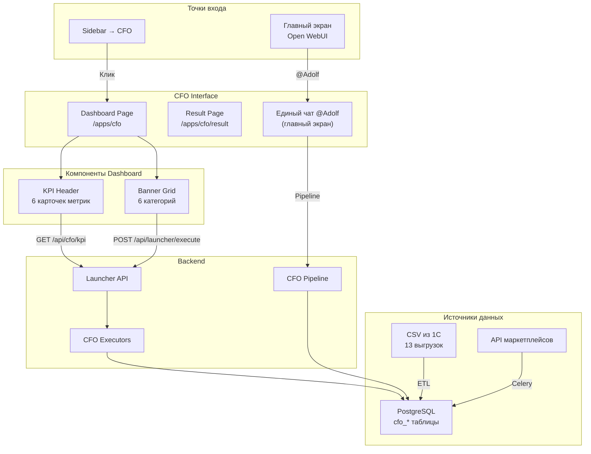
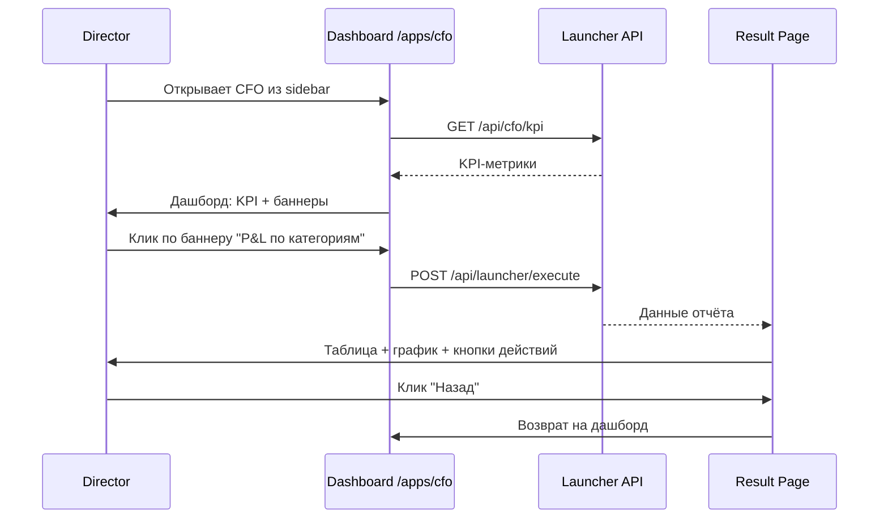
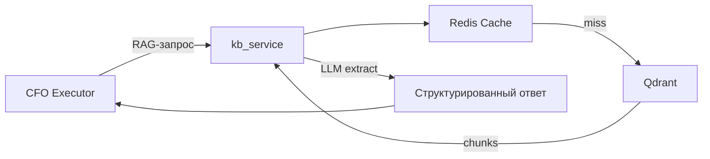
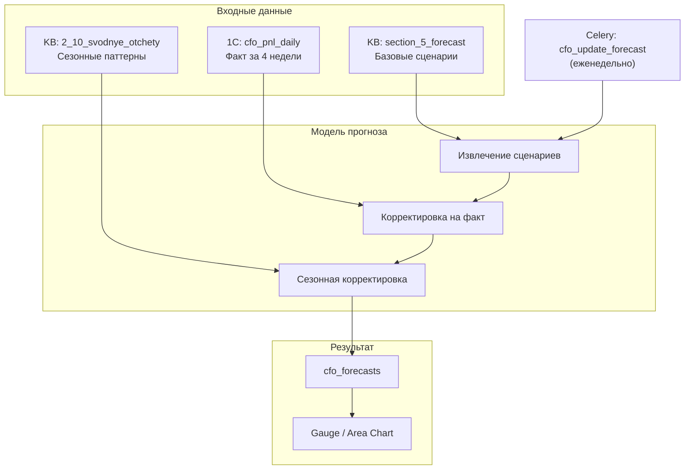
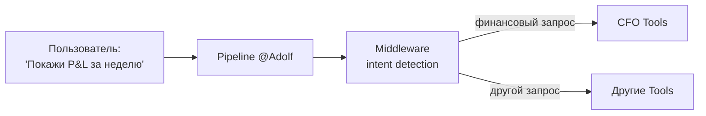

**Проект:** Финансовый учёт и управленческая аналитика  
**Модуль:** CFO  
**Версия:** 1.2  
**Дата:** Февраль 2026

---

## 4.1 Назначение

Раздел описывает интерфейс модуля CFO в Open WebUI. Модуль использует **dashboard-first** подход: пользователь (директор) видит визуальный дашборд с KPI-метриками, графиками и каталогом готовых отчётов — без необходимости формулировать запросы к ИИ. Чат с ИИ доступен отдельно через главный экран Open WebUI.

### Изменения относительно v1.0

| Аспект | v1.0 | v1.1 | v1.2 |
|--------|------|------|------|
| Парадигма | Chat-first | Dashboard-first | Dashboard-first + стратегическая аналитика |
| Точка входа | Pipeline \`@Adolf_CFO\` | Launcher + единый чат \`@Adolf\` | Launcher + единый чат \`@Adolf\` |
| KPI | — | 6 оперативных метрик | 6 оперативных + 6 стратегических (KB) |
| Категории баннеров | — | 6 (P&L, товарный, динамика, склад, себестоимость, AI) | 11 (+фин. устойчивость, ДДС, риски/прогнозы, каналы, задолженность) |
| Источники данных | 1С (себестоимость) | 13 выгрузок 1С | 13 выгрузок 1С + ~90 документов KB Qdrant |
| Прогнозирование | — | — | 3 сценария (KB + тренд 1С + сезонность) |
| Severity-индикация | — | — | Пороговые значения для KPI и рисков |

### Компоненты интерфейса

| Компонент | Описание |
|-----------|----------|
| KPI Header | 2 строки: оперативные (1С) + стратегические (KB) с severity-индикацией |
| Banner Grid | 11 категорий: 6 оперативных + 5 стратегических (KB Qdrant) |
| Result Page | Страница результата с таблицами, графиками и severity-badges |
| Charts | shadcn/ui Charts (Recharts): Area, Bar, Line, Pie, Gauge, Radar, Waterfall |
| Forecast | Прогнозная модель: 3 сценария (KB + тренд 1С + сезонность) |
| Pipeline | Единый чат \`@Adolf\` — автомаршрутизация финансовых запросов |

---

## 4.2 Архитектура интерфейса

### 4.2.1 Общая схема



### 4.2.2 Навигационный поток



### 4.2.3 Чат с ИИ — отдельный поток

Для свободных вопросов директор использует главный экран Open WebUI — единый чат \`@Adolf\`. Pipeline автоматически маршрутизирует финансовые запросы к CFO Tools на основе контекста сообщения. Роль пользователя определяет набор доступных Tools и уровень детализации ответов. Подробнее — в подразделе 4.8.

---

## 4.3 KPI Dashboard Header

При открытии страницы \`/apps/cfo\` в верхней части отображаются автообновляемые карточки ключевых метрик в двух строках: **оперативные** (данные 1С, обновляются ежедневно) и **стратегические** (данные из KB Qdrant, обновляются по мере загрузки отчётных периодов). Данные загружаются через endpoint \`GET /api/cfo/kpi\`.

### 4.3.1 Состав KPI-карточек

**Строка 1 — Оперативные метрики (1С + API маркетплейсов)**

| # | Метрика | Источник | Дельта | Иконка |
|:-:|---------|----------|--------|--------|
| 1 | Выручка за неделю | \`cfo_pnl_daily\` | vs прошлая неделя | \`trending-up\` |
| 2 | Операционная прибыль | \`cfo_pnl_daily\` + \`financial_summary\` | vs прошлая неделя | \`wallet\` |
| 3 | Операционная маржа | Расчёт: (выручка − COGS − комиссии МП − логистика) / выручка | vs прошлая неделя (п.п.) | \`percent\` |
| 4 | Убыточные SKU | \`cfo_abc_results\` (class D) | vs прошлая неделя | \`alert-triangle\` |
| 5 | Оборачиваемость запасов | \`stock_balance\` + \`cost_prices\` | дни (тренд) | \`refresh-cw\` |
| 6 | Выручка / сотрудник | \`cfo_pnl_daily\` + KB (\`2_9_kadry_i_fot\`) | vs прошлый месяц | \`users\` |

**Строка 2 — Стратегические метрики (KB Qdrant)**

| # | Метрика | Источник KB | Порог тревоги | Иконка |
|:-:|---------|-------------|---------------|--------|
| 7 | Текущая ликвидность | \`section_2_2_liquidity\` | &lt; 1.0 — критично | \`shield\` |
| 8 | КЗ просрочена (&gt;180д) | \`2_5_debitorskaya_kreditorskaya\` | &gt; 40% — критично | \`clock\` |
| 9 | Cash Runway | \`dds_analysis\` + \`section_2_4_cash_flow\` | &lt; 3 мес — критично | \`hourglass\` |
| 10 | Доля коммерч. расходов | \`2_3_kommercheskie_rashody\` | &gt; 40% — высокая | \`pie-chart\` |
| 11 | Неликвид | \`2_6_zapasy_nelikvid\` | &gt; 10% запасов — риск | \`archive-x\` |
| 12 | Прогноз выручки (мес) | \`section_5_forecast\` + тренд 1С | базовый сценарий | \`target\` |

Стратегические метрики отображаются только для ролей Director и Admin. Для Senior отображаются только оперативные метрики (строка 1).

### 4.3.2 API Endpoint

```
GET /api/cfo/kpi
Authorization: Bearer {token}
```

**Response:**

```json
{
  "period": "2026-02-07 — 2026-02-13",
  "rows": [
    {
      "id": "operational",
      "label": "Оперативные показатели",
      "min_role": "senior",
      "metrics": [
        {
          "id": "revenue",
          "label": "Выручка",
          "value": 5250000,
          "formatted": "5.25 млн ₽",
          "delta": 12.3,
          "delta_label": "+12.3% к пред. нед",
          "trend": "up",
          "icon": "trending-up",
          "severity": "normal"
        },
        {
          "id": "op_profit",
          "label": "Опер. прибыль",
          "value": 523000,
          "formatted": "523 тыс ₽",
          "delta": 8.1,
          "delta_label": "+8.1% к пред. нед",
          "trend": "up",
          "icon": "wallet",
          "severity": "normal"
        },
        {
          "id": "op_margin",
          "label": "Опер. маржа",
          "value": 9.96,
          "formatted": "9.96%",
          "delta": 0.8,
          "delta_label": "+0.8 п.п.",
          "trend": "up",
          "icon": "percent",
          "severity": "warning"
        },
        {
          "id": "loss_makers",
          "label": "Убыточных SKU",
          "value": 5,
          "formatted": "5",
          "delta": -2,
          "delta_label": "-2 к пред. нед",
          "trend": "down",
          "icon": "alert-triangle",
          "severity": "normal"
        },
        {
          "id": "inventory_turnover",
          "label": "Оборач. запасов",
          "value": 76,
          "formatted": "76 дн",
          "delta": -3,
          "delta_label": "-3 дн (улучшение)",
          "trend": "down",
          "icon": "refresh-cw",
          "severity": "warning"
        },
        {
          "id": "revenue_per_employee",
          "label": "Выручка / сотр.",
          "value": 36972,
          "formatted": "37.0 тыс ₽",
          "delta": -5.2,
          "delta_label": "-5.2% к пред. мес",
          "trend": "down",
          "icon": "users",
          "severity": "critical"
        }
      ]
    },
    {
      "id": "strategic",
      "label": "Стратегические индикаторы",
      "min_role": "director",
      "metrics": [
        {
          "id": "current_ratio",
          "label": "Тек. ликвидность",
          "value": 0.82,
          "formatted": "0.82",
          "delta": null,
          "delta_label": "норма > 1.0",
          "trend": "neutral",
          "icon": "shield",
          "severity": "critical",
          "threshold": {"critical": 1.0, "warning": 1.5}
        },
        {
          "id": "overdue_kz",
          "label": "КЗ просроч. >180д",
          "value": 46.6,
          "formatted": "46.6%",
          "delta": null,
          "delta_label": "от общей КЗ",
          "trend": "neutral",
          "icon": "clock",
          "severity": "critical",
          "threshold": {"critical": 40, "warning": 25}
        },
        {
          "id": "cash_runway",
          "label": "Cash Runway",
          "value": 4.2,
          "formatted": "4.2 мес",
          "delta": -0.8,
          "delta_label": "-0.8 мес к пред.",
          "trend": "down",
          "icon": "hourglass",
          "severity": "warning",
          "threshold": {"critical": 3, "warning": 6}
        },
        {
          "id": "commercial_expense_ratio",
          "label": "Коммерч. расходы",
          "value": 45.0,
          "formatted": "45.0%",
          "delta": 4.5,
          "delta_label": "+4.5 п.п. к 2024",
          "trend": "up",
          "icon": "pie-chart",
          "severity": "critical",
          "threshold": {"critical": 40, "warning": 25}
        },
        {
          "id": "deadstock",
          "label": "Неликвид",
          "value": 51.5,
          "formatted": "51.5 млн ₽",
          "delta": null,
          "delta_label": "8.5% от запасов",
          "trend": "neutral",
          "icon": "archive-x",
          "severity": "warning",
          "threshold": {"critical": 10, "warning": 5}
        },
        {
          "id": "revenue_forecast",
          "label": "Прогноз (мес)",
          "value": 6800000,
          "formatted": "6.8 млн ₽",
          "delta": null,
          "delta_label": "базовый сценарий",
          "trend": "neutral",
          "icon": "target",
          "severity": "normal"
        }
      ]
    }
  ]
}
```

### 4.3.3 Компонент KPI Card

Визуализация на базе shadcn/ui Card. Иконки: Lucide. Цветовая индикация определяется полем \`severity\`:

| Severity | Цвет рамки/иконки | CSS Variable | Когда |
|----------|-------------------|-------------|-------|
| \`normal\` | Зелёный | \`--success\` | Метрика в норме |
| \`warning\` | Жёлтый | \`--warning\` | Метрика приближается к порогу |
| \`critical\` | Красный | \`--destructive\` | Метрика за пороговым значением |

Стратегические метрики (строка 2) содержат поле \`threshold\` для автоматического расчёта severity. Пороги настраиваются Admin через \`/api/cfo/settings\`.

### 4.3.4 Backend реализация

```python
# executors/launcher/cfo_kpi.py

async def get_kpi(user: dict) -> dict:
    """KPI-метрики для дашборда CFO. Две строки: оперативные + стратегические."""

    # --- Строка 1: Оперативные (1С + API МП) ---
    current = await pnl_service.get_summary(week_start(), yesterday())
    previous = await pnl_service.get_summary(prev_week_start(), prev_week_end())
    loss_count = await abc_service.count_class_d(week_start(), yesterday())
    stock = await stock_service.get_total_balance()
    cost_data = await cost_service.get_avg_cost()
    headcount = await kb_service.query("численность персонала текущая")

    inv_turnover = calculate_inventory_turnover(
        cogs=current.cogs, avg_inventory=stock.total_value
    )
    rev_per_employee = current.revenue / headcount.value if headcount else None

    operational = build_row("operational", "Оперативные показатели", "senior", [
        build_metric("revenue", "Выручка", current.revenue,
                     delta_pct(current.revenue, previous.revenue)),
        build_metric("op_profit", "Опер. прибыль", current.op_profit,
                     delta_pct(current.op_profit, previous.op_profit)),
        build_metric("op_margin", "Опер. маржа", current.op_margin,
                     current.op_margin - previous.op_margin,
                     severity=calc_severity(current.op_margin, warning=15, critical=5)),
        build_metric("loss_makers", "Убыточных SKU", loss_count.current,
                     loss_count.current - loss_count.previous),
        build_metric("inventory_turnover", "Оборач. запасов", inv_turnover,
                     inv_turnover - previous_inv_turnover,
                     severity=calc_severity(inv_turnover, warning=90, critical=120)),
        build_metric("revenue_per_employee", "Выручка / сотр.", rev_per_employee,
                     delta_pct(rev_per_employee, prev_rev_per_employee)),
    ])

    rows = [operational]

    # --- Строка 2: Стратегические (KB Qdrant) — только Director+ ---
    if user["role"] in ("director", "admin"):
        kb_liquidity = await kb_service.query("текущая ликвидность коэффициент")
        kb_overdue = await kb_service.query("КЗ просрочена более 180 дней процент")
        kb_cash = await kb_service.query("cash runway месяцев денежный поток")
        kb_commercial = await kb_service.query("доля коммерческих расходов в выручке")
        kb_deadstock = await kb_service.query("неликвид сумма процент от запасов")
        kb_forecast = await kb_service.query("прогноз выручки базовый сценарий месяц")

        strategic = build_row("strategic", "Стратегические индикаторы", "director", [
            build_metric("current_ratio", "Тек. ликвидность", kb_liquidity.value,
                         threshold={"critical": 1.0, "warning": 1.5}),
            build_metric("overdue_kz", "КЗ просроч. >180д", kb_overdue.value,
                         threshold={"critical": 40, "warning": 25}),
            build_metric("cash_runway", "Cash Runway", kb_cash.value,
                         threshold={"critical": 3, "warning": 6}),
            build_metric("commercial_expense_ratio", "Коммерч. расходы",
                         kb_commercial.value,
                         threshold={"critical": 40, "warning": 25}),
            build_metric("deadstock", "Неликвид", kb_deadstock.value),
            build_metric("revenue_forecast", "Прогноз (мес)", kb_forecast.value),
        ])
        rows.append(strategic)

    return {"period": f"{week_start()} — {yesterday()}", "rows": rows}
```

---

## 4.4 Каталог баннеров

Под KPI-шапкой располагается сетка баннеров, сгруппированных по категориям. Каждый баннер запускает готовый отчёт через \`POST /api/launcher/execute\`. Архитектура соответствует [Launcher Core 3.1](/core/adolf_core_3_1_launcher).

### 4.4.1 Категории и баннеры

**Категория 1: P&L отчёты**

| Banner ID | Заголовок | Иконка | Доступ | Action |
|-----------|-----------|--------|--------|--------|
| \`pnl_category\` | P&L по категориям | \`folder-bar-chart\` | Senior+ | \`cfo.pnl_category\` |
| \`pnl_brand\` | P&L по брендам | \`tags\` | Senior+ | \`cfo.pnl_brand\` |
| \`pnl_marketplace\` | P&L по маркетплейсам | \`store\` | Senior+ | \`cfo.pnl_marketplace\` |
| \`pnl_sku\` | P&L по SKU | \`barcode\` | Director+ | \`cfo.pnl_sku\` |
| \`pnl_consolidated\` | Консолидированный P&L | \`file-bar-chart\` | Director+ | \`cfo.pnl_consolidated\` |

**Категория 2: Товарный анализ**

| Banner ID | Заголовок | Иконка | Доступ | Action |
|-----------|-----------|--------|--------|--------|
| \`abc_analysis\` | ABC-анализ | \`bar-chart-3\` | Senior+ | \`cfo.abc_analysis\` |
| \`loss_makers\` | Убыточные SKU | \`alert-triangle\` | Senior+ | \`cfo.loss_makers\` |
| \`top_profitable\` | Топ прибыльных | \`trophy\` | Senior+ | \`cfo.top_profitable\` |

**Категория 3: Динамика (графики)**

| Banner ID | Заголовок | Иконка | Badge | Action |
|-----------|-----------|--------|-------|--------|
| \`chart_revenue\` | Динамика выручки | \`trending-up\` | — | \`cfo.chart_revenue\` |
| \`chart_margin\` | Динамика маржи | \`activity\` | — | \`cfo.chart_margin\` |
| \`chart_compare\` | Сравнение периодов | \`git-compare-arrows\` | — | \`cfo.chart_compare\` |

**Категория 4: Склад и логистика**

| Banner ID | Заголовок | Иконка | Источник 1С | Action |
|-----------|-----------|--------|-------------|--------|
| \`stock_balance\` | Остатки на складах | \`package\` | \`stock_balance\` (ежедн.) | \`cfo.stock_balance\` |
| \`shipments\` | Отгрузки на МП | \`truck\` | \`orders_shipped\` (ежедн.) | \`cfo.shipments\` |
| \`returns\` | Возвраты | \`undo-2\` | \`returns_register\` (еженед.) | \`cfo.returns\` |
| \`inventory_value\` | Оценка запасов | \`warehouse\` | \`inventory_valuation\` (ежемес.) | \`cfo.inventory_value\` |

**Категория 5: Себестоимость**

| Banner ID | Заголовок | Иконка | Источник 1С | Action |
|-----------|-----------|--------|-------------|--------|
| \`cost_by_sku\` | Себестоимость по SKU | \`calculator\` | \`cost_prices\` (еженед.) | \`cfo.cost_by_sku\` |
| \`supplier_prices\` | Цены поставщиков | \`receipt\` | \`suppliers_prices\` (еженед.) | \`cfo.supplier_prices\` |
| \`cost_dynamics\` | Динамика себестоимости | \`chart-line\` | \`cost_prices\` (история) | \`cfo.cost_dynamics\` |

**Категория 6: AI-аналитика**

| Banner ID | Заголовок | Иконка | Badge | Action |
|-----------|-----------|--------|-------|--------|
| \`ai_digest\` | AI-дайджест за неделю | \`sparkles\` | AI | \`cfo.ai_digest\` |
| \`ai_chat\` | Задать вопрос CFO | \`message-square\` | — | \`cfo.ai_chat\` (redirect → единый чат) |

**Категория 7: Финансовая устойчивость** (источник: KB Qdrant, Director+)

| Banner ID | Заголовок | Иконка | Источник KB | Action |
|-----------|-----------|--------|-------------|--------|
| \`liquidity\` | Анализ ликвидности | \`shield-check\` | \`section_2_2_liquidity\` | \`cfo.liquidity\` |
| \`debt_load\` | Долговая нагрузка | \`scale\` | \`2_5_debitorskaya_kreditorskaya\` | \`cfo.debt_load\` |
| \`ebitda\` | EBITDA и рентабельность | \`badge-percent\` | \`section_2_1_key_metrics\` | \`cfo.ebitda\` |
| \`financial_stability\` | Финансовая устойчивость | \`building\` | \`section_2_3_financial_stability\` | \`cfo.financial_stability\` |

**Категория 8: Денежный поток** (источник: KB Qdrant, Director+)

| Banner ID | Заголовок | Иконка | Источник KB | Action |
|-----------|-----------|--------|-------------|--------|
| \`cash_flow\` | Анализ ДДС | \`banknote\` | \`section_2_4_cash_flow\`, \`dds_analysis\` | \`cfo.cash_flow\` |
| \`cash_runway_report\` | Cash Runway (прогноз) | \`hourglass\` | \`dds_analysis\` + тренд 1С | \`cfo.cash_runway\` |
| \`working_capital\` | Оборотный капитал | \`rotate-ccw\` | \`2_8_oborotno_saldovye\` | \`cfo.working_capital\` |

**Категория 9: Риски и прогнозы** (источник: KB Qdrant, Director+)

| Banner ID | Заголовок | Иконка | Источник KB | Action |
|-----------|-----------|--------|-------------|--------|
| \`critical_risks\` | Критические риски | \`siren\` | \`section_1_2_critical_risks\` | \`cfo.critical_risks\` |
| \`forecast_scenarios\` | Прогноз (3 сценария) | \`git-branch\` | \`section_5_forecast\` + тренд 1С | \`cfo.forecast\` |
| \`roadmap\` | Дорожная карта | \`map\` | \`section_1_3_roadmap\` | \`cfo.roadmap\` |
| \`audit_findings\` | Результаты аудита | \`clipboard-check\` | \`section_7_audit\` | \`cfo.audit\` |

**Категория 10: Эффективность каналов** (источник: KB + 1С)

| Banner ID | Заголовок | Иконка | Источник | Action |
|-----------|-----------|--------|----------|--------|
| \`channel_margins\` | Маржа по каналам | \`git-compare-arrows\` | \`section_3_1_channel_margins\` | \`cfo.channel_margins\` |
| \`mp_commissions\` | Комиссии и логистика МП | \`receipt\` | \`section_3_2_logistics_commissions\` + 1С | \`cfo.mp_commissions\` |
| \`redemption_rate\` | Процент выкупа | \`package-check\` | \`section_3_3_redemption_rate\` | \`cfo.redemption_rate\` |
| \`mp_benchmark\` | Бенчмарк маркетплейсов | \`bar-chart-horizontal\` | KB аналитика МП | \`cfo.mp_benchmark\` |

**Категория 11: Задолженность и поставщики** (источник: KB Qdrant, Director+)

| Banner ID | Заголовок | Иконка | Источник KB | Action |
|-----------|-----------|--------|-------------|--------|
| \`dz_aging\` | ДЗ — aging report | \`clock\` | \`2_5_debitorskaya_kreditorskaya\` | \`cfo.dz_aging\` |
| \`kz_aging\` | КЗ — aging report | \`timer\` | \`2_5_debitorskaya_kreditorskaya\` | \`cfo.kz_aging\` |
| \`suppliers_analysis\` | Анализ поставщиков | \`handshake\` | \`2_13_Analiz_postavshchikov\` | \`cfo.suppliers_analysis\` |
| \`inventory_deadstock\` | Неликвид и запасы | \`archive-x\` | \`section_4_1_inventory\`, \`2_6_zapasy\` | \`cfo.inventory_deadstock\` |

### 4.4.2 JSON-конфигурация

Файл: \`/config/launcher/cfo.json\`

```json
{
  "module": "cfo",
  "version": "1.1",
  "title": "Финансы",
  "description": "Финансовая аналитика и отчётность",
  "icon": "line-chart",
  "kpi_endpoint": "/api/cfo/kpi",
  "categories": [
    {
      "id": "pnl",
      "title": "P&L отчёты",
      "banners": [
        {
          "id": "pnl_category",
          "title": "P&L по категориям",
          "description": "Прибыль и убытки в разрезе категорий товаров",
          "icon": "folder-bar-chart",
          "action": "cfo.pnl_category",
          "enabled": true,
          "badge": null
        },
        {
          "id": "pnl_brand",
          "title": "P&L по брендам",
          "description": "Сравнение Охана Маркет и Охана Кидс",
          "icon": "tags",
          "action": "cfo.pnl_brand",
          "enabled": true,
          "badge": null
        },
        {
          "id": "pnl_marketplace",
          "title": "P&L по маркетплейсам",
          "description": "Wildberries vs Ozon vs Яндекс.Маркет",
          "icon": "store",
          "action": "cfo.pnl_marketplace",
          "enabled": true,
          "badge": null
        },
        {
          "id": "pnl_sku",
          "title": "P&L по SKU",
          "description": "Детализация до каждого артикула",
          "icon": "barcode",
          "action": "cfo.pnl_sku",
          "enabled": true,
          "badge": null,
          "min_role": "director"
        },
        {
          "id": "pnl_consolidated",
          "title": "Консолидированный P&L",
          "description": "Общая картина по всему бизнесу",
          "icon": "file-bar-chart",
          "action": "cfo.pnl_consolidated",
          "enabled": true,
          "badge": null,
          "min_role": "director"
        }
      ]
    },
    {
      "id": "product_analysis",
      "title": "Товарный анализ",
      "banners": [
        {
          "id": "abc_analysis",
          "title": "ABC-анализ",
          "description": "Классификация SKU по вкладу в прибыль",
          "icon": "bar-chart-3",
          "action": "cfo.abc_analysis",
          "enabled": true,
          "badge": null
        },
        {
          "id": "loss_makers",
          "title": "Убыточные SKU",
          "description": "Позиции с отрицательной маржой",
          "icon": "alert-triangle",
          "action": "cfo.loss_makers",
          "enabled": true,
          "badge": null
        },
        {
          "id": "top_profitable",
          "title": "Топ прибыльных",
          "description": "Лидеры по абсолютной прибыли",
          "icon": "trophy",
          "action": "cfo.top_profitable",
          "enabled": true,
          "badge": null
        }
      ]
    },
    {
      "id": "dynamics",
      "title": "Динамика",
      "banners": [
        {
          "id": "chart_revenue",
          "title": "Динамика выручки",
          "description": "График выручки за последние 30 дней",
          "icon": "trending-up",
          "action": "cfo.chart_revenue",
          "enabled": true,
          "badge": null
        },
        {
          "id": "chart_margin",
          "title": "Динамика маржи",
          "description": "Тренд маржинальности по дням",
          "icon": "activity",
          "action": "cfo.chart_margin",
          "enabled": true,
          "badge": null
        },
        {
          "id": "chart_compare",
          "title": "Сравнение периодов",
          "description": "Текущий vs предыдущий период",
          "icon": "git-compare-arrows",
          "action": "cfo.chart_compare",
          "enabled": true,
          "badge": null
        }
      ]
    },
    {
      "id": "warehouse",
      "title": "Склад и логистика",
      "banners": [
        {
          "id": "stock_balance",
          "title": "Остатки на складах",
          "description": "Текущие остатки по складам и SKU",
          "icon": "package",
          "action": "cfo.stock_balance",
          "enabled": true,
          "badge": null
        },
        {
          "id": "shipments",
          "title": "Отгрузки на МП",
          "description": "Реестр отгрузок за период",
          "icon": "truck",
          "action": "cfo.shipments",
          "enabled": true,
          "badge": null
        },
        {
          "id": "returns",
          "title": "Возвраты",
          "description": "Анализ возвратов от маркетплейсов",
          "icon": "undo-2",
          "action": "cfo.returns",
          "enabled": true,
          "badge": null
        },
        {
          "id": "inventory_value",
          "title": "Оценка запасов",
          "description": "Стоимость товаров на складах",
          "icon": "warehouse",
          "action": "cfo.inventory_value",
          "enabled": true,
          "badge": null
        }
      ]
    },
    {
      "id": "cost",
      "title": "Себестоимость",
      "banners": [
        {
          "id": "cost_by_sku",
          "title": "Себестоимость по SKU",
          "description": "Актуальная себестоимость из 1С",
          "icon": "calculator",
          "action": "cfo.cost_by_sku",
          "enabled": true,
          "badge": null
        },
        {
          "id": "supplier_prices",
          "title": "Цены поставщиков",
          "description": "Актуальные прайс-листы поставщиков",
          "icon": "receipt",
          "action": "cfo.supplier_prices",
          "enabled": true,
          "badge": null
        },
        {
          "id": "cost_dynamics",
          "title": "Динамика себестоимости",
          "description": "Изменение себестоимости во времени",
          "icon": "chart-line",
          "action": "cfo.cost_dynamics",
          "enabled": true,
          "badge": null
        }
      ]
    },
    {
      "id": "ai",
      "title": "AI-аналитика",
      "banners": [
        {
          "id": "ai_digest",
          "title": "AI-дайджест за неделю",
          "description": "Выводы, проблемы, рекомендации",
          "icon": "sparkles",
          "action": "cfo.ai_digest",
          "enabled": true,
          "badge": "AI"
        },
        {
          "id": "ai_chat",
          "title": "Задать вопрос CFO",
          "description": "Свободный диалог с ИИ-ассистентом",
          "icon": "message-square",
          "action": "cfo.ai_chat",
          "enabled": true,
          "badge": null,
          "action_type": "redirect_chat"
        }
      ]
    },
    {
      "id": "financial_health",
      "title": "Финансовая устойчивость",
      "min_role": "director",
      "source": "kb",
      "banners": [
        {
          "id": "liquidity",
          "title": "Анализ ликвидности",
          "description": "Коэффициенты ликвидности, покрытие обязательств",
          "icon": "shield-check",
          "action": "cfo.liquidity",
          "enabled": true
        },
        {
          "id": "debt_load",
          "title": "Долговая нагрузка",
          "description": "ДЗ/КЗ, aging reports, просрочка",
          "icon": "scale",
          "action": "cfo.debt_load",
          "enabled": true
        },
        {
          "id": "ebitda",
          "title": "EBITDA и рентабельность",
          "description": "EBITDA, ROS, ROE, ROA",
          "icon": "badge-percent",
          "action": "cfo.ebitda",
          "enabled": true
        },
        {
          "id": "financial_stability",
          "title": "Финансовая устойчивость",
          "description": "Коэффициенты автономии, структура капитала",
          "icon": "building",
          "action": "cfo.financial_stability",
          "enabled": true
        }
      ]
    },
    {
      "id": "cash_flow",
      "title": "Денежный поток",
      "min_role": "director",
      "source": "kb",
      "banners": [
        {
          "id": "cash_flow_analysis",
          "title": "Анализ ДДС",
          "description": "Операционный, инвестиционный, финансовый потоки",
          "icon": "banknote",
          "action": "cfo.cash_flow",
          "enabled": true
        },
        {
          "id": "cash_runway_report",
          "title": "Cash Runway (прогноз)",
          "description": "Сколько месяцев без дополнительного финансирования",
          "icon": "hourglass",
          "action": "cfo.cash_runway",
          "enabled": true
        },
        {
          "id": "working_capital",
          "title": "Оборотный капитал",
          "description": "Структура и динамика оборотных средств",
          "icon": "rotate-ccw",
          "action": "cfo.working_capital",
          "enabled": true
        }
      ]
    },
    {
      "id": "risks_forecasts",
      "title": "Риски и прогнозы",
      "min_role": "director",
      "source": "kb",
      "banners": [
        {
          "id": "critical_risks",
          "title": "Критические риски",
          "description": "Реестр рисков с оценкой вероятности и влияния",
          "icon": "siren",
          "action": "cfo.critical_risks",
          "enabled": true,
          "badge": "!"
        },
        {
          "id": "forecast_scenarios",
          "title": "Прогноз (3 сценария)",
          "description": "Пессимистичный / базовый / оптимистичный",
          "icon": "git-branch",
          "action": "cfo.forecast",
          "enabled": true,
          "badge": "AI"
        },
        {
          "id": "roadmap",
          "title": "Дорожная карта",
          "description": "План мероприятий по выходу из кризиса",
          "icon": "map",
          "action": "cfo.roadmap",
          "enabled": true
        },
        {
          "id": "audit_findings",
          "title": "Результаты аудита",
          "description": "Ключевые выводы и замечания",
          "icon": "clipboard-check",
          "action": "cfo.audit",
          "enabled": true
        }
      ]
    },
    {
      "id": "channels",
      "title": "Эффективность каналов",
      "source": "kb+1c",
      "banners": [
        {
          "id": "channel_margins",
          "title": "Маржа по каналам",
          "description": "Опт vs WB vs Ozon vs Яндекс.Маркет",
          "icon": "git-compare-arrows",
          "action": "cfo.channel_margins",
          "enabled": true
        },
        {
          "id": "mp_commissions",
          "title": "Комиссии и логистика МП",
          "description": "Структура расходов по маркетплейсам",
          "icon": "receipt",
          "action": "cfo.mp_commissions",
          "enabled": true
        },
        {
          "id": "redemption_rate",
          "title": "Процент выкупа",
          "description": "Анализ выкупа по МП и категориям",
          "icon": "package-check",
          "action": "cfo.redemption_rate",
          "enabled": true
        },
        {
          "id": "mp_benchmark",
          "title": "Бенчмарк маркетплейсов",
          "description": "Сравнительная эффективность каналов",
          "icon": "bar-chart-horizontal",
          "action": "cfo.mp_benchmark",
          "enabled": true
        }
      ]
    },
    {
      "id": "debt_suppliers",
      "title": "Задолженность и поставщики",
      "min_role": "director",
      "source": "kb",
      "banners": [
        {
          "id": "dz_aging",
          "title": "ДЗ — aging report",
          "description": "Дебиторская задолженность по срокам",
          "icon": "clock",
          "action": "cfo.dz_aging",
          "enabled": true
        },
        {
          "id": "kz_aging",
          "title": "КЗ — aging report",
          "description": "Кредиторская задолженность по срокам",
          "icon": "timer",
          "action": "cfo.kz_aging",
          "enabled": true
        },
        {
          "id": "suppliers_analysis",
          "title": "Анализ поставщиков",
          "description": "Концентрация, условия, риски",
          "icon": "handshake",
          "action": "cfo.suppliers_analysis",
          "enabled": true
        },
        {
          "id": "inventory_deadstock",
          "title": "Неликвид и запасы",
          "description": "Оценка неликвида, оборачиваемость",
          "icon": "archive-x",
          "action": "cfo.inventory_deadstock",
          "enabled": true
        }
      ]
    }
  ]
}
```

### 4.4.3 Расширение формата Launcher

Для поддержки KPI-шапки и категорий JSON-конфигурация CFO расширяет базовый формат Launcher (Core 3.1):

| Поле | Тип | Базовый Launcher | CFO Extension |
|------|-----|:----------------:|:-------------:|
| \`module\` | string | ✅ | ✅ |
| \`banners[]\` | array | ✅ (плоский список) | — |
| \`categories[]\` | array | — | ✅ (группы баннеров) |
| \`kpi_endpoint\` | string | — | ✅ |
| \`banners[].min_role\` | string | — | ✅ |
| \`banners[].action_type\` | string | — | ✅ (\`direct\` / \`redirect_chat\` / \`redirect\`) |
| \`categories[].min_role\` | string | — | ✅ (скрыть всю категорию) |
| \`categories[].source\` | string | — | ✅ (\`1c\` / \`kb\` / \`kb+1c\` / \`api\`) |
| \`metrics[].severity\` | string | — | ✅ (\`normal\` / \`warning\` / \`critical\`) |
| \`metrics[].threshold\` | object | — | ✅ (автоматический расчёт severity) |

Launcher API автоматически определяет формат по наличию поля \`categories\`: если есть — рендерит категоризированную сетку, если нет — плоский список (обратная совместимость).

---

## 4.5 Графики и визуализация

Страницы результатов используют компоненты **shadcn/ui Charts** на базе **Recharts** для отображения финансовых трендов. Стили графиков определены через CSS-переменные \`--chart-1\` ... \`--chart-5\` из \`shadcn-variables.css\`.

### 4.5.1 Типы графиков

| Тип | shadcn/ui Component | Применение |
|-----|---------------------|------------|
| Area Chart | \`AreaChart\` | Динамика выручки, прибыли, Cash Runway |
| Bar Chart | \`BarChart\` | P&L по категориям, сравнение МП, маржа каналов |
| Stacked Bar | \`BarChart stacked\` | Структура расходов, aging ДЗ/КЗ, комиссии МП |
| Line Chart | \`LineChart\` | Тренд маржинальности, прогноз (3 сценария) |
| Pie / Donut | \`PieChart\` | Доля МП в выручке, распределение ABC, поставщики |
| Gauge | Кастомный (Recharts) | Ликвидность, Cash Runway, выполнение плана |
| Radar Chart | \`RadarChart\` | Бенчмарк МП, финансовая устойчивость |
| Waterfall | Кастомный (Recharts) | Анализ ДДС (операц. → инвест. → фин.) |
| Radial Chart | \`RadialChart\` | Выполнение плана (v2.0) |

### 4.5.2 Спецификация данных для графиков

**Динамика выручки (Area Chart)**

Executor: \`cfo.chart_revenue\`

```json
{
  "chart_type": "area",
  "title": "Динамика выручки",
  "period": "30d",
  "x_key": "date",
  "series": [
    {"key": "revenue", "label": "Выручка", "color": "var(--chart-1)"},
    {"key": "profit", "label": "Прибыль", "color": "var(--chart-2)"}
  ],
  "data": [
    {"date": "2026-01-15", "revenue": 750000, "profit": 320000},
    {"date": "2026-01-16", "revenue": 680000, "profit": 290000}
  ]
}
```

**P&L по маркетплейсам (Bar Chart)**

Executor: \`cfo.pnl_marketplace\`

```json
{
  "chart_type": "bar",
  "title": "P&L по маркетплейсам",
  "x_key": "marketplace",
  "series": [
    {"key": "revenue", "label": "Выручка", "color": "var(--chart-1)"},
    {"key": "expenses", "label": "Расходы", "color": "var(--chart-5)"},
    {"key": "profit", "label": "Прибыль", "color": "var(--chart-2)"}
  ],
  "data": [
    {"marketplace": "Wildberries", "revenue": 3500000, "expenses": 1925000, "profit": 1575000},
    {"marketplace": "Ozon", "revenue": 1200000, "expenses": 780000, "profit": 420000},
    {"marketplace": "Яндекс.Маркет", "revenue": 550000, "expenses": 308000, "profit": 242000}
  ]
}
```

**Распределение ABC (Pie Chart)**

Executor: \`cfo.abc_analysis\`

```json
{
  "chart_type": "pie",
  "title": "Распределение прибыли по ABC",
  "data": [
    {"class": "A", "value": 7200000, "count": 47, "fill": "var(--abc-a)"},
    {"class": "B", "value": 1350000, "count": 89, "fill": "var(--abc-b)"},
    {"class": "C", "value": 450000, "count": 156, "fill": "var(--abc-c)"},
    {"class": "D", "value": -180000, "count": 23, "fill": "var(--abc-d)"}
  ]
}
```

**Динамика маржи (Line Chart)**

Executor: \`cfo.chart_margin\`

```json
{
  "chart_type": "line",
  "title": "Тренд маржинальности",
  "x_key": "date",
  "y_suffix": "%",
  "reference_line": {"value": 40, "label": "Целевая маржа"},
  "series": [
    {"key": "margin_wb", "label": "Wildberries", "color": "#CB11AB"},
    {"key": "margin_ozon", "label": "Ozon", "color": "#005BFF"},
    {"key": "margin_ym", "label": "Яндекс.Маркет", "color": "#FFCC00"}
  ],
  "data": [
    {"date": "2026-01-15", "margin_wb": 45.2, "margin_ozon": 38.1, "margin_ym": 41.5}
  ]
}
```

### 4.5.3 Цветовая схема графиков

| Назначение | CSS Variable | Цвет |
|------------|-------------|------|
| Серия 1 (основная) | \`--chart-1\` | Синий |
| Серия 2 (прибыль) | \`--chart-2\` | Зелёный |
| Серия 3 (нейтрал) | \`--chart-3\` | Серый |
| Серия 4 (акцент) | \`--chart-4\` | Жёлтый |
| Серия 5 (расходы) | \`--chart-5\` | Красный |
| Wildberries | \`--mp-wb\` | #CB11AB |
| Ozon | \`--mp-ozon\` | #005BFF |
| Яндекс.Маркет | \`--mp-ym\` | #FFCC00 |
| ABC A | \`--abc-a\` | Зелёный |
| ABC B | \`--abc-b\` | Синий |
| ABC C | \`--abc-c\` | Жёлтый |
| ABC D | \`--abc-d\` | Красный |

---

## 4.6 Result Page

При клике по баннеру открывается страница результата \`/apps/cfo/result\`. Формат зависит от типа отчёта.

### 4.6.1 Структура Result Page

Каждая Result Page содержит следующие блоки (сверху вниз): навигация назад и breadcrumb, переключатель периода, график (если применимо), таблица данных, сводка (итого), кнопки связанных отчётов и экспорта.

### 4.6.2 Переключатель периода

Все отчёты поддерживают переключение периода без возврата на дашборд:

| Кнопка | Период | API-параметр |
|--------|--------|-------------|
| Нед | Последние 7 дней | \`period=week\` |
| Мес | Последние 30 дней | \`period=month\` |
| Кв | Последние 90 дней | \`period=quarter\` |

При переключении периода данные перезагружаются через тот же executor с новым параметром.

### 4.6.3 Кнопки навигации между отчётами

На каждой Result Page отображаются кнопки быстрого перехода к связанным отчётам:

| Текущий отчёт | Связанные кнопки |
|---------------|------------------|
| P&L по категориям | По брендам, По МП, ABC-анализ, Excel |
| P&L по брендам | По категориям, По МП, По SKU*, Excel |
| P&L по МП | По категориям, По брендам, Excel |
| P&L по SKU | По категориям, ABC-анализ, Убыточные, Excel |
| ABC-анализ | Убыточные SKU, Топ прибыльных, AI-дайджест, Excel |
| Убыточные SKU | AI-рекомендации, ABC-анализ, Excel |
| Остатки | Отгрузки, Оценка запасов |
| Себестоимость | Цены поставщиков, Динамика |

### 4.6.4 Экспорт

Все табличные отчёты поддерживают экспорт:

| Формат | Кнопка | Реализация |
|--------|--------|------------|
| Excel | 📥 Excel | \`cfo.export\` → \`.xlsx\` файл |
| PDF | 📄 PDF | \`cfo.export\` → \`.pdf\` файл |
| Копировать | 📋 Копировать | Clipboard API → markdown-таблица |

---

## 4.7 Источники данных

Модуль CFO использует два класса источников. **Оперативные** — 13 регулярных выгрузок из 1С:КА 2 (см. \`brain_1c_ka2_exports_registry_v1_1\`), поступают через ETL Core. **Стратегические** — ~90 аналитических документов в KB Qdrant (см. \`Perechen_dokumentov_proekta_Ohana\`), доступны через \`kb_service\`.

### 4.7.1 Маппинг 1С → CFO Dashboard

| Выгрузка 1С | Код файла | Периодичность | Баннеры CFO |
|-------------|-----------|---------------|-------------|
| Остатки и доступность | \`stock_balance\` | Ежедневно | Остатки на складах, KPI "Остатки" |
| Ведомость по товарам | \`stock_movement\` | Ежедневно | (внутренние расчёты) |
| Реестр документов продажи | \`orders_shipped\` | Ежедневно | Отгрузки на МП, KPI "Отгрузки" |
| Себестоимость товаров | \`cost_prices\` | Еженедельно | Себестоимость по SKU, P&L расчёты |
| Номенклатура | \`product_catalog\` | Еженедельно | (справочник товаров) |
| Цены поставщиков | \`suppliers_prices\` | Еженедельно | Цены поставщиков |
| Анализ возвратов | \`returns_register\` | Еженедельно | Возвраты |
| Валовая прибыль | \`financial_summary\` | Ежемесячно | P&L консолидированный, Сравнение периодов |
| Остатки (срез) | \`inventory_valuation\` | Ежемесячно | Оценка запасов |
| Договоры | \`contracts_register\` | Ежемесячно | (справочник) |
| Контрагенты | \`counterparties\` | Ежемесячно | (справочник) |
| Квартальная прибыль | \`quarter_pnl\` | Ежеквартально | Сравнение периодов |
| Инвентаризация | \`quarter_inventory_audit\` | Ежеквартально | (контроль) |

### 4.7.2 Источники данных из KB (Qdrant)

Стратегические метрики и аналитические отчёты основаны на документах, хранящихся в базе знаний Qdrant. Документы обновляются по мере поступления новых отчётных периодов.

**Маппинг KB → CFO Dashboard**

| Документ KB | Категория | Баннеры / KPI |
|-------------|-----------|---------------|
| \`Ohana_Financial_Data_Base\` | Фин. устойчивость | EBITDA, рентабельность, сводные показатели |
| \`section_2_1_key_metrics\` | Фин. устойчивость | EBITDA, ROS, ROE, ROA |
| \`section_2_2_liquidity\` | Фин. устойчивость | KPI «Тек. ликвидность», баннер «Ликвидность» |
| \`section_2_3_financial_stability\` | Фин. устойчивость | Баннер «Финансовая устойчивость» |
| \`section_2_4_cash_flow\` | Денежный поток | Баннер «Анализ ДДС» |
| \`dds_analysis\` | Денежный поток | KPI «Cash Runway», баннер «Cash Runway» |
| \`2_3_kommercheskie_rashody\` | KPI (стратег.) | KPI «Коммерч. расходы», баннер «Комиссии МП» |
| \`2_5_debitorskaya_kreditorskaya\` | Задолженность | KPI «КЗ просроч.», баннеры «ДЗ/КЗ aging» |
| \`2_6_zapasy_nelikvid\` | Задолженность | KPI «Неликвид», баннер «Неликвид и запасы» |
| \`2_8_oborotno_saldovye\` | Денежный поток | Баннер «Оборотный капитал» |
| \`2_9_kadry_i_fot\` | KPI (операт.) | KPI «Выручка / сотр.» |
| \`2_13_Analiz_postavshchikov\` | Задолженность | Баннер «Анализ поставщиков» |
| \`section_1_2_critical_risks\` | Риски и прогнозы | Баннер «Критические риски» |
| \`section_1_3_roadmap\` | Риски и прогнозы | Баннер «Дорожная карта» |
| \`section_3_1_channel_margins\` | Эффективность каналов | Баннер «Маржа по каналам» |
| \`section_3_2_logistics_commissions\` | Эффективность каналов | Баннер «Комиссии и логистика МП» |
| \`section_3_3_redemption_rate\` | Эффективность каналов | Баннер «Процент выкупа» |
| \`section_4_1_inventory\` | Задолженность | Баннер «Неликвид и запасы» |
| \`section_5_forecast\` | Риски и прогнозы | KPI «Прогноз выручки», баннер «Прогноз (3 сценария)» |
| \`section_7_audit\` | Риски и прогнозы | Баннер «Результаты аудита» |
| \`abc_xyz_analysis\` | Товарный анализ | Баннер «ABC-анализ» (дополнение) |
| Аналитика WB/Ozon/YM | Эффективность каналов | Баннер «Бенчмарк маркетплейсов» |

**Механизм доступа к KB:**



Executors обращаются к KB через \`kb_service.query()\`, который выполняет RAG-поиск по Qdrant с кэшированием в Redis (TTL = 1 час для стратегических метрик). LLM извлекает структурированные данные (числа, коэффициенты, даты) из найденных чанков.

### 4.7.3 Прогнозная модель

Баннер «Прогноз (3 сценария)» комбинирует данные KB и оперативные тренды 1С для формирования актуального прогноза:

| Сценарий | Источник | Логика |
|----------|----------|--------|
| Пессимистичный | KB (\`section_5_forecast\`) + тренд 1С | Сохранение текущей динамики падения |
| Базовый | KB + тренд 1С + сезонность | Стабилизация с учётом сезонных паттернов |
| Оптимистичный | KB + тренд 1С + эффект мероприятий | Реализация roadmap + рост МП-канала |

Прогноз обновляется еженедельно через Celery-задачу \`cfo_update_forecast\`, которая:

1. Извлекает базовые сценарии из KB (\`section_5_forecast\`)
2. Корректирует на фактические данные за последние 4 недели из 1С
3. Применяет сезонные коэффициенты из KB (\`2_10_svodnye_otchety\` — помесячная динамика)
4. Сохраняет результат в \`cfo_forecasts\` (PostgreSQL)



---

## 4.8 Единый чат (финансовые запросы)

Финансовые вопросы обрабатываются через **единый чат \`@Adolf\`** на главном экране Open WebUI — тот же Pipeline, который обслуживает все модули системы. Пользователь не выбирает отдельный финансовый Pipeline; маршрутизация к CFO Tools происходит автоматически на основе контекста запроса (см. [Core 1.2: Pipelines](/core/adolf_core_1_2_open_webui_pipelines)).

### 4.8.1 Маршрутизация

Единый Pipeline \`@Adolf\` определяет intent запроса через Middleware и подключает соответствующие Tools:



Примеры маршрутизации к CFO:

| Запрос пользователя | Определённый intent | Tool |
|---------------------|---------------------|------|
| «Покажи P&L по категориям» | finance.pnl | \`cfo_pnl_by_category\` |
| «Сколько убыточных SKU?» | finance.abc | \`cfo_loss_makers\` |
| «Какие остатки на складе?» | finance.stock | \`cfo_stock_balance\` |
| «Сравни маржу WB и Ozon» | finance.custom | \`cfo_custom_report\` |

### 4.8.2 Роль пользователя и доступ

Pipeline \`@Adolf\` передаёт роль пользователя в каждый Tool. Финансовые Tools фильтруют данные и ограничивают функциональность в зависимости от роли:

| Роль | Доступные финансовые функции в чате |
|------|-------------------------------------|
| Staff | Нет доступа к финансовым Tools |
| Manager | Нет доступа к финансовым Tools |
| Senior | P&L по категориям/брендам/МП, ABC-анализ, остатки, отгрузки |
| Director | Все функции Senior + P&L по SKU, кастомные отчёты, AI-инсайты |
| Admin | Все функции Director + настройки порогов |

Если пользователь с недостаточной ролью запрашивает финансовые данные, Pipeline возвращает сообщение об ограничении доступа.

### 4.8.3 Контекст для LLM

Middleware инжектирует финансовый контекст в системный промпт при обнаружении finance-intent:

```python
CFO_CONTEXT_INJECTION = """
Финансовый контекст (модуль CFO):

Доступные функции:
1. P&L отчёты (SKU, категории, бренды, маркетплейсы)
2. ABC-анализ товарного портфеля
3. Данные из 1С (остатки, отгрузки, возвраты, себестоимость)
4. AI-инсайты и рекомендации
5. Кастомные отчёты по запросу

Маркетплейсы: Wildberries (wb), Ozon (ozon), Яндекс.Маркет (ym)
Бренды: Охана Маркет (ohana_market), Охана Кидс (ohana_kids)

Правила форматирования:
- Числа с разделителями тысяч (1 234 567 ₽)
- Проценты до 1 знака (15.3%)
- Всегда указывать период данных
- Для убыточных позиций предлагать рекомендации

Примечание: основные отчёты доступны на дашборде CFO (sidebar → Финансы).
В чате рекомендуется задавать кастомные вопросы и запрашивать углублённый анализ.

Пользователь:
- Роль: {user_role}
- Бренд: {user_brand}
- Ограничения: {role_restrictions}
"""
```

### 4.8.4 Взаимодействие дашборда и чата

Дашборд и чат используют **одни и те же Tools**, но через разные точки входа:

| Аспект | Дашборд (/apps/cfo) | Чат (@Adolf) |
|--------|---------------------|--------------|
| Точка входа | Sidebar → CFO | Главный экран Open WebUI |
| Запуск | Клик по баннеру → Executor | Текстовый запрос → Tool |
| Параметры | Предустановлены (период по умолчанию) | Из контекста запроса |
| Результат | Таблица + график на Result Page | Markdown-ответ в чате |
| Кастомные вопросы | Недоступны | Основное назначение |
| Навигация | Баннеры → результат → связанные отчёты | Свободный диалог |

Баннер «Задать вопрос CFO» на дашборде (\`action_type: redirect_chat\`) перенаправляет пользователя на главный экран Open WebUI.

**Новые Tools v1.1:**

| Tool | Описание | Источник 1С |
|------|----------|-------------|
| \`cfo_stock_balance\` | Остатки товаров на складах | \`stock_balance\` |
| \`cfo_shipments\` | Отгрузки на маркетплейсы | \`orders_shipped\` |
| \`cfo_returns\` | Анализ возвратов | \`returns_register\` |
| \`cfo_inventory_value\` | Оценка стоимости запасов | \`inventory_valuation\` |
| \`cfo_supplier_prices\` | Цены поставщиков | \`suppliers_prices\` |
| \`cfo_cost_dynamics\` | Динамика себестоимости | \`cost_prices\` (история) |
| \`cfo_top_profitable\` | Топ прибыльных SKU | \`cfo_pnl_daily\` |
| \`cfo_chart_revenue\` | Данные для графика выручки | \`cfo_pnl_daily\` |
| \`cfo_chart_margin\` | Данные для графика маржи | \`cfo_pnl_daily\` |
| \`cfo_chart_compare\` | Сравнение двух периодов | \`cfo_pnl_aggregated\` |

**Описание новых Tools для LLM:**

```json
[
  {
    "name": "cfo_stock_balance",
    "description": "Остатки товаров на складах. Данные из 1С (ежедневная выгрузка).",
    "parameters": {
      "type": "object",
      "properties": {
        "warehouse_code": {
          "type": "string",
          "description": "Код склада (all для всех)",
          "default": "all"
        },
        "sku": {
          "type": "string",
          "description": "Фильтр по артикулу"
        },
        "limit": {"type": "integer", "default": 50}
      }
    }
  },
  {
    "name": "cfo_shipments",
    "description": "Отгрузки товаров на маркетплейсы. Данные из 1С.",
    "parameters": {
      "type": "object",
      "properties": {
        "period": {"type": "string", "default": "week"},
        "marketplace": {
          "type": "string",
          "enum": ["all", "Wildberries", "Ozon", "Яндекс.Маркет"],
          "default": "all"
        }
      }
    }
  },
  {
    "name": "cfo_returns",
    "description": "Анализ возвратов от маркетплейсов. Данные из 1С (еженедельно).",
    "parameters": {
      "type": "object",
      "properties": {
        "period": {"type": "string", "default": "week"},
        "marketplace": {
          "type": "string",
          "enum": ["all", "Wildberries", "Ozon", "Яндекс.Маркет"],
          "default": "all"
        },
        "group_by": {
          "type": "string",
          "enum": ["sku", "marketplace", "date"],
          "default": "sku"
        }
      }
    }
  },
  {
    "name": "cfo_supplier_prices",
    "description": "Актуальные цены поставщиков. Данные из 1С (еженедельно).",
    "parameters": {
      "type": "object",
      "properties": {
        "supplier_code": {"type": "string", "description": "Код поставщика (all для всех)", "default": "all"},
        "sku": {"type": "string", "description": "Фильтр по артикулу"}
      }
    }
  },
  {
    "name": "cfo_cost_dynamics",
    "description": "Динамика себестоимости товаров за период.",
    "parameters": {
      "type": "object",
      "properties": {
        "sku": {"type": "string", "description": "Артикул (обязательно)"},
        "months": {"type": "integer", "default": 6, "description": "Количество месяцев"}
      },
      "required": ["sku"]
    }
  },
  {
    "name": "cfo_top_profitable",
    "description": "Топ наиболее прибыльных SKU.",
    "parameters": {
      "type": "object",
      "properties": {
        "period": {"type": "string", "default": "month"},
        "limit": {"type": "integer", "default": 20},
        "marketplace": {"type": "string", "enum": ["all", "wb", "ozon", "ym"], "default": "all"}
      }
    }
  }
]
```

---

## 4.9 Executors

Каждый баннер дашборда вызывает соответствующий executor. Все executors расположены в \`/executors/launcher/cfo.py\`.

### 4.9.1 Реестр Executors

| Action | Executor Function | Возвращает |
|--------|-------------------|------------|
| \`cfo.pnl_category\` | \`pnl_category()\` | Таблица + Bar Chart |
| \`cfo.pnl_brand\` | \`pnl_brand()\` | Таблица + Bar Chart |
| \`cfo.pnl_marketplace\` | \`pnl_marketplace()\` | Таблица + Bar Chart |
| \`cfo.pnl_sku\` | \`pnl_sku()\` | Таблица |
| \`cfo.pnl_consolidated\` | \`pnl_consolidated()\` | Сводная таблица + Area Chart |
| \`cfo.abc_analysis\` | \`abc_analysis()\` | Таблица + Pie Chart |
| \`cfo.loss_makers\` | \`loss_makers()\` | Таблица + рекомендации |
| \`cfo.top_profitable\` | \`top_profitable()\` | Таблица |
| \`cfo.chart_revenue\` | \`chart_revenue()\` | Area Chart |
| \`cfo.chart_margin\` | \`chart_margin()\` | Line Chart |
| \`cfo.chart_compare\` | \`chart_compare()\` | Bar Chart (stacked) |
| \`cfo.stock_balance\` | \`stock_balance()\` | Таблица |
| \`cfo.shipments\` | \`shipments()\` | Таблица |
| \`cfo.returns\` | \`returns()\` | Таблица |
| \`cfo.inventory_value\` | \`inventory_value()\` | Таблица |
| \`cfo.cost_by_sku\` | \`cost_by_sku()\` | Таблица |
| \`cfo.supplier_prices\` | \`supplier_prices()\` | Таблица |
| \`cfo.cost_dynamics\` | \`cost_dynamics()\` | Line Chart |
| \`cfo.ai_digest\` | \`ai_digest()\` | Markdown (AI-текст) |
| \`cfo.ai_chat\` | — | Redirect → Pipeline чат |
| | **KB: Финансовая устойчивость** | |
| \`cfo.liquidity\` | \`liquidity()\` | Таблица коэффициентов + Gauge |
| \`cfo.debt_load\` | \`debt_load()\` | Таблица + Stacked Bar |
| \`cfo.ebitda\` | \`ebitda()\` | KPI-карточки + Line Chart |
| \`cfo.financial_stability\` | \`financial_stability()\` | Таблица коэффициентов + Radar |
| | **KB: Денежный поток** | |
| \`cfo.cash_flow\` | \`cash_flow()\` | Waterfall Chart + таблица |
| \`cfo.cash_runway\` | \`cash_runway()\` | Gauge + Area Chart (прогноз) |
| \`cfo.working_capital\` | \`working_capital()\` | Таблица + Bar Chart |
| | **KB: Риски и прогнозы** | |
| \`cfo.critical_risks\` | \`critical_risks()\` | Карточки рисков (severity) |
| \`cfo.forecast\` | \`forecast()\` | 3 Line Charts (сценарии) |
| \`cfo.roadmap\` | \`roadmap()\` | Timeline / Gantt |
| \`cfo.audit\` | \`audit()\` | Markdown + severity badges |
| | **KB: Эффективность каналов** | |
| \`cfo.channel_margins\` | \`channel_margins()\` | Bar Chart + таблица |
| \`cfo.mp_commissions\` | \`mp_commissions()\` | Stacked Bar + Pie Chart |
| \`cfo.redemption_rate\` | \`redemption_rate()\` | Line Chart + таблица |
| \`cfo.mp_benchmark\` | \`mp_benchmark()\` | Radar Chart |
| | **KB: Задолженность** | |
| \`cfo.dz_aging\` | \`dz_aging()\` | Stacked Bar (aging) + таблица |
| \`cfo.kz_aging\` | \`kz_aging()\` | Stacked Bar (aging) + таблица |
| \`cfo.suppliers_analysis\` | \`suppliers_analysis()\` | Таблица + Pie Chart |
| \`cfo.inventory_deadstock\` | \`inventory_deadstock()\` | Таблица + Bar Chart |

### 4.9.2 Формат ответа Executor

Все executors возвращают унифицированный формат:

```json
{
  "success": true,
  "action": "cfo.pnl_category",
  "title": "P&L по категориям",
  "subtitle": "07.02.2026 — 13.02.2026",
  "components": [
    {
      "type": "chart",
      "chart_type": "bar",
      "data": {}
    },
    {
      "type": "table",
      "columns": ["Категория", "Выручка", "Себест.", "Расходы МП", "Прибыль", "Маржа"],
      "rows": [
        ["Платья", "2 450 000 ₽", "980 000 ₽", "367 500 ₽", "1 102 500 ₽", "45.0%"]
      ]
    },
    {
      "type": "summary",
      "items": [
        {"label": "Выручка", "value": "4 570 000 ₽"},
        {"label": "Прибыль", "value": "2 056 500 ₽"},
        {"label": "Маржа", "value": "45.0%"}
      ]
    }
  ],
  "actions": [
    {"label": "🏷️ По брендам", "action": "cfo.pnl_brand"},
    {"label": "🛒 По МП", "action": "cfo.pnl_marketplace"},
    {"label": "📥 Excel", "action": "cfo.export", "params": {"report_type": "pnl_category"}}
  ],
  "period_selector": true,
  "export_available": true
}
```

### 4.9.3 Промпт для реализации

```
Промпт для Claude Code:

Создай файл executors/launcher/cfo.py с async-функциями для каждого 
action из реестра 4.9.1. Каждая функция:
- Принимает user: dict (id, role, brand_id)
- Возвращает dict в формате раздела 4.9.2
- Использует сервисы: pnl_service, abc_service, stock_service, 
  insight_service, export_service
- Проверяет доступ по роли (min_role из конфигурации баннера)
- Для графиков формирует data в формате Recharts
- Для таблиц форматирует числа с разделителями тысяч

Зависимости: SQLAlchemy async, FastAPI, Pydantic.
Бизнес-логика: см. adolf_cfo_3_ai_pipeline.md
Схема БД: см. adolf_cfo_5_database.md
```

---

## 4.10 Матрица доступа

| Компонент | Senior | Director | Admin |
|-----------|:------:|:--------:|:-----:|
| **KPI — оперативные (строка 1)** | ✅ | ✅ | ✅ |
| **KPI — стратегические (строка 2)** | ❌ | ✅ | ✅ |
| **P&L отчёты** | | | |
| P&L по категориям / брендам / МП | ✅ | ✅ | ✅ |
| P&L по SKU | ❌ | ✅ | ✅ |
| Консолидированный P&L | ❌ | ✅ | ✅ |
| **Товарный анализ** | ✅ | ✅ | ✅ |
| **Динамика (графики)** | ✅ | ✅ | ✅ |
| **Склад и логистика** | ✅ | ✅ | ✅ |
| **Себестоимость** | ✅ | ✅ | ✅ |
| **AI-аналитика** | ✅ | ✅ | ✅ |
| **Эффективность каналов** | ✅ | ✅ | ✅ |
| **Финансовая устойчивость (KB)** | ❌ | ✅ | ✅ |
| **Денежный поток (KB)** | ❌ | ✅ | ✅ |
| **Риски и прогнозы (KB)** | ❌ | ✅ | ✅ |
| **Задолженность и поставщики (KB)** | ❌ | ✅ | ✅ |
| Чат @Adolf (финансы) | ✅ | ✅ | ✅ |
| Кастомные отчёты (чат) | ❌ | ✅ | ✅ |
| Настройки порогов KPI | ❌ | ❌ | ✅ |

Категории с пометкой (KB) содержат стратегические данные из базы знаний Qdrant и скрыты для ролей ниже Director. Баннеры с \`min_role\` не отображаются для недопустимых ролей. Доступ проверяется и на фронтенде (скрытие категории/баннера), и на бэкенде (executor возвращает ошибку 403).

---

## 4.11 Связанные документы

| Документ | Связь |
|----------|-------|
| [Core 3.1: Launcher](/core/adolf_core_3_1_launcher) | Базовая архитектура баннерного подменю |
| [Core 1.2: Pipelines](/core/adolf_core_1_2_open_webui_pipelines) | Единый Pipeline \`@Adolf\`, маршрутизация |
| [CFO 3: AI Pipeline](/cfo/adolf_cfo_3_ai_pipeline) | Бизнес-логика расчётов P&L и ABC |
| [CFO 5: Database](/cfo/adolf_cfo_5_database) | Схема таблиц \`cfo_*\` |
| [CFO 7: Celery](/cfo/adolf_cfo_7_celery) | Фоновые задачи импорта данных и прогнозирования |
| [UI Reference: CFO](/ui_reference/cfo/) | Визуальный reference компонентов |
| [UI Reference: shadcn](/ui_reference/base/) | CSS-переменные и design tokens |
| \`brain_1c_ka2_exports_registry_v1_1\` | Регламент выгрузок из 1С (13 выгрузок) |
| \`Perechen_dokumentov_proekta_Ohana\` | Перечень документов KB (~90 файлов, 27 МБ) |

---

**Документ подготовлен:** Февраль 2026  
**Версия:** 1.2  
**Статус:** Утверждён  
**Заменяет:** v1.1 (Февраль 2026)
