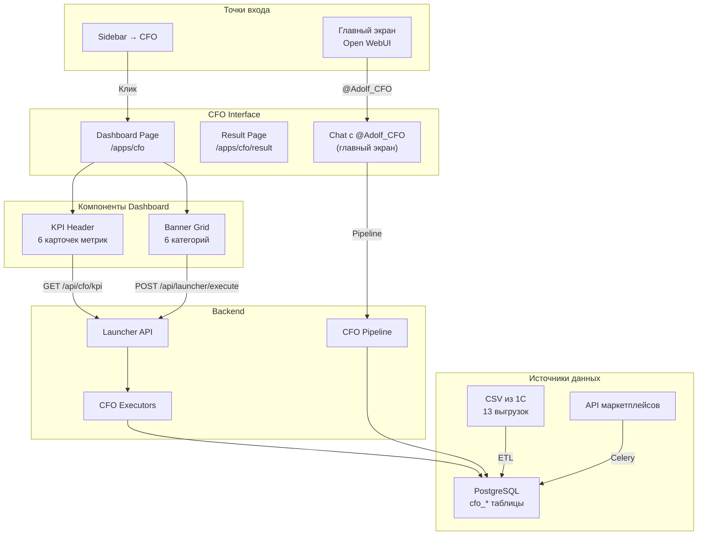
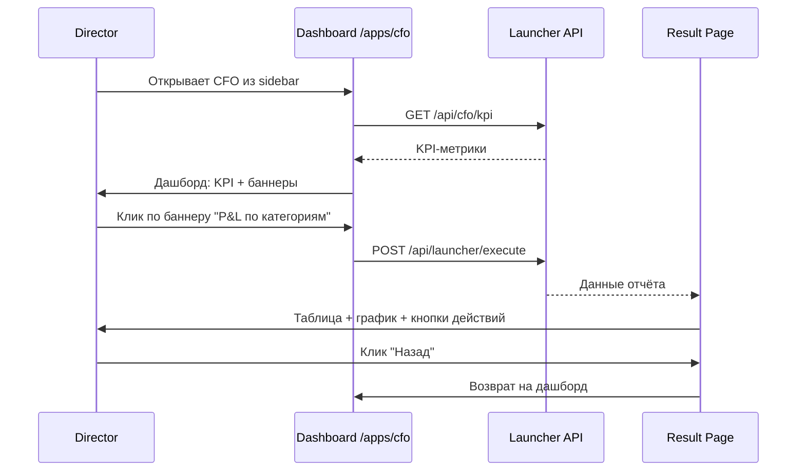
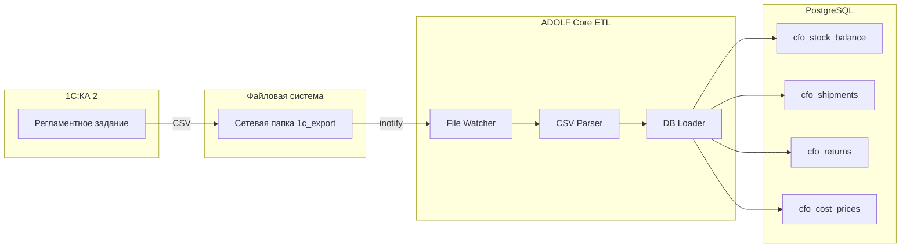

**Проект:** Финансовый учёт и управленческая аналитика  
**Модуль:** CFO  
**Версия:** 1.1  
**Дата:** Февраль 2026

---

## 4.1 Назначение

Раздел описывает интерфейс модуля CFO в Open WebUI. Модуль использует **dashboard-first** подход: пользователь (директор) видит визуальный дашборд с KPI-метриками, графиками и каталогом готовых отчётов — без необходимости формулировать запросы к ИИ. Чат с ИИ доступен отдельно через главный экран Open WebUI.

### Изменения относительно v1.0

| Аспект | v1.0 (было) | v1.1 (стало) |
|--------|-------------|--------------|
| Парадигма | Chat-first: пользователь пишет запрос | Dashboard-first: пользователь выбирает из готовых отчётов |
| Точка входа | Pipeline \`@Adolf_CFO\` в чате | Launcher-страница \`/apps/cfo\` с KPI и баннерами |
| Навигация | Текстовые команды + кнопки | Визуальные баннеры по категориям |
| Графики | Отсутствуют | shadcn/ui Charts (Recharts) |
| Данные 1С | Только себестоимость | 13 выгрузок: остатки, отгрузки, возвраты, прибыль |
| Чат с ИИ | Основной интерфейс | Отдельный раздел (главный экран Open WebUI) |

### Компоненты интерфейса

| Компонент | Описание |
|-----------|----------|
| KPI Header | Автообновляемые карточки ключевых метрик |
| Banner Grid | Категоризированные баннеры готовых отчётов |
| Result Page | Страница результата с таблицами и графиками |
| Charts | shadcn/ui Charts (Recharts) для визуализации трендов |
| Pipeline | \`@Adolf_CFO\` — чат-агент для кастомных вопросов |

---

## 4.2 Архитектура интерфейса

### 4.2.1 Общая схема



### 4.2.2 Навигационный поток



### 4.2.3 Чат с ИИ — отдельный поток

Для свободных вопросов директор использует главный экран Open WebUI, выбирая Pipeline \`@Adolf_CFO\`. Это стандартный чат-интерфейс, описание которого сохранено в подразделе 4.8.

---

## 4.3 KPI Dashboard Header

При открытии страницы \`/apps/cfo\` в верхней части отображаются автообновляемые карточки ключевых метрик. Данные загружаются через endpoint \`GET /api/cfo/kpi\`.

### 4.3.1 Состав KPI-карточек

| # | Метрика | Источник | Дельта |
|:-:|---------|----------|--------|
| 1 | Выручка за неделю | \`cfo_pnl_daily\` | vs прошлая неделя |
| 2 | Чистая прибыль | \`cfo_pnl_daily\` | vs прошлая неделя |
| 3 | Средняя маржа | \`cfo_pnl_daily\` | vs прошлая неделя (п.п.) |
| 4 | Убыточные SKU | \`cfo_abc_results\` (class D) | vs прошлая неделя |
| 5 | Остатки на складах | \`stock_balance\` (1С) | кол-во единиц |
| 6 | Отгрузки сегодня | \`orders_shipped\` (1С) | кол-во единиц |

### 4.3.2 API Endpoint

```
GET /api/cfo/kpi
Authorization: Bearer {token}
```

**Response:**

```json
{
  "period": "2026-02-07 — 2026-02-13",
  "metrics": [
    {
      "id": "revenue",
      "label": "Выручка",
      "value": 5250000,
      "formatted": "5 250 000 ₽",
      "delta": 12.3,
      "delta_label": "+12.3% к пред. нед",
      "trend": "up",
      "icon": "trending-up"
    },
    {
      "id": "profit",
      "label": "Чистая прибыль",
      "value": 2238900,
      "formatted": "2 238 900 ₽",
      "delta": 8.1,
      "delta_label": "+8.1% к пред. нед",
      "trend": "up",
      "icon": "wallet"
    },
    {
      "id": "margin",
      "label": "Средняя маржа",
      "value": 42.6,
      "formatted": "42.6%",
      "delta": 1.2,
      "delta_label": "+1.2 п.п.",
      "trend": "up",
      "icon": "percent"
    },
    {
      "id": "loss_makers",
      "label": "Убыточных SKU",
      "value": 5,
      "formatted": "5",
      "delta": -2,
      "delta_label": "-2 к пред. нед",
      "trend": "down",
      "icon": "alert-triangle"
    },
    {
      "id": "stock",
      "label": "Остатки",
      "value": 12450,
      "formatted": "12 450 шт",
      "delta": null,
      "delta_label": "на складах",
      "trend": "neutral",
      "icon": "package"
    },
    {
      "id": "shipments",
      "label": "Отгрузки",
      "value": 340,
      "formatted": "340 шт",
      "delta": null,
      "delta_label": "сегодня",
      "trend": "neutral",
      "icon": "truck"
    }
  ]
}
```

### 4.3.3 Компонент KPI Card

Визуализация на базе shadcn/ui Card. Иконки: Lucide. Цвет дельты: \`--success\` для положительных, \`--destructive\` для отрицательных, \`--muted-foreground\` для нейтральных.

### 4.3.4 Backend реализация

```python
# executors/launcher/cfo_kpi.py

async def get_kpi(user: dict) -> dict:
    """KPI-метрики для дашборда CFO."""

    current = await pnl_service.get_summary(
        date_from=week_start(), date_to=yesterday()
    )
    previous = await pnl_service.get_summary(
        date_from=prev_week_start(), date_to=prev_week_end()
    )
    loss_count = await abc_service.count_class_d(
        date_from=week_start(), date_to=yesterday()
    )
    stock = await stock_service.get_total_balance()
    shipments = await stock_service.get_today_shipments()

    return {
        "period": f"{week_start()} — {yesterday()}",
        "metrics": [
            build_metric("revenue", "Выручка", current.revenue,
                         delta_pct(current.revenue, previous.revenue)),
            build_metric("profit", "Чистая прибыль", current.net_profit,
                         delta_pct(current.net_profit, previous.net_profit)),
            build_metric("margin", "Средняя маржа", current.avg_margin,
                         current.avg_margin - previous.avg_margin),
            build_metric("loss_makers", "Убыточных SKU", loss_count.current,
                         loss_count.current - loss_count.previous),
            build_metric("stock", "Остатки", stock.total_qty, None),
            build_metric("shipments", "Отгрузки", shipments.today_qty, None),
        ]
    }
```

---

## 4.4 Каталог баннеров

Под KPI-шапкой располагается сетка баннеров, сгруппированных по категориям. Каждый баннер запускает готовый отчёт через \`POST /api/launcher/execute\`. Архитектура соответствует [Launcher Core 3.1](/core/adolf_core_3_1_launcher).

### 4.4.1 Категории и баннеры

**Категория 1: P&L отчёты**

| Banner ID | Заголовок | Иконка | Доступ | Action |
|-----------|-----------|--------|--------|--------|
| \`pnl_category\` | P&L по категориям | \`folder-bar-chart\` | Senior+ | \`cfo.pnl_category\` |
| \`pnl_brand\` | P&L по брендам | \`tags\` | Senior+ | \`cfo.pnl_brand\` |
| \`pnl_marketplace\` | P&L по маркетплейсам | \`store\` | Senior+ | \`cfo.pnl_marketplace\` |
| \`pnl_sku\` | P&L по SKU | \`barcode\` | Director+ | \`cfo.pnl_sku\` |
| \`pnl_consolidated\` | Консолидированный P&L | \`file-bar-chart\` | Director+ | \`cfo.pnl_consolidated\` |

**Категория 2: Товарный анализ**

| Banner ID | Заголовок | Иконка | Доступ | Action |
|-----------|-----------|--------|--------|--------|
| \`abc_analysis\` | ABC-анализ | \`bar-chart-3\` | Senior+ | \`cfo.abc_analysis\` |
| \`loss_makers\` | Убыточные SKU | \`alert-triangle\` | Senior+ | \`cfo.loss_makers\` |
| \`top_profitable\` | Топ прибыльных | \`trophy\` | Senior+ | \`cfo.top_profitable\` |

**Категория 3: Динамика (графики)**

| Banner ID | Заголовок | Иконка | Badge | Action |
|-----------|-----------|--------|-------|--------|
| \`chart_revenue\` | Динамика выручки | \`trending-up\` | — | \`cfo.chart_revenue\` |
| \`chart_margin\` | Динамика маржи | \`activity\` | — | \`cfo.chart_margin\` |
| \`chart_compare\` | Сравнение периодов | \`git-compare-arrows\` | — | \`cfo.chart_compare\` |

**Категория 4: Склад и логистика**

| Banner ID | Заголовок | Иконка | Источник 1С | Action |
|-----------|-----------|--------|-------------|--------|
| \`stock_balance\` | Остатки на складах | \`package\` | \`stock_balance\` (ежедн.) | \`cfo.stock_balance\` |
| \`shipments\` | Отгрузки на МП | \`truck\` | \`orders_shipped\` (ежедн.) | \`cfo.shipments\` |
| \`returns\` | Возвраты | \`undo-2\` | \`returns_register\` (еженед.) | \`cfo.returns\` |
| \`inventory_value\` | Оценка запасов | \`warehouse\` | \`inventory_valuation\` (ежемес.) | \`cfo.inventory_value\` |

**Категория 5: Себестоимость**

| Banner ID | Заголовок | Иконка | Источник 1С | Action |
|-----------|-----------|--------|-------------|--------|
| \`cost_by_sku\` | Себестоимость по SKU | \`calculator\` | \`cost_prices\` (еженед.) | \`cfo.cost_by_sku\` |
| \`supplier_prices\` | Цены поставщиков | \`receipt\` | \`suppliers_prices\` (еженед.) | \`cfo.supplier_prices\` |
| \`cost_dynamics\` | Динамика себестоимости | \`chart-line\` | \`cost_prices\` (история) | \`cfo.cost_dynamics\` |

**Категория 6: AI-аналитика**

| Banner ID | Заголовок | Иконка | Badge | Action |
|-----------|-----------|--------|-------|--------|
| \`ai_digest\` | AI-дайджест за неделю | \`sparkles\` | AI | \`cfo.ai_digest\` |
| \`ai_chat\` | Задать вопрос CFO | \`message-square\` | — | \`cfo.ai_chat\` (redirect → chat) |

### 4.4.2 JSON-конфигурация

Файл: \`/config/launcher/cfo.json\`

```json
{
  "module": "cfo",
  "version": "1.1",
  "title": "Финансы",
  "description": "Финансовая аналитика и отчётность",
  "icon": "line-chart",
  "kpi_endpoint": "/api/cfo/kpi",
  "categories": [
    {
      "id": "pnl",
      "title": "P&L отчёты",
      "banners": [
        {
          "id": "pnl_category",
          "title": "P&L по категориям",
          "description": "Прибыль и убытки в разрезе категорий товаров",
          "icon": "folder-bar-chart",
          "action": "cfo.pnl_category",
          "enabled": true,
          "badge": null
        },
        {
          "id": "pnl_brand",
          "title": "P&L по брендам",
          "description": "Сравнение Охана Маркет и Охана Кидс",
          "icon": "tags",
          "action": "cfo.pnl_brand",
          "enabled": true,
          "badge": null
        },
        {
          "id": "pnl_marketplace",
          "title": "P&L по маркетплейсам",
          "description": "Wildberries vs Ozon vs Яндекс.Маркет",
          "icon": "store",
          "action": "cfo.pnl_marketplace",
          "enabled": true,
          "badge": null
        },
        {
          "id": "pnl_sku",
          "title": "P&L по SKU",
          "description": "Детализация до каждого артикула",
          "icon": "barcode",
          "action": "cfo.pnl_sku",
          "enabled": true,
          "badge": null,
          "min_role": "director"
        },
        {
          "id": "pnl_consolidated",
          "title": "Консолидированный P&L",
          "description": "Общая картина по всему бизнесу",
          "icon": "file-bar-chart",
          "action": "cfo.pnl_consolidated",
          "enabled": true,
          "badge": null,
          "min_role": "director"
        }
      ]
    },
    {
      "id": "product_analysis",
      "title": "Товарный анализ",
      "banners": [
        {
          "id": "abc_analysis",
          "title": "ABC-анализ",
          "description": "Классификация SKU по вкладу в прибыль",
          "icon": "bar-chart-3",
          "action": "cfo.abc_analysis",
          "enabled": true,
          "badge": null
        },
        {
          "id": "loss_makers",
          "title": "Убыточные SKU",
          "description": "Позиции с отрицательной маржой",
          "icon": "alert-triangle",
          "action": "cfo.loss_makers",
          "enabled": true,
          "badge": null
        },
        {
          "id": "top_profitable",
          "title": "Топ прибыльных",
          "description": "Лидеры по абсолютной прибыли",
          "icon": "trophy",
          "action": "cfo.top_profitable",
          "enabled": true,
          "badge": null
        }
      ]
    },
    {
      "id": "dynamics",
      "title": "Динамика",
      "banners": [
        {
          "id": "chart_revenue",
          "title": "Динамика выручки",
          "description": "График выручки за последние 30 дней",
          "icon": "trending-up",
          "action": "cfo.chart_revenue",
          "enabled": true,
          "badge": null
        },
        {
          "id": "chart_margin",
          "title": "Динамика маржи",
          "description": "Тренд маржинальности по дням",
          "icon": "activity",
          "action": "cfo.chart_margin",
          "enabled": true,
          "badge": null
        },
        {
          "id": "chart_compare",
          "title": "Сравнение периодов",
          "description": "Текущий vs предыдущий период",
          "icon": "git-compare-arrows",
          "action": "cfo.chart_compare",
          "enabled": true,
          "badge": null
        }
      ]
    },
    {
      "id": "warehouse",
      "title": "Склад и логистика",
      "banners": [
        {
          "id": "stock_balance",
          "title": "Остатки на складах",
          "description": "Текущие остатки по складам и SKU",
          "icon": "package",
          "action": "cfo.stock_balance",
          "enabled": true,
          "badge": null
        },
        {
          "id": "shipments",
          "title": "Отгрузки на МП",
          "description": "Реестр отгрузок за период",
          "icon": "truck",
          "action": "cfo.shipments",
          "enabled": true,
          "badge": null
        },
        {
          "id": "returns",
          "title": "Возвраты",
          "description": "Анализ возвратов от маркетплейсов",
          "icon": "undo-2",
          "action": "cfo.returns",
          "enabled": true,
          "badge": null
        },
        {
          "id": "inventory_value",
          "title": "Оценка запасов",
          "description": "Стоимость товаров на складах",
          "icon": "warehouse",
          "action": "cfo.inventory_value",
          "enabled": true,
          "badge": null
        }
      ]
    },
    {
      "id": "cost",
      "title": "Себестоимость",
      "banners": [
        {
          "id": "cost_by_sku",
          "title": "Себестоимость по SKU",
          "description": "Актуальная себестоимость из 1С",
          "icon": "calculator",
          "action": "cfo.cost_by_sku",
          "enabled": true,
          "badge": null
        },
        {
          "id": "supplier_prices",
          "title": "Цены поставщиков",
          "description": "Актуальные прайс-листы поставщиков",
          "icon": "receipt",
          "action": "cfo.supplier_prices",
          "enabled": true,
          "badge": null
        },
        {
          "id": "cost_dynamics",
          "title": "Динамика себестоимости",
          "description": "Изменение себестоимости во времени",
          "icon": "chart-line",
          "action": "cfo.cost_dynamics",
          "enabled": true,
          "badge": null
        }
      ]
    },
    {
      "id": "ai",
      "title": "AI-аналитика",
      "banners": [
        {
          "id": "ai_digest",
          "title": "AI-дайджест за неделю",
          "description": "Выводы, проблемы, рекомендации",
          "icon": "sparkles",
          "action": "cfo.ai_digest",
          "enabled": true,
          "badge": "AI"
        },
        {
          "id": "ai_chat",
          "title": "Задать вопрос CFO",
          "description": "Свободный диалог с ИИ-аналитиком",
          "icon": "message-square",
          "action": "cfo.ai_chat",
          "enabled": true,
          "badge": null,
          "action_type": "chat"
        }
      ]
    }
  ]
}
```

### 4.4.3 Расширение формата Launcher

Для поддержки KPI-шапки и категорий JSON-конфигурация CFO расширяет базовый формат Launcher (Core 3.1):

| Поле | Тип | Базовый Launcher | CFO Extension |
|------|-----|:----------------:|:-------------:|
| \`module\` | string | ✅ | ✅ |
| \`banners[]\` | array | ✅ (плоский список) | — |
| \`categories[]\` | array | — | ✅ (группы баннеров) |
| \`kpi_endpoint\` | string | — | ✅ |
| \`banners[].min_role\` | string | — | ✅ |
| \`banners[].action_type\` | string | — | ✅ (\`direct\` / \`chat\` / \`redirect\`) |

Launcher API автоматически определяет формат по наличию поля \`categories\`: если есть — рендерит категоризированную сетку, если нет — плоский список (обратная совместимость).

---

## 4.5 Графики и визуализация

Страницы результатов используют компоненты **shadcn/ui Charts** на базе **Recharts** для отображения финансовых трендов. Стили графиков определены через CSS-переменные \`--chart-1\` ... \`--chart-5\` из \`shadcn-variables.css\`.

### 4.5.1 Типы графиков

| Тип | shadcn/ui Component | Применение |
|-----|---------------------|------------|
| Area Chart | \`AreaChart\` | Динамика выручки, прибыли |
| Bar Chart | \`BarChart\` | P&L по категориям, сравнение МП |
| Stacked Bar | \`BarChart stacked\` | Структура расходов |
| Line Chart | \`LineChart\` | Тренд маржинальности |
| Pie / Donut | \`PieChart\` | Доля МП в выручке, распределение ABC |
| Radial Chart | \`RadialChart\` | Выполнение плана (v2.0) |

### 4.5.2 Спецификация данных для графиков

**Динамика выручки (Area Chart)**

Executor: \`cfo.chart_revenue\`

```json
{
  "chart_type": "area",
  "title": "Динамика выручки",
  "period": "30d",
  "x_key": "date",
  "series": [
    {"key": "revenue", "label": "Выручка", "color": "var(--chart-1)"},
    {"key": "profit", "label": "Прибыль", "color": "var(--chart-2)"}
  ],
  "data": [
    {"date": "2026-01-15", "revenue": 750000, "profit": 320000},
    {"date": "2026-01-16", "revenue": 680000, "profit": 290000}
  ]
}
```

**P&L по маркетплейсам (Bar Chart)**

Executor: \`cfo.pnl_marketplace\`

```json
{
  "chart_type": "bar",
  "title": "P&L по маркетплейсам",
  "x_key": "marketplace",
  "series": [
    {"key": "revenue", "label": "Выручка", "color": "var(--chart-1)"},
    {"key": "expenses", "label": "Расходы", "color": "var(--chart-5)"},
    {"key": "profit", "label": "Прибыль", "color": "var(--chart-2)"}
  ],
  "data": [
    {"marketplace": "Wildberries", "revenue": 3500000, "expenses": 1925000, "profit": 1575000},
    {"marketplace": "Ozon", "revenue": 1200000, "expenses": 780000, "profit": 420000},
    {"marketplace": "Яндекс.Маркет", "revenue": 550000, "expenses": 308000, "profit": 242000}
  ]
}
```

**Распределение ABC (Pie Chart)**

Executor: \`cfo.abc_analysis\`

```json
{
  "chart_type": "pie",
  "title": "Распределение прибыли по ABC",
  "data": [
    {"class": "A", "value": 7200000, "count": 47, "fill": "var(--abc-a)"},
    {"class": "B", "value": 1350000, "count": 89, "fill": "var(--abc-b)"},
    {"class": "C", "value": 450000, "count": 156, "fill": "var(--abc-c)"},
    {"class": "D", "value": -180000, "count": 23, "fill": "var(--abc-d)"}
  ]
}
```

**Динамика маржи (Line Chart)**

Executor: \`cfo.chart_margin\`

```json
{
  "chart_type": "line",
  "title": "Тренд маржинальности",
  "x_key": "date",
  "y_suffix": "%",
  "reference_line": {"value": 40, "label": "Целевая маржа"},
  "series": [
    {"key": "margin_wb", "label": "Wildberries", "color": "#CB11AB"},
    {"key": "margin_ozon", "label": "Ozon", "color": "#005BFF"},
    {"key": "margin_ym", "label": "Яндекс.Маркет", "color": "#FFCC00"}
  ],
  "data": [
    {"date": "2026-01-15", "margin_wb": 45.2, "margin_ozon": 38.1, "margin_ym": 41.5}
  ]
}
```

### 4.5.3 Цветовая схема графиков

| Назначение | CSS Variable | Цвет |
|------------|-------------|------|
| Серия 1 (основная) | \`--chart-1\` | Синий |
| Серия 2 (прибыль) | \`--chart-2\` | Зелёный |
| Серия 3 (нейтрал) | \`--chart-3\` | Серый |
| Серия 4 (акцент) | \`--chart-4\` | Жёлтый |
| Серия 5 (расходы) | \`--chart-5\` | Красный |
| Wildberries | \`--mp-wb\` | #CB11AB |
| Ozon | \`--mp-ozon\` | #005BFF |
| Яндекс.Маркет | \`--mp-ym\` | #FFCC00 |
| ABC A | \`--abc-a\` | Зелёный |
| ABC B | \`--abc-b\` | Синий |
| ABC C | \`--abc-c\` | Жёлтый |
| ABC D | \`--abc-d\` | Красный |

---

## 4.6 Result Page

При клике по баннеру открывается страница результата \`/apps/cfo/result\`. Формат зависит от типа отчёта.

### 4.6.1 Структура Result Page

Каждая Result Page содержит следующие блоки (сверху вниз): навигация назад и breadcrumb, переключатель периода, график (если применимо), таблица данных, сводка (итого), кнопки связанных отчётов и экспорта.

### 4.6.2 Переключатель периода

Все отчёты поддерживают переключение периода без возврата на дашборд:

| Кнопка | Период | API-параметр |
|--------|--------|-------------|
| Нед | Последние 7 дней | \`period=week\` |
| Мес | Последние 30 дней | \`period=month\` |
| Кв | Последние 90 дней | \`period=quarter\` |

При переключении периода данные перезагружаются через тот же executor с новым параметром.

### 4.6.3 Кнопки навигации между отчётами

На каждой Result Page отображаются кнопки быстрого перехода к связанным отчётам:

| Текущий отчёт | Связанные кнопки |
|---------------|------------------|
| P&L по категориям | По брендам, По МП, ABC-анализ, Excel |
| P&L по брендам | По категориям, По МП, По SKU*, Excel |
| P&L по МП | По категориям, По брендам, Excel |
| P&L по SKU | По категориям, ABC-анализ, Убыточные, Excel |
| ABC-анализ | Убыточные SKU, Топ прибыльных, AI-дайджест, Excel |
| Убыточные SKU | AI-рекомендации, ABC-анализ, Excel |
| Остатки | Отгрузки, Оценка запасов |
| Себестоимость | Цены поставщиков, Динамика |

### 4.6.4 Экспорт

Все табличные отчёты поддерживают экспорт:

| Формат | Кнопка | Реализация |
|--------|--------|------------|
| Excel | 📥 Excel | \`cfo.export\` → \`.xlsx\` файл |
| PDF | 📄 PDF | \`cfo.export\` → \`.pdf\` файл |
| Копировать | 📋 Копировать | Clipboard API → markdown-таблица |

---

## 4.7 Источники данных из 1С

Модуль CFO v1.1 использует данные из **13 регулярных выгрузок** 1С:Комплексная автоматизация 2 (см. \`brain_1c_ka2_exports_registry_v1_1\`). Ниже — маппинг выгрузок на баннеры дашборда.

### 4.7.1 Маппинг 1С → CFO Dashboard

| Выгрузка 1С | Код файла | Периодичность | Баннеры CFO |
|-------------|-----------|---------------|-------------|
| Остатки и доступность | \`stock_balance\` | Ежедневно | Остатки на складах, KPI "Остатки" |
| Ведомость по товарам | \`stock_movement\` | Ежедневно | (внутренние расчёты) |
| Реестр документов продажи | \`orders_shipped\` | Ежедневно | Отгрузки на МП, KPI "Отгрузки" |
| Себестоимость товаров | \`cost_prices\` | Еженедельно | Себестоимость по SKU, P&L расчёты |
| Номенклатура | \`product_catalog\` | Еженедельно | (справочник товаров) |
| Цены поставщиков | \`suppliers_prices\` | Еженедельно | Цены поставщиков |
| Анализ возвратов | \`returns_register\` | Еженедельно | Возвраты |
| Валовая прибыль | \`financial_summary\` | Ежемесячно | P&L консолидированный, Сравнение периодов |
| Остатки (срез) | \`inventory_valuation\` | Ежемесячно | Оценка запасов |
| Договоры | \`contracts_register\` | Ежемесячно | (справочник) |
| Контрагенты | \`counterparties\` | Ежемесячно | (справочник) |
| Квартальная прибыль | \`quarter_pnl\` | Ежеквартально | Сравнение периодов |
| Инвентаризация | \`quarter_inventory_audit\` | Ежеквартально | (контроль) |

### 4.7.2 ETL-процесс для новых выгрузок

CSV-файлы поступают в \`/data/inbox/cfo/\` и обрабатываются через ETL (ADOLF Core). Новые таблицы для данных 1С описаны в [Раздел 5: Database](/cfo/adolf_cfo_5_database).



---

## 4.8 Pipeline (чат с ИИ)

Для свободных вопросов к финансовому ИИ-аналитику используется Pipeline \`@Adolf_CFO\` на главном экране Open WebUI. Это дополнение к dashboard-интерфейсу, а не основной способ взаимодействия.

### 4.8.1 Точка входа

Пользователь открывает главный экран Open WebUI (экран приветствия), выбирает \`@Adolf_CFO\` и задаёт вопрос в свободной форме.

### 4.8.2 Системный промпт

```python
CFO_SYSTEM_PROMPT = """
Ты финансовый ассистент системы ADOLF для компании ОХАНА МАРКЕТ.

Твои возможности:
1. Формирование P&L отчётов (SKU, категории, бренды, маркетплейсы)
2. ABC-анализ товарного портфеля
3. Выявление убыточных позиций
4. AI-инсайты и рекомендации
5. Кастомные отчёты по запросу
6. Анализ данных из 1С (остатки, отгрузки, возвраты, себестоимость)

Маркетплейсы: Wildberries (wb), Ozon (ozon), Яндекс.Маркет (ym)
Бренды: Охана Маркет (ohana_market), Охана Кидс (ohana_kids)

Правила:
1. Всегда указывай период данных
2. Числа с разделителями тысяч (1 234 567 ₽)
3. Проценты до 1 знака (15.3%)
4. Для убыточных позиций предлагай рекомендации
5. Для табличных данных используй markdown-таблицы

Примечание: основные отчёты доступны на дашборде CFO.
Чат предназначен для кастомных вопросов и углублённого анализа.

Текущий пользователь:
- Роль: {user_role}
- Бренд: {user_brand}

{role_restrictions}
"""
```

### 4.8.3 Tools (Function Calling)

Реестр Tools остаётся общим для Pipeline и Launcher executors. Полный список базовых Tools и их реализация описаны в v1.0 данного раздела. Ниже — только новые Tools, добавленные в v1.1.

**Новые Tools v1.1:**

| Tool | Описание | Источник 1С |
|------|----------|-------------|
| \`cfo_stock_balance\` | Остатки товаров на складах | \`stock_balance\` |
| \`cfo_shipments\` | Отгрузки на маркетплейсы | \`orders_shipped\` |
| \`cfo_returns\` | Анализ возвратов | \`returns_register\` |
| \`cfo_inventory_value\` | Оценка стоимости запасов | \`inventory_valuation\` |
| \`cfo_supplier_prices\` | Цены поставщиков | \`suppliers_prices\` |
| \`cfo_cost_dynamics\` | Динамика себестоимости | \`cost_prices\` (история) |
| \`cfo_top_profitable\` | Топ прибыльных SKU | \`cfo_pnl_daily\` |
| \`cfo_chart_revenue\` | Данные для графика выручки | \`cfo_pnl_daily\` |
| \`cfo_chart_margin\` | Данные для графика маржи | \`cfo_pnl_daily\` |
| \`cfo_chart_compare\` | Сравнение двух периодов | \`cfo_pnl_aggregated\` |

**Описание новых Tools для LLM:**

```json
[
  {
    "name": "cfo_stock_balance",
    "description": "Остатки товаров на складах. Данные из 1С (ежедневная выгрузка).",
    "parameters": {
      "type": "object",
      "properties": {
        "warehouse_code": {
          "type": "string",
          "description": "Код склада (all для всех)",
          "default": "all"
        },
        "sku": {
          "type": "string",
          "description": "Фильтр по артикулу"
        },
        "limit": {"type": "integer", "default": 50}
      }
    }
  },
  {
    "name": "cfo_shipments",
    "description": "Отгрузки товаров на маркетплейсы. Данные из 1С.",
    "parameters": {
      "type": "object",
      "properties": {
        "period": {"type": "string", "default": "week"},
        "marketplace": {
          "type": "string",
          "enum": ["all", "Wildberries", "Ozon", "Яндекс.Маркет"],
          "default": "all"
        }
      }
    }
  },
  {
    "name": "cfo_returns",
    "description": "Анализ возвратов от маркетплейсов. Данные из 1С (еженедельно).",
    "parameters": {
      "type": "object",
      "properties": {
        "period": {"type": "string", "default": "week"},
        "marketplace": {
          "type": "string",
          "enum": ["all", "Wildberries", "Ozon", "Яндекс.Маркет"],
          "default": "all"
        },
        "group_by": {
          "type": "string",
          "enum": ["sku", "marketplace", "date"],
          "default": "sku"
        }
      }
    }
  },
  {
    "name": "cfo_supplier_prices",
    "description": "Актуальные цены поставщиков. Данные из 1С (еженедельно).",
    "parameters": {
      "type": "object",
      "properties": {
        "supplier_code": {"type": "string", "description": "Код поставщика (all для всех)", "default": "all"},
        "sku": {"type": "string", "description": "Фильтр по артикулу"}
      }
    }
  },
  {
    "name": "cfo_cost_dynamics",
    "description": "Динамика себестоимости товаров за период.",
    "parameters": {
      "type": "object",
      "properties": {
        "sku": {"type": "string", "description": "Артикул (обязательно)"},
        "months": {"type": "integer", "default": 6, "description": "Количество месяцев"}
      },
      "required": ["sku"]
    }
  },
  {
    "name": "cfo_top_profitable",
    "description": "Топ наиболее прибыльных SKU.",
    "parameters": {
      "type": "object",
      "properties": {
        "period": {"type": "string", "default": "month"},
        "limit": {"type": "integer", "default": 20},
        "marketplace": {"type": "string", "enum": ["all", "wb", "ozon", "ym"], "default": "all"}
      }
    }
  }
]
```

---

## 4.9 Executors

Каждый баннер дашборда вызывает соответствующий executor. Все executors расположены в \`/executors/launcher/cfo.py\`.

### 4.9.1 Реестр Executors

| Action | Executor Function | Возвращает |
|--------|-------------------|------------|
| \`cfo.pnl_category\` | \`pnl_category()\` | Таблица + Bar Chart |
| \`cfo.pnl_brand\` | \`pnl_brand()\` | Таблица + Bar Chart |
| \`cfo.pnl_marketplace\` | \`pnl_marketplace()\` | Таблица + Bar Chart |
| \`cfo.pnl_sku\` | \`pnl_sku()\` | Таблица |
| \`cfo.pnl_consolidated\` | \`pnl_consolidated()\` | Сводная таблица + Area Chart |
| \`cfo.abc_analysis\` | \`abc_analysis()\` | Таблица + Pie Chart |
| \`cfo.loss_makers\` | \`loss_makers()\` | Таблица + рекомендации |
| \`cfo.top_profitable\` | \`top_profitable()\` | Таблица |
| \`cfo.chart_revenue\` | \`chart_revenue()\` | Area Chart |
| \`cfo.chart_margin\` | \`chart_margin()\` | Line Chart |
| \`cfo.chart_compare\` | \`chart_compare()\` | Bar Chart (stacked) |
| \`cfo.stock_balance\` | \`stock_balance()\` | Таблица |
| \`cfo.shipments\` | \`shipments()\` | Таблица |
| \`cfo.returns\` | \`returns()\` | Таблица |
| \`cfo.inventory_value\` | \`inventory_value()\` | Таблица |
| \`cfo.cost_by_sku\` | \`cost_by_sku()\` | Таблица |
| \`cfo.supplier_prices\` | \`supplier_prices()\` | Таблица |
| \`cfo.cost_dynamics\` | \`cost_dynamics()\` | Line Chart |
| \`cfo.ai_digest\` | \`ai_digest()\` | Markdown (AI-текст) |
| \`cfo.ai_chat\` | — | Redirect → Pipeline чат |

### 4.9.2 Формат ответа Executor

Все executors возвращают унифицированный формат:

```json
{
  "success": true,
  "action": "cfo.pnl_category",
  "title": "P&L по категориям",
  "subtitle": "07.02.2026 — 13.02.2026",
  "components": [
    {
      "type": "chart",
      "chart_type": "bar",
      "data": {}
    },
    {
      "type": "table",
      "columns": ["Категория", "Выручка", "Себест.", "Расходы МП", "Прибыль", "Маржа"],
      "rows": [
        ["Платья", "2 450 000 ₽", "980 000 ₽", "367 500 ₽", "1 102 500 ₽", "45.0%"]
      ]
    },
    {
      "type": "summary",
      "items": [
        {"label": "Выручка", "value": "4 570 000 ₽"},
        {"label": "Прибыль", "value": "2 056 500 ₽"},
        {"label": "Маржа", "value": "45.0%"}
      ]
    }
  ],
  "actions": [
    {"label": "🏷️ По брендам", "action": "cfo.pnl_brand"},
    {"label": "🛒 По МП", "action": "cfo.pnl_marketplace"},
    {"label": "📥 Excel", "action": "cfo.export", "params": {"report_type": "pnl_category"}}
  ],
  "period_selector": true,
  "export_available": true
}
```

### 4.9.3 Промпт для реализации

```
Промпт для Claude Code:

Создай файл executors/launcher/cfo.py с async-функциями для каждого 
action из реестра 4.9.1. Каждая функция:
- Принимает user: dict (id, role, brand_id)
- Возвращает dict в формате раздела 4.9.2
- Использует сервисы: pnl_service, abc_service, stock_service, 
  insight_service, export_service
- Проверяет доступ по роли (min_role из конфигурации баннера)
- Для графиков формирует data в формате Recharts
- Для таблиц форматирует числа с разделителями тысяч

Зависимости: SQLAlchemy async, FastAPI, Pydantic.
Бизнес-логика: см. adolf_cfo_3_ai_pipeline.md
Схема БД: см. adolf_cfo_5_database.md
```

---

## 4.10 Матрица доступа

| Компонент | Senior | Director | Admin |
|-----------|:------:|:--------:|:-----:|
| KPI Dashboard | ✅ | ✅ | ✅ |
| P&L по категориям | ✅ | ✅ | ✅ |
| P&L по брендам | ✅ | ✅ | ✅ |
| P&L по маркетплейсам | ✅ | ✅ | ✅ |
| P&L по SKU | ❌ | ✅ | ✅ |
| Консолидированный P&L | ❌ | ✅ | ✅ |
| ABC-анализ | ✅ | ✅ | ✅ |
| Убыточные SKU | ✅ | ✅ | ✅ |
| Топ прибыльных | ✅ | ✅ | ✅ |
| Графики (все) | ✅ | ✅ | ✅ |
| Склад и логистика (все) | ✅ | ✅ | ✅ |
| Себестоимость (все) | ✅ | ✅ | ✅ |
| AI-дайджест | ✅ | ✅ | ✅ |
| Чат @Adolf_CFO | ✅ | ✅ | ✅ |
| Кастомные отчёты (чат) | ❌ | ✅ | ✅ |
| Настройки порогов | ❌ | ❌ | ✅ |

Баннеры с \`min_role: "director"\` не отображаются для Senior. Доступ проверяется и на фронтенде (скрытие баннера), и на бэкенде (executor возвращает ошибку 403).

---

## 4.11 Связанные документы

| Документ | Связь |
|----------|-------|
| [Core 3.1: Launcher](/core/adolf_core_3_1_launcher) | Базовая архитектура баннерного подменю |
| [CFO 3: AI Pipeline](/cfo/adolf_cfo_3_ai_pipeline) | Бизнес-логика расчётов P&L и ABC |
| [CFO 5: Database](/cfo/adolf_cfo_5_database) | Схема таблиц \`cfo_*\` |
| [CFO 7: Celery](/cfo/adolf_cfo_7_celery) | Фоновые задачи импорта данных |
| [UI Reference: CFO](/ui_reference/cfo/) | Визуальный reference компонентов |
| [UI Reference: shadcn](/ui_reference/base/) | CSS-переменные и design tokens |
| \`brain_1c_ka2_exports_registry_v1_1\` | Регламент выгрузок из 1С |

---

**Документ подготовлен:** Февраль 2026  
**Версия:** 1.1  
**Статус:** Утверждён  
**Заменяет:** v1.0 (Январь 2026)
