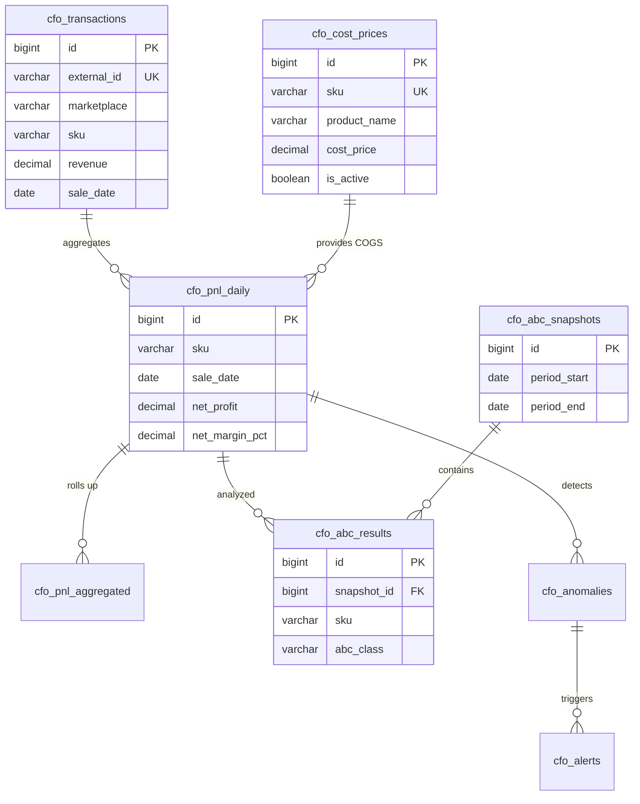

**Проект:** Финансовый учёт и управленческая аналитика  
**Модуль:** CFO  
**Версия:** 1.1  
**Дата:** Январь 2026

---

## 5.1 Назначение

Раздел описывает схему базы данных модуля CFO: таблицы, индексы, связи и политики хранения.

### Таблицы модуля

| Таблица | Описание |
|---------|----------|
| `cfo_transactions` | Финансовые транзакции с маркетплейсов |
| `cfo_cost_prices` | Справочник себестоимости |
| `cfo_pnl_daily` | Ежедневный P&L по SKU |
| `cfo_pnl_aggregated` | Агрегированный P&L по периодам |
| `cfo_abc_results` | Результаты ABC-анализа |
| `cfo_abc_snapshots` | Снимки ABC-анализа |
| `cfo_anomalies` | Обнаруженные аномалии |
| `cfo_alerts` | История алертов |
| `cfo_reports` | Сохранённые отчёты |
| `cfo_settings` | Настройки модуля |

<Note>
**Изменение v1.1:** Связывание транзакций с себестоимостью выполняется по полю SKU (артикул). Поле barcode является опциональным и используется только для данных из API/Excel маркетплейсов, но не из 1С.
</Note>

---

## 5.2 ER-диаграмма



---

## 5.3 Таблица cfo_transactions

### 5.3.1 Описание

Хранение всех финансовых транзакций с маркетплейсов. Основной источник данных для расчёта P&L.

### 5.3.2 DDL

```sql
CREATE TABLE cfo_transactions (
    id BIGSERIAL PRIMARY KEY,
    
    -- Идентификация
    external_id VARCHAR(255) NOT NULL,
    marketplace VARCHAR(20) NOT NULL,
    source VARCHAR(20) NOT NULL DEFAULT 'api',
    
    -- Товар
    sku VARCHAR(100) NOT NULL,
    barcode VARCHAR(50),              -- Опционально, из API/Excel МП
    nm_id BIGINT,
    product_name VARCHAR(500),
    category VARCHAR(200),
    brand_name VARCHAR(200),
    size VARCHAR(50),
    
    -- Финансы
    revenue DECIMAL(15,2) NOT NULL DEFAULT 0,
    commission DECIMAL(15,2) NOT NULL DEFAULT 0,
    logistics DECIMAL(15,2) NOT NULL DEFAULT 0,
    return_logistics DECIMAL(15,2) NOT NULL DEFAULT 0,
    storage DECIMAL(15,2) NOT NULL DEFAULT 0,
    advertising DECIMAL(15,2) NOT NULL DEFAULT 0,
    payout DECIMAL(15,2) NOT NULL DEFAULT 0,
    
    -- Мета
    sale_date DATE NOT NULL,
    operation_type VARCHAR(100),
    quantity INTEGER NOT NULL DEFAULT 1,
    source_file VARCHAR(500),
    
    -- Служебные
    created_at TIMESTAMP WITH TIME ZONE DEFAULT CURRENT_TIMESTAMP,
    
    -- Constraints
    CONSTRAINT uq_cfo_transactions_external UNIQUE (external_id, marketplace),
    CONSTRAINT chk_cfo_transactions_marketplace CHECK (marketplace IN ('wb', 'ozon', 'ym')),
    CONSTRAINT chk_cfo_transactions_source CHECK (source IN ('api', 'excel'))
);

-- Индексы
CREATE INDEX idx_cfo_transactions_sku ON cfo_transactions(sku);
CREATE INDEX idx_cfo_transactions_sale_date ON cfo_transactions(sale_date);
CREATE INDEX idx_cfo_transactions_marketplace ON cfo_transactions(marketplace);
CREATE INDEX idx_cfo_transactions_barcode ON cfo_transactions(barcode) WHERE barcode IS NOT NULL;
CREATE INDEX idx_cfo_transactions_category ON cfo_transactions(category) WHERE category IS NOT NULL;
CREATE INDEX idx_cfo_transactions_date_mp ON cfo_transactions(sale_date, marketplace);

-- Комментарии
COMMENT ON TABLE cfo_transactions IS 'Финансовые транзакции с маркетплейсов';
COMMENT ON COLUMN cfo_transactions.external_id IS 'Уникальный ID из источника (srid для WB, operation_id для Ozon)';
COMMENT ON COLUMN cfo_transactions.marketplace IS 'Маркетплейс: wb, ozon, ym';
COMMENT ON COLUMN cfo_transactions.source IS 'Источник данных: api или excel';
COMMENT ON COLUMN cfo_transactions.sku IS 'Артикул продавца — основной идентификатор для связи с 1С';
COMMENT ON COLUMN cfo_transactions.barcode IS 'Штрихкод из API/Excel МП (опционально, не из 1С)';
COMMENT ON COLUMN cfo_transactions.revenue IS 'Выручка (цена продажи с учётом скидок)';
COMMENT ON COLUMN cfo_transactions.payout IS 'Сумма к выплате продавцу';
```

### 5.3.3 Примеры данных

| id | external_id | marketplace | sku | revenue | commission | sale_date |
|----|-------------|-------------|-----|--------:|------------|-----------|
| 1 | abc123 | wb | OM-12345 | 2975.00 | 461.13 | 2026-01-15 |
| 2 | def456 | ozon | OM-12345 | 2500.00 | 375.00 | 2026-01-15 |
| 3 | ghi789 | wb | OK-54321 | 1200.00 | 180.00 | 2026-01-15 |

---

## 5.4 Таблица cfo_cost_prices

### 5.4.1 Описание

Справочник себестоимости товаров. Загружается из 1С:Комплексная автоматизация 2 еженедельно.

<Warning>
**Изменение v1.1:** Идентификация товара производится только по полю SKU (артикул). Поле barcode удалено из таблицы, т.к. штрихкоды не выгружаются из 1С при оптовых продажах.
</Warning>

### 5.4.2 DDL

```sql
CREATE TABLE cfo_cost_prices (
    id BIGSERIAL PRIMARY KEY,
    
    -- Идентификация товара (только по SKU)
    sku VARCHAR(100) NOT NULL,
    product_name VARCHAR(500),
    
    -- Себестоимость
    cost_price DECIMAL(15,2) NOT NULL,
    currency VARCHAR(3) NOT NULL DEFAULT 'RUB',
    
    -- Классификация
    brand_id VARCHAR(100),            -- Вид номенклатуры (Охана Маркет / Охана Кидс)
    
    -- Период действия
    valid_from DATE NOT NULL,
    valid_to DATE,
    is_active BOOLEAN NOT NULL DEFAULT TRUE,
    
    -- Служебные
    created_at TIMESTAMP WITH TIME ZONE DEFAULT CURRENT_TIMESTAMP,
    updated_at TIMESTAMP WITH TIME ZONE DEFAULT CURRENT_TIMESTAMP,
    
    -- Constraints
    CONSTRAINT chk_cfo_cost_prices_sku_required CHECK (sku IS NOT NULL AND sku != ''),
    CONSTRAINT chk_cfo_cost_prices_positive CHECK (cost_price > 0)
);

-- Уникальный индекс по SKU для активных записей
CREATE UNIQUE INDEX idx_cfo_cost_prices_sku_active 
    ON cfo_cost_prices(sku) WHERE is_active = TRUE;

-- Индекс для поиска по дате
CREATE INDEX idx_cfo_cost_prices_valid_from ON cfo_cost_prices(valid_from);

-- Индекс по бренду
CREATE INDEX idx_cfo_cost_prices_brand ON cfo_cost_prices(brand_id) WHERE brand_id IS NOT NULL;

-- Триггер обновления updated_at
CREATE OR REPLACE FUNCTION update_cfo_cost_prices_timestamp()
RETURNS TRIGGER AS $$
BEGIN
    NEW.updated_at = CURRENT_TIMESTAMP;
    RETURN NEW;
END;
$$ LANGUAGE plpgsql;

CREATE TRIGGER trg_cfo_cost_prices_updated
    BEFORE UPDATE ON cfo_cost_prices
    FOR EACH ROW
    EXECUTE FUNCTION update_cfo_cost_prices_timestamp();

-- Комментарии
COMMENT ON TABLE cfo_cost_prices IS 'Справочник себестоимости из 1С:КА 2';
COMMENT ON COLUMN cfo_cost_prices.sku IS 'Артикул товара — единственный идентификатор для связи';
COMMENT ON COLUMN cfo_cost_prices.brand_id IS 'Вид номенклатуры (бренд): Охана Маркет или Охана Кидс';
COMMENT ON COLUMN cfo_cost_prices.valid_from IS 'Дата начала действия цены';
COMMENT ON COLUMN cfo_cost_prices.valid_to IS 'Дата окончания действия (NULL = бессрочно)';
```

### 5.4.3 Примеры данных

| id | sku | product_name | cost_price | brand_id | valid_from | is_active |
|----|-----|--------------|------------|----------|------------|-----------|
| 1 | OM-12345 | Платье летнее синее | 1200.00 | Охана Маркет | 2026-01-01 | TRUE |
| 2 | OM-12346 | Блузка офисная белая | 800.00 | Охана Маркет | 2026-01-01 | TRUE |
| 3 | OK-54321 | Футболка детская | 450.00 | Охана Кидс | 2026-01-01 | TRUE |

### 5.4.4 Формат файла импорта

Файл CSV из 1С:КА 2 должен содержать следующие колонки:

| Колонка CSV | Поле таблицы | Обязательно |
|-------------|--------------|:-----------:|
| `sku` | `sku` | Да |
| `product_name` | `product_name` | Да |
| `cost_price` | `cost_price` | Да |
| `currency` | `currency` | Нет (RUB) |
| `valid_from` | `valid_from` | Да |
| `brand_id` | `brand_id` | Нет |

---

## 5.5 Таблица cfo_pnl_daily

### 5.5.1 Описание

Ежедневный P&L по каждому SKU. Рассчитывается автоматически из транзакций.

### 5.5.2 DDL

```sql
CREATE TABLE cfo_pnl_daily (
    id BIGSERIAL PRIMARY KEY,
    
    -- Идентификация
    sku VARCHAR(100) NOT NULL,
    marketplace VARCHAR(20) NOT NULL,
    brand_id VARCHAR(50),
    category VARCHAR(200),
    sale_date DATE NOT NULL,
    
    -- Количество
    quantity_sold INTEGER NOT NULL DEFAULT 0,
    quantity_returned INTEGER NOT NULL DEFAULT 0,
    net_quantity INTEGER GENERATED ALWAYS AS (quantity_sold - quantity_returned) STORED,
    
    -- Выручка
    gross_revenue DECIMAL(15,2) NOT NULL DEFAULT 0,
    discounts DECIMAL(15,2) NOT NULL DEFAULT 0,
    returns_amount DECIMAL(15,2) NOT NULL DEFAULT 0,
    net_revenue DECIMAL(15,2) NOT NULL DEFAULT 0,
    
    -- Себестоимость
    cogs DECIMAL(15,2) NOT NULL DEFAULT 0,
    cogs_mapped BOOLEAN NOT NULL DEFAULT FALSE,
    
    -- Расходы маркетплейса
    commission DECIMAL(15,2) NOT NULL DEFAULT 0,
    logistics DECIMAL(15,2) NOT NULL DEFAULT 0,
    return_logistics DECIMAL(15,2) NOT NULL DEFAULT 0,
    storage DECIMAL(15,2) NOT NULL DEFAULT 0,
    advertising DECIMAL(15,2) NOT NULL DEFAULT 0,
    
    -- Итоги
    total_expenses DECIMAL(15,2) GENERATED ALWAYS AS (
        cogs + commission + logistics + return_logistics + storage + advertising
    ) STORED,
    
    gross_profit DECIMAL(15,2) GENERATED ALWAYS AS (net_revenue - cogs) STORED,
    gross_margin_pct DECIMAL(8,2),
    
    net_profit DECIMAL(15,2) GENERATED ALWAYS AS (
        net_revenue - cogs - commission - logistics - return_logistics - storage - advertising
    ) STORED,
    net_margin_pct DECIMAL(8,2),
    
    -- Служебные
    calculated_at TIMESTAMP WITH TIME ZONE DEFAULT CURRENT_TIMESTAMP,
    
    -- Constraints
    CONSTRAINT uq_cfo_pnl_daily UNIQUE (sku, marketplace, sale_date),
    CONSTRAINT chk_cfo_pnl_daily_marketplace CHECK (marketplace IN ('wb', 'ozon', 'ym'))
);

-- Индексы
CREATE INDEX idx_cfo_pnl_daily_date ON cfo_pnl_daily(sale_date);
CREATE INDEX idx_cfo_pnl_daily_sku ON cfo_pnl_daily(sku);
CREATE INDEX idx_cfo_pnl_daily_marketplace ON cfo_pnl_daily(marketplace);
CREATE INDEX idx_cfo_pnl_daily_brand ON cfo_pnl_daily(brand_id) WHERE brand_id IS NOT NULL;
CREATE INDEX idx_cfo_pnl_daily_category ON cfo_pnl_daily(category) WHERE category IS NOT NULL;
CREATE INDEX idx_cfo_pnl_daily_unmapped ON cfo_pnl_daily(sku) WHERE cogs_mapped = FALSE;

-- Комментарии
COMMENT ON TABLE cfo_pnl_daily IS 'Ежедневный P&L по SKU';
COMMENT ON COLUMN cfo_pnl_daily.cogs_mapped IS 'Флаг наличия себестоимости из 1С';
COMMENT ON COLUMN cfo_pnl_daily.net_margin_pct IS 'Чистая маржа в процентах';
```

---

## 5.6 — 5.12 Остальные таблицы

Структура таблиц `cfo_pnl_aggregated`, `cfo_abc_snapshots`, `cfo_abc_results`, `cfo_anomalies`, `cfo_alerts`, `cfo_reports`, `cfo_settings` не изменилась.

<Info>
Полный DDL остальных таблиц см. в версии 1.0 документа. В версии 1.1 изменены только таблицы `cfo_cost_prices` и `cfo_transactions` (комментарии).
</Info>

---

## 5.13 Представления (Views)

### 5.13.1 View: vw_cfo_pnl_summary

```sql
CREATE OR REPLACE VIEW vw_cfo_pnl_summary AS
SELECT 
    sale_date,
    marketplace,
    brand_id,
    COUNT(DISTINCT sku) as sku_count,
    SUM(quantity_sold) as total_quantity,
    SUM(net_revenue) as total_revenue,
    SUM(cogs) as total_cogs,
    SUM(commission + logistics + return_logistics + storage + advertising) as total_mp_expenses,
    SUM(net_profit) as total_profit,
    ROUND(AVG(net_margin_pct), 2) as avg_margin_pct
FROM cfo_pnl_daily
GROUP BY sale_date, marketplace, brand_id;

COMMENT ON VIEW vw_cfo_pnl_summary IS 'Сводка P&L по дням';
```

### 5.13.2 View: vw_cfo_loss_makers

```sql
CREATE OR REPLACE VIEW vw_cfo_loss_makers AS
SELECT 
    sku,
    marketplace,
    brand_id,
    category,
    sale_date,
    net_revenue,
    total_expenses,
    net_profit,
    net_margin_pct,
    CASE 
        WHEN logistics / NULLIF(net_revenue, 0) > 0.15 THEN 'Высокая логистика'
        WHEN net_margin_pct > -10 THEN 'Небольшой убыток'
        ELSE 'Значительный убыток'
    END as issue_type
FROM cfo_pnl_daily
WHERE net_profit < 0
ORDER BY net_profit ASC;

COMMENT ON VIEW vw_cfo_loss_makers IS 'Убыточные SKU';
```

### 5.13.3 View: vw_cfo_unmapped_costs

```sql
CREATE OR REPLACE VIEW vw_cfo_unmapped_costs AS
SELECT 
    sku,
    marketplace,
    COUNT(*) as transaction_count,
    SUM(net_revenue) as total_revenue,
    MIN(sale_date) as first_sale,
    MAX(sale_date) as last_sale
FROM cfo_pnl_daily
WHERE cogs_mapped = FALSE
GROUP BY sku, marketplace
ORDER BY total_revenue DESC;

COMMENT ON VIEW vw_cfo_unmapped_costs IS 'SKU без себестоимости';
```

---

## 5.14 Миграция v1.0 → v1.1

### 5.14.1 Скрипт миграции

```sql
-- Migration: 002_cfo_remove_barcode_from_costs.sql
-- Version: 1.1
-- Date: 2026-01
-- Description: Удаление barcode из cfo_cost_prices, переход на идентификацию по SKU

BEGIN;

-- 1. Удаление индекса по barcode
DROP INDEX IF EXISTS idx_cfo_cost_prices_barcode_active;

-- 2. Удаление колонки barcode
ALTER TABLE cfo_cost_prices DROP COLUMN IF EXISTS barcode;

-- 3. Изменение constraint на обязательность SKU
ALTER TABLE cfo_cost_prices DROP CONSTRAINT IF EXISTS chk_cfo_cost_prices_identifier;
ALTER TABLE cfo_cost_prices ADD CONSTRAINT chk_cfo_cost_prices_sku_required 
    CHECK (sku IS NOT NULL AND sku != '');

-- 4. Добавление колонки brand_id если отсутствует
ALTER TABLE cfo_cost_prices 
    ADD COLUMN IF NOT EXISTS brand_id VARCHAR(100);

-- 5. Добавление настройки cost_identifier
INSERT INTO cfo_settings (key, value, value_type, description)
VALUES ('cost_identifier', '"sku"', 'string', 'Идентификатор для связи с себестоимостью')
ON CONFLICT (key) DO NOTHING;

-- 6. Обновление timezone в расписании импорта
UPDATE cfo_settings 
SET value = '{"time": "06:00", "timezone": "Asia/Omsk"}'
WHERE key = 'import_schedule';

COMMIT;
```

### 5.14.2 Откат миграции

```sql
-- Rollback: 002_cfo_remove_barcode_from_costs.sql

BEGIN;

-- Восстановление колонки barcode
ALTER TABLE cfo_cost_prices ADD COLUMN IF NOT EXISTS barcode VARCHAR(50);

-- Восстановление constraint
ALTER TABLE cfo_cost_prices DROP CONSTRAINT IF EXISTS chk_cfo_cost_prices_sku_required;
ALTER TABLE cfo_cost_prices ADD CONSTRAINT chk_cfo_cost_prices_identifier 
    CHECK (barcode IS NOT NULL OR sku IS NOT NULL);

-- Восстановление индекса
CREATE UNIQUE INDEX IF NOT EXISTS idx_cfo_cost_prices_barcode_active 
    ON cfo_cost_prices(barcode) WHERE is_active = TRUE AND barcode IS NOT NULL;

COMMIT;
```

---

## 5.15 Изменения в версии 1.1

### Сводка изменений схемы БД

| Таблица | Изменение | Описание |
|---------|-----------|----------|
| `cfo_cost_prices` | Удалена колонка `barcode` | Идентификация только по SKU |
| `cfo_cost_prices` | Добавлена колонка `brand_id` | Вид номенклатуры (бренд) |
| `cfo_cost_prices` | Изменён constraint | SKU теперь обязательное поле |
| `cfo_settings` | Добавлена настройка | `cost_identifier = 'sku'` |
| `cfo_settings` | Изменён timezone | `Asia/Omsk` вместо `Europe/Moscow` |
| ER-диаграмма | Обновлена | `cfo_cost_prices.sku` как UK |

### Причины изменений

1. **Штрихкоды не выгружаются из 1С** — типовой отчёт «Себестоимость товаров» в 1С:КА 2 не содержит колонку «Штрихкод»
2. **Штрихкоды не указываются при оптовых продажах** — в документах реализации на маркетплейсы штрихкоды отсутствуют
3. **Артикул (SKU) — универсальный идентификатор** — используется во всех маркетплейсах и в 1С одинаково
4. **Часовой пояс OMS** — заказчик находится в Омске (UTC+6)

---

**Документ подготовлен:** Январь 2026  
**Версия:** 1.1  
**Статус:** Согласовано
