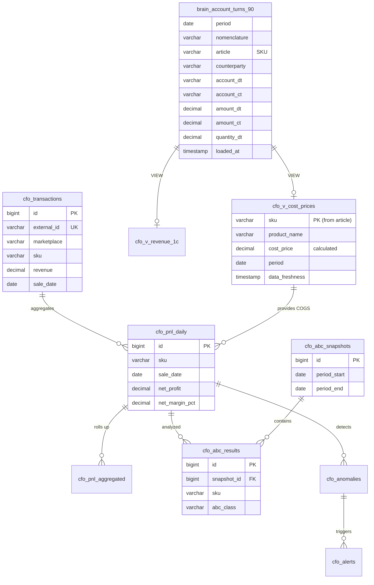
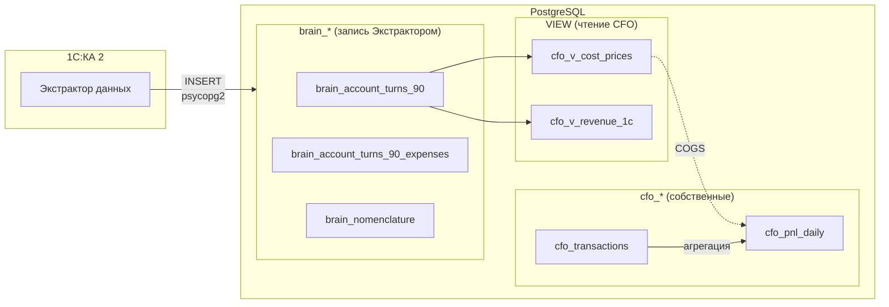

**Проект:** Финансовый учёт и управленческая аналитика  
**Модуль:** CFO  
**Версия:** 2.0  
**Дата:** Февраль 2026

---

## 5.1 Назначение

Раздел описывает схему базы данных модуля CFO: таблицы, VIEW, индексы, связи и политики хранения.

### Таблицы и VIEW модуля

| Объект | Тип | Описание |
|--------|-----|----------|
| `cfo_transactions` | Таблица | Финансовые транзакции с маркетплейсов |
| `cfo_pnl_daily` | Таблица | Ежедневный P&L по SKU |
| `cfo_pnl_aggregated` | Таблица | Агрегированный P&L по периодам |
| `cfo_abc_results` | Таблица | Результаты ABC-анализа |
| `cfo_abc_snapshots` | Таблица | Снимки ABC-анализа |
| `cfo_anomalies` | Таблица | Обнаруженные аномалии |
| `cfo_alerts` | Таблица | История алертов |
| `cfo_reports` | Таблица | Сохранённые отчёты |
| `cfo_settings` | Таблица | Настройки модуля |
| `cfo_v_cost_prices` | VIEW | Себестоимость по SKU (поверх `brain_account_turns_90`) |
| `cfo_v_revenue_1c` | VIEW | Выручка по данным 1С (для сверки) |
| `vw_cfo_pnl_summary` | VIEW | Сводка P&L по дням |
| `vw_cfo_loss_makers` | VIEW | Убыточные SKU |
| `vw_cfo_unmapped_costs` | VIEW | SKU без себестоимости |

<Note>
**Изменение v2.0:** Таблица `cfo_cost_prices` удалена. Себестоимость теперь читается из VIEW `cfo_v_cost_prices`, построенного поверх `brain_account_turns_90` (заполняется Экстрактором данных 1С). Подробности — [Приложение А1](/cfo/adolf_cfo_a1_1c_reports).
</Note>

<Note>
Связывание транзакций с себестоимостью выполняется по полю SKU (артикул). Поле barcode является опциональным и используется только для данных из API/Excel маркетплейсов, но не из 1С.
</Note>

---

## 5.2 ER-диаграмма



---

## 5.3 Связь CFO с brain\_\* таблицами

### 5.3.1 Архитектура доступа

CFO использует подход **VIEW поверх brain\_\*** — без дублирования данных, с real-time доступом.



### 5.3.2 Таблицы brain\_\*, используемые CFO

| Таблица brain\_\* | Запрос | Данные | VIEW CFO |
|-------------------|--------|--------|----------|
| `brain_account_turns_90` | Q-01 | Выручка и себестоимость по номенклатуре | `cfo_v_cost_prices`, `cfo_v_revenue_1c` |
| `brain_account_turns_90_expenses` | Q-02 | Коммерческие и управленческие расходы | — (прямые запросы) |
| `brain_nomenclature` | Q-10 | Справочник номенклатуры | — (прямые запросы) |
| `brain_nomenclature_prices` | Q-11 | Цены номенклатуры | — (прямые запросы) |

<Info>
Полная структура `brain_*` таблиц описана в [Приложении А1: Реестр запросов 1С → PostgreSQL](/cfo/adolf_cfo_a1_1c_reports). Таблицы `brain_*` принадлежат пользователю `brain_writer` и доступны CFO на чтение.
</Info>

### 5.3.3 VIEW: cfo\_v\_cost\_prices

Заменяет таблицу `cfo_cost_prices` (удалена в v2.0). Себестоимость рассчитывается из оборотов по счёту 90.02.1.

```sql
CREATE OR REPLACE VIEW cfo_v_cost_prices AS
SELECT
    t.article                           AS sku,
    t.nomenclature                      AS product_name,
    t.organization                      AS organization,
    CASE 
        WHEN SUM(t.quantity_dt) > 0 
        THEN ROUND(SUM(t.amount_dt) / SUM(t.quantity_dt), 2)
        ELSE NULL
    END                                 AS cost_price,
    SUM(t.amount_dt)                    AS total_cost,
    SUM(t.quantity_dt)                  AS total_quantity,
    t.period                            AS period,
    MAX(t.loaded_at)                    AS data_freshness
FROM brain_account_turns_90 t
WHERE t.account_dt = '90.02.1'
  AND t.article IS NOT NULL
  AND t.article != ''
GROUP BY t.article, t.nomenclature, t.organization, t.period;

COMMENT ON VIEW cfo_v_cost_prices IS 
    'Себестоимость по SKU из brain_account_turns_90 (Q-01, счёт 90.02.1). Заменяет таблицу cfo_cost_prices.';
```

### 5.3.4 VIEW: cfo\_v\_revenue\_1c

Выручка по данным бухучёта — для сверки с данными маркетплейсов.

```sql
CREATE OR REPLACE VIEW cfo_v_revenue_1c AS
SELECT
    t.article                           AS sku,
    t.nomenclature                      AS product_name,
    t.counterparty                      AS counterparty,
    t.organization                      AS organization,
    SUM(t.amount_ct)                    AS revenue,
    SUM(t.quantity_dt)                  AS quantity,
    t.period                            AS period,
    MAX(t.loaded_at)                    AS data_freshness
FROM brain_account_turns_90 t
WHERE t.account_ct = '90.01.1'
  AND t.article IS NOT NULL
  AND t.article != ''
GROUP BY t.article, t.nomenclature, t.counterparty, t.organization, t.period;

COMMENT ON VIEW cfo_v_revenue_1c IS 
    'Выручка по SKU из brain_account_turns_90 (Q-01, счёт 90.01.1). Для сверки с данными МП.';
```

---

## 5.4 Таблица cfo\_transactions

### 5.4.1 Описание

Хранение всех финансовых транзакций с маркетплейсов. Основной источник данных для расчёта P&L.

### 5.4.2 DDL

```sql
CREATE TABLE cfo_transactions (
    id BIGSERIAL PRIMARY KEY,
    
    -- Идентификация
    external_id VARCHAR(255) NOT NULL,
    marketplace VARCHAR(20) NOT NULL,
    source VARCHAR(20) NOT NULL DEFAULT 'api',
    
    -- Товар
    sku VARCHAR(100) NOT NULL,
    barcode VARCHAR(50),              -- Опционально, из API/Excel МП
    nm_id BIGINT,
    product_name VARCHAR(500),
    category VARCHAR(200),
    brand_name VARCHAR(200),
    size VARCHAR(50),
    
    -- Финансы
    revenue DECIMAL(15,2) NOT NULL DEFAULT 0,
    commission DECIMAL(15,2) NOT NULL DEFAULT 0,
    logistics DECIMAL(15,2) NOT NULL DEFAULT 0,
    return_logistics DECIMAL(15,2) NOT NULL DEFAULT 0,
    storage DECIMAL(15,2) NOT NULL DEFAULT 0,
    advertising DECIMAL(15,2) NOT NULL DEFAULT 0,
    payout DECIMAL(15,2) NOT NULL DEFAULT 0,
    
    -- Мета
    sale_date DATE NOT NULL,
    operation_type VARCHAR(100),
    quantity INTEGER NOT NULL DEFAULT 1,
    source_file VARCHAR(500),
    
    -- Служебные
    created_at TIMESTAMP WITH TIME ZONE DEFAULT CURRENT_TIMESTAMP,
    
    -- Constraints
    CONSTRAINT uq_cfo_transactions_external UNIQUE (external_id, marketplace),
    CONSTRAINT chk_cfo_transactions_marketplace CHECK (marketplace IN ('wb', 'ozon', 'ym')),
    CONSTRAINT chk_cfo_transactions_source CHECK (source IN ('api', 'excel'))
);

-- Индексы
CREATE INDEX idx_cfo_transactions_sku ON cfo_transactions(sku);
CREATE INDEX idx_cfo_transactions_sale_date ON cfo_transactions(sale_date);
CREATE INDEX idx_cfo_transactions_marketplace ON cfo_transactions(marketplace);
CREATE INDEX idx_cfo_transactions_barcode ON cfo_transactions(barcode) WHERE barcode IS NOT NULL;
CREATE INDEX idx_cfo_transactions_category ON cfo_transactions(category) WHERE category IS NOT NULL;
CREATE INDEX idx_cfo_transactions_date_mp ON cfo_transactions(sale_date, marketplace);

-- Комментарии
COMMENT ON TABLE cfo_transactions IS 'Финансовые транзакции с маркетплейсов';
COMMENT ON COLUMN cfo_transactions.external_id IS 'Уникальный ID из источника (srid для WB, operation_id для Ozon)';
COMMENT ON COLUMN cfo_transactions.marketplace IS 'Маркетплейс: wb, ozon, ym';
COMMENT ON COLUMN cfo_transactions.source IS 'Источник данных: api или excel';
COMMENT ON COLUMN cfo_transactions.sku IS 'Артикул продавца — основной идентификатор для связи с brain_*';
COMMENT ON COLUMN cfo_transactions.barcode IS 'Штрихкод из API/Excel МП (опционально, не из 1С)';
COMMENT ON COLUMN cfo_transactions.revenue IS 'Выручка (цена продажи с учётом скидок)';
COMMENT ON COLUMN cfo_transactions.payout IS 'Сумма к выплате продавцу';
```

### 5.4.3 Примеры данных

| id | external\_id | marketplace | sku | revenue | commission | sale\_date |
|----|-------------|-------------|-----|--------:|------------|-----------:|
| 1 | abc123 | wb | OM-12345 | 2975.00 | 461.13 | 2026-01-15 |
| 2 | def456 | ozon | OM-12345 | 2500.00 | 375.00 | 2026-01-15 |
| 3 | ghi789 | wb | OK-54321 | 1200.00 | 180.00 | 2026-01-15 |

---

## 5.5 Таблица cfo\_pnl\_daily

### 5.5.1 Описание

Ежедневный P&L по каждому SKU. Рассчитывается автоматически из транзакций. Себестоимость подтягивается из VIEW `cfo_v_cost_prices`.

### 5.5.2 DDL

```sql
CREATE TABLE cfo_pnl_daily (
    id BIGSERIAL PRIMARY KEY,
    
    -- Идентификация
    sku VARCHAR(100) NOT NULL,
    marketplace VARCHAR(20) NOT NULL,
    brand_id VARCHAR(50),
    category VARCHAR(200),
    sale_date DATE NOT NULL,
    
    -- Количество
    quantity_sold INTEGER NOT NULL DEFAULT 0,
    quantity_returned INTEGER NOT NULL DEFAULT 0,
    net_quantity INTEGER GENERATED ALWAYS AS (quantity_sold - quantity_returned) STORED,
    
    -- Выручка
    gross_revenue DECIMAL(15,2) NOT NULL DEFAULT 0,
    discounts DECIMAL(15,2) NOT NULL DEFAULT 0,
    returns_amount DECIMAL(15,2) NOT NULL DEFAULT 0,
    net_revenue DECIMAL(15,2) NOT NULL DEFAULT 0,
    
    -- Себестоимость
    cogs DECIMAL(15,2) NOT NULL DEFAULT 0,
    cogs_mapped BOOLEAN NOT NULL DEFAULT FALSE,
    
    -- Расходы маркетплейса
    commission DECIMAL(15,2) NOT NULL DEFAULT 0,
    logistics DECIMAL(15,2) NOT NULL DEFAULT 0,
    return_logistics DECIMAL(15,2) NOT NULL DEFAULT 0,
    storage DECIMAL(15,2) NOT NULL DEFAULT 0,
    advertising DECIMAL(15,2) NOT NULL DEFAULT 0,
    
    -- Итоги
    total_expenses DECIMAL(15,2) GENERATED ALWAYS AS (
        cogs + commission + logistics + return_logistics + storage + advertising
    ) STORED,
    
    gross_profit DECIMAL(15,2) GENERATED ALWAYS AS (net_revenue - cogs) STORED,
    gross_margin_pct DECIMAL(8,2),
    
    net_profit DECIMAL(15,2) GENERATED ALWAYS AS (
        net_revenue - cogs - commission - logistics - return_logistics - storage - advertising
    ) STORED,
    net_margin_pct DECIMAL(8,2),
    
    -- Служебные
    calculated_at TIMESTAMP WITH TIME ZONE DEFAULT CURRENT_TIMESTAMP,
    
    -- Constraints
    CONSTRAINT uq_cfo_pnl_daily UNIQUE (sku, marketplace, sale_date),
    CONSTRAINT chk_cfo_pnl_daily_marketplace CHECK (marketplace IN ('wb', 'ozon', 'ym'))
);

-- Индексы
CREATE INDEX idx_cfo_pnl_daily_date ON cfo_pnl_daily(sale_date);
CREATE INDEX idx_cfo_pnl_daily_sku ON cfo_pnl_daily(sku);
CREATE INDEX idx_cfo_pnl_daily_marketplace ON cfo_pnl_daily(marketplace);
CREATE INDEX idx_cfo_pnl_daily_brand ON cfo_pnl_daily(brand_id) WHERE brand_id IS NOT NULL;
CREATE INDEX idx_cfo_pnl_daily_category ON cfo_pnl_daily(category) WHERE category IS NOT NULL;
CREATE INDEX idx_cfo_pnl_daily_unmapped ON cfo_pnl_daily(sku) WHERE cogs_mapped = FALSE;

-- Комментарии
COMMENT ON TABLE cfo_pnl_daily IS 'Ежедневный P&L по SKU';
COMMENT ON COLUMN cfo_pnl_daily.cogs IS 'Себестоимость из cfo_v_cost_prices (brain_account_turns_90)';
COMMENT ON COLUMN cfo_pnl_daily.cogs_mapped IS 'Флаг наличия себестоимости в brain_*';
COMMENT ON COLUMN cfo_pnl_daily.net_margin_pct IS 'Чистая маржа в процентах';
```

---

## 5.6 — 5.12 Остальные таблицы

Структура таблиц `cfo_pnl_aggregated`, `cfo_abc_snapshots`, `cfo_abc_results`, `cfo_anomalies`, `cfo_alerts`, `cfo_reports`, `cfo_settings` не изменилась в v2.0.

<Info>
Полный DDL остальных таблиц см. в файле миграции `001_create_cfo_schema.sql`. В версии 2.0 изменения затрагивают только удаление `cfo_cost_prices` и добавление VIEW поверх `brain_*`.
</Info>

---

## 5.13 Аналитические VIEW

### 5.13.1 View: vw\_cfo\_pnl\_summary

```sql
CREATE OR REPLACE VIEW vw_cfo_pnl_summary AS
SELECT 
    sale_date,
    marketplace,
    brand_id,
    COUNT(DISTINCT sku) as sku_count,
    SUM(quantity_sold) as total_quantity,
    SUM(net_revenue) as total_revenue,
    SUM(cogs) as total_cogs,
    SUM(commission + logistics + return_logistics + storage + advertising) as total_mp_expenses,
    SUM(net_profit) as total_profit,
    ROUND(AVG(net_margin_pct), 2) as avg_margin_pct
FROM cfo_pnl_daily
GROUP BY sale_date, marketplace, brand_id;

COMMENT ON VIEW vw_cfo_pnl_summary IS 'Сводка P&L по дням';
```

### 5.13.2 View: vw\_cfo\_loss\_makers

```sql
CREATE OR REPLACE VIEW vw_cfo_loss_makers AS
SELECT 
    sku,
    marketplace,
    brand_id,
    category,
    sale_date,
    net_revenue,
    total_expenses,
    net_profit,
    net_margin_pct,
    CASE 
        WHEN logistics / NULLIF(net_revenue, 0) > 0.15 THEN 'Высокая логистика'
        WHEN net_margin_pct > -10 THEN 'Небольшой убыток'
        ELSE 'Значительный убыток'
    END as issue_type
FROM cfo_pnl_daily
WHERE net_profit < 0
ORDER BY net_profit ASC;

COMMENT ON VIEW vw_cfo_loss_makers IS 'Убыточные SKU';
```

### 5.13.3 View: vw\_cfo\_unmapped\_costs

```sql
CREATE OR REPLACE VIEW vw_cfo_unmapped_costs AS
SELECT 
    sku,
    marketplace,
    COUNT(*) as transaction_count,
    SUM(net_revenue) as total_revenue,
    MIN(sale_date) as first_sale,
    MAX(sale_date) as last_sale
FROM cfo_pnl_daily
WHERE cogs_mapped = FALSE
GROUP BY sku, marketplace
ORDER BY total_revenue DESC;

COMMENT ON VIEW vw_cfo_unmapped_costs IS 'SKU без себестоимости в brain_*';
```

---

## 5.14 Миграция v1.1 → v2.0

### 5.14.1 Скрипт миграции

```sql
-- Migration: 003_cfo_brain_views.sql
-- Version: 2.0
-- Date: 2026-02
-- Description: Переход на brain_* VIEW, удаление cfo_cost_prices

BEGIN;

-- 1. Создание VIEW для себестоимости поверх brain_*
CREATE OR REPLACE VIEW cfo_v_cost_prices AS
SELECT
    t.article                           AS sku,
    t.nomenclature                      AS product_name,
    t.organization                      AS organization,
    CASE 
        WHEN SUM(t.quantity_dt) > 0 
        THEN ROUND(SUM(t.amount_dt) / SUM(t.quantity_dt), 2)
        ELSE NULL
    END                                 AS cost_price,
    SUM(t.amount_dt)                    AS total_cost,
    SUM(t.quantity_dt)                  AS total_quantity,
    t.period                            AS period,
    MAX(t.loaded_at)                    AS data_freshness
FROM brain_account_turns_90 t
WHERE t.account_dt = '90.02.1'
  AND t.article IS NOT NULL
  AND t.article != ''
GROUP BY t.article, t.nomenclature, t.organization, t.period;

COMMENT ON VIEW cfo_v_cost_prices IS 
    'Себестоимость по SKU из brain_account_turns_90 (Q-01, счёт 90.02.1)';

-- 2. Создание VIEW для выручки (сверка)
CREATE OR REPLACE VIEW cfo_v_revenue_1c AS
SELECT
    t.article                           AS sku,
    t.nomenclature                      AS product_name,
    t.counterparty                      AS counterparty,
    t.organization                      AS organization,
    SUM(t.amount_ct)                    AS revenue,
    SUM(t.quantity_dt)                  AS quantity,
    t.period                            AS period,
    MAX(t.loaded_at)                    AS data_freshness
FROM brain_account_turns_90 t
WHERE t.account_ct = '90.01.1'
  AND t.article IS NOT NULL
  AND t.article != ''
GROUP BY t.article, t.nomenclature, t.counterparty, t.organization, t.period;

COMMENT ON VIEW cfo_v_revenue_1c IS 
    'Выручка по SKU из brain_account_turns_90 (Q-01, счёт 90.01.1)';

-- 3. Удаление устаревшей таблицы cfo_cost_prices
-- Сначала бэкап на случай отката
CREATE TABLE IF NOT EXISTS cfo_cost_prices_backup_v11 AS 
    SELECT * FROM cfo_cost_prices;

DROP TABLE IF EXISTS cfo_cost_prices CASCADE;

-- 4. Обновление комментариев зависимых таблиц
COMMENT ON COLUMN cfo_pnl_daily.cogs IS 
    'Себестоимость из cfo_v_cost_prices (brain_account_turns_90)';
COMMENT ON COLUMN cfo_pnl_daily.cogs_mapped IS 
    'Флаг наличия себестоимости в brain_*';

-- 5. Удаление настройки cost_identifier (больше не нужна)
DELETE FROM cfo_settings WHERE key = 'cost_identifier';

-- 6. Добавление настройки brain_freshness_threshold
INSERT INTO cfo_settings (key, value, value_type, description)
VALUES (
    'brain_freshness_threshold_hours', 
    '240', 
    'integer', 
    'Порог устаревания brain_* данных в часах (10 дней)'
)
ON CONFLICT (key) DO NOTHING;

COMMIT;
```

### 5.14.2 Откат миграции

```sql
-- Rollback: 003_cfo_brain_views.sql

BEGIN;

-- 1. Восстановление таблицы из бэкапа
CREATE TABLE cfo_cost_prices AS 
    SELECT * FROM cfo_cost_prices_backup_v11;

-- 2. Восстановление индексов и constraints
ALTER TABLE cfo_cost_prices ADD PRIMARY KEY (id);
CREATE UNIQUE INDEX idx_cfo_cost_prices_sku_active 
    ON cfo_cost_prices(sku) WHERE is_active = TRUE;

-- 3. Удаление VIEW
DROP VIEW IF EXISTS cfo_v_cost_prices;
DROP VIEW IF EXISTS cfo_v_revenue_1c;

-- 4. Восстановление настройки
INSERT INTO cfo_settings (key, value, value_type, description)
VALUES ('cost_identifier', '"sku"', 'string', 'Идентификатор для связи с себестоимостью')
ON CONFLICT (key) DO NOTHING;

DELETE FROM cfo_settings WHERE key = 'brain_freshness_threshold_hours';

-- 5. Удаление бэкапа
DROP TABLE IF EXISTS cfo_cost_prices_backup_v11;

COMMIT;
```

---

## 5.15 Предыдущие миграции

### Миграция v1.0 → v1.1

```sql
-- Migration: 002_cfo_remove_barcode_from_costs.sql
-- Version: 1.1
-- Date: 2026-01
-- Description: Удаление barcode из cfo_cost_prices, переход на идентификацию по SKU

BEGIN;

DROP INDEX IF EXISTS idx_cfo_cost_prices_barcode_active;
ALTER TABLE cfo_cost_prices DROP COLUMN IF EXISTS barcode;

ALTER TABLE cfo_cost_prices DROP CONSTRAINT IF EXISTS chk_cfo_cost_prices_identifier;
ALTER TABLE cfo_cost_prices ADD CONSTRAINT chk_cfo_cost_prices_sku_required 
    CHECK (sku IS NOT NULL AND sku != '');

ALTER TABLE cfo_cost_prices 
    ADD COLUMN IF NOT EXISTS brand_id VARCHAR(100);

INSERT INTO cfo_settings (key, value, value_type, description)
VALUES ('cost_identifier', '"sku"', 'string', 'Идентификатор для связи с себестоимостью')
ON CONFLICT (key) DO NOTHING;

UPDATE cfo_settings 
SET value = '{"time": "06:00", "timezone": "Asia/Omsk"}'
WHERE key = 'import_schedule';

COMMIT;
```

---

## 5.16 История изменений

### v2.0 (Февраль 2026)

| Объект | Изменение | Описание |
|--------|-----------|----------|
| `cfo_cost_prices` | **Удалена** | Заменена VIEW `cfo_v_cost_prices` поверх `brain_account_turns_90` |
| `cfo_v_cost_prices` | **Создан VIEW** | Себестоимость из бухучёта (счёт 90.02.1) |
| `cfo_v_revenue_1c` | **Создан VIEW** | Выручка из бухучёта (счёт 90.01.1), для сверки |
| ER-диаграмма | Обновлена | Добавлен блок `brain_*` как источник данных |
| Раздел 5.3 | **Новый** | Описание связи CFO ↔ brain\_\* |
| `cfo_settings` | Добавлена настройка | `brain_freshness_threshold_hours = 240` |

### v1.1 (Январь 2026)

| Объект | Изменение | Описание |
|--------|-----------|----------|
| `cfo_cost_prices` | Удалена колонка `barcode` | Идентификация только по SKU |
| `cfo_cost_prices` | Добавлена колонка `brand_id` | Вид номенклатуры (бренд) |
| `cfo_settings` | Изменён timezone | `Asia/Omsk` вместо `Europe/Moscow` |

---

**Документ подготовлен:** Февраль 2026  
**Версия:** 2.0  
**Статус:** Черновик
