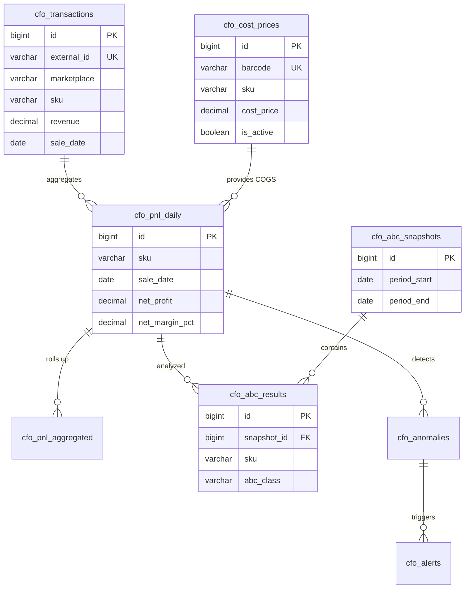

# ADOLF CFO — Раздел 5: Database

**Проект:** Финансовый учёт и управленческая аналитика  
**Модуль:** CFO  
**Версия:** 1.0  
**Дата:** Январь 2026

---

## 5.1 Назначение

Раздел описывает схему базы данных модуля CFO: таблицы, индексы, связи и политики хранения.

### Таблицы модуля

| Таблица | Описание |
|---------|----------|
| `cfo_transactions` | Финансовые транзакции с маркетплейсов |
| `cfo_cost_prices` | Справочник себестоимости |
| `cfo_pnl_daily` | Ежедневный P&L по SKU |
| `cfo_pnl_aggregated` | Агрегированный P&L по периодам |
| `cfo_abc_results` | Результаты ABC-анализа |
| `cfo_abc_snapshots` | Снимки ABC-анализа |
| `cfo_anomalies` | Обнаруженные аномалии |
| `cfo_alerts` | История алертов |
| `cfo_reports` | Сохранённые отчёты |
| `cfo_settings` | Настройки модуля |

---

## 5.2 ER-диаграмма



---

## 5.3 Таблица cfo_transactions

### 5.3.1 Описание

Хранение всех финансовых транзакций с маркетплейсов. Основной источник данных для расчёта P&L.

### 5.3.2 DDL

```sql
CREATE TABLE cfo_transactions (
    id BIGSERIAL PRIMARY KEY,
    
    -- Идентификация
    external_id VARCHAR(255) NOT NULL,
    marketplace VARCHAR(20) NOT NULL,
    source VARCHAR(20) NOT NULL DEFAULT 'api',
    
    -- Товар
    sku VARCHAR(100) NOT NULL,
    barcode VARCHAR(50),
    nm_id BIGINT,
    product_name VARCHAR(500),
    category VARCHAR(200),
    brand_name VARCHAR(200),
    size VARCHAR(50),
    
    -- Финансы
    revenue DECIMAL(15,2) NOT NULL DEFAULT 0,
    commission DECIMAL(15,2) NOT NULL DEFAULT 0,
    logistics DECIMAL(15,2) NOT NULL DEFAULT 0,
    return_logistics DECIMAL(15,2) NOT NULL DEFAULT 0,
    storage DECIMAL(15,2) NOT NULL DEFAULT 0,
    advertising DECIMAL(15,2) NOT NULL DEFAULT 0,
    payout DECIMAL(15,2) NOT NULL DEFAULT 0,
    
    -- Мета
    sale_date DATE NOT NULL,
    operation_type VARCHAR(100),
    quantity INTEGER NOT NULL DEFAULT 1,
    source_file VARCHAR(500),
    
    -- Служебные
    created_at TIMESTAMP WITH TIME ZONE DEFAULT CURRENT_TIMESTAMP,
    
    -- Constraints
    CONSTRAINT uq_cfo_transactions_external UNIQUE (external_id, marketplace),
    CONSTRAINT chk_cfo_transactions_marketplace CHECK (marketplace IN ('wb', 'ozon', 'ym')),
    CONSTRAINT chk_cfo_transactions_source CHECK (source IN ('api', 'excel'))
);

-- Индексы
CREATE INDEX idx_cfo_transactions_sku ON cfo_transactions(sku);
CREATE INDEX idx_cfo_transactions_sale_date ON cfo_transactions(sale_date);
CREATE INDEX idx_cfo_transactions_marketplace ON cfo_transactions(marketplace);
CREATE INDEX idx_cfo_transactions_barcode ON cfo_transactions(barcode) WHERE barcode IS NOT NULL;
CREATE INDEX idx_cfo_transactions_category ON cfo_transactions(category) WHERE category IS NOT NULL;
CREATE INDEX idx_cfo_transactions_date_mp ON cfo_transactions(sale_date, marketplace);

-- Комментарии
COMMENT ON TABLE cfo_transactions IS 'Финансовые транзакции с маркетплейсов';
COMMENT ON COLUMN cfo_transactions.external_id IS 'Уникальный ID из источника (srid для WB, operation_id для Ozon)';
COMMENT ON COLUMN cfo_transactions.marketplace IS 'Маркетплейс: wb, ozon, ym';
COMMENT ON COLUMN cfo_transactions.source IS 'Источник данных: api или excel';
COMMENT ON COLUMN cfo_transactions.revenue IS 'Выручка (цена продажи с учётом скидок)';
COMMENT ON COLUMN cfo_transactions.payout IS 'Сумма к выплате продавцу';
```

### 5.3.3 Примеры данных

| id | external_id | marketplace | sku | revenue | commission | sale_date |
|----|-------------|-------------|-----|--------:|------------|-----------|
| 1 | abc123 | wb | OM-12345 | 2975.00 | 461.13 | 2026-01-15 |
| 2 | def456 | ozon | OM-12345 | 2500.00 | 375.00 | 2026-01-15 |
| 3 | ghi789 | wb | OK-54321 | 1200.00 | 180.00 | 2026-01-15 |

---

## 5.4 Таблица cfo_cost_prices

### 5.4.1 Описание

Справочник себестоимости товаров. Загружается из 1С еженедельно.

### 5.4.2 DDL

```sql
CREATE TABLE cfo_cost_prices (
    id BIGSERIAL PRIMARY KEY,
    
    -- Идентификация товара
    barcode VARCHAR(50),
    sku VARCHAR(100),
    product_name VARCHAR(500),
    
    -- Себестоимость
    cost_price DECIMAL(15,2) NOT NULL,
    currency VARCHAR(3) NOT NULL DEFAULT 'RUB',
    
    -- Период действия
    valid_from DATE NOT NULL,
    valid_to DATE,
    is_active BOOLEAN NOT NULL DEFAULT TRUE,
    
    -- Служебные
    created_at TIMESTAMP WITH TIME ZONE DEFAULT CURRENT_TIMESTAMP,
    updated_at TIMESTAMP WITH TIME ZONE DEFAULT CURRENT_TIMESTAMP,
    
    -- Constraints
    CONSTRAINT chk_cfo_cost_prices_identifier CHECK (barcode IS NOT NULL OR sku IS NOT NULL),
    CONSTRAINT chk_cfo_cost_prices_positive CHECK (cost_price > 0)
);

-- Индексы
CREATE UNIQUE INDEX idx_cfo_cost_prices_barcode_active 
    ON cfo_cost_prices(barcode) WHERE is_active = TRUE AND barcode IS NOT NULL;
CREATE UNIQUE INDEX idx_cfo_cost_prices_sku_active 
    ON cfo_cost_prices(sku) WHERE is_active = TRUE AND sku IS NOT NULL;
CREATE INDEX idx_cfo_cost_prices_valid_from ON cfo_cost_prices(valid_from);

-- Триггер обновления updated_at
CREATE OR REPLACE FUNCTION update_cfo_cost_prices_timestamp()
RETURNS TRIGGER AS $$
BEGIN
    NEW.updated_at = CURRENT_TIMESTAMP;
    RETURN NEW;
END;
$$ LANGUAGE plpgsql;

CREATE TRIGGER trg_cfo_cost_prices_updated
    BEFORE UPDATE ON cfo_cost_prices
    FOR EACH ROW
    EXECUTE FUNCTION update_cfo_cost_prices_timestamp();

-- Комментарии
COMMENT ON TABLE cfo_cost_prices IS 'Справочник себестоимости из 1С';
COMMENT ON COLUMN cfo_cost_prices.valid_from IS 'Дата начала действия цены';
COMMENT ON COLUMN cfo_cost_prices.valid_to IS 'Дата окончания действия (NULL = бессрочно)';
```

### 5.4.3 Примеры данных

| id | barcode | sku | product_name | cost_price | valid_from | is_active |
|----|---------|-----|--------------|------------|------------|-----------|
| 1 | 2000000000001 | OM-12345 | Платье летнее | 1200.00 | 2026-01-01 | TRUE |
| 2 | 2000000000002 | OM-12346 | Блузка офисная | 800.00 | 2026-01-01 | TRUE |
| 3 | 2000000000003 | OK-54321 | Футболка детская | 450.00 | 2026-01-01 | TRUE |

---

## 5.5 Таблица cfo_pnl_daily

### 5.5.1 Описание

Ежедневный P&L по каждому SKU. Рассчитывается автоматически из транзакций.

### 5.5.2 DDL

```sql
CREATE TABLE cfo_pnl_daily (
    id BIGSERIAL PRIMARY KEY,
    
    -- Идентификация
    sku VARCHAR(100) NOT NULL,
    marketplace VARCHAR(20) NOT NULL,
    brand_id VARCHAR(50),
    category VARCHAR(200),
    sale_date DATE NOT NULL,
    
    -- Количество
    quantity_sold INTEGER NOT NULL DEFAULT 0,
    quantity_returned INTEGER NOT NULL DEFAULT 0,
    net_quantity INTEGER GENERATED ALWAYS AS (quantity_sold - quantity_returned) STORED,
    
    -- Выручка
    gross_revenue DECIMAL(15,2) NOT NULL DEFAULT 0,
    discounts DECIMAL(15,2) NOT NULL DEFAULT 0,
    returns_amount DECIMAL(15,2) NOT NULL DEFAULT 0,
    net_revenue DECIMAL(15,2) NOT NULL DEFAULT 0,
    
    -- Себестоимость
    cogs DECIMAL(15,2) NOT NULL DEFAULT 0,
    cogs_mapped BOOLEAN NOT NULL DEFAULT FALSE,
    
    -- Расходы маркетплейса
    commission DECIMAL(15,2) NOT NULL DEFAULT 0,
    logistics DECIMAL(15,2) NOT NULL DEFAULT 0,
    return_logistics DECIMAL(15,2) NOT NULL DEFAULT 0,
    storage DECIMAL(15,2) NOT NULL DEFAULT 0,
    advertising DECIMAL(15,2) NOT NULL DEFAULT 0,
    
    -- Итоги
    total_expenses DECIMAL(15,2) GENERATED ALWAYS AS (
        cogs + commission + logistics + return_logistics + storage + advertising
    ) STORED,
    
    gross_profit DECIMAL(15,2) GENERATED ALWAYS AS (net_revenue - cogs) STORED,
    gross_margin_pct DECIMAL(8,2),
    
    net_profit DECIMAL(15,2) GENERATED ALWAYS AS (
        net_revenue - cogs - commission - logistics - return_logistics - storage - advertising
    ) STORED,
    net_margin_pct DECIMAL(8,2),
    
    -- Служебные
    calculated_at TIMESTAMP WITH TIME ZONE DEFAULT CURRENT_TIMESTAMP,
    
    -- Constraints
    CONSTRAINT uq_cfo_pnl_daily UNIQUE (sku, marketplace, sale_date),
    CONSTRAINT chk_cfo_pnl_daily_marketplace CHECK (marketplace IN ('wb', 'ozon', 'ym'))
);

-- Индексы
CREATE INDEX idx_cfo_pnl_daily_date ON cfo_pnl_daily(sale_date);
CREATE INDEX idx_cfo_pnl_daily_sku ON cfo_pnl_daily(sku);
CREATE INDEX idx_cfo_pnl_daily_marketplace ON cfo_pnl_daily(marketplace);
CREATE INDEX idx_cfo_pnl_daily_brand ON cfo_pnl_daily(brand_id) WHERE brand_id IS NOT NULL;
CREATE INDEX idx_cfo_pnl_daily_category ON cfo_pnl_daily(category) WHERE category IS NOT NULL;
CREATE INDEX idx_cfo_pnl_daily_profit ON cfo_pnl_daily(net_profit);
CREATE INDEX idx_cfo_pnl_daily_date_mp ON cfo_pnl_daily(sale_date, marketplace);

-- Комментарии
COMMENT ON TABLE cfo_pnl_daily IS 'Ежедневный P&L по SKU';
COMMENT ON COLUMN cfo_pnl_daily.cogs_mapped IS 'TRUE если себестоимость найдена в справочнике';
COMMENT ON COLUMN cfo_pnl_daily.net_profit IS 'Чистая прибыль после всех расходов';
```

### 5.5.3 Примеры данных

| sku | marketplace | sale_date | net_revenue | cogs | net_profit | net_margin_pct |
|-----|-------------|-----------|------------:|-----:|-----------:|---------------:|
| OM-12345 | wb | 2026-01-15 | 2975.00 | 1200.00 | 1063.87 | 35.76 |
| OM-12345 | ozon | 2026-01-15 | 2500.00 | 1200.00 | 775.00 | 31.00 |
| OK-54321 | wb | 2026-01-15 | 1200.00 | 450.00 | 420.00 | 35.00 |

---

## 5.6 Таблица cfo_pnl_aggregated

### 5.6.1 Описание

Агрегированный P&L по различным срезам и периодам.

### 5.6.2 DDL

```sql
CREATE TABLE cfo_pnl_aggregated (
    id BIGSERIAL PRIMARY KEY,
    
    -- Тип агрегации
    aggregation_type VARCHAR(50) NOT NULL,
    aggregation_key VARCHAR(200) NOT NULL,
    
    -- Период
    period_start DATE NOT NULL,
    period_end DATE NOT NULL,
    period_type VARCHAR(20) NOT NULL,
    
    -- Финансовые показатели
    net_revenue DECIMAL(15,2) NOT NULL DEFAULT 0,
    cogs DECIMAL(15,2) NOT NULL DEFAULT 0,
    commission DECIMAL(15,2) NOT NULL DEFAULT 0,
    logistics DECIMAL(15,2) NOT NULL DEFAULT 0,
    return_logistics DECIMAL(15,2) NOT NULL DEFAULT 0,
    storage DECIMAL(15,2) NOT NULL DEFAULT 0,
    advertising DECIMAL(15,2) NOT NULL DEFAULT 0,
    mp_expenses DECIMAL(15,2) GENERATED ALWAYS AS (
        commission + logistics + return_logistics + storage + advertising
    ) STORED,
    
    total_expenses DECIMAL(15,2) GENERATED ALWAYS AS (
        cogs + commission + logistics + return_logistics + storage + advertising
    ) STORED,
    
    net_profit DECIMAL(15,2) GENERATED ALWAYS AS (
        net_revenue - cogs - commission - logistics - return_logistics - storage - advertising
    ) STORED,
    
    net_margin_pct DECIMAL(8,2),
    
    -- Количественные
    sku_count INTEGER NOT NULL DEFAULT 0,
    quantity_sold INTEGER NOT NULL DEFAULT 0,
    
    -- Служебные
    calculated_at TIMESTAMP WITH TIME ZONE DEFAULT CURRENT_TIMESTAMP,
    
    -- Constraints
    CONSTRAINT uq_cfo_pnl_aggregated UNIQUE (aggregation_type, aggregation_key, period_start, period_end),
    CONSTRAINT chk_cfo_pnl_aggregated_type CHECK (
        aggregation_type IN ('category', 'brand', 'marketplace', 'total')
    ),
    CONSTRAINT chk_cfo_pnl_aggregated_period CHECK (
        period_type IN ('day', 'week', 'month', 'quarter', 'year')
    )
);

-- Индексы
CREATE INDEX idx_cfo_pnl_aggregated_type ON cfo_pnl_aggregated(aggregation_type);
CREATE INDEX idx_cfo_pnl_aggregated_period ON cfo_pnl_aggregated(period_start, period_end);
CREATE INDEX idx_cfo_pnl_aggregated_key ON cfo_pnl_aggregated(aggregation_key);

-- Комментарии
COMMENT ON TABLE cfo_pnl_aggregated IS 'Агрегированный P&L по срезам';
COMMENT ON COLUMN cfo_pnl_aggregated.aggregation_type IS 'Тип: category, brand, marketplace, total';
COMMENT ON COLUMN cfo_pnl_aggregated.aggregation_key IS 'Ключ группировки (название категории, бренда и т.д.)';
```

---

## 5.7 Таблица cfo_abc_snapshots

### 5.7.1 Описание

Снимки ABC-анализа. Хранит метаданные каждого запуска анализа.

### 5.7.2 DDL

```sql
CREATE TABLE cfo_abc_snapshots (
    id BIGSERIAL PRIMARY KEY,
    
    -- Период анализа
    period_start DATE NOT NULL,
    period_end DATE NOT NULL,
    
    -- Фильтры
    marketplace VARCHAR(20),
    brand_id VARCHAR(50),
    
    -- Сводка
    total_skus INTEGER NOT NULL DEFAULT 0,
    total_profit DECIMAL(15,2) NOT NULL DEFAULT 0,
    
    class_a_count INTEGER NOT NULL DEFAULT 0,
    class_a_profit DECIMAL(15,2) NOT NULL DEFAULT 0,
    class_a_pct DECIMAL(8,2) NOT NULL DEFAULT 0,
    
    class_b_count INTEGER NOT NULL DEFAULT 0,
    class_b_profit DECIMAL(15,2) NOT NULL DEFAULT 0,
    class_b_pct DECIMAL(8,2) NOT NULL DEFAULT 0,
    
    class_c_count INTEGER NOT NULL DEFAULT 0,
    class_c_profit DECIMAL(15,2) NOT NULL DEFAULT 0,
    class_c_pct DECIMAL(8,2) NOT NULL DEFAULT 0,
    
    class_d_count INTEGER NOT NULL DEFAULT 0,
    class_d_loss DECIMAL(15,2) NOT NULL DEFAULT 0,
    
    -- Пороги
    threshold_a DECIMAL(5,2) NOT NULL DEFAULT 80.00,
    threshold_b DECIMAL(5,2) NOT NULL DEFAULT 95.00,
    
    -- Служебные
    calculated_at TIMESTAMP WITH TIME ZONE DEFAULT CURRENT_TIMESTAMP,
    
    -- Constraints
    CONSTRAINT chk_cfo_abc_snapshots_thresholds CHECK (threshold_a < threshold_b)
);

-- Индексы
CREATE INDEX idx_cfo_abc_snapshots_period ON cfo_abc_snapshots(period_start, period_end);
CREATE INDEX idx_cfo_abc_snapshots_calculated ON cfo_abc_snapshots(calculated_at);

-- Комментарии
COMMENT ON TABLE cfo_abc_snapshots IS 'Снимки ABC-анализа';
```

---

## 5.8 Таблица cfo_abc_results

### 5.8.1 Описание

Детальные результаты ABC-анализа для каждого SKU.

### 5.8.2 DDL

```sql
CREATE TABLE cfo_abc_results (
    id BIGSERIAL PRIMARY KEY,
    
    -- Связь со снимком
    snapshot_id BIGINT NOT NULL REFERENCES cfo_abc_snapshots(id) ON DELETE CASCADE,
    
    -- SKU
    sku VARCHAR(100) NOT NULL,
    marketplace VARCHAR(20) NOT NULL,
    
    -- Классификация
    abc_class CHAR(1) NOT NULL,
    rank INTEGER NOT NULL,
    
    -- Показатели
    net_profit DECIMAL(15,2) NOT NULL,
    net_margin_pct DECIMAL(8,2) NOT NULL,
    cumulative_profit DECIMAL(15,2) NOT NULL,
    cumulative_pct DECIMAL(8,2) NOT NULL,
    
    -- Constraints
    CONSTRAINT chk_cfo_abc_results_class CHECK (abc_class IN ('A', 'B', 'C', 'D'))
);

-- Индексы
CREATE INDEX idx_cfo_abc_results_snapshot ON cfo_abc_results(snapshot_id);
CREATE INDEX idx_cfo_abc_results_sku ON cfo_abc_results(sku);
CREATE INDEX idx_cfo_abc_results_class ON cfo_abc_results(abc_class);
CREATE INDEX idx_cfo_abc_results_rank ON cfo_abc_results(rank);

-- Комментарии
COMMENT ON TABLE cfo_abc_results IS 'Результаты ABC-анализа по SKU';
COMMENT ON COLUMN cfo_abc_results.rank IS 'Ранг SKU по прибыли (1 = самый прибыльный)';
COMMENT ON COLUMN cfo_abc_results.cumulative_pct IS 'Накопительная доля прибыли в %';
```

---

## 5.9 Таблица cfo_anomalies

### 5.9.1 Описание

Обнаруженные аномалии в финансовых данных.

### 5.9.2 DDL

```sql
CREATE TABLE cfo_anomalies (
    id BIGSERIAL PRIMARY KEY,
    
    -- Идентификация
    anomaly_type VARCHAR(50) NOT NULL,
    sku VARCHAR(100) NOT NULL,
    marketplace VARCHAR(20) NOT NULL,
    
    -- Значения
    current_value DECIMAL(15,2) NOT NULL,
    expected_value DECIMAL(15,2) NOT NULL,
    deviation_pct DECIMAL(8,2) NOT NULL,
    
    -- Метаданные
    severity VARCHAR(20) NOT NULL DEFAULT 'warning',
    description TEXT,
    
    -- Период
    detection_date DATE NOT NULL,
    
    -- Статус
    status VARCHAR(20) NOT NULL DEFAULT 'new',
    resolved_at TIMESTAMP WITH TIME ZONE,
    resolved_by INTEGER REFERENCES users(id),
    resolution_note TEXT,
    
    -- Служебные
    detected_at TIMESTAMP WITH TIME ZONE DEFAULT CURRENT_TIMESTAMP,
    
    -- Constraints
    CONSTRAINT chk_cfo_anomalies_type CHECK (
        anomaly_type IN ('revenue_spike', 'revenue_drop', 'expense_spike', 'margin_drop', 'new_loss_maker')
    ),
    CONSTRAINT chk_cfo_anomalies_severity CHECK (severity IN ('info', 'warning', 'critical')),
    CONSTRAINT chk_cfo_anomalies_status CHECK (status IN ('new', 'acknowledged', 'resolved', 'ignored'))
);

-- Индексы
CREATE INDEX idx_cfo_anomalies_date ON cfo_anomalies(detection_date);
CREATE INDEX idx_cfo_anomalies_sku ON cfo_anomalies(sku);
CREATE INDEX idx_cfo_anomalies_type ON cfo_anomalies(anomaly_type);
CREATE INDEX idx_cfo_anomalies_status ON cfo_anomalies(status);
CREATE INDEX idx_cfo_anomalies_severity ON cfo_anomalies(severity);

-- Комментарии
COMMENT ON TABLE cfo_anomalies IS 'Обнаруженные аномалии';
COMMENT ON COLUMN cfo_anomalies.anomaly_type IS 'Тип аномалии';
COMMENT ON COLUMN cfo_anomalies.deviation_pct IS 'Отклонение от ожидаемого значения в %';
```

---

## 5.10 Таблица cfo_alerts

### 5.10.1 Описание

История алертов, отправленных пользователям.

### 5.10.2 DDL

```sql
CREATE TABLE cfo_alerts (
    id BIGSERIAL PRIMARY KEY,
    
    -- Тип и уровень
    event_type VARCHAR(100) NOT NULL,
    level VARCHAR(20) NOT NULL DEFAULT 'info',
    
    -- Содержимое
    title VARCHAR(500) NOT NULL,
    message TEXT,
    data JSONB,
    
    -- Получатели
    recipient_ids INTEGER[] NOT NULL,
    
    -- Связь с аномалией (опционально)
    anomaly_id BIGINT REFERENCES cfo_anomalies(id),
    
    -- Статус доставки
    sent_at TIMESTAMP WITH TIME ZONE DEFAULT CURRENT_TIMESTAMP,
    delivered_count INTEGER NOT NULL DEFAULT 0,
    read_count INTEGER NOT NULL DEFAULT 0,
    
    -- Constraints
    CONSTRAINT chk_cfo_alerts_level CHECK (level IN ('info', 'warning', 'critical'))
);

-- Индексы
CREATE INDEX idx_cfo_alerts_sent ON cfo_alerts(sent_at);
CREATE INDEX idx_cfo_alerts_type ON cfo_alerts(event_type);
CREATE INDEX idx_cfo_alerts_level ON cfo_alerts(level);
CREATE INDEX idx_cfo_alerts_anomaly ON cfo_alerts(anomaly_id) WHERE anomaly_id IS NOT NULL;

-- Комментарии
COMMENT ON TABLE cfo_alerts IS 'История алертов';
COMMENT ON COLUMN cfo_alerts.recipient_ids IS 'Массив ID получателей';
COMMENT ON COLUMN cfo_alerts.data IS 'Дополнительные данные в JSON';
```

---

## 5.11 Таблица cfo_reports

### 5.11.1 Описание

Сохранённые отчёты и экспорты.

### 5.11.2 DDL

```sql
CREATE TABLE cfo_reports (
    id BIGSERIAL PRIMARY KEY,
    
    -- Тип отчёта
    report_type VARCHAR(50) NOT NULL,
    report_name VARCHAR(500),
    
    -- Параметры
    period_start DATE NOT NULL,
    period_end DATE NOT NULL,
    filters JSONB,
    
    -- Файл
    file_path VARCHAR(1000),
    file_format VARCHAR(20),
    file_size_bytes BIGINT,
    
    -- Содержимое (для кастомных отчётов)
    content TEXT,
    
    -- Создатель
    created_by INTEGER NOT NULL REFERENCES users(id),
    
    -- Служебные
    created_at TIMESTAMP WITH TIME ZONE DEFAULT CURRENT_TIMESTAMP,
    expires_at TIMESTAMP WITH TIME ZONE,
    
    -- Constraints
    CONSTRAINT chk_cfo_reports_type CHECK (
        report_type IN ('pnl_sku', 'pnl_category', 'pnl_brand', 'pnl_marketplace', 
                        'pnl_consolidated', 'abc', 'loss_makers', 'custom', 'ai_insights')
    ),
    CONSTRAINT chk_cfo_reports_format CHECK (file_format IN ('excel', 'pdf', 'csv', 'json'))
);

-- Индексы
CREATE INDEX idx_cfo_reports_type ON cfo_reports(report_type);
CREATE INDEX idx_cfo_reports_created_by ON cfo_reports(created_by);
CREATE INDEX idx_cfo_reports_created_at ON cfo_reports(created_at);
CREATE INDEX idx_cfo_reports_expires ON cfo_reports(expires_at) WHERE expires_at IS NOT NULL;

-- Комментарии
COMMENT ON TABLE cfo_reports IS 'Сохранённые отчёты';
COMMENT ON COLUMN cfo_reports.filters IS 'Фильтры отчёта в JSON';
COMMENT ON COLUMN cfo_reports.expires_at IS 'Срок хранения файла';
```

---

## 5.12 Таблица cfo_settings

### 5.12.1 Описание

Настройки модуля CFO.

### 5.12.2 DDL

```sql
CREATE TABLE cfo_settings (
    id SERIAL PRIMARY KEY,
    
    -- Ключ-значение
    key VARCHAR(100) NOT NULL UNIQUE,
    value JSONB NOT NULL,
    value_type VARCHAR(20) NOT NULL DEFAULT 'string',
    
    -- Описание
    description TEXT,
    
    -- Служебные
    updated_at TIMESTAMP WITH TIME ZONE DEFAULT CURRENT_TIMESTAMP,
    updated_by INTEGER REFERENCES users(id)
);

-- Начальные данные
INSERT INTO cfo_settings (key, value, value_type, description) VALUES
    ('margin_threshold', '10.0', 'float', 'Порог маржи для алерта (%)'),
    ('anomaly_threshold', '20.0', 'float', 'Порог отклонения для аномалии (%)'),
    ('abc_thresholds', '{"a": 80, "b": 95}', 'json', 'Пороги ABC-классов'),
    ('import_schedule', '{"time": "06:00", "timezone": "Europe/Moscow"}', 'json', 'Расписание импорта'),
    ('retention_days', '365', 'integer', 'Срок хранения детальных данных (дней)'),
    ('report_expiry_days', '30', 'integer', 'Срок хранения экспортированных отчётов (дней)');

-- Комментарии
COMMENT ON TABLE cfo_settings IS 'Настройки модуля CFO';
```

---

## 5.13 Представления (Views)

### 5.13.1 View: vw_cfo_pnl_summary

```sql
CREATE OR REPLACE VIEW vw_cfo_pnl_summary AS
SELECT 
    sale_date,
    marketplace,
    brand_id,
    COUNT(DISTINCT sku) as sku_count,
    SUM(quantity_sold) as total_quantity,
    SUM(net_revenue) as total_revenue,
    SUM(cogs) as total_cogs,
    SUM(commission + logistics + return_logistics + storage + advertising) as total_mp_expenses,
    SUM(net_profit) as total_profit,
    ROUND(AVG(net_margin_pct), 2) as avg_margin_pct
FROM cfo_pnl_daily
GROUP BY sale_date, marketplace, brand_id;

COMMENT ON VIEW vw_cfo_pnl_summary IS 'Сводка P&L по дням';
```

### 5.13.2 View: vw_cfo_loss_makers

```sql
CREATE OR REPLACE VIEW vw_cfo_loss_makers AS
SELECT 
    sku,
    marketplace,
    brand_id,
    category,
    sale_date,
    net_revenue,
    total_expenses,
    net_profit,
    net_margin_pct,
    CASE 
        WHEN logistics / NULLIF(net_revenue, 0) > 0.15 THEN 'Высокая логистика'
        WHEN net_margin_pct > -10 THEN 'Небольшой убыток'
        ELSE 'Значительный убыток'
    END as issue_type
FROM cfo_pnl_daily
WHERE net_profit < 0
ORDER BY net_profit ASC;

COMMENT ON VIEW vw_cfo_loss_makers IS 'Убыточные SKU';
```

### 5.13.3 View: vw_cfo_unmapped_costs

```sql
CREATE OR REPLACE VIEW vw_cfo_unmapped_costs AS
SELECT 
    sku,
    marketplace,
    COUNT(*) as transaction_count,
    SUM(net_revenue) as total_revenue,
    MIN(sale_date) as first_sale,
    MAX(sale_date) as last_sale
FROM cfo_pnl_daily
WHERE cogs_mapped = FALSE
GROUP BY sku, marketplace
ORDER BY total_revenue DESC;

COMMENT ON VIEW vw_cfo_unmapped_costs IS 'SKU без себестоимости';
```

---

## 5.14 Политики хранения

### 5.14.1 Retention Policy

| Таблица | Срок хранения | Действие |
|---------|---------------|----------|
| `cfo_transactions` | 12 месяцев | Архивация → удаление |
| `cfo_pnl_daily` | 12 месяцев | Архивация → удаление |
| `cfo_pnl_aggregated` | Бессрочно | — |
| `cfo_abc_snapshots` | 24 месяца | Удаление |
| `cfo_abc_results` | 24 месяца | CASCADE от snapshots |
| `cfo_anomalies` | 12 месяцев | Удаление resolved |
| `cfo_alerts` | 6 месяцев | Удаление |
| `cfo_reports` | 30 дней (файлы) | Удаление файлов |

### 5.14.2 Процедура очистки

```sql
CREATE OR REPLACE PROCEDURE cfo_cleanup_old_data()
LANGUAGE plpgsql
AS $$
DECLARE
    v_retention_days INTEGER;
    v_deleted_count INTEGER;
BEGIN
    -- Получение настройки retention
    SELECT (value::text)::integer INTO v_retention_days
    FROM cfo_settings WHERE key = 'retention_days';
    
    v_retention_days := COALESCE(v_retention_days, 365);
    
    -- Удаление старых транзакций
    DELETE FROM cfo_transactions
    WHERE sale_date < CURRENT_DATE - v_retention_days;
    GET DIAGNOSTICS v_deleted_count = ROW_COUNT;
    RAISE NOTICE 'Deleted % old transactions', v_deleted_count;
    
    -- Удаление старых P&L
    DELETE FROM cfo_pnl_daily
    WHERE sale_date < CURRENT_DATE - v_retention_days;
    GET DIAGNOSTICS v_deleted_count = ROW_COUNT;
    RAISE NOTICE 'Deleted % old PnL records', v_deleted_count;
    
    -- Удаление старых ABC-снимков
    DELETE FROM cfo_abc_snapshots
    WHERE calculated_at < CURRENT_TIMESTAMP - INTERVAL '24 months';
    
    -- Удаление resolved аномалий
    DELETE FROM cfo_anomalies
    WHERE status = 'resolved' 
      AND resolved_at < CURRENT_TIMESTAMP - INTERVAL '12 months';
    
    -- Удаление старых алертов
    DELETE FROM cfo_alerts
    WHERE sent_at < CURRENT_TIMESTAMP - INTERVAL '6 months';
    
    -- Удаление просроченных отчётов
    DELETE FROM cfo_reports
    WHERE expires_at IS NOT NULL AND expires_at < CURRENT_TIMESTAMP;
    
END;
$$;

-- Комментарий
COMMENT ON PROCEDURE cfo_cleanup_old_data IS 'Очистка устаревших данных CFO';
```

---

## 5.15 Миграции

### 5.15.1 Миграция: создание схемы

```sql
-- Migration: 001_create_cfo_schema.sql
-- Version: 1.0
-- Date: 2026-01

BEGIN;

-- Создание всех таблиц CFO
-- (DDL из разделов 5.3 - 5.12)

-- Создание представлений
-- (Views из раздела 5.13)

-- Создание процедур
-- (Procedures из раздела 5.14)

COMMIT;
```

---

**Документ подготовлен:** Январь 2026  
**Версия:** 1.0  
**Статус:** Черновик
