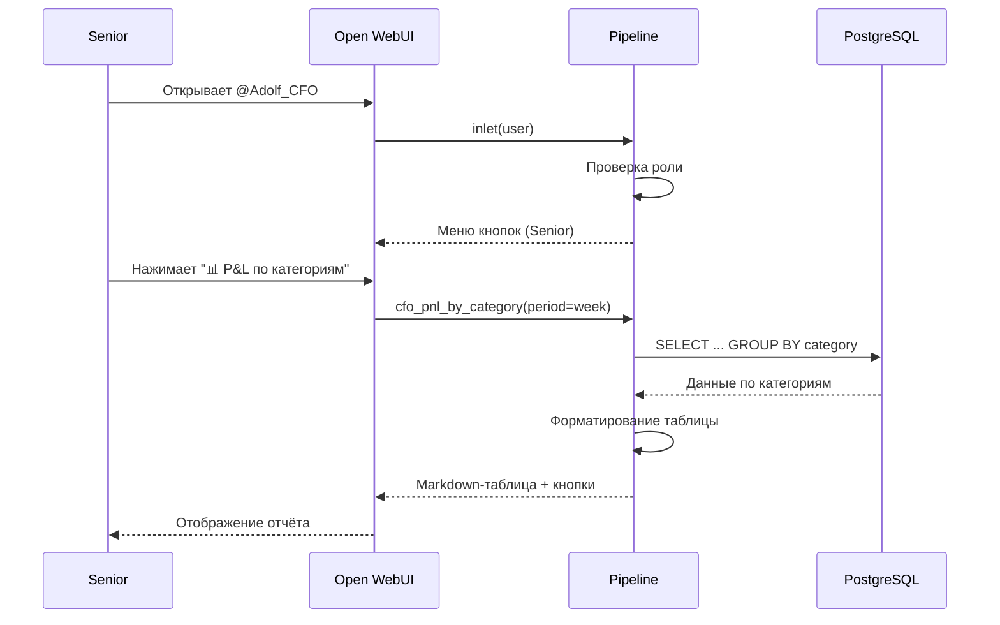
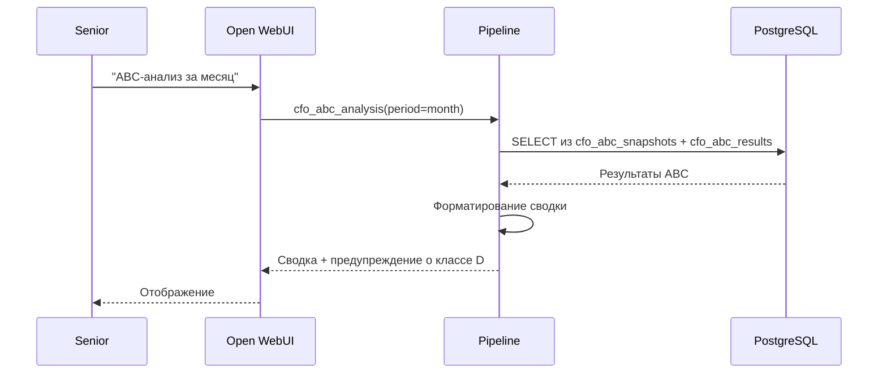
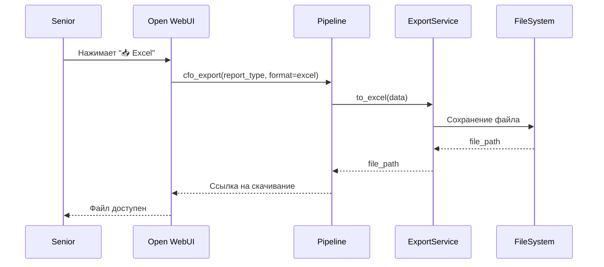
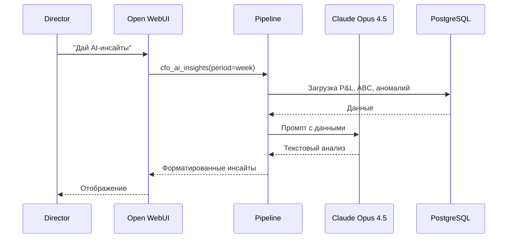

**Проект:** Финансовый учёт и управленческая аналитика  
**Модуль:** CFO  
**Версия:** 1.0  
**Дата:** Январь 2026

---

## 6.1 Назначение

Раздел описывает пользовательские сценарии работы с модулем CFO для каждой роли.

### Роли и доступ

| Роль | Доступ | Основные задачи |
|------|--------|-----------------|
| Senior | Ограниченный | P&L по категориям/брендам/МП, ABC-анализ |
| Director | Полный | Все отчёты + P&L по SKU + кастомные отчёты |
| Administrator | Полный + настройки | Всё + настройка порогов и расписания |

---

## 6.2 Сценарии Senior Manager

### 6.2.1 Просмотр P&L по категориям

**Цель:** Оценить маржинальность товарных категорий за неделю.

**Предусловия:**
- Пользователь авторизован с ролью Senior
- Данные за неделю импортированы

**Шаги:**



**Пример диалога:**

```
Senior: Покажи P&L по категориям

@Adolf_CFO: **P&L по категориям за 13.01.2026 — 19.01.2026**

| Категория | Выручка | Себест. | Расходы МП | Прибыль | Маржа |
|-----------|--------:|--------:|-----------:|--------:|------:|
| Платья | 2 450 000 ₽ | 980 000 ₽ | 367 500 ₽ | 1 102 500 ₽ | 45.0% |
| Блузки | 1 230 000 ₽ | 492 000 ₽ | 184 500 ₽ | 553 500 ₽ | 45.0% |
| Брюки | 890 000 ₽ | 356 000 ₽ | 133 500 ₽ | 400 500 ₽ | 45.0% |

**Итого:** 4 570 000 ₽ выручки, 2 056 500 ₽ прибыли

[🏷️ По брендам] [🛒 По МП] [🔤 ABC-анализ] [📥 Excel]
```

**Ожидаемый результат:**
- Таблица P&L по категориям
- Итоговая сводка
- Кнопки для дальнейших действий

---

### 6.2.2 ABC-анализ товарного портфеля

**Цель:** Определить ключевые и убыточные SKU.

**Шаги:**



**Пример диалога:**

```
Senior: ABC-анализ за месяц

@Adolf_CFO: **ABC-анализ за 20.12.2025 — 19.01.2026**

| Класс | SKU | Прибыль | Доля |
|:-----:|----:|--------:|-----:|
| **A** | 47 | 7 200 000 ₽ | 80.0% |
| **B** | 89 | 1 350 000 ₽ | 15.0% |
| **C** | 156 | 450 000 ₽ | 5.0% |
| **D** | 23 | −180 000 ₽ | убыток |

Всего: 315 SKU

⚠️ 23 убыточных SKU требуют внимания

[🔴 Убыточные SKU] [📈 Топ класса A] [🤖 AI-инсайты]
```

---

### 6.2.3 Просмотр убыточных SKU

**Цель:** Получить список убыточных позиций с рекомендациями.

**Пример диалога:**

```
Senior: Покажи убыточные SKU

@Adolf_CFO: **Убыточные SKU (класс D) за 13.01.2026 — 19.01.2026**

| SKU | МП | Выручка | Убыток | Маржа | Проблема |
|-----|:--:|--------:|-------:|------:|----------|
| OM-45678 | WB | 45 000 ₽ | 12 500 ₽ | −27.8% | Высокая логистика |
| OK-12345 | WB | 23 000 ₽ | 8 200 ₽ | −35.7% | Низкая цена |
| OM-78901 | Ozon | 67 000 ₽ | 5 100 ₽ | −7.6% | Высокая комиссия |

Всего: 23 SKU, общий убыток: 180 000 ₽

💡 Рекомендации:
- OM-45678: перевод на FBO или пересмотр габаритов
- OK-12345: повышение цены или вывод из ассортимента
- OM-78901: повышение цены на 10%

[🤖 Детальный анализ] [📥 Excel]
```

---

### 6.2.4 Сравнение маркетплейсов

**Цель:** Сравнить эффективность продаж на разных маркетплейсах.

**Пример диалога:**

```
Senior: Сравни P&L по маркетплейсам

@Adolf_CFO: **P&L по маркетплейсам за 13.01.2026 — 19.01.2026**

| Маркетплейс | Выручка | Комиссия | Логистика | Прибыль | Маржа |
|-------------|--------:|---------:|----------:|--------:|------:|
| Wildberries | 3 200 000 ₽ | 416 000 ₽ (13%) | 192 000 ₽ (6%) | 1 440 000 ₽ | 45.0% |
| Ozon | 1 100 000 ₽ | 187 000 ₽ (17%) | 88 000 ₽ (8%) | 385 000 ₽ | 35.0% |
| Яндекс.Маркет | 270 000 ₽ | 40 500 ₽ (15%) | 21 600 ₽ (8%) | 108 000 ₽ | 40.0% |

**Вывод:** WB показывает лучшую маржинальность (45%) за счёт 
низкой комиссии. Ozon отстаёт на 10 п.п.

[📊 По категориям] [🔤 ABC по МП] [📥 Excel]
```

---

### 6.2.5 Экспорт отчёта в Excel

**Цель:** Выгрузить отчёт для дальнейшей работы.

**Шаги:**



**Пример диалога:**

```
Senior: [нажимает 📥 Excel после отчёта P&L по категориям]

@Adolf_CFO: ✅ Отчёт сформирован

📎 **PnL_Categories_2026-01-19.xlsx** (45 KB)
[Скачать]

Содержимое:
- Лист 1: P&L по категориям
- Лист 2: Сводка
- Лист 3: Детализация по SKU
```

---

## 6.3 Сценарии Director

### 6.3.1 Детальный P&L по SKU

**Цель:** Просмотреть маржинальность каждого артикула.

**Предусловия:**
- Пользователь авторизован с ролью Director
- Функция недоступна для Senior

**Пример диалога:**

```
Director: P&L по SKU за неделю, топ-10 по прибыли

@Adolf_CFO: **P&L по SKU за 13.01.2026 — 19.01.2026** (топ-10)

| # | SKU | МП | Выручка | Себест. | Расходы | Прибыль | Маржа |
|--:|-----|:--:|--------:|--------:|--------:|--------:|------:|
| 1 | OM-11111 | WB | 320 000 ₽ | 128 000 ₽ | 48 000 ₽ | 144 000 ₽ | 45.0% |
| 2 | OM-22222 | WB | 280 000 ₽ | 112 000 ₽ | 42 000 ₽ | 126 000 ₽ | 45.0% |
| 3 | OK-33333 | WB | 195 000 ₽ | 65 000 ₽ | 29 250 ₽ | 100 750 ₽ | 51.7% |
| 4 | OM-44444 | Ozon | 180 000 ₽ | 72 000 ₽ | 36 000 ₽ | 72 000 ₽ | 40.0% |
| 5 | OM-55555 | WB | 165 000 ₽ | 66 000 ₽ | 24 750 ₽ | 74 250 ₽ | 45.0% |

Показано 5 из 315 SKU

[📊 Все SKU] [🔻 Худшие] [📅 Месяц] [📥 Excel]
```

---

### 6.3.2 AI-инсайты по финансам

**Цель:** Получить автоматический анализ и рекомендации.

**Шаги:**



**Пример диалога:**

```
Director: AI-инсайты за неделю

@Adolf_CFO: **AI-инсайты за 13.01.2026 — 19.01.2026**

## Резюме
Неделя показала стабильные результаты: выручка 4.57 млн ₽, 
чистая прибыль 2.06 млн ₽, средняя маржа 45%. 
Wildberries обеспечивает 70% выручки с лучшей маржинальностью.

## Ключевые проблемы

1. **23 убыточных SKU** (−180 000 ₽)
   - Основная причина: высокая логистика (12 SKU)
   - Вторичная: низкая цена относительно COGS (8 SKU)

2. **Падение маржи в категории "Аксессуары"**
   - Текущая: 38% (было 42%)
   - Причина: рост комиссии Ozon с 15% до 17%

## Рекомендации

1. **Срочно:** Перевести OM-45678, OM-45679 на FBO 
   (экономия ~15 000 ₽/мес на логистике)

2. **На неделе:** Повысить цены на 5 позиций класса D 
   с маржой > −10%

3. **Стратегически:** Рассмотреть перераспределение 
   аксессуаров с Ozon на WB (разница маржи 7 п.п.)

## Возможности роста

- Платья класса A (маржа 52%) — увеличить закупку
- Детская одежда на WB растёт +15% к прошлой неделе

[📊 Детальный отчёт] [🔴 Убыточные] [📥 PDF]
```

---

### 6.3.3 Кастомный отчёт

**Цель:** Сформировать отчёт по произвольному запросу.

**Предусловия:**
- Функция доступна только Director и Admin

**Пример диалога:**

```
Director: Сравни маржинальность детской и взрослой одежды 
по маркетплейсам за квартал

@Adolf_CFO: **Сравнение брендов по маркетплейсам, Q4 2025**

### Охана Маркет (взрослая одежда)

| Маркетплейс | Выручка | Прибыль | Маржа |
|-------------|--------:|--------:|------:|
| Wildberries | 24 500 000 ₽ | 11 025 000 ₽ | 45.0% |
| Ozon | 8 200 000 ₽ | 2 870 000 ₽ | 35.0% |
| Яндекс.Маркет | 2 100 000 ₽ | 840 000 ₽ | 40.0% |
| **Итого** | **34 800 000 ₽** | **14 735 000 ₽** | **42.3%** |

### Охана Кидс (детская одежда)

| Маркетплейс | Выручка | Прибыль | Маржа |
|-------------|--------:|--------:|------:|
| Wildberries | 9 800 000 ₽ | 4 900 000 ₽ | 50.0% |
| Ozon | 3 400 000 ₽ | 1 360 000 ₽ | 40.0% |
| Яндекс.Маркет | 800 000 ₽ | 360 000 ₽ | 45.0% |
| **Итого** | **14 000 000 ₽** | **6 620 000 ₽** | **47.3%** |

### Выводы

1. **Детская одежда прибыльнее** на 5 п.п. (47.3% vs 42.3%)
2. **WB лидирует** по маржинальности в обоих сегментах
3. **Ozon отстаёт** на 10 п.п. от WB по взрослой одежде
4. **Рекомендация:** увеличить долю детской одежды в ассортименте

[📥 Excel] [📄 PDF]
```

---

### 6.3.4 Консолидированный P&L

**Цель:** Получить общую картину по всему бизнесу.

**Пример диалога:**

```
Director: Консолидированный P&L за месяц

@Adolf_CFO: **Консолидированный P&L за декабрь 2025**

| Показатель | Сумма | % от выручки |
|------------|------:|-------------:|
| **Выручка** | 18 450 000 ₽ | 100.0% |
| Себестоимость | 7 380 000 ₽ | 40.0% |
| **Валовая прибыль** | 11 070 000 ₽ | 60.0% |
| | | |
| Комиссия МП | 2 398 500 ₽ | 13.0% |
| Логистика | 1 107 000 ₽ | 6.0% |
| Обратная логистика | 369 000 ₽ | 2.0% |
| Хранение | 184 500 ₽ | 1.0% |
| Реклама | 553 500 ₽ | 3.0% |
| **Расходы МП** | 4 612 500 ₽ | 25.0% |
| | | |
| **Чистая прибыль** | 6 457 500 ₽ | 35.0% |

### По брендам

| Бренд | Выручка | Прибыль | Маржа |
|-------|--------:|--------:|------:|
| Охана Маркет | 12 500 000 ₽ | 4 375 000 ₽ | 35.0% |
| Охана Кидс | 5 950 000 ₽ | 2 082 500 ₽ | 35.0% |

[📊 По категориям] [🛒 По МП] [📈 Динамика] [📥 Excel]
```

---

### 6.3.5 Анализ трендов

**Цель:** Оценить динамику показателей.

**Пример диалога:**

```
Director: Покажи тренды маржи за последние 4 недели

@Adolf_CFO: **Динамика маржинальности (4 недели)**

| Неделя | Выручка | Прибыль | Маржа | Δ |
|--------|--------:|--------:|------:|--:|
| 23.12 — 29.12 | 4 200 000 ₽ | 1 764 000 ₽ | 42.0% | — |
| 30.12 — 05.01 | 3 800 000 ₽ | 1 520 000 ₽ | 40.0% | −2.0 п.п. |
| 06.01 — 12.01 | 4 100 000 ₽ | 1 804 000 ₽ | 44.0% | +4.0 п.п. |
| 13.01 — 19.01 | 4 570 000 ₽ | 2 056 500 ₽ | 45.0% | +1.0 п.п. |

📈 **Тренд:** Положительный (+3 п.п. за месяц)

### По маркетплейсам

| МП | Было (23.12) | Стало (19.01) | Δ |
|----|-------------:|--------------:|--:|
| WB | 43.0% | 45.0% | +2.0 п.п. |
| Ozon | 33.0% | 35.0% | +2.0 п.п. |
| YM | 38.0% | 40.0% | +2.0 п.п. |

💡 Рост маржи обеспечен снижением логистических расходов 
после перевода 15 SKU на FBO.

[🤖 AI-анализ трендов] [📥 Excel]
```

---

## 6.4 Сценарии Administrator

### 6.4.1 Настройка порогов алертов

**Цель:** Изменить пороги срабатывания алертов.

**Пример диалога:**

```
Admin: Измени порог маржи для алерта на 15%

@Adolf_CFO: ✅ Настройки обновлены

| Параметр | Было | Стало |
|----------|-----:|------:|
| Порог маржи | 10% | 15% |

Теперь алерты о низкой марже будут срабатывать 
при маржинальности < 15%.

Текущие настройки:
- Порог маржи: **15%**
- Порог аномалии: **20%**
- ABC-пороги: A=80%, B=95%

[⚙️ Все настройки] [📋 История изменений]
```

---

### 6.4.2 Просмотр статуса импорта

**Цель:** Проверить успешность ежедневного импорта данных.

**Пример диалога:**

```
Admin: Статус импорта данных

@Adolf_CFO: **Статус импорта на 19.01.2026 08:30**

| Источник | Статус | Записей | Время |
|----------|:------:|--------:|------:|
| WB API | ✅ | 1 247 | 06:05 |
| Ozon API | ✅ | 523 | 06:15 |
| YM API | ✅ | 89 | 06:22 |
| WB Excel | ✅ | 342 | 06:35 |
| Ozon Excel | ⏳ | — | ожидание |
| 1С (COGS) | ✅ | 315 | Пн 07:00 |

**Итого за сегодня:** 2 201 транзакций

### Проблемы
⚠️ Ozon Excel: файл не загружен в `/data/inbox/cfo/marketplace/ozon/`

### P&L расчёт
✅ Выполнен в 07:05, обработано 2 201 транзакций

[🔄 Перезапустить импорт] [📋 Логи] [⚙️ Расписание]
```

---

### 6.4.3 Управление справочником себестоимости

**Цель:** Проверить и обновить данные о себестоимости.

**Пример диалога:**

```
Admin: Покажи SKU без себестоимости

@Adolf_CFO: **SKU без себестоимости (unmapped)**

| SKU | МП | Транзакций | Выручка | Первая продажа |
|-----|:--:|------------|--------:|----------------|
| OM-99001 | WB | 45 | 127 500 ₽ | 15.01.2026 |
| OM-99002 | WB | 23 | 64 400 ₽ | 16.01.2026 |
| OK-88001 | Ozon | 12 | 18 000 ₽ | 17.01.2026 |

Всего: 3 SKU, 80 транзакций, 209 900 ₽ выручки

⚠️ P&L для этих SKU рассчитан без себестоимости (COGS = 0)

**Рекомендация:** Добавить данные в выгрузку 1С 
или загрузить вручную.

[📤 Загрузить COGS] [📧 Уведомить бухгалтерию]
```

---

### 6.4.4 Просмотр аномалий

**Цель:** Проверить обнаруженные аномалии и принять решение.

**Пример диалога:**

```
Admin: Покажи аномалии за неделю

@Adolf_CFO: **Аномалии за 13.01.2026 — 19.01.2026**

| # | Тип | SKU | Значение | Ожидание | Δ | Статус |
|--:|-----|-----|----------|----------|--:|:------:|
| 1 | revenue_drop | OM-12345 | 15 000 ₽ | 45 000 ₽ | −67% | 🆕 |
| 2 | expense_spike | OK-54321 | 8 500 ₽ | 3 000 ₽ | +183% | 🆕 |
| 3 | new_loss_maker | OM-78901 | −2 100 ₽ | +500 ₽ | — | 🆕 |

**Детали аномалии #1:**
- SKU: OM-12345 (Платье летнее)
- Выручка упала с 45 000 ₽ до 15 000 ₽ (−67%)
- Возможные причины: out-of-stock, сезонность, конкуренция

[✅ Подтвердить] [🚫 Игнорировать] [📧 Уведомить Director]
```

---

### 6.4.5 Настройка расписания

**Цель:** Изменить время автоматического импорта.

**Пример диалога:**

```
Admin: Покажи расписание задач CFO

@Adolf_CFO: **Расписание Celery задач CFO**

| Задача | Расписание | Последний запуск | Статус |
|--------|------------|------------------|:------:|
| import_wb_finance | 06:00 MSK | 19.01 06:05 | ✅ |
| import_ozon_finance | 06:10 MSK | 19.01 06:15 | ✅ |
| import_ym_finance | 06:20 MSK | 19.01 06:22 | ✅ |
| process_excel_reports | 06:30 MSK | 19.01 06:35 | ✅ |
| calculate_daily_pnl | 07:00 MSK | 19.01 07:05 | ✅ |
| run_abc_analysis | Пн 08:00 MSK | 13.01 08:10 | ✅ |
| check_alerts | 08:00 MSK | 19.01 08:02 | ✅ |
| cleanup_old_data | 1-е число 03:00 | 01.01 03:15 | ✅ |

Хотите изменить расписание?

[⏰ Изменить время] [🔄 Запустить сейчас] [📋 Логи]
```

---

## 6.5 Сценарии уведомлений

### 6.5.1 Алерт об убыточном SKU

**Триггер:** Обнаружен SKU с отрицательной маржой.

**Получатели:** Senior, Director

**Пример уведомления:**

```
⚠️ CFO Alert: Убыточный SKU

Обнаружен новый убыточный артикул:

SKU: OM-45678
Маркетплейс: Wildberries
Период: 19.01.2026

Выручка: 45 000 ₽
Убыток: −12 500 ₽
Маржа: −27.8%

Причина: Высокие логистические расходы (38% от выручки)

Рекомендация: Перевести на FBO или пересмотреть габариты

[Открыть в CFO] [Игнорировать]
```

---

### 6.5.2 Алерт о завершении импорта

**Триггер:** Ежедневный импорт данных завершён.

**Получатели:** Admin

**Пример уведомления:**

```
ℹ️ CFO: Импорт данных завершён

Дата: 19.01.2026
Время: 07:05 MSK

Импортировано:
- WB API: 1 247 транзакций
- Ozon API: 523 транзакций
- YM API: 89 транзакций
- Excel: 342 транзакций

Итого: 2 201 транзакций
P&L рассчитан: ✅

[Открыть отчёт]
```

---

### 6.5.3 Алерт об ошибке импорта

**Триггер:** Ошибка при импорте данных.

**Получатели:** Admin

**Пример уведомления:**

```
🚨 CFO Alert: Ошибка импорта

Источник: Ozon API
Время: 19.01.2026 06:15 MSK
Ошибка: HTTP 429 Too Many Requests

Детали:
Rate limit exceeded. Retry after 60 seconds.

Действие: Автоматический retry через 5 минут

[Открыть логи] [Запустить вручную]
```

---

### 6.5.4 Алерт об аномалии

**Триггер:** Обнаружена аномалия в данных.

**Получатели:** Admin

**Пример уведомления:**

```
⚠️ CFO Alert: Аномалия в данных

Тип: Резкое падение выручки
SKU: OM-12345
Маркетплейс: Wildberries

Текущая выручка: 15 000 ₽
Ожидаемая: 45 000 ₽
Отклонение: −67%

Возможные причины:
- Out-of-stock
- Сезонное падение
- Ценовая конкуренция

[Открыть анализ] [Подтвердить] [Игнорировать]
```

---

## 6.6 Сценарии ошибок

### 6.6.1 Недостаточно прав

**Триггер:** Senior пытается открыть P&L по SKU.

**Пример диалога:**

```
Senior: Покажи P&L по SKU

@Adolf_CFO: ⛔ Недостаточно прав

Функция "P&L по SKU" доступна только для ролей 
Director и Administrator.

Доступные вам отчёты:
- P&L по категориям
- P&L по брендам
- P&L по маркетплейсам
- ABC-анализ

[📊 P&L по категориям] [🔤 ABC-анализ]
```

---

### 6.6.2 Нет данных за период

**Триггер:** Запрос данных за период без импорта.

**Пример диалога:**

```
Director: P&L за февраль 2026

@Adolf_CFO: ⚠️ Нет данных за указанный период

Период: 01.02.2026 — 28.02.2026
Причина: Данные ещё не импортированы

Доступные данные: до 19.01.2026

Хотите посмотреть данные за январь?

[📅 Январь 2026] [📅 Последняя неделя]
```

---

### 6.6.3 Ошибка генерации AI-инсайтов

**Триггер:** Таймаут или ошибка Claude API.

**Пример диалога:**

```
Director: AI-инсайты

@Adolf_CFO: ⚠️ Не удалось сгенерировать AI-инсайты

Причина: Сервис временно недоступен

Альтернативы:
1. Повторить запрос через минуту
2. Просмотреть сырые данные без AI-анализа

[🔄 Повторить] [📊 Показать данные]
```

---

**Документ подготовлен:** Январь 2026  
**Версия:** 1.0  
**Статус:** Черновик
