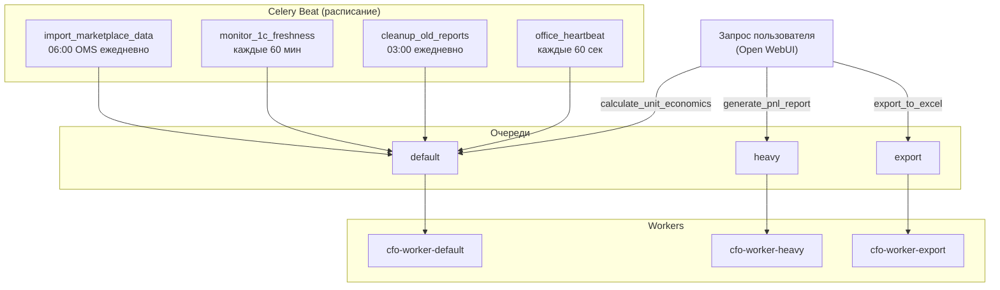

**Проект:** Финансовая отчётность и аналитика  
**Модуль:** CFO / Celery  
**Версия:** 2.0  
**Дата:** Февраль 2026

---

## 7.1 Обзор задач

### Реестр задач

| Задача | Тип | Очередь | Периодичность | Описание |
|--------|-----|---------|---------------|----------|
| `import_marketplace_data` | periodic | default | 06:00 OMS | Импорт данных с маркетплейсов (API + Excel) |
| `monitor_1c_freshness` | periodic | default | */60 | Мониторинг свежести 1C\_\* таблиц |
| `generate_pnl_report` | async | heavy | По запросу | Генерация P&L |
| `calculate_unit_economics` | async | default | По запросу | Unit-экономика |
| `export_to_excel` | async | export | По запросу | Экспорт в Excel |
| `cleanup_old_reports` | periodic | default | 03:00 | Очистка старых отчётов |
| `office_heartbeat` | periodic | default | */1 | Статус в Office Dashboard |

<Note>
**Изменение v2.0:** Задачи `sync_1c_data`, `process_cost_prices`, `process_excel_reports` (файловый обмен с 1С) удалены. Данные из 1С поступают в `1C_*` таблицы через Экстрактор данных 1С автоматически. CFO читает их через VIEW. Добавлена задача `monitor_1c_freshness` для контроля актуальности данных.
</Note>

### Диаграмма очередей



---

## 7.2 Celery Beat Schedule

```python
from celery.schedules import crontab

beat_schedule = {
    "cfo-import-marketplace": {
        "task": "cfo.tasks.import_marketplace_data",
        "schedule": crontab(hour=6, minute=0),  # 06:00 OMS (Asia/Omsk)
        "options": {"queue": "default"}
    },
    "cfo-monitor-brain": {
        "task": "cfo.tasks.monitor_1c_freshness",
        "schedule": crontab(minute="*/60"),
        "options": {"queue": "default"}
    },
    "cfo-cleanup": {
        "task": "cfo.tasks.cleanup_old_reports",
        "schedule": crontab(hour=3, minute=0),
        "options": {"queue": "default"}
    },
    "cfo-office-heartbeat": {
        "task": "cfo.tasks.office_heartbeat",
        "schedule": 60.0,
        "options": {"queue": "default"}
    },
}
```

---

## 7.3 Основные задачи

### import\_marketplace\_data

Импорт финансовых данных с маркетплейсов. Себестоимость подтягивается из VIEW `cfo_v_cost_prices` (1C\_\*).

```python
from celery import shared_task
from app.utils.office_reporter import OfficeReporter

reporter = OfficeReporter(
    agent_id="cfo_report",
    department="cfo",
    name="Отчёт P&L",
    salary_equivalent=80000,
    fte_coefficient=1.0
)

@shared_task(name='cfo.tasks.import_marketplace_data')
def import_marketplace_data():
    """Ежедневный импорт данных с маркетплейсов.
    
    Себестоимость читается из VIEW cfo_v_cost_prices
    (1C_account_turns_90, заполняется Экстрактором 1С).
    """
    
    reporter.report_working("Импорт данных с маркетплейсов")
    
    try:
        service = get_ingestion_service()
        
        # Период: вчера (для ежедневного импорта)
        yesterday = date.today() - timedelta(days=1)
        
        result = await service.import_all(
            date_from=yesterday,
            date_to=yesterday
        )
        
        reporter.report_idle(metrics={
            "last_import": datetime.utcnow().isoformat(),
            "transactions_saved": result.saved,
            "transactions_invalid": result.invalid
        })
        
        return {
            "success": True,
            "total": result.total,
            "saved": result.saved,
            "invalid": result.invalid,
            "duplicates": result.duplicates
        }
        
    except Exception as e:
        reporter.report_error(f"Marketplace import: {e}")
        raise
```

### monitor\_1c\_freshness

Контроль актуальности данных в таблицах `1C_*`. Если данные устарели — алерт администратору.

```python
@shared_task(name='cfo.tasks.monitor_1c_freshness')
def monitor_1c_freshness():
    """Мониторинг свежести данных 1C_*.
    
    Проверяет loaded_at в 1C_account_turns_90.
    Алерт если данные старше порога (по умолчанию 240 часов = 10 дней).
    """
    
    try:
        cost_service = get_cost_service()
        freshness = await cost_service.check_data_freshness()
        
        if freshness["is_stale"]:
            # Отправка алерта через Core Notifications
            send_alert(
                event_type="1c_data_stale",
                level="warning",
                title="Устаревшие данные 1С",
                message=(
                    f"1C_account_turns_90: последняя загрузка "
                    f"{freshness['last_loaded']}. "
                    f"Проверьте работу Экстрактора данных 1С."
                ),
                recipient_roles=["administrator"]
            )
            
            reporter.report_error(
                f"1C_* data stale: last_loaded={freshness['last_loaded']}"
            )
        
        return {
            "success": True,
            "last_loaded": str(freshness["last_loaded"]),
            "last_period": str(freshness["last_period"]),
            "sku_count": freshness["sku_count"],
            "is_stale": freshness["is_stale"]
        }
        
    except Exception as e:
        reporter.report_error(f"1C freshness check: {e}")
        raise
```

### generate\_pnl\_report

```python
@shared_task(
    name='cfo.tasks.generate_pnl_report',
    bind=True,
    time_limit=600
)
def generate_pnl_report(self, period: str, brand: str):
    """Генерация отчёта P&L.
    
    Себестоимость подтягивается из cfo_v_cost_prices (1C_*).
    """
    
    reporter.report_working(f"Генерация P&L за {period}")
    
    try:
        report = build_pnl_report(period, brand)
        
        reporter.report_idle(metrics={
            "reports_generated_today": get_daily_reports_count()
        })
        
        return {"success": True, "report_id": report.id}
        
    except Exception as e:
        reporter.report_error(f"P&L generation: {e}")
        raise
```

---

## 7.4 Интеграция с Office Dashboard

### Агент CFO

| agent\_id | name | salary\_equivalent | fte\_coefficient |
|----------|------|-------------------|-----------------|
| cfo\_report | Отчёт P&L | 80000 | 1.0 |

### Инициализация репортера

```python
# app/tasks/cfo/office.py

from app.utils.office_reporter import OfficeReporter

OFFICE_REPORTER = OfficeReporter(
    agent_id="cfo_report",
    department="cfo",
    name="Отчёт P&L",
    salary_equivalent=80000,
    fte_coefficient=1.0
)
```

### Heartbeat задача

```python
@shared_task(name='cfo.tasks.office_heartbeat')
def office_heartbeat():
    OFFICE_REPORTER.heartbeat()
    return {"success": True}
```

### Метрики для Office

| Метрика | Описание |
|---------|----------|
| last\_import | Время последнего импорта с маркетплейсов |
| transactions\_saved | Транзакций сохранено при последнем импорте |
| transactions\_invalid | Невалидных транзакций при последнем импорте |
| reports\_generated\_today | Отчётов сгенерировано за день |
| 1c\_last\_loaded | Время последней загрузки 1C\_\* |
| 1c\_is\_stale | Флаг устаревания данных 1C\_\* |

---

## 7.5 История изменений

### v2.0 (Февраль 2026)

| Компонент | Было (v1.1) | Стало (v2.0) |
|-----------|-------------|--------------|
| `sync_1c_data` | Файловая синхронизация с 1С (CSV) | **Удалена** — данные пишутся Экстрактором напрямую в 1C\_\* |
| `process_cost_prices` | Импорт CSV себестоимости | **Удалена** |
| `process_excel_reports` | Парсинг Excel из 1С | **Удалена** |
| `import_marketplace_data` | Отсутствовала | **Добавлена** — импорт API + Excel маркетплейсов |
| `monitor_1c_freshness` | Отсутствовала | **Добавлена** — алерт при устаревании 1C\_\* |
| Метрики Office | `last_sync` | `last_import`, `1c_last_loaded`, `1c_is_stale` |

---

**Документ подготовлен:** Февраль 2026  
**Версия:** 2.0  
**Статус:** Черновик
