# ADOLF CFO — Раздел 7: Celery

**Проект:** Финансовый учёт и управленческая аналитика  
**Модуль:** CFO  
**Версия:** 1.0  
**Дата:** Январь 2026

---

## 7.1 Назначение

Раздел описывает фоновые задачи Celery для модуля CFO: импорт данных, расчёт P&L, ABC-анализ, алерты и очистка данных.

### Реестр задач

| Задача | Описание | Расписание |
|--------|----------|------------|
| `cfo.import_wb_finance` | Импорт данных Wildberries | Ежедневно 06:00 |
| `cfo.import_ozon_finance` | Импорт данных Ozon | Ежедневно 06:10 |
| `cfo.import_ym_finance` | Импорт данных Яндекс.Маркет | Ежедневно 06:20 |
| `cfo.process_excel_reports` | Обработка Excel из ETL | Ежедневно 06:30 |
| `cfo.process_cost_prices` | Обработка себестоимости | Еженедельно Пн 07:00 |
| `cfo.calculate_daily_pnl` | Расчёт дневного P&L | Ежедневно 07:00 |
| `cfo.aggregate_pnl` | Агрегация P&L по срезам | Ежедневно 07:30 |
| `cfo.run_abc_analysis` | ABC-анализ | Еженедельно Пн 08:00 |
| `cfo.detect_anomalies` | Детекция аномалий | Ежедневно 07:45 |
| `cfo.check_alerts` | Проверка и отправка алертов | Ежедневно 08:00 |
| `cfo.cleanup_old_data` | Очистка устаревших данных | Ежемесячно 1-е 03:00 |
| `cfo.generate_weekly_report` | Еженедельный отчёт | Еженедельно Пн 09:00 |

---

## 7.2 Конфигурация Celery

### 7.2.1 Настройки

```python
# celery_config.py

from celery import Celery
from celery.schedules import crontab

app = Celery('adolf_cfo')

app.conf.update(
    broker_url='redis://localhost:6379/0',
    result_backend='redis://localhost:6379/1',
    
    task_serializer='json',
    accept_content=['json'],
    result_serializer='json',
    
    timezone='Europe/Moscow',
    enable_utc=True,
    
    task_default_queue='cfo',
    task_queues={
        'cfo': {'exchange': 'cfo', 'routing_key': 'cfo'},
        'cfo_priority': {'exchange': 'cfo_priority', 'routing_key': 'cfo_priority'},
    },
    
    task_routes={
        'cfo.import_*': {'queue': 'cfo'},
        'cfo.calculate_*': {'queue': 'cfo'},
        'cfo.check_alerts': {'queue': 'cfo_priority'},
    },
    
    task_acks_late=True,
    task_reject_on_worker_lost=True,
    
    worker_prefetch_multiplier=1,
    worker_concurrency=4,
    
    task_soft_time_limit=300,
    task_time_limit=600,
    
    result_expires=86400,
)
```

### 7.2.2 Celery Beat Schedule

```python
# celery_beat_schedule.py

app.conf.beat_schedule = {
    # Импорт данных
    'cfo-import-wb-daily': {
        'task': 'cfo.import_wb_finance',
        'schedule': crontab(hour=6, minute=0),
        'options': {'queue': 'cfo'}
    },
    'cfo-import-ozon-daily': {
        'task': 'cfo.import_ozon_finance',
        'schedule': crontab(hour=6, minute=10),
        'options': {'queue': 'cfo'}
    },
    'cfo-import-ym-daily': {
        'task': 'cfo.import_ym_finance',
        'schedule': crontab(hour=6, minute=20),
        'options': {'queue': 'cfo'}
    },
    'cfo-process-excel-daily': {
        'task': 'cfo.process_excel_reports',
        'schedule': crontab(hour=6, minute=30),
        'options': {'queue': 'cfo'}
    },
    'cfo-process-costs-weekly': {
        'task': 'cfo.process_cost_prices',
        'schedule': crontab(hour=7, minute=0, day_of_week=1),
        'options': {'queue': 'cfo'}
    },
    
    # Расчёты
    'cfo-calculate-pnl-daily': {
        'task': 'cfo.calculate_daily_pnl',
        'schedule': crontab(hour=7, minute=0),
        'options': {'queue': 'cfo'}
    },
    'cfo-aggregate-pnl-daily': {
        'task': 'cfo.aggregate_pnl',
        'schedule': crontab(hour=7, minute=30),
        'options': {'queue': 'cfo'}
    },
    'cfo-abc-weekly': {
        'task': 'cfo.run_abc_analysis',
        'schedule': crontab(hour=8, minute=0, day_of_week=1),
        'options': {'queue': 'cfo'}
    },
    
    # Мониторинг
    'cfo-detect-anomalies-daily': {
        'task': 'cfo.detect_anomalies',
        'schedule': crontab(hour=7, minute=45),
        'options': {'queue': 'cfo'}
    },
    'cfo-check-alerts-daily': {
        'task': 'cfo.check_alerts',
        'schedule': crontab(hour=8, minute=0),
        'options': {'queue': 'cfo_priority'}
    },
    
    # Обслуживание
    'cfo-cleanup-monthly': {
        'task': 'cfo.cleanup_old_data',
        'schedule': crontab(hour=3, minute=0, day_of_month=1),
        'options': {'queue': 'cfo'}
    },
    'cfo-weekly-report': {
        'task': 'cfo.generate_weekly_report',
        'schedule': crontab(hour=9, minute=0, day_of_week=1),
        'options': {'queue': 'cfo'}
    },
}
```

---

## 7.3 Задачи импорта данных

### 7.3.1 import_wb_finance

**Назначение:** Импорт финансовых данных из Wildberries API.

```python
from celery import shared_task
from datetime import date, timedelta
from typing import Optional
import logging

logger = logging.getLogger(__name__)

@shared_task(
    name='cfo.import_wb_finance',
    bind=True,
    max_retries=3,
    default_retry_delay=300,
    soft_time_limit=240,
    time_limit=300
)
def import_wb_finance(
    self,
    date_from: Optional[str] = None,
    date_to: Optional[str] = None
) -> dict:
    """
    Импорт финансовых данных Wildberries.
    
    Args:
        date_from: Начало периода (YYYY-MM-DD). По умолчанию: вчера.
        date_to: Конец периода (YYYY-MM-DD). По умолчанию: вчера.
    
    Returns:
        dict: Результат импорта с количеством записей.
    """
    from services.cfo import DataIngestionService
    from adapters.wb import WBFinanceAdapter
    from core.database import get_db_session
    
    try:
        # Определение периода
        if date_from is None:
            target_date = date.today() - timedelta(days=1)
            date_from = target_date
            date_to = target_date
        else:
            date_from = date.fromisoformat(date_from)
            date_to = date.fromisoformat(date_to) if date_to else date_from
        
        logger.info(f"Starting WB finance import for {date_from} - {date_to}")
        
        # Инициализация
        async with get_db_session() as db:
            adapter = WBFinanceAdapter(api_key=settings.WB_API_KEY)
            service = DataIngestionService(db)
            
            # Импорт
            result = await service.import_from_wb(adapter, date_from, date_to)
        
        logger.info(f"WB import completed: {result.saved} records saved")
        
        return {
            'status': 'success',
            'source': 'wb_api',
            'date_from': date_from.isoformat(),
            'date_to': date_to.isoformat(),
            'total': result.total,
            'valid': result.valid,
            'duplicates': result.duplicates,
            'saved': result.saved
        }
    
    except RateLimitError as e:
        logger.warning(f"WB API rate limit: {e}")
        raise self.retry(exc=e, countdown=60)
    
    except APIError as e:
        logger.error(f"WB API error: {e}")
        raise self.retry(exc=e)
    
    except Exception as e:
        logger.exception(f"WB import failed: {e}")
        
        # Отправка алерта админам
        send_alert.delay(
            event_type='cfo.import_error',
            level='critical',
            data={
                'source': 'wb_api',
                'error': str(e),
                'date': date_from.isoformat() if date_from else None
            }
        )
        
        raise
```

### 7.3.2 import_ozon_finance

**Назначение:** Импорт финансовых данных из Ozon API.

```python
@shared_task(
    name='cfo.import_ozon_finance',
    bind=True,
    max_retries=3,
    default_retry_delay=300,
    soft_time_limit=240,
    time_limit=300
)
def import_ozon_finance(
    self,
    date_from: Optional[str] = None,
    date_to: Optional[str] = None
) -> dict:
    """Импорт финансовых данных Ozon."""
    from services.cfo import DataIngestionService
    from adapters.ozon import OzonFinanceAdapter
    from core.database import get_db_session
    
    try:
        if date_from is None:
            target_date = date.today() - timedelta(days=1)
            date_from = target_date
            date_to = target_date
        else:
            date_from = date.fromisoformat(date_from)
            date_to = date.fromisoformat(date_to) if date_to else date_from
        
        logger.info(f"Starting Ozon finance import for {date_from} - {date_to}")
        
        async with get_db_session() as db:
            adapter = OzonFinanceAdapter(
                client_id=settings.OZON_CLIENT_ID,
                api_key=settings.OZON_API_KEY
            )
            service = DataIngestionService(db)
            result = await service.import_from_ozon(adapter, date_from, date_to)
        
        logger.info(f"Ozon import completed: {result.saved} records saved")
        
        return {
            'status': 'success',
            'source': 'ozon_api',
            'date_from': date_from.isoformat(),
            'date_to': date_to.isoformat(),
            'total': result.total,
            'saved': result.saved
        }
    
    except RateLimitError as e:
        logger.warning(f"Ozon API rate limit: {e}")
        raise self.retry(exc=e, countdown=60)
    
    except Exception as e:
        logger.exception(f"Ozon import failed: {e}")
        send_alert.delay(
            event_type='cfo.import_error',
            level='critical',
            data={'source': 'ozon_api', 'error': str(e)}
        )
        raise
```

### 7.3.3 import_ym_finance

**Назначение:** Импорт финансовых данных из Яндекс.Маркет API.

```python
@shared_task(
    name='cfo.import_ym_finance',
    bind=True,
    max_retries=3,
    default_retry_delay=300,
    soft_time_limit=240,
    time_limit=300
)
def import_ym_finance(
    self,
    date_from: Optional[str] = None,
    date_to: Optional[str] = None
) -> dict:
    """Импорт финансовых данных Яндекс.Маркет."""
    from services.cfo import DataIngestionService
    from adapters.ym import YMFinanceAdapter
    from core.database import get_db_session
    
    try:
        if date_from is None:
            target_date = date.today() - timedelta(days=1)
            date_from = target_date
            date_to = target_date
        else:
            date_from = date.fromisoformat(date_from)
            date_to = date.fromisoformat(date_to) if date_to else date_from
        
        logger.info(f"Starting YM finance import for {date_from} - {date_to}")
        
        async with get_db_session() as db:
            adapter = YMFinanceAdapter(
                oauth_token=settings.YM_OAUTH_TOKEN,
                campaign_id=settings.YM_CAMPAIGN_ID
            )
            service = DataIngestionService(db)
            result = await service.import_from_ym(adapter, date_from, date_to)
        
        logger.info(f"YM import completed: {result.saved} records saved")
        
        return {
            'status': 'success',
            'source': 'ym_api',
            'date_from': date_from.isoformat(),
            'date_to': date_to.isoformat(),
            'total': result.total,
            'saved': result.saved
        }
    
    except Exception as e:
        logger.exception(f"YM import failed: {e}")
        send_alert.delay(
            event_type='cfo.import_error',
            level='critical',
            data={'source': 'ym_api', 'error': str(e)}
        )
        raise
```

### 7.3.4 process_excel_reports

**Назначение:** Обработка Excel-отчётов из папки ETL.

```python
@shared_task(
    name='cfo.process_excel_reports',
    bind=True,
    max_retries=2,
    soft_time_limit=300,
    time_limit=360
)
def process_excel_reports(self) -> dict:
    """Обработка Excel-отчётов из /data/inbox/cfo/marketplace/."""
    from pathlib import Path
    from services.cfo import DataIngestionService
    from parsers.excel import ExcelParser
    from core.database import get_db_session
    
    inbox_path = Path('/data/inbox/cfo/marketplace')
    results = {'wb': 0, 'ozon': 0, 'ym': 0, 'errors': []}
    
    try:
        async with get_db_session() as db:
            service = DataIngestionService(db)
            parser = ExcelParser()
            
            for marketplace in ['wb', 'ozon', 'ym']:
                mp_path = inbox_path / marketplace
                
                if not mp_path.exists():
                    continue
                
                for file_path in mp_path.glob('*.xlsx'):
                    try:
                        logger.info(f"Processing {file_path}")
                        
                        # Парсинг
                        records = parser.parse(file_path, marketplace)
                        
                        # Импорт
                        saved = await service.import_from_excel(records)
                        results[marketplace] += saved
                        
                        # Перемещение в processed
                        processed_path = mp_path / 'processed'
                        processed_path.mkdir(exist_ok=True)
                        file_path.rename(processed_path / file_path.name)
                        
                        logger.info(f"Processed {file_path.name}: {saved} records")
                    
                    except Exception as e:
                        logger.error(f"Failed to process {file_path}: {e}")
                        results['errors'].append({
                            'file': file_path.name,
                            'error': str(e)
                        })
                        
                        # Перемещение в failed
                        failed_path = mp_path / 'failed'
                        failed_path.mkdir(exist_ok=True)
                        file_path.rename(failed_path / file_path.name)
        
        total = results['wb'] + results['ozon'] + results['ym']
        logger.info(f"Excel processing completed: {total} records")
        
        return {
            'status': 'success',
            'results': results,
            'total': total
        }
    
    except Exception as e:
        logger.exception(f"Excel processing failed: {e}")
        raise
```

### 7.3.5 process_cost_prices

**Назначение:** Обработка выгрузки себестоимости из 1С.

```python
@shared_task(
    name='cfo.process_cost_prices',
    bind=True,
    max_retries=2,
    soft_time_limit=180,
    time_limit=240
)
def process_cost_prices(self) -> dict:
    """Обработка себестоимости из /data/inbox/cfo/costs/."""
    from pathlib import Path
    from services.cfo import CostPriceService
    from parsers.cost_price import CostPriceParser
    from core.database import get_db_session
    
    inbox_path = Path('/data/inbox/cfo/costs')
    
    try:
        async with get_db_session() as db:
            service = CostPriceService(db)
            parser = CostPriceParser()
            
            total_saved = 0
            files_processed = 0
            
            for file_path in inbox_path.glob('*'):
                if file_path.suffix.lower() not in ['.csv', '.xls', '.xlsx']:
                    continue
                
                try:
                    logger.info(f"Processing cost prices: {file_path}")
                    
                    # Парсинг
                    records = parser.parse(file_path)
                    
                    # Сохранение (upsert)
                    saved = await service.upsert_cost_prices(records)
                    total_saved += saved
                    files_processed += 1
                    
                    # Перемещение в processed
                    processed_path = inbox_path / 'processed'
                    processed_path.mkdir(exist_ok=True)
                    file_path.rename(processed_path / file_path.name)
                    
                    logger.info(f"Processed {file_path.name}: {saved} records")
                
                except Exception as e:
                    logger.error(f"Failed to process {file_path}: {e}")
                    
                    failed_path = inbox_path / 'failed'
                    failed_path.mkdir(exist_ok=True)
                    file_path.rename(failed_path / file_path.name)
        
        logger.info(f"Cost prices processing completed: {total_saved} records from {files_processed} files")
        
        return {
            'status': 'success',
            'files_processed': files_processed,
            'records_saved': total_saved
        }
    
    except Exception as e:
        logger.exception(f"Cost prices processing failed: {e}")
        raise
```

---

## 7.4 Задачи расчётов

### 7.4.1 calculate_daily_pnl

**Назначение:** Расчёт дневного P&L по всем SKU.

```python
@shared_task(
    name='cfo.calculate_daily_pnl',
    bind=True,
    max_retries=2,
    soft_time_limit=300,
    time_limit=360
)
def calculate_daily_pnl(
    self,
    target_date: Optional[str] = None
) -> dict:
    """
    Расчёт дневного P&L.
    
    Args:
        target_date: Дата расчёта (YYYY-MM-DD). По умолчанию: вчера.
    """
    from services.cfo import PnLCalculator, CostMapper
    from core.database import get_db_session
    
    try:
        if target_date is None:
            target_date = date.today() - timedelta(days=1)
        else:
            target_date = date.fromisoformat(target_date)
        
        logger.info(f"Starting P&L calculation for {target_date}")
        
        async with get_db_session() as db:
            # Загрузка себестоимости
            cost_mapper = CostMapper(db)
            await cost_mapper.load_cost_prices()
            
            # Калькулятор P&L
            calculator = PnLCalculator(cost_mapper)
            
            # Загрузка транзакций за день
            transactions = await db.fetch("""
                SELECT * FROM cfo_transactions
                WHERE sale_date = $1
            """, target_date)
            
            if not transactions:
                logger.warning(f"No transactions for {target_date}")
                return {
                    'status': 'success',
                    'date': target_date.isoformat(),
                    'skus_calculated': 0,
                    'message': 'No transactions'
                }
            
            # Группировка по SKU + marketplace
            from collections import defaultdict
            grouped = defaultdict(list)
            for tx in transactions:
                key = (tx['sku'], tx['marketplace'])
                grouped[key].append(tx)
            
            # Расчёт P&L для каждого SKU
            pnl_results = []
            unmapped_count = 0
            
            for (sku, marketplace), txs in grouped.items():
                pnl = calculator.calculate_sku_pnl(txs, sku, target_date, target_date)
                if pnl:
                    pnl_results.append(pnl)
                    if not pnl.cogs_mapped:
                        unmapped_count += 1
            
            # Сохранение результатов
            saved = await save_pnl_results(db, pnl_results)
            
            logger.info(f"P&L calculation completed: {saved} SKUs, {unmapped_count} unmapped")
            
            # Алерт если много unmapped
            if unmapped_count > 10:
                send_alert.delay(
                    event_type='cfo.unmapped_costs',
                    level='warning',
                    data={
                        'date': target_date.isoformat(),
                        'unmapped_count': unmapped_count
                    }
                )
            
            return {
                'status': 'success',
                'date': target_date.isoformat(),
                'skus_calculated': saved,
                'unmapped_count': unmapped_count
            }
    
    except Exception as e:
        logger.exception(f"P&L calculation failed: {e}")
        raise


async def save_pnl_results(db, results: list) -> int:
    """Сохранение результатов P&L в БД."""
    
    query = """
        INSERT INTO cfo_pnl_daily (
            sku, marketplace, brand_id, category, sale_date,
            quantity_sold, quantity_returned,
            gross_revenue, discounts, returns_amount, net_revenue,
            cogs, cogs_mapped,
            commission, logistics, return_logistics, storage, advertising,
            gross_margin_pct, net_margin_pct, calculated_at
        ) VALUES (
            $1, $2, $3, $4, $5, $6, $7, $8, $9, $10, $11, $12, $13,
            $14, $15, $16, $17, $18, $19, $20, $21
        )
        ON CONFLICT (sku, marketplace, sale_date) DO UPDATE SET
            quantity_sold = EXCLUDED.quantity_sold,
            quantity_returned = EXCLUDED.quantity_returned,
            gross_revenue = EXCLUDED.gross_revenue,
            net_revenue = EXCLUDED.net_revenue,
            cogs = EXCLUDED.cogs,
            cogs_mapped = EXCLUDED.cogs_mapped,
            commission = EXCLUDED.commission,
            logistics = EXCLUDED.logistics,
            return_logistics = EXCLUDED.return_logistics,
            storage = EXCLUDED.storage,
            advertising = EXCLUDED.advertising,
            gross_margin_pct = EXCLUDED.gross_margin_pct,
            net_margin_pct = EXCLUDED.net_margin_pct,
            calculated_at = EXCLUDED.calculated_at
    """
    
    saved = 0
    for pnl in results:
        await db.execute(query, *pnl.to_tuple())
        saved += 1
    
    return saved
```

### 7.4.2 aggregate_pnl

**Назначение:** Агрегация P&L по категориям, брендам, маркетплейсам.

```python
@shared_task(
    name='cfo.aggregate_pnl',
    bind=True,
    soft_time_limit=180,
    time_limit=240
)
def aggregate_pnl(
    self,
    target_date: Optional[str] = None
) -> dict:
    """Агрегация P&L по различным срезам."""
    from core.database import get_db_session
    
    try:
        if target_date is None:
            target_date = date.today() - timedelta(days=1)
        else:
            target_date = date.fromisoformat(target_date)
        
        logger.info(f"Starting P&L aggregation for {target_date}")
        
        async with get_db_session() as db:
            aggregations = []
            
            # По категориям
            categories = await db.fetch("""
                SELECT 
                    category as aggregation_key,
                    SUM(net_revenue) as net_revenue,
                    SUM(cogs) as cogs,
                    SUM(commission) as commission,
                    SUM(logistics) as logistics,
                    SUM(return_logistics) as return_logistics,
                    SUM(storage) as storage,
                    SUM(advertising) as advertising,
                    COUNT(DISTINCT sku) as sku_count,
                    SUM(quantity_sold) as quantity_sold
                FROM cfo_pnl_daily
                WHERE sale_date = $1 AND category IS NOT NULL
                GROUP BY category
            """, target_date)
            
            for row in categories:
                aggregations.append({
                    'aggregation_type': 'category',
                    'period_type': 'day',
                    **dict(row)
                })
            
            # По брендам
            brands = await db.fetch("""
                SELECT 
                    brand_id as aggregation_key,
                    SUM(net_revenue) as net_revenue,
                    SUM(cogs) as cogs,
                    SUM(commission) as commission,
                    SUM(logistics) as logistics,
                    SUM(return_logistics) as return_logistics,
                    SUM(storage) as storage,
                    SUM(advertising) as advertising,
                    COUNT(DISTINCT sku) as sku_count,
                    SUM(quantity_sold) as quantity_sold
                FROM cfo_pnl_daily
                WHERE sale_date = $1 AND brand_id IS NOT NULL
                GROUP BY brand_id
            """, target_date)
            
            for row in brands:
                aggregations.append({
                    'aggregation_type': 'brand',
                    'period_type': 'day',
                    **dict(row)
                })
            
            # По маркетплейсам
            marketplaces = await db.fetch("""
                SELECT 
                    marketplace as aggregation_key,
                    SUM(net_revenue) as net_revenue,
                    SUM(cogs) as cogs,
                    SUM(commission) as commission,
                    SUM(logistics) as logistics,
                    SUM(return_logistics) as return_logistics,
                    SUM(storage) as storage,
                    SUM(advertising) as advertising,
                    COUNT(DISTINCT sku) as sku_count,
                    SUM(quantity_sold) as quantity_sold
                FROM cfo_pnl_daily
                WHERE sale_date = $1
                GROUP BY marketplace
            """, target_date)
            
            for row in marketplaces:
                aggregations.append({
                    'aggregation_type': 'marketplace',
                    'period_type': 'day',
                    **dict(row)
                })
            
            # Общий итог
            total = await db.fetchrow("""
                SELECT 
                    SUM(net_revenue) as net_revenue,
                    SUM(cogs) as cogs,
                    SUM(commission) as commission,
                    SUM(logistics) as logistics,
                    SUM(return_logistics) as return_logistics,
                    SUM(storage) as storage,
                    SUM(advertising) as advertising,
                    COUNT(DISTINCT sku) as sku_count,
                    SUM(quantity_sold) as quantity_sold
                FROM cfo_pnl_daily
                WHERE sale_date = $1
            """, target_date)
            
            if total and total['net_revenue']:
                aggregations.append({
                    'aggregation_type': 'total',
                    'aggregation_key': 'all',
                    'period_type': 'day',
                    **dict(total)
                })
            
            # Сохранение
            saved = await save_aggregations(db, aggregations, target_date)
            
            logger.info(f"P&L aggregation completed: {saved} records")
            
            return {
                'status': 'success',
                'date': target_date.isoformat(),
                'aggregations_saved': saved
            }
    
    except Exception as e:
        logger.exception(f"P&L aggregation failed: {e}")
        raise
```

### 7.4.3 run_abc_analysis

**Назначение:** Еженедельный ABC-анализ товарного портфеля.

```python
@shared_task(
    name='cfo.run_abc_analysis',
    bind=True,
    soft_time_limit=300,
    time_limit=360
)
def run_abc_analysis(
    self,
    period_days: int = 7
) -> dict:
    """Еженедельный ABC-анализ."""
    from services.cfo import ABCAnalyzer
    from core.database import get_db_session
    
    try:
        period_end = date.today() - timedelta(days=1)
        period_start = period_end - timedelta(days=period_days - 1)
        
        logger.info(f"Starting ABC analysis for {period_start} - {period_end}")
        
        async with get_db_session() as db:
            # Загрузка P&L за период
            pnl_results = await db.fetch("""
                SELECT 
                    sku,
                    marketplace,
                    SUM(net_revenue) as net_revenue,
                    SUM(net_profit) as net_profit,
                    AVG(net_margin_pct) as net_margin_pct
                FROM cfo_pnl_daily
                WHERE sale_date BETWEEN $1 AND $2
                GROUP BY sku, marketplace
            """, period_start, period_end)
            
            if not pnl_results:
                logger.warning("No P&L data for ABC analysis")
                return {
                    'status': 'success',
                    'message': 'No data',
                    'skus_analyzed': 0
                }
            
            # ABC-анализ
            analyzer = ABCAnalyzer()
            abc_results, summary = analyzer.analyze(pnl_results)
            
            # Создание снимка
            snapshot_id = await db.fetchval("""
                INSERT INTO cfo_abc_snapshots (
                    period_start, period_end, total_skus, total_profit,
                    class_a_count, class_a_profit, class_a_pct,
                    class_b_count, class_b_profit, class_b_pct,
                    class_c_count, class_c_profit, class_c_pct,
                    class_d_count, class_d_loss
                ) VALUES ($1, $2, $3, $4, $5, $6, $7, $8, $9, $10, $11, $12, $13, $14, $15)
                RETURNING id
            """, period_start, period_end, summary.total_skus, summary.total_profit,
                summary.class_a_count, summary.class_a_profit, summary.class_a_pct,
                summary.class_b_count, summary.class_b_profit, summary.class_b_pct,
                summary.class_c_count, summary.class_c_profit, summary.class_c_pct,
                summary.class_d_count, summary.class_d_loss)
            
            # Сохранение результатов
            for result in abc_results:
                await db.execute("""
                    INSERT INTO cfo_abc_results (
                        snapshot_id, sku, marketplace, abc_class, rank,
                        net_profit, net_margin_pct, cumulative_profit, cumulative_pct
                    ) VALUES ($1, $2, $3, $4, $5, $6, $7, $8, $9)
                """, snapshot_id, result.sku, result.marketplace, result.abc_class,
                    result.rank, result.net_profit, result.net_margin_pct,
                    result.cumulative_profit, result.cumulative_pct)
            
            logger.info(f"ABC analysis completed: {summary.total_skus} SKUs, "
                       f"A={summary.class_a_count}, B={summary.class_b_count}, "
                       f"C={summary.class_c_count}, D={summary.class_d_count}")
            
            # Алерт о классе D
            if summary.class_d_count > 0:
                send_alert.delay(
                    event_type='cfo.sku_negative_margin',
                    level='warning',
                    data={
                        'period': f"{period_start} - {period_end}",
                        'count': summary.class_d_count,
                        'total_loss': float(summary.class_d_loss)
                    }
                )
            
            return {
                'status': 'success',
                'period_start': period_start.isoformat(),
                'period_end': period_end.isoformat(),
                'snapshot_id': snapshot_id,
                'total_skus': summary.total_skus,
                'class_d_count': summary.class_d_count
            }
    
    except Exception as e:
        logger.exception(f"ABC analysis failed: {e}")
        raise
```

---

## 7.5 Задачи мониторинга

### 7.5.1 detect_anomalies

**Назначение:** Детекция аномалий в финансовых данных.

```python
@shared_task(
    name='cfo.detect_anomalies',
    bind=True,
    soft_time_limit=180,
    time_limit=240
)
def detect_anomalies(
    self,
    target_date: Optional[str] = None,
    lookback_days: int = 30
) -> dict:
    """Детекция аномалий."""
    from services.cfo import AnomalyDetector
    from core.database import get_db_session
    
    try:
        if target_date is None:
            target_date = date.today() - timedelta(days=1)
        else:
            target_date = date.fromisoformat(target_date)
        
        logger.info(f"Starting anomaly detection for {target_date}")
        
        async with get_db_session() as db:
            detector = AnomalyDetector(db)
            
            # Загрузка текущих данных
            current_pnl = await db.fetch("""
                SELECT * FROM cfo_pnl_daily
                WHERE sale_date = $1
            """, target_date)
            
            if not current_pnl:
                return {
                    'status': 'success',
                    'message': 'No data',
                    'anomalies_detected': 0
                }
            
            # Детекция
            anomalies = await detector.detect(current_pnl, lookback_days)
            
            # Сохранение аномалий
            saved = 0
            for anomaly in anomalies:
                await db.execute("""
                    INSERT INTO cfo_anomalies (
                        anomaly_type, sku, marketplace,
                        current_value, expected_value, deviation_pct,
                        severity, description, detection_date
                    ) VALUES ($1, $2, $3, $4, $5, $6, $7, $8, $9)
                """, anomaly.anomaly_type, anomaly.sku, anomaly.marketplace,
                    anomaly.current_value, anomaly.expected_value, anomaly.deviation_pct,
                    anomaly.severity, anomaly.description, target_date)
                saved += 1
            
            logger.info(f"Anomaly detection completed: {saved} anomalies")
            
            return {
                'status': 'success',
                'date': target_date.isoformat(),
                'anomalies_detected': saved,
                'critical_count': len([a for a in anomalies if a.severity == 'critical'])
            }
    
    except Exception as e:
        logger.exception(f"Anomaly detection failed: {e}")
        raise
```

### 7.5.2 check_alerts

**Назначение:** Проверка условий и отправка алертов.

```python
@shared_task(
    name='cfo.check_alerts',
    bind=True,
    soft_time_limit=120,
    time_limit=180
)
def check_alerts(self) -> dict:
    """Проверка и отправка алертов."""
    from services.notifications import NotificationService
    from core.database import get_db_session
    
    try:
        target_date = date.today() - timedelta(days=1)
        
        logger.info(f"Checking alerts for {target_date}")
        
        async with get_db_session() as db:
            notifications = NotificationService(db)
            alerts_sent = 0
            
            # Получение настроек
            settings = await get_cfo_settings(db)
            margin_threshold = settings.get('margin_threshold', 10.0)
            
            # 1. Алерт об убыточных SKU
            loss_makers = await db.fetch("""
                SELECT sku, marketplace, net_profit, net_margin_pct
                FROM cfo_pnl_daily
                WHERE sale_date = $1 AND net_profit < 0
                ORDER BY net_profit ASC
                LIMIT 20
            """, target_date)
            
            if loss_makers:
                recipients = await get_users_by_role(db, ['senior', 'director'])
                
                await notifications.send(
                    user_ids=recipients,
                    event_type='cfo.sku_negative_margin',
                    level='warning',
                    title=f'Обнаружено {len(loss_makers)} убыточных SKU',
                    data={
                        'date': target_date.isoformat(),
                        'count': len(loss_makers),
                        'total_loss': sum(r['net_profit'] for r in loss_makers),
                        'top_5': [dict(r) for r in loss_makers[:5]]
                    }
                )
                alerts_sent += 1
            
            # 2. Алерт о низкой марже
            low_margin = await db.fetch("""
                SELECT sku, marketplace, net_margin_pct
                FROM cfo_pnl_daily
                WHERE sale_date = $1 
                  AND net_profit > 0 
                  AND net_margin_pct < $2
                ORDER BY net_margin_pct ASC
                LIMIT 10
            """, target_date, margin_threshold)
            
            if low_margin:
                recipients = await get_users_by_role(db, ['senior', 'director'])
                
                await notifications.send(
                    user_ids=recipients,
                    event_type='cfo.margin_below_threshold',
                    level='warning',
                    title=f'{len(low_margin)} SKU с маржой ниже {margin_threshold}%',
                    data={
                        'date': target_date.isoformat(),
                        'threshold': margin_threshold,
                        'count': len(low_margin),
                        'items': [dict(r) for r in low_margin]
                    }
                )
                alerts_sent += 1
            
            # 3. Алерт об аномалиях (critical)
            critical_anomalies = await db.fetch("""
                SELECT * FROM cfo_anomalies
                WHERE detection_date = $1 
                  AND severity = 'critical'
                  AND status = 'new'
            """, target_date)
            
            if critical_anomalies:
                recipients = await get_users_by_role(db, ['admin'])
                
                await notifications.send(
                    user_ids=recipients,
                    event_type='cfo.anomaly_detected',
                    level='warning',
                    title=f'{len(critical_anomalies)} критических аномалий',
                    data={
                        'date': target_date.isoformat(),
                        'count': len(critical_anomalies),
                        'anomalies': [dict(r) for r in critical_anomalies]
                    }
                )
                alerts_sent += 1
            
            # 4. Алерт об успешном импорте (для Admin)
            admin_recipients = await get_users_by_role(db, ['admin'])
            
            import_stats = await db.fetchrow("""
                SELECT 
                    COUNT(*) as total_transactions,
                    COUNT(DISTINCT sku) as total_skus
                FROM cfo_transactions
                WHERE DATE(created_at) = $1
            """, target_date)
            
            await notifications.send(
                user_ids=admin_recipients,
                event_type='cfo.data_imported',
                level='info',
                title='Ежедневный импорт CFO завершён',
                data={
                    'date': target_date.isoformat(),
                    'transactions': import_stats['total_transactions'],
                    'skus': import_stats['total_skus']
                }
            )
            alerts_sent += 1
            
            logger.info(f"Alerts check completed: {alerts_sent} alerts sent")
            
            return {
                'status': 'success',
                'date': target_date.isoformat(),
                'alerts_sent': alerts_sent
            }
    
    except Exception as e:
        logger.exception(f"Alerts check failed: {e}")
        raise
```

---

## 7.6 Задачи обслуживания

### 7.6.1 cleanup_old_data

**Назначение:** Очистка устаревших данных.

```python
@shared_task(
    name='cfo.cleanup_old_data',
    bind=True,
    soft_time_limit=600,
    time_limit=900
)
def cleanup_old_data(self) -> dict:
    """Очистка устаревших данных CFO."""
    from core.database import get_db_session
    
    try:
        logger.info("Starting CFO data cleanup")
        
        async with get_db_session() as db:
            # Получение настройки retention
            retention_days = await db.fetchval("""
                SELECT (value::text)::integer 
                FROM cfo_settings 
                WHERE key = 'retention_days'
            """) or 365
            
            cutoff_date = date.today() - timedelta(days=retention_days)
            results = {}
            
            # Удаление старых транзакций
            deleted = await db.execute("""
                DELETE FROM cfo_transactions
                WHERE sale_date < $1
            """, cutoff_date)
            results['transactions'] = deleted.split()[-1] if deleted else 0
            
            # Удаление старых P&L
            deleted = await db.execute("""
                DELETE FROM cfo_pnl_daily
                WHERE sale_date < $1
            """, cutoff_date)
            results['pnl_daily'] = deleted.split()[-1] if deleted else 0
            
            # Удаление старых ABC-снимков (24 месяца)
            abc_cutoff = date.today() - timedelta(days=730)
            deleted = await db.execute("""
                DELETE FROM cfo_abc_snapshots
                WHERE calculated_at < $1
            """, abc_cutoff)
            results['abc_snapshots'] = deleted.split()[-1] if deleted else 0
            
            # Удаление resolved аномалий (12 месяцев)
            anomaly_cutoff = date.today() - timedelta(days=365)
            deleted = await db.execute("""
                DELETE FROM cfo_anomalies
                WHERE status = 'resolved' AND resolved_at < $1
            """, anomaly_cutoff)
            results['anomalies'] = deleted.split()[-1] if deleted else 0
            
            # Удаление старых алертов (6 месяцев)
            alert_cutoff = date.today() - timedelta(days=180)
            deleted = await db.execute("""
                DELETE FROM cfo_alerts
                WHERE sent_at < $1
            """, alert_cutoff)
            results['alerts'] = deleted.split()[-1] if deleted else 0
            
            # Удаление просроченных отчётов
            deleted = await db.execute("""
                DELETE FROM cfo_reports
                WHERE expires_at IS NOT NULL AND expires_at < CURRENT_TIMESTAMP
            """)
            results['reports'] = deleted.split()[-1] if deleted else 0
            
            # VACUUM для освобождения места
            await db.execute("VACUUM ANALYZE cfo_transactions")
            await db.execute("VACUUM ANALYZE cfo_pnl_daily")
            
            logger.info(f"CFO cleanup completed: {results}")
            
            return {
                'status': 'success',
                'retention_days': retention_days,
                'cutoff_date': cutoff_date.isoformat(),
                'deleted': results
            }
    
    except Exception as e:
        logger.exception(f"CFO cleanup failed: {e}")
        raise
```

### 7.6.2 generate_weekly_report

**Назначение:** Генерация еженедельного отчёта.

```python
@shared_task(
    name='cfo.generate_weekly_report',
    bind=True,
    soft_time_limit=300,
    time_limit=360
)
def generate_weekly_report(self) -> dict:
    """Генерация еженедельного отчёта для Director."""
    from services.cfo import InsightGenerator, ReportExporter
    from services.notifications import NotificationService
    from core.database import get_db_session
    
    try:
        period_end = date.today() - timedelta(days=1)
        period_start = period_end - timedelta(days=6)
        
        logger.info(f"Generating weekly report for {period_start} - {period_end}")
        
        async with get_db_session() as db:
            insight_generator = InsightGenerator(settings.CLAUDE_API_KEY)
            exporter = ReportExporter()
            notifications = NotificationService(db)
            
            # Сбор данных
            pnl_summary = await db.fetchrow("""
                SELECT 
                    SUM(net_revenue) as total_revenue,
                    SUM(cogs) as total_cogs,
                    SUM(commission + logistics + return_logistics + storage + advertising) as mp_expenses,
                    SUM(net_profit) as total_profit,
                    AVG(net_margin_pct) as avg_margin,
                    COUNT(DISTINCT sku) as sku_count
                FROM cfo_pnl_daily
                WHERE sale_date BETWEEN $1 AND $2
            """, period_start, period_end)
            
            abc_summary = await db.fetchrow("""
                SELECT * FROM cfo_abc_snapshots
                WHERE period_end = $1
                ORDER BY calculated_at DESC
                LIMIT 1
            """, period_end)
            
            top_profitable = await db.fetch("""
                SELECT sku, SUM(net_profit) as profit, AVG(net_margin_pct) as margin
                FROM cfo_pnl_daily
                WHERE sale_date BETWEEN $1 AND $2
                GROUP BY sku
                ORDER BY profit DESC
                LIMIT 5
            """, period_start, period_end)
            
            top_loss = await db.fetch("""
                SELECT sku, SUM(net_profit) as profit, AVG(net_margin_pct) as margin
                FROM cfo_pnl_daily
                WHERE sale_date BETWEEN $1 AND $2
                GROUP BY sku
                ORDER BY profit ASC
                LIMIT 5
            """, period_start, period_end)
            
            # Генерация AI-инсайтов
            insights = await insight_generator.generate_insights(
                pnl_summary=dict(pnl_summary),
                abc_summary=dict(abc_summary) if abc_summary else {},
                top_profitable=[dict(r) for r in top_profitable],
                top_loss_makers=[dict(r) for r in top_loss],
                anomalies=[]
            )
            
            # Экспорт в PDF
            report_data = {
                'period': f"{period_start} - {period_end}",
                'pnl_summary': dict(pnl_summary),
                'abc_summary': dict(abc_summary) if abc_summary else {},
                'top_profitable': [dict(r) for r in top_profitable],
                'top_loss': [dict(r) for r in top_loss],
                'insights': insights
            }
            
            pdf_path = await exporter.to_pdf(report_data, 'weekly_report')
            
            # Сохранение отчёта
            report_id = await db.fetchval("""
                INSERT INTO cfo_reports (
                    report_type, report_name, period_start, period_end,
                    file_path, file_format, content, created_by, expires_at
                ) VALUES (
                    'custom', 'Еженедельный отчёт CFO', $1, $2,
                    $3, 'pdf', $4, 1, CURRENT_TIMESTAMP + INTERVAL '30 days'
                )
                RETURNING id
            """, period_start, period_end, pdf_path, insights)
            
            # Отправка уведомления Director
            directors = await get_users_by_role(db, ['director', 'admin'])
            
            await notifications.send(
                user_ids=directors,
                event_type='cfo.weekly_report',
                level='info',
                title=f'Еженедельный отчёт CFO ({period_start} — {period_end})',
                data={
                    'report_id': report_id,
                    'pdf_path': pdf_path,
                    'summary': {
                        'revenue': float(pnl_summary['total_revenue']),
                        'profit': float(pnl_summary['total_profit']),
                        'margin': float(pnl_summary['avg_margin'])
                    }
                }
            )
            
            logger.info(f"Weekly report generated: {report_id}")
            
            return {
                'status': 'success',
                'report_id': report_id,
                'period': f"{period_start} - {period_end}",
                'pdf_path': pdf_path
            }
    
    except Exception as e:
        logger.exception(f"Weekly report generation failed: {e}")
        raise
```

---

## 7.7 Вспомогательные функции

```python
async def get_cfo_settings(db) -> dict:
    """Получение настроек CFO."""
    rows = await db.fetch("SELECT key, value FROM cfo_settings")
    return {row['key']: row['value'] for row in rows}


async def get_users_by_role(db, roles: list) -> list:
    """Получение пользователей по ролям."""
    rows = await db.fetch("""
        SELECT id FROM users
        WHERE role = ANY($1) AND is_active = TRUE
    """, roles)
    return [row['id'] for row in rows]


@shared_task(name='cfo.send_alert')
def send_alert(event_type: str, level: str, data: dict):
    """Отправка алерта (вспомогательная задача)."""
    from services.notifications import NotificationService
    from core.database import get_db_session
    
    async with get_db_session() as db:
        notifications = NotificationService(db)
        
        # Определение получателей по типу события
        if event_type in ['cfo.sku_negative_margin', 'cfo.margin_below_threshold']:
            recipients = await get_users_by_role(db, ['senior', 'director'])
        else:
            recipients = await get_users_by_role(db, ['admin'])
        
        await notifications.send(
            user_ids=recipients,
            event_type=event_type,
            level=level,
            data=data
        )
```

---

## 7.8 Мониторинг задач

### 7.8.1 Flower Dashboard

```bash
# Запуск Flower для мониторинга
celery -A adolf_cfo flower --port=5555
```

### 7.8.2 Метрики

| Метрика | Описание | Порог |
|---------|----------|-------|
| `cfo_import_duration` | Время импорта | < 5 мин |
| `cfo_pnl_calculation_duration` | Время расчёта P&L | < 5 мин |
| `cfo_abc_duration` | Время ABC-анализа | < 5 мин |
| `cfo_tasks_failed` | Количество ошибок | 0 |
| `cfo_tasks_retried` | Количество retry | < 5/день |

---

## 7.9 Диаграмма последовательности задач

```mermaid
gantt
    title Ежедневное расписание CFO задач
    dateFormat HH:mm
    axisFormat %H:%M

    section Импорт
    WB API           :a1, 06:00, 5m
    Ozon API         :a2, 06:10, 5m
    YM API           :a3, 06:20, 5m
    Excel Reports    :a4, 06:30, 10m

    section Расчёты
    Daily P&L        :b1, 07:00, 15m
    Aggregation      :b2, 07:30, 10m
    Anomaly Detection:b3, 07:45, 10m

    section Алерты
    Check & Send     :c1, 08:00, 5m
```



---

**Документ подготовлен:** Январь 2026  
**Версия:** 1.0  
**Статус:** Черновик
