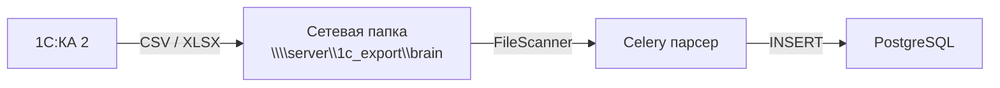
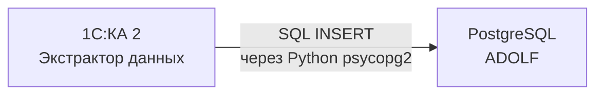

**Проект:** ADOLF — Финансовый учёт и управленческая аналитика\
**Модуль:** CFO, Logistic\
**Версия:** 2.0\
**Дата:** Февраль 2026\
**Заменяет:** Приложение А1 v1.0 (Перечень отчётов из 1С:КА 2)

---

## Назначение документа

Приложение содержит полный реестр запросов для автоматической выгрузки данных из 1С:Комплексная автоматизация 2 (далее — 1С:КА 2) в базу данных PostgreSQL системы ADOLF.

Передача данных выполняется инструментом **«Экстрактор данных 1С»** (Infostart #1970328) — внешней обработкой (.epf), которая выполняет произвольные запросы через конструктор запросов 1С и записывает результат напрямую в PostgreSQL.

<Note>
Для подрядчика (программист 1С) система ADOLF именуется **BRAIN**. Все таблицы в PostgreSQL используют префикс `brain_`.
</Note>

---

## Архитектура передачи данных

### Было (v1.0): файловый обмен



Недостатки: промежуточные файлы, парсеры для каждого формата, задержки, ручные ошибки, мониторинг файловой системы.

### Стало (v2.0): прямая запись в PostgreSQL



Преимущества: нет промежуточных файлов, нет парсеров, нет файлового мониторинга, данные доступны мгновенно, типизация на стороне 1С.

### Компоненты

| Компонент | Роль |
|-----------|------|
| Экстрактор данных 1С (.epf) | Выполняет запросы по расписанию, пишет результат в PostgreSQL |
| Python 3.8+ psycopg2 | Драйвер подключения к PostgreSQL (устанавливается на сервере 1С) |
| PostgreSQL (ADOLF) | Целевая БД, таблицы с префиксом `brain_` |
| Конструктор запросов 1С | Среда создания произвольных запросов к объектам метаданных |

### Параметры подключения

| Параметр | Значение |
|----------|----------|
| Тип подключения | PostgreSQL |
| Хост | \{ADOLF\_PG\_HOST\} |
| Порт | 5432 |
| База данных | adolf\_db |
| Пользователь | brain\_writer (только INSERT, CREATE TABLE) |
| SSL | Да (сертификат CA) |

---

## Реестр запросов

### Обзор

| Группа | Кол-во | Потребители |
|--------|:------:|-------------|
| 1. CFO — бухгалтерские регистры | 5 | CFO |
| 2. Logistic — остатки и документы | 4 | Logistic |
| 3. Справочники (общие) | 4 | CFO, Logistic, Scout, Marketing |
| 4. Документы | 3 | CFO |
| 5. Расширенная аналитика | 2 | CFO, Logistic |
| **Итого** | **18** | |

---

## Группа 1. CFO — бухгалтерские регистры

<Info>
Обходное решение для замены расчётного отчёта «Валовая прибыль предприятия». Вместо одного агрегированного отчёта — набор запросов к виртуальным таблицам регистра бухучёта, с расчётом маржи на стороне ADOLF.
</Info>

### Q-01: Выручка и себестоимость по номенклатуре

| Параметр | Значение |
|----------|----------|
| Таблица PostgreSQL | `brain_account_turns_90` |
| Источник 1С | РегистрБухгалтерии.Хозрасчетный.ОборотыДтКт() |
| Счета | 90.01.1 (выручка), 90.02.1 (себестоимость продаж) |
| Аналитика (субконто) | Номенклатура, Контрагент |
| Периодичность | Еженедельно, понедельник 07:00 OMS |
| Глубина | Текущий месяц (скользящее окно) |
| Потребитель | CFO: Cost Mapping, P&L по SKU, ABC-анализ |

**Запрос 1С (конструктор):**

```
ВЫБРАТЬ
    ХозрасчетныйОборотыДтКт.СубконтоДт1.Наименование КАК Номенклатура,
    ХозрасчетныйОборотыДтКт.СубконтоДт1.Артикул КАК Артикул,
    ХозрасчетныйОборотыДтКт.СубконтоДт2.Наименование КАК Контрагент,
    ХозрасчетныйОборотыДтКт.СчетДт.Код КАК СчетДт,
    ХозрасчетныйОборотыДтКт.СчетКт.Код КАК СчетКт,
    ХозрасчетныйОборотыДтКт.Организация.Наименование КАК Организация,
    ХозрасчетныйОборотыДтКт.СуммаОборотДт КАК СуммаДт,
    ХозрасчетныйОборотыДтКт.СуммаОборотКт КАК СуммаКт,
    ХозрасчетныйОборотыДтКт.КоличествоОборотДт КАК КоличествоДт,
    ХозрасчетныйОборотыДтКт.Период КАК ПериодРегистратор
ИЗ
    РегистрБухгалтерии.Хозрасчетный.ОборотыДтКт(
        &Дата1, &Дата2, Месяц,
        СчетДт В ИЕРАРХИИ (ЗНАЧЕНИЕ(ПланСчетов.Хозрасчетный.РасходыПоОбычнымВидамДеятельности)),
        ,
        СчетДт.Код В ("90.01.1", "90.02.1"),
        ,
    ) КАК ХозрасчетныйОборотыДтКт
```

**Структура таблицы PostgreSQL:**

| Колонка | Тип | Описание |
|---------|-----|----------|
| period | DATE | Период (месяц) |
| nomenclature | VARCHAR(500) | Наименование номенклатуры |
| article | VARCHAR(100) | Артикул (= SKU для маппинга с МП) |
| counterparty | VARCHAR(500) | Контрагент (WB / Ozon / YM / опт) |
| account_dt | VARCHAR(20) | Счёт дебет |
| account_ct | VARCHAR(20) | Счёт кредит |
| organization | VARCHAR(500) | Организация |
| amount_dt | DECIMAL(15,2) | Сумма оборота Дт |
| amount_ct | DECIMAL(15,2) | Сумма оборота Кт |
| quantity_dt | DECIMAL(15,3) | Количество оборота Дт |
| loaded_at | TIMESTAMP | Время загрузки |

<Tip>
Расчёт маржи на стороне ADOLF: `Выручка = amount_ct WHERE account_ct = '90.01.1'`, `Себестоимость = amount_dt WHERE account_dt = '90.02.1'`, `Маржа = Выручка - Себестоимость`.
</Tip>

---

### Q-02: Коммерческие и управленческие расходы

| Параметр | Значение |
|----------|----------|
| Таблица PostgreSQL | `brain_account_turns_90_expenses` |
| Источник 1С | РегистрБухгалтерии.Хозрасчетный.Обороты() |
| Счета | 90.07.1 (коммерческие расходы), 90.08.1 (управленческие расходы) |
| Периодичность | Ежемесячно, 1-е число 09:00 OMS |
| Глубина | Предыдущий месяц |
| Потребитель | CFO: полный P&L, расчёт операционной прибыли |

**Структура таблицы PostgreSQL:**

| Колонка | Тип | Описание |
|---------|-----|----------|
| period | DATE | Период (месяц) |
| account | VARCHAR(20) | Счёт (90.07.1 или 90.08.1) |
| organization | VARCHAR(500) | Организация |
| amount_debit | DECIMAL(15,2) | Оборот дебет |
| amount_credit | DECIMAL(15,2) | Оборот кредит |
| loaded_at | TIMESTAMP | Время загрузки |

---

### Q-03: Стоимость товарных запасов

| Параметр | Значение |
|----------|----------|
| Таблица PostgreSQL | `brain_account_balance_41` |
| Источник 1С | РегистрБухгалтерии.Хозрасчетный.Остатки() |
| Счёт | 41 (Товары) |
| Аналитика | Номенклатура |
| Периодичность | Ежемесячно, 1-е число 09:30 OMS |
| Глубина | Остатки на конец предыдущего месяца |
| Потребитель | CFO: оценка запасов, оборачиваемость, неликвиды |

**Структура таблицы PostgreSQL:**

| Колонка | Тип | Описание |
|---------|-----|----------|
| balance_date | DATE | Дата остатка |
| nomenclature | VARCHAR(500) | Наименование |
| article | VARCHAR(100) | Артикул |
| organization | VARCHAR(500) | Организация |
| amount_balance | DECIMAL(15,2) | Сальдо (сумма) |
| quantity_balance | DECIMAL(15,3) | Сальдо (количество) |
| loaded_at | TIMESTAMP | Время загрузки |

---

### Q-04: Движение денежных средств

| Параметр | Значение |
|----------|----------|
| Таблица PostgreSQL | `brain_account_turns_cash` |
| Источник 1С | РегистрБухгалтерии.Хозрасчетный.Обороты() |
| Счета | 50 (Касса), 51 (Расчётные счета) |
| Периодичность | Еженедельно, понедельник 07:30 OMS |
| Глубина | Текущий месяц |
| Потребитель | CFO: ОДДС (отчёт о движении денежных средств) |

**Структура таблицы PostgreSQL:**

| Колонка | Тип | Описание |
|---------|-----|----------|
| period | DATE | Период |
| account | VARCHAR(20) | Счёт (50 или 51) |
| organization | VARCHAR(500) | Организация |
| amount_debit | DECIMAL(15,2) | Приход |
| amount_credit | DECIMAL(15,2) | Расход |
| loaded_at | TIMESTAMP | Время загрузки |

---

### Q-05: Дебиторская и кредиторская задолженность

| Параметр | Значение |
|----------|----------|
| Таблица PostgreSQL | `brain_account_turns_settlements` |
| Источник 1С | РегистрБухгалтерии.Хозрасчетный.Обороты() |
| Счета | 60 (Расчёты с поставщиками), 62 (Расчёты с покупателями) |
| Аналитика | Контрагент |
| Периодичность | Ежемесячно, 1-е число 10:00 OMS |
| Глубина | Предыдущий месяц |
| Потребитель | CFO: мониторинг ДЗ/КЗ, aging report |

**Структура таблицы PostgreSQL:**

| Колонка | Тип | Описание |
|---------|-----|----------|
| period | DATE | Период |
| account | VARCHAR(20) | Счёт (60 или 62) |
| counterparty | VARCHAR(500) | Контрагент |
| organization | VARCHAR(500) | Организация |
| amount_debit | DECIMAL(15,2) | Оборот Дт |
| amount_credit | DECIMAL(15,2) | Оборот Кт |
| balance_debit | DECIMAL(15,2) | Сальдо Дт (= ДЗ для сч. 62) |
| balance_credit | DECIMAL(15,2) | Сальдо Кт (= КЗ для сч. 60) |
| loaded_at | TIMESTAMP | Время загрузки |

---

## Группа 2. Logistic — остатки и документы

<Info>
Запросы группы 2 заменяют файловый импорт XLSX/XML, описанный в модуле Logistic раздел 5 (1С Integration). FileScanner и FileImportAdapter более не требуются — данные поступают напрямую.
</Info>

### Q-06: Остатки товаров на складах

| Параметр | Значение |
|----------|----------|
| Таблица PostgreSQL | `brain_stock_balance` |
| Источник 1С | РегистрНакопления.ТоварыНаСкладах.Остатки() |
| Периодичность | Ежедневно, 06:00 OMS |
| Глубина | Остатки на текущую дату |
| Потребитель | Logistic: Stock Monitor (dual-source), CFO: оценка запасов |

**Структура таблицы PostgreSQL:**

| Колонка | Тип | Описание |
|---------|-----|----------|
| balance_date | DATE | Дата остатка |
| nomenclature | VARCHAR(500) | Наименование |
| article | VARCHAR(100) | Артикул (= offer_id Ozon) |
| warehouse | VARCHAR(200) | Склад |
| quantity | DECIMAL(15,3) | Количество (шт) |
| loaded_at | TIMESTAMP | Время загрузки |

<Warning>
Таблица `brain_stock_balance` является заменой файлового импорта для Logistic Stock Monitor. Поле `article` используется для маппинга article → offer_id → ozon_sku.
</Warning>

---

### Q-07: Заказы клиентов (незакрытые)

| Параметр | Значение |
|----------|----------|
| Таблица PostgreSQL | `brain_customer_orders` |
| Источник 1С | Документ.ЗаказКлиента с ТЧ Товары |
| Фильтр | Статус ≠ Закрыт |
| Периодичность | Ежедневно, 06:15 OMS |
| Потребитель | Logistic: прогноз спроса, Supply Task Engine |

**Структура таблицы PostgreSQL:**

| Колонка | Тип | Описание |
|---------|-----|----------|
| order_number | VARCHAR(50) | Номер заказа |
| order_date | TIMESTAMP | Дата заказа |
| counterparty | VARCHAR(500) | Контрагент |
| article | VARCHAR(100) | Артикул товара |
| nomenclature | VARCHAR(500) | Наименование |
| quantity | DECIMAL(15,3) | Количество |
| price | DECIMAL(15,2) | Цена |
| amount | DECIMAL(15,2) | Сумма |
| status | VARCHAR(50) | Статус документа |
| desired_date | DATE | Желаемая дата отгрузки |
| loaded_at | TIMESTAMP | Время загрузки |

---

### Q-08: Заказы поставщикам (открытые)

| Параметр | Значение |
|----------|----------|
| Таблица PostgreSQL | `brain_supplier_orders` |
| Источник 1С | Документ.ЗаказПоставщику с ТЧ Товары |
| Фильтр | Статус ≠ Закрыт |
| Периодичность | Ежедневно, 06:30 OMS |
| Потребитель | Logistic: план закупок, товар в пути |

**Структура таблицы PostgreSQL:**

| Колонка | Тип | Описание |
|---------|-----|----------|
| order_number | VARCHAR(50) | Номер заказа |
| order_date | TIMESTAMP | Дата заказа |
| supplier | VARCHAR(500) | Поставщик |
| article | VARCHAR(100) | Артикул товара |
| nomenclature | VARCHAR(500) | Наименование |
| quantity | DECIMAL(15,3) | Заказано |
| quantity_received | DECIMAL(15,3) | Получено |
| price | DECIMAL(15,2) | Цена |
| expected_date | DATE | Ожидаемая дата поставки |
| status | VARCHAR(50) | Статус документа |
| loaded_at | TIMESTAMP | Время загрузки |

---

### Q-09: Поступления товаров за период

| Параметр | Значение |
|----------|----------|
| Таблица PostgreSQL | `brain_goods_receipts` |
| Источник 1С | Документ.ПоступлениеТоваровУслуг с ТЧ Товары |
| Периодичность | Ежедневно, 06:45 OMS |
| Глубина | 7 дней назад |
| Потребитель | Logistic: фактические приходы, скорость пополнения |

**Структура таблицы PostgreSQL:**

| Колонка | Тип | Описание |
|---------|-----|----------|
| document_number | VARCHAR(50) | Номер документа |
| document_date | TIMESTAMP | Дата документа |
| supplier | VARCHAR(500) | Поставщик |
| article | VARCHAR(100) | Артикул товара |
| nomenclature | VARCHAR(500) | Наименование |
| quantity | DECIMAL(15,3) | Количество |
| price | DECIMAL(15,2) | Цена |
| amount | DECIMAL(15,2) | Сумма |
| warehouse | VARCHAR(200) | Склад-получатель |
| loaded_at | TIMESTAMP | Время загрузки |

---

## Группа 3. Справочники (общие)

<Info>
Справочники обновляются еженедельно. Стратегия записи: TRUNCATE + INSERT (полная перезапись). Это исключает проблему удалённых записей и не требует отслеживания изменений.
</Info>

### Q-10: Номенклатура

| Параметр | Значение |
|----------|----------|
| Таблица PostgreSQL | `brain_nomenclature` |
| Источник 1С | Справочник.Номенклатура |
| Периодичность | Еженедельно, понедельник 05:00 OMS |
| Потребители | CFO, Logistic, Scout, Marketing |

**Структура таблицы PostgreSQL:**

| Колонка | Тип | Описание |
|---------|-----|----------|
| uid | VARCHAR(36) | GUID элемента 1С |
| article | VARCHAR(100) | Артикул |
| name | VARCHAR(500) | Наименование |
| kind | VARCHAR(200) | Вид номенклатуры (= бренд: Охана Маркет / Охана Кидс) |
| unit | VARCHAR(20) | Единица измерения |
| is_group | BOOLEAN | Это группа (папка) |
| parent_name | VARCHAR(500) | Родительская группа |
| barcode | VARCHAR(50) | Штрихкод (EAN-13), если заполнен |
| loaded_at | TIMESTAMP | Время загрузки |

---

### Q-11: Контрагенты

| Параметр | Значение |
|----------|----------|
| Таблица PostgreSQL | `brain_counterparties` |
| Источник 1С | Справочник.Контрагенты |
| Периодичность | Еженедельно, понедельник 05:15 OMS |
| Потребитель | CFO |

**Структура таблицы PostgreSQL:**

| Колонка | Тип | Описание |
|---------|-----|----------|
| uid | VARCHAR(36) | GUID элемента 1С |
| name | VARCHAR(500) | Наименование |
| inn | VARCHAR(12) | ИНН |
| kpp | VARCHAR(9) | КПП |
| is_group | BOOLEAN | Это группа |
| parent_name | VARCHAR(500) | Родительская группа |
| loaded_at | TIMESTAMP | Время загрузки |

---

### Q-12: Договоры контрагентов

| Параметр | Значение |
|----------|----------|
| Таблица PostgreSQL | `brain_contracts` |
| Источник 1С | Справочник.ДоговорыКонтрагентов |
| Периодичность | Ежемесячно, 1-е число 05:00 OMS |
| Потребитель | CFO |

**Структура таблицы PostgreSQL:**

| Колонка | Тип | Описание |
|---------|-----|----------|
| uid | VARCHAR(36) | GUID элемента 1С |
| number | VARCHAR(50) | Номер договора |
| counterparty | VARCHAR(500) | Контрагент |
| organization | VARCHAR(500) | Организация |
| contract_type | VARCHAR(100) | Тип (с поставщиком / с клиентом) |
| valid_from | DATE | Дата начала |
| valid_to | DATE | Дата окончания |
| status | VARCHAR(50) | Статус |
| loaded_at | TIMESTAMP | Время загрузки |

---

### Q-13: Цены номенклатуры

| Параметр | Значение |
|----------|----------|
| Таблица PostgreSQL | `brain_nomenclature_prices` |
| Источник 1С | РегистрСведений.ЦеныНоменклатуры.СрезПоследних() |
| Периодичность | Еженедельно, понедельник 05:30 OMS |
| Потребители | Marketing, Scout |

**Структура таблицы PostgreSQL:**

| Колонка | Тип | Описание |
|---------|-----|----------|
| article | VARCHAR(100) | Артикул |
| nomenclature | VARCHAR(500) | Наименование |
| price_type | VARCHAR(200) | Тип цены (оптовая / розничная / закупочная) |
| price | DECIMAL(15,2) | Цена |
| currency | VARCHAR(3) | Валюта |
| valid_from | DATE | Дата установки |
| loaded_at | TIMESTAMP | Время загрузки |

---

## Группа 4. Документы

### Q-14: Реализации товаров

| Параметр | Значение |
|----------|----------|
| Таблица PostgreSQL | `brain_sales` |
| Источник 1С | Документ.РеализацияТоваровУслуг с ТЧ Товары |
| Периодичность | Ежедневно, 07:00 OMS |
| Глубина | 7 дней назад |
| Потребитель | CFO: реестр отгрузок, сверка с маркетплейсами |

**Структура таблицы PostgreSQL:**

| Колонка | Тип | Описание |
|---------|-----|----------|
| document_number | VARCHAR(50) | Номер документа |
| document_date | TIMESTAMP | Дата документа |
| counterparty | VARCHAR(500) | Контрагент |
| organization | VARCHAR(500) | Организация |
| article | VARCHAR(100) | Артикул |
| nomenclature | VARCHAR(500) | Наименование |
| quantity | DECIMAL(15,3) | Количество |
| price | DECIMAL(15,2) | Цена |
| amount | DECIMAL(15,2) | Сумма |
| vat_rate | VARCHAR(10) | Ставка НДС |
| loaded_at | TIMESTAMP | Время загрузки |

---

### Q-15: Возвраты от клиентов

| Параметр | Значение |
|----------|----------|
| Таблица PostgreSQL | `brain_returns` |
| Источник 1С | Документ.ВозвратТоваровОтКлиента с ТЧ Товары |
| Периодичность | Еженедельно, понедельник 07:15 OMS |
| Глубина | 14 дней назад |
| Потребитель | CFO: анализ возвратов, корректировка P&L |

**Структура таблицы PostgreSQL:**

| Колонка | Тип | Описание |
|---------|-----|----------|
| document_number | VARCHAR(50) | Номер документа |
| document_date | TIMESTAMP | Дата документа |
| counterparty | VARCHAR(500) | Контрагент |
| article | VARCHAR(100) | Артикул |
| nomenclature | VARCHAR(500) | Наименование |
| quantity | DECIMAL(15,3) | Количество |
| amount | DECIMAL(15,2) | Сумма |
| reason | VARCHAR(500) | Причина возврата |
| loaded_at | TIMESTAMP | Время загрузки |

---

### Q-16: Инвентаризация

| Параметр | Значение |
|----------|----------|
| Таблица PostgreSQL | `brain_inventory_audit` |
| Источник 1С | Документ.ПересчетТоваров с ТЧ Товары |
| Периодичность | Ежеквартально, 1-е число квартала 09:00 OMS |
| Потребитель | CFO: аудит запасов, расхождения |

**Структура таблицы PostgreSQL:**

| Колонка | Тип | Описание |
|---------|-----|----------|
| document_number | VARCHAR(50) | Номер документа |
| document_date | TIMESTAMP | Дата документа |
| warehouse | VARCHAR(200) | Склад |
| article | VARCHAR(100) | Артикул |
| nomenclature | VARCHAR(500) | Наименование |
| quantity_accounting | DECIMAL(15,3) | Количество учётное |
| quantity_actual | DECIMAL(15,3) | Количество фактическое |
| deviation | DECIMAL(15,3) | Отклонение |
| loaded_at | TIMESTAMP | Время загрузки |

---

## Группа 5. Расширенная аналитика

### Q-17: Цены поставщиков

| Параметр | Значение |
|----------|----------|
| Таблица PostgreSQL | `brain_supplier_prices` |
| Источник 1С | РегистрСведений.ЦеныПоставщиков.СрезПоследних() |
| Периодичность | Еженедельно, понедельник 05:45 OMS |
| Потребитель | CFO: мониторинг закупочных цен |

**Структура таблицы PostgreSQL:**

| Колонка | Тип | Описание |
|---------|-----|----------|
| supplier | VARCHAR(500) | Поставщик |
| article | VARCHAR(100) | Артикул |
| nomenclature | VARCHAR(500) | Наименование |
| price | DECIMAL(15,2) | Цена поставщика |
| currency | VARCHAR(3) | Валюта |
| valid_from | DATE | Дата установки |
| loaded_at | TIMESTAMP | Время загрузки |

---

### Q-18: Движения товаров (приход/расход)

| Параметр | Значение |
|----------|----------|
| Таблица PostgreSQL | `brain_stock_turnover` |
| Источник 1С | РегистрНакопления.ТоварыНаСкладах.Обороты() |
| Периодичность | Ежедневно, 06:50 OMS |
| Глубина | 7 дней назад |
| Потребитель | CFO, Logistic: аналитика оборачиваемости |

**Структура таблицы PostgreSQL:**

| Колонка | Тип | Описание |
|---------|-----|----------|
| period | DATE | Период |
| article | VARCHAR(100) | Артикул |
| nomenclature | VARCHAR(500) | Наименование |
| warehouse | VARCHAR(200) | Склад |
| quantity_receipt | DECIMAL(15,3) | Приход (шт) |
| quantity_expense | DECIMAL(15,3) | Расход (шт) |
| amount_receipt | DECIMAL(15,2) | Приход (сумма) |
| amount_expense | DECIMAL(15,2) | Расход (сумма) |
| loaded_at | TIMESTAMP | Время загрузки |

---

## Сводное расписание

### Таблица расписания

| Время OMS | Пн | Вт–Пт | 1-е число месяца | 1-е число квартала |
|:---------:|:--:|:------:|:---------:|:------------------:|
| 05:00 | Q-10, Q-11 | — | Q-12 | Q-12 |
| 05:30 | Q-13, Q-17 | — | — | — |
| 06:00 | Q-06 | Q-06 | Q-06 | Q-06 |
| 06:15 | Q-07 | Q-07 | Q-07 | Q-07 |
| 06:30 | Q-08 | Q-08 | Q-08 | Q-08 |
| 06:45 | Q-09 | Q-09 | Q-09 | Q-09 |
| 06:50 | Q-18 | Q-18 | Q-18 | Q-18 |
| 07:00 | Q-01, Q-14 | Q-14 | Q-01, Q-14 | Q-01, Q-14 |
| 07:15 | Q-15 | — | Q-15 | Q-15 |
| 07:30 | Q-04 | — | Q-04 | Q-04 |
| 09:00 | — | — | Q-02, Q-03 | Q-02, Q-03, Q-16 |
| 10:00 | — | — | Q-05 | Q-05 |

### Статистика по периодичности

| Периодичность | Запросы | Кол-во |
|---------------|---------|:------:|
| Ежедневно | Q-06, Q-07, Q-08, Q-09, Q-14, Q-18 | 6 |
| Еженедельно (Пн) | Q-01, Q-04, Q-10, Q-11, Q-13, Q-15, Q-17 | 7 |
| Ежемесячно (1-е число) | Q-02, Q-03, Q-05, Q-12 | 4 |
| Ежеквартально | Q-16 | 1 |
| **Итого** | | **18** |

---

## Матрица покрытия модулей ADOLF

| Модуль ADOLF | Запросы | Назначение |
|--------------|---------|------------|
| **CFO** | Q-01, Q-02, Q-03, Q-04, Q-05, Q-10, Q-11, Q-12, Q-14, Q-15, Q-16, Q-17, Q-18 | P&L, себестоимость, ОДДС, ДЗ/КЗ, оценка запасов |
| **Logistic** | Q-06, Q-07, Q-08, Q-09, Q-10, Q-18 | Остатки внутреннего склада, заказы, поступления, оборачиваемость |
| **Scout** | Q-10, Q-13 | Номенклатура, розничные цены для расчёта Unit-экономики |
| **Marketing** | Q-10, Q-13 | Номенклатура, типы цен для оптимизации рекламы |

---

## Особенности базы данных заказчика

| Параметр | Статус | Влияние |
|----------|--------|---------|
| Номенклатурные группы | Не ведутся | Группировка по «Вид номенклатуры» (= бренд) |
| Группы аналитического учёта | Не ведутся | ABC-классификация средствами ADOLF |
| Штрихкоды при оптовой продаже | Не указываются | Маппинг по артикулу (article), не по штрихкоду |
| Разбивка выручки по каналам | Отсутствует в сч. 90.01.1 | Разделение опт/МП через фильтрацию по контрагенту |
| Организации | 2 юрлица: ООО Охана Маркет + ООО ТК Рея | Запросы с фильтром «Все организации» для консолидации |

---

## Инструмент: Экстрактор данных 1С

| Параметр | Значение |
|----------|----------|
| Публикация Infostart | [#1970328](https://infostart.ru/marketplace/1970328/) |
| Тип | Внешняя обработка (.epf), код открыт |
| Версия | 1.3.8.4 |
| Совместимость с КА 2 | Проверена на 2.5.20.91 |
| Лицензия | «Экстрактор 1С» (18 000 ₽, полная с PostgreSQL) |
| Обновления | 12 000 ₽/год |
| Техподдержка | 1 мес. бесплатно при покупке |
| Требования | Python 3.8+, psycopg2 на сервере 1С |

### Настройка в Экстракторе

Для каждого запроса Q-01 — Q-18 создаётся отдельная строка в таблице запросов обработки:

| Поле Экстрактора | Значение |
|-------------------|----------|
| Имя таблицы | `brain_\{table_name\}` |
| Тип подключения | PostgreSQL |
| Текст запроса | Из конструктора запросов (описан в каждом Q-xx) |
| Период | Параметры &Дата1, &Дата2 |
| Количество дней назад | Зависит от запроса (1, 7, 30) |
| Фоновая выгрузка | Включена (номер запроса 1–10 для основных) |

<Warning>
Ограничение Экстрактора: поддерживается до 10 фоновых заданий с индивидуальным расписанием. При 18 запросах необходимо группировать запросы с одинаковым расписанием в пакеты или использовать команду «Фоновая выгрузка (все настройки)» с общим расписанием.
</Warning>

---

## Влияние на существующие модули

### CFO: Data Ingestion (Раздел 2)

| Компонент | Статус | Комментарий |
|-----------|:------:|-------------|
| CSVParser | Удалить | Заменён прямой записью в PostgreSQL |
| ExcelParser (маркетплейсы) | Без изменений | Excel-отчёты МП загружаются вручную, не из 1С |
| CostPriceParser | Удалить | Себестоимость из Q-01 (обороты сч. 90.02.1) |
| Normalizer, Validator | Упростить | Валидация на стороне запроса 1С |
| `/data/inbox/cfo/costs/` | Удалить | Директория CSV из 1С больше не нужна |

### Logistic: 1С Integration (Раздел 5)

| Компонент | Статус | Комментарий |
|-----------|:------:|-------------|
| FileScanner | Удалить | Мониторинг директории не нужен |
| FileImportAdapter (XLSX/XML) | Удалить | Заменён прямой записью Q-06 |
| ImportValidator | Перенести | Валидация маппинга article → offer_id остаётся |
| ImportService (upsert) | Упростить | Данные уже в PostgreSQL, только маппинг |
| SFTP / сетевая папка | Удалить | Промежуточное хранилище не нужно |

---

## Связанные документы

| Документ | Описание |
|----------|----------|
| [Приложение А2: Настройка выгрузки «Валовая прибыль»](/cfo/adolf_cfo_a2_1c_setup_guide) | Ручная настройка (резервный вариант) |
| [Приложение А3: Анализ инструментов Infostart](/cfo/adolf_cfo_a3_infostart_analysis) | Сравнительный анализ решений |
| [Раздел 2: Data Ingestion](/cfo/adolf_cfo_2_data_ingestion) | Архитектура сбора данных CFO |
| [Раздел 5: Database](/cfo/adolf_cfo_5_database) | Схема БД CFO |
| [Logistic Раздел 3: Stock Monitor](/logistic/adolf_logistic_3_stock_monitor) | Мониторинг остатков |
| [Logistic Раздел 5: 1С Integration](/logistic/adolf_logistic_5_1c_integration) | Интеграция Logistic с 1С |
| Экстрактор данных 1С | [infostart.ru/marketplace/1970328](https://infostart.ru/marketplace/1970328/) |

---

**Документ подготовлен:** Февраль 2026\
**Версия:** 2.0\
**Статус:** Актуальная версия
