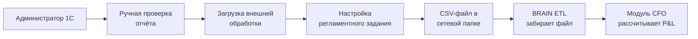
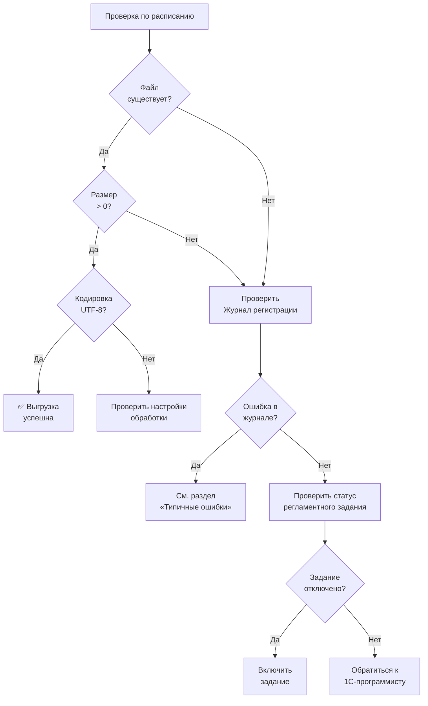

**Проект:** ADOLF — Финансовый учёт и управленческая аналитика\
**Модуль:** CFO\
**Версия:** 1.0\
**Дата:** Февраль 2026

---

## Назначение документа

Пошаговая инструкция для администратора 1С:Комплексная автоматизация 2 по настройке автоматической выгрузки отчёта **«Валовая прибыль предприятия»**. Инструкция охватывает три этапа: ручное формирование отчёта для проверки, загрузка внешней обработки и настройка регламентного задания.

Отчёт используется модулем CFO в двух режимах:

| Режим | Периодичность | Код файла BRAIN | Назначение |
|-------|---------------|-----------------|------------|
| Себестоимость по номенклатуре | Еженедельно (Пн) | `cost_prices` | Cost Mapping — сопоставление выручки с себестоимостью |
| Финансовый итог за месяц | Ежемесячно (1-е число) | `financial_summary` | P&L — выручка, себестоимость, валовая прибыль по контрагентам |

---

## Общая схема процесса



---

## Этап 1. Ручное формирование отчёта

<Info>Цель этапа — убедиться, что отчёт формируется корректно и содержит нужные данные, прежде чем настраивать автоматическую выгрузку.</Info>

<Steps>

<Step title="Открыть отчёт">

Перейдите в меню:

**Финансовый результат и контроллинг → Отчёты → Валовая прибыль предприятия**

Откроется форма настройки отчёта.

</Step>

<Step title="Установить период">

В верхней части формы отчёта задайте период:

| Параметр | Еженедельная выгрузка (себестоимость) | Ежемесячная выгрузка (P&L) |
|----------|---------------------------------------|----------------------------|
| Период | Текущий месяц | Прошлый календарный месяц |
| Пример | 01.02.2026 — 28.02.2026 | 01.01.2026 — 31.01.2026 |

</Step>

<Step title="Указать организацию">

В поле **«Организация»** оставьте значение **«Все организации»** (или пустое). Это обеспечит консолидацию данных по обоим юридическим лицам (ООО «Охана Маркет» и ООО ТК «Рея»).

<Warning>
Если указать конкретную организацию, отчёт покажет данные только по одному юрлицу. Для корректного P&L необходима консолидация.
</Warning>

</Step>

<Step title="Настроить группировку строк">

Нажмите кнопку **«Настройки»** (или значок шестерёнки) в панели отчёта. Перейдите на вкладку **«Группировка»**.

**Для еженедельной выгрузки** (себестоимость по номенклатуре):

| Уровень | Поле группировки |
|:-------:|------------------|
| 1 | Номенклатура |

**Для ежемесячной выгрузки** (P&L по контрагентам):

| Уровень | Поле группировки |
|:-------:|------------------|
| 1 | Контрагент |

</Step>

<Step title="Настроить показатели (колонки)">

На вкладке **«Показатели»** убедитесь, что включены:

**Еженедельная выгрузка:**

| Показатель | Обязательный | Описание |
|------------|:------------:|----------|
| Себестоимость | Да | Себестоимость единицы товара |
| Номенклатура | Да | Наименование товара |
| Количество | Да | Количество проданных единиц |

**Ежемесячная выгрузка:**

| Показатель | Обязательный | Описание |
|------------|:------------:|----------|
| Выручка | Да | Сумма продаж |
| Себестоимость продаж | Да | COGS |
| Валовая прибыль | Да | Выручка − Себестоимость |
| Рентабельность % | Нет | Процент маржи |

</Step>

<Step title="Сформировать и проверить">

Нажмите кнопку **«Сформировать»**. Проверьте результат:

**Контрольные точки:**

| Что проверить | Как |
|---------------|-----|
| Данные не пустые | В таблице есть строки с ненулевыми значениями |
| Организации | Присутствуют данные обоих юрлиц (если выбрано «Все организации») |
| Период корректен | Заголовок отчёта содержит правильные даты |
| Номенклатура / Контрагенты | Строки сгруппированы по выбранному полю |
| Итоговая строка | Сумма по колонке «Выручка» соответствует ожиданиям |

</Step>

<Step title="Пробное сохранение в CSV">

Выполните ручное сохранение для проверки формата:

1. В меню отчёта нажмите **«Ещё» → «Сохранить как...»** (или **Ctrl+Shift+S**)
2. В диалоге выберите формат: **«Текстовый документ (разделители — точки с запятой) (\*.csv)»**
3. Укажите имя файла: `cost_prices_2026-02-14.csv`
4. Укажите путь: `\\server\1c_export\brain\weekly\cost_prices\`
5. Кодировка: **UTF-8**
6. Нажмите **«Сохранить»**

Откройте файл в текстовом редакторе (не в Excel!) и проверьте:

```csv
sku;product_name;cost_price;currency;valid_from;brand_id
OM-12345;Платье летнее синее;1200.00;RUB;2026-02-14;Охана Маркет
OM-12346;Блузка офисная;800.00;RUB;2026-02-14;Охана Маркет
OK-54321;Футболка детская;450.00;RUB;2026-02-14;Охана Кидс
```

<Warning>
Убедитесь, что разделитель — **точка с запятой** (;), а не запятая. Кодировка — **UTF-8**, а не Windows-1251. Модуль CFO ожидает именно такой формат (см. [Приложение А1](/cfo/adolf_cfo_a1_1c_reports)).
</Warning>

</Step>

</Steps>

---

## Этап 2. Загрузка внешней обработки

<Info>
Внешняя обработка — это файл с расширением `.epf`, подготовленный 1С-программистом. Она автоматически формирует отчёт с нужными параметрами и сохраняет результат в CSV. Задача администратора — загрузить обработку в систему.
</Info>

<Steps>

<Step title="Получить файл обработки">

Запросите у 1С-программиста файл внешней обработки `BRAIN_Export.epf`. Файл должен быть подготовлен в соответствии с регламентом выгрузок (см. [Приложение А1](/cfo/adolf_cfo_a1_1c_reports)).

<Note>
Для создания обработки передайте программисту следующий документ: `brain_1c_ka2_exports_registry` — он содержит все параметры отчётов, колонки CSV и примеры выходных файлов.
</Note>

</Step>

<Step title="Открыть справочник обработок">

Перейдите в меню:

**НСИ и администрирование → Администрирование → Печатные формы, отчёты и обработки → Дополнительные отчёты и обработки**

</Step>

<Step title="Добавить обработку">

1. Нажмите кнопку **«Создать»**
2. В открывшейся карточке нажмите **«Загрузить из файла...»**
3. Выберите файл `BRAIN_Export.epf`
4. Заполните карточку:

| Поле | Значение |
|------|----------|
| Наименование | BRAIN: Автовыгрузка данных |
| Размещение | Вызывать из регламентного задания |
| Использование | ✅ Включено |

5. Нажмите **«Записать и закрыть»**

</Step>

<Step title="Проверить загрузку">

Найдите обработку в списке «Дополнительные отчёты и обработки». Убедитесь, что статус — **«Включено»** и тип размещения — **«Регламентное задание»**.

</Step>

</Steps>

---

## Этап 3. Настройка регламентных заданий

<Info>
Регламентные задания — механизм 1С для автоматического запуска обработок по расписанию. Для отчёта «Валовая прибыль предприятия» настраиваются два задания: еженедельное и ежемесячное.
</Info>

<Steps>

<Step title="Открыть список регламентных заданий">

Перейдите в меню:

**НСИ и администрирование → Администрирование → Обслуживание → Регламентные и фоновые задания**

</Step>

<Step title="Создать задание для еженедельной выгрузки себестоимости">

Нажмите **«Создать»** и заполните параметры:

| Параметр | Значение |
|----------|----------|
| Наименование | BRAIN: Себестоимость |
| Код | `BRAIN_Weekly_Costs` |
| Обработка | BRAIN: Автовыгрузка данных |
| Команда обработки | `ExportCostPrices` |
| Использование | ✅ Включено |

**Расписание:**

| Параметр | Значение |
|----------|----------|
| Период повтора | Еженедельно |
| День недели | Понедельник |
| Время начала | 07:00 |
| Часовой пояс | OMS (Омск, UTC+6) |

**Параметры выгрузки** (передаются обработке):

| Параметр | Значение |
|----------|----------|
| Отчёт | Валовая прибыль предприятия |
| Период | Текущий месяц |
| Группировка | Номенклатура |
| Организация | Все организации |
| Формат | CSV (UTF-8, разделитель ;) |
| Путь | `\\server\1c_export\brain\weekly\cost_prices\` |
| Шаблон имени | `cost_prices_\{ГГГГ-ММ-ДД\}.csv` |

Нажмите **«Записать и закрыть»**.

</Step>

<Step title="Создать задание для ежемесячной выгрузки P&L">

Нажмите **«Создать»** и заполните параметры:

| Параметр | Значение |
|----------|----------|
| Наименование | BRAIN: Валовая прибыль |
| Код | `BRAIN_Monthly_Profit` |
| Обработка | BRAIN: Автовыгрузка данных |
| Команда обработки | `ExportFinancialSummary` |
| Использование | ✅ Включено |

**Расписание:**

| Параметр | Значение |
|----------|----------|
| Период повтора | Ежемесячно |
| День месяца | 1-е число |
| Время начала | 09:00 |
| Часовой пояс | OMS (Омск, UTC+6) |

**Параметры выгрузки:**

| Параметр | Значение |
|----------|----------|
| Отчёт | Валовая прибыль предприятия |
| Период | Прошлый месяц (полностью) |
| Группировка | Контрагент |
| Организация | Все организации |
| Показатели | Выручка, Себестоимость продаж, Валовая прибыль, Рентабельность % |
| Формат | CSV (UTF-8, разделитель ;) |
| Путь | `\\server\1c_export\brain\monthly\financial_summary\` |
| Шаблон имени | `financial_summary_\{ГГГГ-ММ-ДД\}.csv` |

Нажмите **«Записать и закрыть»**.

</Step>

<Step title="Проверить список заданий">

В списке регламентных заданий должны появиться:

| Наименование | Расписание | Статус |
|--------------|------------|:------:|
| BRAIN: Себестоимость | Пн 07:00 | ✅ Включено |
| BRAIN: Валовая прибыль | 1-е число 09:00 | ✅ Включено |

</Step>

</Steps>

---

## Этап 4. Тестовый запуск

<Steps>

<Step title="Запустить задание вручную">

1. В списке регламентных заданий выделите **«BRAIN: Себестоимость»**
2. Нажмите правую кнопку мыши → **«Выполнить сейчас»**
3. Дождитесь завершения (обычно 30–120 секунд)

</Step>

<Step title="Проверить результат">

Откройте сетевую папку `\\server\1c_export\brain\weekly\cost_prices\` и убедитесь:

| Что проверить | Ожидание |
|---------------|----------|
| Файл создан | `cost_prices_2026-02-14.csv` |
| Размер файла | Больше 0 (обычно 50–500 КБ) |
| Кодировка | UTF-8 (кириллица читается без иероглифов) |
| Разделитель | Точка с запятой (;) |
| Заголовки | `sku;product_name;cost_price;currency;valid_from;brand_id` |
| Данные | Строки с артикулами, наименованиями и ценами |

</Step>

<Step title="Проверить Журнал регистрации">

Перейдите в меню:

**НСИ и администрирование → Администрирование → Журнал регистрации**

Установите фильтр:

| Параметр фильтра | Значение |
|-------------------|----------|
| Событие | `BRAIN.Выгрузка` |
| Период | Сегодня |

Должна быть запись с уровнем **«Информация»** и комментарием, содержащим путь к файлу и количество выгруженных строк.

<Warning>
Если запись имеет уровень **«Ошибка»** — см. раздел «Типичные ошибки».
</Warning>

</Step>

</Steps>

---

## Этап 5. Контроль выполнения

После настройки автоматических выгрузок рекомендуется периодически проверять их работоспособность.

### Ежедневный контроль (первые 2 недели)

| Время | Действие |
|:-----:|----------|
| 07:30 (по понедельникам) | Проверить наличие файла `cost_prices_*.csv` в папке `weekly\cost_prices\` |
| 09:30 (1-е число) | Проверить наличие файла `financial_summary_*.csv` в папке `monthly\financial_summary\` |

### Еженедельный контроль (в рабочем режиме)

| Что проверить | Где | Как |
|---------------|-----|-----|
| Файлы созданы | Сетевая папка | Файл с текущей датой существует, размер &gt; 0 |
| Журнал регистрации | 1С → Журнал регистрации | Нет записей с уровнем «Ошибка» по событию `BRAIN.Выгрузка` |
| Файлы забраны | Сетевая папка | Модуль CFO перемещает обработанные файлы в подпапку `processed\` |

### Схема мониторинга



---

## Типичные ошибки и решения

### Ошибка: файл не создаётся

| Возможная причина | Диагностика | Решение |
|-------------------|-------------|---------|
| Регламентное задание отключено | Проверить статус в списке рег. заданий | Включить задание (флажок «Использование») |
| Сетевая папка недоступна | Попробовать зайти в `\\server\1c_export\brain\` из Проводника на сервере 1С | Проверить сетевой доступ, права учётной записи службы 1С |
| Нет прав на запись | Попробовать создать тестовый файл в целевой папке | Выдать права на запись учётной записи, от которой запущен сервер 1С |
| Обработка не загружена | Проверить «Дополнительные отчёты и обработки» | Повторно загрузить `.epf` файл |

### Ошибка: файл пустой или содержит только заголовки

| Возможная причина | Диагностика | Решение |
|-------------------|-------------|---------|
| Не проведены документы за период | Сформировать отчёт вручную за тот же период | Провести документы реализации, дождаться закрытия месяца |
| Неверный период в параметрах | Проверить параметры регламентного задания | Скорректировать период (текущий месяц / прошлый месяц) |
| Фильтр по организации | Проверить параметр «Организация» | Установить «Все организации» |

### Ошибка: кодировка Windows-1251 вместо UTF-8

| Возможная причина | Диагностика | Решение |
|-------------------|-------------|---------|
| Настройки обработки | Открыть CSV в Notepad++ → Кодировки | Передать 1С-программисту — в коде обработки указать `КодировкаТекста.UTF8` |

### Ошибка: разделитель — запятая вместо точки с запятой

| Возможная причина | Диагностика | Решение |
|-------------------|-------------|---------|
| Настройки обработки | Открыть CSV в текстовом редакторе | Передать 1С-программисту — в коде обработки указать разделитель `;` |

### Ошибка: «Недостаточно прав» в Журнале регистрации

| Возможная причина | Диагностика | Решение |
|-------------------|-------------|---------|
| Роль пользователя 1С | Проверить, от какого пользователя запускается рег. задание | Назначить пользователю роль с правом чтения отчёта «Валовая прибыль предприятия» (минимум — роль «Просмотр финансовых результатов») |

---

## Структура сетевых папок

```
\\server\1c_export\brain\
│
├── weekly\
│   └── cost_prices\
│       ├── cost_prices_2026-02-10.csv      ← еженедельная выгрузка
│       ├── cost_prices_2026-02-03.csv
│       └── processed\                       ← забранные модулем CFO
│           └── cost_prices_2026-01-27.csv
│
├── monthly\
│   └── financial_summary\
│       ├── financial_summary_2026-02-01.csv ← ежемесячная выгрузка
│       └── processed\
│           └── financial_summary_2026-01-01.csv
│
└── archive\
    └── 2026-01\                             ← архив за прошлые месяцы
```

---

## Ожидаемый формат выходных файлов

### cost_prices (еженедельный)

```csv
sku;product_name;cost_price;currency;valid_from;brand_id
OM-12345;Платье летнее синее;1200.00;RUB;2026-02-10;Охана Маркет
OM-12346;Блузка офисная;800.00;RUB;2026-02-10;Охана Маркет
OK-54321;Футболка детская;450.00;RUB;2026-02-10;Охана Кидс
```

Спецификация колонок — см. [Приложение А1, п.4](/cfo/adolf_cfo_a1_1c_reports).

### financial_summary (ежемесячный)

```csv
period_month;counterparty;revenue;cogs;gross_profit;margin_pct
2026-01;Wildberries;5250000.00;3150000.00;2100000.00;40.00
2026-01;Ozon;2800000.00;1680000.00;1120000.00;40.00
2026-01;Яндекс.Маркет;950000.00;570000.00;380000.00;40.00
```

Спецификация колонок — см. [Приложение А1, п.8](/cfo/adolf_cfo_a1_1c_reports).

---

## Связанные документы

| Документ | Описание |
|----------|----------|
| [Приложение А1: Перечень отчётов из 1С:КА 2](/cfo/adolf_cfo_a1_1c_reports) | Полный перечень отчётов, колонки CSV, периодичность |
| [Раздел 2: Data Ingestion](/cfo/adolf_cfo_2_data_ingestion) | Как CFO обрабатывает полученные CSV-файлы |
| [Раздел 7: Celery](/cfo/adolf_cfo_7_celery) | Задача `process_cost_prices` — парсинг и загрузка в БД |
| Регламент выгрузок BRAIN | `brain_1c_ka2_exports_registry` — полное ТЗ для 1С-программиста |

---

**Документ подготовлен:** Февраль 2026\
**Версия:** 1.0\
**Статус:** Актуальная версия
