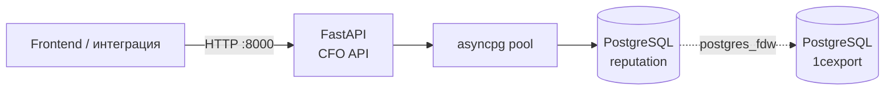

**Проект:** ADOLF — управленческий учёт\
**Модуль:** CFO / REST API\
**Версия:** 0.1.0\
**Дата:** Май 2026

---

## 1. Обзор

CFO REST API предоставляет HTTP-доступ к финансовой аналитике модуля управленческого учёта: P&L по категориям, брендам, маркетплейсам и SKU, а также ABC-анализ по вкладу в прибыль. API служит источником данных для веб-интерфейса CFO (вкладки P&L и ABC) и сторонних интеграций.

| Компонент | Файл | Процесс | Порт |
|-----------|------|---------|:----:|
| REST API | `src/cfo/api/` | `cfo-api` (uvicorn) | 8000 |
| Сервисный слой | `src/cfo/services/` | внутри API | — |
| База данных | PostgreSQL `reputation` (+ FDW в `1cexport`) | внешний | 5432 |



API покрывает 5 бизнес-эндпоинтов и системный `/health`. Источники данных — те же агрегаты, что и в CLI-отчётах (`pnl_grouped`, `abc_analysis`); фронтенд получает их в JSON, а не в Markdown/Excel.

Вне скоупа первой версии: Loss Makers, тренды, AI-инсайты, кастомные отчёты, экспорт Excel/PDF, аутентификация, фильтр по бренду в SKU, фильтр по классу в ABC.

---

## 2. Общие характеристики

| Параметр | Значение |
|----------|----------|
| Фреймворк | FastAPI + Pydantic v2 |
| Формат | JSON, UTF-8 |
| Базовый путь | `/api/v1/cfo` |
| Системный путь | `/health` (без префикса) |
| HTTP-методы | Только `GET` |
| CORS | `Access-Control-Allow-Origin` из `CFO_API_CORS_ORIGINS` (CSV, дефолт `*`); `allow_methods=["GET"]`; `allow_credentials=false` |
| Аутентификация | Нет (первая итерация) |
| Формат дат | ISO 8601 — `YYYY-MM-DD` |
| Денежные значения | `float`, рубли |
| Маржинальность | Взвешенная: `Σ profit / Σ revenue × 100` |
| Сортировка | Фиксирована в SQL, как правило `net_profit DESC` |
| Логирование запросов | Middleware `cfo.api.access`: `METHOD path -> status (duration ms)` |
| Документация | Swagger UI `/docs`, ReDoc `/redoc`, OpenAPI `/openapi.json` |

---

## 3. Запуск и конфигурация

API запускается консольным скриптом `cfo-api` или напрямую через uvicorn:

```bash
cfo-api
# либо
uvicorn cfo.api.main:app --host 0.0.0.0 --port 8000
```

### Переменные окружения

| Переменная | Дефолт | Описание |
|------------|--------|----------|
| `CFO_API_HOST` | `0.0.0.0` | Хост uvicorn |
| `CFO_API_PORT` | `8000` | Порт uvicorn |
| `CFO_API_CORS_ORIGINS` | `*` | CSV списка разрешённых origin'ов |
| `CFO_CONFIG` | `config.yaml` | Путь к YAML-конфигу CFO |
| `CFO_DB_NAME` | `reputation` | Имя БД (переопределяет конфиг) |
| `DB_HOST`, `DB_PORT`, `DB_USER`, `DB_PASSWORD`, `DB_SSL` | — | Параметры PostgreSQL |
| `DB_DSN` | — | Полный DSN; имеет приоритет над отдельными `DB_*` |

При старте приложение:

1. Загружает `.env` (без перезаписи существующих переменных).
2. Читает конфиг `CFO_CONFIG`.
3. Открывает asyncpg-пул к PostgreSQL `reputation`.
4. Поднимает Jinja2-окружение для рендера SQL.

При остановке — закрывает пул соединений.

---

## 4. Период

Все бизнес-эндпоинты принимают одинаковый набор параметров периода. Период задаётся **одним из трёх** способов: пресетом, явным диапазоном или дефолтом (если ничего не передано).

### 4.1 Параметры

| Параметр | Тип | Описание |
|----------|-----|----------|
| `preset` | enum: `week` \| `month` \| `quarter` \| `prev_month` | Один из встроенных пресетов |
| `from` | date (ISO `YYYY-MM-DD`) | Начало диапазона, включительно |
| `to` | date (ISO `YYYY-MM-DD`) | Конец диапазона, включительно |

### 4.2 Семантика пресетов

Конкретные даты приведены для якоря `today = 2026-05-14`.

| Пресет | Семантика | Пример (`today=2026-05-14`) |
|--------|-----------|------------------------------|
| `week` | Последние 7 календарных дней, включая сегодня | `2026-05-08` … `2026-05-14` |
| `month` | Текущий календарный месяц целиком | `2026-05-01` … `2026-05-31` |
| `quarter` | Текущий календарный квартал целиком | `2026-04-01` … `2026-06-30` |
| `prev_month` | Полностью предыдущий календарный месяц | `2026-04-01` … `2026-04-30` |

### 4.3 Дефолт

Если в запросе нет ни `preset`, ни `from`/`to`, применяется `prev_month`. Это соответствует основному кейсу: «фронт показывает прошлый месяц при первом открытии».

> Дефолт **нестабилен** во времени: ответ за 30 апреля 2026 покажет март, за 1 мая 2026 — апрель. Для воспроизводимых ответов передавайте явный диапазон `from`/`to`.

### 4.4 Матрица валидации

Все ошибки валидации периода возвращают HTTP `422`. Тексты сообщений приведены побайтно как в API.

| Ситуация | Код | `detail` |
|----------|:---:|----------|
| `preset` и `from`/`to` переданы одновременно | 422 | `Use either 'preset' OR 'from'/'to', not both` |
| Передан только `from` или только `to` | 422 | `'from' and 'to' must be provided together` |
| `from > to` | 422 | `'from' must be <= 'to'` |
| Невалидный формат даты в `from`/`to` | 422 | Стандартный ответ FastAPI `ValidationError` |
| Неизвестное значение `preset` | 422 | Стандартный ответ FastAPI `ValidationError` |

### 4.5 Примеры

```bash
# Дефолт — прошлый календарный месяц
GET /api/v1/cfo/pnl/category

# Явный пресет
GET /api/v1/cfo/pnl/category?preset=week

# Явный диапазон
GET /api/v1/cfo/pnl/category?from=2026-03-01&to=2026-03-31

# Конфликт → 422
GET /api/v1/cfo/pnl/category?preset=month&from=2026-03-01&to=2026-03-31
```

---

## 5. Эндпоинты

### Сводная таблица

| Метод | Путь | Назначение |
|:-----:|------|------------|
| GET | `/health` | Проверка состояния сервиса |
| GET | `/api/v1/cfo/pnl/category` | P&L по категориям товаров |
| GET | `/api/v1/cfo/pnl/brand` | P&L по брендам |
| GET | `/api/v1/cfo/pnl/marketplace` | P&L по маркетплейсам |
| GET | `/api/v1/cfo/pnl/sku` | P&L по SKU (с фильтрами и пагинацией) |
| GET | `/api/v1/cfo/abc` | ABC-классификация SKU по вкладу в прибыль |

---

### 5.1 GET `/health`

Системный эндпоинт без префикса `/api/v1/cfo`. Используется для liveness-проверок и health checks.

**Параметры:** нет.

**Ответ `200`:**

```json
{ "status": "ok" }
```

| Код | Ситуация |
|:---:|----------|
| 200 | Сервис запущен |

---

### 5.2 GET `/api/v1/cfo/pnl/category`

P&L по категориям товаров за указанный период.

**Параметры запроса:** только параметры периода (см. [§4](#4-период)).

#### Логика «мусорных» групп

Строки SQL-результата с `category`, равным одному из токенов:

- `— нерасклассифицировано —`
- `—`
- `Неопознанный Товар`
- `null`
- пустая строка `""`

— агрегируются в одну строку с `category="Прочее"`. Числовые поля суммируются, маржи пересчитываются взвешенно от итоговых сумм. После объединения результат **пересортируется по убыванию `net_profit`**, чтобы сохранить порядок, который ожидает фронт.

#### Замечание о `mp_expenses`

Поле `mp_expenses` — это сумма всех расходов маркетплейса:
`commission + logistics + return_logistics + storage + penalties + acquiring + other_mp_expenses`. Соответствует SQL-полю `mp_expenses_total`.

#### Поля строки `data[]`

| Поле | Тип | Опц. | Описание |
|------|-----|:----:|----------|
| `category` | string | нет | Название категории; `"Прочее"` для агрегата нерасклассифицированных |
| `revenue` | float | нет | Выручка, ₽ |
| `cogs` | float | нет | Себестоимость (Cost of Goods Sold), ₽ |
| `mp_expenses` | float | нет | Расходы маркетплейса, ₽ |
| `gross_profit` | float | нет | Валовая прибыль (`revenue − cogs`), ₽ |
| `net_profit` | float | нет | Чистая прибыль (`gross_profit − mp_expenses`), ₽ |
| `gross_margin_pct` | float | нет | Валовая маржа, % (взвешенная) |
| `net_margin_pct` | float | нет | Чистая маржа, % (взвешенная) |

#### Поля `summary`

| Поле | Тип | Опц. | Описание |
|------|-----|:----:|----------|
| `rows_count` | int | нет | Количество строк в `data` (после объединения «Прочее») |
| `revenue`, `cogs`, `mp_expenses`, `gross_profit`, `net_profit` | float | нет | Итоги по всем строкам |
| `gross_margin_pct`, `net_margin_pct` | float | нет | Маржа от итогов (взвешенная) |

#### Пример ответа `200`

```json
{
  "period": { "from": "2026-03-01", "to": "2026-03-31" },
  "data": [
    {
      "category": "Халаты домашние",
      "revenue": 21806396.0,
      "cogs": 6680016.0,
      "mp_expenses": 4033118.0,
      "gross_profit": 15126380.0,
      "net_profit": 11093262.0,
      "gross_margin_pct": 69.4,
      "net_margin_pct": 50.9
    },
    {
      "category": "Жилеты",
      "revenue": 2362270.0,
      "cogs": 676220.0,
      "mp_expenses": 452692.0,
      "gross_profit": 1686050.0,
      "net_profit": 1233358.0,
      "gross_margin_pct": 71.4,
      "net_margin_pct": 52.2
    },
    {
      "category": "Прочее",
      "revenue": 1200000.0,
      "cogs": 400000.0,
      "mp_expenses": 200000.0,
      "gross_profit": 800000.0,
      "net_profit": 600000.0,
      "gross_margin_pct": 66.7,
      "net_margin_pct": 50.0
    }
  ],
  "summary": {
    "rows_count": 28,
    "revenue": 130749653.0,
    "cogs": 28037917.0,
    "mp_expenses": 45082071.0,
    "gross_profit": 102711736.0,
    "net_profit": 57629665.0,
    "gross_margin_pct": 78.6,
    "net_margin_pct": 44.1
  }
}
```

#### Коды ответов

| Код | Ситуация |
|:---:|----------|
| 200 | Успех (даже если `data` пустой) |
| 422 | Невалидные параметры периода |
| 500 | Внутренняя ошибка БД |

---

### 5.3 GET `/api/v1/cfo/pnl/brand`

P&L по брендам за указанный период. Поведение полностью идентично `/pnl/category`, поле группировки — `brand`. Объединение «мусорных» брендов в строку `"Прочее"` применяется так же.

**Параметры запроса:** только параметры периода.

#### Поля строки `data[]`

| Поле | Тип | Опц. | Описание |
|------|-----|:----:|----------|
| `brand` | string | нет | Название бренда; `"Прочее"` для агрегата нерасклассифицированных |
| `revenue`, `cogs`, `mp_expenses`, `gross_profit`, `net_profit` | float | нет | Метрики, ₽ |
| `gross_margin_pct`, `net_margin_pct` | float | нет | Маржа, % (взвешенная) |

Поля `summary` — те же, что в `/pnl/category`.

#### Пример ответа `200`

```json
{
  "period": { "from": "2026-03-01", "to": "2026-03-31" },
  "data": [
    {
      "brand": "Ohana market",
      "revenue": 95300000.0,
      "cogs": 19800000.0,
      "mp_expenses": 33200000.0,
      "gross_profit": 75500000.0,
      "net_profit": 42300000.0,
      "gross_margin_pct": 79.2,
      "net_margin_pct": 44.4
    },
    {
      "brand": "Ohana kids",
      "revenue": 33800000.0,
      "cogs": 7900000.0,
      "mp_expenses": 11600000.0,
      "gross_profit": 25900000.0,
      "net_profit": 14300000.0,
      "gross_margin_pct": 76.6,
      "net_margin_pct": 42.3
    },
    {
      "brand": "Прочее",
      "revenue": 1649653.0,
      "cogs": 337917.0,
      "mp_expenses": 282071.0,
      "gross_profit": 1311736.0,
      "net_profit": 1029665.0,
      "gross_margin_pct": 79.5,
      "net_margin_pct": 62.4
    }
  ],
  "summary": {
    "rows_count": 3,
    "revenue": 130749653.0,
    "cogs": 28037917.0,
    "mp_expenses": 45082071.0,
    "gross_profit": 102711736.0,
    "net_profit": 57629665.0,
    "gross_margin_pct": 78.6,
    "net_margin_pct": 44.1
  }
}
```

#### Коды ответов

| Код | Ситуация |
|:---:|----------|
| 200 | Успех |
| 422 | Невалидные параметры периода |
| 500 | Внутренняя ошибка БД |

---

### 5.4 GET `/api/v1/cfo/pnl/marketplace`

P&L по маркетплейсам за указанный период.

**Параметры запроса:** только параметры периода.

> **Объединение «мусорных» групп НЕ применяется.** Каждый маркетплейс — отдельная строка с машинным кодом.

#### Поля строки `data[]`

| Поле | Тип | Опц. | Описание |
|------|-----|:----:|----------|
| `marketplace` | string (enum) | нет | Машинный код: `wb`, `ozon`, `ym` |
| `revenue`, `cogs`, `mp_expenses`, `gross_profit`, `net_profit` | float | нет | Метрики, ₽ |
| `gross_margin_pct`, `net_margin_pct` | float | нет | Маржа, % (взвешенная) |

Поля `summary` — те же, что в `/pnl/category`.

#### Пример ответа `200`

```json
{
  "period": { "from": "2026-03-01", "to": "2026-03-31" },
  "data": [
    {
      "marketplace": "wb",
      "revenue": 89540000.0,
      "cogs": 19200000.0,
      "mp_expenses": 31100000.0,
      "gross_profit": 70340000.0,
      "net_profit": 39240000.0,
      "gross_margin_pct": 78.6,
      "net_margin_pct": 43.8
    },
    {
      "marketplace": "ozon",
      "revenue": 41209653.0,
      "cogs": -506.0,
      "mp_expenses": 13982071.0,
      "gross_profit": 41210159.0,
      "net_profit": 18389665.0,
      "gross_margin_pct": 100.0,
      "net_margin_pct": 44.6
    }
  ],
  "summary": {
    "rows_count": 2,
    "revenue": 130749653.0,
    "cogs": 28037917.0,
    "mp_expenses": 45082071.0,
    "gross_profit": 102711736.0,
    "net_profit": 57629665.0,
    "gross_margin_pct": 78.6,
    "net_margin_pct": 44.1
  }
}
```

> Отрицательный `cogs` у Ozon в примере — реальный артефакт неполного маппинга затрат, известный баг данных. API возвращает значение «как есть», без подмены. Подробнее см. §9.

#### Коды ответов

| Код | Ситуация |
|:---:|----------|
| 200 | Успех |
| 422 | Невалидные параметры периода |
| 500 | Внутренняя ошибка БД |

---

### 5.5 GET `/api/v1/cfo/pnl/sku`

P&L по отдельным SKU с фильтрами и пагинацией. Сортировка фиксирована в SQL — `net_profit DESC` (переопределить нельзя).

#### Параметры запроса

К параметрам периода (см. [§4](#4-период)) добавляются:

| Параметр | Тип | Дефолт | Диапазон | Описание |
|----------|-----|:------:|:--------:|----------|
| `marketplace` | string, regex `^(wb\|ozon\|ym)$` | — | — | Фильтр по коду маркетплейса |
| `category` | string | — | — | Точное имя категории |
| `only_loss` | bool | `false` | — | Только SKU с `net_profit < 0` |
| `limit` | int | `100` | 1…500 | Размер страницы |
| `offset` | int | `0` | ≥ 0 | Смещение от начала |

> **Важно:** `summary` агрегируется по **всему результату после применения фильтров**, без учёта пагинации. `pagination.total` равен `summary.rows_count` и показывает реальный размер набора.

#### Структура ответа

| Поле | Тип | Опц. | Описание |
|------|-----|:----:|----------|
| `period` | PeriodOut | нет | Эхо разрешённого периода |
| `filters` | PnLSkuFilters | нет | Эхо применённых фильтров |
| `pagination` | Pagination | нет | `total`, `limit`, `offset` |
| `data` | PnLSkuRow[] | нет | Строки текущей страницы |
| `summary` | PnLGroupSummary | нет | Итоги по всему результату |

#### Поля `filters`

| Поле | Тип | Опц. | Описание |
|------|-----|:----:|----------|
| `marketplace` | string \| null | да | `null`, если фильтр не передан |
| `category` | string \| null | да | `null`, если фильтр не передан |
| `only_loss` | bool | нет | `false`, если флаг не передан |

#### Поля `pagination`

| Поле | Тип | Опц. | Описание |
|------|-----|:----:|----------|
| `total` | int | нет | Общее количество строк после фильтрации |
| `limit` | int | нет | Размер страницы из запроса |
| `offset` | int | нет | Смещение из запроса |

#### Поля строки `data[]`

| Поле | Тип | Опц. | Описание |
|------|-----|:----:|----------|
| `sku` | string | нет | Артикул (код SKU) |
| `sku_name` | string | нет | Название товара |
| `brand` | string | нет | Бренд |
| `category` | string | нет | Категория |
| `marketplaces` | string[] | нет | Коды маркетплейсов, на которых SKU продаётся |
| `revenue` | float | нет | Выручка, ₽ |
| `cogs` | float | нет | Себестоимость, ₽ |
| `mp_expenses` | float | нет | Расходы маркетплейса, ₽ |
| `gross_profit` | float | нет | Валовая прибыль, ₽ |
| `net_profit` | float | нет | Чистая прибыль, ₽ |
| `gross_margin_pct` | float | нет | Валовая маржа, % |
| `net_margin_pct` | float | нет | Чистая маржа, % |
| `cost_source` | string \| null | да | Источник стоимости: `turns_90`, `balance_41`, `supplier_prices` или `null` |

#### Примеры запросов

```bash
# Дефолт — за прошлый месяц, первые 100 SKU
GET /api/v1/cfo/pnl/sku

# Явный диапазон + Wildberries, страница 3
GET /api/v1/cfo/pnl/sku?from=2026-03-01&to=2026-03-31&marketplace=wb&limit=100&offset=200

# Только убыточные в категории «Жилеты»
GET /api/v1/cfo/pnl/sku?from=2026-03-01&to=2026-03-31&category=%D0%96%D0%B8%D0%BB%D0%B5%D1%82%D1%8B&only_loss=true&limit=50
```

#### Пример ответа `200`

```json
{
  "period": { "from": "2026-03-01", "to": "2026-03-31" },
  "filters": {
    "marketplace": null,
    "category": null,
    "only_loss": false
  },
  "pagination": {
    "total": 2911,
    "limit": 100,
    "offset": 0
  },
  "data": [
    {
      "sku": "65001",
      "sku_name": "65001 Жилет синтепоновый чёрный стёжка треугольник",
      "brand": "Ohana market",
      "category": "Жилеты",
      "marketplaces": ["wb"],
      "revenue": 2362270.0,
      "cogs": 676220.0,
      "mp_expenses": 452692.0,
      "gross_profit": 1686050.0,
      "net_profit": 1233358.0,
      "gross_margin_pct": 71.4,
      "net_margin_pct": 52.2,
      "cost_source": "turns_90"
    },
    {
      "sku": "65002",
      "sku_name": "65002 Жилет синтепоновый красный стёжка треугольник",
      "brand": "Ohana market",
      "category": "Жилеты",
      "marketplaces": ["ozon", "wb"],
      "revenue": 1500000.0,
      "cogs": 450000.0,
      "mp_expenses": 300000.0,
      "gross_profit": 1050000.0,
      "net_profit": 750000.0,
      "gross_margin_pct": 70.0,
      "net_margin_pct": 50.0,
      "cost_source": "balance_41"
    }
  ],
  "summary": {
    "rows_count": 2911,
    "revenue": 130749653.0,
    "cogs": 28037917.0,
    "mp_expenses": 45082071.0,
    "gross_profit": 102711736.0,
    "net_profit": 57629665.0,
    "gross_margin_pct": 78.6,
    "net_margin_pct": 44.1
  }
}
```

#### Коды ответов

| Код | Ситуация |
|:---:|----------|
| 200 | Успех (даже если `data` пустой) |
| 422 | Невалидный `marketplace` (не соответствует regex), `limit` вне диапазона `1…500`, `offset < 0`, ошибка периода |
| 500 | Внутренняя ошибка БД |

---

### 5.6 GET `/api/v1/cfo/abc`

ABC-классификация SKU по вкладу в чистую прибыль. Класс D выделяется отдельно для убыточных позиций.

#### Параметры запроса

К параметрам периода (см. [§4](#4-период)) добавляются:

| Параметр | Тип | Дефолт | Диапазон | Описание |
|----------|-----|:------:|:--------:|----------|
| `abc_a` | float | из конфига (`config.algorithm.abc_thresholds.a`, обычно `80`) | 0…100 | Кумулятивный порог класса A, % |
| `abc_b` | float | из конфига (`config.algorithm.abc_thresholds.b`, обычно `95`) | 0…100 | Кумулятивный порог класса B, % |
| `limit` | int | `100` | 1…3000 | Размер страницы |
| `offset` | int | `0` | ≥ 0 | Смещение |

**Дополнительная валидация:** `abc_a < abc_b`. При нарушении — `422` с текстом вида `abc_a (95.0) must be < abc_b (80.0)`.

#### Логика классификации

SQL-запрос ранжирует SKU по убыванию `net_profit` среди прибыльных, считает кумулятивную долю и присваивает класс:

| Класс | Условие |
|:-----:|---------|
| A | `net_profit > 0` и cumulative_pct ≤ `abc_a` |
| B | `net_profit > 0` и `abc_a` < cumulative_pct ≤ `abc_b` |
| C | `net_profit > 0` и `abc_b` < cumulative_pct ≤ 100 |
| D | `net_profit ≤ 0` (убыточные SKU, отдельная группа) |

Для класса D поля `rank`, `cumulative_pct` и `share_pct` всегда `null` — убытки не делятся на положительную базу и не входят в ранжирование.

#### Структура ответа

| Поле | Тип | Опц. | Описание |
|------|-----|:----:|----------|
| `period` | PeriodOut | нет | Эхо периода |
| `thresholds` | AbcThresholds | нет | Применённые пороги `a` и `b` |
| `summary` | AbcSummary | нет | Итоги и статистика по классам |
| `pagination` | Pagination | нет | `total`, `limit`, `offset` |
| `data` | AbcRow[] | нет | Отранжированные SKU (страница) |

#### Поля `thresholds`

| Поле | Тип | Опц. | Описание |
|------|-----|:----:|----------|
| `a` | float | нет | Применённый порог A, % |
| `b` | float | нет | Применённый порог B, % |

#### Поля `summary`

| Поле | Тип | Опц. | Описание |
|------|-----|:----:|----------|
| `total_sku` | int | нет | Общее количество SKU в результате |
| `positive_profit` | float | нет | Σ `net_profit` по классам A+B+C (база для `share_pct`) |
| `net_profit` | float | нет | `positive_profit + Σ net_profit класса D` (нетто) |
| `classes` | dict[`A`\|`B`\|`C`\|`D`, AbcClassStat] | нет | Статистика по классам |

#### Поля `classes.{A,B,C,D}` (AbcClassStat)

| Поле | Тип | Опц. | Описание |
|------|-----|:----:|----------|
| `sku_count` | int | нет | Количество SKU в классе |
| `net_profit` | float | нет | Σ `net_profit` класса (для D — отрицательное) |
| `share_pct` | float \| null | да | Доля от `positive_profit`, %; **`null` для класса D** |

#### Поля строки `data[]` (AbcRow)

| Поле | Тип | Опц. | Описание |
|------|-----|:----:|----------|
| `rank` | int \| null | да | Номер в ранжировании (1, 2, …); **`null` для класса D** |
| `abc_class` | string (enum) | нет | `A`, `B`, `C` или `D` |
| `sku` | string | нет | Артикул |
| `sku_name` | string | нет | Название |
| `brand` | string | нет | Бренд |
| `category` | string | нет | Категория |
| `marketplaces` | string[] | нет | Коды маркетплейсов |
| `revenue` | float | нет | Выручка, ₽ |
| `net_profit` | float | нет | Чистая прибыль, ₽ (для D — отрицательная) |
| `net_margin_pct` | float | нет | Чистая маржа, % (для D — отрицательная) |
| `cumulative_pct` | float \| null | да | Кумулятивная доля прибыли с начала списка, %; **`null` для класса D** |

#### Примеры запросов

```bash
# Дефолт — пороги из конфига (80/95), за прошлый месяц
GET /api/v1/cfo/abc

# Кастомные пороги
GET /api/v1/cfo/abc?from=2026-03-01&to=2026-03-31&abc_a=70&abc_b=90

# Полный список (до 3000 строк)
GET /api/v1/cfo/abc?from=2026-03-01&to=2026-03-31&limit=3000

# Невалидно: a >= b → 422
GET /api/v1/cfo/abc?abc_a=95&abc_b=80
```

#### Пример ответа `200`

```json
{
  "period": { "from": "2026-03-01", "to": "2026-03-31" },
  "thresholds": { "a": 80.0, "b": 95.0 },
  "summary": {
    "total_sku": 2911,
    "positive_profit": 58064074.0,
    "net_profit": 57629665.0,
    "classes": {
      "A": { "sku_count": 315,  "net_profit": 46451259.0, "share_pct": 80.0 },
      "B": { "sku_count": 683,  "net_profit": 8709611.0,  "share_pct": 15.0 },
      "C": { "sku_count": 1589, "net_profit": 2903204.0,  "share_pct": 5.0 },
      "D": { "sku_count": 324,  "net_profit": -434409.0,  "share_pct": null }
    }
  },
  "pagination": { "total": 2911, "limit": 100, "offset": 0 },
  "data": [
    {
      "rank": 1,
      "abc_class": "A",
      "sku": "65001",
      "sku_name": "65001 Жилет синтепоновый чёрный стёжка треугольник",
      "brand": "Ohana market",
      "category": "Жилеты",
      "marketplaces": ["wb"],
      "revenue": 2362270.0,
      "net_profit": 1233358.0,
      "net_margin_pct": 52.2,
      "cumulative_pct": 2.1
    },
    {
      "rank": 316,
      "abc_class": "B",
      "sku": "70114",
      "sku_name": "70114 Толстовка детская синяя",
      "brand": "Ohana kids",
      "category": "Толстовки",
      "marketplaces": ["ozon", "wb"],
      "revenue": 312500.0,
      "net_profit": 64200.0,
      "net_margin_pct": 20.5,
      "cumulative_pct": 81.4
    },
    {
      "rank": 999,
      "abc_class": "C",
      "sku": "60044",
      "sku_name": "60044 Носки мужские чёрные",
      "brand": "Ohana market",
      "category": "Носки",
      "marketplaces": ["wb"],
      "revenue": 18900.0,
      "net_profit": 1840.0,
      "net_margin_pct": 9.7,
      "cumulative_pct": 96.2
    },
    {
      "rank": null,
      "abc_class": "D",
      "sku": "55301",
      "sku_name": "55301 Платье летнее цветочное",
      "brand": "Ohana market",
      "category": "Платья",
      "marketplaces": ["ozon"],
      "revenue": 42100.0,
      "net_profit": -8650.0,
      "net_margin_pct": -20.5,
      "cumulative_pct": null
    }
  ]
}
```

#### Коды ответов

| Код | Ситуация |
|:---:|----------|
| 200 | Успех |
| 422 | `abc_a >= abc_b`; `limit` вне диапазона `1…3000`; `offset < 0`; ошибка периода |
| 500 | Внутренняя ошибка БД |

---

## 6. Модели ответов

Сводное описание JSON-моделей. Каждая модель — то, что фронтенд получает в ответе. Для удобства алиасы Python-полей (например, `from_` ↔ `from`) опущены: в JSON всегда используется внешнее имя `from`.

### PeriodOut

| Поле | Тип | Опц. | Описание |
|------|-----|:----:|----------|
| `from` | date (ISO) | нет | Начало периода, включительно |
| `to` | date (ISO) | нет | Конец периода, включительно |

### PnLGroupMetrics (общий базовый набор полей P&L)

| Поле | Тип | Опц. | Описание |
|------|-----|:----:|----------|
| `revenue` | float | нет | Выручка, ₽ |
| `cogs` | float | нет | Себестоимость, ₽ |
| `mp_expenses` | float | нет | Расходы маркетплейса, ₽ |
| `gross_profit` | float | нет | Валовая прибыль, ₽ |
| `net_profit` | float | нет | Чистая прибыль, ₽ |
| `gross_margin_pct` | float | нет | Валовая маржа, % |
| `net_margin_pct` | float | нет | Чистая маржа, % |

### PnLCategoryRow / PnLBrandRow / PnLMarketplaceRow

Расширяют `PnLGroupMetrics` одним полем-меткой:

| Модель | Поле | Тип | Описание |
|--------|------|-----|----------|
| PnLCategoryRow | `category` | string | Название категории (или `"Прочее"`) |
| PnLBrandRow | `brand` | string | Название бренда (или `"Прочее"`) |
| PnLMarketplaceRow | `marketplace` | string | Машинный код: `wb`, `ozon`, `ym` |

### PnLSkuRow

Расширяет `PnLGroupMetrics` детализацией по товару:

| Поле | Тип | Опц. | Описание |
|------|-----|:----:|----------|
| `sku` | string | нет | Артикул |
| `sku_name` | string | нет | Название товара |
| `brand` | string | нет | Бренд |
| `category` | string | нет | Категория |
| `marketplaces` | string[] | нет | Коды маркетплейсов |
| `cost_source` | string \| null | да | Источник стоимости |

### PnLGroupSummary

Расширяет `PnLGroupMetrics`:

| Поле | Тип | Опц. | Описание |
|------|-----|:----:|----------|
| `rows_count` | int | нет | Общее количество строк в результате |

### PnLSkuFilters

| Поле | Тип | Опц. | Описание |
|------|-----|:----:|----------|
| `marketplace` | string \| null | да | Эхо параметра |
| `category` | string \| null | да | Эхо параметра |
| `only_loss` | bool | нет | Эхо параметра |

### Pagination

| Поле | Тип | Опц. | Описание |
|------|-----|:----:|----------|
| `total` | int | нет | Общее количество строк |
| `limit` | int | нет | Размер страницы |
| `offset` | int | нет | Смещение |

### PnLByCategoryReport / PnLByBrandReport / PnLByMarketplaceReport

| Поле | Тип | Опц. | Описание |
|------|-----|:----:|----------|
| `period` | PeriodOut | нет | Период отчёта |
| `data` | PnLCategoryRow[] / PnLBrandRow[] / PnLMarketplaceRow[] | нет | Строки результата |
| `summary` | PnLGroupSummary | нет | Итоги |

### PnLSkuReport

| Поле | Тип | Опц. | Описание |
|------|-----|:----:|----------|
| `period` | PeriodOut | нет | Период отчёта |
| `filters` | PnLSkuFilters | нет | Применённые фильтры |
| `pagination` | Pagination | нет | Информация о странице |
| `data` | PnLSkuRow[] | нет | Строки текущей страницы |
| `summary` | PnLGroupSummary | нет | Итоги по всему результату (не по странице) |

### AbcThresholds

| Поле | Тип | Опц. | Описание |
|------|-----|:----:|----------|
| `a` | float | нет | Порог класса A, % |
| `b` | float | нет | Порог класса B, % |

### AbcClassStat

| Поле | Тип | Опц. | Описание |
|------|-----|:----:|----------|
| `sku_count` | int | нет | Количество SKU в классе |
| `net_profit` | float | нет | Σ `net_profit` класса |
| `share_pct` | float \| null | да | Доля от `positive_profit`, %; `null` для D |

### AbcSummary

| Поле | Тип | Опц. | Описание |
|------|-----|:----:|----------|
| `total_sku` | int | нет | Общее количество SKU |
| `positive_profit` | float | нет | Сумма прибыли A+B+C (база для долей) |
| `net_profit` | float | нет | Нетто-прибыль (A+B+C+D) |
| `classes` | dict[string, AbcClassStat] | нет | Ключи `A`, `B`, `C`, `D` |

### AbcRow

| Поле | Тип | Опц. | Описание |
|------|-----|:----:|----------|
| `rank` | int \| null | да | Ранг (`null` для D) |
| `abc_class` | string (enum) | нет | `A`, `B`, `C`, `D` |
| `sku` | string | нет | Артикул |
| `sku_name` | string | нет | Название |
| `brand` | string | нет | Бренд |
| `category` | string | нет | Категория |
| `marketplaces` | string[] | нет | Коды маркетплейсов |
| `revenue` | float | нет | Выручка, ₽ |
| `net_profit` | float | нет | Чистая прибыль, ₽ |
| `net_margin_pct` | float | нет | Чистая маржа, % |
| `cumulative_pct` | float \| null | да | Кумулятивная доля прибыли, %; `null` для D |

### AbcReport

| Поле | Тип | Опц. | Описание |
|------|-----|:----:|----------|
| `period` | PeriodOut | нет | Период отчёта |
| `thresholds` | AbcThresholds | нет | Применённые пороги |
| `summary` | AbcSummary | нет | Итоги и статистика по классам |
| `pagination` | Pagination | нет | Информация о странице |
| `data` | AbcRow[] | нет | Отранжированные SKU |

---

## 7. Коды ответов

| Код | Ситуация |
|:---:|----------|
| 200 | Успех (даже если `data` пустой массив) |
| 422 | Ошибка валидации параметров запроса |
| 500 | Внутренняя ошибка БД |

Формат всех ошибок — JSON-объект с единственным полем `detail`:

```json
{ "detail": "Human-readable message" }
```

### Типичные сообщения 422

| Эндпоинт | Сообщение |
|----------|-----------|
| Любой | `Use either 'preset' OR 'from'/'to', not both` |
| Любой | `'from' and 'to' must be provided together` |
| Любой | `'from' must be <= 'to'` |
| `/abc` | `abc_a (95.0) must be < abc_b (80.0)` |
| `/pnl/sku` | Стандартный `ValidationError` FastAPI на `marketplace` (regex), `limit` (диапазон), `offset` (диапазон) |

### 500

```json
{ "detail": "Internal database error" }
```

Полный стек ошибки БД пишется в логи (`cfo.api.errors`) и **не** возвращается клиенту.

---

## 8. Перечисления (Enums)

| Перечисление | Значения |
|--------------|----------|
| `PresetName` | `week`, `month`, `quarter`, `prev_month` |
| `Marketplace` (значения параметра `?marketplace`) | `wb`, `ozon`, `ym` |
| `AbcClass` | `A`, `B`, `C`, `D` |
| `cost_source` | `turns_90`, `balance_41`, `supplier_prices`, `null` |

---

## 9. Особенности и подводные камни

- **`marketplaces` всегда массив строк**, даже если SKU продаётся только на одном маркетплейсе: `["wb"]`. Не строка с разделителем.
- **`summary` в `/pnl/sku` считается по всему результату**, а не по странице. `pagination.total` равен `summary.rows_count`. Это нужно, чтобы фронт мог показывать общие итоги и одновременно листать страницы.
- **Объединение «Прочее»** работает только в `/pnl/category` и `/pnl/brand`. В `/pnl/marketplace` и `/pnl/sku` — нет.
- **Отрицательный `cogs` у Ozon** — известный артефакт неполного маппинга затрат в данных-источнике. API возвращает значение «как есть», без подмены или скрытия. Это ограничение источника, а не баг API; будет устранено в следующих итерациях ингеста.
- **Дефолт `prev_month` нестабилен во времени.** Один и тот же URL без параметров вернёт разные периоды, если запросить его в апреле и в мае. Для воспроизводимых ответов передавайте `from`/`to`.
- **Класс D в ABC** не имеет ни ранга, ни доли, ни `cumulative_pct` — все три поля `null`. Убытки не входят в ранжирование «по вкладу в прибыль» и не делятся на положительную базу.
- **`gross_margin_pct` пересчитывается на стороне API.** В SQL вычисляется только `margin_pct = net_margin_pct`; валовая маржа считается как `gross_profit / revenue × 100`. При `revenue = 0` возвращается `0`, а не `null`.
- **Сортировка `/pnl/sku` и `/pnl/marketplace`** фиксирована: `net_profit DESC`. Передать произвольный `sort` параметр нельзя.
- **Лимит `/abc`** — до 3000 SKU за запрос (для обозримых каталогов этого хватает на полный список одной страницей). У `/pnl/sku` лимит ниже — 500.
- **CORS по дефолту разрешает все origin'ы (`*`)**, но без credentials. Для прод-окружения задавайте `CFO_API_CORS_ORIGINS` явным списком доменов.

---

## 10. Контрольные значения (за март 2026)

Набор чисел, по которым удобно сверить корректность интеграции при первом подключении. Получены прогоном за `from=2026-03-01&to=2026-03-31`.

| Эндпоинт | Контрольное значение |
|----------|----------------------|
| `/pnl/category` | `summary.revenue ≈ 130 749 653`, `summary.net_profit ≈ 57 629 665`; в `data` присутствует строка `"category": "Прочее"` |
| `/pnl/brand` | `summary` те же; в `data` присутствует строка `"brand": "Прочее"` |
| `/pnl/marketplace` | Две строки: `wb` и `ozon`; у `ozon` `cogs ≈ −506` (артефакт данных, см. §9) |
| `/pnl/sku?limit=100` | `pagination.total = 2911`; первая строка `sku="65001"`, `net_profit ≈ 1 233 358` |
| `/abc` | `summary.total_sku = 2911`; `classes.A.sku_count = 315`, `B = 683`, `C = 1589`, `D = 324`; `summary.positive_profit ≈ 58 064 074`; `summary.net_profit ≈ 57 629 665` |

---

## 11. Версионирование и совместимость

- **Текущая версия API:** `0.1.0` (см. метаданные FastAPI на `/openapi.json`).
- **Префикс `/api/v1/cfo`** зарезервирован под мажорную версию 1; в рамках `v1` контракт может расширяться обратно совместимо (новые поля, новые эндпоинты), но не ломаться.
- **Стабильность 0.1.x:** первая итерация. Имена и типы полей, перечисленные в этом документе, считаются контрактом и не будут меняться без выпуска `v2`. Однако возможны добавления (новые опциональные поля).

### Что не реализовано в этой версии

| Возможность | Статус |
|-------------|:------:|
| Аутентификация и роли | Планируется |
| Фильтр по бренду в `/pnl/sku` | Планируется |
| Фильтр по классу в `/abc` | Планируется |
| Произвольная сортировка | Планируется |
| Loss Makers (топ убыточных SKU) | Не реализовано |
| Тренды и динамика по периодам | Не реализовано |
| Аномалии и алерты | Не реализовано |
| AI-инсайты | Не реализовано |
| Кастомные отчёты | Не реализовано |
| Экспорт Excel/PDF через API | Не реализовано (доступно только в CLI) |

---

**Документ подготовлен:** Май 2026\
**Версия:** 1.0\
**Статус:** Актуальный
