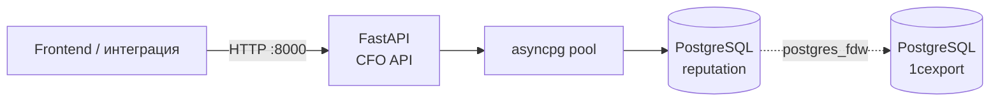

**Проект:** ADOLF — управленческий учёт\
**Модуль:** CFO / REST API\
**Версия:** 0.1.2\
**Дата:** Май 2026

---

## 1. Обзор

CFO REST API предоставляет HTTP-доступ к финансовой аналитике модуля управленческого учёта: P&L по категориям, брендам, маркетплейсам и SKU, а также ABC-анализ по вкладу в прибыль. API служит источником данных для веб-интерфейса CFO (вкладки P&L и ABC) и сторонних интеграций.

| Компонент | Файл | Процесс | Порт |
|-----------|------|---------|:----:|
| REST API | `src/cfo/api/` | `cfo-api` (uvicorn) | 8000 |
| Сервисный слой | `src/cfo/services/` | внутри API | — |
| База данных | PostgreSQL `reputation` (+ FDW в `1cexport`) | внешний | 5432 |



API покрывает 7 бизнес-эндпоинтов (4 P&L + ABC + ABC-экспорт в Excel + управление списком исключений) и системный `/health`. Источники данных — те же агрегаты, что и в CLI-отчётах (`pnl_grouped`, `abc_analysis`); фронтенд получает их в JSON или, для ABC, скачивает готовый `.xlsx`-файл.

Вне скоупа текущей версии: Loss Makers, тренды, AI-инсайты, кастомные отчёты, PDF-экспорт, Excel-экспорт P&L, аутентификация, фильтр по бренду в SKU, фильтр по классу в ABC, иерархия категорий.

---

## 2. Общие характеристики

| Параметр | Значение |
|----------|----------|
| Фреймворк | FastAPI + Pydantic v2 |
| Формат | JSON, UTF-8 |
| Базовый путь | `/api/v1/cfo` |
| Системный путь | `/health` (без префикса) |
| HTTP-методы | `GET` (чтение) и `POST` (управление списком исключений) |
| CORS | `Access-Control-Allow-Origin` из `CFO_API_CORS_ORIGINS` (CSV, дефолт `*`); `allow_methods=["GET", "POST"]`; `allow_credentials=false` |
| Аутентификация | Нет (первая итерация) |
| Формат дат | ISO 8601 — `YYYY-MM-DD` |
| Денежные значения | `float`, рубли |
| Маржинальность | Взвешенная: `Σ profit / Σ revenue × 100` |
| Сортировка | Фиксирована в SQL, как правило `net_profit DESC` |
| Логирование запросов | Middleware `cfo.api.access`: `METHOD path -> status (duration ms)` |
| Документация | Swagger UI `/docs`, ReDoc `/redoc`, OpenAPI `/openapi.json` |

---

## 3. Запуск и конфигурация

API запускается консольным скриптом `cfo-api` или напрямую через uvicorn:

```bash
cfo-api
# либо
uvicorn cfo.api.main:app --host 0.0.0.0 --port 8000
```

### Переменные окружения

| Переменная | Дефолт | Описание |
|------------|--------|----------|
| `CFO_API_HOST` | `0.0.0.0` | Хост uvicorn |
| `CFO_API_PORT` | `8000` | Порт uvicorn |
| `CFO_API_CORS_ORIGINS` | `*` | CSV списка разрешённых origin'ов |
| `CFO_API_POOL_MIN` | `1` | Минимальный размер asyncpg-пула |
| `CFO_API_POOL_MAX` | `10` | Максимальный размер asyncpg-пула |
| `CFO_API_CACHE_TTL` | `1800` (30 мин) | TTL `ResponseCache` в секундах. Кеш ключуется по SHA-256 от SQL + params. |
| `CFO_CONFIG` | `config.yaml` | Путь к YAML-конфигу CFO |
| `CFO_DB_NAME` | `reputation` | Имя БД (переопределяет конфиг) |
| `CFO_EXCLUSIONS_PATH` | `./config/exclusions.json` | Путь к файлу с глобальным списком исключений (см. [§5.8–5.9](#58-get-apiv1cfoexclusions)) |
| `DB_HOST`, `DB_PORT`, `DB_USER`, `DB_PASSWORD`, `DB_SSL` | — | Параметры PostgreSQL |
| `DB_DSN` | — | Полный DSN; имеет приоритет над отдельными `DB_*` |

При старте приложение:

1. Загружает `.env` (без перезаписи существующих переменных).
2. Читает конфиг `CFO_CONFIG`.
3. Открывает asyncpg-пул к PostgreSQL `reputation` с настройками из `CFO_API_POOL_*`.
4. Создаёт `ResponseCache(ttl=CFO_API_CACHE_TTL)` и связывает его с пулом — все SQL-результаты автоматически кешируются.
5. Инициализирует `ExclusionsStore(CFO_EXCLUSIONS_PATH)` для глобальных исключений.
6. Поднимает Jinja2-окружение для рендера SQL.

При остановке — закрывает пул соединений.

---

## 4. Период

Все бизнес-эндпоинты принимают одинаковый набор параметров периода. Период задаётся **одним из трёх** способов: пресетом, явным диапазоном или дефолтом (если ничего не передано).

> **Якорь всех пресетов — `yesterday = today − 1 day`**, не `today`. Это сделано, чтобы избежать показа «полудня» (сегодняшний день почти всегда неполный по данным маркетплейсов). Все пресеты заканчиваются на `yesterday` включительно.

### 4.1 Параметры

| Параметр | Тип | Описание |
|----------|-----|----------|
| `preset` | enum: `yesterday` \| `week` \| `month` \| `year` | Один из встроенных пресетов |
| `from` | date (ISO `YYYY-MM-DD`) | Начало диапазона, включительно |
| `to` | date (ISO `YYYY-MM-DD`) | Конец диапазона, включительно |

### 4.2 Семантика пресетов

Конкретные даты приведены для якоря `today = 2026-05-21` (`yesterday = 2026-05-20`).

| Пресет | Семантика | Пример (`today=2026-05-21`) |
|--------|-----------|------------------------------|
| `yesterday` | Один день: с `yesterday` по `yesterday` | `2026-05-20` … `2026-05-20` |
| `week` | Последние 7 дней включая вчера: с `yesterday − 6` по `yesterday` | `2026-05-14` … `2026-05-20` |
| `month` | С 1-го числа текущего месяца по `yesterday` | `2026-05-01` … `2026-05-20` |
| `year` | С 1 января текущего года по `yesterday` | `2026-01-01` … `2026-05-20` |

**Edge case — 1-е число месяца / 1 января.** Если `yesterday` попадает в предыдущий период:

- На 1-м числе месяца `month` даёт **полный прошлый месяц** (`2026-04-01` … `2026-04-30` для `today=2026-05-01`).
- На 1 января `year` даёт **полный прошлый год** (`2025-01-01` … `2025-12-31` для `today=2026-01-01`).

То есть пресет всегда возвращает осмысленный непустой период «то, что только что закончилось».

### 4.3 Дефолт

Если в запросе нет ни `preset`, ни `from`/`to`, применяется `yesterday`. Один день — минимальный воспроизводимый диапазон.

> Дефолт **нестабилен** во времени: ответ за 21 мая покажет 20 мая, за 22 мая — 21 мая. Для воспроизводимых ответов передавайте явный диапазон `from`/`to`.

### 4.4 Границы дня

Внутренние SQL-фильтры используют half-open сравнение
`ts >= :date_from AND ts < :date_to::date + INTERVAL '1 day'` для всех колонок типа `TIMESTAMPTZ`. Это означает:

- `from = to = 2026-05-20` ловит **весь** день целиком — все транзакции с `2026-05-20 00:00:00` включительно до `2026-05-21 00:00:00` исключительно (то есть конечная граница — полночь следующего дня).
- Граница дня в часовом поясе сервера БД (`reputation`).

Подробности — для внутренних потребителей в `docs/IMPLEMENTATION.md`. Для интегратора важно одно: даты в `from`/`to` включительны с обеих сторон по календарному дню.

### 4.5 Матрица валидации

Все ошибки валидации периода возвращают HTTP `422`. Тексты сообщений приведены побайтно как в API.

| Ситуация | Код | `detail` |
|----------|:---:|----------|
| `preset` и `from`/`to` переданы одновременно | 422 | `Use either 'preset' OR 'from'/'to', not both` |
| Передан только `from` или только `to` | 422 | `'from' and 'to' must be provided together` |
| `from > to` | 422 | `'from' must be <= 'to'` |
| Невалидный формат даты в `from`/`to` | 422 | Стандартный ответ FastAPI `ValidationError` |
| Неизвестное значение `preset` (например, старые `quarter` или `prev_month`) | 422 | Стандартный ответ FastAPI `ValidationError` |

### 4.6 Примеры

```bash
# Дефолт — вчера
GET /api/v1/cfo/pnl/category

# Явный пресет
GET /api/v1/cfo/pnl/category?preset=month

# Явный диапазон
GET /api/v1/cfo/pnl/category?from=2026-03-01&to=2026-03-31

# Конфликт → 422
GET /api/v1/cfo/pnl/category?preset=month&from=2026-03-01&to=2026-03-31
```

---

## 5. Эндпоинты

### Сводная таблица

| Метод | Путь | Назначение |
|:-----:|------|------------|
| GET | `/health` | Проверка состояния сервиса |
| GET | `/api/v1/cfo/pnl/category` | P&L по категориям товаров |
| GET | `/api/v1/cfo/pnl/brand` | P&L по брендам |
| GET | `/api/v1/cfo/pnl/marketplace` | P&L по маркетплейсам |
| GET | `/api/v1/cfo/pnl/sku` | P&L по SKU (с фильтрами и пагинацией) |
| GET | `/api/v1/cfo/abc` | ABC-классификация SKU по вкладу в прибыль |
| GET | `/api/v1/cfo/abc/export` | ABC как Excel-файл (без пагинации) |
| GET | `/api/v1/cfo/exclusions` | Текущий список глобальных исключений |
| POST | `/api/v1/cfo/exclusions` | Полная замена списка исключений |

> **Глобальные исключения применяются автоматически** ко всем `/pnl/*`, `/abc`, `/abc/export`. Списком управляет фронт через `/exclusions` (см. [§5.8–5.9](#58-get-apiv1cfoexclusions)). Никаких query-параметров для управления — список читается из общего серверного состояния на каждый запрос.

---

### 5.1 GET `/health`

Системный эндпоинт без префикса `/api/v1/cfo`. Используется для liveness-проверок и health checks.

**Параметры:** нет.

**Ответ `200`:**

```json
{ "status": "ok" }
```

| Код | Ситуация |
|:---:|----------|
| 200 | Сервис запущен |

---

### 5.2 GET `/api/v1/cfo/pnl/category`

P&L по категориям товаров за указанный период.

**Параметры запроса:** только параметры периода (см. [§4](#4-период)).

> **Скоуп — только WB.** В этот эндпоинт попадают только продажи Wildberries. Ozon и Яндекс.Маркет здесь не учитываются даже если включены в `enabled_marketplaces` (это влияет на остальные `/pnl/*`, но не на `/pnl/category`). Сводные значения `summary` ниже, чем у `/pnl/marketplace` / `/pnl/brand`, ровно на величину выручки и расходов non-WB маркетплейсов.

> **Изменения с версии 0.1.3.** Состав и имена категорий изменены: они приходят из новой таксономии (младшая категория с fallback на старшую — см. описание поля `category` ниже). Те значения, которые фронт получал в предыдущей версии, в ответах теперь не встречаются. Числа `cogs`, `gross_profit`, `net_profit`, `gross_margin_pct`, `net_margin_pct` пересчитываются по другому источнику себестоимости — суммы тоже изменились. Контракт (структура JSON, имена и типы полей) — без изменений.

#### Логика «мусорных» групп

Строки SQL-результата с `category`, равным одному из токенов:

- `— нерасклассифицировано —`
- `—`
- `Неопознанный Товар`
- `null`
- пустая строка `""`

— агрегируются в одну строку с `category="Прочее"`. Числовые поля суммируются, маржи пересчитываются взвешенно от итоговых сумм. После объединения результат **пересортируется по убыванию `net_profit`**, чтобы сохранить порядок, который ожидает фронт.

#### Замечание о `mp_expenses`

Поле `mp_expenses` — это сумма **всех** удержаний маркетплейса:
`commission + logistics + return_logistics + storage + penalties + deduction + additional_payment + acquiring + other_mp_expenses`. Соответствует SQL-полю `mp_expenses_total`. На уровне строки в JSON отдельно выводятся только `logistics`, `penalties` и `compensation` (= `additional_payment`); остальные слагаемые внутри `mp_expenses` не разворачиваются. Полная декомпозиция доступна в CLI-отчётах и через `/pnl/marketplace` (там вычисляется аналогично).

#### Поля строки `data[]`

| Поле | Тип | Опц. | Описание |
|------|-----|:----:|----------|
| `category` | string | нет | Имя категории — младшая (subcategory) с fallback на старшую, если младшая отсутствует. Артикулы без покрытия попадают в агрегат `"Прочее"` (см. ниже). |
| `revenue` | float | нет | Выручка нетто WB (после возвратов), ₽. Считается на `retail_price_with_disc`. |
| `cogs` | float | нет | Себестоимость (Cost of Goods Sold), ₽. Для строк без подтверждённой себестоимости — `0` (расходы МП по таким строкам всё равно учитываются). |
| `mp_expenses` | float | нет | Расходы маркетплейса итого, ₽ (см. формулу выше) |
| `gross_profit` | float | нет | Валовая прибыль (`revenue − cogs`), ₽ |
| `net_profit` | float | нет | Чистая прибыль (`gross_profit − mp_expenses`), ₽ |
| `gross_margin_pct` | float | нет | Валовая маржа, % (взвешенная) |
| `net_margin_pct` | float | нет | Чистая маржа, % (взвешенная) |
| `quantity` | int | нет | Кол-во штук нетто (продажи − возвраты) |
| `logistics` | float | нет | Логистика (входит в `mp_expenses`), ₽ |
| `penalties` | float | нет | Штрафы (входят в `mp_expenses`), ₽ |
| `compensation` | float | нет | Положительные доплаты от МП продавцу, ₽. WB: `additional_payment`; Ozon: 0 |

#### Поля `summary`

| Поле | Тип | Опц. | Описание |
|------|-----|:----:|----------|
| `rows_count` | int | нет | Количество строк в `data` (после объединения «Прочее») |
| `revenue`, `cogs`, `mp_expenses`, `gross_profit`, `net_profit` | float | нет | Итоги по всем строкам |
| `gross_margin_pct`, `net_margin_pct` | float | нет | Маржа от итогов (взвешенная) |
| `quantity` | int | нет | Итоговое кол-во штук нетто |
| `logistics`, `penalties`, `compensation` | float | нет | Те же поля, что в строке, в сумме по всему периоду |

#### Пример ответа `200`

```json
{
  "period": { "from": "2026-03-01", "to": "2026-03-31" },
  "data": [
    {
      "category": "Халаты домашние",
      "revenue": 21806396.0,
      "cogs": 6680016.0,
      "mp_expenses": 8500000.0,
      "gross_profit": 15126380.0,
      "net_profit": 6626380.0,
      "gross_margin_pct": 69.4,
      "net_margin_pct": 30.4,
      "quantity": 18540,
      "logistics": 212340.0,
      "penalties": 5430.0,
      "compensation": 0.0
    },
    {
      "category": "Жилеты",
      "revenue": 2362270.0,
      "cogs": 676220.0,
      "mp_expenses": 950000.0,
      "gross_profit": 1686050.0,
      "net_profit": 736050.0,
      "gross_margin_pct": 71.4,
      "net_margin_pct": 31.2,
      "quantity": 1620,
      "logistics": 24000.0,
      "penalties": 0.0,
      "compensation": 0.0
    },
    {
      "category": "Прочее",
      "revenue": 1200000.0,
      "cogs": 400000.0,
      "mp_expenses": 500000.0,
      "gross_profit": 800000.0,
      "net_profit": 300000.0,
      "gross_margin_pct": 66.7,
      "net_margin_pct": 25.0,
      "quantity": 980,
      "logistics": 14200.0,
      "penalties": 0.0,
      "compensation": 0.0
    }
  ],
  "summary": {
    "rows_count": 28,
    "revenue": 174665657.0,
    "cogs": 24166279.0,
    "mp_expenses": 95725174.0,
    "gross_profit": 150499378.0,
    "net_profit": 54774204.0,
    "gross_margin_pct": 86.2,
    "net_margin_pct": 31.4,
    "quantity": 131397,
    "logistics": 7533556.0,
    "penalties": 396738.0,
    "compensation": 0.0
  }
}
```

#### Коды ответов

| Код | Ситуация |
|:---:|----------|
| 200 | Успех (даже если `data` пустой) |
| 422 | Невалидные параметры периода |
| 500 | Внутренняя ошибка БД |

---

### 5.3 GET `/api/v1/cfo/pnl/brand`

P&L по брендам за указанный период. Поведение полностью идентично `/pnl/category`, поле группировки — `brand`. Объединение «мусорных» брендов в строку `"Прочее"` применяется так же.

**Параметры запроса:** только параметры периода.

#### Поля строки `data[]`

| Поле | Тип | Опц. | Описание |
|------|-----|:----:|----------|
| `brand` | string | нет | Название бренда; `"Прочее"` для агрегата нерасклассифицированных |
| `revenue`, `cogs`, `mp_expenses`, `gross_profit`, `net_profit` | float | нет | Метрики, ₽ |
| `gross_margin_pct`, `net_margin_pct` | float | нет | Маржа, % (взвешенная) |
| `quantity` | int | нет | Кол-во штук нетто |
| `logistics`, `penalties`, `compensation` | float | нет | Детализация расходов МП, ₽ |

Поля `summary` — те же, что в `/pnl/category` (включая `quantity`, `logistics`, `penalties`, `compensation`).

#### Пример ответа `200`

```json
{
  "period": { "from": "2026-03-01", "to": "2026-03-31" },
  "data": [
    {
      "brand": "Ohana market",
      "revenue": 144533046.0,
      "cogs": 20166232.0,
      "mp_expenses": 74886064.0,
      "gross_profit": 124366814.0,
      "net_profit": 49480749.0,
      "gross_margin_pct": 86.0,
      "net_margin_pct": 34.2,
      "quantity": 108720,
      "logistics": 6270280.0,
      "penalties": 346564.0,
      "compensation": 0.0
    },
    {
      "brand": "Ohana kids",
      "revenue": 29964859.0,
      "cogs": 3995246.0,
      "mp_expenses": 15161589.0,
      "gross_profit": 25969614.0,
      "net_profit": 10808025.0,
      "gross_margin_pct": 86.7,
      "net_margin_pct": 36.1,
      "quantity": 22500,
      "logistics": 1226982.0,
      "penalties": 35149.0,
      "compensation": 0.0
    },
    {
      "brand": "Прочее",
      "revenue": 164966.0,
      "cogs": 4801.0,
      "mp_expenses": 109598.0,
      "gross_profit": 160165.0,
      "net_profit": 50567.0,
      "gross_margin_pct": 97.1,
      "net_margin_pct": 30.7,
      "quantity": 177,
      "logistics": 35398.0,
      "penalties": 0.0,
      "compensation": 0.0
    }
  ],
  "summary": {
    "rows_count": 3,
    "revenue": 174662871.0,
    "cogs": 24166279.0,
    "mp_expenses": 90157252.0,
    "gross_profit": 150496592.0,
    "net_profit": 60339341.0,
    "gross_margin_pct": 86.2,
    "net_margin_pct": 34.5,
    "quantity": 131397,
    "logistics": 7532660.0,
    "penalties": 381713.0,
    "compensation": 0.0
  }
}
```

> **Важно — расхождение `net_profit` между уровнями группировки.** Сумма `net_profit` по брендам/категориям/SKU обычно **больше**, чем по `/pnl/marketplace` за тот же период. Разница = MP-уровневые удержания WB (`deduction`) без привязки к артикулу — они учитываются только в `/pnl/marketplace`. Типичная величина расхождения по WB: 5–17 млн ₽/мес.

#### Коды ответов

| Код | Ситуация |
|:---:|----------|
| 200 | Успех |
| 422 | Невалидные параметры периода |
| 500 | Внутренняя ошибка БД |

---

### 5.4 GET `/api/v1/cfo/pnl/marketplace`

P&L по маркетплейсам за указанный период.

**Параметры запроса:** только параметры периода.

> **Объединение «мусорных» групп НЕ применяется.** Каждый маркетплейс — отдельная строка с машинным кодом.

> **Feature flag `enabled_marketplaces`:** строки маркетплейсов, выключенных в конфигурации сервера (`config.algorithm` → `enabled_marketplaces`), просто отсутствуют в `data[]`. По умолчанию включены `wb`, `ozon`, `ym`.

> **Семантика WB.** `revenue` — это `retail_price_with_disc` (полная цена покупателя). `mp_expenses` включает **всё**, что удержал ВБ: внутренняя «комиссия» (`ppvz_sales_commission + vw + vw_nds + ppvz_reward + rebill_logistic_cost` + скидки СПП/loyalty/cashback), логистика, штрафы, удержания, эквайринг и т.д. Сходимость с ЛК ВБ — в пределах 1% (см. контрольные значения в §10).

#### Поля строки `data[]`

| Поле | Тип | Опц. | Описание |
|------|-----|:----:|----------|
| `marketplace` | string (enum) | нет | Машинный код: `wb`, `ozon`, `ym` |
| `revenue`, `cogs`, `mp_expenses`, `gross_profit`, `net_profit` | float | нет | Метрики, ₽ |
| `gross_margin_pct`, `net_margin_pct` | float | нет | Маржа, % (взвешенная) |
| `quantity` | int | нет | Кол-во штук нетто |
| `logistics`, `penalties`, `compensation` | float | нет | Детализация внутри `mp_expenses`, ₽ |

Поля `summary` — те же, что в `/pnl/category` (включая `quantity`, `logistics`, `penalties`, `compensation`).

#### Пример ответа `200`

```json
{
  "period": { "from": "2026-03-01", "to": "2026-03-31" },
  "data": [
    {
      "marketplace": "wb",
      "revenue": 130299814.75,
      "cogs": 28038423.65,
      "mp_expenses": 67018455.35,
      "gross_profit": 102261391.10,
      "net_profit": 35242935.75,
      "gross_margin_pct": 78.48,
      "net_margin_pct": 27.05,
      "quantity": 140210,
      "logistics": 195947.07,
      "penalties": 396737.80,
      "compensation": 0.00
    },
    {
      "marketplace": "ozon",
      "revenue": 44365842.65,
      "cogs": -3872144.55,
      "mp_expenses": 28706719.02,
      "gross_profit": 48237987.20,
      "net_profit": 19531268.18,
      "gross_margin_pct": 108.73,
      "net_margin_pct": 44.02,
      "quantity": -8813,
      "logistics": 7337608.98,
      "penalties": 0.00,
      "compensation": 0.00
    }
  ],
  "summary": {
    "rows_count": 2,
    "revenue": 174665657.40,
    "cogs": 24166279.10,
    "mp_expenses": 95725174.37,
    "gross_profit": 150499378.30,
    "net_profit": 54774203.93,
    "gross_margin_pct": 86.16,
    "net_margin_pct": 31.36,
    "quantity": 131397,
    "logistics": 7533556.05,
    "penalties": 396737.80,
    "compensation": 0.00
  }
}
```

> Отрицательный `cogs` и отрицательный `quantity` у Ozon в примере — следствие того, что за период возвратов было больше, чем продаж того же артикула. API возвращает значения «как есть»: COGS считается как `Σ(quantity_signed × unit_cost)`, и при доминировании возвратов знак становится отрицательным. Это не баг, а корректное отражение операций. Подробнее см. §9.

#### Коды ответов

| Код | Ситуация |
|:---:|----------|
| 200 | Успех |
| 422 | Невалидные параметры периода |
| 500 | Внутренняя ошибка БД |

---

### 5.5 GET `/api/v1/cfo/pnl/sku`

P&L по отдельным SKU с фильтрами и пагинацией. Сортировка фиксирована в SQL — `net_profit DESC` (переопределить нельзя).

#### Параметры запроса

К параметрам периода (см. [§4](#4-период)) добавляются:

| Параметр | Тип | Дефолт | Диапазон | Описание |
|----------|-----|:------:|:--------:|----------|
| `marketplace` | string, regex `^(wb\|ozon\|ym)$` | — | — | Фильтр по коду маркетплейса |
| `category` | string | — | — | Точное имя категории |
| `only_loss` | bool | `false` | — | Только SKU с `net_profit < 0` |
| `limit` | int | `100` | 1…500 | Размер страницы |
| `offset` | int | `0` | ≥ 0 | Смещение от начала |

> **Важно:** `summary` агрегируется по **всему результату после применения фильтров**, без учёта пагинации. `pagination.total` равен `summary.rows_count` и показывает реальный размер набора.

> **Feature flag `enabled_marketplaces`:** если в `?marketplace=<code>` передан код, выключенный в конфигурации сервера, ответ — `422` с `detail` вида `marketplace 'ozon' is currently disabled (enabled: ['wb'])`. Чтобы получить актуальный список включённых МП, фронт может запросить любой `/pnl/marketplace` без фильтра и взять `data[].marketplace`.

#### Структура ответа

| Поле | Тип | Опц. | Описание |
|------|-----|:----:|----------|
| `period` | PeriodOut | нет | Эхо разрешённого периода |
| `filters` | PnLSkuFilters | нет | Эхо применённых фильтров |
| `pagination` | Pagination | нет | `total`, `limit`, `offset` |
| `data` | PnLSkuRow[] | нет | Строки текущей страницы |
| `summary` | PnLGroupSummary | нет | Итоги по всему результату |

#### Поля `filters`

| Поле | Тип | Опц. | Описание |
|------|-----|:----:|----------|
| `marketplace` | string \| null | да | `null`, если фильтр не передан |
| `category` | string \| null | да | `null`, если фильтр не передан |
| `only_loss` | bool | нет | `false`, если флаг не передан |

#### Поля `pagination`

| Поле | Тип | Опц. | Описание |
|------|-----|:----:|----------|
| `total` | int | нет | Общее количество строк после фильтрации |
| `limit` | int | нет | Размер страницы из запроса |
| `offset` | int | нет | Смещение из запроса |

#### Поля строки `data[]`

| Поле | Тип | Опц. | Описание |
|------|-----|:----:|----------|
| `sku` | string | нет | Артикул (код SKU) |
| `sku_name` | string | нет | Название товара |
| `brand` | string | нет | Бренд |
| `category` | string | нет | Категория |
| `marketplaces` | string[] | нет | Коды маркетплейсов, на которых SKU продаётся |
| `revenue` | float | нет | Выручка, ₽ |
| `cogs` | float | нет | Себестоимость, ₽ |
| `mp_expenses` | float | нет | Расходы маркетплейса, ₽ |
| `gross_profit` | float | нет | Валовая прибыль, ₽ |
| `net_profit` | float | нет | Чистая прибыль, ₽ |
| `gross_margin_pct` | float | нет | Валовая маржа, % |
| `net_margin_pct` | float | нет | Чистая маржа, % |
| `quantity` | int | нет | Кол-во штук нетто |
| `logistics` | float | нет | Логистика (входит в `mp_expenses`), ₽ |
| `penalties` | float | нет | Штрафы (входят в `mp_expenses`), ₽ |
| `compensation` | float | нет | Доплаты от МП (`additional_payment` у WB), ₽ |
| `cost_source` | string \| null | да | Источник стоимости: `turns_90`, `balance_41`, `supplier_prices` или `null` |

#### Примеры запросов

```bash
# Дефолт — за прошлый месяц, первые 100 SKU
GET /api/v1/cfo/pnl/sku

# Явный диапазон + Wildberries, страница 3
GET /api/v1/cfo/pnl/sku?from=2026-03-01&to=2026-03-31&marketplace=wb&limit=100&offset=200

# Только убыточные в категории «Жилеты»
GET /api/v1/cfo/pnl/sku?from=2026-03-01&to=2026-03-31&category=%D0%96%D0%B8%D0%BB%D0%B5%D1%82%D1%8B&only_loss=true&limit=50
```

#### Пример ответа `200`

```json
{
  "period": { "from": "2026-03-01", "to": "2026-03-31" },
  "filters": {
    "marketplace": null,
    "category": null,
    "only_loss": false
  },
  "pagination": {
    "total": 2911,
    "limit": 100,
    "offset": 0
  },
  "data": [
    {
      "sku": "65001",
      "sku_name": "65001 Жилет синтепоновый чёрный стёжка треугольник",
      "brand": "Ohana market",
      "category": "Жилеты",
      "marketplaces": ["wb"],
      "revenue": 2362270.0,
      "cogs": 676220.0,
      "mp_expenses": 950000.0,
      "gross_profit": 1686050.0,
      "net_profit": 736050.0,
      "gross_margin_pct": 71.4,
      "net_margin_pct": 31.2,
      "quantity": 1620,
      "logistics": 24000.0,
      "penalties": 0.0,
      "compensation": 0.0,
      "cost_source": "turns_90"
    },
    {
      "sku": "65002",
      "sku_name": "65002 Жилет синтепоновый красный стёжка треугольник",
      "brand": "Ohana market",
      "category": "Жилеты",
      "marketplaces": ["ozon", "wb"],
      "revenue": 1500000.0,
      "cogs": 450000.0,
      "mp_expenses": 620000.0,
      "gross_profit": 1050000.0,
      "net_profit": 430000.0,
      "gross_margin_pct": 70.0,
      "net_margin_pct": 28.7,
      "quantity": 1080,
      "logistics": 15300.0,
      "penalties": 0.0,
      "compensation": 0.0,
      "cost_source": "balance_41"
    }
  ],
  "summary": {
    "rows_count": 2911,
    "revenue": 174662871.0,
    "cogs": 24166279.0,
    "mp_expenses": 90157252.0,
    "gross_profit": 150496592.0,
    "net_profit": 60339341.0,
    "gross_margin_pct": 86.2,
    "net_margin_pct": 34.5,
    "quantity": 131397,
    "logistics": 7532660.0,
    "penalties": 381713.0,
    "compensation": 0.0
  }
}
```

#### Коды ответов

| Код | Ситуация |
|:---:|----------|
| 200 | Успех (даже если `data` пустой) |
| 422 | Невалидный `marketplace` (не соответствует regex или отключён в `enabled_marketplaces`), `limit` вне диапазона `1…500`, `offset < 0`, ошибка периода |
| 500 | Внутренняя ошибка БД |

---

### 5.6 GET `/api/v1/cfo/abc`

ABC-классификация SKU по вкладу в чистую прибыль. Класс D выделяется отдельно для убыточных позиций.

#### Параметры запроса

К параметрам периода (см. [§4](#4-период)) добавляются:

| Параметр | Тип | Дефолт | Диапазон | Описание |
|----------|-----|:------:|:--------:|----------|
| `abc_a` | float | из конфига (`config.algorithm.abc_thresholds.a`, обычно `80`) | 0…100 | Кумулятивный порог класса A, % |
| `abc_b` | float | из конфига (`config.algorithm.abc_thresholds.b`, обычно `95`) | 0…100 | Кумулятивный порог класса B, % |
| `search` | string | — | ≤100 символов | Подстрочный case-insensitive фильтр по полю `article` |
| `limit` | int | `100` | 1…3000 | Размер страницы |
| `offset` | int | `0` | ≥ 0 | Смещение |

**Дополнительная валидация:** `abc_a < abc_b`. При нарушении — `422` с текстом вида `abc_a (95.0) must be < abc_b (80.0)`.

#### Семантика `search`

- Сравнение: `LOWER(article) LIKE '%LOWER(search)%'` — без учёта регистра, по подстроке. Например, `search=жилет` найдёт SKU с артикулом `Жилет123` и `ABC-ЖИЛЕТ-01`.
- **Поиск выполняется в Python после SQL-запроса** — не передаётся в БД. Это значит:
  - Повторные запросы с разным `search` за один период не делают новый запрос к БД — берут из кеша. Поиск отвечает за миллисекунды после первого «прогрева» периода.
  - `summary` (статистика по классам A/B/C/D) **всегда** рассчитывается по полному отчёту, без учёта `search`. Это сделано специально: фронт видит «всего 2911 SKU», но в таблице — только подходящие под фильтр.
  - `pagination.total` — **число найденных** по `search` (≤ `summary.total_sku`).
  - `rank`, `abc_class`, `cumulative_pct` у каждой строки сохраняются такими же, как в полном отчёте без `search` (классификация рассчитывается в SQL до фильтрации).

#### Логика классификации

SQL-запрос ранжирует SKU по убыванию `net_profit` среди прибыльных, считает кумулятивную долю и присваивает класс:

| Класс | Условие |
|:-----:|---------|
| A | `net_profit > 0` и cumulative_pct ≤ `abc_a` |
| B | `net_profit > 0` и `abc_a` < cumulative_pct ≤ `abc_b` |
| C | `net_profit > 0` и `abc_b` < cumulative_pct ≤ 100 |
| D | `net_profit ≤ 0` (убыточные SKU, отдельная группа) |

Для класса D поля `rank`, `cumulative_pct` и `share_pct` всегда `null` — убытки не делятся на положительную базу и не входят в ранжирование.

#### Структура ответа

| Поле | Тип | Опц. | Описание |
|------|-----|:----:|----------|
| `period` | PeriodOut | нет | Эхо периода |
| `thresholds` | AbcThresholds | нет | Применённые пороги `a` и `b` |
| `summary` | AbcSummary | нет | Итоги и статистика по классам |
| `pagination` | Pagination | нет | `total`, `limit`, `offset` |
| `data` | AbcRow[] | нет | Отранжированные SKU (страница) |

#### Поля `thresholds`

| Поле | Тип | Опц. | Описание |
|------|-----|:----:|----------|
| `a` | float | нет | Применённый порог A, % |
| `b` | float | нет | Применённый порог B, % |

#### Поля `summary`

| Поле | Тип | Опц. | Описание |
|------|-----|:----:|----------|
| `total_sku` | int | нет | Общее количество SKU в результате |
| `positive_profit` | float | нет | Σ `net_profit` по классам A+B+C (база для `share_pct`) |
| `net_profit` | float | нет | `positive_profit + Σ net_profit класса D` (нетто) |
| `classes` | dict[`A`\|`B`\|`C`\|`D`, AbcClassStat] | нет | Статистика по классам |

#### Поля `classes.{A,B,C,D}` (AbcClassStat)

| Поле | Тип | Опц. | Описание |
|------|-----|:----:|----------|
| `sku_count` | int | нет | Количество SKU в классе |
| `net_profit` | float | нет | Σ `net_profit` класса (для D — отрицательное) |
| `share_pct` | float \| null | да | Доля от `positive_profit`, %; **`null` для класса D** |

#### Поля строки `data[]` (AbcRow)

| Поле | Тип | Опц. | Описание |
|------|-----|:----:|----------|
| `rank` | int \| null | да | Номер в ранжировании (1, 2, …); **`null` для класса D** |
| `abc_class` | string (enum) | нет | `A`, `B`, `C` или `D` |
| `sku` | string | нет | Артикул |
| `sku_name` | string | нет | Название |
| `brand` | string | нет | Бренд |
| `category` | string | нет | Категория |
| `marketplaces` | string[] | нет | Коды маркетплейсов |
| `revenue` | float | нет | Выручка, ₽ |
| `net_profit` | float | нет | Чистая прибыль, ₽ (для D — отрицательная) |
| `net_margin_pct` | float | нет | Чистая маржа, % (для D — отрицательная) |
| `cumulative_pct` | float \| null | да | Кумулятивная доля прибыли с начала списка, %; **`null` для класса D** |

#### Примеры запросов

```bash
# Дефолт — пороги из конфига (80/95), за прошлый месяц
GET /api/v1/cfo/abc

# Кастомные пороги
GET /api/v1/cfo/abc?from=2026-03-01&to=2026-03-31&abc_a=70&abc_b=90

# Полный список (до 3000 строк)
GET /api/v1/cfo/abc?from=2026-03-01&to=2026-03-31&limit=3000

# Невалидно: a >= b → 422
GET /api/v1/cfo/abc?abc_a=95&abc_b=80
```

#### Пример ответа `200`

```json
{
  "period": { "from": "2026-03-01", "to": "2026-03-31" },
  "thresholds": { "a": 80.0, "b": 95.0 },
  "summary": {
    "total_sku": 2911,
    "positive_profit": 58064074.0,
    "net_profit": 57629665.0,
    "classes": {
      "A": { "sku_count": 315,  "net_profit": 46451259.0, "share_pct": 80.0 },
      "B": { "sku_count": 683,  "net_profit": 8709611.0,  "share_pct": 15.0 },
      "C": { "sku_count": 1589, "net_profit": 2903204.0,  "share_pct": 5.0 },
      "D": { "sku_count": 324,  "net_profit": -434409.0,  "share_pct": null }
    }
  },
  "pagination": { "total": 2911, "limit": 100, "offset": 0 },
  "data": [
    {
      "rank": 1,
      "abc_class": "A",
      "sku": "65001",
      "sku_name": "65001 Жилет синтепоновый чёрный стёжка треугольник",
      "brand": "Ohana market",
      "category": "Жилеты",
      "marketplaces": ["wb"],
      "revenue": 2362270.0,
      "net_profit": 1233358.0,
      "net_margin_pct": 52.2,
      "cumulative_pct": 2.1
    },
    {
      "rank": 316,
      "abc_class": "B",
      "sku": "70114",
      "sku_name": "70114 Толстовка детская синяя",
      "brand": "Ohana kids",
      "category": "Толстовки",
      "marketplaces": ["ozon", "wb"],
      "revenue": 312500.0,
      "net_profit": 64200.0,
      "net_margin_pct": 20.5,
      "cumulative_pct": 81.4
    },
    {
      "rank": 999,
      "abc_class": "C",
      "sku": "60044",
      "sku_name": "60044 Носки мужские чёрные",
      "brand": "Ohana market",
      "category": "Носки",
      "marketplaces": ["wb"],
      "revenue": 18900.0,
      "net_profit": 1840.0,
      "net_margin_pct": 9.7,
      "cumulative_pct": 96.2
    },
    {
      "rank": null,
      "abc_class": "D",
      "sku": "55301",
      "sku_name": "55301 Платье летнее цветочное",
      "brand": "Ohana market",
      "category": "Платья",
      "marketplaces": ["ozon"],
      "revenue": 42100.0,
      "net_profit": -8650.0,
      "net_margin_pct": -20.5,
      "cumulative_pct": null
    }
  ]
}
```

#### Коды ответов

| Код | Ситуация |
|:---:|----------|
| 200 | Успех |
| 422 | `abc_a >= abc_b`; `limit` вне диапазона `1…3000`; `offset < 0`; `search` длиной > 100 символов; ошибка периода |
| 500 | Внутренняя ошибка БД |

---

### 5.7 GET `/api/v1/cfo/abc/export`

ABC-классификация в формате Excel-файла (`.xlsx`), без пагинации. Файл скачивается клиентом (браузером).

#### Параметры запроса

К параметрам периода (см. [§4](#4-период)) добавляются те же, что у `/abc` **за исключением** `limit`/`offset`:

| Параметр | Тип | Дефолт | Диапазон | Описание |
|----------|-----|:------:|:--------:|----------|
| `abc_a` | float | из конфига | 0…100 | Кумулятивный порог класса A, % |
| `abc_b` | float | из конфига | 0…100 | Кумулятивный порог класса B, % |
| `search` | string | — | ≤100 символов | Подстрочный фильтр по `article` |

#### Ответ

`200 OK`, заголовки:

| Заголовок | Значение |
|-----------|----------|
| `Content-Type` | `application/vnd.openxmlformats-officedocument.spreadsheetml.sheet` |
| `Content-Disposition` | `attachment; filename=abc_<from>_<to>.xlsx; filename*=UTF-8''<encoded>` |

Тело — бинарный `.xlsx`. Структура файла:

```
ABC-анализ
Период: 2026-03-01 — 2026-03-31

Пороги: A ≤ 80 %, B ≤ 95 %; D — чистая прибыль ≤ 0
Чистая прибыль = выручка − себестоимость − расходы маркетплейса (комиссия, логистика, хранение, штрафы, эквайринг)
Не учитываются: реклама (нет источника данных), налоги, операционные расходы юр. лиц
Всего SKU: 2911
A: 315 SKU (≤80% кумул. чистой прибыли), Σ 46 451 259 ₽
B: 683 SKU (80–95% кумул. чистой прибыли), Σ 8 709 611 ₽
C: 1589 SKU (>95% кумул. чистой прибыли), Σ 2 903 204 ₽
D: 324 SKU (убытки), Σ −434 409 ₽

[Колонки: Ранг | Класс | Артикул | Название | Бренд | Категория | МП | Выручка | Чистая | Маржа% | Кумул.%]
[~3000 строк данных]
```

Если в запросе передан `search` — в файл попадают только отфильтрованные строки, но диагностический блок остаётся по полному отчёту.

#### Примеры запросов

```bash
# Полный отчёт за март 2026
GET /api/v1/cfo/abc/export?from=2026-03-01&to=2026-03-31

# С поиском
GET /api/v1/cfo/abc/export?from=2026-03-01&to=2026-03-31&search=65001

# Дефолт (за вчера, с дефолтными порогами)
GET /api/v1/cfo/abc/export
```

#### Коды ответов

| Код | Ситуация |
|:---:|----------|
| 200 | Файл сформирован |
| 422 | Те же причины, что у `/abc` |
| 500 | Внутренняя ошибка БД или ошибка генерации Excel |

---

### 5.8 GET `/api/v1/cfo/exclusions`

Возвращает текущий список глобальных исключений. Фронт обычно вызывает этот эндпоинт при загрузке страницы — чтобы показать пользователю, какие артикулы и категории сейчас исключены из расчётов.

**Параметры:** нет.

#### Структура ответа (ExclusionsPayload)

| Поле | Тип | Опц. | Описание |
|------|-----|:----:|----------|
| `articles` | string[] | нет | Список исключённых артикулов (точное совпадение, регистронезависимо) |
| `categories` | string[] | нет | Список исключённых имён категорий (точное совпадение по имени) |
| `updated_at` | datetime (ISO 8601) | нет | Время последнего обновления файла со списком (UTC + offset) |

> При первом запуске, если файл `config/exclusions.json` отсутствует, ответ — пустые массивы и `updated_at` равно времени старта сервера.

#### Пример ответа `200`

```json
{
  "articles": ["65001", "ABC123"],
  "categories": ["Аксессуары"],
  "updated_at": "2026-05-20T10:15:00+03:00"
}
```

#### Коды ответов

| Код | Ситуация |
|:---:|----------|
| 200 | Успех (даже если списки пустые) |
| 500 | Ошибка чтения файла (право доступа, повреждён JSON) |

---

### 5.9 POST `/api/v1/cfo/exclusions`

Полная замена списка исключений (idempotent replace). Принимает желаемое **новое состояние** целиком и атомарно записывает его в файл. Фронт хранит локальное состояние «то, что пользователь видит сейчас» и при кнопке «Сохранить» отправляет весь список.

**Параметры:** нет.

#### Тело запроса (ExclusionsRequest)

```
Content-Type: application/json
```

| Поле | Тип | Опц. | Описание |
|------|-----|:----:|----------|
| `articles` | string[] | да (дефолт `[]`) | Полный новый список артикулов |
| `categories` | string[] | да (дефолт `[]`) | Полный новый список категорий |

> Если поле опущено — оно становится пустым массивом, и соответствующая категория исключений очищается. Пустые строки и дубликаты (без учёта регистра + триминг) автоматически отбрасываются. Сортировка результата — case-insensitive алфавитная.

#### Поведение

1. Тело валидируется. Оба поля **опциональны** — если поле отсутствует, оно трактуется как пустой массив (дефолт). То есть `{"articles": ["65001"]}` без `categories` корректен и эквивалентен `{"articles": ["65001"], "categories": []}`. Передача `{}` сбросит **обе** категории.
2. Нормализуется (trim + удаление пустых + dedup case-insensitive + сортировка).
3. Атомарно пишется в файл `CFO_EXCLUSIONS_PATH` через `tempfile` + `os.replace`.
4. Сбрасывается весь `ResponseCache` (предыдущие закешированные ответы могли учитывать старый список — становятся невалидными).
5. Возвращается новое состояние со свежим `updated_at`.

После POST все следующие запросы к `/pnl/*`, `/abc`, `/abc/export` автоматически применяют новый список — без перезапуска сервера и без задержки на TTL кеша.

#### Пример запроса

```http
POST /api/v1/cfo/exclusions HTTP/1.1
Content-Type: application/json

{
  "articles": ["65001", "  ABC123  ", "abc123"],
  "categories": ["Аксессуары"]
}
```

#### Пример ответа `200`

```json
{
  "articles": ["65001", "ABC123"],
  "categories": ["Аксессуары"],
  "updated_at": "2026-05-21T14:32:11+03:00"
}
```

(Здесь `"  ABC123  "` и `"abc123"` были сведены к одному `"ABC123"` нормализацией.)

#### Сценарий «снять все исключения»

```http
POST /api/v1/cfo/exclusions HTTP/1.1
Content-Type: application/json

{ "articles": [], "categories": [] }
```

#### Коды ответов

| Код | Ситуация |
|:---:|----------|
| 200 | Список заменён и сохранён |
| 422 | Невалидный JSON; поля `articles` / `categories` отсутствуют или не массивы строк |
| 500 | Ошибка записи файла (нет прав на запись, диск полон) |

---

## 6. Модели ответов

Сводное описание JSON-моделей. Каждая модель — то, что фронтенд получает в ответе. Для удобства алиасы Python-полей (например, `from_` ↔ `from`) опущены: в JSON всегда используется внешнее имя `from`.

### PeriodOut

| Поле | Тип | Опц. | Описание |
|------|-----|:----:|----------|
| `from` | date (ISO) | нет | Начало периода, включительно |
| `to` | date (ISO) | нет | Конец периода, включительно |

### PnLGroupMetrics (общий базовый набор полей P&L)

| Поле | Тип | Опц. | Описание |
|------|-----|:----:|----------|
| `revenue` | float | нет | Выручка, ₽ |
| `cogs` | float | нет | Себестоимость, ₽ |
| `mp_expenses` | float | нет | Расходы маркетплейса итого, ₽ |
| `gross_profit` | float | нет | Валовая прибыль, ₽ |
| `net_profit` | float | нет | Чистая прибыль, ₽ |
| `gross_margin_pct` | float | нет | Валовая маржа, % |
| `net_margin_pct` | float | нет | Чистая маржа, % |
| `quantity` | int | нет | Кол-во штук нетто (продажи − возвраты) |
| `logistics` | float | нет | Логистика (входит в `mp_expenses`), ₽ |
| `penalties` | float | нет | Штрафы (входят в `mp_expenses`), ₽ |
| `compensation` | float | нет | Положительные доплаты от МП (WB: `additional_payment`), ₽ |

### PnLCategoryRow / PnLBrandRow / PnLMarketplaceRow

Расширяют `PnLGroupMetrics` одним полем-меткой:

| Модель | Поле | Тип | Описание |
|--------|------|-----|----------|
| PnLCategoryRow | `category` | string | Название категории (или `"Прочее"`) |
| PnLBrandRow | `brand` | string | Название бренда (или `"Прочее"`) |
| PnLMarketplaceRow | `marketplace` | string | Машинный код: `wb`, `ozon`, `ym` |

### PnLSkuRow

Расширяет `PnLGroupMetrics` детализацией по товару:

| Поле | Тип | Опц. | Описание |
|------|-----|:----:|----------|
| `sku` | string | нет | Артикул |
| `sku_name` | string | нет | Название товара |
| `brand` | string | нет | Бренд |
| `category` | string | нет | Категория |
| `marketplaces` | string[] | нет | Коды маркетплейсов |
| `cost_source` | string \| null | да | Источник стоимости |

### PnLGroupSummary

Расширяет `PnLGroupMetrics`:

| Поле | Тип | Опц. | Описание |
|------|-----|:----:|----------|
| `rows_count` | int | нет | Общее количество строк в результате |

### PnLSkuFilters

| Поле | Тип | Опц. | Описание |
|------|-----|:----:|----------|
| `marketplace` | string \| null | да | Эхо параметра |
| `category` | string \| null | да | Эхо параметра |
| `only_loss` | bool | нет | Эхо параметра |

### Pagination

| Поле | Тип | Опц. | Описание |
|------|-----|:----:|----------|
| `total` | int | нет | Общее количество строк |
| `limit` | int | нет | Размер страницы |
| `offset` | int | нет | Смещение |

### PnLByCategoryReport / PnLByBrandReport / PnLByMarketplaceReport

| Поле | Тип | Опц. | Описание |
|------|-----|:----:|----------|
| `period` | PeriodOut | нет | Период отчёта |
| `data` | PnLCategoryRow[] / PnLBrandRow[] / PnLMarketplaceRow[] | нет | Строки результата |
| `summary` | PnLGroupSummary | нет | Итоги |

### PnLSkuReport

| Поле | Тип | Опц. | Описание |
|------|-----|:----:|----------|
| `period` | PeriodOut | нет | Период отчёта |
| `filters` | PnLSkuFilters | нет | Применённые фильтры |
| `pagination` | Pagination | нет | Информация о странице |
| `data` | PnLSkuRow[] | нет | Строки текущей страницы |
| `summary` | PnLGroupSummary | нет | Итоги по всему результату (не по странице) |

### AbcThresholds

| Поле | Тип | Опц. | Описание |
|------|-----|:----:|----------|
| `a` | float | нет | Порог класса A, % |
| `b` | float | нет | Порог класса B, % |

### AbcClassStat

| Поле | Тип | Опц. | Описание |
|------|-----|:----:|----------|
| `sku_count` | int | нет | Количество SKU в классе |
| `net_profit` | float | нет | Σ `net_profit` класса |
| `share_pct` | float \| null | да | Доля от `positive_profit`, %; `null` для D |

### AbcSummary

| Поле | Тип | Опц. | Описание |
|------|-----|:----:|----------|
| `total_sku` | int | нет | Общее количество SKU |
| `positive_profit` | float | нет | Сумма прибыли A+B+C (база для долей) |
| `net_profit` | float | нет | Нетто-прибыль (A+B+C+D) |
| `classes` | dict[string, AbcClassStat] | нет | Ключи `A`, `B`, `C`, `D` |

### AbcRow

| Поле | Тип | Опц. | Описание |
|------|-----|:----:|----------|
| `rank` | int \| null | да | Ранг (`null` для D) |
| `abc_class` | string (enum) | нет | `A`, `B`, `C`, `D` |
| `sku` | string | нет | Артикул |
| `sku_name` | string | нет | Название |
| `brand` | string | нет | Бренд |
| `category` | string | нет | Категория |
| `marketplaces` | string[] | нет | Коды маркетплейсов |
| `revenue` | float | нет | Выручка, ₽ |
| `net_profit` | float | нет | Чистая прибыль, ₽ |
| `net_margin_pct` | float | нет | Чистая маржа, % |
| `cumulative_pct` | float \| null | да | Кумулятивная доля прибыли, %; `null` для D |

### AbcReport

| Поле | Тип | Опц. | Описание |
|------|-----|:----:|----------|
| `period` | PeriodOut | нет | Период отчёта |
| `thresholds` | AbcThresholds | нет | Применённые пороги |
| `summary` | AbcSummary | нет | Итоги и статистика по классам |
| `pagination` | Pagination | нет | Информация о странице |
| `data` | AbcRow[] | нет | Отранжированные SKU |

### ExclusionsRequest

Тело запроса для `POST /api/v1/cfo/exclusions`.

| Поле | Тип | Опц. | Описание |
|------|-----|:----:|----------|
| `articles` | string[] | да (дефолт `[]`) | Полный новый список артикулов |
| `categories` | string[] | да (дефолт `[]`) | Полный новый список категорий |

### ExclusionsPayload

Ответ `GET /api/v1/cfo/exclusions` и `POST /api/v1/cfo/exclusions`.

| Поле | Тип | Опц. | Описание |
|------|-----|:----:|----------|
| `articles` | string[] | нет | Нормализованный список артикулов (trim, dedup case-insensitive, sort) |
| `categories` | string[] | нет | Нормализованный список категорий |
| `updated_at` | datetime (ISO 8601 с TZ) | нет | Время последней записи |

---

## 7. Коды ответов

| Код | Ситуация |
|:---:|----------|
| 200 | Успех (даже если `data` пустой массив) |
| 422 | Ошибка валидации параметров запроса |
| 500 | Внутренняя ошибка БД |

Формат всех ошибок — JSON-объект с единственным полем `detail`:

```json
{ "detail": "Human-readable message" }
```

### Источники 422

Сервер использует **два** механизма генерации ответа `422`:

1. **Стандартная валидация FastAPI / Pydantic** — на типы query-параметров, длины, regex, обязательность полей. Возвращает детальный `ValidationError` (массив ошибок с `loc`/`msg`/`type`).
2. **Глобальный обработчик `ValueError`** — любой `raise ValueError(...)` из сервисного слоя превращается в `422 {"detail": "<текст исключения>"}`. Через него идут текстовые сообщения вроде `Unknown period preset 'X'; expected one of (...)` и `abc_a (X) must be < abc_b (Y)`. Тексты — побайтно из кода (`src/cfo/periods.py`, `src/cfo/services/abc_service.py`).

Сообщения из `period_params.py` ниже также возвращаются как `422 {"detail": "..."}` (но через прямой `raise HTTPException`, не через `ValueError`-handler).

### Типичные сообщения 422

| Эндпоинт | Сообщение |
|----------|-----------|
| Любой | `Use either 'preset' OR 'from'/'to', not both` |
| Любой | `'from' and 'to' must be provided together` |
| Любой | `'from' must be <= 'to'` |
| `/abc`, `/abc/export` | `abc_a (95.0) must be < abc_b (80.0)` |
| `/abc`, `/abc/export` | Стандартный `ValidationError` на `search` длиной > 100 символов |
| `/pnl/sku` | Стандартный `ValidationError` FastAPI на `marketplace` (regex), `limit` (диапазон), `offset` (диапазон) |
| `POST /exclusions` | Стандартный `ValidationError` на отсутствующие поля или неверные типы в теле |

### 500

```json
{ "detail": "Internal database error" }
```

Полный стек ошибки БД пишется в логи (`cfo.api.errors`) и **не** возвращается клиенту.

---

## 8. Перечисления (Enums)

| Перечисление | Значения |
|--------------|----------|
| `PresetName` | `yesterday`, `week`, `month`, `year` |
| `Marketplace` (значения параметра `?marketplace`) | `wb`, `ozon`, `ym` |
| `AbcClass` | `A`, `B`, `C`, `D` |
| `cost_source` | `turns_90`, `balance_41`, `supplier_prices`, `null` |

---

## 9. Особенности и подводные камни

- **`marketplaces` всегда массив строк**, даже если SKU продаётся только на одном маркетплейсе: `["wb"]`. Не строка с разделителем.
- **`summary` в `/pnl/sku` считается по всему результату**, а не по странице. `pagination.total` равен `summary.rows_count`. Это нужно, чтобы фронт мог показывать общие итоги и одновременно листать страницы.
- **Объединение «Прочее»** работает только в `/pnl/category` и `/pnl/brand`. В `/pnl/marketplace` и `/pnl/sku` — нет.
- **`/pnl/category` — только WB.** Эндпоинт не учитывает Ozon и Яндекс.Маркет даже когда они включены в `enabled_marketplaces`. Это отличие от `/pnl/brand`, `/pnl/marketplace`, `/pnl/sku`, которые отдают все включённые МП. Как следствие, `summary` у `/pnl/category` ниже, чем у `/pnl/brand` или `/pnl/marketplace`, на величину non-WB.
- **Таксономия категорий в `/pnl/category` изменилась в 0.1.3.** Значения поля `category` теперь — младшая категория (с fallback на старшую). Имена и состав отличаются от того, что фронт получал в предыдущих версиях; кешированные на стороне фронта списки категорий нужно сбросить.
- **Отрицательный `cogs` и `quantity` у Ozon** возможны на коротких периодах, когда возвратов больше, чем продаж того же артикула. COGS считается как `Σ(quantity_signed × unit_cost)`, и при доминировании возвратов оба значения становятся отрицательными. Это корректное отражение операций, не баг.
- **Расхождение `net_profit` между уровнями группировки.** Сумма `net_profit` по брендам/категориям/SKU обычно **больше**, чем по `/pnl/marketplace` за тот же период. Причина: MP-уровневые удержания WB (`deduction` на строках без `vendor_code`) учитываются только в `/pnl/marketplace`. Типичная величина расхождения: 5–17 млн ₽/мес по WB.
- **Feature flag `enabled_marketplaces`.** Сервер может временно «выключить» маркетплейс через `config.algorithm.enabled_marketplaces`. Выключенный МП исчезает из `/pnl/marketplace.data[]` и из строк бренда/категории, а `/pnl/sku?marketplace=<disabled>` отвечает `422`. По умолчанию включены `wb`, `ozon`, `ym`.
- **Новые поля `quantity`, `logistics`, `penalties`, `compensation`** возвращаются на всех P&L-эндпоинтах (`/category`, `/brand`, `/marketplace`, `/sku`) как в строках `data[]`, так и в `summary`. `compensation` — это `additional_payment` WB (положительные доплаты от ВБ продавцу).
- **Дефолт `yesterday` нестабилен во времени.** Один и тот же URL без параметров будет давать разный день каждые сутки. Для воспроизводимых ответов передавайте `from`/`to`.
- **Якорь пресетов — `yesterday`, не `today`.** Это сделано осознанно: сегодняшний день почти всегда неполный (синки маркетплейсов запаздывают на часы). Все пресеты заканчиваются на `yesterday` включительно.
- **Границы дня в SQL — half-open.** `from = to = 2026-05-20` ловит весь день целиком. Раньше тут был баг с `BETWEEN` (теряли всё после полуночи последнего дня) — исправлено.
- **Класс D в ABC** не имеет ни ранга, ни доли, ни `cumulative_pct` — все три поля `null`. Убытки не входят в ранжирование «по вкладу в прибыль» и не делятся на положительную базу.
- **`gross_margin_pct` пересчитывается на стороне API.** В SQL вычисляется только `margin_pct = net_margin_pct`; валовая маржа считается как `gross_profit / revenue × 100`. При `revenue = 0` возвращается `0`, а не `null`.
- **Сортировка `/pnl/sku` и `/pnl/marketplace`** фиксирована: `net_profit DESC`. Передать произвольный `sort` параметр нельзя.
- **Лимит `/abc`** — до 3000 SKU за запрос (для обозримых каталогов этого хватает на полный список одной страницей). У `/pnl/sku` лимит ниже — 500.
- **`search` в `/abc` работает через Python-фильтр поверх кеша**, не через SQL. Это значит: после первого «прогрева» периода любой запрос с `search` за тот же период отвечает мгновенно. Также `summary` всегда отражает полный отчёт, а не отфильтрованный — это by design, чтобы у фронта была общая статистика рядом с поиском.
- **Класс и `cumulative_pct` при поиске не пересчитываются.** SKU `65001` имеет один и тот же ранг и класс в `/abc` и в `/abc?search=65001` — классификация рассчитывается на полном наборе.
- **Глобальные исключения применяются автоматически.** Нет способа отключить их для отдельного запроса. Если нужно увидеть «полный» отчёт — почистите список через `POST /exclusions` с пустыми массивами.
- **`POST /exclusions` сбрасывает весь `ResponseCache`.** Это плата за то, что следующие запросы видят свежие цифры сразу, без ожидания TTL. Если у вас активный фронт с большим трафиком — кеш заполнится снова за минуты.
- **CORS по дефолту разрешает все origin'ы (`*`)**, но без credentials. Для прод-окружения задавайте `CFO_API_CORS_ORIGINS` явным списком доменов. `allow_methods` теперь включает `POST` (для `/exclusions`).

---

## 10. Контрольные значения (за март 2026)

Набор чисел, по которым удобно сверить корректность интеграции при первом подключении. Получены прогоном за `from=2026-03-01&to=2026-03-31` **с пустым списком исключений** и `enabled_marketplaces=["wb","ozon","ym"]`.

| Эндпоинт | Контрольное значение |
|----------|----------------------|
| `/pnl/marketplace` | Две строки. WB: `revenue ≈ 130 299 815`, `mp_expenses ≈ 67 018 455`, `net_profit ≈ 35 242 936`, `quantity = 140 210`, `logistics ≈ 195 947`, `penalties ≈ 396 738`. Ozon: `revenue ≈ 44 365 843`, `cogs ≈ −3 872 145`, `net_profit ≈ 19 531 268`. Сводно: `summary.revenue ≈ 174 665 657`, `summary.net_profit ≈ 54 774 204` |
| `/pnl/category` | Только WB. `summary.revenue ≈ 130 324 198`, `summary.cogs ≈ 55 383 494`, `summary.gross_profit ≈ 74 940 703`, `summary.net_profit ≈ 13 475 707`, `summary.gross_margin_pct ≈ 57.5`, `summary.net_margin_pct ≈ 10.34`, `summary.rows_count ≈ 80`. В `data[]` присутствует строка `"category": "Прочее"` <0.01% выручки. **Числа отличаются от `/pnl/marketplace` и `/pnl/brand`**: эндпоинт WB-only и использует другой источник себестоимости. |
| `/pnl/brand` | `summary.net_profit ≈ 60 339 341` — **больше** на ~5.6 млн ₽, чем у `/pnl/marketplace`. Это MP-уровневая утечка (`deduction`) WB; на бренды/категории не распределяется — см. §9 |
| `/pnl/sku?limit=100` | `pagination.total ≈ 2900±`; первая строка чаще всего `sku="24136"` или `sku="65001"`, бренд `Ohana market` |
| `/abc` | `summary.total_sku ≈ 2900±`; `classes.A.sku_count ≈ 315`, `B ≈ 683`, `C ≈ 1589`, `D ≈ 324`; `summary.net_profit ≈ 60 339 341` (соответствует `/pnl/brand`, **не** `/pnl/marketplace`) |
| `/abc/export` | Файл `~1–2 MB`, столько же строк, сколько `total_sku` + ~10 строк диагностической шапки |
| `/exclusions` | При пустом конфиге: `{"articles": [], "categories": [], "updated_at": "<время старта>"}` |

> **Внимание — обновлённая модель WB.** В версии 0.1.2 (см. §11) изменена интерпретация полей WB: `revenue` теперь строится на `retail_price_with_disc` (раньше было `retail_amount`), а `mp_expenses` включает все удержания, включая `deduction` и `additional_payment`. Старые числа из v0.1.1 (например, `summary.revenue ≈ 130 749 653`, `net_profit ≈ 57 629 665`) **больше неактуальны** — обновите интеграционные тесты.

---

## 11. Версионирование и совместимость

- **Текущая версия API:** `0.1.1` (см. метаданные FastAPI на `/openapi.json`).
- **Префикс `/api/v1/cfo`** зарезервирован под мажорную версию 1; в рамках `v1` контракт может расширяться обратно совместимо (новые поля, новые эндпоинты), но не ломаться.
- **Стабильность 0.1.x:** первая итерация. Имена и типы полей, перечисленные в этом документе, считаются контрактом и не будут меняться без выпуска `v2`. Однако возможны добавления (новые опциональные поля).

### Что не реализовано в этой версии

| Возможность | Статус |
|-------------|:------:|
| Аутентификация и роли | Планируется |
| Фильтр по бренду в `/pnl/sku` | Планируется |
| Фильтр по классу в `/abc` | Планируется |
| Произвольная сортировка | Планируется |
| Иерархия категорий в `/pnl/category` | Обсуждается отдельно |
| Loss Makers (топ убыточных SKU) | Не реализовано |
| Тренды и динамика по периодам | Не реализовано |
| Аномалии и алерты | Не реализовано |
| AI-инсайты | Не реализовано |
| Кастомные отчёты | Не реализовано |
| Excel-экспорт P&L через API | Не реализовано (через API доступен только ABC; P&L — через CLI) |
| PDF-экспорт | Не реализовано |

---

### История изменений

| Дата | Что |
|------|-----|
| Май 2026 (v0.1.0) | Первая публичная версия: 4 P&L + ABC, пресеты `week`/`month`/`quarter`/`prev_month`, дефолт `prev_month` |
| Май 2026 (v0.1.1) | Новые пресеты `yesterday`/`week`/`month`/`year`, дефолт `yesterday`, фикс границ дня в SQL, `/abc?search=`, `/abc/export`, `/exclusions` (GET/POST), CORS `allow_methods=["GET","POST"]` |
| Май 2026 (v0.1.2) | **Перепроектировка модели WB** (план `floofy-doodling-gosling`): `revenue` теперь `retail_price_with_disc` (а не `retail_amount`), `mp_expenses` включает `deduction` и `additional_payment` (раньше терялись 5–17 млн ₽/мес), `commission` стала остатком после явных категорий. Сходимость с ЛК ВБ в пределах 1%. **Новые поля во всех P&L-эндпоинтах:** `quantity`, `logistics`, `penalties`, `compensation` — в каждой строке `data[]` и в `summary`. **Feature flag** `enabled_marketplaces` в `AppConfig` — выключенные МП исчезают из ответа; `/pnl/sku?marketplace=<disabled>` отвечает `422`. |
| Май 2026 (v0.1.3) | **Изменения в `/pnl/category`** (план `lovely-herding-hare`). Эндпоинт стал **WB-only**: Ozon и Яндекс.Маркет в нём больше не учитываются. Поле `category` теперь содержит младшую категорию (с fallback на старшую) из новой таксономии — имена и состав значений отличаются от предыдущих версий. Значения `cogs`, `gross_profit`, `net_profit`, `gross_margin_pct`, `net_margin_pct` пересчитываются по другому источнику себестоимости и в общем случае отличаются от прежних. Контракт (структура JSON, имена и типы полей) — без изменений. Контрольные числа за март 2026 обновлены в §10. Остальные эндпоинты (`/pnl/sku`, `/pnl/brand`, `/pnl/marketplace`, `/abc*`, `/exclusions`) не затронуты. |

---

**Документ подготовлен:** Май 2026\
**Версия:** 0.1.2\
**Статус:** Актуальный
