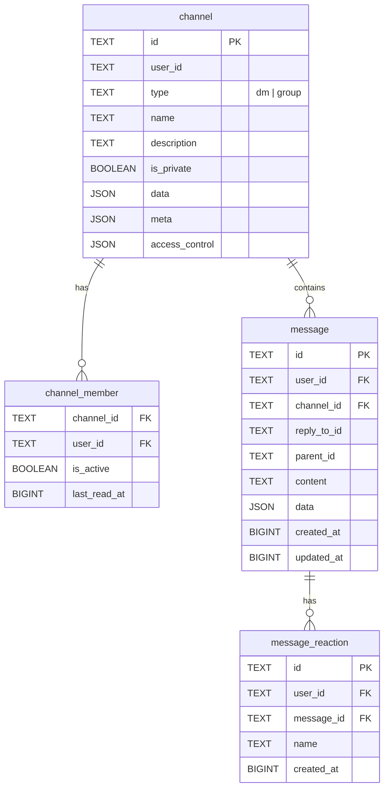
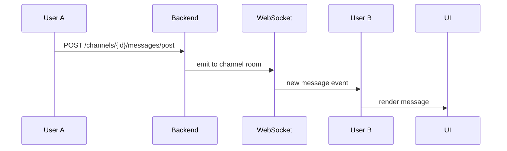

**Модуль:** Коллеги + Каналы

---

## Стек технологий

| Компонент | Технология |
|-----------|------------|
| Frontend | SvelteKit, shadcn-svelte |
| Backend | Python, FastAPI (Open WebUI core) |
| Database | PostgreSQL |
| Real-time | WebSocket (Socket.IO) |

## Схема данных

## Типы каналов

| Тип | Описание | Участники |
|-----|----------|-----------|
| `dm` | Личное сообщение | Ровно 2 |
| `group` | Групповой канал | 2+ |

## Real-time доставка

## Изменения в Open WebUI

| Файл | Изменение |
|------|-----------|
| `routers/channels.py` | `check_channels_access()` → pass (всегда включено) |
| `routers/channels.py` | Удалены проверки `has_permission("features.channels")` |
| `config.py` | `ENABLE_CHANNELS` default → True |
| `Sidebar.svelte` | Убрана проверка `$config.features.enable_channels` |
| `Sidebar.svelte` | Разделение на «Коллеги» (DM) и «Каналы» (group) |
| `ChannelItem.svelte` | ConfirmDialog при скрытии DM |
| `UserList.svelte` | Кнопка DM в списке пользователей админки |
