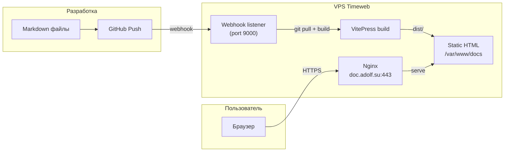
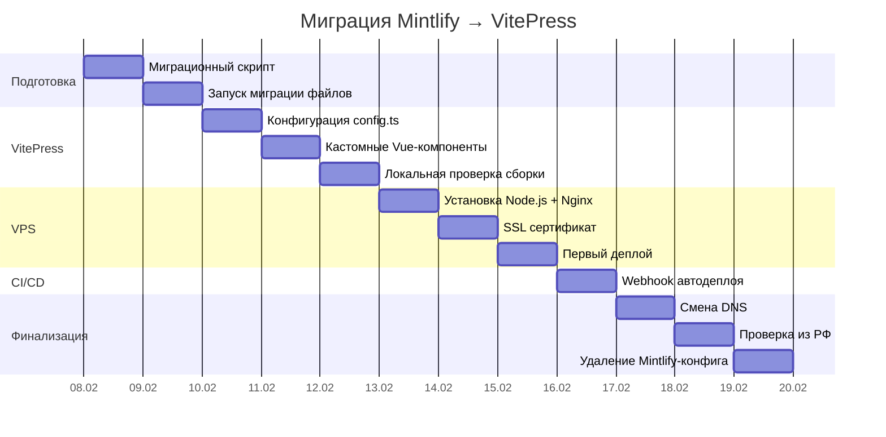

## Метаданные

| Параметр | Значение |
|:---------|:---------|
| Проект | ADOLF Documentation Platform |
| Версия ТЗ | 1.0 |
| Дата | Февраль 2026 |
| Причина миграции | IP-адреса Vercel (Mintlify) заблокированы Роскомнадзором |
| Текущий движок | Mintlify (docs.json + MDX) |
| Целевой движок | VitePress 1.x |
| Репозиторий | `https://github.com/Sign25/Docs.git` |
| Домен | `doc.adolf.su` |
| VPS | Timeweb Cloud (4 vCPU, 8 GB RAM, Ubuntu 24) |

---

## 1. Цель

Развернуть self-hosted документацию ADOLF Platform на VitePress с деплоем на VPS Timeweb, обеспечив доступность `doc.adolf.su` из России без VPN.

## 2. Scope

### 2.1 Входные данные

- 113 файлов `.md` в 12 модулях + корневые файлы
- Конфигурация навигации `docs.json` (Mintlify-формат)
- Mintlify MDX-компоненты: `Note`, `Warning`, `Info`, `Tip`, `Steps/Step`, `Tabs/Tab`, `Accordion`, `Card`, `Columns`, `CodeGroup`, `Frame`
- Mermaid-диаграммы (~50+ штук)
- Frontmatter YAML в каждом файле
- Логотипы SVG (light/dark)

### 2.2 Результат

- VitePress-сайт на `doc.adolf.su`, доступный из РФ
- Автоматический деплой при push в `main`
- Полнотекстовый поиск по документации
- Mermaid-рендеринг
- Адаптивная верстка (desktop + mobile)

---

## 3. Архитектура



### 3.1 Компоненты

| Компонент | Технология | Назначение |
|:----------|:-----------|:-----------|
| SSG | VitePress 1.x | Генерация статического HTML из Markdown |
| Mermaid | `vitepress-plugin-mermaid` | Рендеринг диаграмм |
| Поиск | VitePress MiniSearch (встроенный) | Полнотекстовый поиск |
| Web-сервер | Nginx | HTTPS, gzip, кэширование |
| SSL | Let's Encrypt (certbot) | TLS-сертификат |
| CI/CD | GitHub Webhook + bash-скрипт | Автодеплой при push |
| Node.js | v20 LTS | Runtime для сборки |

---

## 4. Маппинг Mintlify → VitePress

### 4.1 Frontmatter

Mintlify frontmatter сохраняется без изменений. VitePress также использует YAML frontmatter. Поле `mode: "wide"` игнорируется VitePress — для wide layout используется `layout: doc` + CSS-переопределение.

```yaml
# Было (Mintlify) — остаётся как есть
---
title: "Раздел 1: Архитектура"
description: "Модуль Core v4.0 — описание архитектуры"
mode: "wide"
---
```

### 4.2 Компоненты

| Mintlify | VitePress | Метод |
|:---------|:----------|:------|
| `<Note>` | `:::info` | Custom container |
| `<Warning>` | `:::warning` | Custom container |
| `<Info>` | `:::info` | Custom container |
| `<Tip>` | `:::tip` | Custom container |
| `<Check>` | `:::tip ✅` | Custom container |
| `<Steps>/<Step>` | Нумерованный список или Vue-компонент | Миграционный скрипт |
| `<Tabs>/<Tab>` | `vitepress-plugin-tabs` | Плагин |
| `<Accordion>` | `<details><summary>` | Нативный HTML |
| `<Card>` | Vue-компонент `VPCard` | Кастомный компонент |
| `<Columns>` | CSS Grid wrapper | Кастомный компонент |
| `<CodeGroup>` | VitePress code groups | Нативная поддержка |
| `<Frame>` | `<figure>` с CSS | Кастомный компонент |
| Mermaid | `vitepress-plugin-mermaid` | Плагин (синтаксис тот же) |

### 4.3 Навигация

Mintlify `docs.json` трансформируется в VitePress `config.ts`:

```
docs.json tabs[]          → config.ts nav[]
docs.json groups[]        → config.ts sidebar{}
docs.json groups[].pages  → config.ts sidebar[].items[]
docs.json anchors[]       → config.ts nav[] (правая часть)
```

### 4.4 Ссылки

Mintlify: `/core/adolf_core_0_introduction` (без расширения)
VitePress: `/core/adolf_core_0_introduction` (без расширения — совместимо, изменения не нужны)

### 4.5 MDX-экранирование

В VitePress **не нужно** экранировать `{` и `<` вне code-блоков (MDX-парсер не используется). Однако обратная очистка `\{` → `{` опциональна — VitePress корректно рендерит оба варианта.

---

## 5. Структура проекта

```
docs/                              # Корень VitePress проекта
├── .vitepress/
│   ├── config.ts                  # Конфигурация VitePress
│   ├── theme/
│   │   ├── index.ts               # Кастомная тема (extends default)
│   │   ├── style.css              # Переопределения стилей
│   │   └── components/
│   │       ├── VPCard.vue         # Компонент Card
│   │       ├── VPColumns.vue      # Компонент Columns
│   │       └── VPFrame.vue        # Компонент Frame
│   └── cache/                     # Build cache (в .gitignore)
├── public/
│   ├── logo/
│   │   ├── light.svg
│   │   └── dark.svg
│   └── favicon.svg
├── index.md                       # Главная страница
├── ADOLF_OVERVIEW.md
├── adolf_fastapi_reference.md
├── core/
│   ├── adolf_core_0_introduction.md
│   ├── adolf_core_1_1_open_webui_overview.md
│   └── ...
├── knowledge/
├── reputation/
├── watcher/
├── content_factory/
├── marketing/
├── scout/
├── cfo/
├── lex/
├── office/
├── shop/
└── logistic/
```

---

## 6. Конфигурация VitePress

### 6.1 config.ts (скелет)

```typescript
import { defineConfig } from 'vitepress'
import { withMermaid } from 'vitepress-plugin-mermaid'
import { tabsMarkdownPlugin } from 'vitepress-plugin-tabs'

export default withMermaid(
  defineConfig({
    title: 'ADOLF Platform',
    description: 'AI-Driven Operations Layer Framework',
    lang: 'ru-RU',
    
    head: [
      ['link', { rel: 'icon', href: '/favicon.svg' }],
      ['meta', { property: 'og:locale', content: 'ru_RU' }],
    ],

    themeConfig: {
      logo: {
        light: '/logo/light.svg',
        dark: '/logo/dark.svg',
      },
      siteTitle: 'ADOLF Platform',

      // --- Навигация (из docs.json tabs + anchors) ---
      nav: [
        { text: 'Overview', link: '/' },
        { text: 'Core', link: '/core/adolf_core_0_introduction' },
        { text: 'Knowledge', link: '/knowledge/adolf_knowledge_1_introduction' },
        { text: 'Logistic', link: '/logistic/adolf_logistic_0_introduction' },
        { text: 'Content', link: '/content_factory/adolf_content_factory_0_introduction' },
        { text: 'CFO', link: '/cfo/adolf_cfo_0_introduction' },
        { text: 'Reputation', link: '/reputation/adolf_reputation_0_introduction' },
        { text: 'Watcher', link: '/watcher/adolf_watcher_0_introduction' },
        { text: 'Marketing', link: '/marketing/adolf_marketing_0_introduction' },
        { text: 'Scout', link: '/scout/adolf_scout_0_introduction' },
        { text: 'Lex', link: '/lex/adolf_lex_0_introduction' },
        { text: 'Office', link: '/office/adolf_office_0_introduction' },
        { text: 'Shop', link: '/shop/adolf_shop_0_introduction' },
      ],

      // --- Sidebar (из docs.json groups → pages) ---
      sidebar: {
        '/core/': [
          {
            text: 'Introduction',
            items: [
              { text: 'Обзор модуля', link: '/core/adolf_core_0_introduction' },
            ]
          },
          {
            text: 'Open WebUI',
            items: [
              { text: 'Overview', link: '/core/adolf_core_1_1_open_webui_overview' },
              { text: 'Pipelines', link: '/core/adolf_core_1_2_open_webui_pipelines' },
              { text: 'Tools', link: '/core/adolf_core_1_3_open_webui_tools' },
              { text: 'PWA & Auth', link: '/core/adolf_core_1_4_open_webui_pwa_auth' },
            ]
          },
          {
            text: 'Infrastructure',
            items: [
              { text: 'PostgreSQL', link: '/core/adolf_core_2_5_postgresql' },
              { text: 'Notifications', link: '/core/adolf_core_2_6_notifications' },
              { text: 'Launcher', link: '/core/adolf_core_3_1_launcher' },
            ]
          }
        ],
        // ... аналогично для остальных 11 модулей
        // (полная конфигурация генерируется миграционным скриптом)
      },

      socialLinks: [
        { icon: 'github', link: 'https://github.com/Sign25/Docs' }
      ],

      search: {
        provider: 'local',  // Встроенный MiniSearch
        options: {
          locales: {
            root: {
              translations: {
                button: { buttonText: 'Поиск', buttonAriaLabel: 'Поиск' },
                modal: {
                  noResultsText: 'Нет результатов',
                  resetButtonTitle: 'Сбросить',
                  footer: { selectText: 'выбрать', navigateText: 'навигация' }
                }
              }
            }
          }
        }
      },

      footer: {
        message: 'ADOLF Platform Documentation',
        copyright: '© 2026 Ohana'
      },

      outline: { level: [2, 3], label: 'Содержание' },
      
      lastUpdated: {
        text: 'Обновлено',
        formatOptions: { dateStyle: 'short' }
      },
    },

    markdown: {
      config(md) {
        md.use(tabsMarkdownPlugin)
      },
      lineNumbers: true,
    },

    mermaid: {
      theme: 'default',
    },

    vite: {
      ssr: {
        noExternal: ['vitepress-plugin-tabs']
      }
    }
  })
)
```

### 6.2 Кастомная тема

```typescript
// .vitepress/theme/index.ts
import DefaultTheme from 'vitepress/theme'
import './style.css'
import VPCard from './components/VPCard.vue'
import VPColumns from './components/VPColumns.vue'
import VPFrame from './components/VPFrame.vue'
import { enhanceAppWithTabs } from 'vitepress-plugin-tabs/client'

export default {
  extends: DefaultTheme,
  enhanceApp({ app }) {
    enhanceAppWithTabs(app)
    app.component('Card', VPCard)
    app.component('Columns', VPColumns)
    app.component('Frame', VPFrame)
  }
}
```

---

## 7. Миграционный скрипт

Автоматизирует преобразование 113 файлов. Запускается однократно.

### 7.1 Задачи скрипта

1. Преобразовать Mintlify-компоненты в VitePress-аналоги
2. Сгенерировать `config.ts` sidebar из `docs.json`
3. Переместить ассеты в `public/`
4. Опционально: удалить MDX-экранирование (`\{` → `{`, `\<` → `<`)

### 7.2 Промпт для Claude Code

```
Контекст: Репозиторий Sign25/Docs содержит 113 .md файлов документации
в формате Mintlify. Нужно мигрировать на VitePress.

Задача: Написать Python-скрипт migrate_mintlify_to_vitepress.py, который:

1. Читает docs.json и генерирует sidebar-конфигурацию для VitePress
   config.ts (TypeScript объект).

2. Для каждого .md файла в репозитории выполняет замены:
   - <Note>...</Note>        → :::info\n...\n:::
   - <Warning>...</Warning>  → :::warning\n...\n:::  
   - <Info>...</Info>        → :::info\n...\n:::
   - <Tip>...</Tip>          → :::tip\n...\n:::
   - <Check>...</Check>      → :::tip ✅\n...\n:::
   - <Steps><Step title="X">...</Step></Steps> 
     → нумерованный список с ### заголовками
   - <Tabs><Tab title="X">...</Tab></Tabs>
     → :::tabs\n== X\n...\n:::  (формат vitepress-plugin-tabs)
   - <Accordion title="X">...</Accordion>  
     → <details><summary>X</summary>\n...\n</details>
   - <AccordionGroup>...</AccordionGroup> → убрать обёртку
   - <CodeGroup>...</CodeGroup> → VitePress code groups 
     (заменить обёртку на ::: code-group)
   - <Frame>...</Frame> → <figure class="frame">...</figure>
   - <Card> и <Columns> → оставить как есть (Vue-компоненты)

3. Сохраняет frontmatter без изменений.

4. НЕ трогает содержимое code-блоков (```...```) и inline-код.

5. Перемещает /logo/ и favicon.svg в public/.

6. Создаёт .vitepress/config.ts с полной sidebar-конфигурацией.

7. Выводит отчёт: количество обработанных файлов, замен по типам.

Требования:
- Python 3.10+, без внешних зависимостей (только stdlib + re)
- Regex-замены должны корректно обрабатывать multiline-контент
- Не модифицировать содержимое ```mermaid блоков
```

---

## 8. Развёртывание на VPS

### 8.1 Предварительные требования

- Ubuntu 24.04 на VPS
- Домен `doc.adolf.su` с A-записью на IP VPS
- SSH-доступ (root или sudo)
- GitHub PAT для клонирования репозитория

### 8.2 Промпт для Claude Code — установка окружения

```
Подключись к VPS по SSH и выполни первоначальную настройку для VitePress:

1. Установи Node.js 20 LTS через nvm:
   curl -o- https://raw.githubusercontent.com/nvm-sh/nvm/v0.40.1/install.sh | bash
   source ~/.bashrc
   nvm install 20
   nvm alias default 20

2. Установи глобальные зависимости:
   npm install -g pm2

3. Создай директории:
   mkdir -p /var/www/docs
   mkdir -p /opt/docs-builder

4. Клонируй репозиторий:
   cd /opt/docs-builder
   git clone https://<PAT>@github.com/Sign25/Docs.git docs
   cd docs

5. Установи зависимости VitePress:
   npm init -y
   npm install vitepress vitepress-plugin-mermaid vitepress-plugin-tabs

6. Выполни первую сборку:
   npx vitepress build
   cp -r .vitepress/dist/* /var/www/docs/

7. Убедись, что /var/www/docs/index.html существует.
```

### 8.3 Nginx-конфигурация

```nginx
# /etc/nginx/sites-available/docs.adolf.su

server {
    listen 80;
    server_name doc.adolf.su;
    return 301 https://$server_name$request_uri;
}

server {
    listen 443 ssl http2;
    server_name doc.adolf.su;

    # SSL (Let's Encrypt)
    ssl_certificate /etc/letsencrypt/live/doc.adolf.su/fullchain.pem;
    ssl_certificate_key /etc/letsencrypt/live/doc.adolf.su/privkey.pem;
    ssl_protocols TLSv1.2 TLSv1.3;
    ssl_ciphers ECDHE-ECDSA-AES128-GCM-SHA256:ECDHE-RSA-AES128-GCM-SHA256;
    ssl_prefer_server_ciphers off;

    # Security headers
    add_header X-Frame-Options "SAMEORIGIN" always;
    add_header X-Content-Type-Options "nosniff" always;
    add_header X-XSS-Protection "1; mode=block" always;
    add_header Referrer-Policy "strict-origin-when-cross-origin" always;

    # Gzip
    gzip on;
    gzip_vary on;
    gzip_min_length 1024;
    gzip_types text/plain text/css application/json application/javascript
               text/xml application/xml text/javascript image/svg+xml;

    # Статика VitePress
    root /var/www/docs;
    index index.html;

    # SPA fallback — VitePress генерирует .html для каждого маршрута
    location / {
        try_files $uri $uri.html $uri/ /404.html;
    }

    # Кэширование ассетов
    location /assets/ {
        expires 1y;
        add_header Cache-Control "public, immutable";
    }

    # Кэширование изображений и шрифтов
    location ~* \.(svg|png|jpg|jpeg|webp|woff2|woff)$ {
        expires 30d;
        add_header Cache-Control "public";
    }

    # Запрет доступа к служебным файлам
    location ~ /\. {
        deny all;
    }
}
```

### 8.4 SSL-сертификат

```
Промпт для Claude Code:

Получи SSL-сертификат Let's Encrypt для doc.adolf.su:

1. Установи certbot:
   apt install certbot python3-certbot-nginx

2. Убедись что DNS A-запись doc.adolf.su указывает на IP VPS.

3. Получи сертификат:
   certbot --nginx -d doc.adolf.su --non-interactive --agree-tos -m admin@adolf.su

4. Проверь автообновление:
   certbot renew --dry-run

5. Убедись что cron/timer для автообновления активен:
   systemctl status certbot.timer
```

### 8.5 Webhook автодеплоя

```
Промпт для Claude Code:

Создай webhook-listener для автодеплоя VitePress при push в GitHub:

1. Создай файл /opt/docs-builder/webhook.js:
   - Слушает POST на порту 9000
   - Проверяет X-Hub-Signature-256 (secret: сгенерировать)
   - При валидном запросе выполняет deploy.sh

2. Создай файл /opt/docs-builder/deploy.sh:
   #!/bin/bash
   set -e
   cd /opt/docs-builder/docs
   git pull origin main
   npm install --frozen-lockfile
   npx vitepress build
   rsync -a --delete .vitepress/dist/ /var/www/docs/
   echo "$(date): Deploy successful" >> /var/log/docs-deploy.log

3. Настрой PM2:
   pm2 start /opt/docs-builder/webhook.js --name docs-webhook
   pm2 save
   pm2 startup

4. Добавь в Nginx проксирование webhook:
   location /webhook {
       proxy_pass http://127.0.0.1:9000;
   }

5. Настрой GitHub Webhook:
   URL: https://doc.adolf.su/webhook
   Content type: application/json
   Secret: <сгенерированный>
   Events: push
```

---

## 9. DNS-конфигурация

Текущая DNS-запись `doc.adolf.su` указывает на `cname.mintlify-dns.com`. Необходимо изменить на A-запись VPS.

| Тип | Имя | Значение | TTL |
|:----|:----|:---------|:----|
| A | doc | `<IP VPS Timeweb>` | 300 |

После изменения DNS подождать до 30 минут (TTL=300).

---

## 10. План выполнения



Ориентировочный срок: 7–10 рабочих дней.

---

## 11. Чек-лист приёмки

- [ ] `doc.adolf.su` открывается из РФ без VPN
- [ ] Все 12 модулей отображаются в навигации
- [ ] Все 113 страниц рендерятся без ошибок
- [ ] Mermaid-диаграммы рендерятся корректно
- [ ] Полнотекстовый поиск работает (на русском)
- [ ] Мобильная версия адаптивна
- [ ] HTTPS работает (сертификат валиден)
- [ ] Автодеплой срабатывает при push в `main`
- [ ] Время сборки < 60 секунд
- [ ] Lighthouse Performance > 90

---

## 12. Откат

В случае проблем:
1. DNS `doc.adolf.su` вернуть на `cname.mintlify-dns.com` (доступно только через VPN)
2. Mintlify-конфигурация (`docs.json`) сохраняется в репозитории до полной приёмки
3. Файлы `.md` обратно совместимы — Mintlify frontmatter не удаляется

---

## 13. Файлы для удаления после миграции

После успешной приёмки удалить из репозитория:

| Файл | Причина |
|:-----|:--------|
| `docs.json` | Конфигурация Mintlify, заменена на `.vitepress/config.ts` |
| `.mintignore` | Специфичен для Mintlify |
| `config/mintlify_standards.md` | Стандарт заменяется на `config/vitepress_standards.md` |

---

## 14. Безопасность

| Мера | Реализация |
|:-----|:-----------|
| HTTPS | Let's Encrypt, автообновление |
| Webhook secret | HMAC SHA-256 подпись |
| Firewall | UFW: 22, 80, 443 |
| Git credentials | PAT в переменной окружения, не в коде |
| Доступ к сборке | Только localhost (webhook на 127.0.0.1:9000) |

---

Версия документа: 1.0
