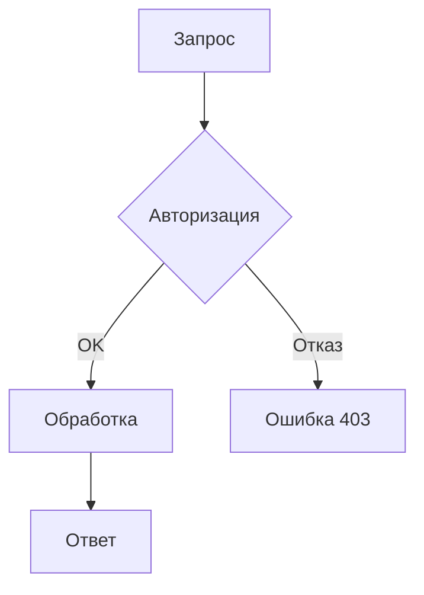

## 1. Общие сведения

Платформа документации ADOLF использует **Mintlify** в качестве движка рендеринга. Mintlify обрабатывает все файлы `.md` и `.mdx` через **MDX-парсер**, который интерпретирует контент как смесь Markdown и JSX. Это накладывает ряд обязательных требований на формат документов.

Репозиторий: `https://github.com/Sign25/Docs`

## 2. Структура репозитория

```
Docs/
├── docs.json                  # Конфигурация навигации Mintlify
├── .mintignore                # Исключения из сборки
├── README.md                  # Главная страница (/)
├── ADOLF_OVERVIEW.md          # Обзор платформы
├── images/                    # Статические ресурсы
│   ├── logo-light.svg
│   ├── logo-dark.svg
│   └── favicon.svg
├── core/                      # Модуль Core
│   ├── adolf_core_0_introduction.md
│   ├── adolf_core_1_1_open_webui_overview.md
│   └── ...
├── knowledge/                 # Модуль Knowledge
├── reputation/                # Модуль Reputation
├── watcher/                   # Модуль Watcher
├── content_factory/           # Модуль Content Factory
├── marketing/                 # Модуль Marketing
├── scout/                     # Модуль Scout
├── cfo/                       # Модуль CFO
├── lex/                       # Модуль Lex
├── office/                    # Модуль Office
├── shop/                      # Модуль Shop
└── logistic/                  # Модуль Logistic
```

Имя папки = имя модуля (lowercase). Имена файлов без версии: `adolf_modulename_N_section.md`. Версия указывается только внутри документа.

## 3. Frontmatter

Каждый `.md` файл **обязательно** начинается с YAML frontmatter:

```yaml
---
title: "Название раздела"
description: "Краткое описание содержимого страницы"
mode: "wide"
---
```

Заголовок H1 в теле документа **не используется** — он генерируется из `title`.

**Обязательные поля:**

| Поле | Описание |
|------|----------|
| `title` | Название страницы. Отображается в навигации и заголовке |
| `description` | Описание для SEO и поисковой выдачи Mintlify |

**Опциональные поля:**

| Поле | Описание |
|------|----------|
| `mode` | `"wide"` — широкий макет без боковой панели оглавления |
| `icon` | Иконка Font Awesome для навигации (например, `"server"`) |
| `sidebarTitle` | Альтернативное название в sidebar, если отличается от `title` |

## 4. MDX-совместимость — критические правила

Mintlify использует MDX v3 парсер. Следующие символы **ломают сборку**, если используются вне code-блоков:

### 4.1. Фигурные скобки

MDX интерпретирует `{` и `}` как JavaScript-выражения.

```
❌ Неправильно:
Фильтр: access_level <= {access_level}
Шаблон URL: /api/v1/users/{user_id}/settings

✅ Правильно (экранирование обратным слешем):
Фильтр: access_level \<= \{access\_level\}

✅ Правильно (code-блок):
Шаблон URL: `/api/v1/users/{user_id}/settings`

✅ Правильно (блок кода):
```text
/api/v1/users/{user_id}/settings
```​
```

### 4.2. Угловые скобки

MDX интерпретирует `<` и `>` как JSX-теги.

```
❌ Неправильно:
Условие: CTR < Target AND Views > 1000
Тип данных: List<String>

✅ Правильно (HTML-сущности):
Условие: CTR &lt; Target AND Views &gt; 1000

✅ Правильно (code-блок):
Условие: `CTR < Target AND Views > 1000`

✅ Правильно (экранирование):
Тип данных: List\<String\>
```

### 4.3. Сводная таблица экранирования

| Символ | Проблема | Решение 1 | Решение 2 | Решение 3 |
|--------|----------|-----------|-----------|-----------|
| `{` `}` | JS-выражение | `\{` `\}` | `` `{value}` `` | Блок кода |
| `<` `>` | JSX-тег | `&lt;` `&gt;` | `` `<value>` `` | `\<` `\>` |
| `<Tag>` | JSX-компонент | `&lt;Tag&gt;` | `` `<Tag>` `` | Блок кода |

### 4.4. Безопасные зоны

Символы `{}` и `<>` **не требуют экранирования** внутри:

- Блоков кода (` ``` `)
- Inline-кода (`` ` ` ``)
- Mermaid-диаграмм (` ```mermaid `)

## 5. Mermaid-диаграммы

Mintlify нативно поддерживает Mermaid. Диаграммы оформляются как стандартные code-блоки:

````

````

Поддерживаемые типы: `flowchart`, `sequenceDiagram`, `classDiagram`, `stateDiagram-v2`, `erDiagram`, `gantt`, `pie`, `gitgraph`.

Ограничения внутри Mermaid-блоков:
- Избегать символа `#` в текстах нод (конфликт с Markdown). Использовать `#35;` (HTML-код)
- Кириллица в текстах нод допускается
- Для длинных диаграмм Mintlify автоматически добавляет zoom/pan-контролы

## 6. Компоненты Mintlify

Mintlify предоставляет встроенные MDX-компоненты. Использование **опционально**, но рекомендуется для улучшения UX.

### 6.1. Callout-блоки

```mdx
<Note>Информационное примечание</Note>

<Warning>Предупреждение о возможных проблемах</Warning>

<Info>Дополнительная информация</Info>

<Tip>Полезный совет</Tip>

<Check>Подтверждение успешного действия</Check>
```

Правила оформления:
- Пустая строка **после** открывающего и **перед** закрывающим тегом
- Контент внутри с отступом 2 пробела
- Списки внутри callout — как обычные bullet-points

### 6.2. Шаги (Steps)

```mdx
<Steps>
  <Step title="Первый шаг">
    Описание действий первого шага.
  </Step>
  <Step title="Второй шаг">
    Описание действий второго шага.
  </Step>
</Steps>
```

### 6.3. Вкладки (Tabs)

```mdx
<Tabs>
  <Tab title="Wildberries">
    Описание для Wildberries.
  </Tab>
  <Tab title="Ozon">
    Описание для Ozon.
  </Tab>
</Tabs>
```

### 6.4. Аккордеоны

```mdx
<Accordion title="Детали реализации">
  Скрытый контент, разворачиваемый по клику.
</Accordion>

<AccordionGroup>
  <Accordion title="Вопрос 1">Ответ 1</Accordion>
  <Accordion title="Вопрос 2">Ответ 2</Accordion>
</AccordionGroup>
```

### 6.5. Карточки

```mdx
<Card title="Название" icon="server" href="/core/adolf_core_0_introduction">
  Описание карточки с ссылкой на страницу.
</Card>

<Columns cols={2}>
  <Card title="Модуль A" icon="chart-line" href="/cfo/adolf_cfo_0_introduction">
    Описание модуля A.
  </Card>
  <Card title="Модуль B" icon="shield" href="/lex/adolf_lex_0_introduction">
    Описание модуля B.
  </Card>
</Columns>
```

### 6.6. Группы кода (CodeGroup)

```mdx
<CodeGroup>
  ```python FastAPI
  @app.get("/health")
  async def health():
      return {"status": "ok"}
  ```

  ```bash cURL
  curl -X GET http://localhost:8000/health
  ```
</CodeGroup>
```

### 6.7. Frame (для изображений)

```mdx
<Frame>
  
</Frame>
```

## 7. Навигация — docs.json

Файл `docs.json` в корне репозитория управляет всей навигацией.

Структура: **tabs** → **groups** → **pages**.

```json
{
  "$schema": "https://mintlify.com/docs.json",
  "theme": "mint",
  "name": "ADOLF Platform",
  "colors": {
    "primary": "#22C55E",
    "light": "#07C983",
    "dark": "#15803D"
  },
  "favicon": "/images/favicon.svg",
  "logo": {
    "light": "/images/logo-light.svg",
    "dark": "/images/logo-dark.svg"
  },
  "navigation": {
    "tabs": [
      {
        "tab": "Overview",
        "groups": [
          {
            "group": "Platform",
            "pages": ["README", "ADOLF_OVERVIEW"]
          }
        ]
      },
      {
        "tab": "Core",
        "groups": [
          {
            "group": "Infrastructure",
            "pages": [
              "core/adolf_core_0_introduction",
              "core/adolf_core_1_1_open_webui_overview"
            ]
          }
        ]
      }
    ]
  }
}
```

Правила:
- Пути страниц **без расширения** `.md` (пишем `"core/adolf_core_0_introduction"`, не `"core/adolf_core_0_introduction.md"`)
- Каждая добавленная страница **должна** быть указана в `docs.json`, иначе она не появится в навигации (но будет доступна по прямой ссылке и через поиск)
- Иконки — только из набора **Font Awesome** (duotone по умолчанию)
- Навигация поддерживает вложенные группы

## 8. Файл .mintignore

Исключает файлы из обработки Mintlify. Формат аналогичен `.gitignore`.

```
# Автоматически игнорируются:
# .git, .github, .claude, .agents, .idea, node_modules,
# LICENSE.md, CHANGELOG.md, CONTRIBUTING.md

# Черновики
drafts/
*.draft.md

# Служебные файлы
config/
ui_reference/
```

## 9. Таблицы

Mintlify поддерживает стандартные Markdown-таблицы. Ограничения:

- Содержимое ячеек **не должно** содержать неэкранированные `<>` и `{}`
- Для сложных таблиц с кодом — использовать inline-код (`` ` ``)
- Выравнивание: `:---` (лево), `:---:` (центр), `---:` (право)

```markdown
| Параметр | Тип | Описание |
|:---------|:----|:---------|
| `user_id` | `int` | Идентификатор пользователя |
| `access_level` | `string` | Уровень доступа: `staff`, `manager`, `admin` |
```

## 10. Ссылки

Внутренние ссылки — корне-относительные (root-relative), без расширения:

```markdown
✅ [Модуль Core](/core/adolf_core_0_introduction)
✅ [Архитектура CFO](/cfo/adolf_cfo_1_architecture)

❌ [Модуль Core](../core/adolf_core_0_introduction.md)
❌ [Модуль Core](core/adolf_core_0_introduction)
```

Внешние ссылки — полный URL:

```markdown
[Wildberries API](https://openapi.wildberries.ru)
```

## 11. Изображения

Хранение: директория `/images/` в корне репозитория. Допустимые форматы: `.svg`, `.png`, `.jpg`, `.webp`.

```markdown

```

Для стилизации — компонент `<Frame>`:

```mdx
<Frame caption="Архитектура платформы ADOLF">
  
</Frame>
```

## 12. Контрольный чек-лист для нового документа

Перед коммитом каждого `.md` файла проверить:

- [ ] Frontmatter содержит `title` и `description`
- [ ] Заголовок H1 отсутствует (используется `title` из frontmatter)
- [ ] Нет неэкранированных `{` `}` вне code-блоков
- [ ] Нет неэкранированных `<` `>` вне code-блоков и Mintlify-компонентов
- [ ] Mermaid-диаграммы обёрнуты в ` ```mermaid `
- [ ] Внутренние ссылки root-relative без `.md`
- [ ] Страница добавлена в `docs.json`
- [ ] Файл проходит `mint broken-links` (при наличии локального CLI)

## 13. Версионирование документов

- Версия документа указывается в теле документа (в frontmatter `description` или в тексте)
- Имена файлов не содержат номер версии
- При обновлении — инкрементировать версию, старый файл удалять (не хранить параллельно)

## 14. Шаблон нового документа

```markdown
---
title: "Раздел N: Название раздела"
description: "Модуль ИмяМодуля v2.1 — краткое описание"
mode: "wide"
---

## Обзор

Краткое описание содержания раздела.

## Архитектура

```mermaid
flowchart TD
    A[Компонент A] --> B[Компонент B]
    B --> C[Компонент C]
```​

## Детали реализации

Основной контент раздела.

<Note>

  Важное замечание для пользователя.

</Note>

## API-эндпоинты

| Метод | Путь | Описание |
|:------|:-----|:---------|
| `GET` | `/api/v1/resource` | Получение ресурса |
| `POST` | `/api/v1/resource` | Создание ресурса |
```

---

Версия стандарта: 1.0
