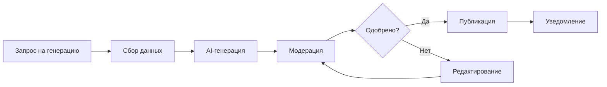

**Проект:** Генерация SEO-контента для карточек товаров  
**Модуль:** Content Factory  
**Версия:** 1.0  
**Дата:** Январь 2026

---

## Назначение документа

Данный документ является введением в модуль ADOLF CONTENT FACTORY и содержит:
- Общее описание модуля
- Бизнес-цели и метрики
- Структуру документации
- Краткий обзор функциональности

---

## Что такое ADOLF CONTENT FACTORY

ADOLF CONTENT FACTORY — функциональный модуль системы ADOLF, обеспечивающий автоматизированную генерацию SEO-оптимизированного контента для карточек товаров на маркетплейсах.

### Поддерживаемые платформы

| Платформа | Чтение карточек | Обновление контента | Порядок интеграции |
|-----------|:---------------:|:-------------------:|:------------------:|
| Wildberries | ✅ | ✅ | 1 |
| Ozon | ✅ | ✅ | 2 |
| Яндекс.Маркет | ✅ | ✅ | 3 |

### Основные возможности v1.0

| Функция | Описание |
|---------|----------|
| Генерация Title | SEO-оптимизированные названия товаров |
| Генерация Description | Продающие описания с ключевыми словами |
| Генерация Attributes | Заполнение характеристик товара |
| SEO-теги | Ключевые слова для поисковой оптимизации |
| Visual Prompting | ТЗ для дизайнера на основе ручного ввода |
| Модерация | Проверка контента перед публикацией |
| Автопубликация | Отправка контента через API маркетплейсов |
| Интерактивные кнопки | Быстрые действия: Утвердить, Исправить, ТЗ дизайнеру |

---

## Бизнес-цели

| Цель | Описание | Метрика успеха |
|------|----------|----------------|
| Качество контента | SEO-оптимизированные карточки | Рост органического трафика на 20% |
| Скорость создания | Автоматизация рутинной работы | Сокращение времени создания карточки с 2 часов до 15 минут |
| Единый стиль | Соответствие тону бренда | 90% контента без существенных правок |
| Конверсия | Улучшение описаний | Рост конверсии карточек на 10% |

---

## Структура документации

| Раздел | Содержание |
|--------|------------|
| **0. Введение** | Общий обзор (этот документ) |
| **1. Архитектура** | Компоненты, зависимости, интеграции |
| **2. Marketplace Adapters** | Интеграция с API WB, Ozon, YM |
| **3. AI Pipeline** | Анализ, генерация, валидация контента |
| **4. Open WebUI** | Pipeline, Tools, интерфейс пользователя |
| **5. Database** | Схема базы данных |
| **6. Сценарии** | Пользовательские сценарии |
| **7. Celery** | Фоновые задачи |

---

## Роли и доступ

| Роль | Описание | Доступ |
|------|----------|--------|
| Staff | Рядовые сотрудники | ❌ Нет доступа |
| Manager | Менеджер по маркетплейсам | ❌ Нет доступа |
| Senior | Старший менеджер | ✅ Все бренды |
| Director | Директор | ✅ Все бренды |
| Administrator | Администратор | ✅ Все бренды + настройки |

---

## Технологический стек

| Компонент | Технология |
|-----------|------------|
| Backend | FastAPI (Python 3.11) |
| Database | PostgreSQL 15 |
| Queue | Redis + Celery |
| AI (анализ) | GPT-5 mini (Timeweb AI Agent) |
| AI (генерация) | Claude Opus 4.5 |
| Interface | Open WebUI |
| Container | Docker |

---

## Зависимости от ADOLF Core

Модуль Content Factory интегрирован с ADOLF Core:

| Компонент Core | Использование |
|----------------|---------------|
| Middleware | Авторизация, роутинг, проксирование |
| PostgreSQL | Хранение данных о генерациях |
| Celery | Фоновые задачи публикации |
| Redis | Очередь задач |
| Notifications | Уведомления в Open WebUI |
| Knowledge | RAG-поиск данных о товарах |

---

## Зависимости от других модулей

| Модуль | Использование | Версия |
|--------|---------------|--------|
| Knowledge | Получение данных о товарах (состав, размеры) | v1.0 |
| Reputation | Анализ негативных отзывов для Visual Prompting | v2.0 |
| Watcher | Данные о конкурентах | v2.0 |

---

## Функционал v2.0 (планы)

При переходе на v2.0 планируется добавление:

| Функция | Описание |
|---------|----------|
| Rich-контент | HTML-описания для Ozon |
| Vision-анализ | Генерация описаний на основе фото товара |
| Анализ конкурентов | Интеграция с Watcher для TF-IDF |
| Ручной ввод URL | Парсинг карточек конкурентов |
| Auto Visual Prompting | ТЗ для дизайнера из негативных отзывов (Reputation) |
| Пакетная обработка | Генерация для списка артикулов |
| История и аналитика | Интерфейсы просмотра истории генераций |

---

## Быстрый старт

### Для Senior/Director

1. Откройте Open WebUI
2. Выберите Pipeline `@Adolf_Content`
3. Напишите: «Сгенерируй контент для артикула OM-12345»
4. Просмотрите сгенерированный контент
5. Внесите правки при необходимости
6. Напишите: «Опубликуй на Wildberries»

### Для администратора

1. Настройте API-ключи маркетплейсов в environment variables
2. Настройте параметры стиля контента для каждого бренда
3. Проверьте работу Celery Workers
4. Проверьте доступ к Knowledge Base

---

## Workflow модуля

---

## Контакты

| Вопрос | Ответственный |
|--------|---------------|
| Техническая поддержка | Administrator |
| Настройки контента | Administrator |
| Бизнес-процессы | Director |

---

**Документ подготовлен:** Январь 2026  
**Версия:** 1.0  
**Статус:** Черновик
