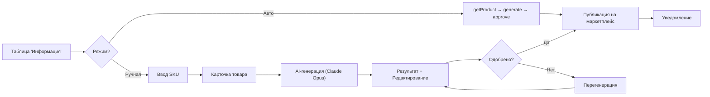

# ADOLF CONTENT FACTORY — Раздел 0: Введение

**Проект:** Генерация SEO-контента для карточек товаров
**Модуль:** Content Factory
**Версия:** 1.1
**Дата:** Февраль 2026

---

## Назначение документа

Данный документ является введением в модуль ADOLF CONTENT FACTORY и содержит:
- Общее описание модуля
- Бизнес-цели и метрики
- Структуру документации
- Краткий обзор функциональности

---

## Что такое ADOLF CONTENT FACTORY

ADOLF CONTENT FACTORY — функциональный модуль системы ADOLF, обеспечивающий автоматизированную генерацию SEO-оптимизированного контента для карточек товаров на маркетплейсах.

Модуль реализован как **отдельная страница** (`/content-factory`) внутри Open WebUI с визуальным интерфейсом: таблица товаров, формы ввода, карточки с фото, результаты генерации. AI-генерация выполняется на стороне бэкенда (Claude Opus).

### Поддерживаемые платформы

| Платформа | Чтение карточек | Обновление контента | Статус |
|-----------|:---------------:|:-------------------:|:------:|
| Wildberries | ✅ | ✅ | Активен |
| Ozon | ✅ | ✅ | В разработке |
| Яндекс.Маркет | ✅ | ✅ | В разработке |

### Основные возможности v1.0

| Функция | Описание |
|---------|----------|
| Генерация Title | SEO-оптимизированные названия товаров |
| Генерация Description | Продающие описания с ключевыми словами |
| SEO-теги | Ключевые слова для поисковой оптимизации |
| Автогенерация | Полный цикл за один клик: загрузка → генерация → утверждение |
| Ручная обработка | 3-шаговый флоу: ввод → карточка → результат |
| Dashboard | Таблица товаров ниже порога качества с кнопками действий |
| Диалог подтверждения | Кастомный модал для критических действий |
| Visual Prompting | ТЗ для дизайнера (mock-данные, v1.2) |
| Модерация | Проверка контента перед публикацией |
| Автопубликация | Отправка контента через API маркетплейсов |

---

## Бизнес-цели

| Цель | Описание | Метрика успеха |
|------|----------|----------------|
| Качество контента | SEO-оптимизированные карточки | Рост органического трафика на 20% |
| Скорость создания | Автоматизация рутинной работы | Сокращение времени создания карточки с 2 часов до 15 минут |
| Единый стиль | Соответствие тону бренда | 90% контента без существенных правок |
| Конверсия | Улучшение описаний | Рост конверсии карточек на 10% |

---

## Структура документации

| Раздел | Содержание |
|--------|------------|
| **0. Введение** | Общий обзор (этот документ) |
| **1. Архитектура** | Компоненты, зависимости, интеграции |
| **2. Marketplace Adapters** | Интеграция с API WB, Ozon, YM |
| **3. AI Pipeline** | Анализ, генерация, валидация контента |
| **4. Интерфейс (Open WebUI)** | Standalone-страница, разделы, кнопки, API |
| **5. Database** | Схема базы данных |
| **6. Сценарии** | Пользовательские сценарии |
| **7. Celery** | Фоновые задачи |
| **8. UI/UX Guidelines** | Правила UI, shadcn, навигация |

---

## Роли и доступ

| Роль | Описание | Доступ |
|------|----------|--------|
| Staff | Рядовые сотрудники | ❌ Нет доступа |
| Manager | Менеджер по маркетплейсам | ❌ Нет доступа |
| Senior | Старший менеджер | ✅ Все бренды |
| Director | Директор | ✅ Все бренды |
| Administrator | Администратор | ✅ Все бренды + настройки |

---

## Технологический стек

| Компонент | Технология |
|-----------|------------|
| Frontend | SvelteKit (Svelte 4), TailwindCSS, shadcn-svelte |
| Backend | FastAPI (Python 3.11) |
| Database | PostgreSQL 15 |
| Queue | Redis + Celery |
| AI (анализ) | GPT-5 mini (Timeweb AI Agent) |
| AI (генерация) | Claude Opus (Anthropic API, серверная генерация) |
| Interface | Open WebUI (standalone-страница `/content-factory`) |
| Container | Docker |

---

## Зависимости от ADOLF Core

Модуль Content Factory интегрирован с ADOLF Core:

| Компонент Core | Использование |
|----------------|---------------|
| Middleware | Авторизация, роутинг, проксирование |
| PostgreSQL | Хранение данных о генерациях |
| Celery | Фоновые задачи публикации |
| Redis | Очередь задач |
| Notifications | Toast-уведомления в UI |
| Knowledge | RAG-поиск данных о товарах |

---

## Зависимости от других модулей

| Модуль | Использование | Версия |
|--------|---------------|--------|
| Knowledge | Получение данных о товарах (состав, размеры) | v1.0 |
| Reputation | Анализ негативных отзывов для Visual Prompting | v2.0 |
| Watcher | Данные о конкурентах | v2.0 |

---

## Функционал v2.0 (планы)

| Функция | Описание |
|---------|----------|
| Rich-контент | HTML-описания для Ozon |
| Vision-анализ | Генерация описаний на основе фото товара |
| Анализ конкурентов | Интеграция с Watcher для TF-IDF |
| Auto Visual Prompting | ТЗ для дизайнера из негативных отзывов (Reputation) |
| Пакетная обработка | Генерация для списка артикулов (массовый выбор в таблице) |
| Публикации (полный раздел) | Реальные данные из API, полноценная таблица с фильтрами |
| Ozon / Яндекс.Маркет | Снятие ограничений «В разработке» |

---

## Быстрый старт

### Для Senior/Director

1. Откройте Open WebUI → перейдите в **Контент-Фабрика**
2. По умолчанию открывается раздел **«Информация»** с таблицей товаров
3. Для быстрой генерации — нажмите **«Авто»** в строке товара
4. Для детальной работы — нажмите **«Ручная»** или перейдите в раздел «Ручная обработка»
5. Просмотрите результат, при необходимости отредактируйте
6. Нажмите **«Утвердить»** для публикации

### Для администратора

1. На странице Контент-Фабрика нажмите ⚙ (настройки)
2. Настройте порог качества (слайдер 0–100)
3. Введите WB Token для доступа к API Wildberries
4. Сохраните настройки

---

## Workflow модуля

---

## Контакты

| Вопрос | Ответственный |
|--------|---------------|
| Техническая поддержка | Administrator |
| Настройки контента | Administrator |
| Бизнес-процессы | Director |

---

**Документ обновлён:** Февраль 2026
**Версия:** 1.1
**Статус:** Актуальный
