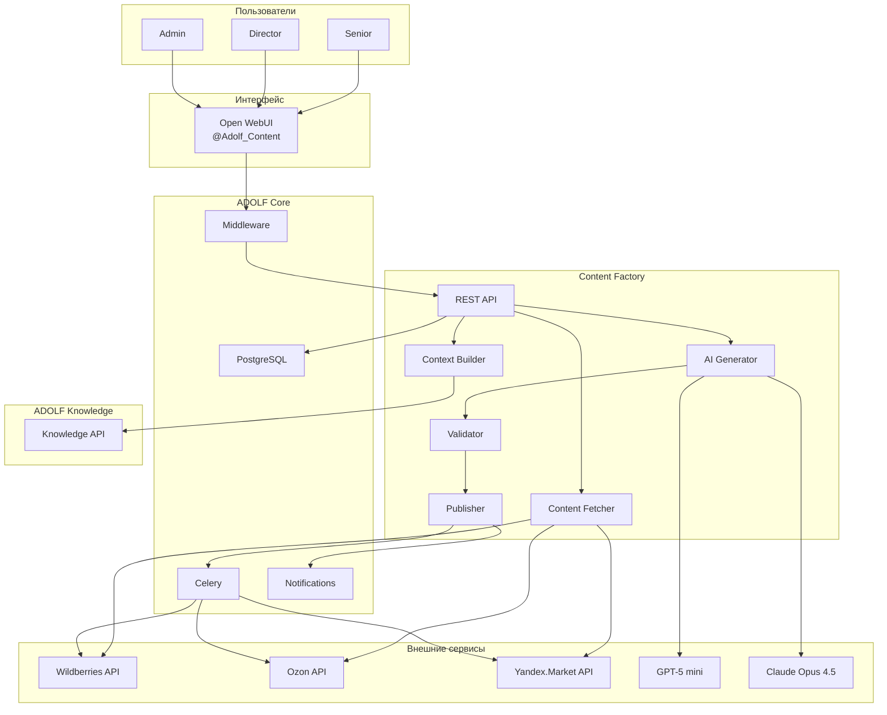
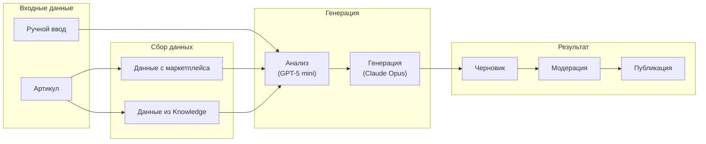
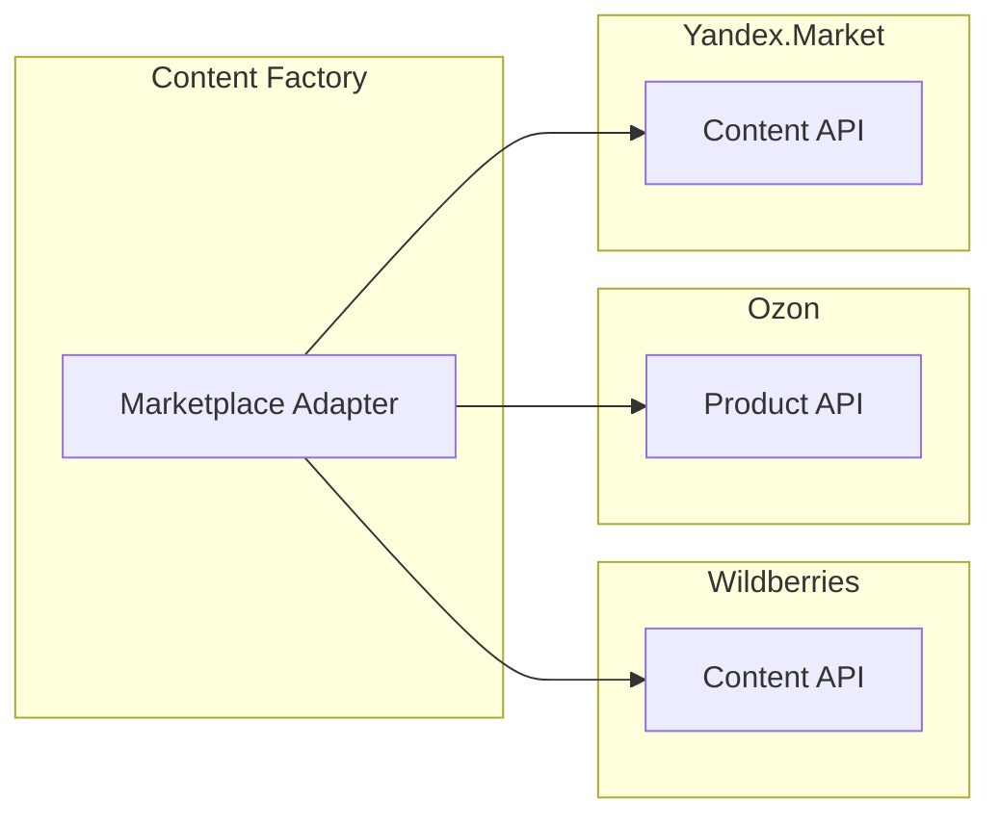
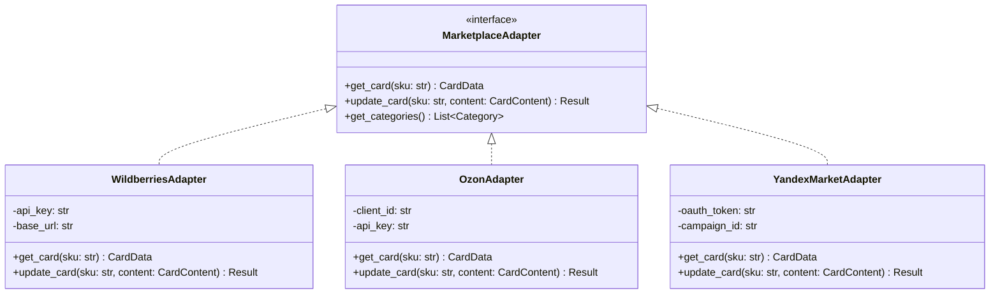
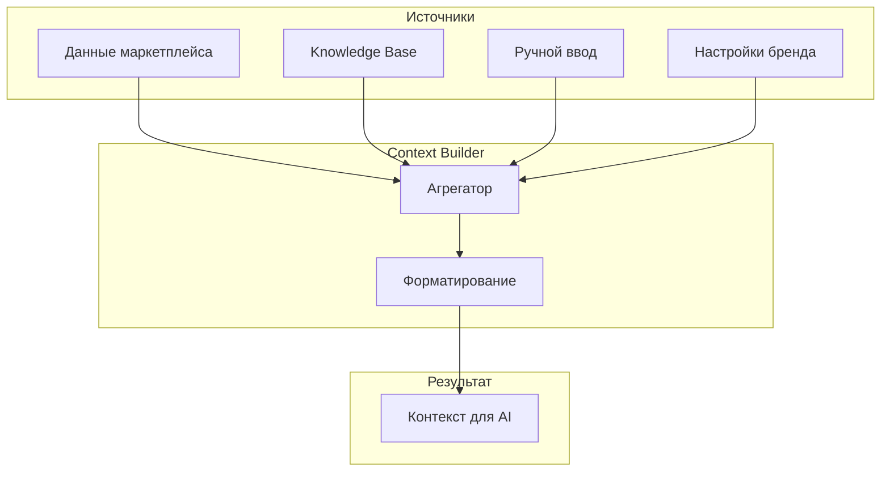
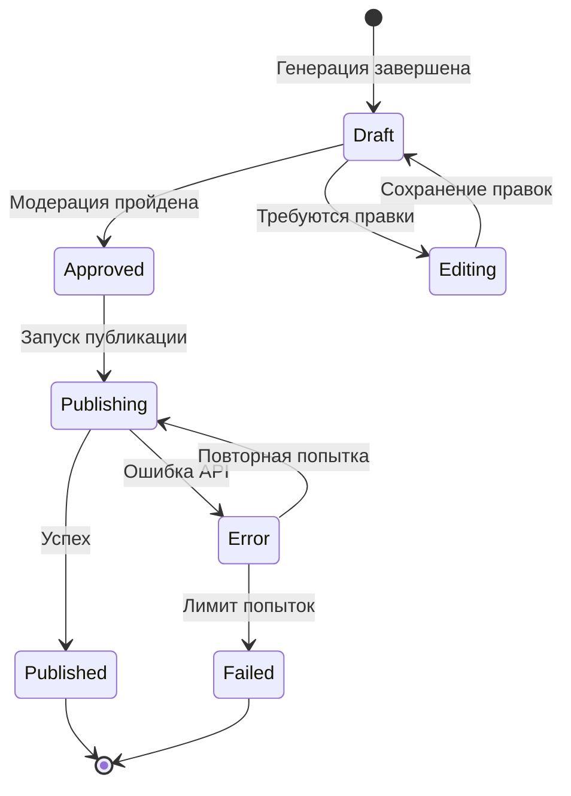

**Проект:** Генерация SEO-контента для карточек товаров  
**Модуль:** Content Factory  
**Версия:** 1.0  
**Дата:** Январь 2026

---

## 1.1 Назначение модуля

Content Factory — модуль автоматизированной генерации SEO-оптимизированного контента для карточек товаров на маркетплейсах.

### Основные функции

| Функция | Описание |
|---------|----------|
| Сбор данных | Получение текущей карточки через API маркетплейса |
| Обогащение контекста | Поиск дополнительных данных в Knowledge Base |
| AI-генерация | Создание Title, Description, Attributes, SEO-тегов |
| Visual Prompting | Формирование ТЗ для дизайнера |
| Модерация | Интерфейс проверки и редактирования контента |
| Публикация | Отправка контента через API маркетплейсов |

### Целевые пользователи

| Роль | Доступ | Функции |
|------|--------|---------|
| Senior | Все бренды | Генерация, модерация, публикация |
| Director | Все бренды | Генерация, модерация, публикация |
| Administrator | Все бренды | Полный доступ + настройка параметров |

---

## 1.2 Границы модуля

### Входит в модуль Content Factory

| Компонент | Описание |
|-----------|----------|
| Marketplace Adapters | Унифицированный интерфейс к API WB, Ozon, YM |
| Content Fetcher | Получение текущих данных карточки |
| Context Builder | Сбор контекста из Knowledge Base и ручного ввода |
| AI Pipeline | Анализ, генерация, валидация контента |
| Content Publisher | Публикация через API маркетплейсов |
| REST API | Endpoints для управления генерацией |
| Open WebUI Pipeline | Интерфейс `@Adolf_Content` |
| Celery Tasks | Фоновые задачи публикации |

### Не входит в модуль Content Factory

| Компонент | Где реализовано | Тип взаимодействия |
|-----------|-----------------|-------------------|
| Авторизация пользователей | ADOLF Core (Middleware) | Используется готовая |
| База знаний о товарах | ADOLF Knowledge | API-запросы |
| Хранение пользователей | ADOLF Core (PostgreSQL) | Чтение таблицы `users` |
| Система уведомлений | ADOLF Core (Notifications) | Event Bus |
| Генерация текста (LLM) | Timeweb AI / OpenAI | API-вызовы |
| Анализ отзывов | ADOLF Reputation | v2.0 |
| Данные конкурентов | ADOLF Watcher | v2.0 |

### Функционал v2.0 (не входит в MVP)

| Компонент | Описание |
|-----------|----------|
| Rich Content Generator | HTML-описания для Ozon |
| Vision Analyzer | Анализ фото товара |
| Competitor Analyzer | TF-IDF анализ конкурентов |
| Batch Processor | Пакетная обработка артикулов |
| History UI | Интерфейс просмотра истории |
| Analytics Dashboard | Аналитика по контенту |

---

## 1.3 Архитектура модуля

### 1.3.1 Общая схема



### 1.3.2 Схема потока данных



---

## 1.4 Зависимости от ADOLF Core

### 1.4.1 Middleware (FastAPI)

**Используемые возможности:**

| Возможность | Применение в Content Factory |
|-------------|------------------------------|
| Авторизация | Проверка `role IN (senior, director, admin)` |
| Идентификация | Получение `user_id` из заголовков |
| Роутинг | Регистрация endpoints `/api/v1/content/*` |
| Аудит | Логирование действий в `audit_log` |

**Разграничение доступа:**

```python
# Проверка доступа к Content Factory
ALLOWED_ROLES = ["senior", "director", "admin"]

def check_content_factory_access(user: User) -> bool:
    return user.role in ALLOWED_ROLES
```

### 1.4.2 PostgreSQL

**Используемые таблицы:**

| Таблица | Назначение |
|---------|------------|
| `users` | Роль пользователя, проверка доступа |
| `content_generations` | История генераций контента |
| `content_drafts` | Черновики на модерации |
| `content_publications` | Опубликованный контент |
| `content_settings` | Настройки стиля по брендам |
| `audit_log` | Логи всех действий |

### 1.4.3 Celery

**Фоновые задачи:**

| Задача | Описание | Триггер |
|--------|----------|---------|
| `publish_content` | Публикация на маркетплейс | После модерации |
| `retry_publication` | Повторная попытка при ошибке | Автоматически |

### 1.4.4 Notifications

**События для уведомлений:**

| Событие | Тип | Получатель |
|---------|-----|------------|
| `content.generated` | info | Инициатор |
| `content.published` | success | Инициатор |
| `content.publish_error` | error | Инициатор |

---

## 1.5 Зависимости от других модулей

### 1.5.1 ADOLF Knowledge (v1.0)

**Назначение:** Получение дополнительных данных о товаре для обогащения контекста.

**Используемые данные:**

| Тип данных | Пример | Применение |
|------------|--------|------------|
| Состав ткани | «95% хлопок, 5% эластан» | Description, Attributes |
| Размерная сетка | Таблица размеров | Attributes |
| Уход за изделием | Инструкции по стирке | Description |
| Особенности товара | Уникальные характеристики | Title, Description |

**API-вызов:**

```python
async def get_product_knowledge(sku: str) -> dict:
    """Получение данных о товаре из Knowledge Base."""
    response = await knowledge_api.search(
        query=f"артикул {sku} состав размер характеристики",
        filters={"category": "product"}
    )
    return response.results
```

### 1.5.2 ADOLF Reputation (v2.0)

**Назначение:** Автоматический анализ негативных отзывов для Visual Prompting.

**Примечание:** В MVP эта интеграция не реализуется. Visual Prompting работает на основе ручного ввода.

### 1.5.3 ADOLF Watcher (v2.0)

**Назначение:** Получение данных о карточках конкурентов для TF-IDF анализа.

**Примечание:** В MVP эта интеграция не реализуется. Работа только с собственными карточками.

---

## 1.6 Внешние интеграции

### 1.6.1 API маркетплейсов



**Сводка API:**

| Маркетплейс | API | Чтение | Обновление |
|-------------|-----|--------|------------|
| Wildberries | Content API | `GET /content/v2/cards/filter` | `POST /content/v2/cards/update` |
| Ozon | Product API | `POST /v3/product/info` | `POST /v1/product/import` |
| Yandex.Market | Content API | `GET /offer-cards` | `POST /offer-cards/update` |

### 1.6.2 AI-сервисы

| Сервис | Модель | Назначение |
|--------|--------|------------|
| Timeweb AI | GPT-5 mini | Анализ, извлечение ключевых слов |
| OpenAI | Claude Opus 4.5 | Генерация креативного контента |

---

## 1.7 Компоненты модуля

### 1.7.1 Marketplace Adapter

**Назначение:** Унифицированный интерфейс для работы с разными маркетплейсами.



### 1.7.2 Content Fetcher

**Назначение:** Получение текущих данных карточки с маркетплейса.

**Возвращаемые данные:**

| Поле | Тип | Описание |
|------|-----|----------|
| `sku` | string | Артикул товара |
| `marketplace` | enum | WB, Ozon, YM |
| `current_title` | string | Текущее название |
| `current_description` | string | Текущее описание |
| `current_attributes` | dict | Текущие характеристики |
| `category` | string | Категория товара |
| `brand` | string | Бренд |

### 1.7.3 Context Builder

**Назначение:** Сбор и агрегация контекста для AI-генерации.

**Источники контекста:**



### 1.7.4 AI Generator

**Назначение:** Генерация контента с использованием AI-моделей.

**Этапы генерации:**

| Этап | Модель | Вход | Выход |
|------|--------|------|-------|
| Анализ | GPT-5 mini | Контекст | Ключевые слова, структура |
| Title | Claude Opus 4.5 | Ключевые слова + контекст | Название товара |
| Description | Claude Opus 4.5 | Ключевые слова + контекст | Описание товара |
| Attributes | Claude Opus 4.5 | Категория + контекст | Характеристики |
| SEO-теги | Claude Opus 4.5 | Ключевые слова | Список тегов |

### 1.7.5 Validator

**Назначение:** Проверка сгенерированного контента перед публикацией.

**Правила валидации:**

| Правило | Описание | Действие при нарушении |
|---------|----------|------------------------|
| Длина Title | Соответствие лимитам маркетплейса | Обрезка / перегенерация |
| Длина Description | Соответствие лимитам | Обрезка / перегенерация |
| Запрещённые слова | Проверка по списку | Замена / перегенерация |
| Бренд | Корректное название бренда | Замена |
| Спецсимволы | Недопустимые символы | Удаление |

### 1.7.6 Publisher

**Назначение:** Публикация контента через API маркетплейсов.

**Workflow публикации:**



---

## 1.8 Настройки модуля

### 1.8.1 Environment Variables

| Переменная | Описание | Пример |
|------------|----------|--------|
| `WB_API_KEY` | API-ключ Wildberries | `xxx...` |
| `OZON_CLIENT_ID` | Client ID Ozon | `123456` |
| `OZON_API_KEY` | API-ключ Ozon | `xxx...` |
| `YM_OAUTH_TOKEN` | OAuth-токен Яндекс.Маркет | `xxx...` |
| `YM_CAMPAIGN_ID` | ID кампании Яндекс.Маркет | `789012` |
| `CLAUDE_API_KEY` | API-ключ Claude | `sk-...` |

### 1.8.2 Настройки контента (content_settings)

| Параметр | Тип | Описание |
|----------|-----|----------|
| `brand_id` | string | ID бренда |
| `tone` | string | Тон коммуникации |
| `accent_words` | array | Слова-акценты |
| `forbidden_words` | array | Запрещённые слова |
| `title_template` | string | Шаблон названия |
| `description_style` | string | Стиль описания |

---

## 1.9 Технические ограничения

| Параметр | Ограничение |
|----------|-------------|
| Режим работы | Единичная генерация (пакетная в v2.0) |
| Время генерации (целевое) | < 30 секунд |
| Лимит Title (WB) | 100 символов |
| Лимит Title (Ozon) | 255 символов |
| Лимит Description (WB) | 5000 символов |
| Лимит Description (Ozon) | 6000 символов |
| Повторные попытки публикации | 3 |

---

**Документ подготовлен:** Январь 2026  
**Версия:** 1.0  
**Статус:** Черновик
