**Проект:** Генерация SEO-контента для карточек товаров  
**Модуль:** Content Factory  
**Версия:** 1.0  
**Дата:** Январь 2026

---

## 3.1 Назначение

AI Pipeline — конвейер обработки данных и генерации контента с использованием AI-моделей.

### Этапы пайплайна

```mermaid
graph LR
    subgraph INPUT["Входные данные"]
        A1["Данные карточки"]
        A2["Knowledge Base"]
        A3["Ручной ввод"]
        A4["Настройки бренда"]
    end

    subgraph PIPELINE["AI Pipeline"]
        B["Context Builder"]
        C["Analyzer<br/>(GPT-5 mini)"]
        D["Generator<br/>(Claude Opus)"]
        E["Validator"]
    end

    subgraph OUTPUT["Результат"]
        F["Черновик контента"]
    end

    A1 & A2 & A3 & A4 --> B
    B --> C
    C --> D
    D --> E
    E --> F
```



### Распределение AI-моделей

| Этап | Модель | Назначение |
|------|--------|------------|
| Анализ контекста | GPT-5 mini | Извлечение ключевых слов, структуризация |
| Генерация Title | Claude Opus 4.5 | Креативное название с SEO |
| Генерация Description | Claude Opus 4.5 | Продающее описание |
| Генерация Attributes | Claude Opus 4.5 | Заполнение характеристик |
| Генерация SEO-тегов | Claude Opus 4.5 | Ключевые слова для поиска |
| Visual Prompting | GPT-5 mini | ТЗ для дизайнера |

---

## 3.2 Context Builder

### 3.2.1 Назначение

Сбор и агрегация данных из различных источников для формирования контекста генерации.

### 3.2.2 Источники данных

```mermaid
graph TB
    subgraph SOURCES["Источники"]
        MP["Marketplace API<br/>Текущая карточка"]
        KB["Knowledge Base<br/>Данные о товаре"]
        MANUAL["Ручной ввод<br/>Особенности, акценты"]
        SETTINGS["Brand Settings<br/>Тон, стиль, запреты"]
    end

    subgraph BUILDER["Context Builder"]
        COLLECT["Сбор данных"]
        MERGE["Объединение"]
        FORMAT["Форматирование"]
    end

    subgraph OUTPUT["Результат"]
        CTX["GenerationContext"]
    end

    MP --> COLLECT
    KB --> COLLECT
    MANUAL --> COLLECT
    SETTINGS --> COLLECT
    
    COLLECT --> MERGE
    MERGE --> FORMAT
    FORMAT --> CTX
```



### 3.2.3 Структура контекста

```python
from dataclasses import dataclass, field
from typing import Optional, List, Dict


@dataclass
class BrandSettings:
    """Настройки стиля бренда."""
    brand_id: str
    brand_name: str
    tone: str                              # "стильный", "заботливый"
    accent_words: List[str] = field(default_factory=list)
    forbidden_words: List[str] = field(default_factory=list)
    title_template: Optional[str] = None   # Шаблон названия
    description_style: Optional[str] = None


@dataclass
class ProductKnowledge:
    """Данные о товаре из Knowledge Base."""
    composition: Optional[str] = None      # Состав ткани
    size_chart: Optional[str] = None       # Размерная сетка
    care_instructions: Optional[str] = None # Уход за изделием
    features: List[str] = field(default_factory=list)
    source_documents: List[str] = field(default_factory=list)


@dataclass
class ManualInput:
    """Ручной ввод пользователя."""
    key_features: List[str] = field(default_factory=list)
    target_audience: Optional[str] = None
    unique_selling_points: List[str] = field(default_factory=list)
    additional_notes: Optional[str] = None
    # Для Visual Prompting
    known_issues: List[str] = field(default_factory=list)
    photo_requirements: List[str] = field(default_factory=list)


@dataclass
class GenerationContext:
    """Полный контекст для генерации."""
    # Идентификация
    sku: str
    marketplace: str
    category: str
    category_id: int
    
    # Текущие данные карточки
    current_title: Optional[str] = None
    current_description: Optional[str] = None
    current_attributes: Dict = field(default_factory=dict)
    
    # Обогащение
    brand_settings: Optional[BrandSettings] = None
    product_knowledge: Optional[ProductKnowledge] = None
    manual_input: Optional[ManualInput] = None
    
    # Метаданные
    user_id: str = ""
    request_id: str = ""
```

### 3.2.4 Реализация Context Builder

```python
class ContextBuilder:
    """Построитель контекста для генерации."""
    
    def __init__(
        self,
        knowledge_api: KnowledgeAPI,
        settings_repo: SettingsRepository
    ):
        self.knowledge_api = knowledge_api
        self.settings_repo = settings_repo
    
    async def build(
        self,
        card_data: CardData,
        manual_input: Optional[ManualInput] = None,
        user_id: str = ""
    ) -> GenerationContext:
        """Сборка контекста для генерации."""
        
        # Получение настроек бренда
        brand_settings = await self._get_brand_settings(card_data.brand)
        
        # Поиск данных в Knowledge Base
        product_knowledge = await self._search_knowledge(card_data.sku)
        
        return GenerationContext(
            sku=card_data.sku,
            marketplace=card_data.marketplace.value,
            category=card_data.category or "",
            category_id=card_data.category_id or 0,
            current_title=card_data.title,
            current_description=card_data.description,
            current_attributes=card_data.attributes or {},
            brand_settings=brand_settings,
            product_knowledge=product_knowledge,
            manual_input=manual_input,
            user_id=user_id,
            request_id=generate_request_id()
        )
    
    async def _get_brand_settings(self, brand_name: str) -> Optional[BrandSettings]:
        """Получение настроек бренда."""
        
        # Определение brand_id по названию
        brand_id = self._resolve_brand_id(brand_name)
        
        settings = await self.settings_repo.get_content_settings(brand_id)
        if not settings:
            return None
        
        return BrandSettings(
            brand_id=brand_id,
            brand_name=brand_name,
            tone=settings.get("tone", "нейтральный"),
            accent_words=settings.get("accent_words", []),
            forbidden_words=settings.get("forbidden_words", []),
            title_template=settings.get("title_template"),
            description_style=settings.get("description_style")
        )
    
    def _resolve_brand_id(self, brand_name: str) -> str:
        """Определение brand_id по названию бренда."""
        
        brand_lower = brand_name.lower() if brand_name else ""
        
        if "кидс" in brand_lower or "kids" in brand_lower:
            return "ohana_kids"
        elif "охана" in brand_lower or "ohana" in brand_lower:
            return "ohana_market"
        else:
            return "ohana_market"  # Default
    
    async def _search_knowledge(self, sku: str) -> Optional[ProductKnowledge]:
        """Поиск данных о товаре в Knowledge Base."""
        
        try:
            results = await self.knowledge_api.search(
                query=f"артикул {sku} состав размер характеристики уход",
                filters={"category": "product"},
                limit=5
            )
            
            if not results:
                return None
            
            # Агрегация результатов
            knowledge = ProductKnowledge()
            
            for result in results:
                text = result.get("content", "").lower()
                source = result.get("source", "")
                
                knowledge.source_documents.append(source)
                
                # Извлечение состава
                if "состав" in text and not knowledge.composition:
                    knowledge.composition = self._extract_composition(result["content"])
                
                # Извлечение инструкций по уходу
                if "уход" in text or "стирк" in text:
                    knowledge.care_instructions = self._extract_care(result["content"])
            
            return knowledge
            
        except Exception as e:
            logger.warning(f"Knowledge search failed for {sku}: {e}")
            return None
    
    def _extract_composition(self, text: str) -> Optional[str]:
        """Извлечение состава из текста."""
        # Простая реализация, в продакшене — через AI
        lines = text.split("\n")
        for line in lines:
            if "состав" in line.lower():
                return line.strip()
        return None
    
    def _extract_care(self, text: str) -> Optional[str]:
        """Извлечение инструкций по уходу."""
        lines = text.split("\n")
        for line in lines:
            if "уход" in line.lower() or "стирк" in line.lower():
                return line.strip()
        return None
```

---

## 3.3 Analyzer (GPT-5 mini)

### 3.3.1 Назначение

Анализ контекста и извлечение структурированных данных для генерации.

### 3.3.2 Задачи анализатора

| Задача | Описание | Выход |
|--------|----------|-------|
| Извлечение ключевых слов | Определение SEO-релевантных терминов | Список keywords |
| Определение USP | Уникальные преимущества товара | Список USP |
| Анализ категории | Специфика категории для описания | Category insights |
| Структура описания | Рекомендуемая структура | Outline |

### 3.3.3 Промпт анализатора

```python
ANALYZER_SYSTEM_PROMPT = """
Ты — SEO-аналитик для маркетплейсов. Твоя задача — проанализировать данные о товаре и подготовить структурированную информацию для генерации контента карточки.

ПРАВИЛА АНАЛИЗА:
1. Извлекай только релевантные ключевые слова для категории
2. Определяй уникальные преимущества товара (USP)
3. Учитывай специфику маркетплейса
4. Формируй структуру описания на основе категории

ФОРМАТ ОТВЕТА — строго JSON:
{
    "keywords": ["ключевое слово 1", "ключевое слово 2", ...],
    "usp": ["преимущество 1", "преимущество 2", ...],
    "category_insights": {
        "important_attributes": ["атрибут 1", "атрибут 2"],
        "buyer_concerns": ["что важно покупателю 1", "что важно покупателю 2"],
        "recommended_structure": ["раздел 1", "раздел 2"]
    },
    "title_keywords": ["ключевое слово для названия 1", ...],
    "description_outline": ["пункт 1", "пункт 2", ...]
}
"""

ANALYZER_USER_PROMPT = """
Проанализируй данные о товаре:

АРТИКУЛ: {sku}
МАРКЕТПЛЕЙС: {marketplace}
КАТЕГОРИЯ: {category}

ТЕКУЩЕЕ НАЗВАНИЕ: {current_title}
ТЕКУЩЕЕ ОПИСАНИЕ: {current_description}

ДАННЫЕ ИЗ БАЗЫ ЗНАНИЙ:
- Состав: {composition}
- Уход: {care_instructions}
- Особенности: {features}

ДОПОЛНИТЕЛЬНАЯ ИНФОРМАЦИЯ ОТ ПОЛЬЗОВАТЕЛЯ:
- Ключевые особенности: {key_features}
- Целевая аудитория: {target_audience}
- Уникальные преимущества: {unique_selling_points}

Верни JSON с анализом.
"""
```

### 3.3.4 Реализация анализатора

```python
import json
from dataclasses import dataclass
from typing import List, Dict


@dataclass
class AnalysisResult:
    """Результат анализа контекста."""
    keywords: List[str]
    usp: List[str]
    category_insights: Dict
    title_keywords: List[str]
    description_outline: List[str]
    raw_response: Dict


class ContentAnalyzer:
    """Анализатор контекста для генерации."""
    
    def __init__(self, gpt_client: GPTClient):
        self.gpt_client = gpt_client
    
    async def analyze(self, context: GenerationContext) -> AnalysisResult:
        """Анализ контекста и извлечение структурированных данных."""
        
        # Подготовка данных для промпта
        features = []
        composition = ""
        care = ""
        
        if context.product_knowledge:
            features = context.product_knowledge.features
            composition = context.product_knowledge.composition or ""
            care = context.product_knowledge.care_instructions or ""
        
        key_features = []
        target_audience = ""
        usp_input = []
        
        if context.manual_input:
            key_features = context.manual_input.key_features
            target_audience = context.manual_input.target_audience or ""
            usp_input = context.manual_input.unique_selling_points
        
        # Формирование промпта
        user_prompt = ANALYZER_USER_PROMPT.format(
            sku=context.sku,
            marketplace=context.marketplace,
            category=context.category,
            current_title=context.current_title or "Не указано",
            current_description=context.current_description or "Не указано",
            composition=composition or "Не указано",
            care_instructions=care or "Не указано",
            features=", ".join(features) if features else "Не указано",
            key_features=", ".join(key_features) if key_features else "Не указано",
            target_audience=target_audience or "Не указано",
            unique_selling_points=", ".join(usp_input) if usp_input else "Не указано"
        )
        
        # Вызов GPT-5 mini
        response = await self.gpt_client.chat_completion(
            model="gpt-5-mini",
            messages=[
                {"role": "system", "content": ANALYZER_SYSTEM_PROMPT},
                {"role": "user", "content": user_prompt}
            ],
            temperature=0.3,
            max_tokens=1000,
            response_format={"type": "json_object"}
        )
        
        # Парсинг результата
        try:
            data = json.loads(response.content)
        except json.JSONDecodeError:
            data = self._parse_fallback(response.content)
        
        return AnalysisResult(
            keywords=data.get("keywords", []),
            usp=data.get("usp", []),
            category_insights=data.get("category_insights", {}),
            title_keywords=data.get("title_keywords", []),
            description_outline=data.get("description_outline", []),
            raw_response=data
        )
    
    def _parse_fallback(self, content: str) -> Dict:
        """Fallback-парсинг при ошибке JSON."""
        return {
            "keywords": [],
            "usp": [],
            "category_insights": {},
            "title_keywords": [],
            "description_outline": []
        }
```

---

## 3.4 Generator (Claude Opus 4.5)

### 3.4.1 Назначение

Генерация креативного SEO-оптимизированного контента для карточки товара.

### 3.4.2 Генерируемый контент

| Поле | Описание | Лимиты |
|------|----------|--------|
| Title | SEO-название товара | 100-255 символов |
| Description | Продающее описание | 3000-6000 символов |
| Attributes | Характеристики товара | Зависит от категории |
| SEO Tags | Ключевые слова | 5-20 тегов |

### 3.4.3 Промпты генератора

#### System Prompt (базовый)

```python
GENERATOR_SYSTEM_PROMPT = """
Ты — профессиональный копирайтер для маркетплейсов с опытом в SEO и продающих текстах.

ТВОИ ЗАДАЧИ:
1. Создавать SEO-оптимизированные названия товаров
2. Писать продающие описания с ключевыми словами
3. Формулировать характеристики товара
4. Подбирать релевантные SEO-теги

ОБЩИЕ ПРАВИЛА:
- Используй естественный язык, избегай переспама ключевыми словами
- Пиши на русском языке
- Учитывай специфику категории товара
- Делай акцент на преимуществах для покупателя
- Не используй запрещённые слова бренда
- Следуй тону коммуникации бренда

{brand_instructions}

ВАЖНО: Соблюдай лимиты символов для каждого маркетплейса.
"""

BRAND_INSTRUCTIONS_TEMPLATE = """
НАСТРОЙКИ БРЕНДА "{brand_name}":
- Тон коммуникации: {tone}
- Слова-акценты (использовать): {accent_words}
- Запрещённые слова (НЕ использовать): {forbidden_words}
- Стиль описания: {description_style}
"""
```

#### Промпт для Title

```python
TITLE_PROMPT = """
Создай SEO-оптимизированное название товара.

ИСХОДНЫЕ ДАННЫЕ:
- Текущее название: {current_title}
- Категория: {category}
- Бренд: {brand_name}
- Ключевые слова для названия: {title_keywords}

ТРЕБОВАНИЯ:
- Длина: максимум {max_length} символов
- Включи бренд в начале или конце
- Используй 2-3 ключевых слова
- Название должно быть информативным и привлекательным

ФОРМАТ ОТВЕТА:
Верни только название товара, без пояснений.
"""
```

#### Промпт для Description

```python
DESCRIPTION_PROMPT = """
Напиши продающее описание товара.

ИСХОДНЫЕ ДАННЫЕ:
- Название: {title}
- Категория: {category}
- Бренд: {brand_name}

КЛЮЧЕВЫЕ СЛОВА (включи естественно в текст):
{keywords}

УНИКАЛЬНЫЕ ПРЕИМУЩЕСТВА (USP):
{usp}

ДОПОЛНИТЕЛЬНАЯ ИНФОРМАЦИЯ:
- Состав: {composition}
- Уход за изделием: {care_instructions}

СТРУКТУРА ОПИСАНИЯ:
{description_outline}

ТРЕБОВАНИЯ:
- Длина: {min_length}-{max_length} символов
- Первый абзац — захватывающий, с главным преимуществом
- Используй буллеты для характеристик
- Завершай призывом к действию
- Включи ключевые слова естественно (не более 3-4% плотность)

ФОРМАТ ОТВЕТА:
Верни только текст описания, без пояснений.
"""
```

#### Промпт для Attributes

```python
ATTRIBUTES_PROMPT = """
Заполни характеристики товара для категории "{category}".

ИСХОДНЫЕ ДАННЫЕ:
- Текущие характеристики: {current_attributes}
- Состав: {composition}
- Особенности: {features}

ВАЖНЫЕ АТРИБУТЫ ДЛЯ КАТЕГОРИИ:
{important_attributes}

ТРЕБОВАНИЯ:
- Заполни все обязательные атрибуты
- Используй точные значения
- Формат значений должен соответствовать требованиям маркетплейса

ФОРМАТ ОТВЕТА — JSON:
{{
    "attribute_name_1": "значение",
    "attribute_name_2": "значение"
}}
"""
```

#### Промпт для SEO Tags

```python
SEO_TAGS_PROMPT = """
Подбери SEO-теги для товара.

ИСХОДНЫЕ ДАННЫЕ:
- Название: {title}
- Категория: {category}
- Ключевые слова из анализа: {keywords}

ТРЕБОВАНИЯ:
- Количество тегов: 10-15
- Включи высокочастотные и низкочастотные запросы
- Теги должны быть релевантны товару
- Без дублирования

ФОРМАТ ОТВЕТА — JSON:
{{
    "tags": ["тег1", "тег2", "тег3", ...]
}}
"""
```

### 3.4.4 Реализация генератора

```python
@dataclass
class GeneratedContent:
    """Сгенерированный контент."""
    title: str
    description: str
    attributes: Dict[str, str]
    seo_tags: List[str]
    generation_metadata: Dict


class ContentGenerator:
    """Генератор контента с использованием Claude Opus."""
    
    # Лимиты по маркетплейсам
    LIMITS = {
        "wb": {"title": 100, "description_min": 500, "description_max": 5000},
        "ozon": {"title": 255, "description_min": 500, "description_max": 6000},
        "ym": {"title": 150, "description_min": 300, "description_max": 3000}
    }
    
    def __init__(self, claude_client: ClaudeClient):
        self.claude_client = claude_client
    
    async def generate(
        self,
        context: GenerationContext,
        analysis: AnalysisResult
    ) -> GeneratedContent:
        """Генерация полного контента карточки."""
        
        # Получение лимитов для маркетплейса
        limits = self.LIMITS.get(context.marketplace, self.LIMITS["wb"])
        
        # Формирование системного промпта с настройками бренда
        system_prompt = self._build_system_prompt(context.brand_settings)
        
        # Генерация Title
        title = await self._generate_title(
            context, analysis, system_prompt, limits["title"]
        )
        
        # Генерация Description
        description = await self._generate_description(
            context, analysis, system_prompt, title,
            limits["description_min"], limits["description_max"]
        )
        
        # Генерация Attributes
        attributes = await self._generate_attributes(
            context, analysis, system_prompt
        )
        
        # Генерация SEO Tags
        seo_tags = await self._generate_seo_tags(
            context, analysis, system_prompt, title
        )
        
        return GeneratedContent(
            title=title,
            description=description,
            attributes=attributes,
            seo_tags=seo_tags,
            generation_metadata={
                "model": "claude-opus-4.5",
                "context_sku": context.sku,
                "marketplace": context.marketplace,
                "keywords_used": analysis.keywords[:10]
            }
        )
    
    def _build_system_prompt(self, brand_settings: Optional[BrandSettings]) -> str:
        """Формирование системного промпта с настройками бренда."""
        
        brand_instructions = ""
        
        if brand_settings:
            brand_instructions = BRAND_INSTRUCTIONS_TEMPLATE.format(
                brand_name=brand_settings.brand_name,
                tone=brand_settings.tone,
                accent_words=", ".join(brand_settings.accent_words) or "не указаны",
                forbidden_words=", ".join(brand_settings.forbidden_words) or "нет",
                description_style=brand_settings.description_style or "стандартный"
            )
        
        return GENERATOR_SYSTEM_PROMPT.format(brand_instructions=brand_instructions)
    
    async def _generate_title(
        self,
        context: GenerationContext,
        analysis: AnalysisResult,
        system_prompt: str,
        max_length: int
    ) -> str:
        """Генерация названия товара."""
        
        user_prompt = TITLE_PROMPT.format(
            current_title=context.current_title or "Не указано",
            category=context.category,
            brand_name=context.brand_settings.brand_name if context.brand_settings else "",
            title_keywords=", ".join(analysis.title_keywords[:5]),
            max_length=max_length
        )
        
        response = await self.claude_client.chat_completion(
            model="claude-opus-4.5",
            messages=[
                {"role": "system", "content": system_prompt},
                {"role": "user", "content": user_prompt}
            ],
            temperature=0.7,
            max_tokens=200
        )
        
        title = response.content.strip()
        
        # Обрезка по лимиту
        if len(title) > max_length:
            title = title[:max_length-3] + "..."
        
        return title
    
    async def _generate_description(
        self,
        context: GenerationContext,
        analysis: AnalysisResult,
        system_prompt: str,
        title: str,
        min_length: int,
        max_length: int
    ) -> str:
        """Генерация описания товара."""
        
        composition = ""
        care = ""
        if context.product_knowledge:
            composition = context.product_knowledge.composition or "Не указан"
            care = context.product_knowledge.care_instructions or "Не указан"
        
        user_prompt = DESCRIPTION_PROMPT.format(
            title=title,
            category=context.category,
            brand_name=context.brand_settings.brand_name if context.brand_settings else "",
            keywords="\n".join(f"- {kw}" for kw in analysis.keywords[:10]),
            usp="\n".join(f"- {u}" for u in analysis.usp[:5]),
            composition=composition,
            care_instructions=care,
            description_outline="\n".join(f"- {item}" for item in analysis.description_outline),
            min_length=min_length,
            max_length=max_length
        )
        
        response = await self.claude_client.chat_completion(
            model="claude-opus-4.5",
            messages=[
                {"role": "system", "content": system_prompt},
                {"role": "user", "content": user_prompt}
            ],
            temperature=0.7,
            max_tokens=2000
        )
        
        description = response.content.strip()
        
        # Обрезка по лимиту
        if len(description) > max_length:
            description = description[:max_length-3] + "..."
        
        return description
    
    async def _generate_attributes(
        self,
        context: GenerationContext,
        analysis: AnalysisResult,
        system_prompt: str
    ) -> Dict[str, str]:
        """Генерация атрибутов товара."""
        
        features = []
        composition = ""
        if context.product_knowledge:
            features = context.product_knowledge.features
            composition = context.product_knowledge.composition or ""
        
        important_attrs = analysis.category_insights.get("important_attributes", [])
        
        user_prompt = ATTRIBUTES_PROMPT.format(
            category=context.category,
            current_attributes=json.dumps(context.current_attributes, ensure_ascii=False),
            composition=composition or "Не указан",
            features=", ".join(features) if features else "Не указаны",
            important_attributes=", ".join(important_attrs) if important_attrs else "стандартные"
        )
        
        response = await self.claude_client.chat_completion(
            model="claude-opus-4.5",
            messages=[
                {"role": "system", "content": system_prompt},
                {"role": "user", "content": user_prompt}
            ],
            temperature=0.3,
            max_tokens=1000,
            response_format={"type": "json_object"}
        )
        
        try:
            attributes = json.loads(response.content)
        except json.JSONDecodeError:
            attributes = context.current_attributes or {}
        
        return attributes
    
    async def _generate_seo_tags(
        self,
        context: GenerationContext,
        analysis: AnalysisResult,
        system_prompt: str,
        title: str
    ) -> List[str]:
        """Генерация SEO-тегов."""
        
        user_prompt = SEO_TAGS_PROMPT.format(
            title=title,
            category=context.category,
            keywords=", ".join(analysis.keywords[:15])
        )
        
        response = await self.claude_client.chat_completion(
            model="claude-opus-4.5",
            messages=[
                {"role": "system", "content": system_prompt},
                {"role": "user", "content": user_prompt}
            ],
            temperature=0.5,
            max_tokens=500,
            response_format={"type": "json_object"}
        )
        
        try:
            data = json.loads(response.content)
            tags = data.get("tags", [])
        except json.JSONDecodeError:
            tags = analysis.keywords[:10]
        
        return tags[:20]  # Максимум 20 тегов
```

---

## 3.5 Visual Prompting Generator

### 3.5.1 Назначение

Генерация технического задания для дизайнера на основе ручного ввода пользователя.

### 3.5.2 Промпт Visual Prompting

```python
VISUAL_PROMPTING_SYSTEM = """
Ты — эксперт по визуальному контенту для маркетплейсов. 
Твоя задача — составить ТЗ для фотографа/дизайнера на основе информации о проблемах товара.

ПРАВИЛА:
1. Формулируй конкретные рекомендации для фото
2. Учитывай типичные проблемы категории
3. Предлагай способы визуально подчеркнуть преимущества
4. Рекомендуй ракурсы и детали для съёмки
"""

VISUAL_PROMPTING_USER = """
Составь ТЗ для дизайнера/фотографа.

ТОВАР: {title}
КАТЕГОРИЯ: {category}
БРЕНД: {brand_name}

ИЗВЕСТНЫЕ ПРОБЛЕМЫ (на что жалуются покупатели):
{known_issues}

ТРЕБОВАНИЯ К ФОТО ОТ ПОЛЬЗОВАТЕЛЯ:
{photo_requirements}

ОСОБЕННОСТИ ТОВАРА:
{features}

Сформируй ТЗ в виде списка конкретных рекомендаций для фотосессии.
"""
```

### 3.5.3 Реализация Visual Prompting

```python
@dataclass
class VisualPromptingResult:
    """Результат Visual Prompting."""
    recommendations: List[str]
    photo_angles: List[str]
    detail_shots: List[str]
    styling_tips: List[str]
    raw_text: str


class VisualPromptingGenerator:
    """Генератор ТЗ для дизайнера."""
    
    def __init__(self, gpt_client: GPTClient):
        self.gpt_client = gpt_client
    
    async def generate(
        self,
        context: GenerationContext,
        title: str
    ) -> VisualPromptingResult:
        """Генерация ТЗ для дизайнера."""
        
        # Проверка наличия данных для Visual Prompting
        if not context.manual_input:
            return VisualPromptingResult(
                recommendations=["Нет данных для формирования ТЗ"],
                photo_angles=[],
                detail_shots=[],
                styling_tips=[],
                raw_text="Для формирования ТЗ необходимо указать проблемы или требования к фото."
            )
        
        known_issues = context.manual_input.known_issues
        photo_requirements = context.manual_input.photo_requirements
        
        if not known_issues and not photo_requirements:
            return VisualPromptingResult(
                recommendations=["Нет данных для формирования ТЗ"],
                photo_angles=[],
                detail_shots=[],
                styling_tips=[],
                raw_text="Укажите известные проблемы товара или требования к фото."
            )
        
        features = []
        if context.product_knowledge:
            features = context.product_knowledge.features
        
        user_prompt = VISUAL_PROMPTING_USER.format(
            title=title,
            category=context.category,
            brand_name=context.brand_settings.brand_name if context.brand_settings else "",
            known_issues="\n".join(f"- {issue}" for issue in known_issues) or "Не указаны",
            photo_requirements="\n".join(f"- {req}" for req in photo_requirements) or "Не указаны",
            features="\n".join(f"- {f}" for f in features) or "Не указаны"
        )
        
        response = await self.gpt_client.chat_completion(
            model="gpt-5-mini",
            messages=[
                {"role": "system", "content": VISUAL_PROMPTING_SYSTEM},
                {"role": "user", "content": user_prompt}
            ],
            temperature=0.7,
            max_tokens=1000
        )
        
        raw_text = response.content.strip()
        
        # Парсинг структурированного ответа
        return self._parse_response(raw_text)
    
    def _parse_response(self, text: str) -> VisualPromptingResult:
        """Парсинг ответа в структурированный формат."""
        
        lines = [line.strip() for line in text.split("\n") if line.strip()]
        
        recommendations = []
        photo_angles = []
        detail_shots = []
        styling_tips = []
        
        current_section = "recommendations"
        
        for line in lines:
            line_lower = line.lower()
            
            # Определение секции
            if "ракурс" in line_lower or "угол" in line_lower:
                current_section = "angles"
            elif "детал" in line_lower or "крупн" in line_lower:
                current_section = "details"
            elif "стил" in line_lower or "оформ" in line_lower:
                current_section = "styling"
            
            # Добавление в соответствующую секцию
            if line.startswith("-") or line.startswith("•") or line[0].isdigit():
                clean_line = line.lstrip("-•0123456789. ")
                
                if current_section == "angles":
                    photo_angles.append(clean_line)
                elif current_section == "details":
                    detail_shots.append(clean_line)
                elif current_section == "styling":
                    styling_tips.append(clean_line)
                else:
                    recommendations.append(clean_line)
        
        # Если парсинг не удался, все в recommendations
        if not recommendations and not photo_angles and not detail_shots:
            recommendations = lines
        
        return VisualPromptingResult(
            recommendations=recommendations or ["См. полный текст ТЗ"],
            photo_angles=photo_angles,
            detail_shots=detail_shots,
            styling_tips=styling_tips,
            raw_text=text
        )
```

---

## 3.6 Content Validator

### 3.6.1 Назначение

Проверка сгенерированного контента перед публикацией.

### 3.6.2 Правила валидации

| Правило | Описание | Severity |
|---------|----------|----------|
| Длина Title | Соответствие лимитам маркетплейса | Error |
| Длина Description | Соответствие лимитам | Error |
| Запрещённые слова | Проверка по списку бренда | Error |
| Бренд в Title | Корректное название бренда | Warning |
| Спецсимволы | Недопустимые символы | Warning |
| Ключевые слова | Наличие основных keywords | Info |
| Спам-проверка | Переспам ключевыми словами | Warning |

### 3.6.3 Реализация валидатора

```python
from enum import Enum
from dataclasses import dataclass
from typing import List


class ValidationSeverity(Enum):
    ERROR = "error"
    WARNING = "warning"
    INFO = "info"


@dataclass
class ValidationIssue:
    """Проблема валидации."""
    field: str
    message: str
    severity: ValidationSeverity
    suggestion: Optional[str] = None


@dataclass
class ValidationResult:
    """Результат валидации."""
    is_valid: bool
    issues: List[ValidationIssue]
    
    @property
    def errors(self) -> List[ValidationIssue]:
        return [i for i in self.issues if i.severity == ValidationSeverity.ERROR]
    
    @property
    def warnings(self) -> List[ValidationIssue]:
        return [i for i in self.issues if i.severity == ValidationSeverity.WARNING]


class ContentValidator:
    """Валидатор сгенерированного контента."""
    
    # Лимиты по маркетплейсам
    LIMITS = {
        "wb": {"title_max": 100, "desc_min": 100, "desc_max": 5000},
        "ozon": {"title_max": 255, "desc_min": 100, "desc_max": 6000},
        "ym": {"title_max": 150, "desc_min": 100, "desc_max": 3000}
    }
    
    # Общие запрещённые слова
    GLOBAL_FORBIDDEN = [
        "лучший", "номер 1", "самый", "единственный",
        "гарантированно", "100%", "навсегда"
    ]
    
    # Спецсимволы для удаления
    FORBIDDEN_CHARS = ["<", ">", "{", "}", "|", "\\", "^", "`"]
    
    def validate(
        self,
        content: GeneratedContent,
        context: GenerationContext
    ) -> ValidationResult:
        """Валидация сгенерированного контента."""
        
        issues: List[ValidationIssue] = []
        marketplace = context.marketplace
        limits = self.LIMITS.get(marketplace, self.LIMITS["wb"])
        
        # Валидация Title
        issues.extend(self._validate_title(content.title, limits, context))
        
        # Валидация Description
        issues.extend(self._validate_description(content.description, limits, context))
        
        # Валидация запрещённых слов
        issues.extend(self._validate_forbidden_words(content, context))
        
        # Валидация спецсимволов
        issues.extend(self._validate_special_chars(content))
        
        # Проверка на спам
        issues.extend(self._validate_keyword_spam(content))
        
        # Определение валидности (нет ошибок)
        is_valid = not any(i.severity == ValidationSeverity.ERROR for i in issues)
        
        return ValidationResult(is_valid=is_valid, issues=issues)
    
    def _validate_title(
        self,
        title: str,
        limits: dict,
        context: GenerationContext
    ) -> List[ValidationIssue]:
        """Валидация названия."""
        
        issues = []
        max_len = limits["title_max"]
        
        if len(title) > max_len:
            issues.append(ValidationIssue(
                field="title",
                message=f"Длина названия ({len(title)}) превышает лимит ({max_len})",
                severity=ValidationSeverity.ERROR,
                suggestion=f"Сократите название до {max_len} символов"
            ))
        
        if len(title) < 10:
            issues.append(ValidationIssue(
                field="title",
                message="Название слишком короткое",
                severity=ValidationSeverity.WARNING,
                suggestion="Добавьте ключевые характеристики товара"
            ))
        
        # Проверка наличия бренда
        if context.brand_settings:
            brand_name = context.brand_settings.brand_name.lower()
            if brand_name not in title.lower():
                issues.append(ValidationIssue(
                    field="title",
                    message="Название не содержит бренд",
                    severity=ValidationSeverity.WARNING,
                    suggestion=f"Добавьте '{context.brand_settings.brand_name}' в название"
                ))
        
        return issues
    
    def _validate_description(
        self,
        description: str,
        limits: dict,
        context: GenerationContext
    ) -> List[ValidationIssue]:
        """Валидация описания."""
        
        issues = []
        min_len = limits["desc_min"]
        max_len = limits["desc_max"]
        
        if len(description) > max_len:
            issues.append(ValidationIssue(
                field="description",
                message=f"Длина описания ({len(description)}) превышает лимит ({max_len})",
                severity=ValidationSeverity.ERROR,
                suggestion=f"Сократите описание до {max_len} символов"
            ))
        
        if len(description) < min_len:
            issues.append(ValidationIssue(
                field="description",
                message=f"Описание слишком короткое ({len(description)} < {min_len})",
                severity=ValidationSeverity.WARNING,
                suggestion="Добавьте больше информации о товаре"
            ))
        
        return issues
    
    def _validate_forbidden_words(
        self,
        content: GeneratedContent,
        context: GenerationContext
    ) -> List[ValidationIssue]:
        """Проверка запрещённых слов."""
        
        issues = []
        
        # Собираем все запрещённые слова
        forbidden = list(self.GLOBAL_FORBIDDEN)
        if context.brand_settings and context.brand_settings.forbidden_words:
            forbidden.extend(context.brand_settings.forbidden_words)
        
        # Проверка Title
        title_lower = content.title.lower()
        for word in forbidden:
            if word.lower() in title_lower:
                issues.append(ValidationIssue(
                    field="title",
                    message=f"Название содержит запрещённое слово: '{word}'",
                    severity=ValidationSeverity.ERROR,
                    suggestion=f"Удалите или замените слово '{word}'"
                ))
        
        # Проверка Description
        desc_lower = content.description.lower()
        for word in forbidden:
            if word.lower() in desc_lower:
                issues.append(ValidationIssue(
                    field="description",
                    message=f"Описание содержит запрещённое слово: '{word}'",
                    severity=ValidationSeverity.ERROR,
                    suggestion=f"Удалите или замените слово '{word}'"
                ))
        
        return issues
    
    def _validate_special_chars(self, content: GeneratedContent) -> List[ValidationIssue]:
        """Проверка спецсимволов."""
        
        issues = []
        
        for char in self.FORBIDDEN_CHARS:
            if char in content.title:
                issues.append(ValidationIssue(
                    field="title",
                    message=f"Название содержит недопустимый символ: '{char}'",
                    severity=ValidationSeverity.WARNING,
                    suggestion="Удалите спецсимволы из названия"
                ))
            
            if char in content.description:
                issues.append(ValidationIssue(
                    field="description",
                    message=f"Описание содержит недопустимый символ: '{char}'",
                    severity=ValidationSeverity.WARNING,
                    suggestion="Удалите спецсимволы из описания"
                ))
        
        return issues
    
    def _validate_keyword_spam(self, content: GeneratedContent) -> List[ValidationIssue]:
        """Проверка на переспам ключевыми словами."""
        
        issues = []
        
        # Простая проверка: если слово повторяется более 5 раз
        words = content.description.lower().split()
        word_count = {}
        
        for word in words:
            if len(word) > 3:  # Игнорируем короткие слова
                word_count[word] = word_count.get(word, 0) + 1
        
        total_words = len(words)
        for word, count in word_count.items():
            density = count / total_words * 100
            if density > 4:  # Более 4% — переспам
                issues.append(ValidationIssue(
                    field="description",
                    message=f"Возможный переспам: слово '{word}' встречается {count} раз ({density:.1f}%)",
                    severity=ValidationSeverity.WARNING,
                    suggestion="Используйте синонимы для разнообразия текста"
                ))
        
        return issues
```

---

## 3.7 Оркестратор Pipeline

### 3.7.1 Общая схема

```mermaid
sequenceDiagram
    autonumber
    participant USER as Пользователь
    participant ORCH as Orchestrator
    participant CTX as Context Builder
    participant ANAL as Analyzer
    participant GEN as Generator
    participant VAL as Validator
    participant DB as PostgreSQL

    USER->>ORCH: Генерация для SKU
    ORCH->>CTX: Сбор контекста
    CTX-->>ORCH: GenerationContext
    ORCH->>ANAL: Анализ
    ANAL-->>ORCH: AnalysisResult
    ORCH->>GEN: Генерация контента
    GEN-->>ORCH: GeneratedContent
    ORCH->>VAL: Валидация
    VAL-->>ORCH: ValidationResult
    ORCH->>DB: Сохранение черновика
    ORCH-->>USER: Результат генерации
```



### 3.7.2 Реализация оркестратора

```python
@dataclass
class GenerationResult:
    """Полный результат генерации."""
    success: bool
    draft_id: Optional[str] = None
    content: Optional[GeneratedContent] = None
    visual_prompting: Optional[VisualPromptingResult] = None
    validation: Optional[ValidationResult] = None
    error: Optional[str] = None


class ContentPipelineOrchestrator:
    """Оркестратор AI Pipeline."""
    
    def __init__(
        self,
        context_builder: ContextBuilder,
        analyzer: ContentAnalyzer,
        generator: ContentGenerator,
        visual_generator: VisualPromptingGenerator,
        validator: ContentValidator,
        draft_repo: DraftRepository
    ):
        self.context_builder = context_builder
        self.analyzer = analyzer
        self.generator = generator
        self.visual_generator = visual_generator
        self.validator = validator
        self.draft_repo = draft_repo
    
    async def generate(
        self,
        card_data: CardData,
        manual_input: Optional[ManualInput] = None,
        user_id: str = "",
        include_visual_prompting: bool = False
    ) -> GenerationResult:
        """Полный цикл генерации контента."""
        
        try:
            # 1. Сборка контекста
            context = await self.context_builder.build(
                card_data=card_data,
                manual_input=manual_input,
                user_id=user_id
            )
            
            # 2. Анализ
            analysis = await self.analyzer.analyze(context)
            
            # 3. Генерация контента
            content = await self.generator.generate(context, analysis)
            
            # 4. Visual Prompting (опционально)
            visual_prompting = None
            if include_visual_prompting:
                visual_prompting = await self.visual_generator.generate(
                    context, content.title
                )
            
            # 5. Валидация
            validation = self.validator.validate(content, context)
            
            # 6. Сохранение черновика
            draft_id = await self.draft_repo.save_draft(
                sku=card_data.sku,
                marketplace=card_data.marketplace.value,
                content=content,
                validation=validation,
                user_id=user_id
            )
            
            return GenerationResult(
                success=True,
                draft_id=draft_id,
                content=content,
                visual_prompting=visual_prompting,
                validation=validation
            )
            
        except Exception as e:
            logger.error(f"Generation failed for {card_data.sku}: {e}")
            return GenerationResult(
                success=False,
                error=str(e)
            )
```

---

## 3.8 Конфигурация AI-клиентов

### 3.8.1 GPT Client (Timeweb AI)

```python
class GPTClient:
    """Клиент для GPT-5 mini через Timeweb AI."""
    
    def __init__(self):
        self.base_url = os.getenv("TIMEWEB_AI_URL", "https://api.timeweb.cloud/ai")
        self.api_key = os.getenv("TIMEWEB_AI_KEY")
    
    async def chat_completion(
        self,
        model: str,
        messages: List[dict],
        temperature: float = 0.7,
        max_tokens: int = 1000,
        response_format: Optional[dict] = None
    ) -> ChatResponse:
        """Вызов Chat Completion API."""
        
        payload = {
            "model": model,
            "messages": messages,
            "temperature": temperature,
            "max_tokens": max_tokens
        }
        
        if response_format:
            payload["response_format"] = response_format
        
        async with aiohttp.ClientSession() as session:
            async with session.post(
                f"{self.base_url}/v1/chat/completions",
                json=payload,
                headers={"Authorization": f"Bearer {self.api_key}"}
            ) as resp:
                data = await resp.json()
                return ChatResponse(
                    content=data["choices"][0]["message"]["content"],
                    usage=data.get("usage", {})
                )
```

### 3.8.2 Claude Client (OpenAI API)

```python
class ClaudeClient:
    """Клиент для Claude Opus 4.5."""
    
    def __init__(self):
        self.base_url = "https://api.anthropic.com"
        self.api_key = os.getenv("CLAUDE_API_KEY")
    
    async def chat_completion(
        self,
        model: str,
        messages: List[dict],
        temperature: float = 0.7,
        max_tokens: int = 1000,
        response_format: Optional[dict] = None
    ) -> ChatResponse:
        """Вызов Claude API."""
        
        # Конвертация формата сообщений
        system_content = ""
        user_messages = []
        
        for msg in messages:
            if msg["role"] == "system":
                system_content = msg["content"]
            else:
                user_messages.append(msg)
        
        payload = {
            "model": "claude-opus-4-5-20251101",
            "max_tokens": max_tokens,
            "messages": user_messages
        }
        
        if system_content:
            payload["system"] = system_content
        
        async with aiohttp.ClientSession() as session:
            async with session.post(
                f"{self.base_url}/v1/messages",
                json=payload,
                headers={
                    "x-api-key": self.api_key,
                    "anthropic-version": "2024-01-01",
                    "content-type": "application/json"
                }
            ) as resp:
                data = await resp.json()
                return ChatResponse(
                    content=data["content"][0]["text"],
                    usage=data.get("usage", {})
                )
```

---

**Документ подготовлен:** Январь 2026  
**Версия:** 1.0  
**Статус:** Черновик
