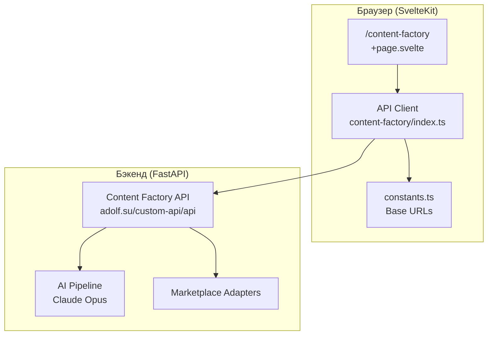
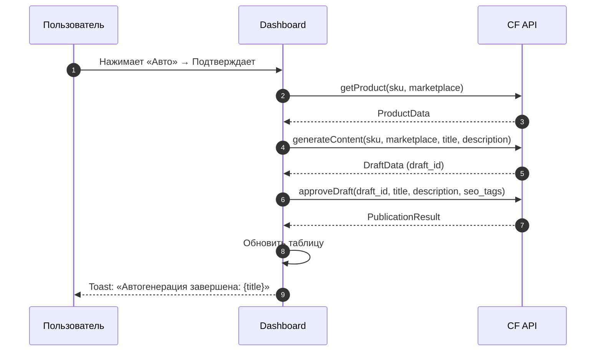

# ADOLF CONTENT FACTORY — Раздел 4: Интерфейс (Open WebUI)

**Проект:** Генерация SEO-контента для карточек товаров
**Модуль:** Content Factory
**Версия:** 1.1
**Дата:** Февраль 2026

---

## 4.1 Назначение

Content Factory реализован как **отдельная страница** (`/content-factory`) внутри Open WebUI. Интерфейс предоставляет визуальные инструменты для управления генерацией контента — таблицу с товарами, формы ввода, карточки товаров и результаты генерации.

> **Примечание:** В первой версии документации описывался chat-pipeline `@Adolf_Content` с Function Calling. Фактическая реализация использует standalone-страницу с прямыми вызовами REST API бэкенда, где AI-генерация выполняется на стороне сервера (Claude Opus).

### Компоненты интерфейса

| Компонент | Назначение |
|-----------|------------|
| Страница `/content-factory` | Основной интерфейс модуля |
| API-клиент (`content-factory/index.ts`) | TypeScript-обёртка над REST API |
| Панель настроек | Конфигурация порогов и токенов маркетплейсов |
| Кастомный диалог подтверждения | Модальное окно для критических действий |

---

## 4.2 Архитектура интерфейса



### Технологический стек UI

| Компонент | Технология |
|-----------|------------|
| Framework | SvelteKit (Svelte 4 + частично Svelte 5 runes) |
| UI-компоненты | shadcn-svelte |
| Стилизация | TailwindCSS |
| Иконки | Lucide (`@lucide/svelte`) |
| AI (бэкенд) | Claude Opus (Anthropic API, вызывается на сервере) |

---

## 4.3 Навигация и разделы

### 4.3.1 Структура навигации

Навигация расположена **под хедером по центру** (не в статус-баре). Активная вкладка выделена через `variant="default"`, неактивная — `variant="outline"`.

```
┌──────────────────────────────────────────────────────┐
│  [logo] Контент-Фабрика      0 сгенер. | 0 одобр. ⚙ │  ← Header
├──────────────────────────────────────────────────────┤
│           [ Информация ]  [ Ручная обработка ]        │  ← Nav (центр)
├──────────────────────────────────────────────────────┤
│                                                      │
│                  Контент раздела                      │
│                                                      │
└──────────────────────────────────────────────────────┘
```

### 4.3.2 Разделы

| Раздел | Ключ | Описание | Видимость |
|--------|------|----------|-----------|
| **Информация** | `dashboard` | Таблица товаров с кнопками действий | Навигация (по умолчанию) |
| **Ручная обработка** | `manual` | 3-шаговый флоу генерации | Навигация |
| Публикации | `publications` | История публикаций | Только из экрана результата |
| WB Диагностика | `wb-errors` | Ошибки модерации WB | Скрыт (в разработке) |
| Автопроцесс превью | `auto-process` | Превью автопроцесса | Скрыт (в разработке) |

---

## 4.4 Раздел «Информация» (Dashboard)

### 4.4.1 Описание

Основной рабочий экран. Отображает таблицу товаров, у которых оценка контента ниже установленного порога качества. Данные загружаются автоматически и обновляются каждые 60 секунд.

### 4.4.2 Источник данных

```
GET /api/auto-process/content/preview
→ Response: PreviewProduct[]
```

Товары фильтруются клиент-сайд по маркетплейсу и списку исключённых артикулов (`excludedSkus`).

### 4.4.3 Таблица

Фиксированная высота на 8 строк. Пустые строки заполняются прочерками.

| Колонка | Содержание |
|---------|------------|
| МП | Бейдж маркетплейса (WB/Ozon/YM) |
| СКУ | Артикул товара |
| Название | Название товара (обрезается) |
| **Генерация** | Кнопки «Авто» и «Ручная» |
| Статус | Статус товара |
| ✕ | Кнопка исключения из списка |

### 4.4.4 Кнопки в таблице

Каждая строка содержит интерактивные кнопки в колонке «Генерация»:

| Кнопка | Стиль | Действие |
|--------|-------|----------|
| **Авто** (+ иконка Sparkles) | `outline` (shadcn) | Полный автоцикл: загрузка → генерация → утверждение |
| **Ручная** (+ иконка Pencil) | `outline` (shadcn) | Переход в ручную обработку с предзаполненным SKU |
| **✕** (крестик) | ghost / destructive hover | Исключение из списка (только текущая сессия) |

Все три кнопки открывают **диалог подтверждения** перед выполнением.

### 4.4.5 Автогенерация (кнопка «Авто»)

Полностью автоматический цикл за один клик:



### 4.4.6 Ручная обработка (кнопка «Ручная»)

Предзаполняет SKU и маркетплейс, переключает на раздел «Ручная обработка» и автоматически загружает товар.

---

## 4.5 Раздел «Ручная обработка»

### 4.5.1 Трёхшаговый флоу

```
Шаг 1: Ввод          Шаг 2: Карточка товара      Шаг 3: Результат генерации
┌──────────────┐     ┌─────────────────────┐     ┌───────────────────────┐
│ SKU / URL    │ →   │ Фото + Название +   │ →   │ Новое название +      │
│ Маркетплейс  │     │ Описание + Оценка   │     │ Описание + SEO-теги   │
│ [Загрузить]  │     │ [Сгенерировать]     │     │ [Утвердить] [Заново]  │
└──────────────┘     └─────────────────────┘     └───────────────────────┘
```

### 4.5.2 Шаг 1 — Ввод

| Поле | Описание |
|------|----------|
| Маркетплейс | WB (активен), Ozon/YM показаны с оверлеем «В разработке» |
| Артикул (SKU) | Текстовый ввод + Enter |
| URL товара | Авто-определение маркетплейса и извлечение SKU из URL |

Поля SKU и URL — взаимоисключающие (заполнение одного очищает другое).

```
GET /api/content/product?sku={sku}&marketplace={mp}
GET /api/content/product?url={url}
→ Response: ProductData (фото, название, описание, валидация, анализ)
```

### 4.5.3 Шаг 2 — Карточка товара

**Левая панель:**
- Карусель фото (3:4, стрелки, миниатюры)
- Артикул, группа миниатюр (до 6, "+N" overflow)

**Правая панель:**
- Редактируемое название (input)
- Редактируемое описание (textarea)
- Блок валидации (зелёный / жёлтый с ошибками)
- Метрики анализа (3 прогресс-бара: Название, Описание, Ин.слова)
- Переключатель «Один товар / Вся склейка (N)» (если `group_count > 1`)

```
POST /api/content/generate
Body: { sku, marketplace, title, description, mode }
→ Response: DraftData (draft_id, title, description, seo_tags, validation, analysis)
```

### 4.5.4 Шаг 3 — Результат генерации

**Основной экран:**
- Фото-карусель (расширенная)
- Новое название (input с счётчиком `/60`)
- Новое описание (textarea с счётчиком символов)
- Метрики анализа (прогресс-бары)
- SEO-теги (Badge-пиллы)
- Поле для комментария + кнопка «Заново» (перегенерация)
- Кнопки: **Утвердить** (primary) и **Перегенерировать** (outline)

**Подэкраны (через `postGenScreen`):**

| Экран | Описание |
|-------|----------|
| `edit` | Редактирование полей: Название / Описание / SEO-теги |
| `visual` | ТЗ для дизайнера (4 секции: рекомендации, ракурсы, детали, стилизация) |
| `published` | Результат публикации (успех / ошибка) |

```
POST /api/content/regenerate
Body: { draft_id, manager_notes }

POST /api/content/drafts/{id}/approve
Body: { title, description, seo_tags }
→ Response: PublicationResult
```

---

## 4.6 Панель настроек

Открывается по иконке шестерёнки в хедере. Загружает данные с API при открытии.

### 4.6.1 Параметры

| Параметр | Описание |
|----------|----------|
| Порог качества | Слайдер 0–100 (amber-акцент). Товары с оценкой ниже порога попадают в таблицу |
| WB Token | Поле ввода пароля |
| Ozon | Карточка с оверлеем «В разработке» |
| Яндекс.Маркет | Карточка с оверлеем «В разработке» |

```
GET /api/settings → текущие настройки
PUT /api/settings → сохранение
```

---

## 4.7 Диалог подтверждения

Кастомный модальный диалог, заменяющий стандартный `confirm()` браузера. Реализован по паттерну `ConfirmDialog.svelte` проекта.

### 4.7.1 Визуальная структура

```
┌─────────────────────────────────────┐
│                                  ✕  │
│  Автогенерация для «Платье...»?     │
│  Действие нельзя будет отменить.    │
│                                     │
│          [ Да, поехали ] [ Отмена ] │
└─────────────────────────────────────┘
```

### 4.7.2 Техническая реализация

- **Расположение:** Вне основного контейнера страницы (отдельный top-level элемент)
- **Оверлей:** `fixed inset-0 z-[9999] bg-black/60` (тёмный фон без blur)
- **Карточка:** `bg-white/95 dark:bg-gray-950/95 backdrop-blur-sm` (frosted glass)
- **Закрытие:** Клик по оверлею, кнопка ✕, кнопка «Отмена»
- **Кнопки:** shadcn `<Button>` — «Да, поехали» (default) + «Отмена» (ghost)

### 4.7.3 Использование

Все критические действия в таблице dashboard проходят через диалог:

| Действие | Сообщение |
|----------|-----------|
| Авто | `Автогенерация для «{название}»` |
| Ручная | `Ручная обработка для «{название}»` |
| Исключить (✕) | `Исключить «{название}» из списка?` |

---

## 4.8 API-эндпоинты

### 4.8.1 Base URL

```typescript
// src/lib/constants.ts
export const CONTENT_FACTORY_API_BASE_URL = 'https://adolf.su/custom-api/api/content';
export const CONTENT_FACTORY_ROOT_URL = 'https://adolf.su/custom-api/api';
```

### 4.8.2 Используемые эндпоинты

| Метод | URL | Функция | Контекст |
|-------|-----|---------|----------|
| `GET` | `/content/product` | `getProduct` | Загрузка товара (шаг 1→2, авто) |
| `POST` | `/content/generate` | `generateContent` | Генерация (шаг 2→3, авто) |
| `POST` | `/content/regenerate` | `regenerateContent` | Перегенерация (шаг 3) |
| `POST` | `/content/drafts/{id}/approve` | `approveDraft` | Утверждение (шаг 3, авто) |
| `GET` | `/content/wb/errors` | `getWBErrors` | WB Диагностика |
| `GET` | `/settings` | `getSettings` | Панель настроек |
| `PUT` | `/settings` | `updateSettings` | Сохранение настроек |
| `GET` | `/auto-process/content/preview` | `getAutoProcessPreview` | Таблица dashboard |

### 4.8.3 Определённые, но не используемые в UI

| Метод | URL | Функция | Причина |
|-------|-----|---------|---------|
| `GET` | `/content/drafts` | `getDrafts` | Раздел черновиков не реализован |
| `GET` | `/content/drafts/{id}` | `getDraft` | Черновики загружаются inline |

---

## 4.9 Проверка доступа

Доступ к модулю контролируется через `roles.ts`:

```typescript
// src/lib/utils/roles.ts
MODULE_ACCESS = {
    content_factory: 'senior',  // Senior, Director, Admin
    // ...
}
```

| Роль | Доступ |
|------|--------|
| Staff | ❌ |
| Manager | ❌ |
| Senior | ✅ Все функции |
| Director | ✅ Все функции |
| Administrator | ✅ Все функции + настройки маркетплейсов |

---

## 4.10 Уведомления

Toast-уведомления через `svelte-sonner`:

| Событие | Тип | Текст |
|---------|-----|-------|
| Авто-генерация завершена | success | `Автогенерация завершена: {title}` |
| Ошибка API | error | `Ошибка: {message}` |
| Настройки сохранены | success | `Настройки сохранены` |

---

**Документ обновлён:** Февраль 2026
**Версия:** 1.1
**Статус:** Актуальный
