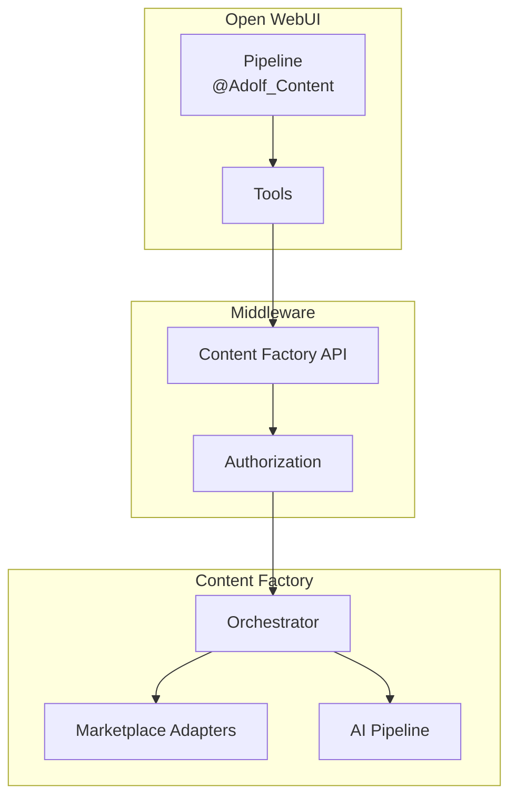
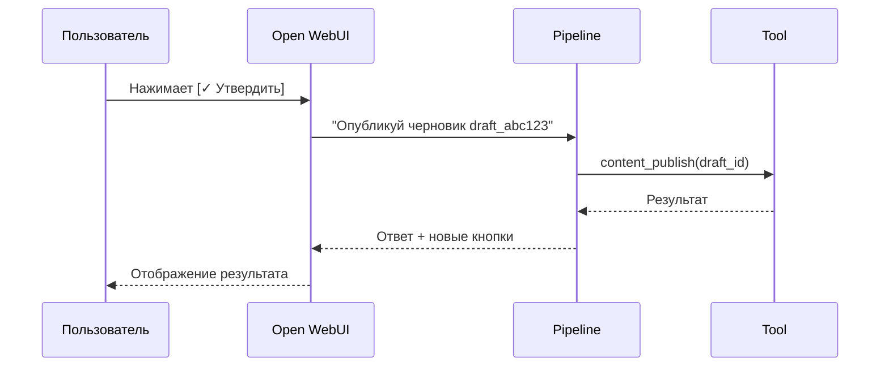

# ADOLF CONTENT FACTORY — Раздел 4: Open WebUI

**Проект:** Генерация SEO-контента для карточек товаров  
**Модуль:** Content Factory  
**Версия:** 1.0  
**Дата:** Январь 2026

---

## 4.1 Назначение

Раздел описывает интеграцию Content Factory с Open WebUI — Pipeline `@Adolf_Content` и набор Tools для работы с генерацией контента.

### Компоненты интеграции

| Компонент | Назначение |
|-----------|------------|
| Pipeline `@Adolf_Content` | Агент для генерации контента |
| Tools | Функции для Function Calling |
| Valves | Конфигурационные параметры |
| Interactive Buttons | Кнопки быстрых действий в UI |

---

## 4.2 Архитектура интеграции



---

## 4.3 Pipeline: @Adolf_Content

### 4.3.1 Конфигурация Pipeline

```python
# pipelines/adolf_content.py
"""
title: Adolf Content Factory
author: Adolf Team
version: 1.0.0
description: Генерация SEO-контента для карточек товаров
"""

from typing import List, Optional
from pydantic import BaseModel, Field


class Pipeline:
    """Pipeline для генерации контента карточек товаров."""
    
    class Valves(BaseModel):
        """Настройки Pipeline."""
        MIDDLEWARE_URL: str = Field(
            default="http://middleware:8000",
            description="URL Middleware API"
        )
        MIDDLEWARE_API_KEY: str = Field(
            default="",
            description="API ключ Middleware"
        )
        DEFAULT_MARKETPLACE: str = Field(
            default="wb",
            description="Маркетплейс по умолчанию (wb, ozon, ym)"
        )
        ENABLE_VISUAL_PROMPTING: bool = Field(
            default=True,
            description="Включить генерацию ТЗ для дизайнера"
        )
    
    def __init__(self):
        self.name = "Adolf Content Factory"
        self.valves = self.Valves()
        self.tools = ContentTools()
    
    async def on_startup(self):
        """Инициализация при запуске."""
        print(f"[{self.name}] Pipeline started")
    
    async def on_shutdown(self):
        """Очистка при остановке."""
        print(f"[{self.name}] Pipeline stopped")
    
    def pipe(
        self,
        user_message: str,
        model_id: str,
        messages: List[dict],
        body: dict
    ) -> str:
        """Основной метод обработки сообщений."""
        
        # Pipeline использует Tools через Function Calling
        # Логика обработки делегируется LLM
        return None  # LLM сам выберет нужный Tool
```

### 4.3.2 System Prompt Pipeline

```python
CONTENT_PIPELINE_SYSTEM_PROMPT = """
Ты — ассистент для создания SEO-контента карточек товаров на маркетплейсах.

ТВОИ ВОЗМОЖНОСТИ:
1. Генерация контента (название, описание, характеристики, SEO-теги)
2. Создание ТЗ для дизайнера (Visual Prompting)
3. Просмотр и редактирование черновиков
4. Публикация контента на маркетплейсы

ДОСТУПНЫЕ МАРКЕТПЛЕЙСЫ:
- Wildberries (wb)
- Ozon (ozon)
- Яндекс.Маркет (ym)

ПРАВИЛА РАБОТЫ:
1. Всегда уточняй артикул товара и маркетплейс
2. Показывай сгенерированный контент для проверки
3. Публикуй только после подтверждения пользователя
4. При ошибках предлагай решение

ФОРМАТ АРТИКУЛА:
- Wildberries: nmID или артикул продавца
- Ozon: offer_id (артикул продавца)
- Яндекс.Маркет: offerId

Пользователь имеет роль: {role}
Доступ ко всем брендам: Да
"""
```

---

## 4.4 Tools

### 4.4.1 Структура файлов

```
/app/backend/tools/
├── __init__.py
├── content_generate.py      # Генерация контента
├── content_draft.py         # Работа с черновиками
├── content_publish.py       # Публикация
├── content_visual.py        # Visual Prompting
└── content_settings.py      # Настройки (только Admin)
```

### 4.4.2 Tool: Генерация контента

```python
# tools/content_generate.py
"""
title: Content Generate
author: Adolf Team
version: 1.0.0
"""

from typing import Callable, Any, Optional, List
from pydantic import BaseModel, Field
import requests


class Valves(BaseModel):
    MIDDLEWARE_URL: str = Field(
        default="http://middleware:8000",
        description="URL Middleware API"
    )
    MIDDLEWARE_API_KEY: str = Field(
        default="",
        description="API ключ"
    )


class Tools:
    """Инструменты для генерации контента."""
    
    def __init__(self):
        self.valves = Valves()
    
    def content_generate(
        self,
        sku: str,
        marketplace: str = "wb",
        key_features: Optional[str] = None,
        target_audience: Optional[str] = None,
        unique_selling_points: Optional[str] = None,
        __user__: dict = {},
        __event_emitter__: Callable[[dict], Any] = None
    ) -> str:
        """
        Генерация SEO-контента для карточки товара.
        
        Args:
            sku: Артикул товара
            marketplace: Маркетплейс (wb, ozon, ym)
            key_features: Ключевые особенности товара (через запятую)
            target_audience: Целевая аудитория
            unique_selling_points: Уникальные преимущества (через запятую)
        
        Returns:
            Сгенерированный контент для проверки
        """
        
        # Проверка доступа
        user_role = __user__.get("role", "")
        if user_role not in ["senior", "director", "admin"]:
            return "❌ Доступ запрещён. Content Factory доступен только для Senior, Director и Administrator."
        
        if __event_emitter__:
            __event_emitter__({
                "type": "status",
                "data": {"description": "Генерация контента...", "done": False}
            })
        
        try:
            # Подготовка данных
            manual_input = {}
            if key_features:
                manual_input["key_features"] = [f.strip() for f in key_features.split(",")]
            if target_audience:
                manual_input["target_audience"] = target_audience
            if unique_selling_points:
                manual_input["unique_selling_points"] = [u.strip() for u in unique_selling_points.split(",")]
            
            # Вызов API
            response = requests.post(
                f"{self.valves.MIDDLEWARE_URL}/api/v1/content/generate",
                json={
                    "sku": sku,
                    "marketplace": marketplace,
                    "manual_input": manual_input if manual_input else None,
                    "include_visual_prompting": False
                },
                headers={
                    "Authorization": f"Bearer {self.valves.MIDDLEWARE_API_KEY}",
                    "X-User-ID": str(__user__.get("id", ""))
                },
                timeout=60
            )
            
            if response.status_code != 200:
                return f"❌ Ошибка API: {response.status_code} - {response.text}"
            
            data = response.json()
            
            if __event_emitter__:
                __event_emitter__({
                    "type": "status",
                    "data": {"description": "Контент сгенерирован", "done": True}
                })
            
            # Форматирование результата
            draft_id = data.get("draft_id", "")
            output = self._format_generation_result(data, sku, marketplace)
            
            # Отправка интерактивных кнопок
            if __event_emitter__:
                __event_emitter__({
                    "type": "actions",
                    "data": {
                        "buttons": [
                            {"label": "✓ Утвердить", "value": f"Опубликуй черновик {draft_id}"},
                            {"label": "✏️ Исправить", "value": f"Хочу исправить черновик {draft_id}"},
                            {"label": "📸 ТЗ дизайнеру", "value": f"Создай ТЗ для дизайнера для {sku}"},
                            {"label": "🔄 Заново", "value": f"Сгенерируй контент заново для {sku} на {marketplace}"}
                        ]
                    }
                })
            
            return output
            
        except requests.Timeout:
            return "❌ Превышено время ожидания. Попробуйте позже."
        except Exception as e:
            return f"❌ Ошибка: {str(e)}"
    
    def _format_generation_result(self, data: dict, sku: str, marketplace: str) -> str:
        """Форматирование результата генерации."""
        
        content = data.get("content", {})
        validation = data.get("validation", {})
        draft_id = data.get("draft_id", "")
        
        mp_names = {"wb": "Wildberries", "ozon": "Ozon", "ym": "Яндекс.Маркет"}
        mp_name = mp_names.get(marketplace, marketplace)
        
        output = f"## 📝 Сгенерированный контент\n\n"
        output += f"**Артикул:** {sku}\n"
        output += f"**Маркетплейс:** {mp_name}\n"
        output += f"**ID черновика:** `{draft_id}`\n\n"
        
        output += "---\n\n"
        
        # Title
        output += f"### Название\n"
        output += f"```\n{content.get('title', 'Не сгенерировано')}\n```\n"
        output += f"*Длина: {len(content.get('title', ''))} символов*\n\n"
        
        # Description
        output += f"### Описание\n"
        output += f"{content.get('description', 'Не сгенерировано')}\n\n"
        output += f"*Длина: {len(content.get('description', ''))} символов*\n\n"
        
        # SEO Tags
        tags = content.get("seo_tags", [])
        if tags:
            output += f"### SEO-теги\n"
            output += f"`{', '.join(tags[:10])}`\n"
            if len(tags) > 10:
                output += f"*...и ещё {len(tags) - 10} тегов*\n"
            output += "\n"
        
        # Validation
        issues = validation.get("issues", [])
        if issues:
            output += "### ⚠️ Предупреждения валидации\n"
            for issue in issues:
                severity_icon = "❌" if issue["severity"] == "error" else "⚠️"
                output += f"- {severity_icon} **{issue['field']}**: {issue['message']}\n"
            output += "\n"
        else:
            output += "### ✅ Валидация пройдена\n\n"
        
        output += "---\n\n"
        output += "*Используйте кнопки ниже для быстрых действий*"
        
        return output
```

### 4.4.3 Tool: Работа с черновиками

```python
# tools/content_draft.py
"""
title: Content Draft
author: Adolf Team
version: 1.0.0
"""

from typing import Callable, Any, Optional
from pydantic import BaseModel, Field
import requests


class Valves(BaseModel):
    MIDDLEWARE_URL: str = Field(default="http://middleware:8000")
    MIDDLEWARE_API_KEY: str = Field(default="")


class Tools:
    """Инструменты для работы с черновиками."""
    
    def __init__(self):
        self.valves = Valves()
    
    def content_draft_get(
        self,
        draft_id: str,
        __user__: dict = {},
        __event_emitter__: Callable[[dict], Any] = None
    ) -> str:
        """
        Получение черновика по ID.
        
        Args:
            draft_id: Идентификатор черновика
        """
        
        if __user__.get("role", "") not in ["senior", "director", "admin"]:
            return "❌ Доступ запрещён."
        
        try:
            response = requests.get(
                f"{self.valves.MIDDLEWARE_URL}/api/v1/content/drafts/{draft_id}",
                headers={
                    "Authorization": f"Bearer {self.valves.MIDDLEWARE_API_KEY}",
                    "X-User-ID": str(__user__.get("id", ""))
                }
            )
            
            if response.status_code == 404:
                return f"❌ Черновик `{draft_id}` не найден."
            
            if response.status_code != 200:
                return f"❌ Ошибка: {response.text}"
            
            data = response.json()
            return self._format_draft(data)
            
        except Exception as e:
            return f"❌ Ошибка: {str(e)}"
    
    def content_draft_list(
        self,
        marketplace: Optional[str] = None,
        status: Optional[str] = "pending",
        __user__: dict = {},
        __event_emitter__: Callable[[dict], Any] = None
    ) -> str:
        """
        Список черновиков.
        
        Args:
            marketplace: Фильтр по маркетплейсу (wb, ozon, ym)
            status: Статус черновика (pending, approved, published)
        """
        
        if __user__.get("role", "") not in ["senior", "director", "admin"]:
            return "❌ Доступ запрещён."
        
        try:
            params = {}
            if marketplace:
                params["marketplace"] = marketplace
            if status:
                params["status"] = status
            
            response = requests.get(
                f"{self.valves.MIDDLEWARE_URL}/api/v1/content/drafts",
                params=params,
                headers={
                    "Authorization": f"Bearer {self.valves.MIDDLEWARE_API_KEY}",
                    "X-User-ID": str(__user__.get("id", ""))
                }
            )
            
            if response.status_code != 200:
                return f"❌ Ошибка: {response.text}"
            
            drafts = response.json()
            
            if not drafts:
                return "📭 Нет черновиков с указанными фильтрами."
            
            return self._format_draft_list(drafts)
            
        except Exception as e:
            return f"❌ Ошибка: {str(e)}"
    
    def content_draft_edit(
        self,
        draft_id: str,
        title: Optional[str] = None,
        description: Optional[str] = None,
        __user__: dict = {},
        __event_emitter__: Callable[[dict], Any] = None
    ) -> str:
        """
        Редактирование черновика.
        
        Args:
            draft_id: Идентификатор черновика
            title: Новое название (опционально)
            description: Новое описание (опционально)
        """
        
        if __user__.get("role", "") not in ["senior", "director", "admin"]:
            return "❌ Доступ запрещён."
        
        if not title and not description:
            return "❌ Укажите хотя бы одно поле для редактирования (title или description)."
        
        try:
            payload = {}
            if title:
                payload["title"] = title
            if description:
                payload["description"] = description
            
            response = requests.patch(
                f"{self.valves.MIDDLEWARE_URL}/api/v1/content/drafts/{draft_id}",
                json=payload,
                headers={
                    "Authorization": f"Bearer {self.valves.MIDDLEWARE_API_KEY}",
                    "X-User-ID": str(__user__.get("id", ""))
                }
            )
            
            if response.status_code == 404:
                return f"❌ Черновик `{draft_id}` не найден."
            
            if response.status_code != 200:
                return f"❌ Ошибка: {response.text}"
            
            data = response.json()
            
            output = f"✅ Черновик `{draft_id}` обновлён.\n\n"
            if title:
                output += f"**Новое название:**\n```\n{title}\n```\n*Длина: {len(title)} символов*\n\n"
            if description:
                output += f"**Новое описание обновлено** (длина: {len(description)} символов)\n\n"
            
            # Отправка кнопок
            if __event_emitter__:
                __event_emitter__({
                    "type": "actions",
                    "data": {
                        "buttons": [
                            {"label": "✓ Утвердить", "value": f"Опубликуй черновик {draft_id}"},
                            {"label": "✏️ Ещё правки", "value": f"Хочу исправить черновик {draft_id}"},
                            {"label": "👁️ Предпросм.", "value": f"Покажи черновик {draft_id}"}
                        ]
                    }
                })
            
            return output
            
        except Exception as e:
            return f"❌ Ошибка: {str(e)}"
    
    def _format_draft(self, data: dict) -> str:
        """Форматирование черновика."""
        
        output = f"## 📄 Черновик `{data['id']}`\n\n"
        output += f"**Артикул:** {data['sku']}\n"
        output += f"**Маркетплейс:** {data['marketplace']}\n"
        output += f"**Статус:** {data['status']}\n"
        output += f"**Создан:** {data['created_at']}\n\n"
        
        output += "---\n\n"
        
        content = data.get("content", {})
        output += f"### Название\n```\n{content.get('title', '')}\n```\n\n"
        output += f"### Описание\n{content.get('description', '')}\n\n"
        
        return output
    
    def _format_draft_list(self, drafts: list) -> str:
        """Форматирование списка черновиков."""
        
        output = f"## 📋 Черновики ({len(drafts)})\n\n"
        output += "| ID | Артикул | Маркетплейс | Статус | Создан |\n"
        output += "|-----|---------|-------------|--------|--------|\n"
        
        for draft in drafts[:20]:  # Максимум 20
            output += f"| `{draft['id'][:8]}...` | {draft['sku']} | {draft['marketplace']} | {draft['status']} | {draft['created_at'][:10]} |\n"
        
        if len(drafts) > 20:
            output += f"\n*...и ещё {len(drafts) - 20} черновиков*\n"
        
        output += "\n**Для просмотра:** `Покажи черновик <ID>`"
        
        return output
```

### 4.4.4 Tool: Публикация контента

```python
# tools/content_publish.py
"""
title: Content Publish
author: Adolf Team
version: 1.0.0
"""

from typing import Callable, Any
from pydantic import BaseModel, Field
import requests


class Valves(BaseModel):
    MIDDLEWARE_URL: str = Field(default="http://middleware:8000")
    MIDDLEWARE_API_KEY: str = Field(default="")


class Tools:
    """Инструменты для публикации контента."""
    
    def __init__(self):
        self.valves = Valves()
    
    def content_publish(
        self,
        draft_id: str,
        __user__: dict = {},
        __event_emitter__: Callable[[dict], Any] = None
    ) -> str:
        """
        Публикация черновика на маркетплейс.
        
        Args:
            draft_id: Идентификатор черновика для публикации
        """
        
        if __user__.get("role", "") not in ["senior", "director", "admin"]:
            return "❌ Доступ запрещён."
        
        if __event_emitter__:
            __event_emitter__({
                "type": "status",
                "data": {"description": "Публикация на маркетплейс...", "done": False}
            })
        
        try:
            response = requests.post(
                f"{self.valves.MIDDLEWARE_URL}/api/v1/content/publish",
                json={"draft_id": draft_id},
                headers={
                    "Authorization": f"Bearer {self.valves.MIDDLEWARE_API_KEY}",
                    "X-User-ID": str(__user__.get("id", ""))
                },
                timeout=30
            )
            
            if response.status_code == 404:
                return f"❌ Черновик `{draft_id}` не найден."
            
            if response.status_code != 200:
                data = response.json()
                error_msg = data.get("error", response.text)
                return f"❌ Ошибка публикации: {error_msg}"
            
            data = response.json()
            
            if __event_emitter__:
                __event_emitter__({
                    "type": "status",
                    "data": {"description": "Опубликовано", "done": True}
                })
            
            output = self._format_publish_result(data, draft_id)
            
            # Отправка кнопок после успешной публикации
            if data.get("success", False) and __event_emitter__:
                marketplace = data.get("marketplace", "wb")
                nm_id = data.get("nm_id", "")
                mp_urls = {
                    "wb": f"https://www.wildberries.ru/catalog/{nm_id}/detail.aspx",
                    "ozon": f"https://www.ozon.ru/product/{nm_id}",
                    "ym": f"https://market.yandex.ru/product/{nm_id}"
                }
                __event_emitter__({
                    "type": "actions",
                    "data": {
                        "buttons": [
                            {"label": "📋 Ещё товар", "value": "Сгенерируй контент для следующего товара"},
                            {"label": "📊 Статистика", "value": "Покажи статистику генераций"},
                            {"label": "🔗 Открыть МП", "value": mp_urls.get(marketplace, "#")}
                        ]
                    }
                })
            
            return output
            
        except requests.Timeout:
            return "⏳ Публикация запущена в фоновом режиме. Проверьте статус позже."
        except Exception as e:
            return f"❌ Ошибка: {str(e)}"
    
    def content_publish_status(
        self,
        publication_id: str,
        __user__: dict = {},
        __event_emitter__: Callable[[dict], Any] = None
    ) -> str:
        """
        Проверка статуса публикации.
        
        Args:
            publication_id: Идентификатор публикации
        """
        
        if __user__.get("role", "") not in ["senior", "director", "admin"]:
            return "❌ Доступ запрещён."
        
        try:
            response = requests.get(
                f"{self.valves.MIDDLEWARE_URL}/api/v1/content/publications/{publication_id}",
                headers={
                    "Authorization": f"Bearer {self.valves.MIDDLEWARE_API_KEY}",
                    "X-User-ID": str(__user__.get("id", ""))
                }
            )
            
            if response.status_code == 404:
                return f"❌ Публикация `{publication_id}` не найдена."
            
            if response.status_code != 200:
                return f"❌ Ошибка: {response.text}"
            
            data = response.json()
            
            status_icons = {
                "pending": "⏳",
                "processing": "🔄",
                "published": "✅",
                "failed": "❌"
            }
            
            status = data.get("status", "unknown")
            icon = status_icons.get(status, "❓")
            
            output = f"## {icon} Статус публикации\n\n"
            output += f"**ID:** `{publication_id}`\n"
            output += f"**Артикул:** {data['sku']}\n"
            output += f"**Маркетплейс:** {data['marketplace']}\n"
            output += f"**Статус:** {status}\n"
            
            if status == "failed":
                output += f"\n**Ошибка:** {data.get('error_message', 'Неизвестная ошибка')}\n"
                output += "\n*Попробуйте опубликовать повторно или обратитесь к администратору.*"
            
            return output
            
        except Exception as e:
            return f"❌ Ошибка: {str(e)}"
    
    def _format_publish_result(self, data: dict, draft_id: str) -> str:
        """Форматирование результата публикации."""
        
        success = data.get("success", False)
        
        if success:
            output = f"## ✅ Контент опубликован!\n\n"
            output += f"**Черновик:** `{draft_id}`\n"
            output += f"**Артикул:** {data.get('sku', 'N/A')}\n"
            output += f"**Маркетплейс:** {data.get('marketplace', 'N/A')}\n"
            output += f"**ID на маркетплейсе:** `{data.get('nm_id', 'N/A')}`\n\n"
            output += "Карточка товара обновлена. Изменения могут отобразиться с задержкой до 15 минут."
        else:
            output = f"## ❌ Ошибка публикации\n\n"
            output += f"**Черновик:** `{draft_id}`\n"
            output += f"**Код ошибки:** {data.get('error_code', 'UNKNOWN')}\n"
            output += f"**Сообщение:** {data.get('error_message', 'Неизвестная ошибка')}\n\n"
            output += "Попробуйте исправить ошибку и опубликовать повторно."
        
        return output
```

### 4.4.5 Tool: Visual Prompting

```python
# tools/content_visual.py
"""
title: Content Visual Prompting
author: Adolf Team
version: 1.0.0
"""

from typing import Callable, Any, Optional
from pydantic import BaseModel, Field
import requests


class Valves(BaseModel):
    MIDDLEWARE_URL: str = Field(default="http://middleware:8000")
    MIDDLEWARE_API_KEY: str = Field(default="")


class Tools:
    """Инструменты для Visual Prompting."""
    
    def __init__(self):
        self.valves = Valves()
    
    def content_visual_prompting(
        self,
        sku: str,
        marketplace: str = "wb",
        known_issues: Optional[str] = None,
        photo_requirements: Optional[str] = None,
        __user__: dict = {},
        __event_emitter__: Callable[[dict], Any] = None
    ) -> str:
        """
        Генерация ТЗ для дизайнера/фотографа.
        
        Args:
            sku: Артикул товара
            marketplace: Маркетплейс (wb, ozon, ym)
            known_issues: Известные проблемы товара (через запятую)
            photo_requirements: Требования к фото (через запятую)
        """
        
        if __user__.get("role", "") not in ["senior", "director", "admin"]:
            return "❌ Доступ запрещён."
        
        if not known_issues and not photo_requirements:
            return ("❌ Для генерации ТЗ укажите хотя бы один параметр:\n"
                    "- `known_issues` — известные проблемы товара\n"
                    "- `photo_requirements` — требования к фото")
        
        if __event_emitter__:
            __event_emitter__({
                "type": "status",
                "data": {"description": "Генерация ТЗ для дизайнера...", "done": False}
            })
        
        try:
            manual_input = {}
            if known_issues:
                manual_input["known_issues"] = [i.strip() for i in known_issues.split(",")]
            if photo_requirements:
                manual_input["photo_requirements"] = [r.strip() for r in photo_requirements.split(",")]
            
            response = requests.post(
                f"{self.valves.MIDDLEWARE_URL}/api/v1/content/visual-prompting",
                json={
                    "sku": sku,
                    "marketplace": marketplace,
                    "manual_input": manual_input
                },
                headers={
                    "Authorization": f"Bearer {self.valves.MIDDLEWARE_API_KEY}",
                    "X-User-ID": str(__user__.get("id", ""))
                },
                timeout=30
            )
            
            if response.status_code != 200:
                return f"❌ Ошибка: {response.text}"
            
            data = response.json()
            
            if __event_emitter__:
                __event_emitter__({
                    "type": "status",
                    "data": {"description": "ТЗ сгенерировано", "done": True}
                })
            
            return self._format_visual_prompting(data, sku)
            
        except Exception as e:
            return f"❌ Ошибка: {str(e)}"
    
    def _format_visual_prompting(self, data: dict, sku: str) -> str:
        """Форматирование ТЗ для дизайнера."""
        
        output = f"## 📸 ТЗ для дизайнера/фотографа\n\n"
        output += f"**Артикул:** {sku}\n\n"
        output += "---\n\n"
        
        vp = data.get("visual_prompting", {})
        
        # Рекомендации
        recommendations = vp.get("recommendations", [])
        if recommendations:
            output += "### 📋 Рекомендации\n\n"
            for i, rec in enumerate(recommendations, 1):
                output += f"{i}. {rec}\n"
            output += "\n"
        
        # Ракурсы
        angles = vp.get("photo_angles", [])
        if angles:
            output += "### 📐 Рекомендуемые ракурсы\n\n"
            for angle in angles:
                output += f"- {angle}\n"
            output += "\n"
        
        # Детальные фото
        details = vp.get("detail_shots", [])
        if details:
            output += "### 🔍 Детальные снимки\n\n"
            for detail in details:
                output += f"- {detail}\n"
            output += "\n"
        
        # Стилизация
        styling = vp.get("styling_tips", [])
        if styling:
            output += "### 🎨 Стилизация\n\n"
            for tip in styling:
                output += f"- {tip}\n"
            output += "\n"
        
        # Полный текст (если парсинг не удался)
        if not recommendations and not angles and not details:
            raw_text = vp.get("raw_text", "ТЗ не сгенерировано")
            output += f"### Полный текст ТЗ\n\n{raw_text}\n"
        
        output += "---\n\n"
        output += "*Скопируйте это ТЗ и передайте дизайнеру/фотографу.*"
        
        return output
```

---

## 4.5 Регистрация Tools в Pipeline

```python
# pipelines/adolf_content.py (продолжение)

from tools.content_generate import Tools as GenerateTools
from tools.content_draft import Tools as DraftTools
from tools.content_publish import Tools as PublishTools
from tools.content_visual import Tools as VisualTools


class Pipeline:
    # ... (предыдущий код)
    
    def get_tools(self) -> list:
        """Возвращает список доступных инструментов."""
        
        tools = []
        
        # Генерация
        gen_tools = GenerateTools()
        gen_tools.valves = self.valves
        tools.append({
            "name": "content_generate",
            "description": "Генерация SEO-контента для карточки товара. "
                          "Укажите артикул (sku) и маркетплейс (wb/ozon/ym). "
                          "Опционально: ключевые особенности, целевую аудиторию, УТП.",
            "function": gen_tools.content_generate
        })
        
        # Черновики
        draft_tools = DraftTools()
        draft_tools.valves = self.valves
        tools.extend([
            {
                "name": "content_draft_get",
                "description": "Получение черновика по ID.",
                "function": draft_tools.content_draft_get
            },
            {
                "name": "content_draft_list",
                "description": "Список черновиков. Фильтры: marketplace, status.",
                "function": draft_tools.content_draft_list
            },
            {
                "name": "content_draft_edit",
                "description": "Редактирование черновика. Укажите draft_id и новые title/description.",
                "function": draft_tools.content_draft_edit
            }
        ])
        
        # Публикация
        pub_tools = PublishTools()
        pub_tools.valves = self.valves
        tools.extend([
            {
                "name": "content_publish",
                "description": "Публикация черновика на маркетплейс. Укажите draft_id.",
                "function": pub_tools.content_publish
            },
            {
                "name": "content_publish_status",
                "description": "Проверка статуса публикации.",
                "function": pub_tools.content_publish_status
            }
        ])
        
        # Visual Prompting
        visual_tools = VisualTools()
        visual_tools.valves = self.valves
        tools.append({
            "name": "content_visual_prompting",
            "description": "Генерация ТЗ для дизайнера. Укажите артикул и известные проблемы товара.",
            "function": visual_tools.content_visual_prompting
        })
        
        return tools
```

---

## 4.6 Интерактивные кнопки

### 4.6.1 Назначение

Интерактивные кнопки упрощают workflow пользователя, предлагая быстрые действия после ключевых операций.

### 4.6.2 Типы кнопок

| Контекст | Кнопки |
|----------|--------|
| После генерации | ✓ Утвердить, ✏️ Исправить, 📸 ТЗ дизайнеру, 🔄 Заново |
| После редактирования | ✓ Утвердить, ✏️ Ещё правки, 👁️ Предпросмотр |
| После публикации | 📋 Ещё товар, 📊 Статистика, 🔗 Открыть МП |
| Выбор поля для правки | 📝 Название, 📄 Описание, 🏷️ SEO-теги |

### 4.6.3 Реализация через Event Emitter

```python
def _emit_action_buttons(
    self,
    __event_emitter__: Callable,
    buttons: List[dict]
):
    """Отправка интерактивных кнопок в UI."""
    
    if __event_emitter__:
        __event_emitter__({
            "type": "actions",
            "data": {
                "buttons": buttons
            }
        })


# Пример использования после генерации
def _emit_generation_buttons(
    self,
    __event_emitter__: Callable,
    draft_id: str,
    sku: str,
    marketplace: str
):
    """Кнопки после генерации контента."""
    
    buttons = [
        {"label": "✓ Утвердить", "value": f"Опубликуй черновик {draft_id}"},
        {"label": "✏️ Исправить", "value": f"Хочу исправить черновик {draft_id}"},
        {"label": "📸 ТЗ дизайнеру", "value": f"Создай ТЗ для дизайнера для {sku}"},
        {"label": "🔄 Заново", "value": f"Сгенерируй контент заново для {sku} на {marketplace}"}
    ]
    
    self._emit_action_buttons(__event_emitter__, buttons)


# Пример использования после публикации
def _emit_publish_buttons(
    self,
    __event_emitter__: Callable,
    marketplace: str,
    nm_id: str
):
    """Кнопки после публикации."""
    
    mp_urls = {
        "wb": f"https://www.wildberries.ru/catalog/{nm_id}/detail.aspx",
        "ozon": f"https://www.ozon.ru/product/{nm_id}",
        "ym": f"https://market.yandex.ru/product/{nm_id}"
    }
    
    buttons = [
        {"label": "📋 Ещё товар", "value": "Сгенерируй контент для следующего товара"},
        {"label": "📊 Статистика", "value": "Покажи статистику генераций"},
        {"label": "🔗 Открыть МП", "value": mp_urls.get(marketplace, "#")}
    ]
    
    self._emit_action_buttons(__event_emitter__, buttons)
```

### 4.6.4 Обработка нажатия кнопки

При нажатии кнопки её `value` отправляется как сообщение пользователя. Pipeline обрабатывает его как обычный запрос.



---

## 4.7 Примеры диалогов

### 4.7.1 Генерация контента

```
Пользователь: Сгенерируй контент для артикула OM-12345 на Wildberries

Ассистент: [вызывает content_generate(sku="OM-12345", marketplace="wb")]

## 📝 Сгенерированный контент

**Артикул:** OM-12345
**Маркетплейс:** Wildberries
**ID черновика:** `draft_abc123`

---

### Название
```
Охана Маркет Платье женское летнее миди с цветочным принтом
```
*Длина: 62 символов*

### Описание
Элегантное летнее платье из натуральной ткани, которое станет 
незаменимым элементом вашего гардероба...

*Длина: 1250 символов*

### SEO-теги
`платье женское, летнее платье, платье миди, цветочный принт...`

### ✅ Валидация пройдена

---

*Используйте кнопки ниже для быстрых действий*

┌──────────────┐  ┌──────────────┐  ┌───────────────┐  ┌──────────────┐
│ ✓ Утвердить  │  │ ✏️ Исправить │  │ 📸 ТЗ дизайн. │  │ 🔄 Заново    │
└──────────────┘  └──────────────┘  └───────────────┘  └──────────────┘
```

### 4.7.2 Редактирование и публикация

```
Пользователь: [нажимает кнопку ✏️ Исправить]
→ Хочу исправить черновик draft_abc123

Ассистент: Что вы хотите изменить?

┌──────────────┐  ┌──────────────┐  ┌───────────────┐
│ 📝 Название  │  │ 📄 Описание  │  │ 🏷️ SEO-теги   │
└──────────────┘  └──────────────┘  └───────────────┘
```

```
Пользователь: [нажимает 📝 Название]
→ Измени название

Ассистент: Введите новое название для товара OM-12345:

Пользователь: Платье Охана летнее женское миди хлопок

Ассистент: [вызывает content_draft_edit(draft_id="draft_abc123", 
           title="Платье Охана летнее женское миди хлопок")]

✅ Черновик `draft_abc123` обновлён.

**Новое название:**
```
Платье Охана летнее женское миди хлопок
```
*Длина: 43 символов* ✓

┌──────────────┐  ┌──────────────┐  ┌───────────────┐
│ ✓ Утвердить  │  │ ✏️ Ещё правки │  │ 👁️ Предпросм. │
└──────────────┘  └──────────────┘  └───────────────┘
```

```
Пользователь: [нажимает кнопку ✓ Утвердить]
→ Опубликуй черновик draft_abc123

Ассистент: [вызывает content_publish(draft_id="draft_abc123")]

## ✅ Контент опубликован!

**Черновик:** `draft_abc123`
**Артикул:** OM-12345
**Маркетплейс:** Wildberries
**ID на маркетплейсе:** `123456789`

Карточка товара обновлена. Изменения могут отобразиться с задержкой до 15 минут.

┌────────────────┐  ┌──────────────┐  ┌───────────────┐
│ 📋 Ещё товар   │  │ 📊 Статистика │  │ 🔗 Открыть WB │
└────────────────┘  └──────────────┘  └───────────────┘
```

### 4.7.3 Visual Prompting

```
Пользователь: Создай ТЗ для дизайнера для артикула OK-555. 
Проблемы: покупатели жалуются на непонятный размер и цвет отличается от фото

Ассистент: [вызывает content_visual_prompting(
           sku="OK-555", 
           known_issues="непонятный размер, цвет отличается от фото")]

## 📸 ТЗ для дизайнера/фотографа

**Артикул:** OK-555

---

### 📋 Рекомендации

1. Добавить фото с сантиметровой лентой для демонстрации реальных размеров
2. Сделать фото при естественном дневном освещении для точной цветопередачи
3. Включить фото на модели разных размеров (S, M, L)
4. Добавить сравнительное фото с эталонным цветом

### 📐 Рекомендуемые ракурсы

- Общий план спереди и сзади
- Боковой ракурс для понимания силуэта
- Крупный план ткани для передачи текстуры и цвета

### 🔍 Детальные снимки

- Размерная этикетка крупным планом
- Замеры изделия линейкой (длина, ширина)
- Сравнение цвета при разном освещении

---

*Скопируйте это ТЗ и передайте дизайнеру/фотографу.*

┌──────────────┐  ┌────────────────┐  ┌───────────────┐
│ 📋 Копировать │  │ 📝 Доп. правки │  │ ✓ К генерации │
└──────────────┘  └────────────────┘  └───────────────┘
```

---

## 4.8 Уведомления

### 4.8.1 Типы уведомлений

| Событие | Тип | Текст |
|---------|-----|-------|
| Контент сгенерирован | info | "Контент для {sku} сгенерирован. Проверьте черновик." |
| Контент опубликован | success | "Контент для {sku} успешно опубликован на {marketplace}." |
| Ошибка публикации | error | "Ошибка публикации {sku}: {error_message}" |

### 4.8.2 Интеграция с Core Notifications

```python
async def send_notification(
    user_id: str,
    event_type: str,
    data: dict
):
    """Отправка уведомления через Core Notifications."""
    
    templates = {
        "content.generated": {
            "type": "info",
            "title": "Контент сгенерирован",
            "message": "Контент для {sku} сгенерирован. Проверьте черновик."
        },
        "content.published": {
            "type": "success",
            "title": "Контент опубликован",
            "message": "Контент для {sku} успешно опубликован на {marketplace}."
        },
        "content.publish_error": {
            "type": "error",
            "title": "Ошибка публикации",
            "message": "Ошибка публикации {sku}: {error_message}"
        }
    }
    
    template = templates.get(event_type)
    if not template:
        return
    
    await notifications_api.send(
        user_id=user_id,
        notification_type=template["type"],
        title=template["title"],
        message=template["message"].format(**data),
        channel="webui"
    )
```

---

## 4.9 Проверка доступа

### 4.9.1 Middleware проверки

```python
def check_content_factory_access(user: dict) -> bool:
    """Проверка доступа к Content Factory."""
    
    allowed_roles = ["senior", "director", "admin"]
    return user.get("role", "") in allowed_roles


def get_access_error_message() -> str:
    """Сообщение об ошибке доступа."""
    
    return ("❌ Доступ запрещён.\n\n"
            "Content Factory доступен только для:\n"
            "- Senior Manager\n"
            "- Director\n"
            "- Administrator\n\n"
            "Обратитесь к руководителю для получения доступа.")
```

---

**Документ подготовлен:** Январь 2026  
**Версия:** 1.0  
**Статус:** Черновик
