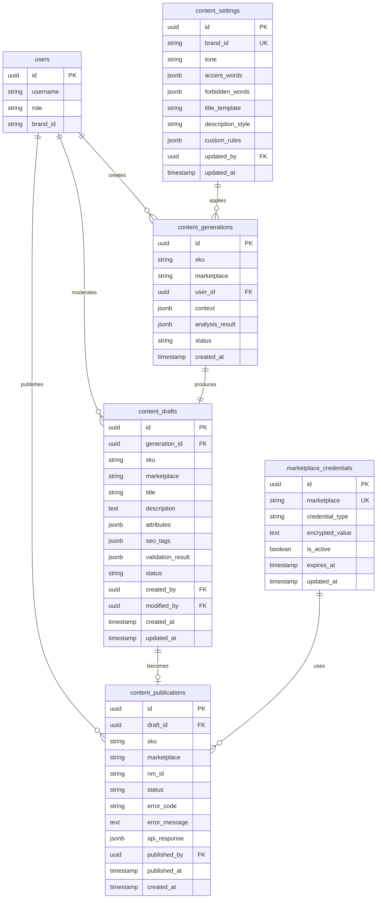

# ADOLF CONTENT FACTORY — Раздел 5: Database

**Проект:** Генерация SEO-контента для карточек товаров  
**Модуль:** Content Factory  
**Версия:** 1.0  
**Дата:** Январь 2026

---

## 5.1 Назначение

Раздел описывает схему базы данных PostgreSQL для модуля Content Factory.

### Основные сущности

| Таблица | Назначение |
|---------|------------|
| `content_generations` | История запросов на генерацию |
| `content_drafts` | Черновики контента на модерации |
| `content_publications` | История публикаций на маркетплейсы |
| `content_settings` | Настройки стиля контента по брендам |
| `marketplace_credentials` | Учётные данные API маркетплейсов |

---

## 5.2 ER-диаграмма



---

## 5.3 Таблицы

### 5.3.1 content_generations

История всех запросов на генерацию контента.

```sql
CREATE TABLE content_generations (
    id UUID PRIMARY KEY DEFAULT gen_random_uuid(),
    
    -- Идентификация товара
    sku VARCHAR(100) NOT NULL,
    marketplace VARCHAR(20) NOT NULL CHECK (marketplace IN ('wb', 'ozon', 'ym')),
    
    -- Пользователь
    user_id UUID NOT NULL REFERENCES users(id),
    
    -- Входные данные
    card_data JSONB,                    -- Данные карточки с маркетплейса
    manual_input JSONB,                 -- Ручной ввод пользователя
    brand_settings_snapshot JSONB,      -- Снимок настроек бренда на момент генерации
    
    -- Результаты AI
    context JSONB,                      -- Собранный контекст (GenerationContext)
    analysis_result JSONB,              -- Результат анализа (AnalysisResult)
    
    -- Статус
    status VARCHAR(20) NOT NULL DEFAULT 'pending'
        CHECK (status IN ('pending', 'processing', 'completed', 'failed')),
    error_message TEXT,
    
    -- Метаданные
    processing_time_ms INTEGER,         -- Время генерации в миллисекундах
    tokens_used JSONB,                  -- Использованные токены по моделям
    
    -- Временные метки
    created_at TIMESTAMP WITH TIME ZONE DEFAULT CURRENT_TIMESTAMP,
    completed_at TIMESTAMP WITH TIME ZONE,
    
    -- Индексы
    CONSTRAINT content_generations_sku_mp_idx UNIQUE (sku, marketplace, created_at)
);

-- Индексы
CREATE INDEX idx_content_generations_user ON content_generations(user_id);
CREATE INDEX idx_content_generations_status ON content_generations(status);
CREATE INDEX idx_content_generations_created ON content_generations(created_at DESC);
CREATE INDEX idx_content_generations_sku ON content_generations(sku);

-- Комментарии
COMMENT ON TABLE content_generations IS 'История запросов на генерацию контента';
COMMENT ON COLUMN content_generations.context IS 'Полный контекст генерации в формате JSON';
COMMENT ON COLUMN content_generations.tokens_used IS 'Статистика токенов: {"gpt5_mini": 1500, "claude_opus": 3000}';
```

### 5.3.2 content_drafts

Черновики контента, ожидающие модерации или опубликованные.

```sql
CREATE TABLE content_drafts (
    id UUID PRIMARY KEY DEFAULT gen_random_uuid(),
    
    -- Связь с генерацией
    generation_id UUID REFERENCES content_generations(id) ON DELETE SET NULL,
    
    -- Идентификация товара
    sku VARCHAR(100) NOT NULL,
    marketplace VARCHAR(20) NOT NULL CHECK (marketplace IN ('wb', 'ozon', 'ym')),
    category VARCHAR(255),
    category_id INTEGER,
    brand_name VARCHAR(100),
    
    -- Контент
    title VARCHAR(500) NOT NULL,
    description TEXT NOT NULL,
    attributes JSONB DEFAULT '{}',
    seo_tags JSONB DEFAULT '[]',
    
    -- Исходные данные (для сравнения "было/стало")
    original_title VARCHAR(500),
    original_description TEXT,
    original_attributes JSONB,
    
    -- Валидация
    validation_result JSONB,            -- Результат валидации
    is_valid BOOLEAN DEFAULT TRUE,
    
    -- Visual Prompting
    visual_prompting JSONB,             -- ТЗ для дизайнера (если генерировалось)
    
    -- Статус workflow
    status VARCHAR(20) NOT NULL DEFAULT 'pending'
        CHECK (status IN ('pending', 'approved', 'rejected', 'published', 'archived')),
    rejection_reason TEXT,
    
    -- Аудит
    created_by UUID NOT NULL REFERENCES users(id),
    modified_by UUID REFERENCES users(id),
    approved_by UUID REFERENCES users(id),
    
    -- Временные метки
    created_at TIMESTAMP WITH TIME ZONE DEFAULT CURRENT_TIMESTAMP,
    updated_at TIMESTAMP WITH TIME ZONE DEFAULT CURRENT_TIMESTAMP,
    approved_at TIMESTAMP WITH TIME ZONE,
    
    -- Версионирование
    version INTEGER DEFAULT 1
);

-- Индексы
CREATE INDEX idx_content_drafts_status ON content_drafts(status);
CREATE INDEX idx_content_drafts_sku ON content_drafts(sku);
CREATE INDEX idx_content_drafts_marketplace ON content_drafts(marketplace);
CREATE INDEX idx_content_drafts_created_by ON content_drafts(created_by);
CREATE INDEX idx_content_drafts_created_at ON content_drafts(created_at DESC);

-- Уникальность активного черновика на SKU+marketplace
CREATE UNIQUE INDEX idx_content_drafts_active_unique 
    ON content_drafts(sku, marketplace) 
    WHERE status IN ('pending', 'approved');

-- Триггер обновления updated_at
CREATE TRIGGER update_content_drafts_updated_at
    BEFORE UPDATE ON content_drafts
    FOR EACH ROW
    EXECUTE FUNCTION update_updated_at_column();

-- Комментарии
COMMENT ON TABLE content_drafts IS 'Черновики контента для модерации и публикации';
COMMENT ON COLUMN content_drafts.validation_result IS 'JSON с результатами валидации: {is_valid, issues[]}';
COMMENT ON COLUMN content_drafts.visual_prompting IS 'ТЗ для дизайнера в формате JSON';
```

### 5.3.3 content_publications

История публикаций контента на маркетплейсы.

```sql
CREATE TABLE content_publications (
    id UUID PRIMARY KEY DEFAULT gen_random_uuid(),
    
    -- Связь с черновиком
    draft_id UUID NOT NULL REFERENCES content_drafts(id),
    
    -- Идентификация
    sku VARCHAR(100) NOT NULL,
    marketplace VARCHAR(20) NOT NULL CHECK (marketplace IN ('wb', 'ozon', 'ym')),
    nm_id VARCHAR(100),                 -- ID товара на маркетплейсе
    
    -- Опубликованный контент (снимок)
    published_title VARCHAR(500),
    published_description TEXT,
    published_attributes JSONB,
    published_seo_tags JSONB,
    
    -- Статус публикации
    status VARCHAR(20) NOT NULL DEFAULT 'pending'
        CHECK (status IN ('pending', 'processing', 'published', 'failed', 'rolled_back')),
    
    -- Информация об ошибке
    error_code VARCHAR(50),
    error_message TEXT,
    retry_count INTEGER DEFAULT 0,
    
    -- API ответ
    api_response JSONB,
    
    -- Аудит
    published_by UUID NOT NULL REFERENCES users(id),
    
    -- Временные метки
    created_at TIMESTAMP WITH TIME ZONE DEFAULT CURRENT_TIMESTAMP,
    published_at TIMESTAMP WITH TIME ZONE,
    failed_at TIMESTAMP WITH TIME ZONE
);

-- Индексы
CREATE INDEX idx_content_publications_draft ON content_publications(draft_id);
CREATE INDEX idx_content_publications_status ON content_publications(status);
CREATE INDEX idx_content_publications_sku ON content_publications(sku);
CREATE INDEX idx_content_publications_published_at ON content_publications(published_at DESC);

-- Комментарии
COMMENT ON TABLE content_publications IS 'История публикаций контента на маркетплейсы';
COMMENT ON COLUMN content_publications.nm_id IS 'ID товара на маркетплейсе (nmID для WB, product_id для Ozon)';
COMMENT ON COLUMN content_publications.api_response IS 'Полный ответ API маркетплейса';
```

### 5.3.4 content_settings

Настройки стиля контента для каждого бренда.

```sql
CREATE TABLE content_settings (
    id UUID PRIMARY KEY DEFAULT gen_random_uuid(),
    
    -- Бренд
    brand_id VARCHAR(50) NOT NULL UNIQUE 
        CHECK (brand_id IN ('ohana_market', 'ohana_kids', 'shared')),
    brand_display_name VARCHAR(100) NOT NULL,
    
    -- Стиль коммуникации
    tone VARCHAR(100) NOT NULL DEFAULT 'нейтральный',
    tone_description TEXT,              -- Подробное описание тона
    
    -- Слова
    accent_words JSONB DEFAULT '[]',    -- Слова для акцента
    forbidden_words JSONB DEFAULT '[]', -- Запрещённые слова
    
    -- Шаблоны
    title_template VARCHAR(500),        -- Шаблон названия (опционально)
    description_style TEXT,             -- Описание стиля описания
    
    -- Дополнительные правила
    custom_rules JSONB DEFAULT '{}',
    
    -- Примеры (для обучения AI)
    example_titles JSONB DEFAULT '[]',
    example_descriptions JSONB DEFAULT '[]',
    
    -- Лимиты
    max_title_length INTEGER,
    min_description_length INTEGER,
    max_description_length INTEGER,
    
    -- Аудит
    updated_by UUID REFERENCES users(id),
    created_at TIMESTAMP WITH TIME ZONE DEFAULT CURRENT_TIMESTAMP,
    updated_at TIMESTAMP WITH TIME ZONE DEFAULT CURRENT_TIMESTAMP,
    
    -- Активность
    is_active BOOLEAN DEFAULT TRUE
);

-- Триггер обновления updated_at
CREATE TRIGGER update_content_settings_updated_at
    BEFORE UPDATE ON content_settings
    FOR EACH ROW
    EXECUTE FUNCTION update_updated_at_column();

-- Комментарии
COMMENT ON TABLE content_settings IS 'Настройки стиля контента по брендам';
COMMENT ON COLUMN content_settings.tone IS 'Тон коммуникации: стильный, заботливый, нейтральный и т.д.';
COMMENT ON COLUMN content_settings.custom_rules IS 'Дополнительные правила в формате JSON';
```

### 5.3.5 marketplace_credentials

Учётные данные для API маркетплейсов (зашифрованные).

```sql
CREATE TABLE marketplace_credentials (
    id UUID PRIMARY KEY DEFAULT gen_random_uuid(),
    
    -- Маркетплейс
    marketplace VARCHAR(20) NOT NULL CHECK (marketplace IN ('wb', 'ozon', 'ym')),
    
    -- Тип учётных данных
    credential_type VARCHAR(50) NOT NULL,
    -- Для WB: 'api_key'
    -- Для Ozon: 'client_id', 'api_key'
    -- Для YM: 'oauth_token', 'campaign_id', 'business_id'
    
    -- Зашифрованное значение
    encrypted_value TEXT NOT NULL,
    
    -- Метаданные
    description VARCHAR(255),
    
    -- Статус
    is_active BOOLEAN DEFAULT TRUE,
    expires_at TIMESTAMP WITH TIME ZONE,
    last_used_at TIMESTAMP WITH TIME ZONE,
    last_error TEXT,
    
    -- Аудит
    created_by UUID REFERENCES users(id),
    updated_at TIMESTAMP WITH TIME ZONE DEFAULT CURRENT_TIMESTAMP,
    
    -- Уникальность
    CONSTRAINT marketplace_credentials_unique UNIQUE (marketplace, credential_type)
);

-- Комментарии
COMMENT ON TABLE marketplace_credentials IS 'Зашифрованные учётные данные API маркетплейсов';
COMMENT ON COLUMN marketplace_credentials.encrypted_value IS 'Значение, зашифрованное AES-256';
```

---

## 5.4 Вспомогательные функции

### 5.4.1 Функция обновления updated_at

```sql
CREATE OR REPLACE FUNCTION update_updated_at_column()
RETURNS TRIGGER AS $$
BEGIN
    NEW.updated_at = CURRENT_TIMESTAMP;
    RETURN NEW;
END;
$$ LANGUAGE plpgsql;
```

### 5.4.2 Функция очистки старых генераций

```sql
CREATE OR REPLACE FUNCTION cleanup_old_generations(days_to_keep INTEGER DEFAULT 90)
RETURNS INTEGER AS $$
DECLARE
    deleted_count INTEGER;
BEGIN
    -- Удаление генераций старше указанного периода
    -- без связанных черновиков
    DELETE FROM content_generations
    WHERE created_at < CURRENT_TIMESTAMP - (days_to_keep || ' days')::INTERVAL
      AND id NOT IN (SELECT generation_id FROM content_drafts WHERE generation_id IS NOT NULL);
    
    GET DIAGNOSTICS deleted_count = ROW_COUNT;
    
    RETURN deleted_count;
END;
$$ LANGUAGE plpgsql;

-- Комментарий
COMMENT ON FUNCTION cleanup_old_generations IS 'Очистка старых записей генераций без связанных черновиков';
```

### 5.4.3 Функция получения статистики

```sql
CREATE OR REPLACE FUNCTION get_content_stats(
    p_start_date TIMESTAMP WITH TIME ZONE DEFAULT CURRENT_DATE - INTERVAL '30 days',
    p_end_date TIMESTAMP WITH TIME ZONE DEFAULT CURRENT_TIMESTAMP
)
RETURNS TABLE (
    total_generations BIGINT,
    successful_generations BIGINT,
    failed_generations BIGINT,
    total_publications BIGINT,
    successful_publications BIGINT,
    failed_publications BIGINT,
    avg_generation_time_ms NUMERIC,
    generations_by_marketplace JSONB,
    publications_by_marketplace JSONB
) AS $$
BEGIN
    RETURN QUERY
    SELECT 
        -- Генерации
        (SELECT COUNT(*) FROM content_generations 
         WHERE created_at BETWEEN p_start_date AND p_end_date)::BIGINT,
        (SELECT COUNT(*) FROM content_generations 
         WHERE status = 'completed' AND created_at BETWEEN p_start_date AND p_end_date)::BIGINT,
        (SELECT COUNT(*) FROM content_generations 
         WHERE status = 'failed' AND created_at BETWEEN p_start_date AND p_end_date)::BIGINT,
        
        -- Публикации
        (SELECT COUNT(*) FROM content_publications 
         WHERE created_at BETWEEN p_start_date AND p_end_date)::BIGINT,
        (SELECT COUNT(*) FROM content_publications 
         WHERE status = 'published' AND created_at BETWEEN p_start_date AND p_end_date)::BIGINT,
        (SELECT COUNT(*) FROM content_publications 
         WHERE status = 'failed' AND created_at BETWEEN p_start_date AND p_end_date)::BIGINT,
        
        -- Среднее время генерации
        (SELECT AVG(processing_time_ms)::NUMERIC FROM content_generations 
         WHERE status = 'completed' AND created_at BETWEEN p_start_date AND p_end_date),
        
        -- По маркетплейсам (генерации)
        (SELECT jsonb_object_agg(marketplace, cnt) FROM (
            SELECT marketplace, COUNT(*) as cnt 
            FROM content_generations 
            WHERE created_at BETWEEN p_start_date AND p_end_date
            GROUP BY marketplace
        ) t),
        
        -- По маркетплейсам (публикации)
        (SELECT jsonb_object_agg(marketplace, cnt) FROM (
            SELECT marketplace, COUNT(*) as cnt 
            FROM content_publications 
            WHERE created_at BETWEEN p_start_date AND p_end_date
            GROUP BY marketplace
        ) t);
END;
$$ LANGUAGE plpgsql;
```

---

## 5.5 Начальные данные

### 5.5.1 Настройки брендов

```sql
-- Охана Маркет (взрослая одежда)
INSERT INTO content_settings (
    brand_id,
    brand_display_name,
    tone,
    tone_description,
    accent_words,
    forbidden_words,
    description_style
) VALUES (
    'ohana_market',
    'Охана Маркет',
    'стильный',
    'Современный, модный, уверенный тон. Акцент на трендах и стиле.',
    '["стильный", "модный", "трендовый", "элегантный", "современный"]'::jsonb,
    '["дешёвый", "китайский", "некачественный", "б/у"]'::jsonb,
    'Описание должно подчёркивать стиль и актуальность. Использовать модные термины. Обращение на "вы".'
);

-- Охана Кидс (детская одежда)
INSERT INTO content_settings (
    brand_id,
    brand_display_name,
    tone,
    tone_description,
    accent_words,
    forbidden_words,
    description_style
) VALUES (
    'ohana_kids',
    'Охана Кидс',
    'заботливый',
    'Тёплый, дружелюбный, заботливый тон. Акцент на комфорте и безопасности для детей.',
    '["комфортный", "мягкий", "натуральный", "безопасный", "уютный", "практичный"]'::jsonb,
    '["дешёвый", "синтетический", "взрослый"]'::jsonb,
    'Описание должно подчёркивать заботу о ребёнке, натуральность материалов, удобство. Обращение к родителям.'
);

-- Общие настройки
INSERT INTO content_settings (
    brand_id,
    brand_display_name,
    tone,
    tone_description,
    accent_words,
    forbidden_words,
    description_style
) VALUES (
    'shared',
    'Общие настройки',
    'нейтральный',
    'Нейтральный профессиональный тон для документов, применимых к обоим брендам.',
    '["качественный", "надёжный", "практичный"]'::jsonb,
    '["лучший", "номер 1", "гарантированно"]'::jsonb,
    'Информативное описание без эмоциональной окраски.'
);
```

---

## 5.6 Представления (Views)

### 5.6.1 Активные черновики

```sql
CREATE OR REPLACE VIEW v_active_drafts AS
SELECT 
    d.id,
    d.sku,
    d.marketplace,
    d.title,
    d.status,
    d.is_valid,
    d.created_at,
    d.updated_at,
    u.username AS created_by_name,
    m.username AS modified_by_name
FROM content_drafts d
LEFT JOIN users u ON d.created_by = u.id
LEFT JOIN users m ON d.modified_by = m.id
WHERE d.status IN ('pending', 'approved')
ORDER BY d.created_at DESC;

COMMENT ON VIEW v_active_drafts IS 'Активные черновики (pending и approved)';
```

### 5.6.2 История публикаций с деталями

```sql
CREATE OR REPLACE VIEW v_publication_history AS
SELECT 
    p.id,
    p.sku,
    p.marketplace,
    p.nm_id,
    p.status,
    p.error_code,
    p.error_message,
    p.published_at,
    p.created_at,
    d.title,
    u.username AS published_by_name
FROM content_publications p
JOIN content_drafts d ON p.draft_id = d.id
JOIN users u ON p.published_by = u.id
ORDER BY p.created_at DESC;

COMMENT ON VIEW v_publication_history IS 'История публикаций с информацией о черновике';
```

### 5.6.3 Статистика по пользователям

```sql
CREATE OR REPLACE VIEW v_user_content_stats AS
SELECT 
    u.id AS user_id,
    u.username,
    u.role,
    COUNT(DISTINCT g.id) AS total_generations,
    COUNT(DISTINCT d.id) AS total_drafts,
    COUNT(DISTINCT p.id) AS total_publications,
    COUNT(DISTINCT CASE WHEN p.status = 'published' THEN p.id END) AS successful_publications
FROM users u
LEFT JOIN content_generations g ON g.user_id = u.id
LEFT JOIN content_drafts d ON d.created_by = u.id
LEFT JOIN content_publications p ON p.published_by = u.id
WHERE u.role IN ('senior', 'director', 'admin')
GROUP BY u.id, u.username, u.role;

COMMENT ON VIEW v_user_content_stats IS 'Статистика генерации контента по пользователям';
```

---

## 5.7 Миграции

### 5.7.1 Структура миграций

```
/migrations/content_factory/
├── 001_create_content_generations.sql
├── 002_create_content_drafts.sql
├── 003_create_content_publications.sql
├── 004_create_content_settings.sql
├── 005_create_marketplace_credentials.sql
├── 006_create_views.sql
├── 007_create_functions.sql
└── 008_insert_initial_data.sql
```

### 5.7.2 Пример миграции

```sql
-- migrations/content_factory/001_create_content_generations.sql

-- Up
CREATE TABLE IF NOT EXISTS content_generations (
    -- ... (структура таблицы)
);

-- Down
DROP TABLE IF EXISTS content_generations;
```

---

## 5.8 Индексы и производительность

### 5.8.1 Сводка индексов

| Таблица | Индекс | Тип | Назначение |
|---------|--------|-----|------------|
| content_generations | idx_..._user | B-tree | Фильтр по пользователю |
| content_generations | idx_..._status | B-tree | Фильтр по статусу |
| content_generations | idx_..._created | B-tree DESC | Сортировка по дате |
| content_drafts | idx_..._status | B-tree | Фильтр по статусу |
| content_drafts | idx_..._active_unique | Partial unique | Один активный черновик на SKU |
| content_publications | idx_..._draft | B-tree | JOIN с черновиками |
| content_publications | idx_..._published_at | B-tree DESC | Сортировка по дате |

### 5.8.2 Рекомендации по партиционированию

Для таблиц с большим объёмом данных (v2.0):

```sql
-- Партиционирование content_generations по месяцам
CREATE TABLE content_generations_partitioned (
    -- ... (те же поля)
) PARTITION BY RANGE (created_at);

-- Создание партиций
CREATE TABLE content_generations_2026_01 
    PARTITION OF content_generations_partitioned
    FOR VALUES FROM ('2026-01-01') TO ('2026-02-01');
```

---

## 5.9 Резервное копирование

### 5.9.1 Стратегия бэкапов

| Тип | Частота | Хранение |
|-----|---------|----------|
| Full backup | Ежедневно (ночью) | 30 дней |
| WAL archiving | Непрерывно | 7 дней |
| Point-in-time recovery | По запросу | — |

### 5.9.2 Важные таблицы для бэкапа

| Приоритет | Таблицы |
|-----------|---------|
| Критичный | `content_settings`, `marketplace_credentials` |
| Высокий | `content_drafts`, `content_publications` |
| Средний | `content_generations` |

---

**Документ подготовлен:** Январь 2026  
**Версия:** 1.0  
**Статус:** Черновик
