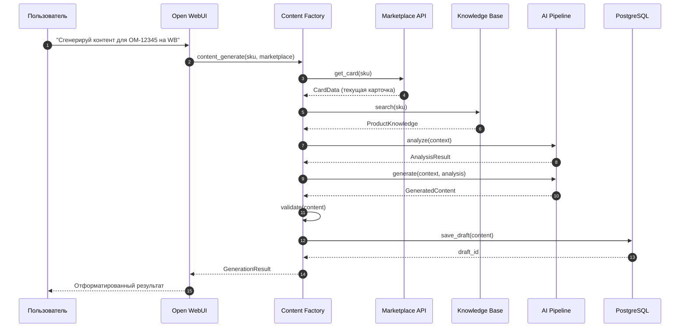
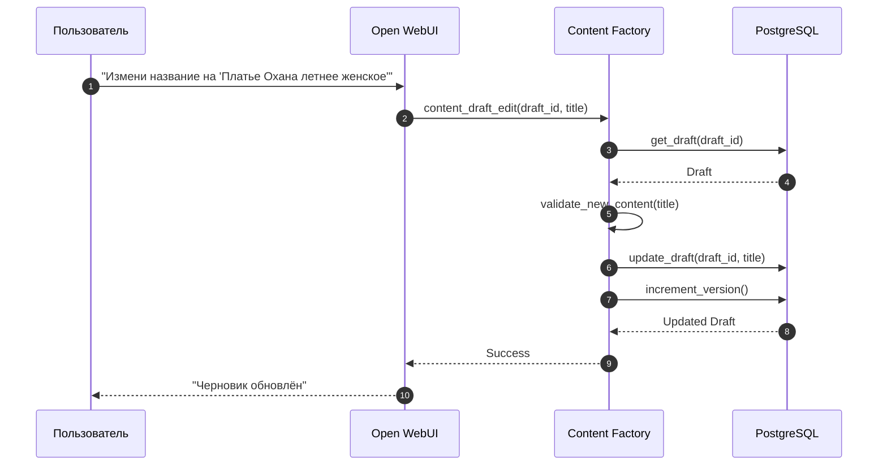
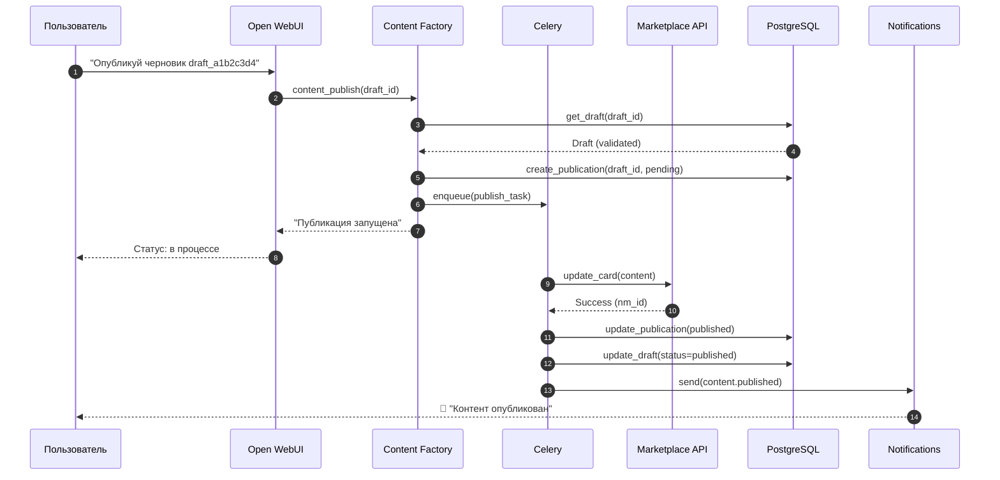
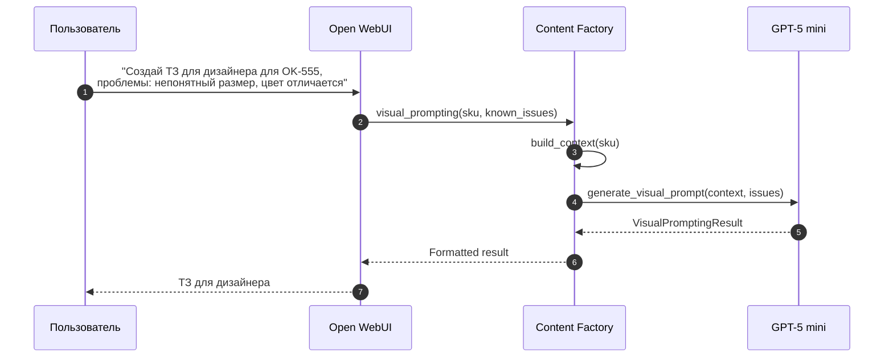
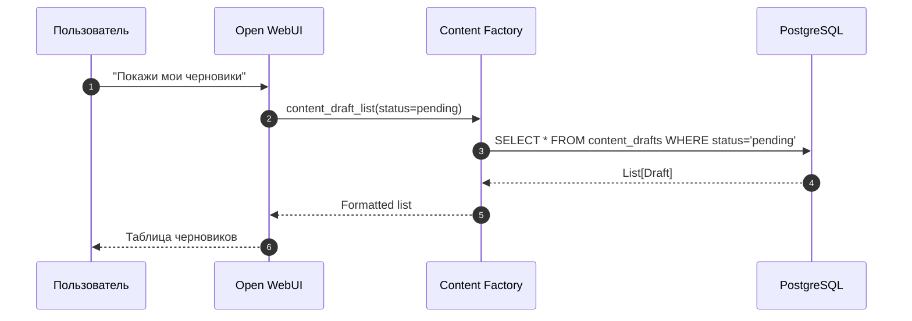
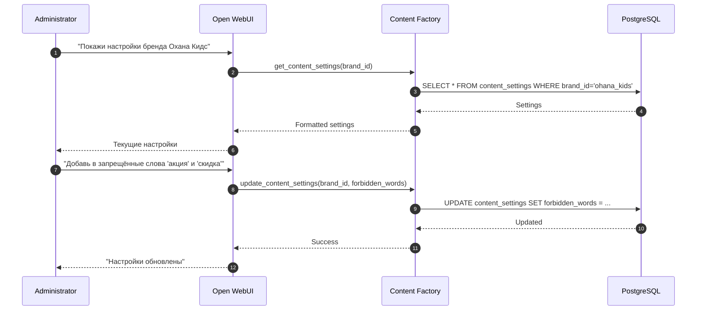
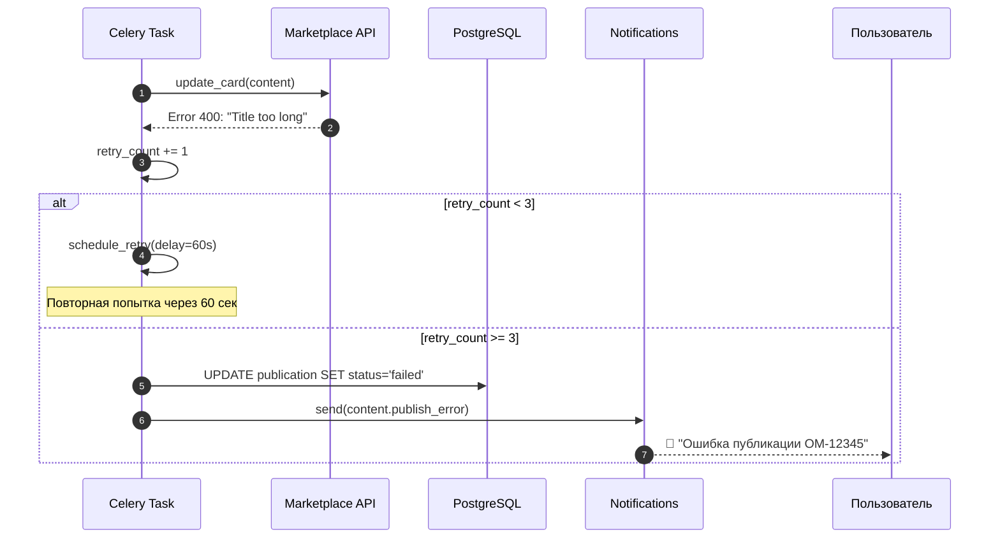
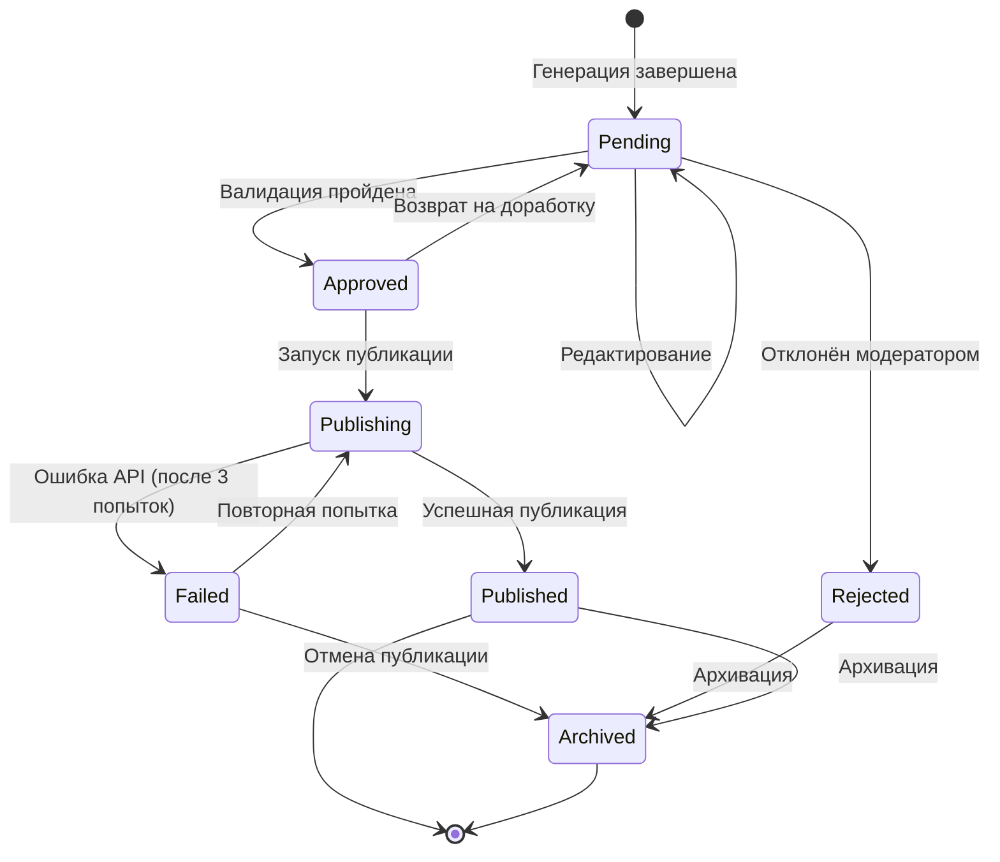

**Проект:** Генерация SEO-контента для карточек товаров  
**Модуль:** Content Factory  
**Версия:** 1.0  
**Дата:** Январь 2026

---

## 6.1 Интерактивные кнопки

### Концепция

После выполнения ключевых операций система предлагает пользователю интерактивные кнопки для быстрых действий. Это упрощает workflow и снижает необходимость ручного ввода команд.

### Кнопки после генерации контента

```
┌─────────────────────────────────────────────────────────┐
│  📝 Сгенерированный контент                             │
│                                                         │
│  Название: Охана Маркет Платье женское летнее...       │
│  Описание: Элегантное летнее платье из натуральной...  │
│                                                         │
│  ✅ Валидация пройдена                                  │
│                                                         │
│  ┌──────────────┐  ┌──────────────┐  ┌───────────────┐ │
│  │ ✓ Утвердить  │  │ ✏️ Исправить │  │ 📸 ТЗ дизайн. │ │
│  └──────────────┘  └──────────────┘  └───────────────┘ │
│                                                         │
│  ┌──────────────┐                                       │
│  │ 🔄 Заново    │                                       │
│  └──────────────┘                                       │
└─────────────────────────────────────────────────────────┘
```

### Описание кнопок

| Кнопка | Действие | Следующий шаг |
|--------|----------|---------------|
| ✓ Утвердить | Публикация на маркетплейс | Запуск `content_publish` |
| ✏️ Исправить | Режим редактирования | Запрос: "Что исправить?" |
| 📸 ТЗ дизайнеру | Генерация Visual Prompting | Запрос проблем товара |
| 🔄 Заново | Повторная генерация | Запуск `content_generate` |

### Кнопки после редактирования

```
┌─────────────────────────────────────────────────────────┐
│  ✅ Черновик обновлён                                   │
│                                                         │
│  Новое название: Платье Охана летнее женское миди      │
│                                                         │
│  ┌──────────────┐  ┌──────────────┐  ┌───────────────┐ │
│  │ ✓ Утвердить  │  │ ✏️ Ещё правки │  │ 👁️ Предпросм. │ │
│  └──────────────┘  └──────────────┘  └───────────────┘ │
└─────────────────────────────────────────────────────────┘
```

### Кнопки после публикации

```
┌─────────────────────────────────────────────────────────┐
│  ✅ Контент опубликован!                                │
│                                                         │
│  Артикул: OM-12345                                      │
│  Маркетплейс: Wildberries                               │
│                                                         │
│  ┌──────────────┐  ┌──────────────┐                    │
│  │ 📋 Ещё товар │  │ 📊 Статистика │                    │
│  └──────────────┘  └──────────────┘                    │
└─────────────────────────────────────────────────────────┘
```

### Техническая реализация кнопок

```python
def _format_generation_result_with_buttons(
    self, 
    data: dict, 
    sku: str, 
    marketplace: str,
    draft_id: str
) -> str:
    """Форматирование результата с интерактивными кнопками."""
    
    output = self._format_generation_result(data, sku, marketplace)
    
    # Добавление кнопок через специальный формат Open WebUI
    buttons = {
        "type": "buttons",
        "buttons": [
            {
                "label": "✓ Утвердить",
                "action": "send_message",
                "message": f"Опубликуй черновик {draft_id}"
            },
            {
                "label": "✏️ Исправить",
                "action": "send_message",
                "message": f"Хочу исправить черновик {draft_id}"
            },
            {
                "label": "📸 ТЗ дизайнеру",
                "action": "send_message",
                "message": f"Создай ТЗ для дизайнера для {sku}"
            },
            {
                "label": "🔄 Заново",
                "action": "send_message",
                "message": f"Сгенерируй контент заново для {sku} на {marketplace}"
            }
        ]
    }
    
    return output, buttons
```

### Event Emitter для кнопок

```python
if __event_emitter__:
    # Отправка результата
    __event_emitter__({
        "type": "message",
        "data": {"content": output}
    })
    
    # Отправка кнопок
    __event_emitter__({
        "type": "actions",
        "data": {
            "buttons": [
                {"label": "✓ Утвердить", "value": f"Опубликуй черновик {draft_id}"},
                {"label": "✏️ Исправить", "value": f"Исправить черновик {draft_id}"},
                {"label": "📸 ТЗ дизайнеру", "value": f"ТЗ для дизайнера {sku}"},
                {"label": "🔄 Заново", "value": f"Заново {sku} {marketplace}"}
            ]
        }
    })
```

---

## 6.2 Матрица сценариев

### Матрица сценариев по ролям

| Сценарий | Senior | Director | Admin |
|----------|:------:|:--------:|:-----:|
| UC-01: Генерация контента | ✅ | ✅ | ✅ |
| UC-02: Редактирование черновика | ✅ | ✅ | ✅ |
| UC-03: Публикация контента | ✅ | ✅ | ✅ |
| UC-04: Visual Prompting | ✅ | ✅ | ✅ |
| UC-05: Просмотр черновиков | ✅ | ✅ | ✅ |
| UC-06: Настройка стиля бренда | ❌ | ❌ | ✅ |
| UC-07: Управление API-ключами | ❌ | ❌ | ✅ |

---

## 6.3 UC-01: Генерация контента для карточки

### Описание

Пользователь запрашивает генерацию SEO-контента для товара по артикулу.

### Участники

- **Актор:** Senior Manager / Director / Administrator
- **Система:** Content Factory, AI Pipeline, Marketplace API

### Предусловия

- Пользователь авторизован в Open WebUI
- Товар существует на указанном маркетплейсе
- API маркетплейса доступен

### Основной сценарий



### Альтернативные сценарии

**A1: Товар не найден на маркетплейсе**
```
3a. Marketplace API возвращает пустой результат
    → Система: "Товар с артикулом {sku} не найден на {marketplace}"
    → Сценарий завершается
```

**A2: Ошибка API маркетплейса**
```
3b. Marketplace API недоступен или возвращает ошибку
    → Система: "Ошибка подключения к {marketplace}. Попробуйте позже."
    → Сценарий завершается
```

**A3: Генерация с дополнительным контекстом**
```
1a. Пользователь указывает дополнительные параметры:
    "Сгенерируй контент для OM-12345, ключевые особенности: натуральный хлопок, 
     целевая аудитория: молодые мамы"
    → Система включает manual_input в контекст генерации
    → Продолжение с шага 2
```

### Постусловия

- Создан черновик контента в статусе `pending`
- Запись в `content_generations` с полным контекстом
- Пользователь видит сгенерированный контент для проверки

### Пример диалога

```
Пользователь: Сгенерируй контент для артикула OM-12345 на Wildberries

Ассистент: ⏳ Генерация контента...

## 📝 Сгенерированный контент

**Артикул:** OM-12345
**Маркетплейс:** Wildberries
**ID черновика:** `draft_a1b2c3d4`

---

### Название
```
Охана Маркет Платье женское летнее миди хлопок с цветочным принтом
```
*Длина: 67 символов*

### Описание
Элегантное летнее платье из 100% натурального хлопка — идеальный выбор 
для жарких дней. Воздушная ткань обеспечивает комфорт в течение всего дня, 
а нежный цветочный принт добавляет женственности образу.

**Особенности:**
• Натуральный хлопок — дышит и не вызывает раздражения
• Длина миди — универсальная для любого случая
• Свободный крой — не сковывает движений

Идеально подходит для прогулок, офиса и романтических свиданий.

*Длина: 487 символов*

### SEO-теги
`платье женское, летнее платье, платье миди, хлопковое платье, 
цветочный принт, платье на лето`

### ✅ Валидация пройдена

┌──────────────┐  ┌──────────────┐  ┌───────────────┐  ┌──────────────┐
│ ✓ Утвердить  │  │ ✏️ Исправить │  │ 📸 ТЗ дизайн. │  │ 🔄 Заново    │
└──────────────┘  └──────────────┘  └───────────────┘  └──────────────┘
```

**Пользователь нажимает кнопку [✓ Утвердить]:**

```
Пользователь: Опубликуй черновик draft_a1b2c3d4

Ассистент: ⏳ Публикация на маркетплейс...

## ✅ Контент опубликован!

**Артикул:** OM-12345
**Маркетплейс:** Wildberries

┌──────────────┐  ┌──────────────┐
│ 📋 Ещё товар │  │ 📊 Статистика │
└──────────────┘  └──────────────┘
```

**Пользователь нажимает кнопку [✏️ Исправить]:**

```
Пользователь: Хочу исправить черновик draft_a1b2c3d4

Ассистент: Что вы хотите изменить?

┌──────────────┐  ┌──────────────┐  ┌───────────────┐
│ 📝 Название  │  │ 📄 Описание  │  │ 🏷️ SEO-теги   │
└──────────────┘  └──────────────┘  └───────────────┘
```

---

## 6.4 UC-02: Редактирование черновика

### Описание

Пользователь вносит правки в сгенерированный контент перед публикацией.

### Участники

- **Актор:** Senior Manager / Director / Administrator
- **Система:** Content Factory

### Предусловия

- Существует черновик в статусе `pending` или `approved`
- Пользователь имеет доступ к Content Factory

### Основной сценарий



### Альтернативные сценарии

**A1: Черновик не найден**
```
3a. Draft с указанным ID не существует
    → Система: "Черновик {draft_id} не найден"
    → Сценарий завершается
```

**A2: Валидация не пройдена**
```
4a. Новый контент не проходит валидацию (превышен лимит символов)
    → Система: "Название превышает лимит 100 символов (текущая длина: 115)"
    → Черновик не обновляется
    → Пользователь корректирует ввод
```

**A3: Редактирование описания**
```
1b. Пользователь редактирует описание:
    "Добавь в описание информацию о размерной сетке"
    → Система генерирует обновлённое описание с помощью AI
    → Продолжение с шага 3
```

### Постусловия

- Черновик обновлён с новым контентом
- Версия черновика увеличена
- Поле `modified_by` обновлено

### Пример диалога

```
Пользователь: Измени название на "Платье Охана летнее женское миди хлопок"

Ассистент: ✅ Черновик `draft_a1b2c3d4` обновлён.

**Новое название:**
```
Платье Охана летнее женское миди хлопок
```
*Длина: 43 символов* ✓

┌──────────────┐  ┌──────────────┐  ┌───────────────┐
│ ✓ Утвердить  │  │ ✏️ Ещё правки │  │ 👁️ Предпросм. │
└──────────────┘  └──────────────┘  └───────────────┘
```

**Пользователь нажимает [👁️ Предпросм.]:**

```
Пользователь: Покажи предпросмотр черновика draft_a1b2c3d4

Ассистент: 
## 👁️ Предпросмотр черновика

**Название:**
Платье Охана летнее женское миди хлопок

**Описание:**
Элегантное летнее платье из 100% натурального хлопка...

**SEO-теги:**
платье женское, летнее платье, платье миди...

┌──────────────┐  ┌──────────────┐
│ ✓ Утвердить  │  │ ✏️ Исправить │
└──────────────┘  └──────────────┘
```

---

## 6.5 UC-03: Публикация контента

### Описание

Пользователь публикует проверенный контент на маркетплейс.

### Участники

- **Актор:** Senior Manager / Director / Administrator
- **Система:** Content Factory, Celery, Marketplace API

### Предусловия

- Черновик существует и прошёл валидацию
- API маркетплейса доступен
- Учётные данные маркетплейса актуальны

### Основной сценарий



### Альтернативные сценарии

**A1: Ошибка API маркетплейса**
```
8a. Marketplace API возвращает ошибку
    → Celery: retry_count += 1
    → Если retry_count < 3: повторная попытка через 60 секунд
    → Если retry_count >= 3: статус = failed, уведомление об ошибке
```

**A2: Черновик не прошёл валидацию**
```
3a. Черновик имеет is_valid = false
    → Система: "Черновик содержит ошибки валидации. Исправьте перед публикацией."
    → Показать список ошибок
    → Сценарий завершается
```

**A3: Синхронная публикация (быстрый ответ API)**
```
7a. Marketplace API отвечает быстро (< 5 секунд)
    → Публикация выполняется синхронно
    → Пользователь сразу получает результат
```

### Постусловия

- Контент опубликован на маркетплейсе
- Черновик в статусе `published`
- Запись в `content_publications` с `status = published`
- Пользователь получил уведомление

### Пример диалога

```
Пользователь: Опубликуй черновик draft_a1b2c3d4

Ассистент: ⏳ Публикация на маркетплейс...

## ✅ Контент опубликован!

**Черновик:** `draft_a1b2c3d4`
**Артикул:** OM-12345
**Маркетплейс:** Wildberries
**ID на маркетплейсе:** `123456789`

Карточка товара обновлена. Изменения могут отобразиться с задержкой до 15 минут.

┌────────────────┐  ┌──────────────┐  ┌───────────────┐
│ 📋 Ещё товар   │  │ 📊 Статистика │  │ 🔗 Открыть WB │
└────────────────┘  └──────────────┘  └───────────────┘
```

**Пользователь нажимает [📋 Ещё товар]:**

```
Пользователь: Сгенерируй контент для следующего товара

Ассистент: Укажите артикул и маркетплейс для генерации контента.

Например: "Сгенерируй контент для OM-12346 на Wildberries"
```

---

## 6.6 UC-04: Visual Prompting (ТЗ для дизайнера)

### Описание

Пользователь запрашивает генерацию ТЗ для фотографа/дизайнера на основе известных проблем товара.

### Участники

- **Актор:** Senior Manager / Director / Administrator
- **Система:** Content Factory, AI Pipeline (GPT-5 mini)

### Предусловия

- Пользователь знает проблемы товара (из отзывов или опыта)
- Товар существует на маркетплейсе

### Основной сценарий



### Альтернативные сценарии

**A1: Не указаны проблемы**
```
1a. Пользователь не указал known_issues и photo_requirements
    → Система: "Для генерации ТЗ укажите известные проблемы товара 
       или требования к фото"
    → Сценарий завершается
```

**A2: Генерация на основе Reputation (v2.0)**
```
1b. В версии 2.0: автоматический анализ негативных отзывов
    → Система автоматически извлекает проблемы из ADOLF Reputation
    → Продолжение с шага 2
```

### Постусловия

- Сгенерировано ТЗ для дизайнера/фотографа
- ТЗ может быть скопировано и передано исполнителю

### Пример диалога

```
Пользователь: Создай ТЗ для дизайнера для артикула OK-555. 
Проблемы: покупатели жалуются что непонятен размер и цвет на фото отличается от реального

Ассистент: ⏳ Генерация ТЗ для дизайнера...

## 📸 ТЗ для дизайнера/фотографа

**Артикул:** OK-555
**Категория:** Детская одежда

---

### 📋 Основные рекомендации

1. **Проблема размера:** Добавить фото с сантиметровой лентой рядом с изделием
2. **Проблема цвета:** Использовать только естественное дневное освещение (окно, без ламп)
3. Включить фото на ребёнке для понимания посадки
4. Добавить фото размерной этикетки крупным планом

### 📐 Рекомендуемые ракурсы

- Общий план спереди (на вешалке и на модели)
- Общий план сзади
- Боковой ракурс для понимания кроя
- Изделие в разложенном виде с линейкой

### 🔍 Детальные снимки

- Бирка с составом и размером
- Текстура ткани крупным планом
- Замеры: длина изделия, ширина в груди, длина рукава
- Сравнение цвета при разном освещении (у окна / при лампе)

### 🎨 Стилизация

- Фон: нейтральный белый или светло-серый
- Без цветовых фильтров и обработки
- Баланс белого — по серой карте

---

*Скопируйте это ТЗ и передайте дизайнеру/фотографу.*
```

---

## 6.7 UC-05: Просмотр списка черновиков

### Описание

Пользователь просматривает список черновиков с возможностью фильтрации.

### Участники

- **Актор:** Senior Manager / Director / Administrator
- **Система:** Content Factory

### Основной сценарий



### Варианты фильтрации

| Запрос пользователя | Параметры |
|---------------------|-----------|
| "Покажи черновики" | status=pending |
| "Покажи черновики для Ozon" | marketplace=ozon, status=pending |
| "Покажи опубликованные черновики" | status=published |
| "Покажи все черновики" | status=* |

### Пример диалога

```
Пользователь: Покажи черновики для Wildberries

Ассистент: 
## 📋 Черновики (5)

| ID | Артикул | Маркетплейс | Статус | Создан |
|-----|---------|-------------|--------|--------|
| `draft_a1b2...` | OM-12345 | wb | pending | 2026-01-15 |
| `draft_c3d4...` | OM-12346 | wb | pending | 2026-01-15 |
| `draft_e5f6...` | OK-555 | wb | approved | 2026-01-14 |
| `draft_g7h8...` | OM-12340 | wb | pending | 2026-01-14 |
| `draft_i9j0...` | OK-560 | wb | pending | 2026-01-13 |

**Для просмотра:** `Покажи черновик draft_a1b2...`
**Для публикации:** `Опубликуй черновик draft_a1b2...`
```

---

## 6.8 UC-06: Настройка стиля бренда

### Описание

Администратор настраивает параметры генерации контента для бренда.

### Участники

- **Актор:** Administrator
- **Система:** Content Factory

### Предусловия

- Пользователь имеет роль `admin`

### Основной сценарий



### Доступные настройки

| Параметр | Описание | Пример |
|----------|----------|--------|
| tone | Тон коммуникации | "заботливый" |
| accent_words | Слова-акценты | ["комфортный", "натуральный"] |
| forbidden_words | Запрещённые слова | ["дешёвый", "акция"] |
| description_style | Стиль описания | "Тёплый, дружелюбный..." |

### Пример диалога

```
Пользователь: Покажи настройки контента для бренда Охана Кидс

Ассистент:
## ⚙️ Настройки бренда «Охана Кидс»

**Тон коммуникации:** заботливый

**Слова-акценты (использовать):**
`комфортный`, `мягкий`, `натуральный`, `безопасный`, `уютный`

**Запрещённые слова:**
`дешёвый`, `синтетический`, `взрослый`

**Стиль описания:**
> Описание должно подчёркивать заботу о ребёнке, натуральность материалов, 
> удобство. Обращение к родителям.

---

**Изменить:**
- `Добавь слово-акцент "гипоаллергенный"`
- `Добавь запрещённое слово "акция"`
- `Измени тон на "игривый"`
```

---

## 6.9 UC-07: Обработка ошибки публикации

### Описание

Система обрабатывает ошибку при публикации и уведомляет пользователя.

### Участники

- **Актор:** Система (автоматически)
- **Система:** Celery, Content Factory, Notifications

### Триггер

Marketplace API вернул ошибку при публикации.

### Основной сценарий



### Уведомление об ошибке

```
🔔 Ошибка публикации

**Артикул:** OM-12345
**Маркетплейс:** Wildberries
**Код ошибки:** TITLE_TOO_LONG
**Сообщение:** Название превышает допустимую длину (100 символов)

Исправьте ошибку и попробуйте опубликовать повторно.
```

---

## 6.10 Сводная таблица сценариев

| ID | Название | Актор | Триггер | Результат |
|----|----------|-------|---------|-----------|
| UC-01 | Генерация контента | Senior+ | Запрос пользователя | Черновик создан |
| UC-02 | Редактирование черновика | Senior+ | Запрос пользователя | Черновик обновлён |
| UC-03 | Публикация контента | Senior+ | Запрос пользователя | Контент на маркетплейсе |
| UC-04 | Visual Prompting | Senior+ | Запрос пользователя | ТЗ для дизайнера |
| UC-05 | Просмотр черновиков | Senior+ | Запрос пользователя | Список черновиков |
| UC-06 | Настройка стиля | Admin | Запрос админа | Настройки обновлены |
| UC-07 | Обработка ошибки | Система | Ошибка API | Уведомление отправлено |

---

## 6.11 Диаграмма состояний черновика



---

## 6.12 Сценарии v2.0

### UC-08: Пакетная генерация (v2.0)

```
Пользователь: Сгенерируй контент для артикулов OM-001, OM-002, OM-003 на Wildberries

Ассистент: ⏳ Пакетная генерация для 3 артикулов...

## 📦 Результаты пакетной генерации

| Артикул | Статус | Черновик |
|---------|--------|----------|
| OM-001 | ✅ Успешно | `draft_xxx1` |
| OM-002 | ✅ Успешно | `draft_xxx2` |
| OM-003 | ❌ Не найден | — |

**Успешно:** 2 из 3
**Для массовой публикации:** `Опубликуй черновики draft_xxx1, draft_xxx2`
```

### UC-09: Авто-Visual Prompting из Reputation (v2.0)

```
Пользователь: Создай ТЗ для дизайнера для OM-12345 на основе отзывов

Ассистент: ⏳ Анализ отзывов...

Найдено 15 негативных отзывов. Основные проблемы:
- Цвет отличается от фото (8 упоминаний)
- Непонятен размер (5 упоминаний)
- Не видно детали застёжки (2 упоминания)

## 📸 ТЗ для дизайнера (на основе анализа отзывов)
...
```

---

**Документ подготовлен:** Январь 2026  
**Версия:** 1.0  
**Статус:** Черновик
