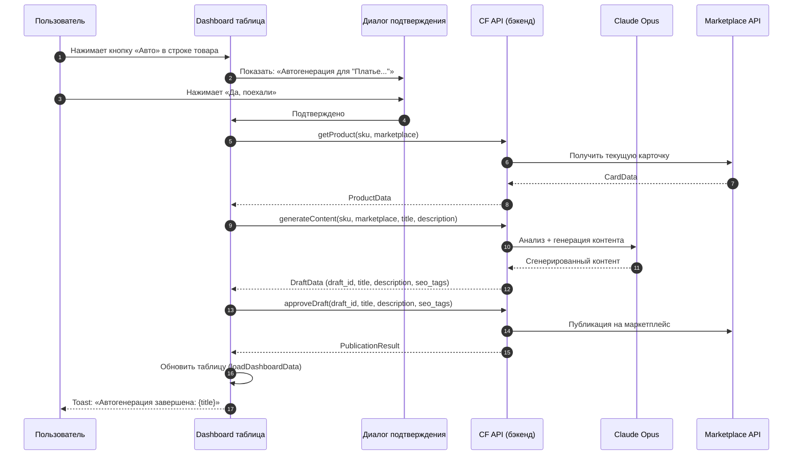
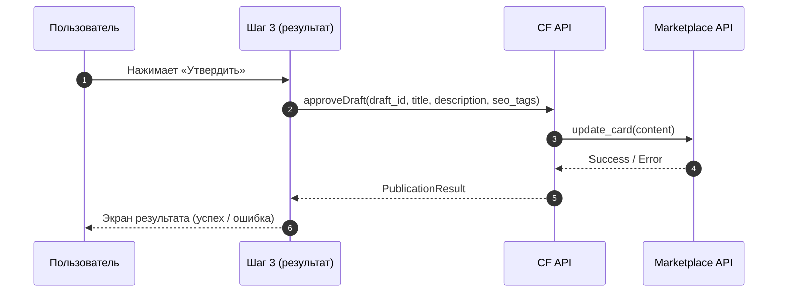
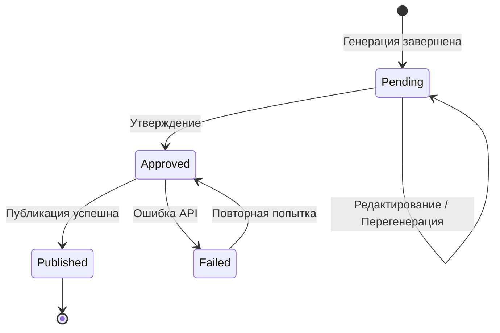
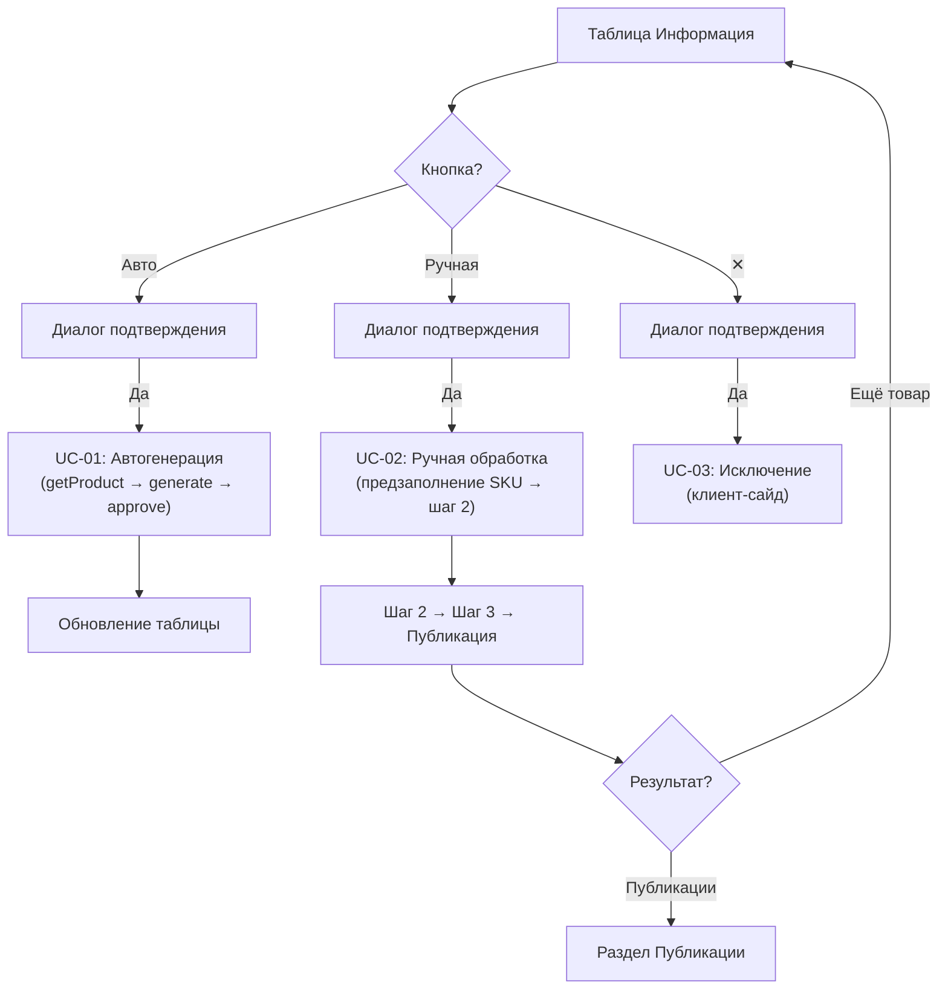

# ADOLF CONTENT FACTORY — Раздел 6: Сценарии использования

**Проект:** Генерация SEO-контента для карточек товаров
**Модуль:** Content Factory
**Версия:** 1.1
**Дата:** Февраль 2026

---

## 6.1 Матрица сценариев

### По ролям

| Сценарий | Senior | Director | Admin |
|----------|:------:|:--------:|:-----:|
| UC-01: Автогенерация из таблицы | ✅ | ✅ | ✅ |
| UC-02: Ручная обработка (3 шага) | ✅ | ✅ | ✅ |
| UC-03: Исключение товара из списка | ✅ | ✅ | ✅ |
| UC-04: Перегенерация контента | ✅ | ✅ | ✅ |
| UC-05: Утверждение и публикация | ✅ | ✅ | ✅ |
| UC-06: ТЗ для дизайнера | ✅ | ✅ | ✅ |
| UC-07: Настройка маркетплейсов | ❌ | ❌ | ✅ |

---

## 6.2 UC-01: Автогенерация из таблицы «Информация»

### Описание

Пользователь запускает полный автоматический цикл генерации контента одним нажатием кнопки «Авто» в таблице dashboard.

### Предусловия

- Пользователь на странице `/content-factory`, раздел «Информация»
- В таблице есть товары (оценка ниже порога качества)
- API маркетплейса доступен

### Основной сценарий



### UI-индикация

- Кнопка «Авто» заменяется на спиннер `<Loader2>` во время выполнения
- Кнопка становится `disabled` для предотвращения повторного нажатия
- После завершения — toast-уведомление и обновление таблицы

### Альтернативные сценарии

**A1: Пользователь отменяет действие**
```
2a. Пользователь нажимает «Отмена» / ✕ / кликает по оверлею
    → Диалог закрывается
    → Никаких API-вызовов не происходит
```

**A2: Ошибка API**
```
5a. getProduct или generateContent возвращает ошибку
    → Toast: «Ошибка: {message}»
    → Кнопка разблокируется
```

---

## 6.3 UC-02: Ручная обработка (3-шаговый флоу)

### Описание

Пользователь проходит через 3 шага: ввод артикула → просмотр карточки → генерация и утверждение.

### Предусловия

- Пользователь на разделе «Ручная обработка»
- Знает артикул товара или URL карточки

### Основной сценарий

#### Шаг 1: Ввод

```
┌────────────────────────────────────────┐
│  Маркетплейс:  [WB]  Ozon*  YM*       │
│                       (* В разработке) │
│  Артикул:  [ OM-12345        ]         │
│  — или —                               │
│  URL:      [                          ]│
│                                        │
│            [ Загрузить товар ]          │
└────────────────────────────────────────┘
```

1. Пользователь выбирает маркетплейс (только WB активен)
2. Вводит артикул (SKU) или URL товара
3. Нажимает «Загрузить товар»
4. Система вызывает `getProduct(sku, marketplace)`

#### Шаг 2: Карточка товара

```
┌─────────────────────┬──────────────────────────────┐
│                     │  Название:                   │
│   [Фото товара]     │  [ Платье женское летнее ] │
│   3:4 карусель      │                              │
│                     │  Описание:                   │
│   < 1/5 >           │  [ Элегантное платье из    ] │
│                     │  [ натуральной ткани...     ] │
│   [мини] [мини]     │                              │
│                     │  ✅ Валидация пройдена        │
│                     │  ██████░░ Название: 72%      │
│                     │  █████░░░ Описание: 65%      │
│                     │                              │
│                     │  [ Сгенерировать контент ]   │
└─────────────────────┴──────────────────────────────┘
```

1. Пользователь видит текущие данные карточки (фото, название, описание)
2. Может отредактировать название/описание перед генерацией
3. Если товар в склейке — видит переключатель «Один товар / Вся склейка»
4. Нажимает «Сгенерировать контент»
5. Система вызывает `generateContent(sku, marketplace, title, description)`

#### Шаг 3: Результат генерации

```
┌─────────────────────┬──────────────────────────────┐
│                     │  ← Назад   OM-12345  [WB]    │
│   [Фото товара]     │                              │
│   расширенная       │  Название: (12/60)           │
│   карусель          │  [ Охана Маркет Платье... ] │
│                     │                              │
│                     │  Описание: (487 симв.)       │
│                     │  [ Элегантное летнее...     ] │
│                     │                              │
│                     │  SEO-теги:                   │
│                     │  [платье] [летнее] [миди]    │
│                     │                              │
│                     │  Комментарий: [          ]   │
│                     │              [ Заново ]      │
│                     │                              │
│                     │  [Утвердить] [Перегенерировать]│
└─────────────────────┴──────────────────────────────┘
```

1. Пользователь просматривает сгенерированный контент
2. Может отредактировать название, описание, SEO-теги inline
3. Может перегенерировать с комментарием менеджера
4. Нажимает «Утвердить» → `approveDraft(draft_id, ...)`
5. Переходит на экран результата публикации

### Результат публикации

**Успех:**
```
┌──────────────────────────────────────────┐
│  ✅ Контент опубликован!                 │
│                                          │
│  Черновик: draft_abc123                  │
│  Артикул: OM-12345                       │
│  Маркетплейс: Wildberries               │
│  ID: 123456789                           │
│                                          │
│  Карточка обновится в течение ~15 минут  │
│                                          │
│  [ Ещё товар ]  [ Публикации ]           │
└──────────────────────────────────────────┘
```

**Ошибка:**
```
┌──────────────────────────────────────────┐
│  ❌ Ошибка публикации                    │
│                                          │
│  Черновик: draft_abc123                  │
│  Код ошибки: TITLE_TOO_LONG             │
│  Сообщение: Название превышает лимит    │
│                                          │
│  [ Ещё товар ]  [ Публикации ]           │
└──────────────────────────────────────────┘
```

---

## 6.4 UC-03: Исключение товара из списка

### Описание

Пользователь убирает товар из таблицы dashboard, чтобы сфокусироваться на остальных.

### Основной сценарий

1. Пользователь нажимает **✕** в строке товара
2. Появляется диалог: «Исключить "Платье..." из списка?»
3. Пользователь подтверждает
4. Товар исчезает из таблицы

### Особенности

- Исключение **сессионное** — при обновлении страницы товар вернётся
- Список исключённых SKU хранится в `Set<string>` на клиенте
- Не отправляется на сервер
- Для реактивного обновления используется переприсвоение: `excludedSkus = excludedSkus`

---

## 6.5 UC-04: Перегенерация контента

### Описание

Пользователь запрашивает повторную генерацию с комментарием.

### Предусловия

- Шаг 3 ручной обработки (результат генерации на экране)
- Есть `draft_id` текущего черновика

### Основной сценарий

1. Пользователь вводит комментарий в поле «Комментарий менеджера»
2. Нажимает «Заново» или «Перегенерировать»
3. Система вызывает `regenerateContent(draft_id, manager_notes)`
4. Обновляются поля: название, описание, SEO-теги, метрики

```
POST /api/content/regenerate
Body: { draft_id, manager_notes: "Добавить информацию о составе ткани" }
```

---

## 6.6 UC-05: Утверждение и публикация

### Описание

Пользователь утверждает сгенерированный контент, запуская публикацию на маркетплейс.

### Основной сценарий



### Статусы черновика



---

## 6.7 UC-06: ТЗ для дизайнера (Visual Prompting)

### Описание

Пользователь просматривает автоматически сгенерированное ТЗ для фотографа/дизайнера.

### Предусловия

- Шаг 3 ручной обработки
- Данные Visual Prompting доступны

### Текущий статус

> **Примечание:** В текущей версии Visual Prompting использует **мок-данные** (захардкоженный объект `mockVisualPrompting`). API-эндпоинт `/content/generate/visual-prompt` определён, но не вызывается из UI. Полная интеграция запланирована на v1.2.

### Экран ТЗ

```
┌──────────────────────────────────────────┐
│  📸 ТЗ для дизайнера                     │
│                                          │
│  📋 Рекомендации                          │
│  1. Фото с сантиметровой лентой          │
│  2. Естественное дневное освещение       │
│                                          │
│  📐 Ракурсы                               │
│  • Общий план спереди и сзади            │
│  • Боковой ракурс                        │
│                                          │
│  🔍 Детальные снимки                      │
│  • Размерная этикетка                    │
│  • Текстура ткани крупным планом         │
│                                          │
│  🎨 Стилизация                            │
│  • Нейтральный белый фон                 │
│                                          │
│  [ 📋 Копировать ]  [ ← Назад ]          │
└──────────────────────────────────────────┘
```

Кнопка «Копировать» форматирует ТЗ как plain text с emoji-префиксами и копирует в буфер обмена.

---

## 6.8 UC-07: Настройка маркетплейсов (Admin)

### Описание

Администратор настраивает пороги качества и токены доступа к API маркетплейсов.

### Предусловия

- Роль `admin`

### Основной сценарий

1. Нажимает ⚙ в хедере
2. Открывается панель настроек
3. Система загружает текущие настройки: `GET /api/settings`
4. Администратор:
   - Настраивает порог качества (слайдер 0–100)
   - Вводит/обновляет WB Token
5. Нажимает «Сохранить»
6. Система сохраняет: `PUT /api/settings`
7. Toast: «Настройки сохранены»

### Доступные маркетплейсы

| Маркетплейс | Статус | Настройки |
|-------------|--------|-----------|
| Wildberries | ✅ Активен | WB Token |
| Ozon | 🔒 В разработке | — |
| Яндекс.Маркет | 🔒 В разработке | — |

---

## 6.9 Переход между сценариями

### Из таблицы «Информация»



---

## 6.10 Сценарии v2.0 (планы)

| ID | Название | Описание |
|----|----------|----------|
| UC-08 | Пакетная генерация | Выбор нескольких товаров в таблице, массовая автогенерация |
| UC-09 | Visual Prompting из отзывов | Авто-анализ негативных отзывов (модуль Reputation) → ТЗ |
| UC-10 | Публикации (полный раздел) | Реальные данные из API вместо мок-данных |
| UC-11 | WB Диагностика | Кнопка в навигации, полноценный раздел ошибок модерации |
| UC-12 | Ozon / Яндекс.Маркет | Снятие ограничения «В разработке» для остальных маркетплейсов |

---

**Документ обновлён:** Февраль 2026
**Версия:** 1.1
**Статус:** Актуальный
