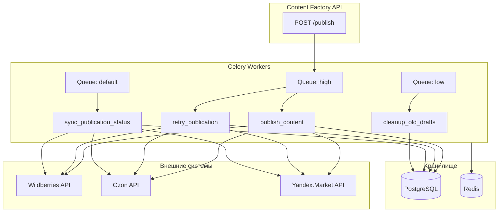
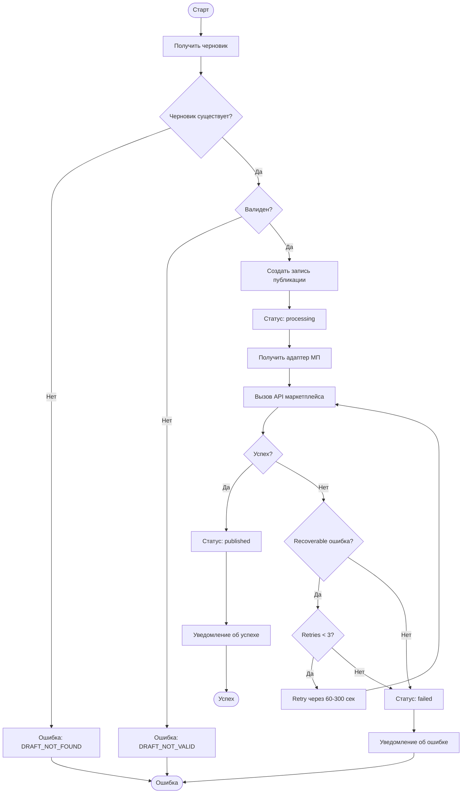

# ADOLF CONTENT FACTORY — Раздел 7: Celery Tasks

**Проект:** Генерация SEO-контента для карточек товаров  
**Модуль:** Content Factory  
**Версия:** 1.0  
**Дата:** Январь 2026

---

## 7.1 Назначение

Раздел описывает фоновые задачи Celery для модуля Content Factory.

### Перечень задач

| Задача | Назначение | Приоритет |
|--------|------------|-----------|
| `publish_content` | Публикация контента на маркетплейс | high |
| `retry_publication` | Повторная попытка публикации | high |
| `cleanup_old_drafts` | Очистка старых черновиков | low |
| `sync_publication_status` | Синхронизация статусов с маркетплейсом | medium |

---

## 7.2 Архитектура



---

## 7.3 Конфигурация Celery

### 7.3.1 Настройки

```python
# celery_config.py

from celery import Celery
from kombu import Queue

app = Celery('content_factory')

app.conf.update(
    # Брокер
    broker_url='redis://redis:6379/2',
    result_backend='redis://redis:6379/2',
    
    # Сериализация
    task_serializer='json',
    accept_content=['json'],
    result_serializer='json',
    
    # Временная зона
    timezone='Europe/Moscow',
    enable_utc=True,
    
    # Очереди
    task_queues=(
        Queue('content_high', routing_key='content.high'),
        Queue('content_default', routing_key='content.default'),
        Queue('content_low', routing_key='content.low'),
    ),
    task_default_queue='content_default',
    task_default_routing_key='content.default',
    
    # Роутинг задач
    task_routes={
        'content_factory.tasks.publish_content': {'queue': 'content_high'},
        'content_factory.tasks.retry_publication': {'queue': 'content_high'},
        'content_factory.tasks.sync_publication_status': {'queue': 'content_default'},
        'content_factory.tasks.cleanup_old_drafts': {'queue': 'content_low'},
    },
    
    # Retry policy
    task_acks_late=True,
    task_reject_on_worker_lost=True,
    
    # Лимиты
    worker_prefetch_multiplier=1,
    worker_concurrency=4,
    
    # Результаты
    result_expires=86400,  # 24 часа
    
    # Beat schedule
    beat_schedule={
        'cleanup-old-drafts-daily': {
            'task': 'content_factory.tasks.cleanup_old_drafts',
            'schedule': 86400,  # Каждые 24 часа
            'options': {'queue': 'content_low'}
        },
        'sync-publication-status-hourly': {
            'task': 'content_factory.tasks.sync_publication_status',
            'schedule': 3600,  # Каждый час
            'options': {'queue': 'content_default'}
        },
    }
)
```

### 7.3.2 Запуск воркеров

```bash
# Worker для высокоприоритетных задач (публикация)
celery -A content_factory worker -Q content_high -c 2 --loglevel=info

# Worker для стандартных задач
celery -A content_factory worker -Q content_default -c 2 --loglevel=info

# Worker для низкоприоритетных задач
celery -A content_factory worker -Q content_low -c 1 --loglevel=info

# Beat scheduler
celery -A content_factory beat --loglevel=info
```

---

## 7.4 Задача: publish_content

### 7.4.1 Назначение

Публикация контента черновика на маркетплейс.

### 7.4.2 Параметры

| Параметр | Тип | Описание |
|----------|-----|----------|
| `draft_id` | str | UUID черновика |
| `user_id` | str | UUID пользователя (для аудита) |

### 7.4.3 Реализация

```python
# tasks/publish_content.py

from celery import shared_task
from celery.exceptions import MaxRetriesExceededError
from typing import Optional
import logging

from adapters import get_adapter
from repositories import DraftRepository, PublicationRepository
from notifications import send_notification

logger = logging.getLogger(__name__)


@shared_task(
    bind=True,
    name='content_factory.tasks.publish_content',
    max_retries=3,
    default_retry_delay=60,
    autoretry_for=(ConnectionError, TimeoutError),
    retry_backoff=True,
    retry_backoff_max=300,
    retry_jitter=True,
    acks_late=True,
    track_started=True,
    time_limit=120,
    soft_time_limit=90
)
def publish_content(
    self,
    draft_id: str,
    user_id: str
) -> dict:
    """
    Публикация контента на маркетплейс.
    
    Args:
        draft_id: UUID черновика
        user_id: UUID пользователя
    
    Returns:
        Результат публикации
    """
    
    logger.info(f"[publish_content] Starting for draft_id={draft_id}")
    
    draft_repo = DraftRepository()
    pub_repo = PublicationRepository()
    
    try:
        # 1. Получение черновика
        draft = draft_repo.get_by_id(draft_id)
        if not draft:
            logger.error(f"Draft {draft_id} not found")
            return {"success": False, "error": "DRAFT_NOT_FOUND"}
        
        # 2. Проверка валидности
        if not draft.is_valid:
            logger.warning(f"Draft {draft_id} is not valid")
            return {"success": False, "error": "DRAFT_NOT_VALID"}
        
        # 3. Создание записи публикации (если нет)
        publication = pub_repo.get_pending_for_draft(draft_id)
        if not publication:
            publication = pub_repo.create(
                draft_id=draft_id,
                sku=draft.sku,
                marketplace=draft.marketplace,
                published_by=user_id
            )
        
        # 4. Обновление статуса на processing
        pub_repo.update_status(publication.id, 'processing')
        
        # 5. Получение адаптера маркетплейса
        adapter = get_adapter(draft.marketplace)
        
        # 6. Формирование контента для публикации
        content = CardContent(
            title=draft.title,
            description=draft.description,
            attributes=draft.attributes,
            seo_tags=draft.seo_tags
        )
        
        # 7. Публикация на маркетплейс
        result = adapter.update_card(draft.sku, content)
        
        if result.success:
            # Успешная публикация
            pub_repo.update_status(
                publication.id,
                'published',
                nm_id=result.nm_id,
                api_response=result.raw_response,
                published_at=datetime.utcnow()
            )
            
            # Обновление статуса черновика
            draft_repo.update_status(draft_id, 'published')
            
            # Уведомление
            send_notification(
                user_id=user_id,
                event_type='content.published',
                data={
                    'sku': draft.sku,
                    'marketplace': draft.marketplace,
                    'nm_id': result.nm_id
                }
            )
            
            logger.info(f"[publish_content] Success for {draft.sku}")
            
            return {
                "success": True,
                "publication_id": str(publication.id),
                "nm_id": result.nm_id
            }
        else:
            # Ошибка публикации
            raise PublicationError(result.error_code, result.error_message)
            
    except PublicationError as e:
        logger.warning(f"[publish_content] Publication error: {e.code} - {e.message}")
        
        # Обновление информации об ошибке
        pub_repo.update_error(
            publication.id,
            error_code=e.code,
            error_message=e.message,
            retry_count=self.request.retries
        )
        
        # Retry для recoverable ошибок
        if e.code in ['RATE_LIMIT', 'API_ERROR', 'TIMEOUT']:
            try:
                raise self.retry(exc=e)
            except MaxRetriesExceededError:
                return handle_max_retries(publication, draft, user_id, e)
        else:
            # Non-recoverable ошибка
            return handle_permanent_error(publication, draft, user_id, e)
            
    except Exception as e:
        logger.exception(f"[publish_content] Unexpected error: {e}")
        
        try:
            raise self.retry(exc=e)
        except MaxRetriesExceededError:
            pub_repo.update_status(publication.id, 'failed')
            send_notification(
                user_id=user_id,
                event_type='content.publish_error',
                data={
                    'sku': draft.sku,
                    'error_message': str(e)
                }
            )
            return {"success": False, "error": str(e)}


def handle_max_retries(publication, draft, user_id, error) -> dict:
    """Обработка превышения лимита retry."""
    
    pub_repo = PublicationRepository()
    
    pub_repo.update_status(publication.id, 'failed')
    
    send_notification(
        user_id=user_id,
        event_type='content.publish_error',
        data={
            'sku': draft.sku,
            'marketplace': draft.marketplace,
            'error_code': error.code,
            'error_message': f"Превышено количество попыток. {error.message}"
        }
    )
    
    return {
        "success": False,
        "error_code": error.code,
        "error_message": error.message,
        "retries_exhausted": True
    }


def handle_permanent_error(publication, draft, user_id, error) -> dict:
    """Обработка non-recoverable ошибки."""
    
    pub_repo = PublicationRepository()
    
    pub_repo.update_status(
        publication.id,
        'failed',
        error_code=error.code,
        error_message=error.message
    )
    
    send_notification(
        user_id=user_id,
        event_type='content.publish_error',
        data={
            'sku': draft.sku,
            'marketplace': draft.marketplace,
            'error_code': error.code,
            'error_message': error.message
        }
    )
    
    return {
        "success": False,
        "error_code": error.code,
        "error_message": error.message
    }


class PublicationError(Exception):
    """Ошибка публикации."""
    
    def __init__(self, code: str, message: str):
        self.code = code
        self.message = message
        super().__init__(f"{code}: {message}")
```

### 7.4.4 Диаграмма выполнения



---

## 7.5 Задача: retry_publication

### 7.5.1 Назначение

Ручной запуск повторной попытки публикации для failed записей.

### 7.5.2 Реализация

```python
# tasks/retry_publication.py

from celery import shared_task
import logging

from repositories import PublicationRepository
from tasks.publish_content import publish_content

logger = logging.getLogger(__name__)


@shared_task(
    name='content_factory.tasks.retry_publication',
    acks_late=True
)
def retry_publication(
    publication_id: str,
    user_id: str
) -> dict:
    """
    Повторная попытка публикации.
    
    Args:
        publication_id: UUID записи публикации
        user_id: UUID пользователя
    
    Returns:
        Результат запуска
    """
    
    logger.info(f"[retry_publication] Starting for publication_id={publication_id}")
    
    pub_repo = PublicationRepository()
    
    # Получение публикации
    publication = pub_repo.get_by_id(publication_id)
    if not publication:
        return {"success": False, "error": "PUBLICATION_NOT_FOUND"}
    
    # Проверка статуса
    if publication.status != 'failed':
        return {"success": False, "error": "PUBLICATION_NOT_FAILED"}
    
    # Сброс счётчика retry
    pub_repo.reset_retry_count(publication_id)
    
    # Обновление статуса на pending
    pub_repo.update_status(publication_id, 'pending')
    
    # Запуск задачи публикации
    publish_content.delay(
        draft_id=str(publication.draft_id),
        user_id=user_id
    )
    
    logger.info(f"[retry_publication] Scheduled publish for {publication_id}")
    
    return {
        "success": True,
        "message": "Publication retry scheduled"
    }
```

---

## 7.6 Задача: cleanup_old_drafts

### 7.6.1 Назначение

Периодическая очистка старых черновиков и генераций.

### 7.6.2 Реализация

```python
# tasks/cleanup_old_drafts.py

from celery import shared_task
from datetime import datetime, timedelta
import logging

from repositories import DraftRepository, GenerationRepository

logger = logging.getLogger(__name__)


@shared_task(
    name='content_factory.tasks.cleanup_old_drafts',
    acks_late=True
)
def cleanup_old_drafts(
    archive_days: int = 30,
    delete_days: int = 90
) -> dict:
    """
    Очистка старых черновиков.
    
    Args:
        archive_days: Дней до архивации rejected черновиков
        delete_days: Дней до удаления archived черновиков
    
    Returns:
        Статистика очистки
    """
    
    logger.info("[cleanup_old_drafts] Starting cleanup")
    
    draft_repo = DraftRepository()
    gen_repo = GenerationRepository()
    
    now = datetime.utcnow()
    archive_threshold = now - timedelta(days=archive_days)
    delete_threshold = now - timedelta(days=delete_days)
    
    stats = {
        "archived_drafts": 0,
        "deleted_drafts": 0,
        "deleted_generations": 0
    }
    
    # 1. Архивация rejected черновиков старше archive_days
    archived = draft_repo.archive_old_rejected(archive_threshold)
    stats["archived_drafts"] = archived
    logger.info(f"Archived {archived} rejected drafts")
    
    # 2. Удаление archived черновиков старше delete_days
    deleted_drafts = draft_repo.delete_old_archived(delete_threshold)
    stats["deleted_drafts"] = deleted_drafts
    logger.info(f"Deleted {deleted_drafts} archived drafts")
    
    # 3. Удаление генераций без связанных черновиков
    deleted_gens = gen_repo.cleanup_orphaned(delete_threshold)
    stats["deleted_generations"] = deleted_gens
    logger.info(f"Deleted {deleted_gens} orphaned generations")
    
    logger.info(f"[cleanup_old_drafts] Completed: {stats}")
    
    return stats
```

### 7.6.3 SQL-запросы очистки

```python
# repositories/draft_repository.py

class DraftRepository:
    
    def archive_old_rejected(self, threshold: datetime) -> int:
        """Архивация старых rejected черновиков."""
        
        query = """
            UPDATE content_drafts
            SET status = 'archived',
                updated_at = CURRENT_TIMESTAMP
            WHERE status = 'rejected'
              AND updated_at < %s
        """
        
        with self.connection.cursor() as cursor:
            cursor.execute(query, (threshold,))
            return cursor.rowcount
    
    def delete_old_archived(self, threshold: datetime) -> int:
        """Удаление старых archived черновиков."""
        
        query = """
            DELETE FROM content_drafts
            WHERE status = 'archived'
              AND updated_at < %s
        """
        
        with self.connection.cursor() as cursor:
            cursor.execute(query, (threshold,))
            return cursor.rowcount
```

---

## 7.7 Задача: sync_publication_status

### 7.7.1 Назначение

Синхронизация статусов публикаций с маркетплейсами (проверка фактического применения изменений).

### 7.7.2 Реализация

```python
# tasks/sync_publication_status.py

from celery import shared_task
from datetime import datetime, timedelta
import logging

from adapters import get_adapter
from repositories import PublicationRepository

logger = logging.getLogger(__name__)


@shared_task(
    name='content_factory.tasks.sync_publication_status',
    acks_late=True,
    time_limit=300
)
def sync_publication_status() -> dict:
    """
    Синхронизация статусов публикаций.
    
    Проверяет, что опубликованный контент действительно
    применился на маркетплейсе.
    
    Returns:
        Статистика синхронизации
    """
    
    logger.info("[sync_publication_status] Starting sync")
    
    pub_repo = PublicationRepository()
    
    # Получение недавних публикаций для проверки
    # (опубликованные за последние 24 часа)
    threshold = datetime.utcnow() - timedelta(hours=24)
    publications = pub_repo.get_recent_published(threshold)
    
    stats = {
        "checked": 0,
        "verified": 0,
        "mismatched": 0,
        "errors": 0
    }
    
    for pub in publications:
        stats["checked"] += 1
        
        try:
            adapter = get_adapter(pub.marketplace)
            current_card = adapter.get_card(pub.sku)
            
            if not current_card:
                logger.warning(f"Card {pub.sku} not found on {pub.marketplace}")
                stats["errors"] += 1
                continue
            
            # Проверка соответствия
            if (current_card.title == pub.published_title and 
                current_card.description == pub.published_description):
                stats["verified"] += 1
                pub_repo.mark_verified(pub.id)
            else:
                stats["mismatched"] += 1
                logger.warning(
                    f"Content mismatch for {pub.sku}: "
                    f"expected title='{pub.published_title[:50]}...', "
                    f"actual='{current_card.title[:50]}...'"
                )
                pub_repo.mark_mismatched(pub.id, {
                    "expected_title": pub.published_title,
                    "actual_title": current_card.title
                })
                
        except Exception as e:
            logger.error(f"Error checking {pub.sku}: {e}")
            stats["errors"] += 1
    
    logger.info(f"[sync_publication_status] Completed: {stats}")
    
    return stats
```

---

## 7.8 Мониторинг задач

### 7.8.1 Метрики

| Метрика | Описание | Алерт |
|---------|----------|-------|
| `celery_task_duration_seconds` | Время выполнения задачи | > 60 сек |
| `celery_task_failures_total` | Количество ошибок | > 10/час |
| `celery_queue_length` | Длина очереди | > 100 |
| `publication_retry_rate` | Процент retry | > 20% |

### 7.8.2 Логирование

```python
# Структурированное логирование
logger.info(
    "Publication completed",
    extra={
        "task_id": self.request.id,
        "draft_id": draft_id,
        "sku": draft.sku,
        "marketplace": draft.marketplace,
        "duration_ms": duration_ms,
        "retries": self.request.retries
    }
)
```

### 7.8.3 Flower Dashboard

```bash
# Запуск Flower для мониторинга
celery -A content_factory flower --port=5555

# Доступ: http://localhost:5555
```

---

## 7.9 Обработка ошибок

### 7.9.1 Классификация ошибок

| Тип | Примеры | Стратегия |
|-----|---------|-----------|
| Recoverable | Rate limit, timeout, 5xx | Retry с backoff |
| Non-recoverable | 400, 404, auth error | Fail immediately |
| Infrastructure | Redis down, DB error | Retry с алертом |

### 7.9.2 Retry стратегия

```python
# Exponential backoff с jitter
retry_delays = [60, 120, 300]  # 1 мин, 2 мин, 5 мин

# Пример расчёта delay
def get_retry_delay(retry_count: int) -> int:
    base_delay = retry_delays[min(retry_count, len(retry_delays) - 1)]
    jitter = random.uniform(0.8, 1.2)
    return int(base_delay * jitter)
```

### 7.9.3 Dead Letter Queue

```python
# Обработка задач после исчерпания retry
@shared_task(name='content_factory.tasks.handle_failed_task')
def handle_failed_task(task_id: str, task_name: str, args: list, kwargs: dict, exception: str):
    """Обработка окончательно failed задачи."""
    
    logger.error(
        f"Task permanently failed: {task_name}",
        extra={
            "task_id": task_id,
            "args": args,
            "kwargs": kwargs,
            "exception": exception
        }
    )
    
    # Сохранение в таблицу failed_tasks для ручного анализа
    save_to_failed_tasks(task_id, task_name, args, kwargs, exception)
    
    # Алерт в Slack/Telegram
    send_alert(f"Task {task_name} permanently failed: {exception}")
```

---

## 7.10 Интеграция с API

### 7.10.1 Запуск задачи из API

```python
# api/routes/publish.py

from fastapi import APIRouter, Depends, BackgroundTasks
from tasks.publish_content import publish_content

router = APIRouter()


@router.post("/publish")
async def publish_draft(
    request: PublishRequest,
    user: User = Depends(get_current_user)
):
    """Запуск публикации черновика."""
    
    # Валидация
    draft = await draft_repo.get_by_id(request.draft_id)
    if not draft:
        raise HTTPException(404, "Draft not found")
    
    if not draft.is_valid:
        raise HTTPException(400, "Draft has validation errors")
    
    # Запуск Celery задачи
    task = publish_content.delay(
        draft_id=str(request.draft_id),
        user_id=str(user.id)
    )
    
    return {
        "status": "queued",
        "task_id": task.id,
        "message": "Publication started"
    }


@router.get("/publish/{task_id}/status")
async def get_task_status(task_id: str):
    """Получение статуса задачи."""
    
    result = AsyncResult(task_id)
    
    return {
        "task_id": task_id,
        "status": result.status,
        "result": result.result if result.ready() else None
    }
```

---

## 7.11 Тестирование

### 7.11.1 Unit-тесты

```python
# tests/test_tasks.py

import pytest
from unittest.mock import Mock, patch
from tasks.publish_content import publish_content


@pytest.fixture
def mock_adapter():
    adapter = Mock()
    adapter.update_card.return_value = PublishResult(
        success=True,
        nm_id="123456789"
    )
    return adapter


@pytest.fixture
def mock_draft():
    return Mock(
        id="draft-123",
        sku="OM-12345",
        marketplace="wb",
        title="Test Title",
        description="Test Description",
        is_valid=True
    )


def test_publish_content_success(mock_adapter, mock_draft):
    """Тест успешной публикации."""
    
    with patch('tasks.publish_content.get_adapter', return_value=mock_adapter):
        with patch('tasks.publish_content.DraftRepository') as MockRepo:
            MockRepo.return_value.get_by_id.return_value = mock_draft
            
            result = publish_content(
                draft_id="draft-123",
                user_id="user-456"
            )
            
            assert result["success"] is True
            assert "nm_id" in result


def test_publish_content_draft_not_found():
    """Тест: черновик не найден."""
    
    with patch('tasks.publish_content.DraftRepository') as MockRepo:
        MockRepo.return_value.get_by_id.return_value = None
        
        result = publish_content(
            draft_id="nonexistent",
            user_id="user-456"
        )
        
        assert result["success"] is False
        assert result["error"] == "DRAFT_NOT_FOUND"
```

### 7.11.2 Интеграционные тесты

```python
# tests/integration/test_celery_tasks.py

import pytest
from celery.contrib.testing.worker import start_worker
from content_factory.celery_config import app


@pytest.fixture(scope='module')
def celery_worker():
    """Запуск тестового Celery worker."""
    with start_worker(app, perform_ping_check=False) as worker:
        yield worker


def test_publish_content_integration(celery_worker, test_db):
    """Интеграционный тест публикации."""
    
    # Создание тестового черновика
    draft = create_test_draft(test_db)
    
    # Запуск задачи
    result = publish_content.delay(
        draft_id=str(draft.id),
        user_id="test-user"
    )
    
    # Ожидание результата
    task_result = result.get(timeout=30)
    
    assert task_result["success"] is True
    
    # Проверка БД
    publication = get_publication_for_draft(test_db, draft.id)
    assert publication.status == "published"
```

---

**Документ подготовлен:** Январь 2026  
**Версия:** 1.0  
**Статус:** Черновик
