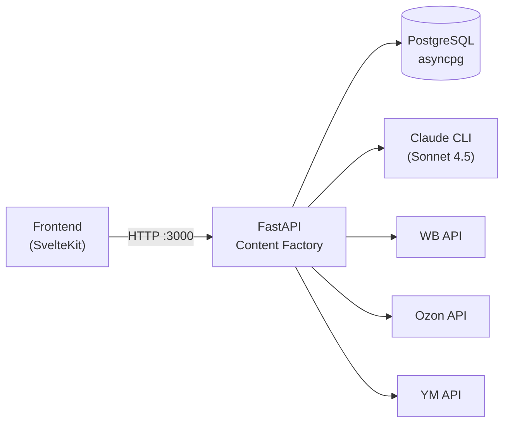
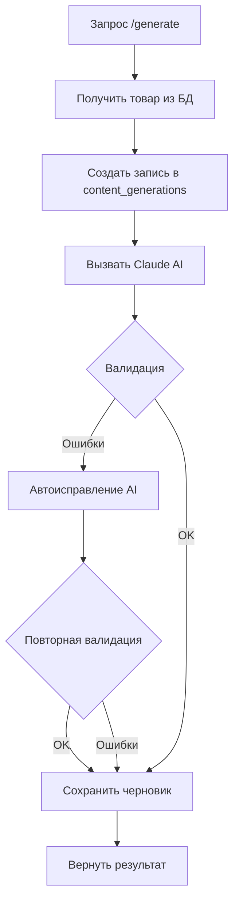
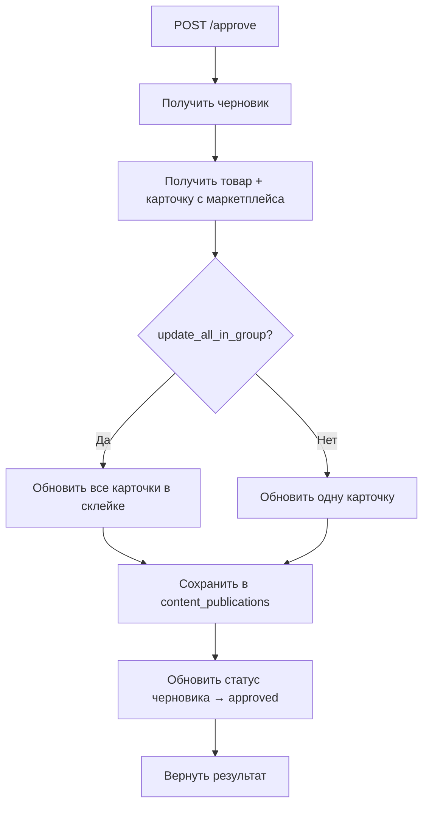
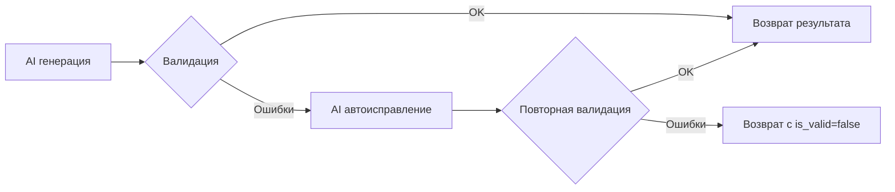

**Проект:** ADOLF — AI-Driven Operations Layer Framework
**Модуль:** Content Factory / REST API
**Версия:** 1.2
**Дата:** Февраль 2026

---

## 9.1 Обзор

Content Factory API — FastAPI-приложение для генерации SEO-контента карточек товаров маркетплейсов с помощью AI (Claude Sonnet 4.5).

| Параметр | Значение |
|----------|----------|
| Фреймворк | FastAPI (Python 3.11+) |
| Формат | JSON |
| Base URL | `http://localhost:3000` |
| Swagger UI | `/docs` |
| Аутентификация | Нет (внутренний сервис) |
| Пагинация | offset-based (`?offset=0&limit=50`) |



### Поддерживаемые маркетплейсы

| Код | Маркетплейс | Статус |
|-----|-------------|--------|
| `wb` | Wildberries | Полная поддержка |
| `ozon` | Ozon | Полная поддержка |
| `ym` | Яндекс Маркет | Полная поддержка |

### Коды ответов

| Код | Ситуация |
|:---:|----------|
| 200 | Успех |
| 400 | Ошибка валидации / некорректный запрос |
| 404 | Товар или черновик не найден |
| 500 | Внутренняя ошибка |
| 502 | Ошибка API маркетплейса |

---

## 9.2 Health & Service Info

| Метод | Путь | Описание |
|:-----:|------|----------|
| GET | `/` | Информация о сервисе |
| GET | `/health` | Health check |

#### GET /

Корневой эндпоинт с информацией о сервисе.

**Доступ:** Публичный

**Ответ:**

```json
{
  "service": "Content Factory",
  "version": "1.2.11",
  "docs": "/docs"
}
```

---

#### GET /health

Проверка работоспособности сервиса.

**Доступ:** Публичный

**Ответ:**

```json
{
  "status": "ok",
  "service": "content-factory"
}
```

---

## 9.3 Данные товара

#### GET /api/content/product

Получить данные товара из БД, включая все товары в склейке (группе), валидацию текущего контента и SEO-анализ.

**Доступ:** Senior+

**Query параметры:**

| Параметр | Тип | Обязателен | Описание |
|----------|-----|:----------:|----------|
| `url` | string | нет* | URL товара на маркетплейсе |
| `sku` | string | нет* | Артикул товара (nmID) |
| `marketplace` | string | нет | Маркетплейс (`wb`, `ozon`, `ym`). Используется только для парсинга SKU из URL |

\* Необходимо указать `url` или `sku` (хотя бы один).

> **Важно:** Маркетплейс для валидации и анализа берётся из БД (поле `marketplace` в `reputation_products`), а не из параметра запроса. Даже если указать `marketplace=wb` для товара Ozon — валидация пройдёт по лимитам Ozon.

**Пример запроса:**

```
GET /api/content/product?sku=203873004&marketplace=wb
```

**Пример ответа:**

```json
{
  "sku": "203873004",
  "marketplace": "wb",
  "title": "Носки мужские длинные хлопок",
  "description": "Носки мужские из хлопка...",
  "media_urls": [
    "https://basket-12.wbbasket.ru/vol1234/part12345/203873004/images/big/1.webp",
    "https://basket-12.wbbasket.ru/vol1234/part12345/203873004/images/big/2.webp"
  ],
  "video_url": null,
  "imt_id": 98765432,
  "group_count": 3,
  "products": [
    {
      "sku": "203873004",
      "title": "Носки мужские длинные хлопок",
      "description": "Описание...",
      "media_urls": ["..."],
      "video_url": null,
      "color": "Чёрный",
      "vendor_code": "16378"
    },
    {
      "sku": "203873005",
      "title": "Носки мужские длинные хлопок",
      "description": "Описание...",
      "media_urls": ["..."],
      "video_url": null,
      "color": "Белый",
      "vendor_code": "16379"
    }
  ],
  "validation": {
    "is_valid": false,
    "issues": [
      {
        "field": "description",
        "message": "Описание слишком короткое (минимум 1000 символов)",
        "severity": "error"
      }
    ]
  },
  "analysis": {
    "total_score": 45,
    "is_valid": false,
    "metrics": {
      "title_quality": {
        "name": "Качество заголовка",
        "score": 60,
        "max_score": 100,
        "status": "warning",
        "details": "Заголовок короткий",
        "issues": []
      },
      "description_quality": {
        "name": "Качество описания",
        "score": 30,
        "max_score": 100,
        "status": "error",
        "details": "Описание слишком короткое",
        "issues": [...]
      },
      "foreign_words": {
        "name": "Иностранные слова",
        "score": 100,
        "max_score": 100,
        "status": "good",
        "details": "Иностранных слов не найдено",
        "issues": []
      }
    }
  }
}
```

**Поля склейки:**
- `imt_id` — ID группы товаров на маркетплейсе (`null` если товар не в склейке)
- `group_count` — количество товаров в склейке (1 если без склейки)
- `products` — массив всех товаров в склейке с фото, видео и цветом

---

## 9.4 Генерация контента

### Таблица эндпоинтов

| Метод | Путь | Описание |
|:-----:|------|----------|
| POST | `/api/content/generate` | Генерация SEO-контента |
| POST | `/api/content/regenerate` | Перегенерация с заметками менеджера |

---

#### POST /api/content/generate

Генерация SEO-оптимизированного названия и описания для товара с помощью AI.

**Доступ:** Senior+

**Request body:**

```json
{
  "url": "https://www.wildberries.ru/catalog/203873004/detail.aspx",
  "sku": "203873004",
  "marketplace": "wb",
  "generate_for_group": false
}
```

| Поле | Тип | Обязателен | Описание |
|------|-----|:----------:|----------|
| `url` | string | нет* | URL товара |
| `sku` | string | нет* | Артикул (nmID) |
| `marketplace` | string | нет | `wb` / `ozon` / `ym`. По умолчанию `wb` |
| `generate_for_group` | bool | нет | Генерация для всей склейки. По умолчанию `false` |

\* Необходимо указать `url` или `sku`.

**Пример ответа:**

```json
{
  "draft_id": "a1b2c3d4-e5f6-7890-abcd-ef1234567890",
  "sku": "203873004",
  "marketplace": "wb",
  "title": "Носки мужские высокие хлопковые комплект набор для спорта и повседневной носки",
  "description": "Мужские носки из натурального хлопка обеспечивают комфорт в течение всего дня...",
  "seo_tags": ["носки мужские", "хлопок", "комплект"],
  "imt_id": 98765432,
  "group_nm_ids": [203873004, 203873005, 203873006],
  "generated_for_group": false,
  "validation": {
    "is_valid": true,
    "issues": []
  },
  "is_valid": true,
  "validation_fixes": null,
  "analysis": {
    "total_score": 95,
    "is_valid": true,
    "metrics": {
      "title_quality": { "score": 90, "status": "good", "..." : "..." },
      "description_quality": { "score": 95, "status": "good", "..." : "..." },
      "foreign_words": { "score": 100, "status": "good", "..." : "..." }
    }
  },
  "comparison": {
    "total_before": 45,
    "total_after": 95,
    "improvements": [
      { "metric": "title_quality", "before": 60, "after": 90, "diff": 30 },
      { "metric": "description_quality", "before": 30, "after": 95, "diff": 65 }
    ],
    "fixed_errors": ["Описание слишком короткое"]
  },
  "created_at": "2026-02-24T12:00:00Z"
}
```

#### SEO-теги по маркетплейсам

| Маркетплейс | Формат `seo_tags` | Куда отправляются при публикации |
|:-----------:|-------------------|:-------------------------------:|
| **WB** | Поисковые фразы, 10-15 штук<br/>`"Футболка женская"`, `"футболка хлопок"` | Поле «Комплектация» |
| **Ozon** | Хештеги через `_`, 5-10 штук<br/>`"халат_женский_ohana"`, `"халат_велюровый_ohana"` | Поле `keywords` |
| **YM** | Не генерируются | — |

> **Ozon:** SEO-теги генерируются как хештеги — слова через нижнее подчёркивание, без символа `#`, всё строчными, максимум 30 символов каждый. К каждому хештегу автоматически добавляется бренд товара. При публикации отправляются в поле `keywords` через `POST /v1/product/import-by-sku`.

**Записи в БД:**

| Таблица | Операция |
|---------|----------|
| `content_generations` | INSERT (pending) → UPDATE (processing) → UPDATE (completed) |
| `content_drafts` | INSERT (status=`draft`) |

**Флоу:**



---

#### POST /api/content/regenerate

Перегенерация контента с учётом предыдущего результата и пожеланий менеджера.

**Доступ:** Senior+

**Request body:**

```json
{
  "draft_id": "a1b2c3d4-e5f6-7890-abcd-ef1234567890",
  "manager_notes": "Сделай описание с акцентом на натуральность материала",
  "generate_for_group": false
}
```

| Поле | Тип | Обязателен | Описание |
|------|-----|:----------:|----------|
| `draft_id` | UUID | да | ID предыдущего черновика |
| `manager_notes` | string | нет | Пожелания менеджера для AI |
| `generate_for_group` | bool | нет | Генерация для склейки. По умолчанию `false` |

**Ответ:** аналогичен `/generate` (новый `draft_id`, предыдущий черновик не трогается).

**Записи в БД:**

| Таблица | Операция |
|---------|----------|
| `content_generations` | INSERT (новая запись) |
| `content_drafts` | INSERT (новый черновик) |

---

## 9.5 Утверждение и публикация

#### POST /api/content/drafts/\{draft_id\}/approve

Утвердить черновик и опубликовать финальные данные на маркетплейс.

**Доступ:** Senior+

**Path параметры:**

| Параметр | Тип | Описание |
|----------|-----|----------|
| `draft_id` | UUID | ID утверждаемого черновика |

**Request body:**

```json
{
  "title": "Носки мужские высокие хлопковые комплект набор для спорта",
  "description": "Мужские носки из натурального хлопка обеспечивают комфорт...",
  "seo_tags": ["носки мужские", "хлопок", "комплект"],
  "update_all_in_group": false,
  "source": "manual"
}
```

| Поле | Тип | Обязателен | Описание |
|------|-----|:----------:|----------|
| `title` | string | да | Финальное название (может отличаться от AI-черновика) |
| `description` | string | да | Финальное описание |
| `seo_tags` | list[string] | нет | SEO-теги (WB → «Комплектация», Ozon → `keywords`, YM → не отправляются) |
| `update_all_in_group` | bool | нет | Обновить все карточки в склейке. По умолчанию `false` |
| `source` | string | нет | Тип обработки: `manual` или `auto`. По умолчанию `manual` |

**Логика поля `source`:**

| Сценарий | Кто вызывает | `source` |
|----------|-------------|:--------:|
| Менеджер утвердил вручную | Фронт → `POST /approve` | `manual` (по умолчанию) |
| Менеджер нажал "авто" возле SKU | Фронт → `POST /approve` с `source: "auto"` | `auto` |
| Scheduler / авто-обработка | `auto_content_service` → `approve_draft()` | `auto` (передаётся в коде) |

- **`manual`** — менеджер просмотрел и/или отредактировал контент перед публикацией
- **`auto`** — контент опубликован без ручной проверки (авто-кнопка или планировщик)

**Пример ответа (успех):**

```json
{
  "success": true,
  "draft_id": "a1b2c3d4-e5f6-7890-abcd-ef1234567890",
  "message": "Карточка успешно обновлена на Wildberries",
  "updated_nm_ids": [203873004]
}
```

**Пример ответа (склейка, `update_all_in_group: true`):**

```json
{
  "success": true,
  "draft_id": "a1b2c3d4-e5f6-7890-abcd-ef1234567890",
  "message": "Обновлены 3 карточки в склейке на Wildberries",
  "updated_nm_ids": [203873004, 203873005, 203873006]
}
```

**Коды ошибок:**

| Код | Ситуация |
|:---:|----------|
| 404 | Черновик не найден |
| 502 | Ошибка API маркетплейса |

**Записи в БД:**

| Таблица | Операция |
|---------|----------|
| `content_publications` | INSERT (финальные данные менеджера) |
| `content_drafts` | UPDATE (только status → `approved`, AI-оригинал не трогаем) |

**Важно:** AI-оригинал в `content_drafts` **не изменяется** при approve. Финальные данные менеджера сохраняются отдельно в `content_publications`.

**Флоу:**



---

## 9.6 История публикаций

#### GET /api/content/approvals/history

История всех публикаций контента с фильтрацией по источнику (авто/ручной).

> Показываются только записи начиная с 26.02.2026.

**Доступ:** Senior+

**Query параметры:**

| Параметр | Тип | По умолчанию | Описание |
|----------|-----|:------------:|----------|
| `marketplace` | string | — | Фильтр: `wb`, `ozon`, `ym` |
| `source` | string | — | Фильтр: `auto` (авто-обработка) или `manual` (ручная) |
| `status` | string | — | Фильтр: `success` или `failed` |
| `limit` | int | 50 | Записей на страницу (макс. 500) |
| `offset` | int | 0 | Смещение для пагинации |

**Пример запроса:**

```
GET /api/content/approvals/history?marketplace=wb&source=manual&limit=20&offset=0
```

**Пример ответа:**

```json
{
  "total": 142,
  "limit": 20,
  "offset": 0,
  "has_more": true,
  "items": [
    {
      "id": "f1e2d3c4-b5a6-7890-1234-567890abcdef",
      "sku": "203873004",
      "marketplace": "wb",
      "title": "Носки мужские высокие хлопковые комплект",
      "description": "Мужские носки из натурального хлопка...",
      "current_score": 95,
      "status": "success",
      "source": "manual",
      "published_at": "2026-02-24T12:30:00Z"
    },
    {
      "id": "a9b8c7d6-e5f4-3210-fedc-ba0987654321",
      "sku": "198765432",
      "marketplace": "wb",
      "title": "Футболка женская оверсайз хлопок",
      "description": "Стильная женская футболка свободного кроя...",
      "current_score": 88,
      "status": "success",
      "source": "auto",
      "published_at": "2026-02-24T10:15:00Z"
    }
  ]
}
```

**Поля элемента:**

| Поле | Тип | Описание |
|------|-----|----------|
| `id` | UUID | ID записи публикации |
| `sku` | string | Артикул товара (nmID) |
| `marketplace` | string | Маркетплейс |
| `title` | string | Опубликованное название |
| `description` | string | Опубликованное описание |
| `current_score` | int | Скор качества контента (0–100) |
| `status` | string | `success` или `failed` |
| `source` | string | `auto` (авто-обработка) или `manual` (ручная генерация) |
| `published_at` | datetime \| null | Дата публикации |

---

## 9.7 Ошибки модерации маркетплейса

#### GET /api/content/\{marketplace\}/errors

Получить список карточек с ошибками модерации на маркетплейсе.

**Доступ:** Senior+

**Path параметры:**

| Параметр | Тип | Описание |
|----------|-----|----------|
| `marketplace` | string | `wb`, `ozon` или `ym` |

**Query параметры:**

| Параметр | Тип | Обязателен | Описание |
|----------|-----|:----------:|----------|
| `sku` | string | нет | Фильтр по конкретному SKU |

**Пример запроса:**

```
GET /api/content/wb/errors?sku=203873004
```

**Пример ответа:**

```json
{
  "sku": 203873004,
  "errors_count": 1,
  "errors": [
    {
      "nmID": 203873004,
      "vendorCode": "16378",
      "error": "Заголовок содержит запрещённое слово",
      "batchUUID": null,
      "updatedAt": "2026-02-24T08:00:00Z"
    }
  ],
  "has_errors": true
}
```

**Пример ответа (без фильтра, все ошибки):**

```
GET /api/content/wb/errors
```

```json
{
  "sku": null,
  "errors_count": 5,
  "errors": [
    { "nmID": 203873004, "vendorCode": "16378", "error": "...", "..." : "..." },
    { "nmID": 198765432, "vendorCode": "22451", "error": "...", "..." : "..." }
  ],
  "has_errors": true
}
```

---

## 9.8 Настройки

### Таблица эндпоинтов

| Метод | Путь | Описание |
|:-----:|------|----------|
| GET | `/api/settings` | Получить все настройки |
| PUT | `/api/settings` | Обновить настройки (partial update) |

---

#### GET /api/settings

Получить текущие настройки приложения.

**Доступ:** Senior+

**Пример ответа:**

```json
{
  "auto_check_threshold": 98,
  "auto_check_interval": "weekly",
  "auto_check_enabled": true,
  "tag_scheduler_enabled": true,
  "wb_token": "eyJh***",
  "ozon_client_id": "1234***",
  "ozon_api_key": "abcd***",
  "ym_api_key": "ACMA***",
  "ym_business_id": "12345678",
  "tokens_status": {
    "wb": {
      "marketplace": "wb",
      "status": "expiring_soon",
      "configured": true,
      "expires_at": "2026-03-25T14:30:00+00:00",
      "days_remaining": 27,
      "message": "WB токен истекает через 27 дней",
      "checked_at": "2026-02-27T12:00:00+00:00"
    },
    "ozon": {
      "marketplace": "ozon",
      "status": "active",
      "configured": true,
      "expires_at": null,
      "days_remaining": null,
      "message": "Ozon токен активен (бессрочный)",
      "checked_at": "2026-02-27T12:00:00+00:00"
    },
    "ym": {
      "marketplace": "ym",
      "status": "not_configured",
      "configured": false,
      "expires_at": null,
      "days_remaining": null,
      "message": "Яндекс Маркет credentials не настроены",
      "checked_at": "2026-02-27T12:00:00+00:00"
    },
    "checked_at": "2026-02-27T12:00:00+00:00",
    "has_warnings": true
  }
}
```

**Примечание:** Токены и ключи возвращаются замаскированными (первые 4 символа + `***`).

#### Мониторинг токенов (`tokens_status`)

Поле `tokens_status` заполняется фоновым планировщиком, который проверяет токены каждые **12 часов**. Первая проверка — через ~10 секунд после старта приложения. Если приложение только запустилось и проверка ещё не прошла, поле = `null`.

**Как проверяется каждый маркетплейс:**

| Маркетплейс | Метод проверки | Срок действия токена |
|:-----------:|----------------|:-------------------:|
| WB | Декодирование JWT (`exp` claim из payload) | 180 дней от создания |
| Ozon | Тестовый API-вызов (`POST /v3/product/list`, limit=1) | Бессрочный |
| YM | Тестовый API-вызов (`POST /businesses/{id}/offer-mappings`, limit=1) | Бессрочный |

**Возможные статусы:**

| Статус | Описание |
|:------:|----------|
| `active` | Токен валиден и работает |
| `expiring_soon` | Только WB: осталось менее 30 дней |
| `critical` | Только WB: осталось менее 7 дней |
| `expired` | Только WB: JWT `exp` в прошлом |
| `invalid` | Токен есть, но API вернул 401/403 |
| `error` | Токен есть, но API-вызов упал (сеть/таймаут) |
| `not_configured` | Токен пустой или не задан |

**Поля для WB:**
- `expires_at` — дата истечения (ISO 8601)
- `days_remaining` — количество дней до истечения

**Поля для Ozon/YM:**
- `expires_at` = `null` (бессрочные токены)
- `days_remaining` = `null`

**Логирование предупреждений:**
Планировщик автоматически логирует:
- `ERROR` — для `expired`, `critical`, `invalid`
- `WARNING` — для `expiring_soon`

---

#### PUT /api/settings

Обновить настройки (partial update — передавать только изменяемые поля).

**Доступ:** Director+

**Request body (пример):**

```json
{
  "auto_check_threshold": 95,
  "auto_check_interval": "daily",
  "auto_check_enabled": true
}
```

| Поле | Тип | Описание |
|------|-----|----------|
| `auto_check_threshold` | int | Порог скора для авто-проверки (0–100) |
| `auto_check_interval` | string | Частота: `daily`, `every_2_days`, `weekly`, `every_2_weeks`, `monthly` |
| `auto_check_enabled` | bool | Включить/выключить авто-проверку |
| `tag_scheduler_enabled` | bool | Включить/выключить планировщик тегов |
| `wb_token` | string | WB API токен (полное значение, маскированные игнорируются) |
| `ozon_client_id` | string | Ozon Client ID |
| `ozon_api_key` | string | Ozon API Key |
| `ym_api_key` | string | Яндекс Маркет API Key |
| `ym_business_id` | string | Яндекс Маркет Business ID |

**Ответ:** обновлённые настройки (формат как в GET).

**Коды ошибок:**

| Код | Ситуация |
|:---:|----------|
| 400 | Недопустимое значение `auto_check_interval` или не переданы поля |

---

## 9.9 Авто-обработка контента

#### GET /api/auto-process/content/preview

Превью кандидатов на автоматическую генерацию (dry-run). Показывает товары с низким скором качества контента.

**Доступ:** Senior+

**Query параметры:**

| Параметр | Тип | По умолчанию | Описание |
|----------|-----|:------------:|----------|
| `marketplace` | string | — | Фильтр: `wb`, `ozon`, `ym`. Без параметра — все |
| `limit` | int | 50 | Записей на страницу (макс. 500) |
| `offset` | int | 0 | Смещение для пагинации |

**Пример ответа:**

```json
{
  "total": 28,
  "limit": 50,
  "offset": 0,
  "has_more": false,
  "items": [
    {
      "sku": "203873004",
      "marketplace": "wb",
      "title": "Носки мужские",
      "description": "Короткое описание...",
      "total_score": 35
    },
    {
      "sku": "198765432",
      "marketplace": "wb",
      "title": "Футболка",
      "description": "Описание товара...",
      "total_score": 52
    }
  ]
}
```

Товары отсортированы по `total_score` (от худшего к лучшему). Показываются только товары с `total_score < threshold` (настройка `auto_check_threshold`).

---

## 9.10 Валидация контента

Валидация применяется автоматически при генерации и при получении данных товара.

### Лимиты по маркетплейсам

| Маркетплейс | Title max | Description min | Description max |
|:-----------:|:---------:|:---------------:|:---------------:|
| wb | 60 | 900 | 2000 |
| ozon | 200 | 100 | 6000 |
| ym | 256 | 500 | 6000 |

### Проверки Title

| Проверка | Severity |
|----------|:--------:|
| Длина > макс. лимита | error |
| Длина < 10 символов | warning |
| Запрещённые слова | error |
| Спецсимволы (`/`, `!`, `#`, `&`, `*`, `@`, `\|`, `\`) | error |

### Проверки Description

| Проверка | Severity |
|----------|:--------:|
| Длина > макс. лимита | error |
| Длина < мин. лимита | warning |
| Запрещённые слова | error |
| Домены (`.ru`, `.com`, `.net`, `.io`, `.org`, `.рф`) | error |
| URL (`http://`, `https://`, `www.`) | error |
| Email (паттерн `xxx@xxx.xx`) | error |
| Телефоны (`+7...`, `8-xxx-xxx-xx-xx`) | error |
| Telegram (`t.me/`, `@username`) | error |
| HTML-теги (`<b>`, `<br>`, любые `<...>`) | error |
| Переспам (слово > 4% текста) | warning |

### Запрещённые слова

Слова, отклоняемые модерацией маркетплейсов:

- **Превосходные степени:** лучший, самый, идеальный, единственный, наивысочайший
- **Гарантии:** гарантированно, 100%, абсолютно, навсегда, вечный
- **Рейтинги:** номер 1, #1, №1
- **Маркетинговые:** топ, хит продаж, бестселлер, распродажа, акция, скидка, модный, трендовый, эксклюзивный, премиум, люкс

**Разрешённые альтернативы:** качественный, отличный, превосходный, надёжный, практичный, удобный.

### Автоисправление

При генерации, если AI создал текст с ошибками валидации, система вызывает AI повторно (до 1 раза):



### Формат результата валидации

```json
{
  "is_valid": false,
  "issues": [
    {
      "field": "title",
      "message": "Название содержит запрещённое слово: 'лучший'",
      "severity": "error"
    },
    {
      "field": "description",
      "message": "Описание слишком короткое (минимум 1000 символов)",
      "severity": "warning"
    }
  ]
}
```

- `is_valid: true` — нет ошибок (severity=error), могут быть warnings
- `is_valid: false` — есть хотя бы одна ошибка

---

## 9.11 Модели данных

### GenerateResponse

| Поле | Тип | Описание |
|------|-----|----------|
| `draft_id` | UUID | ID черновика |
| `sku` | string | Артикул товара |
| `marketplace` | string | `wb` / `ozon` / `ym` |
| `title` | string | Сгенерированное название |
| `description` | string | Сгенерированное описание |
| `seo_tags` | list[string] | SEO-теги (WB — поисковые фразы, Ozon — хештеги, YM — пусто) |
| `imt_id` | int \| null | ID склейки |
| `group_nm_ids` | list[int] | Все nmID в склейке |
| `generated_for_group` | bool | Генерация для всей склейки |
| `validation` | ValidationResult | Результат валидации |
| `is_valid` | bool | Прошёл ли валидацию |
| `validation_fixes` | ValidationFix \| null | Автоисправления |
| `analysis` | ContentAnalysis | SEO-анализ (3 метрики) |
| `comparison` | AnalysisComparison \| null | Сравнение до/после |
| `created_at` | datetime | Время создания |

### ContentAnalysis

| Поле | Тип | Описание |
|------|-----|----------|
| `total_score` | int | Общий скор (0–100) |
| `is_valid` | bool | Нет ошибок уровня error |
| `metrics` | dict | 3 метрики: `title_quality`, `description_quality`, `foreign_words` |

### MetricScore

| Поле | Тип | Описание |
|------|-----|----------|
| `name` | string | Название метрики |
| `score` | int | Скор (0–100) |
| `max_score` | int | Максимум (100) |
| `status` | string | `good` / `warning` / `error` |
| `details` | string | Описание |
| `issues` | list | Связанные ошибки валидации |
