# ADOLF CORE v4.0 — Введение

**Для кого этот документ:** Junior-разработчики, новые участники команды  
**Цель:** Понять как устроена система и как её компоненты работают вместе  
**Время на изучение:** 30-40 минут

---

## 1. Что такое ADOLF?

### 1.1 Простыми словами

**ADOLF** — это корпоративный AI-ассистент для e-commerce компании. Представь, что у тебя есть умный помощник, который:

- Отвечает на вопросы сотрудников по внутренним документам компании
- Помогает обрабатывать отзывы покупателей на маркетплейсах
- Следит за ценами конкурентов
- Генерирует описания товаров
- Формирует финансовые отчёты

Всё это — через простой чат-интерфейс, похожий на ChatGPT.

### 1.2 Что такое ADOLF CORE?

**ADOLF CORE** — это «ядро» системы. Это фундамент, на котором работают все остальные модули.

```
┌─────────────────────────────────────────────────────────────┐
│                      ADOLF (вся система)                     │
├─────────────────────────────────────────────────────────────┤
│                                                              │
│   ┌─────────────────────────────────────────────────────┐   │
│   │                   ADOLF CORE                         │   │
│   │         (ядро — фундамент системы)                   │   │
│   └─────────────────────────────────────────────────────┘   │
│                            │                                 │
│         ┌──────────────────┼──────────────────┐             │
│         │                  │                  │             │
│         ▼                  ▼                  ▼             │
│   ┌──────────┐      ┌──────────┐      ┌──────────┐         │
│   │Reputation│      │  Watcher │      │   CFO    │   ...   │
│   │(отзывы)  │      │  (цены)  │      │(финансы) │         │
│   └──────────┘      └──────────┘      └──────────┘         │
│                                                              │
│              Функциональные модули                           │
│       (работают поверх Core, используют его API)            │
│                                                              │
└─────────────────────────────────────────────────────────────┘
```

**Аналогия:** CORE — это как фундамент и коммуникации дома (электричество, водопровод, интернет). Функциональные модули — это комнаты (кухня, спальня, ванная). Комнаты не могут работать без фундамента и коммуникаций.

### 1.3 Что входит в CORE?

| Компонент | Для чего нужен | Аналогия из жизни |
|-----------|----------------|-------------------|
| **Open WebUI** | Интерфейс (чат) | Телефон, через который ты общаешься |
| **Middleware** | Логика и безопасность | Секретарь, который решает кому можно звонить |
| **ETL** | Обработка документов | Сканер + архивариус |
| **PostgreSQL** | Хранение данных | Картотека с информацией |
| **Redis** | Очередь задач | Список дел на стикерах |
| **Nginx** | Точка входа | Охранник на входе в здание |

---

## 2. Как всё устроено (архитектура)

### 2.1 Общая схема

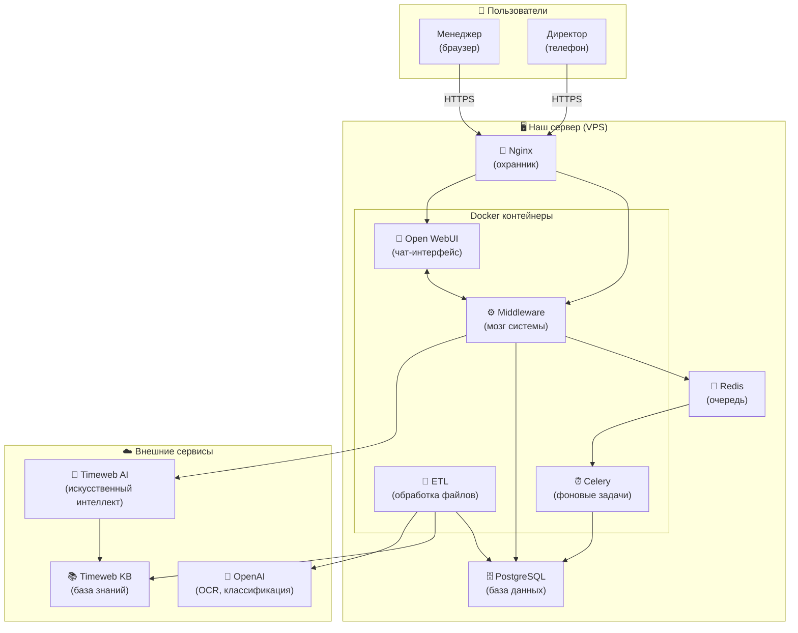

### 2.2 Что делает каждый компонент

#### 🚪 Nginx — «Охранник»

**Что это:** Веб-сервер, который принимает все входящие запросы.

**Зачем нужен:**
- Шифрует соединение (HTTPS) — чтобы никто не подслушал
- Решает куда направить запрос — в чат или в API
- Защищает от атак — блокирует подозрительные запросы

**Пример работы:**
```
Пользователь открывает https://adolf.su
    │
    ▼
Nginx принимает запрос
    │
    ├─► Запрос на /          → отправить в Open WebUI (чат)
    ├─► Запрос на /api/v1/   → отправить в Middleware (API)
    └─► Запрос на /ws/       → отправить в WebSocket (уведомления)
```

#### 💬 Open WebUI — «Чат-интерфейс»

**Что это:** Веб-приложение для общения с AI. Похоже на ChatGPT.

**Зачем нужен:**
- Показывает красивый чат
- Позволяет загружать файлы
- Показывает уведомления
- Работает на телефоне (PWA)

**Что умеет пользователь:**
- Писать сообщения AI
- Загружать документы
- Видеть историю переписки
- Получать уведомления

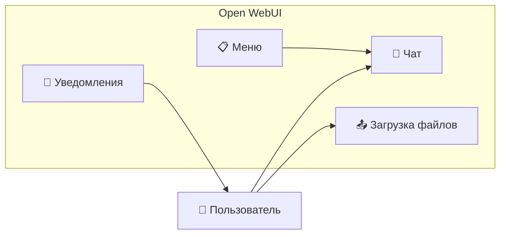

#### ⚙️ Middleware — «Мозг системы»

**Что это:** Серверное приложение на Python (FastAPI), которое управляет всей логикой.

**Зачем нужен:**

1. **Авторизация** — проверяет кто ты такой
2. **Права доступа** — решает что тебе можно видеть
3. **Роутинг** — направляет запросы куда нужно
4. **Фильтрация** — скрывает чужие данные
5. **Логирование** — записывает кто что делал

**Как работает (пример):**

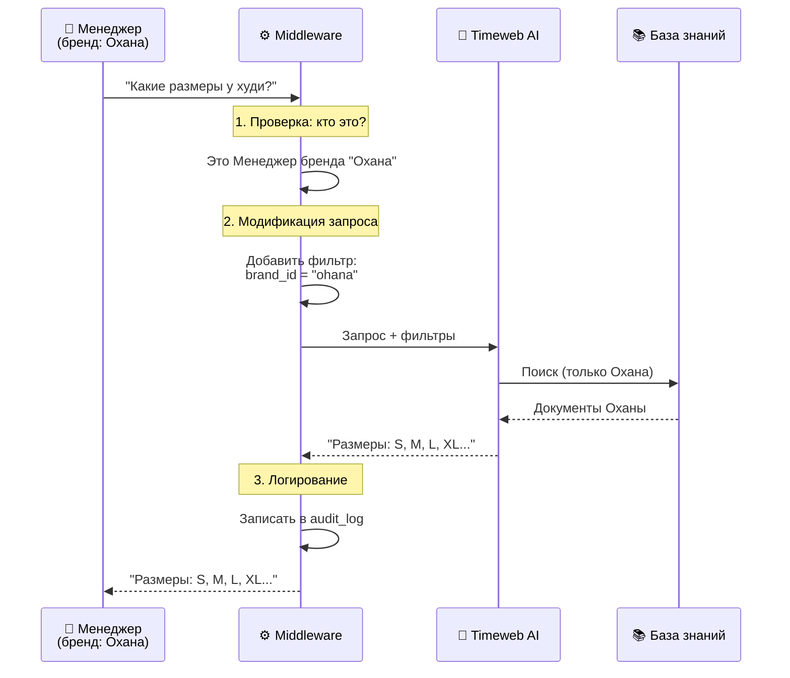

**Важно понять:** Middleware НЕ хранит данные пользователей надолго. Он только обрабатывает запросы и передаёт их дальше.

#### 📄 ETL — «Обработчик документов»

**Что это:** Фоновый процесс, который превращает загруженные файлы в текст для AI.

**ETL расшифровывается как:**
- **E**xtract (извлечь) — достать текст из файла
- **T**ransform (преобразовать) — привести к единому формату
- **L**oad (загрузить) — отправить в базу знаний

**Зачем нужен:**

AI не умеет читать PDF или Excel напрямую. Ему нужен чистый текст. ETL делает эту работу.

**Как работает:**

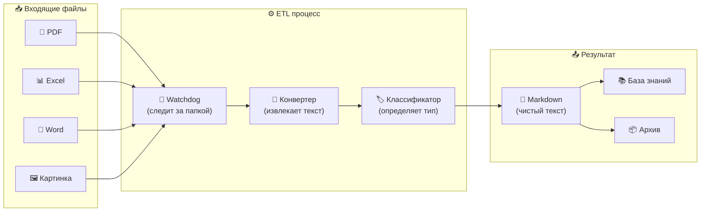

**Пример преобразования:**

```
БЫЛО (Excel-файл):                      СТАЛО (Markdown):
┌─────────┬────────┬───────┐           ---
│ Размер  │ Грудь  │ Длина │           title: Размерная сетка худи
├─────────┼────────┼───────┤           category: product
│ S       │ 100    │ 65    │           brand_id: ohana_market
│ M       │ 106    │ 68    │           ---
│ L       │ 112    │ 71    │           
└─────────┴────────┴───────┘           # Размерная сетка худи
                                       
                                       | Размер | Грудь | Длина |
                                       |--------|-------|-------|
                                       | S      | 100   | 65    |
                                       | M      | 106   | 68    |
                                       | L      | 112   | 71    |
```

#### 🗄️ PostgreSQL — «База данных»

**Что это:** Реляционная база данных. Место, где хранится вся информация.

**Что хранится:**
- Пользователи и их роли
- Метаданные документов
- История действий (аудит)
- Уведомления
- Настройки системы

**Важно:** PostgreSQL хранит МЕТАДАННЫЕ (информацию о документах), а не сами документы. Документы хранятся в Timeweb KB.

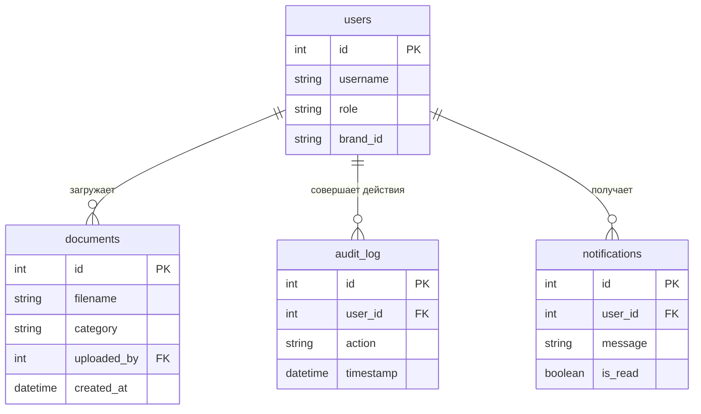

#### 📮 Redis — «Очередь задач»

**Что это:** Быстрое хранилище в памяти. Используется как «доска со стикерами» для задач.

**Зачем нужен:**

Некоторые задачи нельзя выполнить мгновенно:
- Отправить email — занимает 2-3 секунды
- Обработать большой файл — занимает минуту
- Проверить здоровье сервисов — нужно делать регулярно

Если ждать выполнения, пользователь будет видеть «загрузку». Поэтому мы кладём задачу в очередь и сразу отвечаем пользователю.

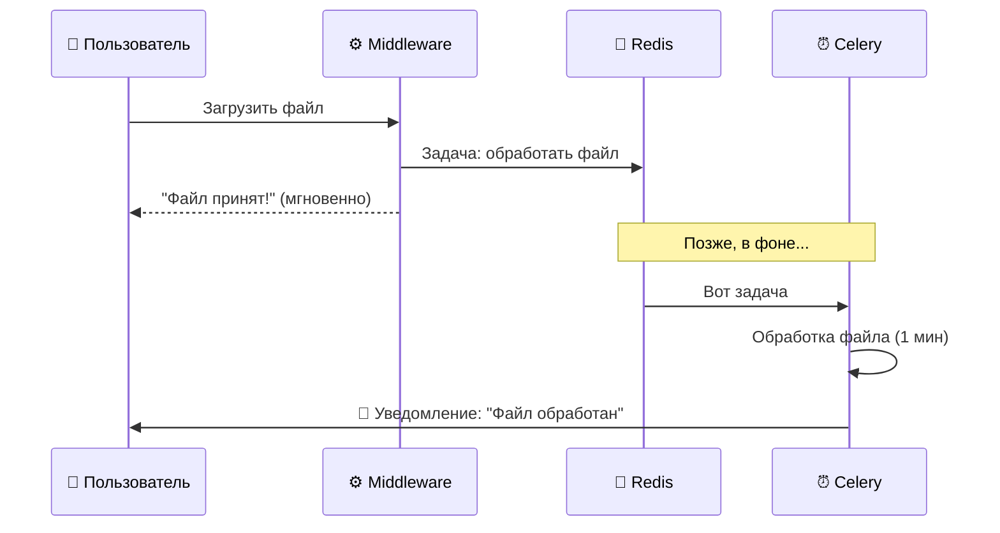

#### ⏰ Celery — «Работник на заднем плане»

**Что это:** Система для выполнения фоновых задач.

**Какие задачи выполняет:**
- Отправка уведомлений
- Очистка старых данных
- Проверка здоровья сервисов
- Периодические отчёты

**Пример задач:**

| Задача | Когда выполняется | Что делает |
|--------|-------------------|------------|
| `send_notification` | Когда появился новый отзыв | Отправляет popup менеджеру |
| `cleanup_old_data` | Каждую ночь в 3:00 | Удаляет старые логи |
| `health_check` | Каждые 5 минут | Проверяет что всё работает |

---

## 3. Как компоненты общаются между собой

### 3.1 Протоколы общения

**Протокол** — это «язык», на котором компоненты разговаривают друг с другом.

| Откуда → Куда | Протокол | Пример |
|---------------|----------|--------|
| Браузер → Nginx | HTTPS | `GET https://adolf.su/` |
| Nginx → Open WebUI | HTTP | `GET http://open-webui:8080/` |
| Open WebUI → Middleware | HTTP | `POST http://middleware:8000/v1/chat` |
| Middleware → Timeweb AI | HTTPS | `POST https://api.timeweb.cloud/v1/...` |
| Middleware → PostgreSQL | TCP | `SELECT * FROM users` |
| Middleware → Redis | TCP | `PUBLISH notifications {...}` |
| Redis → Celery | TCP | Передача задачи |

### 3.2 Синхронные vs Асинхронные запросы

**Синхронный запрос** — ты ждёшь ответа прямо сейчас.
```
Ты: "Привет, какие размеры есть?"
[ждёшь 2 секунды]
AI: "Размеры: S, M, L, XL"
```

**Асинхронный запрос** — ты не ждёшь, ответ придёт потом.
```
Ты: "Загрузи этот файл"
Система: "Принято!" (мгновенно)
[через 1 минуту]
🔔 Уведомление: "Файл обработан"
```

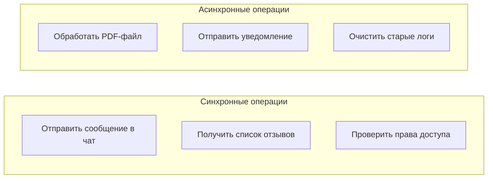

### 3.3 Пример полного пути запроса

Разберём что происходит, когда менеджер спрашивает: **«Какие отзывы пришли сегодня?»**

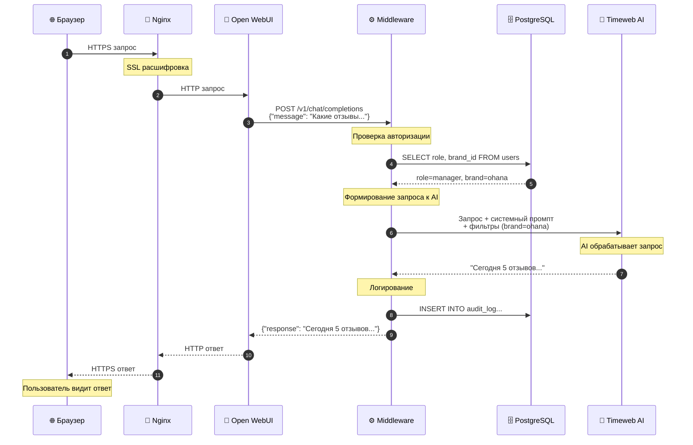

**Пошаговое объяснение:**

1. **Браузер → Nginx:** Пользователь нажал Enter, браузер отправил зашифрованный запрос
2. **Nginx:** Расшифровал HTTPS, понял что это запрос к чату, отправил в Open WebUI
3. **Open WebUI → Middleware:** Переслал сообщение пользователя в API
4. **Middleware → PostgreSQL:** «Кто это? Что ему можно?» — запрос информации о пользователе
5. **Middleware:** Получил ответ — это менеджер бренда «Охана»
6. **Middleware → Timeweb AI:** Отправил запрос с фильтрами (только данные Оханы)
7. **Timeweb AI:** Обработал запрос, нашёл информацию
8. **Middleware → PostgreSQL:** Записал в лог — «пользователь X спросил про отзывы»
9. **Обратный путь:** Ответ идёт назад по цепочке

---

## 4. Роли и права доступа

### 4.1 Иерархия ролей

В системе 5 ролей. Каждая следующая роль имеет ВСЕ права предыдущей + дополнительные.

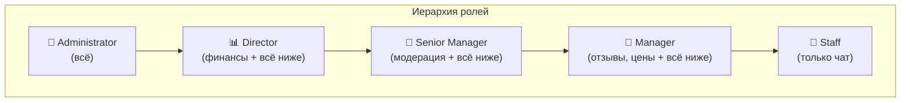

### 4.2 Что может каждая роль

| Действие | Staff | Manager | Senior | Director | Admin |
|----------|-------|---------|--------|----------|-------|
| Чат с AI | ✅ | ✅ | ✅ | ✅ | ✅ |
| Загрузить документ | ❌ | ✅ | ✅ | ✅ | ✅ |
| Работа с отзывами | ❌ | ✅ | ✅ | ✅ | ✅ |
| Мониторинг цен | ❌ | ✅ | ✅ | ✅ | ✅ |
| Модерация документов | ❌ | ❌ | ✅ | ✅ | ✅ |
| Финансовые отчёты | ❌ | ❌ | ❌ | ✅ | ✅ |
| Настройки системы | ❌ | ❌ | ❌ | ❌ | ✅ |

### 4.3 Фильтрация по брендам

Компания управляет несколькими брендами на маркетплейсах. Каждый менеджер видит только «свои» данные.

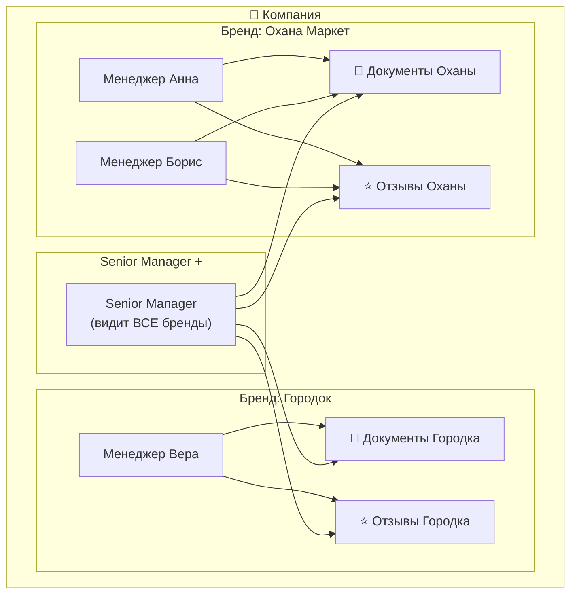

**Как это работает технически:**

```python
# Middleware добавляет фильтр в запрос к AI

def add_brand_filter(user, request):
    if user.role == "manager":
        # Менеджер видит только свой бренд
        request.filters["brand_id"] = user.brand_id
    elif user.role in ("senior_manager", "director", "administrator"):
        # Старшие роли видят всё
        request.filters["brand_id"] = None  # без фильтра
    
    return request
```

---

## 5. Обработка документов (ETL)

### 5.1 Путь документа

Когда менеджер загружает файл, он проходит несколько этапов:

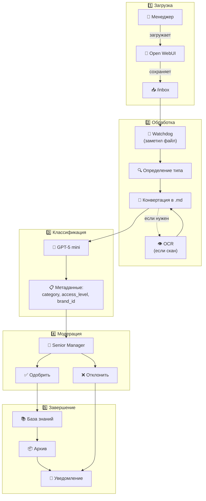

### 5.2 Автоклассификация

AI автоматически определяет:

| Параметр | Что означает | Примеры значений |
|----------|--------------|------------------|
| `category` | Тип документа | product, instruction, legal, finance |
| `access_level` | Кто может видеть | staff, manager, senior_manager, director |
| `brand_id` | Какой бренд | ohana_market, gorodok, all |

**Пример промпта для классификации:**

```
Проанализируй документ и определи:
1. Категорию (product/instruction/legal/finance/other)
2. Уровень доступа (staff/manager/senior_manager/director)
3. Бренд (ohana_market/gorodok/all)

Документ:
---
Размерная сетка для худи оверсайз
Бренд: Охана Маркет
Артикул: 12345
...
---

Ответь в формате JSON:
{"category": "...", "access_level": "...", "brand_id": "..."}
```

### 5.3 Модерация

Документ не попадает в базу знаний сразу. Сначала его должен одобрить Senior Manager.

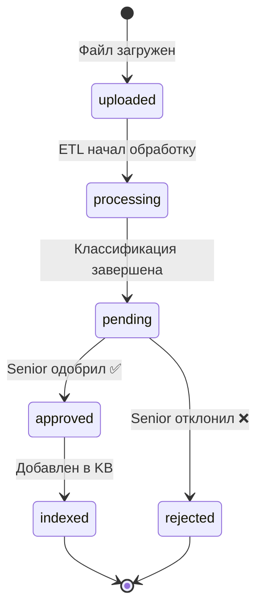

**Зачем нужна модерация:**
- Проверить что AI правильно классифицировал
- Убедиться что документ не содержит ошибок
- Защитить базу знаний от мусора

---

## 6. Система уведомлений

### 6.1 Как работают уведомления

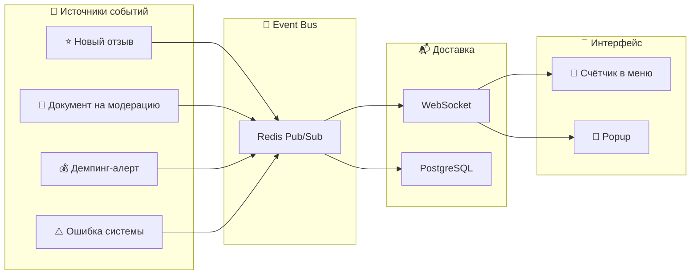

### 6.2 Типы уведомлений

| Уровень | Иконка | Как показывается | Пример |
|---------|--------|------------------|--------|
| `info` | ℹ️ | Только счётчик | Новый отзыв 5⭐ |
| `warning` | ⚠️ | Счётчик + popup | Негативный отзыв 2⭐ |
| `critical` | 🔴 | Popup + звук | Сервис недоступен |

### 6.3 Кто получает уведомления

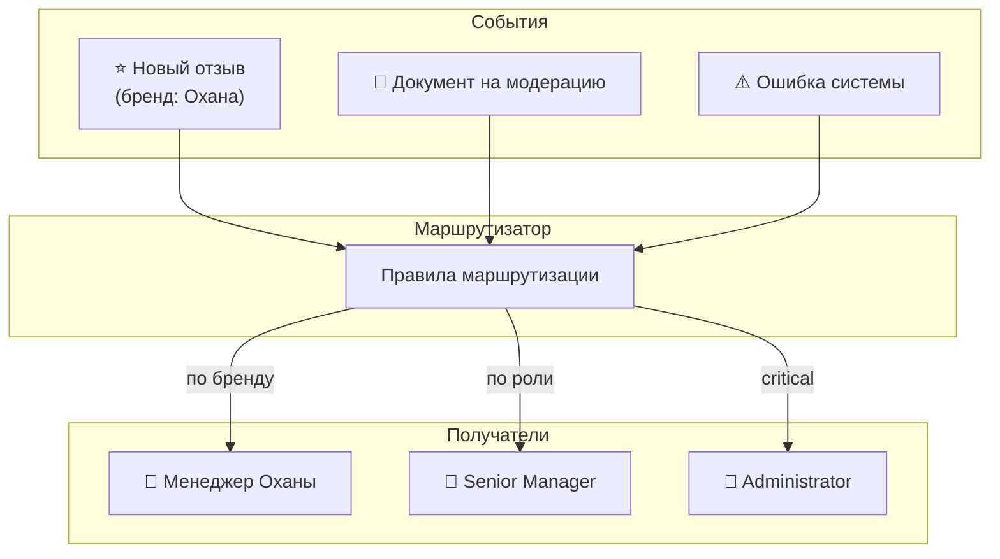

---

## 7. Безопасность

### 7.1 Слои защиты

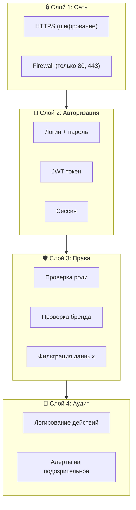

### 7.2 Что логируется

Каждое действие записывается в `audit_log`:

| Поле | Пример | Зачем |
|------|--------|-------|
| `user_id` | 42 | Кто сделал |
| `action` | `document.upload` | Что сделал |
| `resource` | `document:123` | С чем сделал |
| `ip_address` | `192.168.1.100` | Откуда сделал |
| `timestamp` | `2026-01-15 14:30:00` | Когда сделал |
| `details` | `{"filename": "sizes.xlsx"}` | Детали |

---

## 8. Что важно помнить

### 8.1 Ключевые принципы

1. **Разделение ответственности**
   - Каждый компонент делает что-то одно
   - Nginx — принимает запросы
   - Middleware — бизнес-логика
   - ETL — обработка файлов
   - И так далее

2. **Stateless (без состояния)**
   - Middleware не хранит данные между запросами
   - Всё состояние — в PostgreSQL и Redis
   - Можно запустить несколько копий Middleware

3. **Асинхронность для тяжёлых задач**
   - Всё что дольше 1 секунды — в Celery
   - Пользователь не должен ждать

4. **Безопасность по умолчанию**
   - Всё запрещено, пока явно не разрешено
   - Каждый запрос проверяется
   - Все действия логируются

### 8.2 Частые вопросы новичков

**Q: Почему Open WebUI, а не свой интерфейс?**
A: Open WebUI — готовое решение. Писать свой чат с нуля — 2-3 месяца. Open WebUI — 2 недели на настройку.

**Q: Почему Timeweb AI, а не OpenAI напрямую?**
A: Timeweb AI включает базу знаний (KB) с векторным поиском. Не нужно писать RAG самим.

**Q: Зачем Redis, если есть PostgreSQL?**
A: PostgreSQL — для долгого хранения. Redis — для быстрых операций (очереди, кеш). PostgreSQL медленнее для таких задач.

**Q: Почему Celery, а не просто потоки в Python?**
A: Celery умеет:
   - Распределять задачи между серверами
   - Повторять упавшие задачи
   - Планировать задачи по расписанию
   - Мониторить что происходит

**Q: Что будет если упадёт один компонент?**
A: Docker Compose автоматически перезапустит его (`restart: unless-stopped`).

### 8.3 Словарь терминов

| Термин | Объяснение |
|--------|------------|
| **API** | Способ для программ общаться друг с другом |
| **JWT** | Токен (строка), подтверждающий что ты авторизован |
| **Middleware** | Программа-посредник между двумя другими |
| **ETL** | Extract-Transform-Load — процесс обработки данных |
| **RAG** | Retrieval-Augmented Generation — AI + поиск по документам |
| **WebSocket** | Постоянное соединение для мгновенных уведомлений |
| **Pub/Sub** | Паттерн: один публикует сообщение, многие получают |
| **Docker** | Инструмент для запуска приложений в контейнерах |
| **ORM** | Библиотека для работы с БД через Python-объекты |

---

## 9. Следующие шаги

После прочтения этого документа рекомендуется:

1. **Изучить конкретные разделы:**
   - [Раздел 2.1: Архитектура](adolf_core_2_1_architecture.md) — детали серверной части
   - [Раздел 2.2: Middleware](adolf_core_2_2_middleware.md) — как работает API
   - [Раздел 2.3: ETL](adolf_core_2_3_etl.md) — обработка документов

2. **Посмотреть код:**
   - Начать с `middleware/main.py` — точка входа
   - Изучить `middleware/api/` — эндпоинты API
   - Посмотреть `middleware/services/` — бизнес-логика

3. **Поднять локально:**
   - Склонировать репозиторий
   - Запустить `docker compose up`
   - Попробовать отправить запрос

---

**Документ подготовлен:** Январь 2026  
**Версия:** 4.0  
**Для:** Junior-разработчики, новые участники команды
