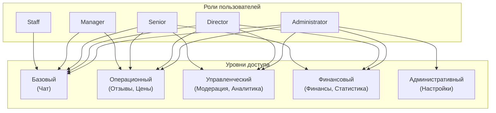
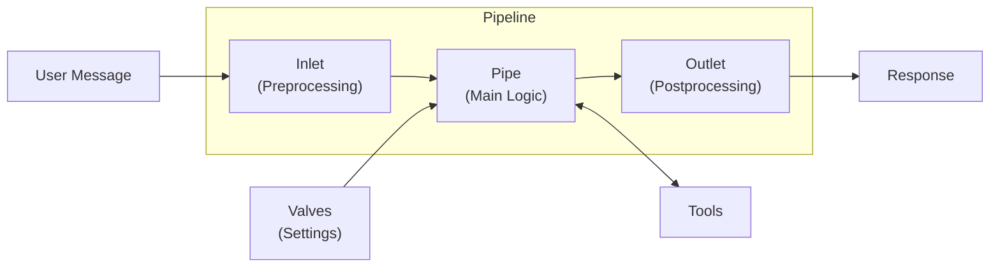
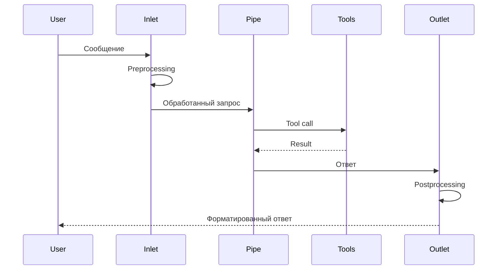

**Проект:** Ядро корпоративной AI-системы  
**Модуль:** User Interface  
**Версия:** 4.1  
**Дата:** Январь 2026

---

## 4. Структура интерфейса

### 4.1. Пункты меню

| Пункт меню | Иконка | Описание |
|------------|--------|----------|
| Чат | 💬 | Основной чат с AI-ассистентом |
| Добавить в KB | 📤 | Загрузка документов в базу знаний |
| Модерация KB | 📋 | Проверка загруженных документов |
| Отзывы | ⭐ | Работа с отзывами покупателей |
| Мониторинг цен | 🔍 | Отслеживание цен конкурентов |
| Аналитика | 📊 | Отчёты и статистика |
| Финансы | 💰 | Финансовые показатели |
| Статистика | 📈 | Статистика системы |
| Настройки | ⚙️ | Системные настройки |

**(N)** — счётчик непрочитанных уведомлений отображается у пунктов Модерация KB и Отзывы.

### 4.2. Матрица доступа по ролям

| Пункт меню | Staff | Manager | Senior | Director | Admin |
|------------|:-----:|:-------:|:------:|:--------:|:-----:|
| Чат | ✅ | ✅ | ✅ | ✅ | ✅ |
| Добавить в KB | ❌ | ✅ | ✅ | ✅ | ✅ |
| Модерация KB | ❌ | ❌ | ✅ | ✅ | ✅ |
| Отзывы | ❌ | ✅ | ✅ | ✅ | ✅ |
| Мониторинг цен | ❌ | ✅ | ✅ | ✅ | ✅ |
| Аналитика | ❌ | Базовая | Расширенная | Полная | ✅ |
| Финансы | ❌ | ❌ | Базовая | Полная | ✅ |
| Статистика | ❌ | ❌ | Базовая | Расширенная | Полная |
| Настройки | ❌ | ❌ | ❌ | ❌ | ✅ |

### 4.3. Схема доступа



### 4.4. Pipelines — агенты модулей

Каждый модуль системы представлен отдельным Pipeline:

| Pipeline | Назначение | Минимальная роль |
|----------|------------|------------------|
| `@Adolf` | Основной чат, автовыбор модуля | staff |
| `@Adolf_KB` | Загрузка документов | manager |
| `@Adolf_Moderation` | Модерация документов | senior |
| `@Adolf_Reviews` | Работа с отзывами | manager |
| `@Adolf_Prices` | Мониторинг цен | manager |
| `@Adolf_Analytics` | Аналитические отчёты | manager |
| `@Adolf_Finance` | Финансовые отчёты | senior |
| `@Adolf_Stats` | Статистика системы | senior |
| `@Adolf_Settings` | Системные настройки | administrator |

---

## 5. Pipelines

### 5.1. Архитектура Pipeline



### 5.2. Жизненный цикл запроса



### 5.3. Структура файлов

```
/app/backend/pipelines/
├── __init__.py
├── adolf_main.py           # Основной Pipeline
├── adolf_kb.py             # Загрузка в KB
├── adolf_moderation.py     # Модерация документов
├── adolf_reviews.py        # Работа с отзывами
├── adolf_prices.py         # Мониторинг цен
├── adolf_analytics.py      # Аналитика
├── adolf_finance.py        # Финансы
├── adolf_stats.py          # Статистика
└── adolf_settings.py       # Настройки
```

### 5.4. Основной Pipeline (@Adolf)

```python
# pipelines/adolf_main.py
"""
title: Adolf Main Pipeline
author: Adolf Team
version: 1.0.0
"""

from typing import List, Generator
from pydantic import BaseModel, Field
import requests


class Valves(BaseModel):
    """Настройки Pipeline."""
    
    MIDDLEWARE_URL: str = Field(
        default="http://middleware:8000",
        description="URL Middleware API"
    )
    MIDDLEWARE_API_KEY: str = Field(
        default="",
        description="API ключ Middleware"
    )
    DEFAULT_MODEL: str = Field(
        default="gpt-4o-mini",
        description="Модель по умолчанию"
    )


class Pipeline:
    """Основной Pipeline системы Adolf."""
    
    def __init__(self):
        self.name = "Adolf"
        self.valves = Valves()
    
    async def on_startup(self):
        """Инициализация при запуске."""
        print(f"Adolf Pipeline started. Middleware: {self.valves.MIDDLEWARE_URL}")
    
    async def on_shutdown(self):
        """Очистка при остановке."""
        print("Adolf Pipeline stopped.")
    
    def pipe(
        self,
        body: dict,
        __user__: dict,
        __event_emitter__: callable = None
    ) -> Generator:
        """
        Основная логика обработки.
        
        Args:
            body: Тело запроса (messages, model, etc.)
            __user__: Информация о пользователе
            __event_emitter__: Функция для отправки событий
        """
        # Получение информации о пользователе
        user_id = __user__.get("id")
        user_role = __user__.get("role", "staff")
        user_brand = __user__.get("valves", {}).get("brand_id", "all")
        
        # Добавление контекста в system message
        system_context = self._build_system_context(user_role, user_brand)
        
        messages = body.get("messages", [])
        if messages and messages[0].get("role") != "system":
            messages.insert(0, {"role": "system", "content": system_context})
        
        # Запрос к Middleware
        response = requests.post(
            f"{self.valves.MIDDLEWARE_URL}/v1/chat/completions",
            headers={
                "Authorization": f"Bearer {self.valves.MIDDLEWARE_API_KEY}",
                "X-User-ID": str(user_id),
                "X-User-Role": user_role,
                "X-User-Brand": user_brand
            },
            json={
                "model": body.get("model", self.valves.DEFAULT_MODEL),
                "messages": messages,
                "stream": True,
                "tools": self._get_tools_for_role(user_role)
            },
            stream=True
        )
        
        # Streaming response
        for line in response.iter_lines():
            if line:
                yield line.decode("utf-8")
    
    def _build_system_context(self, role: str, brand: str) -> str:
        """Формирование системного контекста."""
        
        context = """Ты — Adolf, корпоративный AI-ассистент компании Охана Маркет.

Твои возможности:
- Поиск информации в корпоративной базе знаний
- Работа с отзывами и вопросами покупателей
- Мониторинг цен конкурентов
- Аналитика и отчёты

Правила:
- Отвечай на русском языке
- Будь точным и конкретным
- При необходимости используй инструменты (tools)
- Указывай источники информации
"""
        
        context += f"\nТекущий пользователь: роль={role}, бренд={brand}"
        
        return context
    
    def _get_tools_for_role(self, role: str) -> List[dict]:
        """Получение списка инструментов для роли."""
        
        base_tools = [
            {
                "type": "function",
                "function": {
                    "name": "knowledge_search",
                    "description": "Поиск в корпоративной базе знаний",
                    "parameters": {
                        "type": "object",
                        "properties": {
                            "query": {
                                "type": "string",
                                "description": "Поисковый запрос"
                            }
                        },
                        "required": ["query"]
                    }
                }
            }
        ]
        
        manager_tools = [
            {
                "type": "function",
                "function": {
                    "name": "reviews_list",
                    "description": "Список отзывов на модерацию",
                    "parameters": {
                        "type": "object",
                        "properties": {
                            "platform": {
                                "type": "string",
                                "enum": ["wb", "ozon"]
                            },
                            "status": {
                                "type": "string",
                                "enum": ["new", "pending"]
                            }
                        }
                    }
                }
            },
            {
                "type": "function",
                "function": {
                    "name": "price_check",
                    "description": "Проверка цен конкурентов",
                    "parameters": {
                        "type": "object",
                        "properties": {
                            "sku": {
                                "type": "string",
                                "description": "Артикул товара"
                            }
                        },
                        "required": ["sku"]
                    }
                }
            }
        ]
        
        tools = base_tools.copy()
        
        if role in ("manager", "senior", "director", "administrator"):
            tools.extend(manager_tools)
        
        return tools
```

### 5.5. Pipeline для работы с отзывами

```python
# pipelines/adolf_reviews.py
"""
title: Adolf Reviews Pipeline
author: Adolf Team
version: 1.0.0
"""

from typing import List, Generator
from pydantic import BaseModel, Field
import requests


class Valves(BaseModel):
    MIDDLEWARE_URL: str = Field(default="http://middleware:8000")
    MIDDLEWARE_API_KEY: str = Field(default="")


class Pipeline:
    """Pipeline для работы с отзывами и вопросами."""
    
    def __init__(self):
        self.name = "Adolf Reviews"
        self.valves = Valves()
    
    def inlet(self, body: dict, __user__: dict) -> dict:
        """Preprocessing — добавление контекста об отзывах."""
        
        user_role = __user__.get("role", "staff")
        
        # Проверка доступа
        if user_role == "staff":
            body["messages"].append({
                "role": "system",
                "content": "У вас нет доступа к модулю отзывов."
            })
            return body
        
        # Загрузка непрочитанных отзывов
        reviews = self._fetch_pending_reviews(__user__)
        
        if reviews:
            context = f"Непрочитанных отзывов: {len(reviews)}\n\n"
            for r in reviews[:5]:
                context += f"- {r['platform']}: {r['rating']}⭐ от {r['client_name']}\n"
            
            body["messages"].insert(0, {
                "role": "system",
                "content": context
            })
        
        return body
    
    def pipe(self, body: dict, __user__: dict) -> Generator:
        """Основная обработка."""
        
        response = requests.post(
            f"{self.valves.MIDDLEWARE_URL}/v1/chat/completions",
            headers={
                "Authorization": f"Bearer {self.valves.MIDDLEWARE_API_KEY}",
                "X-User-ID": str(__user__.get("id")),
                "X-User-Role": __user__.get("role"),
                "X-User-Brand": __user__.get("valves", {}).get("brand_id", "all")
            },
            json={
                "model": "gpt-4o-mini",
                "messages": body.get("messages", []),
                "stream": True,
                "tools": self._get_review_tools()
            },
            stream=True
        )
        
        for line in response.iter_lines():
            if line:
                yield line.decode("utf-8")
    
    def outlet(self, body: dict, __user__: dict) -> dict:
        """Postprocessing — форматирование карточек отзывов."""
        return body
    
    def _fetch_pending_reviews(self, user: dict) -> List[dict]:
        """Получение списка отзывов на модерацию."""
        
        try:
            response = requests.get(
                f"{self.valves.MIDDLEWARE_URL}/api/v1/reviews",
                headers={
                    "Authorization": f"Bearer {self.valves.MIDDLEWARE_API_KEY}",
                    "X-User-ID": str(user.get("id")),
                    "X-User-Role": user.get("role"),
                    "X-User-Brand": user.get("valves", {}).get("brand_id", "all")
                },
                params={"status": "new", "limit": 10}
            )
            return response.json()
        except Exception:
            return []
    
    def _get_review_tools(self) -> List[dict]:
        """Инструменты для работы с отзывами."""
        
        return [
            {
                "type": "function",
                "function": {
                    "name": "reviews_list",
                    "description": "Показать список отзывов",
                    "parameters": {
                        "type": "object",
                        "properties": {
                            "platform": {
                                "type": "string",
                                "enum": ["wb", "ozon", "all"],
                                "description": "Площадка"
                            },
                            "status": {
                                "type": "string",
                                "enum": ["new", "pending", "all"],
                                "description": "Статус"
                            },
                            "rating": {
                                "type": "integer",
                                "minimum": 1,
                                "maximum": 5,
                                "description": "Фильтр по рейтингу"
                            }
                        }
                    }
                }
            },
            {
                "type": "function",
                "function": {
                    "name": "review_approve",
                    "description": "Утвердить ответ на отзыв",
                    "parameters": {
                        "type": "object",
                        "properties": {
                            "review_id": {
                                "type": "integer",
                                "description": "ID отзыва"
                            }
                        },
                        "required": ["review_id"]
                    }
                }
            },
            {
                "type": "function",
                "function": {
                    "name": "review_edit",
                    "description": "Редактировать ответ на отзыв",
                    "parameters": {
                        "type": "object",
                        "properties": {
                            "review_id": {
                                "type": "integer",
                                "description": "ID отзыва"
                            },
                            "new_response": {
                                "type": "string",
                                "description": "Новый текст ответа"
                            }
                        },
                        "required": ["review_id", "new_response"]
                    }
                }
            },
            {
                "type": "function",
                "function": {
                    "name": "review_generate",
                    "description": "Сгенерировать новый ответ на отзыв",
                    "parameters": {
                        "type": "object",
                        "properties": {
                            "review_id": {
                                "type": "integer",
                                "description": "ID отзыва"
                            },
                            "tone": {
                                "type": "string",
                                "enum": ["formal", "friendly", "apologetic"],
                                "description": "Тон ответа"
                            }
                        },
                        "required": ["review_id"]
                    }
                }
            }
        ]
```

---

**Конец части 1.2**

**Следующая часть:** 1.3 — Tools
