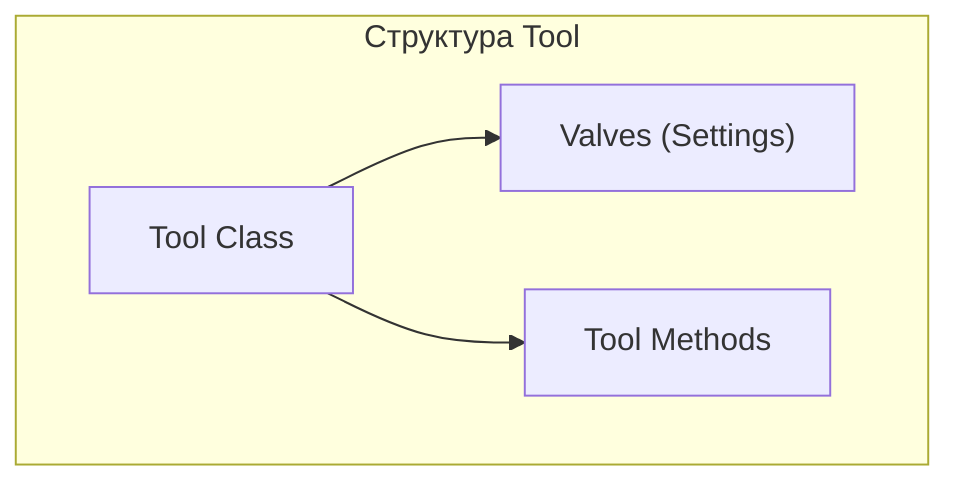
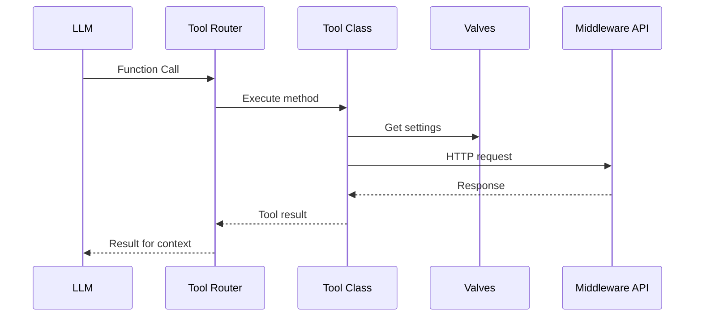

**Проект:** Ядро корпоративной AI-системы  
**Модуль:** User Interface  
**Версия:** 4.1  
**Дата:** Январь 2026

---

## 6. Tools

### 6.1. Архитектура Tools

Tools — это функции, которые LLM может вызывать для выполнения действий (Function Calling).



### 6.2. Процесс выполнения Tool



### 6.3. Структура файлов

```
/app/backend/tools/
├── __init__.py
├── knowledge_search.py      # Поиск в KB
├── reviews.py               # Работа с отзывами
├── prices.py                # Мониторинг цен
├── documents.py             # Загрузка документов
├── analytics.py             # Аналитика
├── finance.py               # Финансы
└── system.py                # Системные инструменты
```

### 6.4. Tool: Поиск в базе знаний

```python
# tools/knowledge_search.py
"""
title: Knowledge Search
author: Adolf Team
version: 1.0.0
"""

from typing import Callable, Any
from pydantic import BaseModel, Field
import requests


class Valves(BaseModel):
    MIDDLEWARE_URL: str = Field(
        default="http://middleware:8000",
        description="URL Middleware API"
    )
    MIDDLEWARE_API_KEY: str = Field(
        default="",
        description="API ключ"
    )


class Tools:
    """Инструменты для работы с базой знаний."""
    
    def __init__(self):
        self.valves = Valves()
    
    def knowledge_search(
        self,
        query: str,
        __user__: dict = {},
        __event_emitter__: Callable[[dict], Any] = None
    ) -> str:
        """
        Поиск в корпоративной базе знаний.
        
        Args:
            query: Поисковый запрос
            
        Returns:
            Результаты поиска с источниками
        """
        if __event_emitter__:
            __event_emitter__({
                "type": "status",
                "data": {"description": "Поиск в базе знаний...", "done": False}
            })
        
        try:
            response = requests.post(
                f"{self.valves.MIDDLEWARE_URL}/api/v1/knowledge/search",
                headers={
                    "Authorization": f"Bearer {self.valves.MIDDLEWARE_API_KEY}",
                    "X-User-ID": str(__user__.get("id")),
                    "X-User-Role": __user__.get("role", "staff"),
                    "X-User-Brand": __user__.get("valves", {}).get("brand_id", "all")
                },
                json={"query": query, "limit": 5}
            )
            
            results = response.json()
            
            if __event_emitter__:
                __event_emitter__({
                    "type": "status",
                    "data": {"description": f"Найдено {len(results)} результатов", "done": True}
                })
            
            if not results:
                return "По вашему запросу ничего не найдено в базе знаний."
            
            # Форматирование результатов
            output = "**Результаты поиска:**\n\n"
            
            for i, result in enumerate(results, 1):
                output += f"{i}. **{result['title']}**\n"
                output += f"   {result['snippet']}\n"
                output += f"   _Источник: {result['source']}_\n\n"
            
            return output
            
        except Exception as e:
            if __event_emitter__:
                __event_emitter__({
                    "type": "status",
                    "data": {"description": f"Ошибка: {str(e)}", "done": True}
                })
            return f"Ошибка при поиске: {str(e)}"
```

### 6.5. Tool: Работа с отзывами

```python
# tools/reviews.py
"""
title: Reviews Tools
author: Adolf Team
version: 1.0.0
"""

from typing import Callable, Any, Optional
from pydantic import BaseModel, Field
import requests


class Valves(BaseModel):
    MIDDLEWARE_URL: str = Field(default="http://middleware:8000")
    MIDDLEWARE_API_KEY: str = Field(default="")


class Tools:
    """Инструменты для работы с отзывами."""
    
    def __init__(self):
        self.valves = Valves()
    
    def reviews_list(
        self,
        platform: str = "all",
        status: str = "new",
        rating: Optional[int] = None,
        __user__: dict = {},
        __event_emitter__: Callable[[dict], Any] = None
    ) -> str:
        """
        Получение списка отзывов.
        
        Args:
            platform: Площадка (wb, ozon, all)
            status: Статус (new, pending, all)
            rating: Фильтр по рейтингу (1-5)
        """
        if __event_emitter__:
            __event_emitter__({
                "type": "status",
                "data": {"description": "Загрузка отзывов...", "done": False}
            })
        
        params = {"status": status, "limit": 10}
        if platform != "all":
            params["platform"] = platform
        if rating:
            params["rating"] = rating
        
        try:
            response = requests.get(
                f"{self.valves.MIDDLEWARE_URL}/api/v1/reviews",
                headers={
                    "Authorization": f"Bearer {self.valves.MIDDLEWARE_API_KEY}",
                    "X-User-ID": str(__user__.get("id")),
                    "X-User-Role": __user__.get("role"),
                    "X-User-Brand": __user__.get("valves", {}).get("brand_id", "all")
                },
                params=params
            )
            
            reviews = response.json()
            
            if __event_emitter__:
                __event_emitter__({
                    "type": "status",
                    "data": {"description": f"Найдено {len(reviews)} отзывов", "done": True}
                })
            
            if not reviews:
                return "Нет отзывов для отображения."
            
            # Форматирование
            output = "**Отзывы на модерацию:**\n\n"
            
            for review in reviews:
                stars = "⭐" * review["rating"] + "☆" * (5 - review["rating"])
                output += f"---\n"
                output += f"**ID {review['id']}** | {stars} | {review['platform'].upper()}\n"
                output += f"**Товар:** {review['product_name']} ({review['sku']})\n"
                output += f"**Клиент:** {review['client_name']}\n"
                output += f"**Текст:** {review['client_text'][:200]}...\n"
                
                if review.get("draft_response"):
                    output += f"\n**Черновик ответа:**\n_{review['draft_response'][:150]}..._\n"
                
                output += f"\n`[Утвердить: review_approve({review['id']})]` "
                output += f"`[Редактировать: review_edit({review['id']}, \"новый текст\")]`\n"
            
            return output
            
        except Exception as e:
            return f"Ошибка при загрузке отзывов: {str(e)}"
    
    def review_approve(
        self,
        review_id: int,
        __user__: dict = {},
        __event_emitter__: Callable[[dict], Any] = None
    ) -> str:
        """
        Утвердить ответ на отзыв.
        
        Args:
            review_id: ID отзыва
        """
        if __event_emitter__:
            __event_emitter__({
                "type": "status",
                "data": {"description": "Отправка ответа...", "done": False}
            })
        
        try:
            response = requests.post(
                f"{self.valves.MIDDLEWARE_URL}/api/v1/reviews/{review_id}/approve",
                headers={
                    "Authorization": f"Bearer {self.valves.MIDDLEWARE_API_KEY}",
                    "X-User-ID": str(__user__.get("id")),
                    "X-User-Role": __user__.get("role")
                }
            )
            
            if response.status_code == 200:
                if __event_emitter__:
                    __event_emitter__({
                        "type": "status",
                        "data": {"description": "✅ Ответ отправлен", "done": True}
                    })
                return f"✅ Ответ на отзыв #{review_id} успешно отправлен на маркетплейс."
            else:
                error = response.json().get("detail", "Неизвестная ошибка")
                return f"❌ Ошибка при отправке: {error}"
                
        except Exception as e:
            return f"❌ Ошибка: {str(e)}"
    
    def review_edit(
        self,
        review_id: int,
        new_response: str,
        __user__: dict = {},
        __event_emitter__: Callable[[dict], Any] = None
    ) -> str:
        """
        Редактирование ответа на отзыв.
        
        Args:
            review_id: ID отзыва
            new_response: Новый текст ответа
        """
        if __event_emitter__:
            __event_emitter__({
                "type": "status",
                "data": {"description": "Сохранение...", "done": False}
            })
        
        try:
            response = requests.patch(
                f"{self.valves.MIDDLEWARE_URL}/api/v1/reviews/{review_id}",
                headers={
                    "Authorization": f"Bearer {self.valves.MIDDLEWARE_API_KEY}",
                    "X-User-ID": str(__user__.get("id")),
                    "X-User-Role": __user__.get("role")
                },
                json={"response_text": new_response}
            )
            
            if response.status_code == 200:
                if __event_emitter__:
                    __event_emitter__({
                        "type": "status",
                        "data": {"description": "✅ Сохранено", "done": True}
                    })
                return f"✅ Ответ на отзыв #{review_id} обновлён."
            else:
                error = response.json().get("detail", "Неизвестная ошибка")
                return f"❌ Ошибка: {error}"
                
        except Exception as e:
            return f"❌ Ошибка: {str(e)}"
    
    def review_generate(
        self,
        review_id: int,
        tone: str = "friendly",
        __user__: dict = {},
        __event_emitter__: Callable[[dict], Any] = None
    ) -> str:
        """
        Перегенерация ответа на отзыв.
        
        Args:
            review_id: ID отзыва
            tone: Тон ответа (formal, friendly, apologetic)
        """
        if __event_emitter__:
            __event_emitter__({
                "type": "status",
                "data": {"description": "Генерация нового ответа...", "done": False}
            })
        
        try:
            response = requests.post(
                f"{self.valves.MIDDLEWARE_URL}/api/v1/reviews/{review_id}/regenerate",
                headers={
                    "Authorization": f"Bearer {self.valves.MIDDLEWARE_API_KEY}",
                    "X-User-ID": str(__user__.get("id")),
                    "X-User-Role": __user__.get("role")
                },
                json={"tone": tone}
            )
            
            if response.status_code == 200:
                data = response.json()
                if __event_emitter__:
                    __event_emitter__({
                        "type": "status",
                        "data": {"description": "✅ Сгенерировано", "done": True}
                    })
                return f"✅ Новый ответ сгенерирован:\n\n_{data['response_text']}_"
            else:
                error = response.json().get("detail", "Неизвестная ошибка")
                return f"❌ Ошибка: {error}"
                
        except Exception as e:
            return f"❌ Ошибка: {str(e)}"
```

### 6.6. Tool: Мониторинг цен

```python
# tools/prices.py
"""
title: Price Monitoring Tools
author: Adolf Team
version: 1.0.0
"""

from typing import Callable, Any
from pydantic import BaseModel, Field
import requests


class Valves(BaseModel):
    MIDDLEWARE_URL: str = Field(default="http://middleware:8000")
    MIDDLEWARE_API_KEY: str = Field(default="")


class Tools:
    """Инструменты для мониторинга цен."""
    
    def __init__(self):
        self.valves = Valves()
    
    def price_check(
        self,
        sku: str,
        __user__: dict = {},
        __event_emitter__: Callable[[dict], Any] = None
    ) -> str:
        """
        Проверка цен конкурентов для товара.
        
        Args:
            sku: Артикул товара
        """
        if __event_emitter__:
            __event_emitter__({
                "type": "status",
                "data": {"description": f"Загрузка цен для {sku}...", "done": False}
            })
        
        try:
            response = requests.get(
                f"{self.valves.MIDDLEWARE_URL}/api/v1/prices/{sku}",
                headers={
                    "Authorization": f"Bearer {self.valves.MIDDLEWARE_API_KEY}",
                    "X-User-ID": str(__user__.get("id"))
                }
            )
            
            data = response.json()
            
            if __event_emitter__:
                __event_emitter__({
                    "type": "status",
                    "data": {"description": "Данные загружены", "done": True}
                })
            
            # Форматирование
            output = f"**Мониторинг цен: {data['product_name']}** ({sku})\n\n"
            output += f"Ваша цена: **{data['our_price']:,}₽**\n\n"
            output += "**Конкуренты:**\n"
            
            for comp in data.get("competitors", []):
                diff = data["our_price"] - comp["price"]
                diff_sign = "+" if diff > 0 else ""
                diff_pct = round(diff / data["our_price"] * 100)
                
                status = "🟢" if diff > 0 else "🔴" if diff < 0 else "🟡"
                
                output += f"{status} {comp['name']}: {comp['price']:,}₽ "
                output += f"({diff_sign}{diff:,}₽ / {diff_sign}{diff_pct}%)\n"
            
            return output
            
        except Exception as e:
            return f"Ошибка при загрузке цен: {str(e)}"
    
    def price_alerts(
        self,
        __user__: dict = {},
        __event_emitter__: Callable[[dict], Any] = None
    ) -> str:
        """
        Список активных демпинг-алертов.
        """
        try:
            response = requests.get(
                f"{self.valves.MIDDLEWARE_URL}/api/v1/prices/alerts",
                headers={
                    "Authorization": f"Bearer {self.valves.MIDDLEWARE_API_KEY}",
                    "X-User-ID": str(__user__.get("id"))
                }
            )
            
            alerts = response.json()
            
            if not alerts:
                return "Нет активных демпинг-алертов."
            
            output = "**🔴 Демпинг-алерты:**\n\n"
            
            for alert in alerts:
                output += f"---\n"
                output += f"**{alert['product_name']}** ({alert['sku']})\n"
                output += f"Конкурент: {alert['competitor_name']}\n"
                output += f"Было: {alert['old_price']:,}₽ → Стало: {alert['new_price']:,}₽ "
                output += f"(-{alert['change_percent']}%)\n"
                output += f"Ваша цена: {alert['our_price']:,}₽\n\n"
            
            return output
            
        except Exception as e:
            return f"Ошибка: {str(e)}"
```

### 6.7. Tool: Загрузка документов

```python
# tools/documents.py
"""
title: Document Upload Tools
author: Adolf Team
version: 1.0.0
"""

from typing import Callable, Any, Optional
from pydantic import BaseModel, Field
import requests


class Valves(BaseModel):
    MIDDLEWARE_URL: str = Field(default="http://middleware:8000")
    MIDDLEWARE_API_KEY: str = Field(default="")


class Tools:
    """Инструменты для загрузки документов в KB."""
    
    def __init__(self):
        self.valves = Valves()
    
    def document_upload_status(
        self,
        __user__: dict = {},
        __event_emitter__: Callable[[dict], Any] = None
    ) -> str:
        """
        Статус последних загруженных документов.
        """
        try:
            response = requests.get(
                f"{self.valves.MIDDLEWARE_URL}/api/v1/documents/recent",
                headers={
                    "Authorization": f"Bearer {self.valves.MIDDLEWARE_API_KEY}",
                    "X-User-ID": str(__user__.get("id"))
                },
                params={"limit": 5}
            )
            
            docs = response.json()
            
            if not docs:
                return "Нет недавно загруженных документов."
            
            output = "**Последние загрузки:**\n\n"
            
            status_icons = {
                "processing": "⏳",
                "indexed": "✅",
                "quarantine": "❌",
                "pending_moderation": "👀"
            }
            
            for doc in docs:
                icon = status_icons.get(doc["status"], "❓")
                output += f"{icon} **{doc['filename']}**\n"
                output += f"   Категория: {doc['category']} | "
                output += f"Уровень: {doc['access_level']} | "
                output += f"Бренд: {doc['brand_id']}\n"
                output += f"   _{doc['status']}_\n\n"
            
            return output
            
        except Exception as e:
            return f"Ошибка: {str(e)}"
    
    def quarantine_list(
        self,
        __user__: dict = {},
        __event_emitter__: Callable[[dict], Any] = None
    ) -> str:
        """
        Список документов в карантине.
        """
        user_role = __user__.get("role", "staff")
        
        if user_role not in ("senior", "director", "administrator"):
            return "У вас нет доступа к списку карантина."
        
        try:
            response = requests.get(
                f"{self.valves.MIDDLEWARE_URL}/api/v1/quarantine",
                headers={
                    "Authorization": f"Bearer {self.valves.MIDDLEWARE_API_KEY}",
                    "X-User-ID": str(__user__.get("id"))
                }
            )
            
            items = response.json()
            
            if not items:
                return "Карантин пуст."
            
            output = f"**⚠️ Документы в карантине ({len(items)}):**\n\n"
            
            for item in items:
                output += f"---\n"
                output += f"**{item['filename']}**\n"
                output += f"Ошибка: {item['error_code']} — {item['error_message']}\n"
                output += f"Попыток: {item['attempt_count']}/{item['max_attempts']}\n\n"
            
            return output
            
        except Exception as e:
            return f"Ошибка: {str(e)}"
```

---

**Конец части 1.3**

**Следующая часть:** 1.4 — PWA и авторизация
