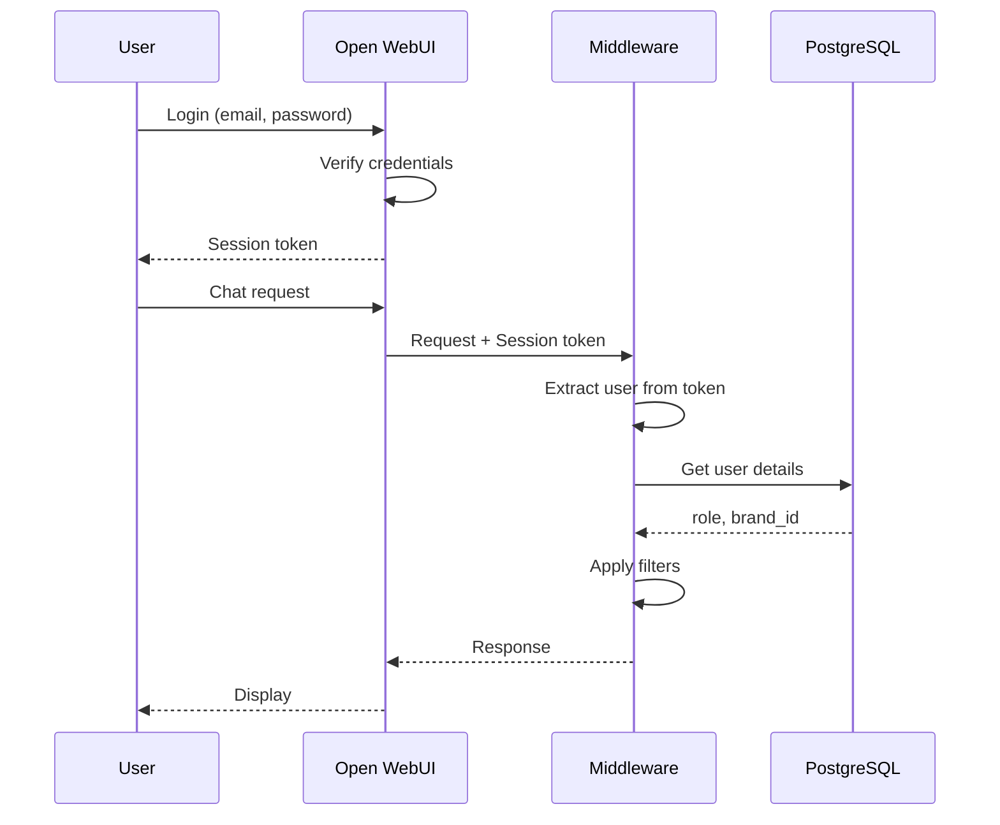
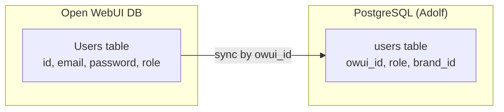
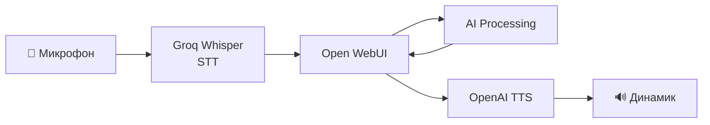

**Проект:** Ядро корпоративной AI-системы  
**Модуль:** User Interface  
**Версия:** 4.1  
**Дата:** Январь 2026

---

## 7. PWA (Progressive Web App)

### 7.1. Manifest

```json
// nginx/html/manifest.json
{
  "name": "Adolf",
  "short_name": "Adolf",
  "description": "Корпоративный AI-ассистент",
  "start_url": "/",
  "display": "standalone",
  "background_color": "#1a1a2e",
  "theme_color": "#4a4a6a",
  "orientation": "any",
  "icons": [
    {
      "src": "/icons/icon-192.png",
      "sizes": "192x192",
      "type": "image/png"
    },
    {
      "src": "/icons/icon-512.png",
      "sizes": "512x512",
      "type": "image/png"
    }
  ]
}
```

### 7.2. Установка PWA

**Desktop (Chrome/Edge):**

1. Открыть https://adolf.su
2. Нажать иконку установки в адресной строке
3. Подтвердить установку

**Mobile (iOS):**

1. Открыть https://adolf.su в Safari
2. Нажать "Поделиться" → "На экран Домой"
3. Подтвердить добавление

**Mobile (Android):**

1. Открыть https://adolf.su в Chrome
2. Появится баннер "Добавить на главный экран"
3. Или: Меню → "Установить приложение"

---

## 8. Кастомизация интерфейса

### 8.1. Брендинг

**Логотип и цвета:**

```css
/* Custom CSS (через Admin Panel) */
:root {
  --primary-color: #4a4a6a;
  --secondary-color: #6a6a8a;
  --background-color: #1a1a2e;
  --text-color: #e0e0e0;
  --accent-color: #7c3aed;
}

.logo {
  content: url('/icons/adolf-logo.svg');
}
```

### 8.2. Кастомные компоненты (карточки)

Для отображения карточек отзывов, документов и алертов используются HTML-блоки в Markdown:

**Карточка отзыва:**

```markdown
<div class="review-card">
  <div class="review-header">
    ⭐⭐⭐☆☆ | Wildberries | Охана Маркет
  </div>
  <div class="review-body">
    <strong>Товар:</strong> Худи оверсайз черное (Арт. 12345)<br>
    <strong>Клиент:</strong> Анна М.<br>
    <strong>Текст:</strong> "Худи хорошее, но размер маломерит..."
  </div>
  <div class="review-footer">
    <button onclick="approveReview(123)">✅ Утвердить</button>
    <button onclick="editReview(123)">✏️ Редактировать</button>
  </div>
</div>
```

### 8.3. Системные сообщения

```python
# pipelines/system_messages.py

WELCOME_MESSAGE = """
👋 Добро пожаловать в **Adolf**!

Я — ваш корпоративный AI-ассистент. Вот что я умею:

📚 **База знаний** — найду любую информацию о товарах, регламентах, инструкциях
⭐ **Отзывы** — помогу обработать отзывы и вопросы покупателей  
🔍 **Цены** — покажу цены конкурентов и алерты о демпинге
📊 **Аналитика** — подготовлю отчёты и статистику

Просто напишите, что вам нужно, или используйте меню слева.
"""

ROLE_GREETING = {
    "staff": "Вы вошли как **Сотрудник**. Доступен поиск по базе знаний.",
    "manager": "Вы вошли как **Менеджер**. Доступны отзывы, цены и аналитика.",
    "senior": "Вы вошли как **Старший менеджер**. Полный доступ к операционным модулям.",
    "director": "Вы вошли как **Директор**. Доступны все модули включая финансы.",
    "administrator": "Вы вошли как **Администратор**. Полный доступ к системе."
}
```

---

## 9. Авторизация

### 9.1. Схема авторизации



### 9.2. Синхронизация пользователей

Пользователи создаются в Open WebUI администратором. Middleware синхронизирует информацию о ролях и брендах:

```python
# middleware/auth.py

async def sync_user_from_owui(owui_user_id: str, owui_session: dict) -> User:
    """
    Синхронизация пользователя из Open WebUI.
    """
    # Получение данных из Open WebUI
    owui_user = owui_session.get("user", {})
    
    # Поиск или создание в нашей БД
    user = await user_repo.get_by_owui_id(owui_user_id)
    
    if not user:
        # Первый вход — создаём запись
        user = await user_repo.create(
            owui_id=owui_user_id,
            username=owui_user.get("name"),
            email=owui_user.get("email"),
            role="staff",  # Роль по умолчанию
            brand_id=None
        )
    
    return user
```

### 9.3. Передача контекста пользователя

Open WebUI передаёт информацию о пользователе через Valves:

```python
# В Pipeline
def pipe(self, body: dict, __user__: dict):
    user_id = __user__.get("id")
    user_name = __user__.get("name")
    user_email = __user__.get("email")
    user_role = __user__.get("role")  # из Open WebUI
    
    # Кастомные настройки пользователя
    user_valves = __user__.get("valves", {})
    user_brand = user_valves.get("brand_id", "all")
```

### 9.4. Хранение данных пользователя



---

## 10. Голосовой интерфейс (Adolf 2.0)

### 10.1. STT (Speech-to-Text)

**Провайдер:** Groq Whisper API

```yaml
# docker-compose.yml (дополнение)
services:
  open-webui:
    environment:
      # STT
      - AUDIO_STT_ENGINE=openai
      - AUDIO_STT_OPENAI_API_BASE_URL=https://api.groq.com/openai/v1
      - AUDIO_STT_OPENAI_API_KEY=${GROQ_API_KEY}
      - AUDIO_STT_MODEL=whisper-large-v3
```

### 10.2. TTS (Text-to-Speech)

**Провайдер:** OpenAI TTS

```yaml
# docker-compose.yml (дополнение)
services:
  open-webui:
    environment:
      # TTS
      - AUDIO_TTS_ENGINE=openai
      - AUDIO_TTS_OPENAI_API_KEY=${OPENAI_API_KEY}
      - AUDIO_TTS_MODEL=tts-1-hd
      - AUDIO_TTS_VOICE=alloy
```

### 10.3. Архитектура голосового интерфейса



---

## Приложение А: Чек-лист развёртывания

| Шаг | Действие | Проверка |
|-----|----------|----------|
| 1 | Установить Docker и Docker Compose | `docker --version` |
| 2 | Клонировать репозиторий | Файлы на месте |
| 3 | Создать .env файл | Все переменные заполнены |
| 4 | Настроить SSL-сертификаты | Файлы в nginx/ssl/ |
| 5 | Запустить `docker compose up -d` | Все контейнеры running |
| 6 | Открыть https://adolf.su | Страница загружается |
| 7 | Создать администратора | Первый пользователь |
| 8 | Отключить регистрацию | ENABLE_SIGNUP=false |
| 9 | Создать пользователей | Все сотрудники добавлены |
| 10 | Настроить Pipelines | Все агенты активны |
| 11 | Проверить Tools | Function Calling работает |
| 12 | Тест PWA | Установка на мобильное |

---

## Приложение Б: Troubleshooting

| Проблема | Решение |
|----------|---------|
| WebSocket не работает | Проверить Nginx конфиг (Upgrade, Connection) |
| Tools не вызываются | Проверить OPENAI_API_BASE_URL в Open WebUI |
| 502 Bad Gateway | Проверить, запущен ли контейнер open-webui |
| Медленная загрузка | Включить gzip в Nginx |
| PWA не устанавливается | Проверить manifest.json и HTTPS |
| Нет уведомлений | Проверить WebSocket соединение |

---

## Приложение В: Структура проекта

```
adolf-core/
├── docker-compose.yml
├── .env
├── nginx/
│   ├── conf.d/
│   │   └── adolf.conf
│   ├── ssl/
│   │   ├── fullchain.pem
│   │   └── privkey.pem
│   └── html/
│       ├── manifest.json
│       └── icons/
├── pipelines/
│   ├── adolf_main.py
│   ├── adolf_reviews.py
│   ├── adolf_prices.py
│   └── ...
├── tools/
│   ├── knowledge_search.py
│   ├── reviews.py
│   ├── prices.py
│   └── ...
└── middleware/
    ├── Dockerfile
    ├── requirements.txt
    └── app/
```

---

**Конец части 1.4**

**Документ подготовлен:** Январь 2026  
**Версия:** 4.1  
**Статус:** Согласовано
