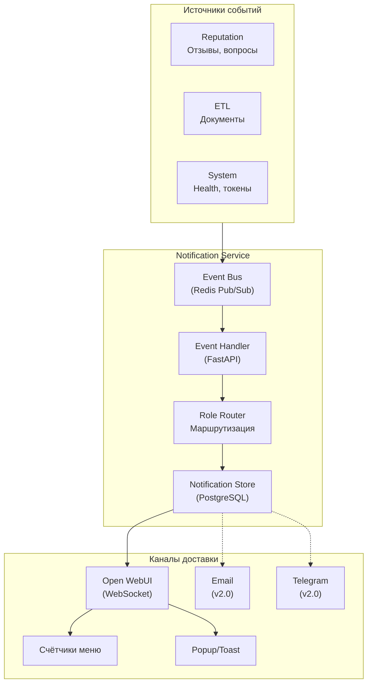
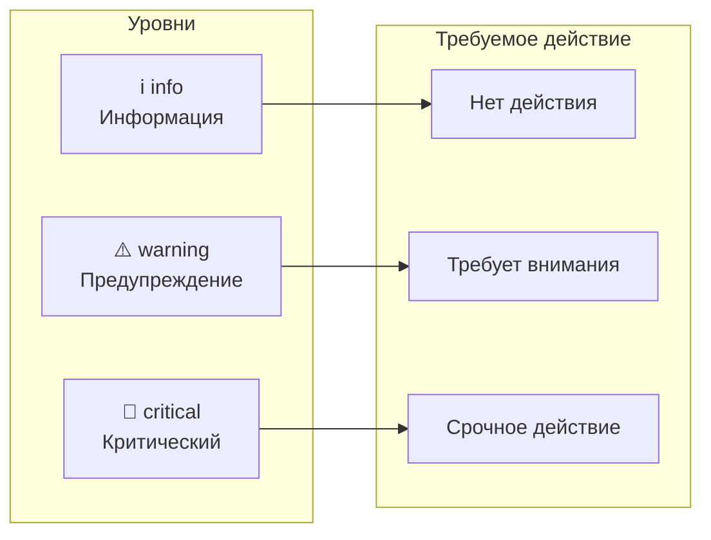
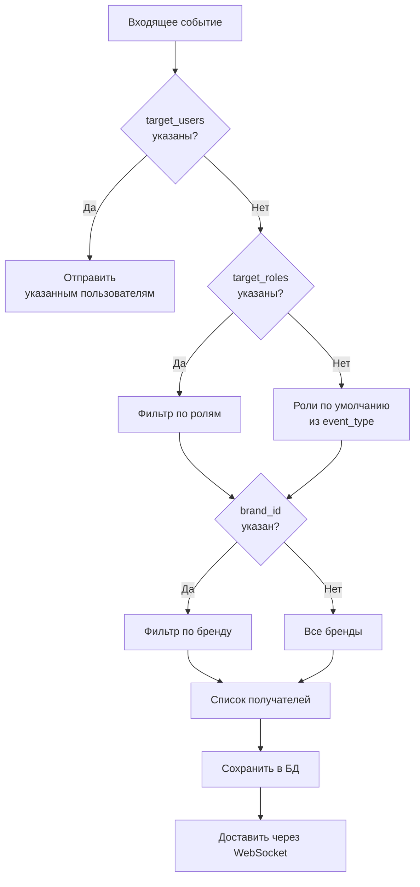
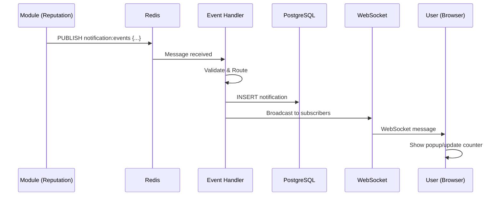
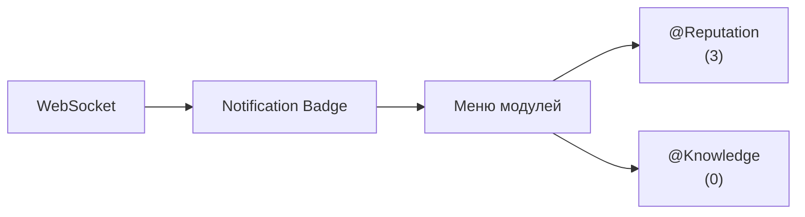

# ADOLF CORE v4.0 — Часть 2.6: Система уведомлений

**Проект:** Ядро корпоративной AI-системы  
**Модуль:** Notification System  
**Версия:** 4.1  
**Дата:** Январь 2026

---

## 1. Назначение и архитектура

### 1.1 Назначение

Система уведомлений обеспечивает:

- Информирование пользователей о событиях в системе
- Маршрутизацию алертов по ролям и брендам
- Отображение счётчиков в интерфейсе Open WebUI
- Приём событий от всех модулей через единый Event Bus

### 1.2 Архитектура



### 1.3 Компоненты

| Компонент | Технология | Назначение |
|-----------|------------|------------|
| Event Bus | Redis Pub/Sub | Приём событий от модулей |
| Event Handler | FastAPI endpoint | Обработка и валидация |
| Role Router | Python service | Маршрутизация по получателям |
| Notification Store | PostgreSQL | Хранение уведомлений |
| WebSocket Server | FastAPI + WebSocket | Real-time доставка |
| Cleanup Task | Celery | Очистка старых уведомлений |

---

## 2. Типы событий

### 2.1 Классификация событий



### 2.2 Реестр событий v4.0

| Event Type | Модуль | Уровень | Получатели | Описание |
|------------|--------|---------|------------|----------|
| `review.new` | Reputation | info | Manager (brand) | Новый отзыв |
| `question.new` | Reputation | info | Manager (brand) | Новый вопрос |
| `review.negative` | Reputation | warning | Manager (brand) | Негативный отзыв (1-2 звезды) |
| `document.pending_moderation` | ETL | info | Senior | Документ на модерацию |
| `document.approved` | ETL | info | Manager (author) | Документ одобрен |
| `document.rejected` | ETL | warning | Manager (author) | Документ отклонён |
| `document.indexed` | ETL | info | Manager (author) | Документ добавлен в KB |
| `document.quarantine` | ETL | warning | Administrator | Документ в карантине |
| `api.token_expiring` | System | warning | Administrator | Токен истекает через 7 дней |
| `api.token_expired` | System | critical | Administrator | Токен истёк |
| `service.unhealthy` | System | critical | Administrator | Сервис недоступен |
| `service.recovered` | System | info | Administrator | Сервис восстановлен |

### 2.3 Структура события

```python
from pydantic import BaseModel
from typing import Optional, List, Dict, Any
from datetime import datetime
from enum import Enum

class EventLevel(str, Enum):
    INFO = "info"
    WARNING = "warning"
    CRITICAL = "critical"

class NotificationEvent(BaseModel):
    # Идентификация
    event_type: str                    # 'review.new', 'document.approved', ...
    event_id: str                      # UUID события
    
    # Уровень
    level: EventLevel = EventLevel.INFO
    
    # Источник
    source_module: str                 # 'reputation', 'etl', 'system'
    source_id: Optional[str] = None    # ID сущности в модуле
    
    # Содержимое
    title: str                         # Заголовок
    message: str                       # Текст сообщения
    data: Optional[Dict[str, Any]] = None  # Дополнительные данные
    
    # Маршрутизация
    brand_id: Optional[str] = None     # Фильтр по бренду
    target_roles: Optional[List[str]] = None  # Целевые роли
    target_users: Optional[List[int]] = None  # Конкретные пользователи
    
    # Метаданные
    created_at: datetime = datetime.now()
```

---

## 3. Маршрутизация

### 3.1 Правила маршрутизации



### 3.2 Матрица маршрутизации по ролям

| Event Type | Staff | Manager | Senior | Director | Admin |
|------------|:-----:|:-------:|:------:|:--------:|:-----:|
| `review.new` | ❌ | ✅ (brand) | ✅ | ✅ | ✅ |
| `question.new` | ❌ | ✅ (brand) | ✅ | ✅ | ✅ |
| `review.negative` | ❌ | ✅ (brand) | ✅ | ✅ | ✅ |
| `document.pending_moderation` | ❌ | ❌ | ✅ | ✅ | ✅ |
| `document.approved` | ❌ | ✅ (author) | ✅ | ✅ | ✅ |
| `document.rejected` | ❌ | ✅ (author) | ✅ | ✅ | ✅ |
| `document.indexed` | ❌ | ✅ (author) | ✅ | ✅ | ✅ |
| `document.quarantine` | ❌ | ❌ | ❌ | ❌ | ✅ |
| `api.token_expiring` | ❌ | ❌ | ❌ | ❌ | ✅ |
| `api.token_expired` | ❌ | ❌ | ❌ | ❌ | ✅ |
| `service.unhealthy` | ❌ | ❌ | ❌ | ❌ | ✅ |
| `service.recovered` | ❌ | ❌ | ❌ | ❌ | ✅ |

### 3.3 Конфигурация маршрутизации

```python
# config/notification_routes.py

NOTIFICATION_ROUTES = {
    # Reputation
    "review.new": {
        "default_roles": ["manager", "senior", "director"],
        "filter_by_brand": True,
        "level": "info"
    },
    "question.new": {
        "default_roles": ["manager", "senior", "director"],
        "filter_by_brand": True,
        "level": "info"
    },
    "review.negative": {
        "default_roles": ["manager", "senior", "director"],
        "filter_by_brand": True,
        "level": "warning"
    },
    
    # ETL
    "document.pending_moderation": {
        "default_roles": ["senior", "director", "administrator"],
        "filter_by_brand": False,
        "level": "info"
    },
    "document.approved": {
        "notify_author": True,
        "level": "info"
    },
    "document.rejected": {
        "notify_author": True,
        "level": "warning"
    },
    "document.indexed": {
        "notify_author": True,
        "level": "info"
    },
    "document.quarantine": {
        "default_roles": ["administrator"],
        "level": "warning"
    },
    
    # System
    "api.token_expiring": {
        "default_roles": ["administrator"],
        "level": "warning"
    },
    "api.token_expired": {
        "default_roles": ["administrator"],
        "level": "critical"
    },
    "service.unhealthy": {
        "default_roles": ["administrator"],
        "level": "critical"
    },
    "service.recovered": {
        "default_roles": ["administrator"],
        "level": "info"
    }
}
```

---

## 4. Event Bus (Redis Pub/Sub)

### 4.1 Архитектура



### 4.2 Публикация события

```python
# services/notification_publisher.py
import redis
import json
from typing import Optional, Dict, Any
from datetime import datetime
import uuid

class NotificationPublisher:
    """Публикация событий в Redis Pub/Sub."""
    
    CHANNEL = "notification:events"
    
    def __init__(self, redis_url: str):
        self.redis = redis.from_url(redis_url)
    
    def publish(
        self,
        event_type: str,
        title: str,
        message: str,
        source_module: str,
        level: str = "info",
        brand_id: Optional[str] = None,
        target_roles: Optional[list] = None,
        target_users: Optional[list] = None,
        source_id: Optional[str] = None,
        data: Optional[Dict[str, Any]] = None
    ) -> str:
        """
        Публикация события в канал уведомлений.
        
        Returns:
            event_id: UUID события
        """
        event_id = str(uuid.uuid4())
        
        event = {
            "event_id": event_id,
            "event_type": event_type,
            "level": level,
            "source_module": source_module,
            "source_id": source_id,
            "title": title,
            "message": message,
            "data": data or {},
            "brand_id": brand_id,
            "target_roles": target_roles,
            "target_users": target_users,
            "created_at": datetime.utcnow().isoformat()
        }
        
        self.redis.publish(self.CHANNEL, json.dumps(event))
        
        return event_id


# Пример использования в модуле Reputation
publisher = NotificationPublisher(redis_url="redis://localhost:6379/0")

publisher.publish(
    event_type="review.negative",
    title="Негативный отзыв",
    message="Получен отзыв 1⭐ на товар 'Худи оверсайз'",
    source_module="reputation",
    source_id="review_12345",
    level="warning",
    brand_id="ohana_market",
    data={
        "review_id": 12345,
        "sku": "HOODIE-001",
        "rating": 1,
        "client_text": "Ужасное качество..."
    }
)
```

### 4.3 Подписка на события

```python
# services/notification_subscriber.py
import redis
import json
import asyncio
from typing import Callable

class NotificationSubscriber:
    """Подписка на события из Redis Pub/Sub."""
    
    CHANNEL = "notification:events"
    
    def __init__(self, redis_url: str):
        self.redis = redis.from_url(redis_url)
        self.pubsub = self.redis.pubsub()
    
    async def subscribe(self, handler: Callable):
        """
        Подписка на канал с асинхронной обработкой.
        
        Args:
            handler: Async функция обработки событий
        """
        self.pubsub.subscribe(self.CHANNEL)
        
        for message in self.pubsub.listen():
            if message["type"] == "message":
                event = json.loads(message["data"])
                await handler(event)
    
    def close(self):
        self.pubsub.unsubscribe()
        self.pubsub.close()
```

---

## 5. Event Handler

### 5.1 Обработчик событий

```python
# services/notification_handler.py
from typing import Dict, Any, List
from datetime import datetime
from sqlalchemy.ext.asyncio import AsyncSession

from models import Notification, User
from config.notification_routes import NOTIFICATION_ROUTES

class NotificationHandler:
    """Обработка и маршрутизация событий."""
    
    def __init__(self, db_session: AsyncSession, websocket_manager):
        self.db = db_session
        self.ws_manager = websocket_manager
    
    async def handle(self, event: Dict[str, Any]):
        """
        Обработка входящего события.
        
        1. Валидация
        2. Определение получателей
        3. Сохранение в БД
        4. Доставка через WebSocket
        """
        # Валидация
        event_type = event.get("event_type")
        if event_type not in NOTIFICATION_ROUTES:
            raise ValueError(f"Unknown event type: {event_type}")
        
        route_config = NOTIFICATION_ROUTES[event_type]
        
        # Определение получателей
        recipients = await self._resolve_recipients(event, route_config)
        
        if not recipients:
            return
        
        # Создание уведомлений
        notifications = []
        for user_id in recipients:
            notification = Notification(
                user_id=user_id,
                event_type=event_type,
                level=event.get("level", route_config.get("level", "info")),
                title=event["title"],
                message=event["message"],
                data=event.get("data"),
                source_module=event.get("source_module"),
                source_id=event.get("source_id"),
                is_read=False,
                created_at=datetime.utcnow()
            )
            notifications.append(notification)
        
        # Сохранение в БД
        self.db.add_all(notifications)
        await self.db.commit()
        
        # Доставка через WebSocket
        for notification in notifications:
            await self.ws_manager.send_to_user(
                user_id=notification.user_id,
                message={
                    "type": "notification",
                    "payload": notification.to_dict()
                }
            )
    
    async def _resolve_recipients(
        self, 
        event: Dict[str, Any], 
        route_config: Dict[str, Any]
    ) -> List[int]:
        """Определение списка получателей."""
        
        # Если указаны конкретные пользователи
        if event.get("target_users"):
            return event["target_users"]
        
        # Уведомление автора документа
        if route_config.get("notify_author") and event.get("data", {}).get("author_id"):
            return [event["data"]["author_id"]]
        
        # Фильтрация по ролям
        target_roles = event.get("target_roles") or route_config.get("default_roles", [])
        
        query = self.db.query(User).filter(
            User.role.in_(target_roles),
            User.is_active == True
        )
        
        # Фильтрация по бренду
        if route_config.get("filter_by_brand") and event.get("brand_id"):
            query = query.filter(
                (User.brand_id == event["brand_id"]) | 
                (User.brand_id == "all")
            )
        
        users = await query.all()
        return [user.id for user in users]
```

### 5.2 API Endpoint для приёма событий

```python
# api/routes/notifications.py
from fastapi import APIRouter, Depends, HTTPException
from pydantic import BaseModel
from typing import Optional, List, Dict, Any

router = APIRouter(prefix="/api/v1/notifications", tags=["notifications"])

class EventPayload(BaseModel):
    event_type: str
    title: str
    message: str
    source_module: str
    level: str = "info"
    source_id: Optional[str] = None
    brand_id: Optional[str] = None
    target_roles: Optional[List[str]] = None
    target_users: Optional[List[int]] = None
    data: Optional[Dict[str, Any]] = None

@router.post("/webhook")
async def receive_event(
    payload: EventPayload,
    handler: NotificationHandler = Depends(get_notification_handler)
):
    """
    Приём событий от модулей через webhook.
    
    Используется если модуль не может публиковать в Redis напрямую.
    """
    try:
        await handler.handle(payload.dict())
        return {"status": "ok"}
    except Exception as e:
        raise HTTPException(status_code=500, detail=str(e))
```

---

## 6. WebSocket доставка

### 6.1 WebSocket Manager

```python
# services/websocket_manager.py
from fastapi import WebSocket
from typing import Dict, List, Any
import json
import asyncio

class WebSocketManager:
    """Управление WebSocket соединениями."""
    
    def __init__(self):
        # user_id -> list of WebSocket connections
        self.active_connections: Dict[int, List[WebSocket]] = {}
        self.lock = asyncio.Lock()
    
    async def connect(self, websocket: WebSocket, user_id: int):
        """Подключение пользователя."""
        await websocket.accept()
        
        async with self.lock:
            if user_id not in self.active_connections:
                self.active_connections[user_id] = []
            self.active_connections[user_id].append(websocket)
    
    async def disconnect(self, websocket: WebSocket, user_id: int):
        """Отключение пользователя."""
        async with self.lock:
            if user_id in self.active_connections:
                self.active_connections[user_id].remove(websocket)
                if not self.active_connections[user_id]:
                    del self.active_connections[user_id]
    
    async def send_to_user(self, user_id: int, message: Dict[str, Any]):
        """Отправка сообщения конкретному пользователю."""
        if user_id not in self.active_connections:
            return
        
        message_json = json.dumps(message)
        
        for connection in self.active_connections[user_id]:
            try:
                await connection.send_text(message_json)
            except Exception:
                await self.disconnect(connection, user_id)
    
    async def broadcast(self, message: Dict[str, Any], user_ids: List[int] = None):
        """Отправка сообщения группе пользователей."""
        targets = user_ids or list(self.active_connections.keys())
        
        for user_id in targets:
            await self.send_to_user(user_id, message)
    
    def get_online_users(self) -> List[int]:
        """Список онлайн пользователей."""
        return list(self.active_connections.keys())
```

### 6.2 WebSocket Endpoint

```python
# api/routes/websocket.py
from fastapi import APIRouter, WebSocket, WebSocketDisconnect, Depends
from services.websocket_manager import WebSocketManager
from services.auth import get_current_user_ws

router = APIRouter()
ws_manager = WebSocketManager()

@router.websocket("/ws/notifications")
async def websocket_notifications(
    websocket: WebSocket,
    user = Depends(get_current_user_ws)
):
    """
    WebSocket endpoint для real-time уведомлений.
    """
    await ws_manager.connect(websocket, user.id)
    
    try:
        # Отправить непрочитанные уведомления при подключении
        unread = await get_unread_notifications(user.id)
        await websocket.send_json({
            "type": "initial",
            "payload": {
                "unread_count": len(unread),
                "notifications": unread[:10]
            }
        })
        
        # Держать соединение открытым
        while True:
            data = await websocket.receive_text()
            if data == "ping":
                await websocket.send_text("pong")
                
    except WebSocketDisconnect:
        await ws_manager.disconnect(websocket, user.id)
```

### 6.3 Клиентская интеграция (JavaScript)

```javascript
// notification-client.js

class NotificationClient {
    constructor(wsUrl) {
        this.wsUrl = wsUrl;
        this.ws = null;
        this.reconnectAttempts = 0;
        this.maxReconnectAttempts = 5;
        this.reconnectDelay = 1000;
        this.onNotification = null;
        this.onCountUpdate = null;
    }
    
    connect() {
        this.ws = new WebSocket(this.wsUrl);
        
        this.ws.onopen = () => {
            console.log('Notification WebSocket connected');
            this.reconnectAttempts = 0;
            this.startHeartbeat();
        };
        
        this.ws.onmessage = (event) => {
            const data = JSON.parse(event.data);
            this.handleMessage(data);
        };
        
        this.ws.onclose = () => {
            this.stopHeartbeat();
            this.reconnect();
        };
    }
    
    handleMessage(data) {
        switch (data.type) {
            case 'initial':
                if (this.onCountUpdate) {
                    this.onCountUpdate(data.payload.unread_count);
                }
                break;
                
            case 'notification':
                if (this.onNotification) {
                    this.onNotification(data.payload);
                }
                this.showToast(data.payload);
                break;
        }
    }
    
    showToast(notification) {
        const levelIcons = {
            'info': 'ℹ️',
            'warning': '⚠️',
            'critical': '🔴'
        };
        
        const icon = levelIcons[notification.level] || 'ℹ️';
        
        if (Notification.permission === 'granted') {
            new Notification(`${icon} ${notification.title}`, {
                body: notification.message,
                tag: notification.id
            });
        }
    }
    
    startHeartbeat() {
        this.heartbeatInterval = setInterval(() => {
            if (this.ws.readyState === WebSocket.OPEN) {
                this.ws.send('ping');
            }
        }, 30000);
    }
    
    stopHeartbeat() {
        if (this.heartbeatInterval) {
            clearInterval(this.heartbeatInterval);
        }
    }
    
    reconnect() {
        if (this.reconnectAttempts >= this.maxReconnectAttempts) return;
        
        this.reconnectAttempts++;
        const delay = this.reconnectDelay * Math.pow(2, this.reconnectAttempts - 1);
        
        setTimeout(() => this.connect(), delay);
    }
}

// Использование
const notificationClient = new NotificationClient('wss://adolf.su/ws/notifications');
notificationClient.onCountUpdate = (count) => {
    document.getElementById('notification-badge').textContent = count;
};
notificationClient.connect();
```

---

## 7. REST API

### 7.1 Endpoints

| Endpoint | Метод | Назначение | Роли |
|----------|-------|------------|------|
| `/api/v1/notifications` | GET | Список уведомлений | Все |
| `/api/v1/notifications/{id}` | GET | Детали уведомления | Все |
| `/api/v1/notifications/{id}/read` | POST | Отметить как прочитанное | Все |
| `/api/v1/notifications/read-all` | POST | Отметить все как прочитанные | Все |
| `/api/v1/notifications/count` | GET | Счётчик непрочитанных | Все |
| `/api/v1/notifications/webhook` | POST | Приём событий | Internal |

### 7.2 Реализация API

```python
# api/routes/notifications_rest.py
from fastapi import APIRouter, Depends, Query, HTTPException
from typing import Optional
from datetime import datetime

router = APIRouter(prefix="/api/v1/notifications", tags=["notifications"])

@router.get("")
async def list_notifications(
    limit: int = Query(20, le=100),
    offset: int = Query(0),
    level: Optional[str] = Query(None),
    is_read: Optional[bool] = Query(None),
    user = Depends(get_current_user),
    db = Depends(get_db)
):
    """Получение списка уведомлений текущего пользователя."""
    query = db.query(Notification).filter(Notification.user_id == user.id)
    
    if level:
        query = query.filter(Notification.level == level)
    if is_read is not None:
        query = query.filter(Notification.is_read == is_read)
    
    total = query.count()
    notifications = query.order_by(
        Notification.created_at.desc()
    ).offset(offset).limit(limit).all()
    
    return {"total": total, "items": notifications}


@router.get("/count")
async def get_unread_count(user = Depends(get_current_user), db = Depends(get_db)):
    """Получение количества непрочитанных уведомлений."""
    count = db.query(Notification).filter(
        Notification.user_id == user.id,
        Notification.is_read == False
    ).count()
    
    return {"unread_count": count}


@router.post("/{notification_id}/read")
async def mark_as_read(
    notification_id: int,
    user = Depends(get_current_user),
    db = Depends(get_db)
):
    """Отметить уведомление как прочитанное."""
    notification = db.query(Notification).filter(
        Notification.id == notification_id,
        Notification.user_id == user.id
    ).first()
    
    if not notification:
        raise HTTPException(status_code=404, detail="Notification not found")
    
    notification.is_read = True
    notification.read_at = datetime.utcnow()
    db.commit()
    
    return {"status": "ok"}


@router.post("/read-all")
async def mark_all_as_read(user = Depends(get_current_user), db = Depends(get_db)):
    """Отметить все уведомления как прочитанные."""
    db.query(Notification).filter(
        Notification.user_id == user.id,
        Notification.is_read == False
    ).update({"is_read": True, "read_at": datetime.utcnow()})
    db.commit()
    
    return {"status": "ok"}
```

---

## 8. Форматирование сообщений

### 8.1 Шаблоны сообщений

```python
# services/notification_templates.py

NOTIFICATION_TEMPLATES = {
    # Reputation
    "review.new": {
        "title": "Новый отзыв",
        "message": "Получен отзыв {rating}⭐ на товар '{product_name}'",
        "icon": "⭐"
    },
    "question.new": {
        "title": "Новый вопрос",
        "message": "Получен вопрос о товаре '{product_name}'",
        "icon": "❓"
    },
    "review.negative": {
        "title": "Негативный отзыв",
        "message": "Получен отзыв {rating}⭐ на товар '{product_name}'. Требуется внимание.",
        "icon": "⚠️"
    },
    
    # ETL
    "document.pending_moderation": {
        "title": "Документ на модерацию",
        "message": "Документ '{document_name}' ожидает проверки",
        "icon": "📋"
    },
    "document.approved": {
        "title": "Документ одобрен",
        "message": "Документ '{document_name}' прошёл модерацию",
        "icon": "✅"
    },
    "document.rejected": {
        "title": "Документ отклонён",
        "message": "Документ '{document_name}' отклонён. Причина: {reason}",
        "icon": "❌"
    },
    "document.indexed": {
        "title": "Документ добавлен в KB",
        "message": "Документ '{document_name}' индексирован и доступен для поиска",
        "icon": "📚"
    },
    "document.quarantine": {
        "title": "Документ в карантине",
        "message": "Документ '{document_name}' помещён в карантин. Ошибка: {error}",
        "icon": "🔒"
    },
    
    # System
    "api.token_expiring": {
        "title": "Токен истекает",
        "message": "API-токен {platform} истекает через {days} дней",
        "icon": "⏰"
    },
    "api.token_expired": {
        "title": "Токен истёк",
        "message": "API-токен {platform} истёк. Требуется обновление!",
        "icon": "🔴"
    },
    "service.unhealthy": {
        "title": "Сервис недоступен",
        "message": "Сервис {service_name} не отвечает",
        "icon": "🔴"
    },
    "service.recovered": {
        "title": "Сервис восстановлен",
        "message": "Сервис {service_name} снова доступен",
        "icon": "✅"
    }
}


def format_notification(event_type: str, data: dict) -> dict:
    """Форматирование уведомления по шаблону."""
    template = NOTIFICATION_TEMPLATES.get(event_type)
    if not template:
        return {"title": event_type, "message": str(data)}
    
    return {
        "title": template["title"],
        "message": template["message"].format(**data),
        "icon": template["icon"]
    }
```

---

## 9. Celery Tasks

### 9.1 Задачи уведомлений

```python
# tasks/notification_tasks.py
from celery import shared_task
from datetime import datetime, timedelta

@shared_task(name="tasks.notification_tasks.cleanup_old_notifications")
def cleanup_old_notifications():
    """
    Очистка старых прочитанных уведомлений.
    Запуск: ежедневно в 04:00.
    """
    with get_db_session() as db:
        cutoff = datetime.utcnow() - timedelta(days=30)
        
        deleted = db.query(Notification).filter(
            Notification.is_read == True,
            Notification.created_at < cutoff
        ).delete()
        
        db.commit()
        
        return {"deleted": deleted}


@shared_task(name="tasks.notification_tasks.check_token_expiry")
def check_token_expiry():
    """
    Проверка истечения API-токенов.
    Запуск: ежедневно в 08:00.
    """
    publisher = NotificationPublisher(redis_url=settings.REDIS_URL)
    
    # Проверка токенов из environment
    tokens_to_check = [
        ("WB_API_TOKEN_EXPIRES", "Wildberries"),
        ("OZON_API_TOKEN_EXPIRES", "Ozon"),
        ("YM_API_TOKEN_EXPIRES", "Яндекс.Маркет"),
    ]
    
    for env_var, platform in tokens_to_check:
        expires_str = os.getenv(env_var)
        if not expires_str:
            continue
        
        expires = datetime.fromisoformat(expires_str)
        days_left = (expires - datetime.utcnow()).days
        
        if days_left <= 0:
            publisher.publish(
                event_type="api.token_expired",
                title="Токен истёк",
                message=f"API-токен {platform} истёк!",
                source_module="system",
                level="critical",
                data={"platform": platform}
            )
        elif days_left <= 7:
            publisher.publish(
                event_type="api.token_expiring",
                title="Токен истекает",
                message=f"API-токен {platform} истекает через {days_left} дней",
                source_module="system",
                level="warning",
                data={"platform": platform, "days": days_left}
            )
```

### 9.2 Celery Beat Schedule

```python
# celery_config.py

beat_schedule = {
    # Очистка уведомлений (ежедневно в 04:00)
    "cleanup-notifications": {
        "task": "tasks.notification_tasks.cleanup_old_notifications",
        "schedule": crontab(hour=4, minute=0)
    },
    
    # Проверка токенов (ежедневно в 08:00)
    "check-token-expiry": {
        "task": "tasks.notification_tasks.check_token_expiry",
        "schedule": crontab(hour=8, minute=0)
    }
}
```

---

## 10. Интеграция с Open WebUI

### 10.1 Отображение счётчиков



### 10.2 Конфигурация Pipeline

```python
# pipelines/notification_pipeline.py

class NotificationPipeline:
    """Pipeline для отображения уведомлений в Open WebUI."""
    
    def __init__(self):
        self.name = "Notifications"
        self.description = "Управление уведомлениями"
    
    async def inlet(self, body: dict, user: dict) -> dict:
        """Добавление счётчика непрочитанных в контекст."""
        unread_count = await get_unread_count(user["id"])
        body["__notifications"] = {
            "unread_count": unread_count
        }
        return body
```

---

## 11. Расширение событий (v2.0)

При подключении новых модулей добавляются события:

| Модуль | События (v2.0) |
|--------|---------------|
| Watcher | `price.dumping`, `price.competitor_out`, `agent.captcha`, `agent.banned`, `agent.offline` |
| Marketing | `campaign.budget_exceeded`, `campaign.paused`, `campaign.low_ctr` |
| CFO | `finance.margin_alert`, `finance.report_ready` |

Для добавления нового события:

1. Добавить в `NOTIFICATION_ROUTES`
2. Добавить шаблон в `NOTIFICATION_TEMPLATES`
3. Обновить матрицу маршрутизации

---

## Приложение А: Контрольные точки

| Критерий | Проверка |
|----------|----------|
| Redis Pub/Sub | `redis-cli SUBSCRIBE notification:events` |
| WebSocket | Подключение через браузер DevTools |
| Уведомления сохраняются | `SELECT * FROM notifications LIMIT 10` |
| Маршрутизация | Проверка получателей по ролям |
| Очистка работает | Старые уведомления удаляются |

---

**Документ подготовлен:** Январь 2026  
**Версия:** 4.1  
**Статус:** Согласовано
