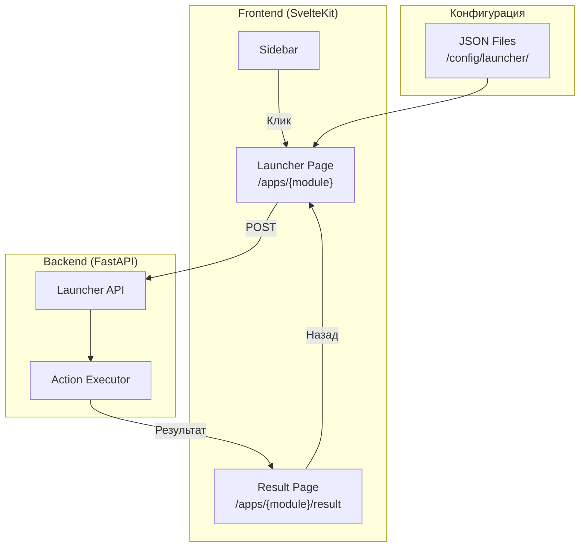
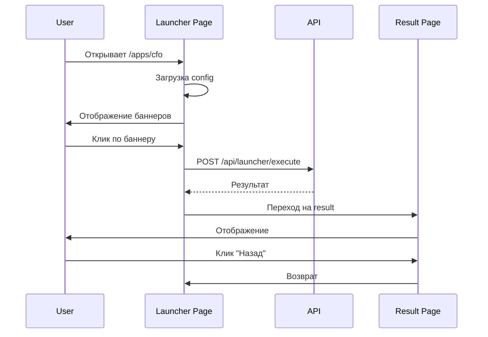

**Проект:** Ядро корпоративной AI-системы  
**Модуль:** User Interface / Launcher  
**Версия:** 1.1  
**Дата:** Февраль 2026

---

## 1. Введение

### 1.1. Назначение

Launcher — компонент системы ADOLF, обеспечивающий двухуровневую навигацию с визуальным выбором действий через баннеры. Пользователь сначала выбирает модуль в боковом меню, затем видит экран с баннерами доступных действий, и только после выбора конкретного баннера запускается исполняемый код.

### 1.2. Проблема и решение

| Проблема | Решение Launcher |
|:---------|:-----------------|
| Автозапуск LLM при открытии модуля | Код запускается только после явного выбора действия |
| Пользователь не понимает возможности модуля | Визуальные баннеры с описанием каждого действия |
| Нет контроля над запуском задач | Двухуровневая навигация: модуль → действие |
| Сложная навигация в чат-интерфейсе | Продуктовый UX вместо чат-ориентированного |

### 1.3. Ключевые принципы

- **Два уровня навигации** — модуль → баннеры действий → результат
- **Прямой запуск** — действие выполняется сразу без дополнительных параметров (MVP)
- **Контроль доступа на уровне модуля** — если пользователь видит модуль, он видит все его баннеры
- **JSON-конфигурация** — статичные файлы конфигурации для MVP
- **Отдельная страница результата** — с навигацией назад

### 1.4. Связь с дизайн-системой

Launcher использует единую дизайн-систему ADOLF на базе **shadcn/ui**.

**Документация:** [UI Design System](/ui/adolf_ui_0_introduction)

Все модули используют единую цветовую схему с `--primary` как акцентным цветом. Визуальная идентификация модулей — через **Lucide-иконки**.

| Модуль | Lucide Icon | React Import |
|:-------|:------------|:-------------|
| Knowledge | `database-search` | `DatabaseSearch` |
| Content Factory | `shirt` | `Shirt` |
| CFO | `chart-candlestick` | `ChartCandlestick` |
| Reputation | `thumbs-up` | `ThumbsUp` |
| Watcher | `hat-glasses` | `HatGlasses` |
| Marketing | `target` | `Target` |
| Scout | `binoculars` | `Binoculars` |
| Lex | `scale` | `Scale` |
| Logistic | `truck` | `Truck` |
| Office | `building-2` | `Building2` |
| Shop | `shopping-cart` | `ShoppingCart` |

Полный реестр иконок: [Приложение A: Реестр иконок](/ui/adolf_ui_appendix_a_icons)

---

## 2. Архитектура

### 2.1. Общая схема



### 2.2. Поток данных



### 2.3. Структура файлов

```
/app/
├── frontend/src/
│   ├── lib/styles/
│   │   └── launcher.css
│   └── routes/apps/
│       ├── +layout.svelte
│       ├── [module]/
│       │   ├── +page.svelte
│       │   └── result/+page.svelte
│       └── components/
│           ├── Banner.svelte
│           ├── BannerGrid.svelte
│           └── ResultView.svelte
├── backend/routes/
│   └── launcher.py
├── config/launcher/
│   ├── cfo.json
│   ├── reputation.json
│   ├── watcher.json
│   ├── content_factory.json
│   ├── marketing.json
│   ├── scout.json
│   ├── knowledge.json
│   ├── lex.json
│   ├── logistic.json
│   ├── office.json
│   └── shop.json
└── executors/launcher/
    ├── __init__.py
    ├── cfo.py
    └── ...
```

---

## 3. Конфигурация баннеров

### 3.1. Структура JSON

```json
{
  "module": "cfo",
  "version": "1.0",
  "title": "Финансы",
  "description": "Финансовая аналитика и отчётность",
  "icon": "chart-candlestick",
  "banners": [
    {
      "id": "pnl_report",
      "title": "P&L отчёт",
      "description": "Прибыль и убытки за период",
      "icon": "file-bar-chart",
      "action": "cfo.pnl_report",
      "enabled": true,
      "badge": null
    }
  ]
}
```

### 3.2. Поля модуля

| Поле | Тип | Обязательно | Описание |
|:-----|:----|:-----------:|:---------|
| `module` | string | ✅ | Идентификатор модуля |
| `version` | string | ✅ | Версия конфигурации |
| `title` | string | ✅ | Заголовок страницы |
| `description` | string | — | Описание модуля |
| `icon` | string | — | Lucide icon name |
| `banners` | array | ✅ | Массив баннеров |

### 3.3. Поля баннера

| Поле | Тип | Обязательно | Описание |
|:-----|:----|:-----------:|:---------|
| `id` | string | ✅ | Уникальный ID |
| `title` | string | ✅ | Заголовок |
| `description` | string | — | Описание действия |
| `icon` | string | — | Lucide icon name |
| `action` | string | ✅ | ID действия (module.action) |
| `enabled` | boolean | — | Активен ли (default: true) |
| `badge` | string | — | Бейдж (NEW, AI, BETA) |

### 3.4. Файлы конфигурации

| Файл | Модуль | Иконка |
|:-----|:-------|:-------|
| `cfo.json` | Финансы | `chart-candlestick` |
| `reputation.json` | Отзывы | `thumbs-up` |
| `watcher.json` | Мониторинг конкурентов | `hat-glasses` |
| `content_factory.json` | Контент | `shirt` |
| `marketing.json` | Маркетинг | `target` |
| `scout.json` | Аналитика ниш | `binoculars` |
| `knowledge.json` | База знаний | `database-search` |
| `lex.json` | Юридический | `scale` |
| `logistic.json` | Логистика | `truck` |
| `office.json` | Дашборд агентов | `building-2` |
| `shop.json` | Интернет-магазин | `shopping-cart` |

---

## 4. Стили

### 4.1. Подключение

Launcher использует единую дизайн-систему shadcn/ui. Подробности: [Раздел 1: Основы](/ui/adolf_ui_1_foundations)

```html
<link rel="stylesheet" href="/styles/shadcn-variables.css">
<link rel="stylesheet" href="/styles/launcher.css">
<script src="https://unpkg.com/lucide@latest"></script>
```

### 4.2. CSS-классы

| Класс | Назначение |
|:------|:-----------|
| `.launcher-page` | Контейнер страницы |
| `.launcher-header` | Заголовок с описанием |
| `.banner-grid` | Сетка баннеров (CSS Grid) |
| `.banner` | Карточка баннера |
| `.banner--disabled` | Отключённый баннер |
| `.banner__icon` | Иконка баннера |
| `.banner__title` | Заголовок баннера |
| `.banner__description` | Описание |
| `.banner__badge` | Бейдж (AI, NEW) |
| `.back-button` | Кнопка назад |
| `.loading-overlay` | Оверлей загрузки |

### 4.3. Стилизация

Все компоненты используют CSS-переменные shadcn/ui:

```css
.banner {
  background: var(--card);
  border: 1px solid var(--border);
  border-radius: var(--radius-lg);
}

.banner:hover {
  border-color: var(--primary);
  box-shadow: var(--shadow-lg);
}

.banner__badge {
  background: var(--primary);
  color: var(--primary-foreground);
}
```

Подробнее о паттернах: [Раздел 4: Паттерны компоновки](/ui/adolf_ui_4_layout_patterns)

---

## 5. Backend API

### 5.1. Endpoints

| Endpoint | Method | Описание |
|:---------|:-------|:---------|
| `/api/launcher/config/{module}` | GET | Конфигурация баннеров |
| `/api/launcher/execute` | POST | Выполнение действия |
| `/api/launcher/modules` | GET | Список доступных модулей |

### 5.2. Модели данных

**ExecuteRequest:**

```json
{
  "module": "cfo",
  "action": "cfo.pnl_report",
  "banner_id": "pnl_report"
}
```

**ExecuteResponse:**

```json
{
  "success": true,
  "action": "cfo.pnl_report",
  "title": "P&L отчёт",
  "data": { },
  "timestamp": "2026-02-16T12:00:00Z",
  "error": null
}
```

### 5.3. Реализация

Реализация API соответствует стандартам [FastAPI Reference](/adolf_fastapi_reference):

- Авторизация через `get_current_user`
- Проверка доступа через `check_module_access`
- Динамическая загрузка executors
- Стандартная обработка ошибок

---

## 6. Executors

### 6.1. Структура

Каждый модуль имеет свой файл executor в `/executors/launcher/`:

```python
# executors/launcher/cfo.py

async def pnl_report(user: dict) -> dict:
    """P&L отчёт за текущую неделю."""
    return {"type": "pnl_report", "data": ...}

async def abc_analysis(user: dict) -> dict:
    """ABC-анализ SKU."""
    return {"type": "abc_analysis", "data": ...}
```

### 6.2. Соглашения

- Имя функции = последняя часть `action` (после точки)
- Обязательный параметр `user: dict`
- Возвращает `dict` с результатом
- Async функции

---

## 7. Версия 2.0 (планы)

### 7.1. Конфигурация в PostgreSQL

| Таблица | Назначение |
|:--------|:-----------|
| `launcher_modules` | Модули |
| `launcher_banners` | Баннеры |

### 7.2. Расширенные типы действий

| Тип | Описание |
|:----|:---------|
| `direct` | Прямой запуск (MVP) |
| `form` | Форма параметров перед запуском |
| `chat` | Переход в чат с Pipeline |
| `redirect` | Внешний URL |

### 7.3. Три уровня навигации

```
Модуль → Категория → Баннер → Результат
```

---

## 8. Резюме

### MVP (v1.1)

| Компонент | Статус |
|:----------|:------:|
| JSON-конфигурация | ✅ |
| Двухуровневая навигация | ✅ |
| Прямой запуск | ✅ |
| Страница результата | ✅ |
| shadcn/ui стили | ✅ |
| Lucide иконки | ✅ |
| 11 модулей | ✅ |

### Планы (v2.0)

| Компонент | Статус |
|:----------|:------:|
| PostgreSQL конфигурация | 📋 |
| Форма параметров | 📋 |
| Три уровня навигации | 📋 |
| Переход в чат | 📋 |

---

## 9. Связанные документы

| Документ | Описание |
|:---------|:---------|
| [UI: Введение](/ui/adolf_ui_0_introduction) | Обзор дизайн-системы |
| [UI: Основы](/ui/adolf_ui_1_foundations) | CSS-переменные, цвета |
| [UI: Тематизация](/ui/adolf_ui_2_module_theming) | Иконки модулей |
| [UI: Паттерны](/ui/adolf_ui_4_layout_patterns) | Паттерны компоновки |
| [UI: Иконки](/ui/adolf_ui_appendix_a_icons) | Реестр Lucide-иконок |
| [FastAPI Reference](/adolf_fastapi_reference) | Стандарты API |

---

**Версия:** 1.1  
**Дата:** Февраль 2026  
**Статус:** Актуален
