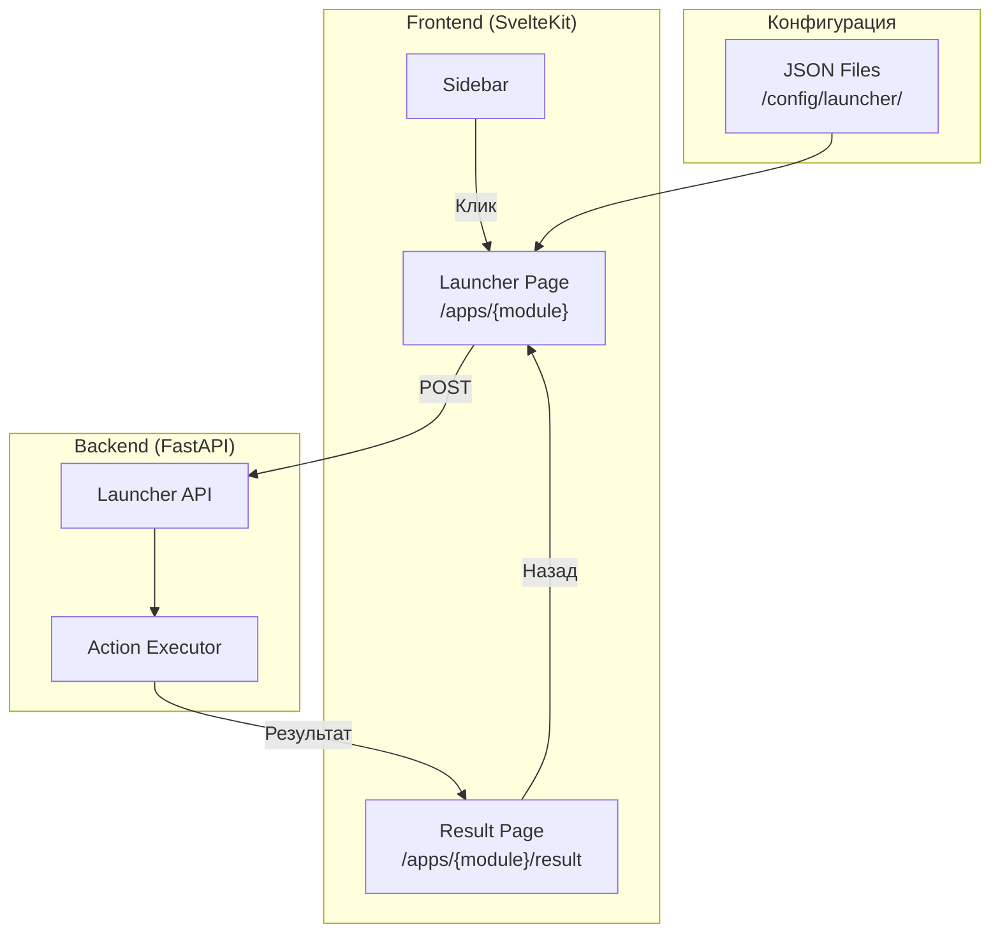
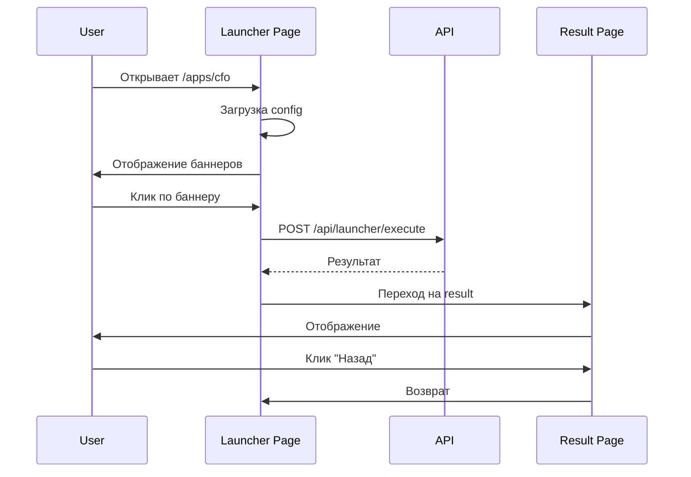

# ADOLF CORE — Часть 3.1: Launcher — Система баннерного подменю

**Проект:** Ядро корпоративной AI-системы  
**Модуль:** User Interface / Launcher  
**Версия:** 1.0  
**Дата:** Январь 2026

---

## 1. Введение

### 1.1. Назначение

Launcher — компонент системы ADOLF, обеспечивающий двухуровневую навигацию с визуальным выбором действий через баннеры. Пользователь сначала выбирает модуль в боковом меню, затем видит экран с баннерами доступных действий, и только после выбора конкретного баннера запускается исполняемый код.

### 1.2. Проблема и решение

| Проблема | Решение Launcher |
|----------|------------------|
| Автозапуск LLM при открытии модуля | Код запускается только после явного выбора действия |
| Пользователь не понимает возможности модуля | Визуальные баннеры с описанием каждого действия |
| Нет контроля над запуском задач | Двухуровневая навигация: модуль → действие |
| Сложная навигация в чат-интерфейсе | Продуктовый UX вместо чат-ориентированного |

### 1.3. Ключевые принципы

- **Два уровня навигации** — модуль → баннеры действий → результат
- **Прямой запуск** — действие выполняется сразу без дополнительных параметров (MVP)
- **Контроль доступа на уровне модуля** — если пользователь видит модуль, он видит все его баннеры
- **JSON-конфигурация** — статичные файлы конфигурации для MVP
- **Отдельная страница результата** — с навигацией назад

### 1.4. Связь с UI Reference

Launcher использует дизайн-систему **shadcn/ui** и **Lucide Icons**.

**Базовые стили:** `ui_reference/base/shadcn-variables.css`  
**Design tokens:** `ui_reference/base/shadcn-tokens.json`

| Модуль | CSS Variable | Lucide Icon | HEX |
|--------|--------------|-------------|-----|
| CFO | `--module-cfo` | `line-chart` | #22C55E |
| Reputation | `--module-reputation` | `thumbs-up` | #F97316 |
| Watcher | `--module-watcher` | `eye` | #EF4444 |
| Content Factory | `--module-content` | `factory` | #A855F7 |
| Marketing | `--module-marketing` | `megaphone` | #EC4899 |
| Scout | `--module-scout` | `search` | #06B6D4 |
| Knowledge | `--module-knowledge` | `book-open-check` | #3B82F6 |
| Lex | `--module-lex` | `scale` | #64748B |

---

## 2. Архитектура

### 2.1. Общая схема



### 2.2. Поток данных



### 2.3. Структура файлов

```
/app/
├── frontend/src/
│   ├── lib/styles/
│   │   └── launcher.css
│   └── routes/apps/
│       ├── +layout.svelte
│       ├── [module]/
│       │   ├── +page.svelte
│       │   └── result/+page.svelte
│       └── components/
│           ├── Banner.svelte
│           ├── BannerGrid.svelte
│           └── ResultView.svelte
├── backend/routes/
│   └── launcher.py
├── config/launcher/
│   ├── cfo.json
│   ├── reputation.json
│   ├── watcher.json
│   ├── content_factory.json
│   ├── marketing.json
│   ├── scout.json
│   ├── knowledge.json
│   └── lex.json
└── executors/launcher/
    ├── __init__.py
    ├── cfo.py
    └── ...
```

---

## 3. Конфигурация баннеров

### 3.1. Структура JSON

```json
{
  "module": "cfo",
  "version": "1.0",
  "title": "Финансы",
  "description": "Финансовая аналитика и отчётность",
  "icon": "line-chart",
  "banners": [
    {
      "id": "pnl_report",
      "title": "P&L отчёт",
      "description": "Прибыль и убытки за период",
      "icon": "file-bar-chart",
      "action": "cfo.pnl_report",
      "enabled": true,
      "badge": null
    }
  ]
}
```

### 3.2. Поля модуля

| Поле | Тип | Обязательно | Описание |
|------|-----|:-----------:|----------|
| `module` | string | ✅ | Идентификатор модуля |
| `version` | string | ✅ | Версия конфигурации |
| `title` | string | ✅ | Заголовок страницы |
| `description` | string | — | Описание модуля |
| `icon` | string | — | Lucide icon name |
| `banners` | array | ✅ | Массив баннеров |

### 3.3. Поля баннера

| Поле | Тип | Обязательно | Описание |
|------|-----|:-----------:|----------|
| `id` | string | ✅ | Уникальный ID |
| `title` | string | ✅ | Заголовок |
| `description` | string | — | Описание действия |
| `icon` | string | — | Lucide icon name |
| `action` | string | ✅ | ID действия (module.action) |
| `enabled` | boolean | — | Активен ли (default: true) |
| `badge` | string | — | Бейдж (NEW, AI, BETA) |

### 3.4. Файлы конфигурации

Конфигурации для всех модулей размещаются в `/config/launcher/`:

| Файл | Модуль |
|------|--------|
| `cfo.json` | Финансы |
| `reputation.json` | Отзывы |
| `watcher.json` | Мониторинг цен |
| `content_factory.json` | Контент |
| `marketing.json` | Маркетинг |
| `scout.json` | Аналитика |
| `knowledge.json` | База знаний |
| `lex.json` | Юридический |

---

## 4. Стили

### 4.1. Подключение

```html
<link rel="stylesheet" href="/ui_reference/base/shadcn-variables.css">
<link rel="stylesheet" href="/styles/launcher.css">
<script src="https://unpkg.com/lucide@latest"></script>
```

### 4.2. CSS-классы

Launcher использует CSS переменные из `shadcn-variables.css`:

| Класс | Назначение |
|-------|------------|
| `.launcher-page` | Контейнер страницы |
| `.launcher-header` | Заголовок с описанием |
| `.banner-grid` | Сетка баннеров (CSS Grid) |
| `.banner` | Карточка баннера |
| `.banner--disabled` | Отключённый баннер |
| `.banner__icon` | Иконка баннера |
| `.banner__title` | Заголовок баннера |
| `.banner__description` | Описание |
| `.banner__badge` | Бейдж (AI, NEW) |
| `.back-button` | Кнопка назад |
| `.loading-overlay` | Оверлей загрузки |

### 4.3. Module Color Variants

Цвет баннера определяется атрибутом `data-module`:

```html
<button class="banner" data-module="cfo">...</button>
```

CSS автоматически применяет `--module-color` и `--module-color-light` из `shadcn-variables.css`.

---

## 5. Backend API

### 5.1. Endpoints

| Endpoint | Method | Описание |
|----------|--------|----------|
| `/api/launcher/config/{module}` | GET | Конфигурация баннеров |
| `/api/launcher/execute` | POST | Выполнение действия |
| `/api/launcher/modules` | GET | Список доступных модулей |

### 5.2. Модели данных

**ExecuteRequest:**
```json
{
  "module": "cfo",
  "action": "cfo.pnl_report",
  "banner_id": "pnl_report"
}
```

**ExecuteResponse:**
```json
{
  "success": true,
  "action": "cfo.pnl_report",
  "title": "P&L отчёт",
  "data": { ... },
  "timestamp": "2026-01-31T12:00:00Z",
  "error": null
}
```

### 5.3. Реализация

Реализация API соответствует стандартам FastAPI из `adolf_fastapi_reference_v1_0.md`:

- Авторизация через `get_current_user`
- Проверка доступа через `check_module_access`
- Динамическая загрузка executors
- Стандартная обработка ошибок

---

## 6. Executors

### 6.1. Структура

Каждый модуль имеет свой файл executor в `/executors/launcher/`:

```python
# executors/launcher/cfo.py

async def pnl_report(user: dict) -> dict:
    """P&L отчёт за текущую неделю."""
    # Логика формирования отчёта
    return {"type": "pnl_report", "data": ...}

async def abc_analysis(user: dict) -> dict:
    """ABC-анализ SKU."""
    return {"type": "abc_analysis", "data": ...}
```

### 6.2. Соглашения

- Имя функции = последняя часть `action` (после точки)
- Обязательный параметр `user: dict`
- Возвращает `dict` с результатом
- Async функции

---

## 7. Версия 2.0 (планы)

### 7.1. Конфигурация в PostgreSQL

| Таблица | Назначение |
|---------|------------|
| `launcher_modules` | Модули |
| `launcher_banners` | Баннеры |

### 7.2. Расширенные типы действий

| Тип | Описание |
|-----|----------|
| `direct` | Прямой запуск (MVP) |
| `form` | Форма параметров перед запуском |
| `chat` | Переход в чат с Pipeline |
| `redirect` | Внешний URL |

### 7.3. Три уровня навигации

```
Модуль → Категория → Баннер → Результат
```

---

## 8. Резюме

### MVP (v1.0)

| Компонент | Статус |
|-----------|:------:|
| JSON-конфигурация | ✅ |
| Двухуровневая навигация | ✅ |
| Прямой запуск | ✅ |
| Страница результата | ✅ |
| shadcn/ui стили | ✅ |
| Lucide иконки | ✅ |

### Планы (v2.0)

| Компонент | Статус |
|-----------|:------:|
| PostgreSQL конфигурация | 📋 |
| Форма параметров | 📋 |
| Три уровня навигации | 📋 |
| Переход в чат | 📋 |

---

## 9. Связанные документы

| Документ | Описание |
|----------|----------|
| `ui_reference/base/shadcn-variables.css` | CSS переменные дизайн-системы |
| `ui_reference/base/shadcn-tokens.json` | Design tokens |
| `ui_reference/README.md` | Обзор UI Reference |
| `adolf_fastapi_reference_v1_0.md` | Стандарты FastAPI |

---

**Версия:** 1.0  
**Дата:** Январь 2026  
**Статус:** Утверждён
