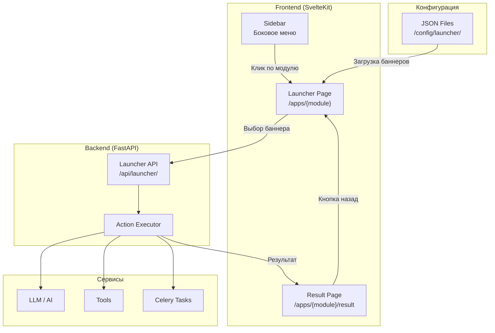
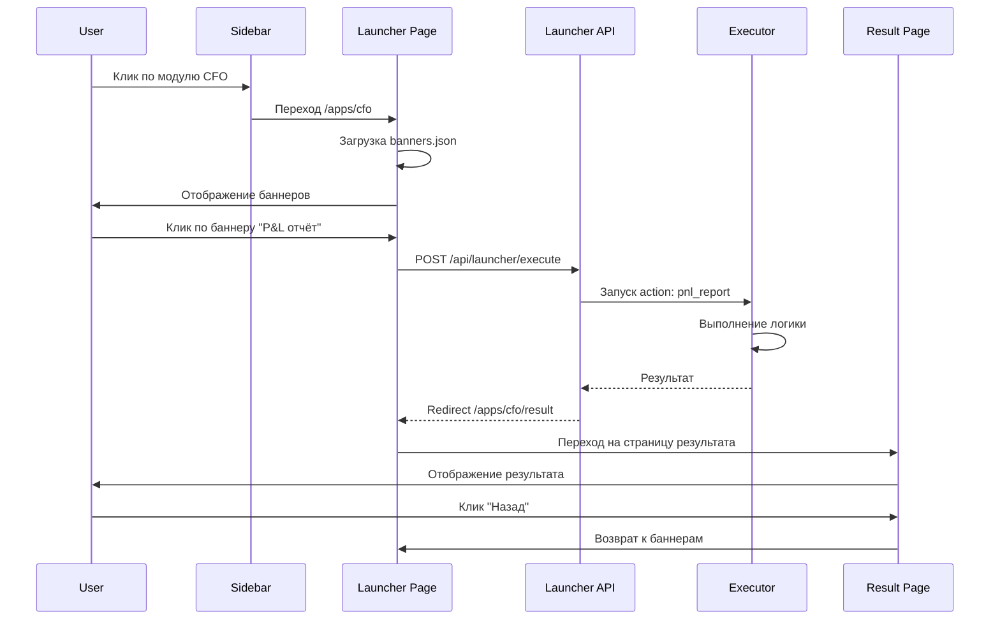
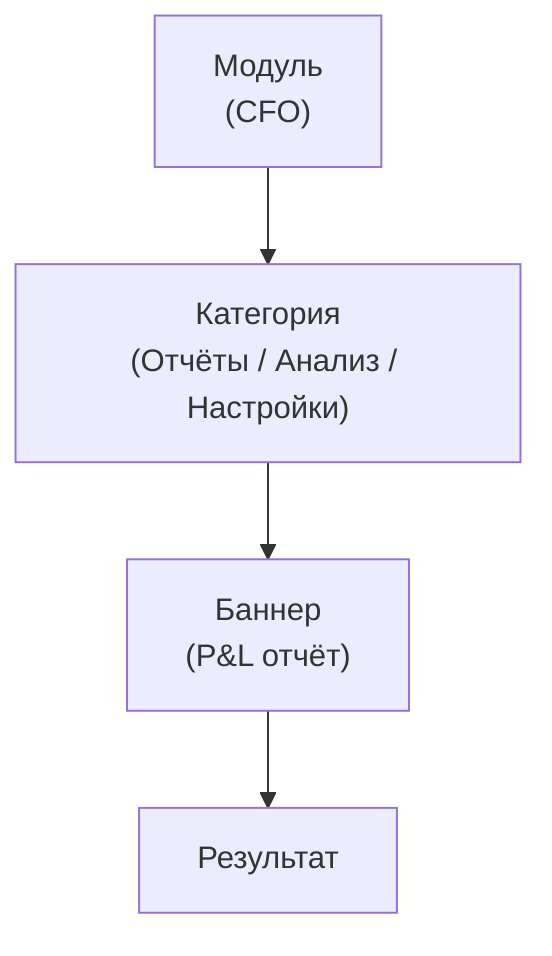

# ADOLF CORE — Часть 3.1: Launcher — Система баннерного подменю

**Проект:** Ядро корпоративной AI-системы  
**Модуль:** User Interface / Launcher  
**Версия:** 1.0  
**Дата:** Январь 2026

---

## 1. Введение

### 1.1. Назначение

Launcher — компонент системы ADOLF, обеспечивающий двухуровневую навигацию с визуальным выбором действий через баннеры. Пользователь сначала выбирает модуль в боковом меню, затем видит экран с баннерами доступных действий, и только после выбора конкретного баннера запускается исполняемый код.

### 1.2. Проблема и решение

| Проблема | Решение Launcher |
|----------|------------------|
| Автозапуск LLM при открытии модуля | Код запускается только после явного выбора действия |
| Пользователь не понимает возможности модуля | Визуальные баннеры с описанием каждого действия |
| Нет контроля над запуском задач | Двухуровневая навигация: модуль → действие |
| Сложная навигация в чат-интерфейсе | Продуктовый UX вместо чат-ориентированного |

### 1.3. Ключевые принципы

- **Два уровня навигации** — модуль → баннеры действий → результат
- **Прямой запуск** — действие выполняется сразу без дополнительных параметров (MVP)
- **Контроль доступа на уровне модуля** — если пользователь видит модуль, он видит все его баннеры
- **JSON-конфигурация** — статичные файлы конфигурации для MVP
- **Отдельная страница результата** — с навигацией назад

---

## 2. Архитектура

### 2.1. Общая схема



### 2.2. Поток данных



### 2.3. Структура файлов

```
/app/
├── frontend/
│   └── src/
│       └── routes/
│           └── apps/
│               ├── +layout.svelte          # Общий layout для Launcher
│               ├── [module]/
│               │   ├── +page.svelte         # Страница баннеров
│               │   └── result/
│               │       └── +page.svelte     # Страница результата
│               └── components/
│                   ├── Banner.svelte        # Компонент баннера
│                   ├── BannerGrid.svelte    # Сетка баннеров
│                   └── ResultView.svelte    # Отображение результата
├── backend/
│   └── routes/
│       └── launcher.py                      # API endpoints
├── config/
│   └── launcher/
│       ├── cfo.json                         # Баннеры CFO
│       ├── reputation.json                  # Баннеры Reputation
│       ├── watcher.json                     # Баннеры Watcher
│       └── ...                              # Другие модули
└── executors/
    └── launcher/
        ├── __init__.py
        ├── cfo.py                           # Исполнители CFO
        ├── reputation.py                    # Исполнители Reputation
        └── ...                              # Другие модули
```

---

## 3. Конфигурация баннеров

### 3.1. JSON-схема

```json
{
  "$schema": "http://json-schema.org/draft-07/schema#",
  "type": "object",
  "required": ["module", "version", "banners"],
  "properties": {
    "module": {
      "type": "string",
      "description": "Идентификатор модуля"
    },
    "version": {
      "type": "string",
      "description": "Версия конфигурации"
    },
    "title": {
      "type": "string",
      "description": "Заголовок страницы"
    },
    "description": {
      "type": "string",
      "description": "Описание модуля"
    },
    "banners": {
      "type": "array",
      "items": {
        "type": "object",
        "required": ["id", "title", "action"],
        "properties": {
          "id": {
            "type": "string",
            "description": "Уникальный идентификатор баннера"
          },
          "title": {
            "type": "string",
            "description": "Заголовок баннера"
          },
          "description": {
            "type": "string",
            "description": "Описание действия"
          },
          "icon": {
            "type": "string",
            "description": "Иконка (emoji или icon name)"
          },
          "color": {
            "type": "string",
            "description": "Цвет баннера (CSS)"
          },
          "action": {
            "type": "string",
            "description": "Идентификатор действия для executor"
          },
          "enabled": {
            "type": "boolean",
            "default": true,
            "description": "Активен ли баннер"
          },
          "badge": {
            "type": "string",
            "description": "Бейдж (например, 'NEW', 'BETA')"
          }
        }
      }
    }
  }
}
```

### 3.2. Структура конфигурационного файла

```json
{
  "module": "cfo",
  "version": "1.0",
  "title": "Финансы",
  "description": "Финансовая аналитика и отчётность",
  "banners": [
    {
      "id": "pnl_report",
      "title": "P&L отчёт",
      "description": "Прибыль и убытки за период",
      "icon": "📊",
      "color": "#4CAF50",
      "action": "cfo.pnl_report"
    },
    {
      "id": "abc_analysis",
      "title": "ABC-анализ",
      "description": "Классификация SKU по прибыльности",
      "icon": "📈",
      "color": "#2196F3",
      "action": "cfo.abc_analysis"
    }
  ]
}
```

### 3.3. Расположение файлов конфигурации

| Модуль | Файл конфигурации |
|--------|-------------------|
| CFO | `/config/launcher/cfo.json` |
| Reputation | `/config/launcher/reputation.json` |
| Watcher | `/config/launcher/watcher.json` |
| Content Factory | `/config/launcher/content_factory.json` |
| Marketing | `/config/launcher/marketing.json` |
| Scout | `/config/launcher/scout.json` |
| Knowledge | `/config/launcher/knowledge.json` |
| Lex | `/config/launcher/lex.json` |

---

## 4. Frontend-компоненты

### 4.1. Страница баннеров (+page.svelte)

```svelte
<!-- frontend/src/routes/apps/[module]/+page.svelte -->
<script lang="ts">
  import { page } from '$app/stores';
  import { goto } from '$app/navigation';
  import BannerGrid from '../components/BannerGrid.svelte';
  import { onMount } from 'svelte';
  
  interface Banner {
    id: string;
    title: string;
    description: string;
    icon: string;
    color: string;
    action: string;
    enabled: boolean;
    badge?: string;
  }
  
  interface LauncherConfig {
    module: string;
    version: string;
    title: string;
    description: string;
    banners: Banner[];
  }
  
  let config: LauncherConfig | null = null;
  let loading = false;
  let error: string | null = null;
  
  $: module = $page.params.module;
  
  onMount(async () => {
    await loadConfig();
  });
  
  async function loadConfig() {
    try {
      const res = await fetch(`/api/launcher/config/${module}`);
      if (!res.ok) throw new Error('Failed to load config');
      config = await res.json();
    } catch (e) {
      error = 'Не удалось загрузить конфигурацию';
    }
  }
  
  async function handleBannerClick(banner: Banner) {
    if (!banner.enabled) return;
    
    loading = true;
    error = null;
    
    try {
      const res = await fetch('/api/launcher/execute', {
        method: 'POST',
        headers: { 'Content-Type': 'application/json' },
        body: JSON.stringify({
          module,
          action: banner.action,
          banner_id: banner.id
        })
      });
      
      if (!res.ok) throw new Error('Execution failed');
      
      const result = await res.json();
      
      // Сохраняем результат в sessionStorage для страницы результата
      sessionStorage.setItem('launcher_result', JSON.stringify(result));
      
      // Переход на страницу результата
      goto(`/apps/${module}/result`);
      
    } catch (e) {
      error = 'Ошибка выполнения действия';
    } finally {
      loading = false;
    }
  }
  
  function goBack() {
    history.back();
  }
</script>

<div class="launcher-page">
  <header class="launcher-header">
    <button class="back-button" on:click={goBack}>
      ← Назад
    </button>
    {#if config}
      <div class="header-content">
        <h1>{config.title}</h1>
        <p>{config.description}</p>
      </div>
    {/if}
  </header>
  
  {#if error}
    <div class="error-message">{error}</div>
  {/if}
  
  {#if loading}
    <div class="loading-overlay">
      <div class="spinner"></div>
      <p>Выполняется...</p>
    </div>
  {/if}
  
  {#if config}
    <BannerGrid 
      banners={config.banners} 
      on:select={(e) => handleBannerClick(e.detail)}
    />
  {/if}
</div>

<style>
  .launcher-page {
    padding: 24px;
    max-width: 1200px;
    margin: 0 auto;
  }
  
  .launcher-header {
    margin-bottom: 32px;
  }
  
  .back-button {
    background: none;
    border: none;
    color: var(--text-secondary);
    cursor: pointer;
    font-size: 14px;
    padding: 8px 0;
    margin-bottom: 16px;
  }
  
  .back-button:hover {
    color: var(--text-primary);
  }
  
  .header-content h1 {
    font-size: 28px;
    font-weight: 600;
    margin: 0 0 8px 0;
  }
  
  .header-content p {
    color: var(--text-secondary);
    margin: 0;
  }
  
  .error-message {
    background: var(--error-bg);
    color: var(--error-text);
    padding: 12px 16px;
    border-radius: 8px;
    margin-bottom: 24px;
  }
  
  .loading-overlay {
    position: fixed;
    top: 0;
    left: 0;
    right: 0;
    bottom: 0;
    background: rgba(0, 0, 0, 0.5);
    display: flex;
    flex-direction: column;
    align-items: center;
    justify-content: center;
    z-index: 1000;
  }
  
  .spinner {
    width: 48px;
    height: 48px;
    border: 4px solid var(--bg-secondary);
    border-top-color: var(--accent);
    border-radius: 50%;
    animation: spin 1s linear infinite;
  }
  
  .loading-overlay p {
    color: white;
    margin-top: 16px;
  }
  
  @keyframes spin {
    to { transform: rotate(360deg); }
  }
</style>
```

### 4.2. Компонент баннера (Banner.svelte)

```svelte
<!-- frontend/src/routes/apps/components/Banner.svelte -->
<script lang="ts">
  import { createEventDispatcher } from 'svelte';
  
  export let id: string;
  export let title: string;
  export let description: string = '';
  export let icon: string = '📄';
  export let color: string = '#6366f1';
  export let enabled: boolean = true;
  export let badge: string | undefined = undefined;
  
  const dispatch = createEventDispatcher();
  
  function handleClick() {
    if (enabled) {
      dispatch('click', { id, title });
    }
  }
</script>

<button 
  class="banner" 
  class:disabled={!enabled}
  style="--banner-color: {color}"
  on:click={handleClick}
>
  <div class="banner-icon">{icon}</div>
  <div class="banner-content">
    <h3>{title}</h3>
    {#if description}
      <p>{description}</p>
    {/if}
  </div>
  {#if badge}
    <span class="banner-badge">{badge}</span>
  {/if}
</button>

<style>
  .banner {
    display: flex;
    align-items: flex-start;
    gap: 16px;
    padding: 20px;
    background: var(--bg-secondary);
    border: 1px solid var(--border);
    border-radius: 12px;
    cursor: pointer;
    transition: all 0.2s ease;
    text-align: left;
    width: 100%;
    position: relative;
  }
  
  .banner:hover:not(.disabled) {
    transform: translateY(-4px);
    box-shadow: 0 8px 24px rgba(0, 0, 0, 0.12);
    border-color: var(--banner-color);
  }
  
  .banner.disabled {
    opacity: 0.5;
    cursor: not-allowed;
  }
  
  .banner-icon {
    font-size: 32px;
    line-height: 1;
    flex-shrink: 0;
  }
  
  .banner-content {
    flex: 1;
    min-width: 0;
  }
  
  .banner-content h3 {
    font-size: 16px;
    font-weight: 600;
    margin: 0 0 4px 0;
    color: var(--text-primary);
  }
  
  .banner-content p {
    font-size: 14px;
    color: var(--text-secondary);
    margin: 0;
    line-height: 1.4;
  }
  
  .banner-badge {
    position: absolute;
    top: 12px;
    right: 12px;
    background: var(--banner-color);
    color: white;
    font-size: 10px;
    font-weight: 600;
    padding: 2px 8px;
    border-radius: 4px;
    text-transform: uppercase;
  }
</style>
```

### 4.3. Сетка баннеров (BannerGrid.svelte)

```svelte
<!-- frontend/src/routes/apps/components/BannerGrid.svelte -->
<script lang="ts">
  import { createEventDispatcher } from 'svelte';
  import Banner from './Banner.svelte';
  
  interface BannerData {
    id: string;
    title: string;
    description: string;
    icon: string;
    color: string;
    action: string;
    enabled: boolean;
    badge?: string;
  }
  
  export let banners: BannerData[] = [];
  
  const dispatch = createEventDispatcher();
  
  function handleBannerClick(banner: BannerData) {
    dispatch('select', banner);
  }
</script>

<div class="banner-grid">
  {#each banners as banner (banner.id)}
    <Banner
      {...banner}
      on:click={() => handleBannerClick(banner)}
    />
  {/each}
</div>

<style>
  .banner-grid {
    display: grid;
    grid-template-columns: repeat(auto-fill, minmax(280px, 1fr));
    gap: 16px;
  }
  
  @media (max-width: 640px) {
    .banner-grid {
      grid-template-columns: 1fr;
    }
  }
</style>
```

### 4.4. Страница результата (+page.svelte)

```svelte
<!-- frontend/src/routes/apps/[module]/result/+page.svelte -->
<script lang="ts">
  import { page } from '$app/stores';
  import { goto } from '$app/navigation';
  import { onMount } from 'svelte';
  import ResultView from '../../components/ResultView.svelte';
  
  interface ExecutionResult {
    success: boolean;
    action: string;
    title: string;
    data: any;
    timestamp: string;
    error?: string;
  }
  
  let result: ExecutionResult | null = null;
  
  $: module = $page.params.module;
  
  onMount(() => {
    const stored = sessionStorage.getItem('launcher_result');
    if (stored) {
      result = JSON.parse(stored);
    } else {
      // Если нет результата, возвращаемся к баннерам
      goto(`/apps/${module}`);
    }
  });
  
  function goBack() {
    sessionStorage.removeItem('launcher_result');
    goto(`/apps/${module}`);
  }
  
  function goHome() {
    sessionStorage.removeItem('launcher_result');
    goto('/');
  }
</script>

<div class="result-page">
  <header class="result-header">
    <button class="back-button" on:click={goBack}>
      ← Вернуться к выбору
    </button>
    {#if result}
      <h1>{result.title}</h1>
    {/if}
  </header>
  
  {#if result}
    {#if result.success}
      <ResultView data={result.data} />
    {:else}
      <div class="error-container">
        <div class="error-icon">❌</div>
        <h2>Ошибка выполнения</h2>
        <p>{result.error || 'Неизвестная ошибка'}</p>
        <button class="retry-button" on:click={goBack}>
          Попробовать снова
        </button>
      </div>
    {/if}
  {/if}
  
  <footer class="result-footer">
    <button class="secondary-button" on:click={goBack}>
      ← Назад к модулю
    </button>
    <button class="secondary-button" on:click={goHome}>
      На главную
    </button>
  </footer>
</div>

<style>
  .result-page {
    padding: 24px;
    max-width: 1200px;
    margin: 0 auto;
    min-height: 100vh;
    display: flex;
    flex-direction: column;
  }
  
  .result-header {
    margin-bottom: 24px;
  }
  
  .back-button {
    background: none;
    border: none;
    color: var(--text-secondary);
    cursor: pointer;
    font-size: 14px;
    padding: 8px 0;
    margin-bottom: 16px;
  }
  
  .back-button:hover {
    color: var(--text-primary);
  }
  
  .result-header h1 {
    font-size: 24px;
    font-weight: 600;
    margin: 0;
  }
  
  .error-container {
    text-align: center;
    padding: 48px 24px;
    background: var(--bg-secondary);
    border-radius: 12px;
  }
  
  .error-icon {
    font-size: 48px;
    margin-bottom: 16px;
  }
  
  .error-container h2 {
    font-size: 20px;
    margin: 0 0 8px 0;
  }
  
  .error-container p {
    color: var(--text-secondary);
    margin: 0 0 24px 0;
  }
  
  .retry-button {
    background: var(--accent);
    color: white;
    border: none;
    padding: 12px 24px;
    border-radius: 8px;
    cursor: pointer;
    font-size: 14px;
  }
  
  .result-footer {
    margin-top: auto;
    padding-top: 24px;
    display: flex;
    gap: 16px;
    border-top: 1px solid var(--border);
  }
  
  .secondary-button {
    background: var(--bg-secondary);
    border: 1px solid var(--border);
    padding: 12px 24px;
    border-radius: 8px;
    cursor: pointer;
    font-size: 14px;
    color: var(--text-primary);
  }
  
  .secondary-button:hover {
    background: var(--bg-tertiary);
  }
</style>
```

---

## 5. Backend API

### 5.1. API Endpoints

| Endpoint | Method | Описание |
|----------|--------|----------|
| `/api/launcher/config/{module}` | GET | Получение конфигурации баннеров модуля |
| `/api/launcher/execute` | POST | Выполнение действия |
| `/api/launcher/modules` | GET | Список доступных модулей |

### 5.2. Реализация API

```python
# backend/routes/launcher.py
"""
Launcher API — система баннерного подменю.
"""

from fastapi import APIRouter, HTTPException, Depends
from pydantic import BaseModel
from typing import Optional, Any
import json
from pathlib import Path
from datetime import datetime

from core.auth import get_current_user
from core.permissions import check_module_access

router = APIRouter(prefix="/api/launcher", tags=["launcher"])

# Путь к конфигурациям
CONFIG_PATH = Path("/app/config/launcher")


class ExecuteRequest(BaseModel):
    """Запрос на выполнение действия."""
    module: str
    action: str
    banner_id: str


class ExecuteResponse(BaseModel):
    """Ответ выполнения действия."""
    success: bool
    action: str
    title: str
    data: Any
    timestamp: str
    error: Optional[str] = None


class BannerConfig(BaseModel):
    """Конфигурация баннера."""
    id: str
    title: str
    description: str
    icon: str
    color: str
    action: str
    enabled: bool = True
    badge: Optional[str] = None


class ModuleConfig(BaseModel):
    """Конфигурация модуля."""
    module: str
    version: str
    title: str
    description: str
    banners: list[BannerConfig]


@router.get("/config/{module}", response_model=ModuleConfig)
async def get_module_config(
    module: str,
    user: dict = Depends(get_current_user)
):
    """
    Получение конфигурации баннеров модуля.
    
    Проверяет доступ пользователя к модулю перед возвратом конфигурации.
    """
    # Проверка доступа к модулю
    if not check_module_access(user["role"], module):
        raise HTTPException(
            status_code=403,
            detail=f"Access denied to module: {module}"
        )
    
    # Загрузка конфигурации
    config_file = CONFIG_PATH / f"{module}.json"
    
    if not config_file.exists():
        raise HTTPException(
            status_code=404,
            detail=f"Configuration not found for module: {module}"
        )
    
    try:
        with open(config_file, "r", encoding="utf-8") as f:
            config = json.load(f)
        return ModuleConfig(**config)
    except json.JSONDecodeError as e:
        raise HTTPException(
            status_code=500,
            detail=f"Invalid configuration format: {str(e)}"
        )


@router.post("/execute", response_model=ExecuteResponse)
async def execute_action(
    request: ExecuteRequest,
    user: dict = Depends(get_current_user)
):
    """
    Выполнение действия по клику на баннер.
    
    Загружает соответствующий executor и выполняет action.
    """
    # Проверка доступа к модулю
    if not check_module_access(user["role"], request.module):
        raise HTTPException(
            status_code=403,
            detail=f"Access denied to module: {request.module}"
        )
    
    # Загрузка конфигурации для получения title
    config_file = CONFIG_PATH / f"{request.module}.json"
    
    if not config_file.exists():
        raise HTTPException(
            status_code=404,
            detail=f"Module not found: {request.module}"
        )
    
    with open(config_file, "r", encoding="utf-8") as f:
        config = json.load(f)
    
    # Поиск баннера
    banner = next(
        (b for b in config["banners"] if b["id"] == request.banner_id),
        None
    )
    
    if not banner:
        raise HTTPException(
            status_code=404,
            detail=f"Banner not found: {request.banner_id}"
        )
    
    if not banner.get("enabled", True):
        raise HTTPException(
            status_code=400,
            detail="Banner is disabled"
        )
    
    # Выполнение действия
    try:
        result = await _execute_action(
            module=request.module,
            action=request.action,
            user=user
        )
        
        return ExecuteResponse(
            success=True,
            action=request.action,
            title=banner["title"],
            data=result,
            timestamp=datetime.utcnow().isoformat()
        )
        
    except Exception as e:
        return ExecuteResponse(
            success=False,
            action=request.action,
            title=banner["title"],
            data=None,
            timestamp=datetime.utcnow().isoformat(),
            error=str(e)
        )


@router.get("/modules")
async def get_available_modules(
    user: dict = Depends(get_current_user)
):
    """
    Получение списка доступных модулей для пользователя.
    """
    all_modules = [
        {"id": "cfo", "title": "Финансы", "icon": "💰"},
        {"id": "reputation", "title": "Отзывы", "icon": "⭐"},
        {"id": "watcher", "title": "Мониторинг цен", "icon": "🔍"},
        {"id": "content_factory", "title": "Контент", "icon": "📝"},
        {"id": "marketing", "title": "Маркетинг", "icon": "📢"},
        {"id": "scout", "title": "Аналитика", "icon": "📊"},
        {"id": "knowledge", "title": "База знаний", "icon": "📚"},
        {"id": "lex", "title": "Юридический", "icon": "⚖️"},
    ]
    
    # Фильтрация по доступу
    available = [
        m for m in all_modules
        if check_module_access(user["role"], m["id"])
    ]
    
    return {"modules": available}


async def _execute_action(
    module: str,
    action: str,
    user: dict
) -> Any:
    """
    Выполнение действия через соответствующий executor.
    
    Action format: "module.action_name"
    """
    # Динамический импорт executor
    try:
        executor_module = __import__(
            f"executors.launcher.{module}",
            fromlist=[action.split(".")[-1]]
        )
        
        action_name = action.split(".")[-1]
        executor_func = getattr(executor_module, action_name)
        
        # Выполнение
        result = await executor_func(user=user)
        return result
        
    except (ImportError, AttributeError) as e:
        raise ValueError(f"Action not found: {action}") from e
```

### 5.3. Пример Executor для CFO

```python
# executors/launcher/cfo.py
"""
Executor для действий модуля CFO.
"""

from typing import Any
from datetime import datetime, timedelta


async def pnl_report(user: dict) -> Any:
    """
    Формирование P&L отчёта за текущую неделю.
    """
    # Здесь логика получения данных
    # В MVP — прямой вызов сервиса CFO
    
    from services.cfo import CFOService
    
    service = CFOService()
    
    end_date = datetime.now()
    start_date = end_date - timedelta(days=7)
    
    report = await service.generate_pnl_report(
        start_date=start_date,
        end_date=end_date,
        brand_id=user.get("brand_id", "all")
    )
    
    return {
        "type": "pnl_report",
        "period": {
            "start": start_date.isoformat(),
            "end": end_date.isoformat()
        },
        "summary": {
            "revenue": report["total_revenue"],
            "costs": report["total_costs"],
            "profit": report["total_profit"],
            "margin": report["margin_percent"]
        },
        "by_marketplace": report["by_marketplace"],
        "by_category": report["by_category"]
    }


async def abc_analysis(user: dict) -> Any:
    """
    Выполнение ABC-анализа SKU.
    """
    from services.cfo import CFOService
    
    service = CFOService()
    
    analysis = await service.run_abc_analysis(
        brand_id=user.get("brand_id", "all")
    )
    
    return {
        "type": "abc_analysis",
        "timestamp": datetime.now().isoformat(),
        "summary": {
            "class_a_count": len(analysis["class_a"]),
            "class_b_count": len(analysis["class_b"]),
            "class_c_count": len(analysis["class_c"]),
            "class_d_count": len(analysis["class_d"])
        },
        "class_a": analysis["class_a"][:10],  # Top 10
        "class_d": analysis["class_d"][:10],  # Убыточные
        "recommendations": analysis["recommendations"]
    }


async def margin_report(user: dict) -> Any:
    """
    Отчёт по маржинальности.
    """
    from services.cfo import CFOService
    
    service = CFOService()
    
    report = await service.get_margin_report(
        brand_id=user.get("brand_id", "all")
    )
    
    return {
        "type": "margin_report",
        "timestamp": datetime.now().isoformat(),
        "average_margin": report["average_margin"],
        "top_margin_skus": report["top_margin"][:10],
        "low_margin_skus": report["low_margin"][:10],
        "by_category": report["by_category"]
    }


async def weekly_summary(user: dict) -> Any:
    """
    Еженедельная сводка с AI-инсайтами.
    """
    from services.cfo import CFOService
    from services.ai import AIService
    
    cfo_service = CFOService()
    ai_service = AIService()
    
    # Получаем данные
    pnl = await pnl_report(user)
    abc = await abc_analysis(user)
    
    # Генерируем AI-инсайты
    insights = await ai_service.generate_insights(
        pnl_data=pnl,
        abc_data=abc,
        model="claude-opus-4.5"
    )
    
    return {
        "type": "weekly_summary",
        "timestamp": datetime.now().isoformat(),
        "pnl_summary": pnl["summary"],
        "abc_summary": abc["summary"],
        "ai_insights": insights["text"],
        "recommendations": insights["recommendations"]
    }
```

---

## 6. Примеры конфигурации для модулей

### 6.1. CFO (Финансы)

```json
{
  "module": "cfo",
  "version": "1.0",
  "title": "Финансы",
  "description": "Финансовая аналитика и отчётность",
  "banners": [
    {
      "id": "pnl_report",
      "title": "P&L отчёт",
      "description": "Прибыль и убытки за текущую неделю",
      "icon": "📊",
      "color": "#4CAF50",
      "action": "cfo.pnl_report",
      "enabled": true
    },
    {
      "id": "abc_analysis",
      "title": "ABC-анализ",
      "description": "Классификация SKU по вкладу в прибыль",
      "icon": "📈",
      "color": "#2196F3",
      "action": "cfo.abc_analysis",
      "enabled": true
    },
    {
      "id": "margin_report",
      "title": "Маржинальность",
      "description": "Анализ маржи по товарам и категориям",
      "icon": "💹",
      "color": "#FF9800",
      "action": "cfo.margin_report",
      "enabled": true
    },
    {
      "id": "weekly_summary",
      "title": "Еженедельная сводка",
      "description": "Сводный отчёт с AI-рекомендациями",
      "icon": "🤖",
      "color": "#9C27B0",
      "action": "cfo.weekly_summary",
      "enabled": true,
      "badge": "AI"
    }
  ]
}
```

### 6.2. Reputation (Отзывы)

```json
{
  "module": "reputation",
  "version": "1.0",
  "title": "Отзывы",
  "description": "Работа с отзывами и вопросами покупателей",
  "banners": [
    {
      "id": "pending_reviews",
      "title": "На модерацию",
      "description": "Отзывы, ожидающие ответа",
      "icon": "📝",
      "color": "#F44336",
      "action": "reputation.pending_reviews",
      "enabled": true
    },
    {
      "id": "negative_reviews",
      "title": "Негативные отзывы",
      "description": "Отзывы с оценкой 1-2 звезды",
      "icon": "⚠️",
      "color": "#FF5722",
      "action": "reputation.negative_reviews",
      "enabled": true
    },
    {
      "id": "questions",
      "title": "Вопросы",
      "description": "Вопросы покупателей без ответа",
      "icon": "❓",
      "color": "#03A9F4",
      "action": "reputation.questions",
      "enabled": true
    },
    {
      "id": "stats",
      "title": "Статистика",
      "description": "Аналитика по отзывам",
      "icon": "📊",
      "color": "#4CAF50",
      "action": "reputation.stats",
      "enabled": true
    }
  ]
}
```

### 6.3. Watcher (Мониторинг цен)

```json
{
  "module": "watcher",
  "version": "1.0",
  "title": "Мониторинг цен",
  "description": "Отслеживание цен конкурентов",
  "banners": [
    {
      "id": "price_alerts",
      "title": "Ценовые алерты",
      "description": "Товары с изменением цены конкурентов",
      "icon": "🔔",
      "color": "#F44336",
      "action": "watcher.price_alerts",
      "enabled": true
    },
    {
      "id": "competitor_report",
      "title": "Отчёт по конкурентам",
      "description": "Сравнение цен с конкурентами",
      "icon": "📋",
      "color": "#2196F3",
      "action": "watcher.competitor_report",
      "enabled": true
    },
    {
      "id": "price_history",
      "title": "История цен",
      "description": "Динамика изменения цен",
      "icon": "📈",
      "color": "#4CAF50",
      "action": "watcher.price_history",
      "enabled": true
    },
    {
      "id": "recommendations",
      "title": "Рекомендации",
      "description": "AI-рекомендации по ценообразованию",
      "icon": "🤖",
      "color": "#9C27B0",
      "action": "watcher.recommendations",
      "enabled": true,
      "badge": "AI"
    }
  ]
}
```

### 6.4. Knowledge (База знаний)

```json
{
  "module": "knowledge",
  "version": "1.0",
  "title": "База знаний",
  "description": "Корпоративная база знаний",
  "banners": [
    {
      "id": "search",
      "title": "Поиск",
      "description": "Поиск по базе знаний",
      "icon": "🔍",
      "color": "#2196F3",
      "action": "knowledge.search",
      "enabled": true
    },
    {
      "id": "recent_docs",
      "title": "Последние документы",
      "description": "Недавно добавленные документы",
      "icon": "📄",
      "color": "#4CAF50",
      "action": "knowledge.recent_docs",
      "enabled": true
    },
    {
      "id": "pending_moderation",
      "title": "На модерацию",
      "description": "Документы, ожидающие проверки",
      "icon": "⏳",
      "color": "#FF9800",
      "action": "knowledge.pending_moderation",
      "enabled": true
    },
    {
      "id": "categories",
      "title": "Категории",
      "description": "Просмотр по категориям",
      "icon": "📁",
      "color": "#607D8B",
      "action": "knowledge.categories",
      "enabled": true
    }
  ]
}
```

---

## 7. Версия 2.0 (планы)

### 7.1. Конфигурация в PostgreSQL

```sql
-- Таблица модулей
CREATE TABLE launcher_modules (
    id SERIAL PRIMARY KEY,
    code VARCHAR(50) UNIQUE NOT NULL,
    title VARCHAR(100) NOT NULL,
    description TEXT,
    icon VARCHAR(10),
    sort_order INTEGER DEFAULT 0,
    enabled BOOLEAN DEFAULT true,
    created_at TIMESTAMPTZ DEFAULT NOW(),
    updated_at TIMESTAMPTZ DEFAULT NOW()
);

-- Таблица баннеров
CREATE TABLE launcher_banners (
    id SERIAL PRIMARY KEY,
    module_id INTEGER REFERENCES launcher_modules(id),
    code VARCHAR(50) NOT NULL,
    title VARCHAR(100) NOT NULL,
    description TEXT,
    icon VARCHAR(10),
    color VARCHAR(20),
    action VARCHAR(100) NOT NULL,
    sort_order INTEGER DEFAULT 0,
    enabled BOOLEAN DEFAULT true,
    badge VARCHAR(20),
    created_at TIMESTAMPTZ DEFAULT NOW(),
    updated_at TIMESTAMPTZ DEFAULT NOW(),
    
    UNIQUE(module_id, code)
);

-- Индексы
CREATE INDEX idx_launcher_banners_module ON launcher_banners(module_id);
CREATE INDEX idx_launcher_banners_enabled ON launcher_banners(enabled);
```

### 7.2. Форма параметров (v2.0)

```json
{
  "id": "custom_pnl_report",
  "title": "Кастомный P&L отчёт",
  "description": "Формирование отчёта за произвольный период",
  "icon": "📊",
  "color": "#4CAF50",
  "action": "cfo.custom_pnl_report",
  "enabled": true,
  "params": {
    "type": "form",
    "fields": [
      {
        "name": "start_date",
        "type": "date",
        "label": "Начало периода",
        "required": true
      },
      {
        "name": "end_date",
        "type": "date",
        "label": "Конец периода",
        "required": true
      },
      {
        "name": "marketplace",
        "type": "select",
        "label": "Маркетплейс",
        "options": ["all", "wb", "ozon", "ym"],
        "default": "all"
      },
      {
        "name": "group_by",
        "type": "select",
        "label": "Группировка",
        "options": ["sku", "category", "brand"],
        "default": "category"
      }
    ]
  }
}
```

### 7.3. Типы действий (v2.0)

| Тип | Описание | Пример |
|-----|----------|--------|
| `direct` | Прямой запуск (MVP) | Формирование отчёта |
| `form` | Форма параметров | Кастомный отчёт с датами |
| `chat` | Переход в чат | Чат с AI-ассистентом |
| `redirect` | Внешний redirect | Переход в 1С |

### 7.4. Три уровня навигации (v2.0)



---

## 8. Интеграция с Sidebar

### 8.1. Добавление пунктов меню

```svelte
<!-- frontend/src/lib/components/Sidebar.svelte -->
<script lang="ts">
  // ... existing code ...
  
  const launcherModules = [
    { label: "Финансы", icon: "💰", href: "/apps/cfo", module: "cfo" },
    { label: "Отзывы", icon: "⭐", href: "/apps/reputation", module: "reputation" },
    { label: "Мониторинг цен", icon: "🔍", href: "/apps/watcher", module: "watcher" },
    { label: "Контент", icon: "📝", href: "/apps/content_factory", module: "content_factory" },
    { label: "Маркетинг", icon: "📢", href: "/apps/marketing", module: "marketing" },
    { label: "Аналитика", icon: "📊", href: "/apps/scout", module: "scout" },
    { label: "База знаний", icon: "📚", href: "/apps/knowledge", module: "knowledge" },
    { label: "Юридический", icon: "⚖️", href: "/apps/lex", module: "lex" },
  ];
  
  // Фильтрация по роли пользователя
  $: availableModules = launcherModules.filter(
    m => checkModuleAccess(userRole, m.module)
  );
</script>

<!-- В разделе навигации -->
{#each availableModules as item}
  <a href={item.href} class="sidebar-item">
    <span class="icon">{item.icon}</span>
    <span class="label">{item.label}</span>
  </a>
{/each}
```

---

## 9. Резюме

### 9.1. Что реализовано в MVP

| Компонент | Статус | Описание |
|-----------|--------|----------|
| JSON-конфигурация | ✅ | Статичные файлы конфигурации |
| Двухуровневая навигация | ✅ | Модуль → Баннеры |
| Прямой запуск | ✅ | Действие без параметров |
| Страница результата | ✅ | С навигацией назад |
| Контроль доступа | ✅ | На уровне модуля |

### 9.2. Планы на версию 2.0

| Компонент | Статус | Описание |
|-----------|--------|----------|
| PostgreSQL конфигурация | 📋 | Динамическое управление |
| Форма параметров | 📋 | Ввод параметров перед запуском |
| Три уровня навигации | 📋 | Модуль → Категория → Баннер |
| Переход в чат | 📋 | Интеграция с Pipeline |
| Внешний redirect | 📋 | Ссылки на внешние системы |

---

**Документ подготовлен:** Январь 2026  
**Версия:** 1.0  
**Статус:** Утверждён
