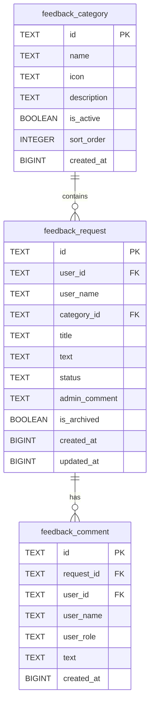
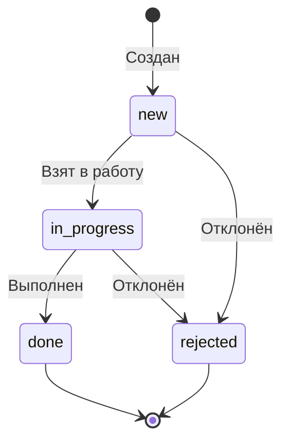

**Модуль:** Правки (Feedback)

---

## Стек технологий

| Компонент | Технология |
|-----------|------------|
| Frontend | SvelteKit, shadcn-svelte, TailwindCSS |
| Backend | Python, FastAPI |
| Database | PostgreSQL (внутренняя БД Open WebUI) |
| Auth | JWT Bearer tokens |

## Схема данных

## Статусы запросов

## Автоматические миграции

При старте бэкенда:
1. Создаются таблицы `feedback_category`, `feedback_request`, `feedback_comment` если не существуют
2. Добавляется колонка `is_archived` в `feedback_request` если отсутствует
3. Добавляется колонка `icon` в `feedback_category` если отсутствует
4. NULL значения `is_archived` обновляются на FALSE

## Иконки разделов

Два типа иконок:
- **Пресетные модули** — SVG из `/static/{module}-icon.svg` (content-factory, reputation, watcher и др.)
- **Кастомные** — lucide SVG inline (message-square, bug, sparkles, settings и 20+ других)

Иконка хранится в поле `icon` таблицы `feedback_category`.
