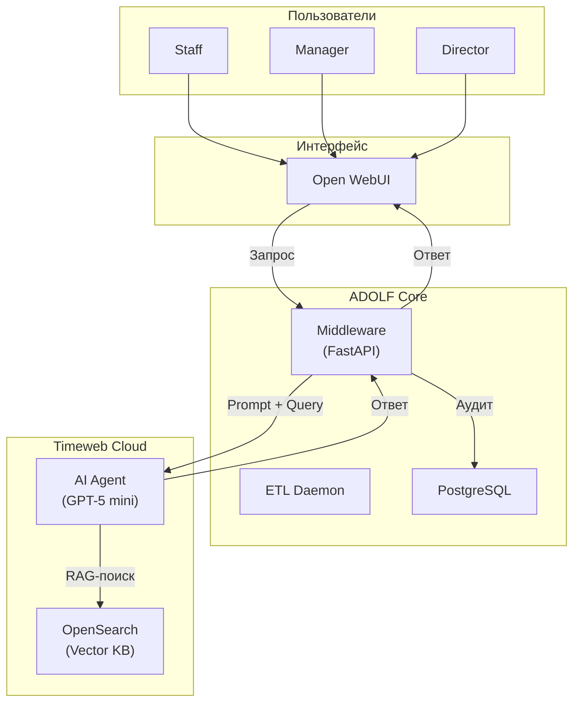
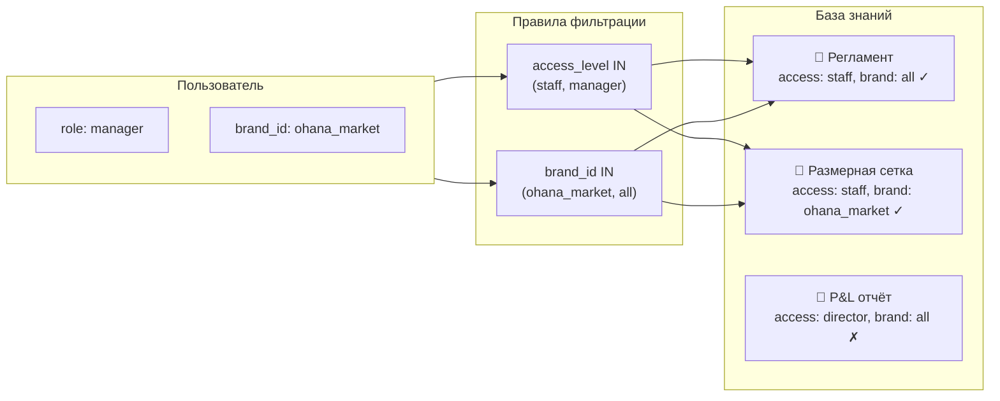

**Проект:** Корпоративная база знаний с RAG  
**Модуль:** Knowledge  
**Версия:** 1.1  
**Дата:** Январь 2026

---

## 1.1. Назначение модуля

Adolf Knowledge — модуль корпоративной базы знаний с интеллектуальным поиском на основе технологии RAG (Retrieval-Augmented Generation).

**Основные функции:**

- Ответы на вопросы сотрудников по внутренним документам компании
- Поиск информации о товарах (размерные сетки, состав тканей, характеристики)
- Предоставление актуальных регламентов и инструкций
- Разграничение доступа к документам по ролям и брендам

**Целевые пользователи:**

| Роль | Типичные запросы |
|------|------------------|
| Staff | Как оформить возврат? Какой состав у артикула X? |
| Manager | Регламент работы с браком, размерная сетка бренда |
| Senior | Условия договора с поставщиком, KPI отдела |
| Director | Финансовые отчёты, себестоимость, P&L |

**Ключевые характеристики:**

- Время ответа: < 5 секунд
- Источник ответа: всегда указывается документ-источник
- Фильтрация: автоматическая, на основе прав пользователя

---

## 1.2. Границы модуля

### Входит в модуль Knowledge

| Компонент | Описание |
|-----------|----------|
| RAG-пайплайн | Обработка запроса → поиск → генерация ответа |
| Prompt-инъекция | Формирование system prompt с правилами фильтрации |
| Интеграция с Timeweb KB | Загрузка документов, поисковые запросы |
| Конвертация документов | Преобразование PDF, DOCX, XLSX → MD (через ETL Core) |
| Автоклассификация | Определение category, access_level, brand_id |
| YAML-метаданные | Заголовки документов для фильтрации |

### Не входит в модуль Knowledge

| Компонент | Где реализовано |
|-----------|-----------------|
| Авторизация пользователей | ADOLF Core (Middleware) |
| Хранение пользователей и ролей | ADOLF Core (PostgreSQL) |
| Chunking и embeddings | Timeweb KB (автоматически) |
| Векторный поиск | Timeweb OpenSearch (managed) |
| Генерация ответов (LLM) | Timeweb AI Agent (GPT-5 mini) |
| Обратная связь по ответам | ADOLF 2.0 |

---

## 1.3. Зависимости от ADOLF Core

### 1.3.1. ETL Daemon

- Мониторинг папки `/inbox` для новых документов
- Конвертация PDF, DOCX, XLSX в формат Markdown
- OCR для сканированных документов (через OpenAI Vision)
- Вызов автоклассификатора для определения метаданных
- Добавление YAML-заголовка к документу
- Загрузка готового `.md` файла в Timeweb KB

### 1.3.2. Middleware

- Определение роли и брендов текущего пользователя
- Формирование prompt-инъекции с правилами фильтрации
- Проксирование запросов к Timeweb AI Agent
- Логирование запросов и ответов в `audit_log`

### 1.3.3. PostgreSQL

| Таблица | Назначение |
|---------|------------|
| `users` | Роль, привязка к брендам |
| `documents` | Метаданные загруженных документов |
| `audit_log` | История запросов к базе знаний |
| `quarantine` | Документы, не прошедшие валидацию |

### 1.3.4. Timeweb KB (OpenSearch)

- Хранение документов в векторном формате
- Автоматический chunking при загрузке
- Автоматическое создание embeddings
- Семантический поиск по запросу

---

## 1.4. Архитектура модуля

### 1.4.1. Общая схема

### 1.4.2. Схема разграничения доступа

---

## 1.5. Технические ограничения

| Параметр | Ограничение |
|----------|-------------|
| Максимальный размер файла | 50 МБ |
| Поддерживаемые форматы | PDF, DOCX, XLSX, MD, TXT, CSV |
| Время ответа (целевое) | < 5 секунд |
| Количество чанков в контексте | Top-3 |

---

**Документ подготовлен:** Январь 2026  
**Версия:** 1.1  
**Статус:** Согласовано
