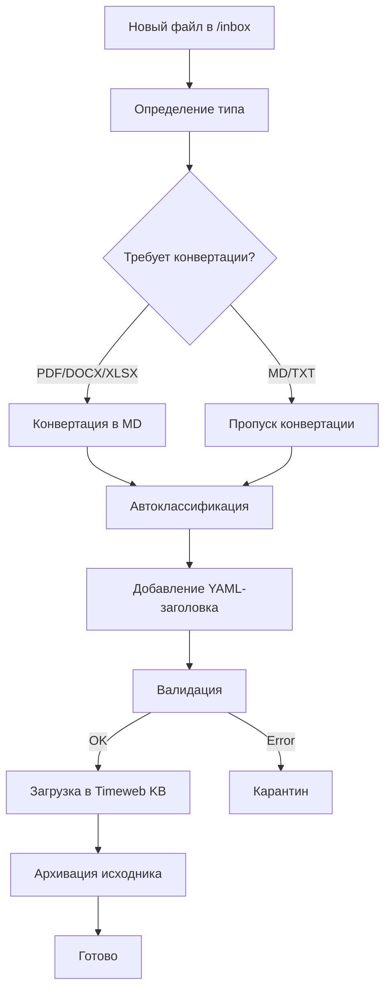

# ADOLF KNOWLEDGE — Раздел 2: Источники данных

**Проект:** Корпоративная база знаний с RAG  
**Модуль:** Knowledge / Data Sources  
**Версия:** 1.1  
**Дата:** Январь 2026

---

## 2.1. Типы источников данных

### Поддерживаемые форматы

| Формат | Расширения | Метод обработки | Примечания |
|--------|------------|-----------------|------------|
| PDF (текст) | `.pdf` | pdfplumber | Текстовые документы |
| PDF (скан) | `.pdf` | OpenAI Vision OCR | Сканированные документы |
| Word | `.docx` | python-docx | Документы MS Word |
| Excel | `.xlsx`, `.xls` | pandas + openpyxl | Таблицы → Markdown |
| Markdown | `.md` | Без конвертации | Готовые документы |
| Text | `.txt` | Без конвертации | Простой текст |
| CSV | `.csv` | pandas | Табличные данные |

### Ограничения

| Параметр | Значение |
|----------|----------|
| Максимальный размер файла | 50 МБ |
| Поддержка изображений | Только OCR, не индексируются |
| Поддержка видео | Не поддерживается |

---

## 2.2. Категории документов

### Список категорий

| Категория | Описание | Примеры |
|-----------|----------|---------|
| `product` | Информация о товарах | Каталоги, размерные сетки, составы |
| `regulation` | Регламенты и инструкции | Процедуры возврата, правила работы |
| `contract` | Договорная документация | Договоры с поставщиками |
| `finance` | Финансовые документы | Отчёты, P&L, бюджеты |
| `analytics` | Аналитика | Отчёты по продажам |
| `hr` | Кадровые документы | Должностные инструкции |
| `logistics` | Логистика | Регламенты склада |
| `marketing` | Маркетинг | Рекламные материалы |
| `technical` | Техническая документация | API, интеграции |
| `other` | Прочее | Не классифицированные |

### Автоматическая классификация

```python
CLASSIFICATION_PROMPT = """
Определи категорию документа на основе его содержания.

Документ: {text_preview}

Доступные категории:
- product: каталоги, размерные сетки, характеристики товаров
- regulation: регламенты, инструкции, процедуры
- contract: договоры, соглашения
- finance: финансовые отчёты, бюджеты
- analytics: аналитические отчёты
- hr: кадровые документы
- logistics: логистика, склад
- marketing: маркетинг, реклама
- technical: техническая документация
- other: прочее

Ответ в JSON: {"category": "..."}
"""
```

---

## 2.3. Уровни доступа

### Иерархия доступа

| Уровень | Роли с доступом | Типичные документы |
|---------|-----------------|-------------------|
| `staff` | Все | Базовые инструкции, каталоги товаров |
| `manager` | Manager, Senior, Director, Admin | Регламенты, рабочие инструкции |
| `senior` | Senior, Director, Admin | Договоры, KPI, аналитика |
| `director` | Director, Admin | Финансы, P&L, стратегия |
| `administrator` | Admin | Системные настройки |

### Правило фильтрации

```
Пользователь с ролью R имеет доступ к документам,
где access_level <= R в иерархии ролей.
```

---

## 2.4. Привязка к брендам

### Значения brand_id

| Значение | Описание |
|----------|----------|
| `ohana_market` | Документы бренда Охана Маркет |
| `ohana_kids` | Документы бренда Охана Кидс |
| `all` | Общие документы для всех брендов |

### Правило фильтрации по бренду

```
Пользователь с brand_id = B имеет доступ к документам,
где document.brand_id IN (B, 'all').

Пользователь с brand_id = 'all' имеет доступ ко всем документам.
```

---

## 2.5. YAML-заголовок документа

### Структура

```yaml
---
title: "Размерная сетка Охана Маркет 2026"
category: product
access_level: staff
brand_id: ohana_market
source_file: "razmer_setka_om_2026.xlsx"
uploaded_by: admin
uploaded_at: "2026-01-10T14:30:00Z"
version: 1
---
```

### Обязательные поля

| Поле | Тип | Описание |
|------|-----|----------|
| `title` | string | Название документа |
| `category` | enum | Категория документа |
| `access_level` | enum | Уровень доступа |
| `brand_id` | enum | Привязка к бренду |

### Опциональные поля

| Поле | Тип | Описание |
|------|-----|----------|
| `source_file` | string | Имя исходного файла |
| `uploaded_by` | string | Кто загрузил |
| `uploaded_at` | datetime | Дата загрузки |
| `version` | int | Версия документа |
| `tags` | array | Теги для поиска |

---

## 2.6. Процесс загрузки

### Диаграмма



---

## 2.7. Валидация документов

### Правила валидации

| Правило | Условие | Действие при нарушении |
|---------|---------|------------------------|
| Размер | ≤ 50 МБ | Карантин |
| Формат | Поддерживаемый | Карантин |
| Кодировка | UTF-8 | Попытка конвертации |
| YAML | Валидный синтаксис | Карантин |
| Поля | Все обязательные | Карантин |

### Карантин

Документы, не прошедшие валидацию, помещаются в карантин:
- Сохраняются в `/quarantine`
- Записываются в таблицу `quarantine`
- Требуют ручной обработки администратором

---

## Приложение А: Примеры документов

### Каталог товаров (product)

```yaml
---
title: "Каталог Охана Маркет Q1 2026"
category: product
access_level: staff
brand_id: ohana_market
---

# Каталог товаров Q1 2026

## Платья

| Артикул | Название | Состав | Размеры |
|---------|----------|--------|---------|
| OM-001 | Платье летнее | 95% хлопок, 5% эластан | 42-50 |
| OM-002 | Платье вечернее | 100% полиэстер | 42-48 |
```

### Регламент (regulation)

```yaml
---
title: "Регламент обработки возвратов"
category: regulation
access_level: manager
brand_id: all
---

# Регламент обработки возвратов

## 1. Общие положения
...
```

---

**Документ подготовлен:** Январь 2026  
**Версия:** 1.1  
**Статус:** Согласовано
