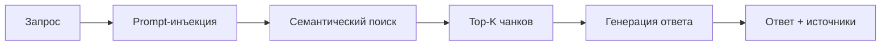
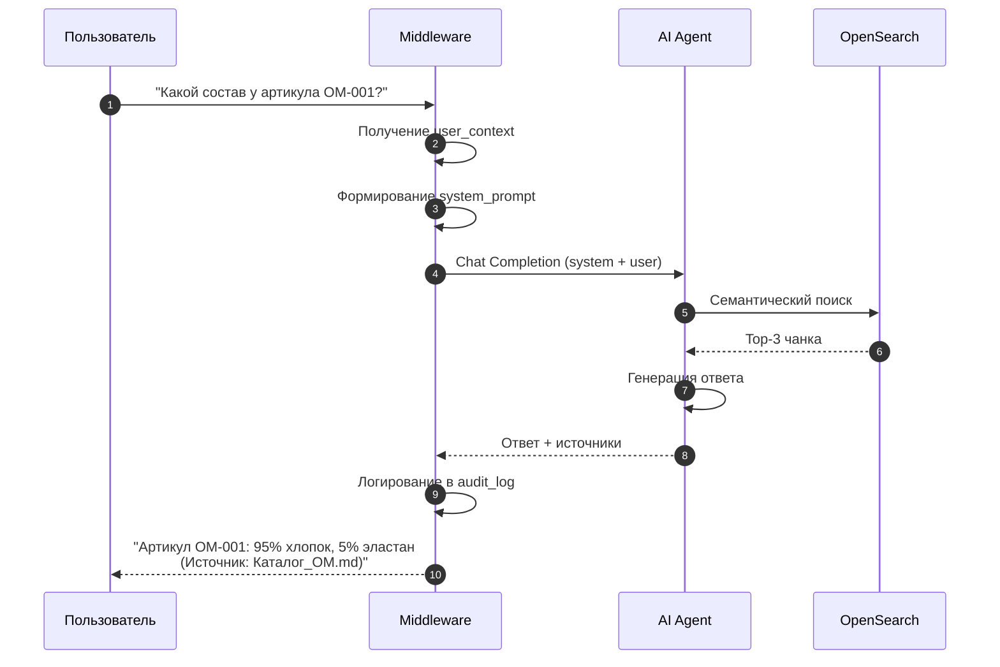

**Проект:** Корпоративная база знаний с RAG  
**Модуль:** Knowledge / RAG Pipeline  
**Версия:** 1.1  
**Дата:** Январь 2026

---

## 3.1. Обзор RAG Pipeline

### Назначение

RAG (Retrieval-Augmented Generation) Pipeline обеспечивает:
- Приём запроса пользователя
- Поиск релевантных документов
- Генерацию ответа на основе найденного контекста
- Фильтрацию по правам доступа

### Архитектура



---

## 3.2. Этапы обработки

### Этап 1: Получение контекста пользователя

```python
# Middleware извлекает данные пользователя
user_context = {
    "user_id": 5,
    "role": "manager",
    "brand_id": "ohana_market"
}
```

### Этап 2: Формирование prompt-инъекции

```python
def build_system_prompt(user_context: dict) -> str:
    role = user_context["role"]
    brand_id = user_context["brand_id"]
    
    # Определение доступных уровней
    role_hierarchy = {
        "staff": ["staff"],
        "manager": ["staff", "manager"],
        "senior": ["staff", "manager", "senior"],
        "director": ["staff", "manager", "senior", "director"],
        "administrator": ["staff", "manager", "senior", "director", "administrator"]
    }
    allowed_levels = role_hierarchy.get(role, ["staff"])
    
    # Определение доступных брендов
    if brand_id == "all":
        allowed_brands = ["ohana_market", "ohana_kids", "all"]
    else:
        allowed_brands = [brand_id, "all"]
    
    return f"""
Ты — корпоративный ассистент компании ОХАНА.

ПРАВИЛА ФИЛЬТРАЦИИ ДОКУМЕНТОВ:
- Используй ТОЛЬКО документы с access_level IN ({', '.join(allowed_levels)})
- Используй ТОЛЬКО документы с brand_id IN ({', '.join(allowed_brands)})
- НЕ показывай информацию из документов с другими access_level или brand_id

ПРАВИЛА ОТВЕТА:
- Всегда указывай источник информации
- Если информация не найдена — честно сообщи об этом
- Отвечай на русском языке
"""
```

### Этап 3: Семантический поиск

```python
# Запрос к Timeweb KB через AI Agent
search_params = {
    "query": user_query,
    "top_k": 3,
    "filters": {
        "access_level": allowed_levels,
        "brand_id": allowed_brands
    }
}
```

### Этап 4: Генерация ответа

```python
# AI Agent генерирует ответ с учётом контекста
messages = [
    {"role": "system", "content": system_prompt},
    {"role": "user", "content": f"""
Контекст из базы знаний:
{retrieved_chunks}

Вопрос пользователя: {user_query}

Ответь на основе контекста. Укажи источник.
"""}
]
```

---

## 3.3. Prompt-инъекция

### Структура System Prompt

```
┌─────────────────────────────────────────┐
│ 1. Роль ассистента                      │
│ 2. Правила фильтрации                   │
│    - Разрешённые access_level           │
│    - Разрешённые brand_id               │
│ 3. Правила ответа                       │
│    - Указание источника                 │
│    - Язык ответа                        │
│    - Поведение при отсутствии данных    │
└─────────────────────────────────────────┘
```

### Пример для Manager (ohana_market)

```
Ты — корпоративный ассистент компании ОХАНА.

ПРАВИЛА ФИЛЬТРАЦИИ:
- access_level IN (staff, manager)
- brand_id IN (ohana_market, all)

ПРАВИЛА ОТВЕТА:
- Указывай источник: "Согласно документу 'Название'"
- Если информация не найдена — сообщи об этом
- Отвечай на русском языке
```

---

## 3.4. Обработка запроса

### Sequence Diagram



---

## 3.5. Параметры поиска

### Настройки по умолчанию

| Параметр | Значение | Описание |
|----------|----------|----------|
| `top_k` | 3 | Количество возвращаемых чанков |
| `min_score` | 0.7 | Минимальный порог релевантности |
| `max_tokens` | 4000 | Максимальный размер контекста |

### Настройка через settings

```sql
INSERT INTO settings (key, value, category)
VALUES 
    ('knowledge_relevance_thresholds', 
     '{"high": 0.85, "medium": 0.7, "min": 0.5}', 
     'knowledge'),
    ('knowledge_history_limits',
     '{"max_db": 100, "max_llm": 20, "max_tokens": 4000}',
     'knowledge');
```

---

## 3.6. Форматирование ответа

### Структура ответа

```json
{
    "answer": "Артикул OM-001 имеет состав: 95% хлопок, 5% эластан.",
    "sources": [
        {
            "document": "Каталог_ОМ_2026.md",
            "chunk_id": "chunk_123",
            "relevance_score": 0.92
        }
    ],
    "confidence": "high"
}
```

### Уровни уверенности

| Уровень | Score | Описание |
|---------|-------|----------|
| `high` | ≥ 0.85 | Высокая релевантность |
| `medium` | 0.7 - 0.85 | Средняя релевантность |
| `low` | &lt; 0.7 | Низкая релевантность |

---

## 3.7. Обработка ошибок

### Единая политика (Core)

| Параметр | Значение |
|----------|----------|
| Timeout запроса | 30 секунд |
| Retry стратегия | Exponential backoff: 1с → 2с → 4с |
| Максимум попыток | 3 |

### Типы ошибок

| Ошибка | Действие |
|--------|----------|
| Timeout AI Agent | Retry с backoff |
| Нет релевантных документов | Ответ "Информация не найдена" |
| Ошибка авторизации | HTTP 401 |
| Превышен лимит токенов | Сокращение контекста |

---

## 3.8. Логирование

### Запись в audit_log

```sql
INSERT INTO audit_log (user_id, action, entity_type, details)
VALUES (
    5, 
    'knowledge_query',
    'knowledge',
    '{
        "query": "Какой состав у артикула OM-001?",
        "chunks_retrieved": 3,
        "top_score": 0.92,
        "response_time_ms": 1250
    }'
);
```

---

## Приложение А: Примеры запросов

### Успешный запрос

```
Пользователь: Какая размерная сетка у бренда Охана Маркет?

Ассистент: Размерная сетка бренда Охана Маркет:

| Размер | Обхват груди | Обхват талии |
|--------|--------------|--------------|
| 42 | 84 см | 64 см |
| 44 | 88 см | 68 см |
| 46 | 92 см | 72 см |

(Источник: Размерная_сетка_ОМ_2026.md)
```

### Запрос без результатов

```
Пользователь: Какая зарплата у директора?

Ассистент: К сожалению, информация о заработной плате 
не найдена в доступных мне документах. Обратитесь 
в отдел кадров для получения этой информации.
```

---

**Документ подготовлен:** Январь 2026  
**Версия:** 1.1  
**Статус:** Согласовано
