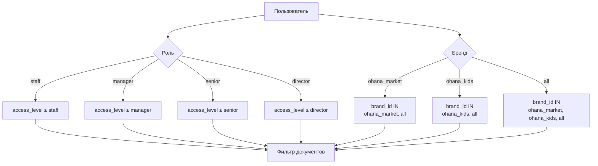

**Проект:** Корпоративная база знаний с RAG  
**Модуль:** Knowledge / Access Control  
**Версия:** 1.1  
**Дата:** Январь 2026

---

## 4.1. Модель доступа

### Принципы

- **Role-Based Access Control (RBAC)** — доступ на основе роли пользователя
- **Brand-Based Filtering** — фильтрация по принадлежности к бренду
- **Prompt-инъекция** — правила передаются в LLM как инструкции

### Схема доступа



---

## 4.2. Иерархия ролей

### Уровни доступа

| Роль | Уровень | Доступные access_level |
|------|---------|------------------------|
| Staff | 1 | staff |
| Manager | 2 | staff, manager |
| Senior | 3 | staff, manager, senior |
| Director | 4 | staff, manager, senior, director |
| Administrator | 5 | все уровни |

### Правило иерархии

```
Пользователь с ролью R имеет доступ к документам,
где access_level <= уровень(R)
```

---

## 4.3. Фильтрация по брендам

### Значения brand_id

| Значение | Описание | Доступ |
|----------|----------|--------|
| `ohana_market` | Бренд Охана Маркет | Сотрудники бренда + all |
| `ohana_kids` | Бренд Охана Кидс | Сотрудники бренда + all |
| `all` | Общие документы | Все сотрудники |

### Правило фильтрации

```python
def get_allowed_brands(user_brand_id: str) -> list:
    if user_brand_id == "all":
        return ["ohana_market", "ohana_kids", "all"]
    return [user_brand_id, "all"]
```

---

## 4.4. Матрица доступа

### Документы × Роли

| Документ | access_level | brand_id | Staff | Manager | Senior | Director |
|----------|--------------|----------|:-----:|:-------:|:------:|:--------:|
| Каталог товаров | staff | ohana_market | ✅* | ✅* | ✅ | ✅ |
| Регламент возврата | staff | all | ✅ | ✅ | ✅ | ✅ |
| Условия поставщика | manager | ohana_market | ❌ | ✅* | ✅ | ✅ |
| KPI отдела | senior | all | ❌ | ❌ | ✅ | ✅ |
| P&L отчёт | director | all | ❌ | ❌ | ❌ | ✅ |
| Прайс Охана Кидс | manager | ohana_kids | ❌ | ✅** | ✅ | ✅ |

\* — только для сотрудников ohana_market  
\** — только для сотрудников ohana_kids

---

## 4.5. Реализация фильтрации

### Prompt-инъекция

```python
FILTER_PROMPT = """
СТРОГИЕ ПРАВИЛА ФИЛЬТРАЦИИ:

1. Используй ТОЛЬКО документы, где:
   - access_level IN ({allowed_levels})
   - brand_id IN ({allowed_brands})

2. НИКОГДА не показывай информацию из документов:
   - С более высоким access_level
   - С другим brand_id

3. Если документ не соответствует фильтрам — игнорируй его полностью.

4. Если релевантная информация найдена только в запрещённых документах — 
   ответь "Информация не найдена в доступных документах".
"""
```

### Генерация фильтров

```python
def generate_filter_prompt(user_context: dict) -> str:
    role = user_context["role"]
    brand_id = user_context["brand_id"]
    
    # Иерархия ролей
    role_levels = {
        "staff": ["staff"],
        "manager": ["staff", "manager"],
        "senior": ["staff", "manager", "senior"],
        "director": ["staff", "manager", "senior", "director"],
        "administrator": ["staff", "manager", "senior", "director", "administrator"]
    }
    
    allowed_levels = role_levels.get(role, ["staff"])
    allowed_brands = get_allowed_brands(brand_id)
    
    return FILTER_PROMPT.format(
        allowed_levels=", ".join(allowed_levels),
        allowed_brands=", ".join(allowed_brands)
    )
```

---

## 4.6. Ограничения метода

### Особенности prompt-инъекции

| Аспект | Описание |
|--------|----------|
| Надёжность | Зависит от следования LLM инструкциям |
| Гарантии | Нет 100% гарантии на уровне БД |
| Аудит | Логирование всех запросов |

### Рекомендации

1. **Критичные данные** — не загружать в общую KB
2. **Регулярный аудит** — проверка логов доступа
3. **Тестирование** — периодическая проверка фильтрации

---

## 4.7. Примеры фильтрации

### Пример 1: Manager ohana_market

```
Пользователь: Покажи все документы

Фильтры:
- access_level IN (staff, manager)
- brand_id IN (ohana_market, all)

Доступные документы:
✅ Каталог Охана Маркет (staff, ohana_market)
✅ Регламент возврата (staff, all)
✅ Условия поставщика ОМ (manager, ohana_market)
❌ KPI отдела (senior, all) — недостаточно прав
❌ Прайс Охана Кидс (manager, ohana_kids) — другой бренд
```

### Пример 2: Senior all

```
Пользователь: Покажи все документы

Фильтры:
- access_level IN (staff, manager, senior)
- brand_id IN (ohana_market, ohana_kids, all)

Доступные документы:
✅ Все документы staff/manager/senior
✅ Документы обоих брендов
❌ P&L отчёт (director, all) — недостаточно прав
```

---

## 4.8. Аудит доступа

### Логирование

Все запросы к Knowledge логируются:

```sql
INSERT INTO audit_log (user_id, action, entity_type, details)
VALUES (
    5,
    'knowledge_query',
    'knowledge',
    '{
        "query": "...",
        "user_role": "manager",
        "user_brand": "ohana_market",
        "filters_applied": {
            "access_level": ["staff", "manager"],
            "brand_id": ["ohana_market", "all"]
        }
    }'
);
```

### Отчёт по доступу

```sql
-- Запросы по ролям за последний месяц
SELECT 
    details->>'user_role' as role,
    COUNT(*) as queries
FROM audit_log
WHERE action = 'knowledge_query'
  AND created_at > NOW() - INTERVAL '30 days'
GROUP BY details->>'user_role';
```

---

**Документ подготовлен:** Январь 2026  
**Версия:** 1.1  
**Статус:** Согласовано
