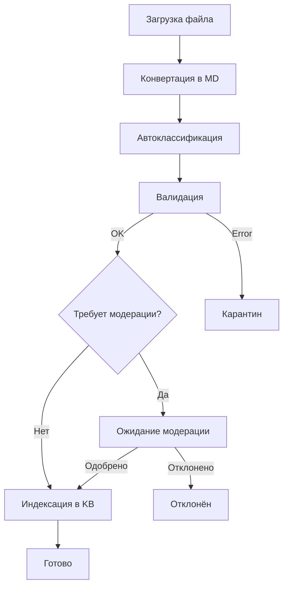
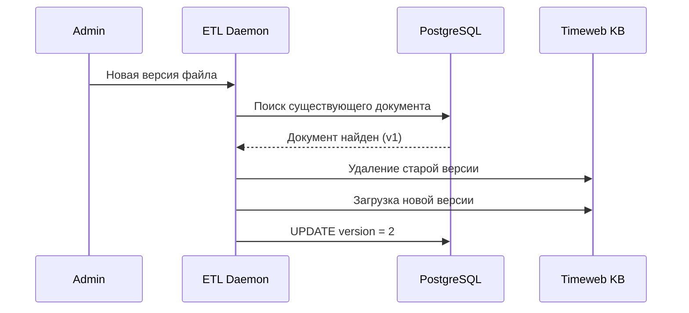

# ADOLF KNOWLEDGE — Раздел 5: KB Management

**Проект:** Корпоративная база знаний с RAG  
**Модуль:** Knowledge / KB Management  
**Версия:** 1.1  
**Дата:** Январь 2026

---

## 5.1. Управление базой знаний

### Операции с документами

| Операция | Описание | Кто выполняет |
|----------|----------|---------------|
| Загрузка | Добавление документа в KB | Senior, Admin |
| Обновление | Замена версии документа | Senior, Admin |
| Удаление | Удаление из KB | Admin |
| Модерация | Проверка перед публикацией | Senior |

### Workflow загрузки



---

## 5.2. Загрузка документов

### Способы загрузки

| Способ | Описание | Автоматизация |
|--------|----------|---------------|
| SFTP `/inbox` | Копирование файла в папку | Полная (ETL Daemon) |
| Web Interface | Загрузка через Open WebUI | Полуавтоматическая |

### Структура директорий

```
/data/
├── inbox/           # Входящие файлы
├── processing/      # В обработке
├── archive/         # Обработанные исходники
├── quarantine/      # Ошибки валидации
└── converted/       # Готовые .md файлы
```

### ETL Daemon

| Параметр | Значение |
|----------|----------|
| Интервал проверки | 30 секунд |
| Обработка | Последовательная |
| Уведомления | При ошибках |

---

## 5.3. Модерация документов

### Трёхуровневая валидация


| Уровень | Что проверяет | Автоматизация |
|---------|---------------|---------------|
| 1 | Формат, размер, кодировка | Автоматически |
| 2 | category, access_level, brand_id | AI + правила |
| 3 | Содержание, корректность | Ручная (Senior) |

### Требования к модерации

Документы требуют модерации Senior если:
- access_level >= `senior`
- category = `contract` или `finance`
- Автоклассификатор не уверен (confidence < 0.8)

### API модерации

```python
# Endpoints для модерации
POST /api/v1/knowledge/documents/{id}/approve  # Одобрить
POST /api/v1/knowledge/documents/{id}/reject   # Отклонить
GET  /api/v1/knowledge/documents/pending       # Список на модерацию
```

---

## 5.4. Метаданные в PostgreSQL

### Таблица documents

```sql
-- Хранение метаданных документов
CREATE TABLE documents (
    id SERIAL PRIMARY KEY,
    filename VARCHAR(255) NOT NULL,
    title VARCHAR(255) NOT NULL,
    category VARCHAR(50) NOT NULL,
    access_level VARCHAR(20) NOT NULL,
    brand_id VARCHAR(50) NOT NULL,
    status VARCHAR(20) DEFAULT 'pending',
    kb_file_id VARCHAR(100),       -- ID в Timeweb KB
    uploaded_by INT REFERENCES users(id),
    moderated_by INT REFERENCES users(id),
    version INT DEFAULT 1,
    file_size_bytes INT,
    original_format VARCHAR(10),
    created_at TIMESTAMP DEFAULT NOW(),
    moderated_at TIMESTAMP,
    indexed_at TIMESTAMP
);
```

### Статусы документов

| Статус | Описание |
|--------|----------|
| `pending` | Ожидает модерации |
| `approved` | Одобрен |
| `rejected` | Отклонён |
| `indexed` | Загружен в KB |
| `quarantine` | В карантине |

---

## 5.5. Интеграция с Timeweb KB

### API Timeweb KB

| Операция | Endpoint | Метод |
|----------|----------|-------|
| Загрузка файла | `/api/knowledge/upload` | POST |
| Удаление файла | `/api/knowledge/files/{id}` | DELETE |
| Список файлов | `/api/knowledge/files` | GET |
| Поиск | `/api/knowledge/search` | POST |

### Загрузка документа

```python
async def upload_to_kb(file_path: str, metadata: dict) -> str:
    """Загрузка документа в Timeweb KB."""
    
    with open(file_path, 'rb') as f:
        files = {'file': (os.path.basename(file_path), f, 'text/markdown')}
        
        response = await kb_client.post(
            '/api/knowledge/upload',
            files=files,
            data={'metadata': json.dumps(metadata)}
        )
    
    return response.json()['file_id']
```

---

## 5.6. Версионирование

### Политика версий

| Аспект | Решение |
|--------|---------|
| Хранение версий | Только последняя версия в KB |
| История | Метаданные в PostgreSQL |
| Откат | Ручной (Admin) |

### Обновление документа



---

## 5.7. Карантин

### Причины попадания в карантин

| Причина | Действие |
|---------|----------|
| Неподдерживаемый формат | Ручная конвертация |
| Размер > 50 МБ | Разбиение на части |
| Ошибка OCR | Ручной ввод текста |
| Ошибка классификации | Ручная классификация |
| Невалидная кодировка | Конвертация кодировки |

### Таблица quarantine

```sql
CREATE TABLE quarantine (
    id SERIAL PRIMARY KEY,
    filename VARCHAR(255) NOT NULL,
    file_path VARCHAR(500),
    error_type VARCHAR(50),
    error_message TEXT,
    created_at TIMESTAMP DEFAULT NOW(),
    resolved_at TIMESTAMP,
    resolved_by INT REFERENCES users(id)
);
```

---

## 5.8. Политика хранения

### Retention Policy

| Тип данных | Срок хранения |
|------------|---------------|
| Документы в KB | Бессрочно |
| Исходники в archive | 90 дней |
| Карантин | 30 дней |
| Метаданные | Бессрочно |

### Очистка

```python
# Celery task: cleanup_archive (еженедельно)
@shared_task
def cleanup_archive():
    """Удаление старых исходников из archive."""
    cutoff = datetime.now() - timedelta(days=90)
    
    for file in Path('/data/archive').iterdir():
        if file.stat().st_mtime < cutoff.timestamp():
            file.unlink()
```

---

## 5.9. Мониторинг KB

### Метрики

| Метрика | Описание |
|---------|----------|
| Количество документов | Всего в KB |
| Документов на модерации | Ожидают проверки |
| В карантине | Требуют внимания |
| Загрузок за день | Активность |

### Dashboard запросы

```sql
-- Статистика по документам
SELECT 
    status,
    COUNT(*) as count
FROM documents
GROUP BY status;

-- Документы по категориям
SELECT 
    category,
    COUNT(*) as count
FROM documents
WHERE status = 'indexed'
GROUP BY category;
```

---

**Документ подготовлен:** Январь 2026  
**Версия:** 1.1  
**Статус:** Согласовано
